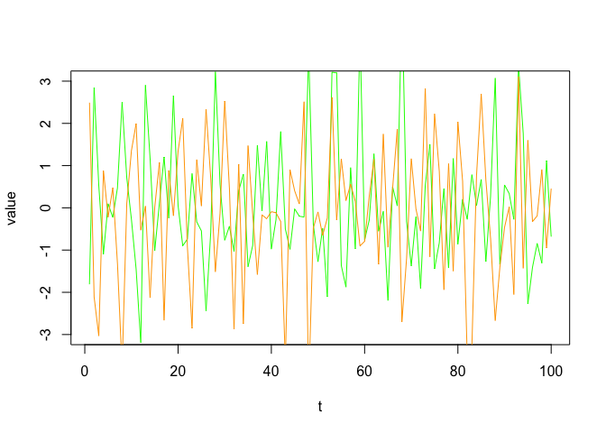
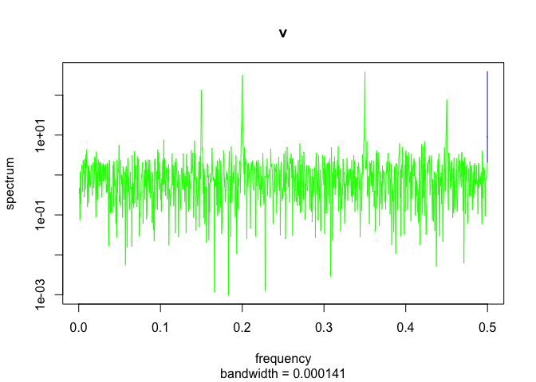

<!-- README.md is generated from README.Rmd. Please edit that file -->

# rhosa – Higher-Order Spectral Analysis in R

<!-- badges: start -->

[](https://travis-ci.com/tabe/rhosa)
[](https://CRAN.R-project.org/package=rhosa)
[](https://github.com/tabe/rhosa/actions)
<!-- badges: end -->

This package aims to provide functions to analyze and estimate
higher-order spectra or polyspectra of multivariate time series, such as
bispectrum and bicoherence ([Brillinger and Irizarry
1998](#ref-brillinger_investigation_1998)).

## Installation

You can install the released version of rhosa from
[CRAN](https://CRAN.R-project.org) with:

``` r
install.packages("rhosa")
```

Alternatively, the development version from
[GitHub](https://github.com/) with
[remotes](https://cran.r-project.org/package=remotes):

``` r
# install.packages("remotes")
remotes::install_github("tabe/rhosa")
```

## Example

This is a simple example, based on the outline at Figure 1 of ([Villa
and Tetko 2010](#ref-villa_cross-frequency_2010)), which demonstrates
how to use rhosa’s functions to find an obscure relationship between two
frequencies in some time series imitated by a generative model.

With four cosinusoidal waves having arbitrarily different phases
(`omega_a`, `omega_b`, `omega_c`, and `omega_d`), but sharing a couple
of frequencies (`f_1` and `f_2`), we define function `D(t)` to simulate
a pair of time series: `v` and `w`. We make them noisy by adding an
independent random variate that follows the standard normal
distribution.

``` r
set.seed(1)
f_1 <- 0.35
f_2 <- 0.2
D <- function(t) {
    omega_a <- runif(1, min = 0, max = 2 * pi)
    omega_b <- runif(1, min = 0, max = 2 * pi)
    omega_c <- runif(1, min = 0, max = 2 * pi)
    omega_d <- runif(1, min = 0, max = 2 * pi)
    wave_a <- function(t) cos(2 * pi * f_1 * t + omega_a)
    wave_b <- function(t) cos(2 * pi * f_2 * t + omega_b)
    wave_c <- function(t) cos(2 * pi * f_1 * t + omega_c)
    wave_d <- function(t) cos(2 * pi * f_2 * t + omega_d)
    curve_v <- function(t) wave_a(t) + wave_b(t) + wave_a(t) * wave_b(t)
    curve_w <- function(t) wave_c(t) + wave_d(t) + wave_c(t) * wave_b(t)
    data.frame(v = curve_v(t) + rnorm(length(t)),
               w = curve_w(t) + rnorm(length(t)))
}
```

Both `v` and `w` are oscillatory in principle:

``` r
data <- D(seq_len(2048))
with(data, {
    plot(seq_len(100), head(v, 100), type = "l", col = "green", ylim = c(-3, 3), xlab = "t", ylab = "value")
    lines(seq_len(100), head(w, 100), col = "orange")
})
```



It is noteworthy that the power spectrum densities of `v` and `w` are
basically identical as shown in their spectral density estimation:

``` r
with(data, {
    spectrum(v, main = "v", col = "green")
    spectrum(w, main = "w", col = "orange")
})
```



On the other hand, their bispectra are different. More specifically, we
are going to see that their bicoherence at some pairs of frequencies are
different. rhosa’s `bicoherence` function allows us to estimate the
magnitude-squared bicoherence from samples.

``` r
x <- replicate(100, D(seq_len(128)), simplify = FALSE)
m_v <- do.call(cbind, Map(function(d) {d$v}, x))
m_w <- do.call(cbind, Map(function(d) {d$w}, x))

library(rhosa)

bc_v <- bicoherence(m_v, window_function = 'hamming')
bc_w <- bicoherence(m_w, window_function = 'hamming')
```

In the above code, we take 100 samples of the same length for a smoother
result. The `bicoherence` function accepts a matrix whose column
represents a sample sequence, and returns a data frame. Note that an
optional argument to `bicoherence` is given for requesting tapering with
Hamming [window
function](https://en.wikipedia.org/wiki/Window_function).

``` r
library(ggplot2)

plot_bicoherence <- function(bc) {
    ggplot(bc, aes(f1, f2)) +
        geom_raster(aes(fill = value)) +
        scale_fill_gradient(limits = c(0, 10)) +
        coord_fixed()
}
```

The axis `f1` and `f2` represent normalized frequencies in unit
cycles/sample of range `[0, 1)`. Frequency pairs of bright points in the
following plot of `bc_v` indicate the existence of some quadratic phase
coupling, as expected:

``` r
plot_bicoherence(bc_v)
```


In contrast, `bc_w` has no peaks at frequency pair
`(f_1, f_2) = (0.35, 0.2)`, etc.:

``` r
plot_bicoherence(bc_w)
```


## Acknowledgement

The author thanks Alessandro E. P. Villa for his generous support to
this project.

## References

<div id="refs" class="references csl-bib-body hanging-indent">

<div id="ref-brillinger_investigation_1998" class="csl-entry">

Brillinger, D. R., and R. A. Irizarry. 1998. “An Investigation of the
Second- and Higher-Order Spectra of Music.” *Signal Processing* 65 (2):
161–79. <https://doi.org/10.1016/S0165-1684(97)00217-X>.

</div>

<div id="ref-villa_cross-frequency_2010" class="csl-entry">

Villa, Alessandro E. P., and Igor V. Tetko. 2010. “Cross-Frequency
Coupling in Mesiotemporal EEG Recordings of Epileptic Patients.”
*Journal of Physiology-Paris*, Neural Coding, 104 (3): 197–202.
<https://doi.org/10.1016/j.jphysparis.2009.11.024>.

</div>

</div>
