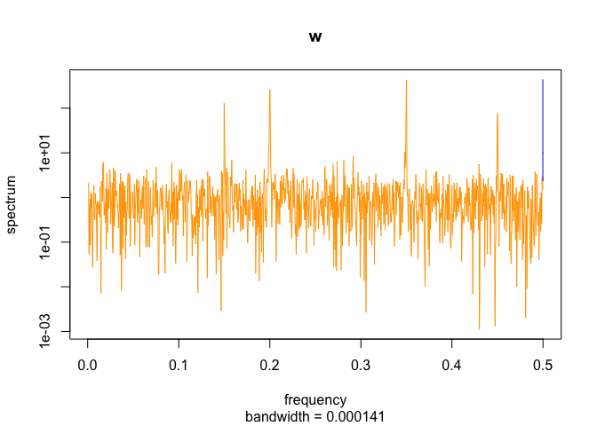

<!-- README.md is generated from README.Rmd. Please edit that file -->

# rhosa – Higher-order spectral analysis in R

<!-- badges: start -->

<!-- badges: end -->

This package aims to provide functions to analyze and estimate
higher-order spectra or polyspectra of multivariate time series, such as
bispectrum and bicoherence \[1\].

## Installation

You can install the released version of rhosa from
[CRAN](https://CRAN.R-project.org) with:

``` r
install.packages("rhosa")
```

Alternatively, the development version from
[GitHub](https://github.com/) with
[remotes](https://cran.r-project.org/package=remotes):

``` r
# install.packages("remotes")
remotes::install_github("tabe/rhosa")
```

## Example

This is an example, based on the outline at Figure 1 of \[2\], which
shows how to use rhosa’s functions in the simplest way.

First of all, let’s load and attach rhosa.

``` r
library(rhosa)
#> Welcome to rhosa
```

With four consinusoidal waves having arbitrarily different phases
(`omega_a`, `omega_b`, `omega_c`, and `omega_d`), but sharing a couple
of frequencies (`f_1` and `f_2`), we define two functions `func_v` and
`func_w` to simulate stationary time series:

``` r
set.seed(1)
f_1 <- 0.1
f_2 <- 0.25
omega_a <- runif(1, min = 0, max = 2 * pi)
omega_b <- runif(1, min = 0, max = 2 * pi)
omega_c <- runif(1, min = 0, max = 2 * pi)
omega_d <- runif(1, min = 0, max = 2 * pi)
wave_a <- function(t) cos(2 * pi * f_1 * t + omega_a)
wave_b <- function(t) cos(2 * pi * f_2 * t + omega_b)
wave_c <- function(t) cos(2 * pi * f_1 * t + omega_c)
wave_d <- function(t) cos(2 * pi * f_2 * t + omega_d)
func_v <- function(t) wave_a(t) + wave_b(t) + wave_a(t) * wave_b(t)
func_w <- function(t) wave_c(t) + wave_d(t) + wave_c(t) * wave_b(t)
```

Both are oscillatory of course:

``` r
plot(func_v, 0, 100, n = 10001, col = "green", ylim = c(-3, 3), xlab = "t", ylab = "value")
plot(func_w, 0, 100, n = 10001, col = "orange", add = TRUE)
```

<div class="figure">


<p class="caption">

func\_v and func\_w.

</p>

</div>

Then, obtain 10,000 samples from these time series in a fixed rate, with
adding noises generated by the standard normal distribution; call them
`v` and `w`.

``` r
raw_v <- sapply(1:10000, func_v)
raw_w <- sapply(1:10000, func_w)
v <- raw_v + rnorm(length(raw_v))
w <- raw_w + rnorm(length(raw_w))
```

Their first 100 samples looks like as follows:

``` r
plot(1:100, v[1:100], type = "l", col = "green", ylim = c(-3, 3), xlab = "t", ylab = "value")
lines(1:100, w[1:100], col = "orange")
```

<div class="figure">


<p class="caption">

v and w.

</p>

</div>

It is noteworthy that these time series’ power spectrum densities are
basically identical as shown in their spectral density estimation:

``` r
spectrum(v, main = "v", col = "green")
spectrum(w, main = "w", col = "orange")
```

<div class="figure">



<p class="caption">

Spectral density estimation from periodograms.

</p>

</div>

On the other hand, we are going to see that their bispectra are
different. Before estimating bispectrum, you may consider dividing
samples into epochs or stretches of the same length for smoother
results. rhosa’s `bispectrum` function accepts a matrix whose column
represents an epoch, and returns a data frame as its result.

``` r
m_v <- matrix(v, ncol = 100)
m_w <- matrix(w, ncol = 100)
bs_v <- bispectrum(m_v)
bs_w <- bispectrum(m_w)
```

Because bispectrum is complex-valued at each frequency pair, you will
find 3D plots are useful for visualizing results. Here we use
[rgl](https://cran.r-project.org/package=rgl):

``` r
# install.packages("rgl")
library(rgl)
```

… and define a couple of R functions to plot estimated bispectrum in the
polar coordinates:

``` r
plot_bispectrum <- function(bs) {
    with(bs, {
        open3d()
        mfrow3d(nr = 1, nc = 2, sharedMouse = TRUE)
        plot3d(f1, f2, Mod(value), col = ifelse(Mod(value) > 1, "red", "blue"))
        grid3d(c("x", "y+", "z"))
        next3d()
        plot3d(f1, f2, Arg(value), col = ifelse(Mod(value) > 1, "red", "green"))
        grid3d(c("x", "y+", "z"))
    })
}
```

Each line of the following snippets shows an interactive 3D point plot.
The f1 and f2 axis represent normalized frequencies in unit
cycles/sample of range \[0, 1). While the modulus (or the absolute
value) of the estimated complex values is plotted on the left side, the
argument (or the angle) of them is on the right. A red point in the both
sides indicates the higher absoute value than 1.

``` r
plot_bispectrum(bs_v)
```

<script>/*
* Copyright (C) 2009 Apple Inc. All Rights Reserved.
*
* Redistribution and use in source and binary forms, with or without
* modification, are permitted provided that the following conditions
* are met:
* 1. Redistributions of source code must retain the above copyright
*    notice, this list of conditions and the following disclaimer.
* 2. Redistributions in binary form must reproduce the above copyright
*    notice, this list of conditions and the following disclaimer in the
*    documentation and/or other materials provided with the distribution.
*
* THIS SOFTWARE IS PROVIDED BY APPLE INC. ``AS IS'' AND ANY
* EXPRESS OR IMPLIED WARRANTIES, INCLUDING, BUT NOT LIMITED TO, THE
* IMPLIED WARRANTIES OF MERCHANTABILITY AND FITNESS FOR A PARTICULAR
* PURPOSE ARE DISCLAIMED.  IN NO EVENT SHALL APPLE INC. OR
* CONTRIBUTORS BE LIABLE FOR ANY DIRECT, INDIRECT, INCIDENTAL, SPECIAL,
* EXEMPLARY, OR CONSEQUENTIAL DAMAGES (INCLUDING, BUT NOT LIMITED TO,
* PROCUREMENT OF SUBSTITUTE GOODS OR SERVICES; LOSS OF USE, DATA, OR
* PROFITS; OR BUSINESS INTERRUPTION) HOWEVER CAUSED AND ON ANY THEORY
* OF LIABILITY, WHETHER IN CONTRACT, STRICT LIABILITY, OR TORT
* (INCLUDING NEGLIGENCE OR OTHERWISE) ARISING IN ANY WAY OUT OF THE USE
* OF THIS SOFTWARE, EVEN IF ADVISED OF THE POSSIBILITY OF SUCH DAMAGE.
* Copyright (2016) Duncan Murdoch - fixed CanvasMatrix4.ortho,
* cleaned up.
*/
/*
CanvasMatrix4 class
This class implements a 4x4 matrix. It has functions which
duplicate the functionality of the OpenGL matrix stack and
glut functions.
IDL:
[
Constructor(in CanvasMatrix4 matrix),           // copy passed matrix into new CanvasMatrix4
Constructor(in sequence<float> array)           // create new CanvasMatrix4 with 16 floats (row major)
Constructor()                                   // create new CanvasMatrix4 with identity matrix
]
interface CanvasMatrix4 {
attribute float m11;
attribute float m12;
attribute float m13;
attribute float m14;
attribute float m21;
attribute float m22;
attribute float m23;
attribute float m24;
attribute float m31;
attribute float m32;
attribute float m33;
attribute float m34;
attribute float m41;
attribute float m42;
attribute float m43;
attribute float m44;
void load(in CanvasMatrix4 matrix);                 // copy the values from the passed matrix
void load(in sequence<float> array);                // copy 16 floats into the matrix
sequence<float> getAsArray();                       // return the matrix as an array of 16 floats
WebGLFloatArray getAsCanvasFloatArray();           // return the matrix as a WebGLFloatArray with 16 values
void makeIdentity();                                // replace the matrix with identity
void transpose();                                   // replace the matrix with its transpose
void invert();                                      // replace the matrix with its inverse
void translate(in float x, in float y, in float z); // multiply the matrix by passed translation values on the right
void scale(in float x, in float y, in float z);     // multiply the matrix by passed scale values on the right
void rotate(in float angle,                         // multiply the matrix by passed rotation values on the right
in float x, in float y, in float z);    // (angle is in degrees)
void multRight(in CanvasMatrix matrix);             // multiply the matrix by the passed matrix on the right
void multLeft(in CanvasMatrix matrix);              // multiply the matrix by the passed matrix on the left
void ortho(in float left, in float right,           // multiply the matrix by the passed ortho values on the right
in float bottom, in float top,
in float near, in float far);
void frustum(in float left, in float right,         // multiply the matrix by the passed frustum values on the right
in float bottom, in float top,
in float near, in float far);
void perspective(in float fovy, in float aspect,    // multiply the matrix by the passed perspective values on the right
in float zNear, in float zFar);
void lookat(in float eyex, in float eyey, in float eyez,    // multiply the matrix by the passed lookat
in float ctrx, in float ctry, in float ctrz,    // values on the right
in float upx, in float upy, in float upz);
}
*/
CanvasMatrix4 = function(m)
{
if (typeof m == 'object') {
if ("length" in m && m.length >= 16) {
this.load(m[0], m[1], m[2], m[3], m[4], m[5], m[6], m[7], m[8], m[9], m[10], m[11], m[12], m[13], m[14], m[15]);
return;
}
else if (m instanceof CanvasMatrix4) {
this.load(m);
return;
}
}
this.makeIdentity();
};
CanvasMatrix4.prototype.load = function()
{
if (arguments.length == 1 && typeof arguments[0] == 'object') {
var matrix = arguments[0];
if ("length" in matrix && matrix.length == 16) {
this.m11 = matrix[0];
this.m12 = matrix[1];
this.m13 = matrix[2];
this.m14 = matrix[3];
this.m21 = matrix[4];
this.m22 = matrix[5];
this.m23 = matrix[6];
this.m24 = matrix[7];
this.m31 = matrix[8];
this.m32 = matrix[9];
this.m33 = matrix[10];
this.m34 = matrix[11];
this.m41 = matrix[12];
this.m42 = matrix[13];
this.m43 = matrix[14];
this.m44 = matrix[15];
return;
}
if (arguments[0] instanceof CanvasMatrix4) {
this.m11 = matrix.m11;
this.m12 = matrix.m12;
this.m13 = matrix.m13;
this.m14 = matrix.m14;
this.m21 = matrix.m21;
this.m22 = matrix.m22;
this.m23 = matrix.m23;
this.m24 = matrix.m24;
this.m31 = matrix.m31;
this.m32 = matrix.m32;
this.m33 = matrix.m33;
this.m34 = matrix.m34;
this.m41 = matrix.m41;
this.m42 = matrix.m42;
this.m43 = matrix.m43;
this.m44 = matrix.m44;
return;
}
}
this.makeIdentity();
};
CanvasMatrix4.prototype.getAsArray = function()
{
return [
this.m11, this.m12, this.m13, this.m14,
this.m21, this.m22, this.m23, this.m24,
this.m31, this.m32, this.m33, this.m34,
this.m41, this.m42, this.m43, this.m44
];
};
CanvasMatrix4.prototype.getAsWebGLFloatArray = function()
{
return new WebGLFloatArray(this.getAsArray());
};
CanvasMatrix4.prototype.makeIdentity = function()
{
this.m11 = 1;
this.m12 = 0;
this.m13 = 0;
this.m14 = 0;
this.m21 = 0;
this.m22 = 1;
this.m23 = 0;
this.m24 = 0;
this.m31 = 0;
this.m32 = 0;
this.m33 = 1;
this.m34 = 0;
this.m41 = 0;
this.m42 = 0;
this.m43 = 0;
this.m44 = 1;
};
CanvasMatrix4.prototype.transpose = function()
{
var tmp = this.m12;
this.m12 = this.m21;
this.m21 = tmp;
tmp = this.m13;
this.m13 = this.m31;
this.m31 = tmp;
tmp = this.m14;
this.m14 = this.m41;
this.m41 = tmp;
tmp = this.m23;
this.m23 = this.m32;
this.m32 = tmp;
tmp = this.m24;
this.m24 = this.m42;
this.m42 = tmp;
tmp = this.m34;
this.m34 = this.m43;
this.m43 = tmp;
};
CanvasMatrix4.prototype.invert = function()
{
// Calculate the 4x4 determinant
// If the determinant is zero,
// then the inverse matrix is not unique.
var det = this._determinant4x4();
if (Math.abs(det) < 1e-8)
return null;
this._makeAdjoint();
// Scale the adjoint matrix to get the inverse
this.m11 /= det;
this.m12 /= det;
this.m13 /= det;
this.m14 /= det;
this.m21 /= det;
this.m22 /= det;
this.m23 /= det;
this.m24 /= det;
this.m31 /= det;
this.m32 /= det;
this.m33 /= det;
this.m34 /= det;
this.m41 /= det;
this.m42 /= det;
this.m43 /= det;
this.m44 /= det;
};
CanvasMatrix4.prototype.translate = function(x,y,z)
{
if (x === undefined)
x = 0;
if (y === undefined)
y = 0;
if (z === undefined)
z = 0;
var matrix = new CanvasMatrix4();
matrix.m41 = x;
matrix.m42 = y;
matrix.m43 = z;
this.multRight(matrix);
};
CanvasMatrix4.prototype.scale = function(x,y,z)
{
if (x === undefined)
x = 1;
if (z === undefined) {
if (y === undefined) {
y = x;
z = x;
}
else
z = 1;
}
else if (y === undefined)
y = x;
var matrix = new CanvasMatrix4();
matrix.m11 = x;
matrix.m22 = y;
matrix.m33 = z;
this.multRight(matrix);
};
CanvasMatrix4.prototype.rotate = function(angle,x,y,z)
{
// angles are in degrees. Switch to radians
angle = angle / 180 * Math.PI;
angle /= 2;
var sinA = Math.sin(angle);
var cosA = Math.cos(angle);
var sinA2 = sinA * sinA;
// normalize
var length = Math.sqrt(x * x + y * y + z * z);
if (length === 0) {
// bad vector, just use something reasonable
x = 0;
y = 0;
z = 1;
} else if (length != 1) {
x /= length;
y /= length;
z /= length;
}
var mat = new CanvasMatrix4();
// optimize case where axis is along major axis
if (x == 1 && y === 0 && z === 0) {
mat.m11 = 1;
mat.m12 = 0;
mat.m13 = 0;
mat.m21 = 0;
mat.m22 = 1 - 2 * sinA2;
mat.m23 = 2 * sinA * cosA;
mat.m31 = 0;
mat.m32 = -2 * sinA * cosA;
mat.m33 = 1 - 2 * sinA2;
mat.m14 = mat.m24 = mat.m34 = 0;
mat.m41 = mat.m42 = mat.m43 = 0;
mat.m44 = 1;
} else if (x === 0 && y == 1 && z === 0) {
mat.m11 = 1 - 2 * sinA2;
mat.m12 = 0;
mat.m13 = -2 * sinA * cosA;
mat.m21 = 0;
mat.m22 = 1;
mat.m23 = 0;
mat.m31 = 2 * sinA * cosA;
mat.m32 = 0;
mat.m33 = 1 - 2 * sinA2;
mat.m14 = mat.m24 = mat.m34 = 0;
mat.m41 = mat.m42 = mat.m43 = 0;
mat.m44 = 1;
} else if (x === 0 && y === 0 && z == 1) {
mat.m11 = 1 - 2 * sinA2;
mat.m12 = 2 * sinA * cosA;
mat.m13 = 0;
mat.m21 = -2 * sinA * cosA;
mat.m22 = 1 - 2 * sinA2;
mat.m23 = 0;
mat.m31 = 0;
mat.m32 = 0;
mat.m33 = 1;
mat.m14 = mat.m24 = mat.m34 = 0;
mat.m41 = mat.m42 = mat.m43 = 0;
mat.m44 = 1;
} else {
var x2 = x*x;
var y2 = y*y;
var z2 = z*z;
mat.m11 = 1 - 2 * (y2 + z2) * sinA2;
mat.m12 = 2 * (x * y * sinA2 + z * sinA * cosA);
mat.m13 = 2 * (x * z * sinA2 - y * sinA * cosA);
mat.m21 = 2 * (y * x * sinA2 - z * sinA * cosA);
mat.m22 = 1 - 2 * (z2 + x2) * sinA2;
mat.m23 = 2 * (y * z * sinA2 + x * sinA * cosA);
mat.m31 = 2 * (z * x * sinA2 + y * sinA * cosA);
mat.m32 = 2 * (z * y * sinA2 - x * sinA * cosA);
mat.m33 = 1 - 2 * (x2 + y2) * sinA2;
mat.m14 = mat.m24 = mat.m34 = 0;
mat.m41 = mat.m42 = mat.m43 = 0;
mat.m44 = 1;
}
this.multRight(mat);
};
CanvasMatrix4.prototype.multRight = function(mat)
{
var m11 = (this.m11 * mat.m11 + this.m12 * mat.m21 +
this.m13 * mat.m31 + this.m14 * mat.m41);
var m12 = (this.m11 * mat.m12 + this.m12 * mat.m22 +
this.m13 * mat.m32 + this.m14 * mat.m42);
var m13 = (this.m11 * mat.m13 + this.m12 * mat.m23 +
this.m13 * mat.m33 + this.m14 * mat.m43);
var m14 = (this.m11 * mat.m14 + this.m12 * mat.m24 +
this.m13 * mat.m34 + this.m14 * mat.m44);
var m21 = (this.m21 * mat.m11 + this.m22 * mat.m21 +
this.m23 * mat.m31 + this.m24 * mat.m41);
var m22 = (this.m21 * mat.m12 + this.m22 * mat.m22 +
this.m23 * mat.m32 + this.m24 * mat.m42);
var m23 = (this.m21 * mat.m13 + this.m22 * mat.m23 +
this.m23 * mat.m33 + this.m24 * mat.m43);
var m24 = (this.m21 * mat.m14 + this.m22 * mat.m24 +
this.m23 * mat.m34 + this.m24 * mat.m44);
var m31 = (this.m31 * mat.m11 + this.m32 * mat.m21 +
this.m33 * mat.m31 + this.m34 * mat.m41);
var m32 = (this.m31 * mat.m12 + this.m32 * mat.m22 +
this.m33 * mat.m32 + this.m34 * mat.m42);
var m33 = (this.m31 * mat.m13 + this.m32 * mat.m23 +
this.m33 * mat.m33 + this.m34 * mat.m43);
var m34 = (this.m31 * mat.m14 + this.m32 * mat.m24 +
this.m33 * mat.m34 + this.m34 * mat.m44);
var m41 = (this.m41 * mat.m11 + this.m42 * mat.m21 +
this.m43 * mat.m31 + this.m44 * mat.m41);
var m42 = (this.m41 * mat.m12 + this.m42 * mat.m22 +
this.m43 * mat.m32 + this.m44 * mat.m42);
var m43 = (this.m41 * mat.m13 + this.m42 * mat.m23 +
this.m43 * mat.m33 + this.m44 * mat.m43);
var m44 = (this.m41 * mat.m14 + this.m42 * mat.m24 +
this.m43 * mat.m34 + this.m44 * mat.m44);
this.m11 = m11;
this.m12 = m12;
this.m13 = m13;
this.m14 = m14;
this.m21 = m21;
this.m22 = m22;
this.m23 = m23;
this.m24 = m24;
this.m31 = m31;
this.m32 = m32;
this.m33 = m33;
this.m34 = m34;
this.m41 = m41;
this.m42 = m42;
this.m43 = m43;
this.m44 = m44;
};
CanvasMatrix4.prototype.multLeft = function(mat)
{
var m11 = (mat.m11 * this.m11 + mat.m12 * this.m21 +
mat.m13 * this.m31 + mat.m14 * this.m41);
var m12 = (mat.m11 * this.m12 + mat.m12 * this.m22 +
mat.m13 * this.m32 + mat.m14 * this.m42);
var m13 = (mat.m11 * this.m13 + mat.m12 * this.m23 +
mat.m13 * this.m33 + mat.m14 * this.m43);
var m14 = (mat.m11 * this.m14 + mat.m12 * this.m24 +
mat.m13 * this.m34 + mat.m14 * this.m44);
var m21 = (mat.m21 * this.m11 + mat.m22 * this.m21 +
mat.m23 * this.m31 + mat.m24 * this.m41);
var m22 = (mat.m21 * this.m12 + mat.m22 * this.m22 +
mat.m23 * this.m32 + mat.m24 * this.m42);
var m23 = (mat.m21 * this.m13 + mat.m22 * this.m23 +
mat.m23 * this.m33 + mat.m24 * this.m43);
var m24 = (mat.m21 * this.m14 + mat.m22 * this.m24 +
mat.m23 * this.m34 + mat.m24 * this.m44);
var m31 = (mat.m31 * this.m11 + mat.m32 * this.m21 +
mat.m33 * this.m31 + mat.m34 * this.m41);
var m32 = (mat.m31 * this.m12 + mat.m32 * this.m22 +
mat.m33 * this.m32 + mat.m34 * this.m42);
var m33 = (mat.m31 * this.m13 + mat.m32 * this.m23 +
mat.m33 * this.m33 + mat.m34 * this.m43);
var m34 = (mat.m31 * this.m14 + mat.m32 * this.m24 +
mat.m33 * this.m34 + mat.m34 * this.m44);
var m41 = (mat.m41 * this.m11 + mat.m42 * this.m21 +
mat.m43 * this.m31 + mat.m44 * this.m41);
var m42 = (mat.m41 * this.m12 + mat.m42 * this.m22 +
mat.m43 * this.m32 + mat.m44 * this.m42);
var m43 = (mat.m41 * this.m13 + mat.m42 * this.m23 +
mat.m43 * this.m33 + mat.m44 * this.m43);
var m44 = (mat.m41 * this.m14 + mat.m42 * this.m24 +
mat.m43 * this.m34 + mat.m44 * this.m44);
this.m11 = m11;
this.m12 = m12;
this.m13 = m13;
this.m14 = m14;
this.m21 = m21;
this.m22 = m22;
this.m23 = m23;
this.m24 = m24;
this.m31 = m31;
this.m32 = m32;
this.m33 = m33;
this.m34 = m34;
this.m41 = m41;
this.m42 = m42;
this.m43 = m43;
this.m44 = m44;
};
CanvasMatrix4.prototype.ortho = function(left, right, bottom, top, near, far)
{
var tx = (left + right) / (left - right);
var ty = (top + bottom) / (bottom - top);
var tz = (far + near) / (near - far);
var matrix = new CanvasMatrix4();
matrix.m11 = 2 / (right - left);
matrix.m12 = 0;
matrix.m13 = 0;
matrix.m14 = 0;
matrix.m21 = 0;
matrix.m22 = 2 / (top - bottom);
matrix.m23 = 0;
matrix.m24 = 0;
matrix.m31 = 0;
matrix.m32 = 0;
matrix.m33 = -2 / (far - near);
matrix.m34 = 0;
matrix.m41 = tx;
matrix.m42 = ty;
matrix.m43 = tz;
matrix.m44 = 1;
this.multRight(matrix);
};
CanvasMatrix4.prototype.frustum = function(left, right, bottom, top, near, far)
{
var matrix = new CanvasMatrix4();
var A = (right + left) / (right - left);
var B = (top + bottom) / (top - bottom);
var C = -(far + near) / (far - near);
var D = -(2 * far * near) / (far - near);
matrix.m11 = (2 * near) / (right - left);
matrix.m12 = 0;
matrix.m13 = 0;
matrix.m14 = 0;
matrix.m21 = 0;
matrix.m22 = 2 * near / (top - bottom);
matrix.m23 = 0;
matrix.m24 = 0;
matrix.m31 = A;
matrix.m32 = B;
matrix.m33 = C;
matrix.m34 = -1;
matrix.m41 = 0;
matrix.m42 = 0;
matrix.m43 = D;
matrix.m44 = 0;
this.multRight(matrix);
};
CanvasMatrix4.prototype.perspective = function(fovy, aspect, zNear, zFar)
{
var top = Math.tan(fovy * Math.PI / 360) * zNear;
var bottom = -top;
var left = aspect * bottom;
var right = aspect * top;
this.frustum(left, right, bottom, top, zNear, zFar);
};
CanvasMatrix4.prototype.lookat = function(eyex, eyey, eyez, centerx, centery, centerz, upx, upy, upz)
{
var matrix = new CanvasMatrix4();
// Make rotation matrix
// Z vector
var zx = eyex - centerx;
var zy = eyey - centery;
var zz = eyez - centerz;
var mag = Math.sqrt(zx * zx + zy * zy + zz * zz);
if (mag) {
zx /= mag;
zy /= mag;
zz /= mag;
}
// Y vector
var yx = upx;
var yy = upy;
var yz = upz;
// X vector = Y cross Z
xx =  yy * zz - yz * zy;
xy = -yx * zz + yz * zx;
xz =  yx * zy - yy * zx;
// Recompute Y = Z cross X
yx = zy * xz - zz * xy;
yy = -zx * xz + zz * xx;
yx = zx * xy - zy * xx;
// cross product gives area of parallelogram, which is < 1.0 for
// non-perpendicular unit-length vectors; so normalize x, y here
mag = Math.sqrt(xx * xx + xy * xy + xz * xz);
if (mag) {
xx /= mag;
xy /= mag;
xz /= mag;
}
mag = Math.sqrt(yx * yx + yy * yy + yz * yz);
if (mag) {
yx /= mag;
yy /= mag;
yz /= mag;
}
matrix.m11 = xx;
matrix.m12 = xy;
matrix.m13 = xz;
matrix.m14 = 0;
matrix.m21 = yx;
matrix.m22 = yy;
matrix.m23 = yz;
matrix.m24 = 0;
matrix.m31 = zx;
matrix.m32 = zy;
matrix.m33 = zz;
matrix.m34 = 0;
matrix.m41 = 0;
matrix.m42 = 0;
matrix.m43 = 0;
matrix.m44 = 1;
matrix.translate(-eyex, -eyey, -eyez);
this.multRight(matrix);
};
// Support functions
CanvasMatrix4.prototype._determinant2x2 = function(a, b, c, d)
{
return a * d - b * c;
};
CanvasMatrix4.prototype._determinant3x3 = function(a1, a2, a3, b1, b2, b3, c1, c2, c3)
{
return a1 * this._determinant2x2(b2, b3, c2, c3) -
b1 * this._determinant2x2(a2, a3, c2, c3) +
c1 * this._determinant2x2(a2, a3, b2, b3);
};
CanvasMatrix4.prototype._determinant4x4 = function()
{
var a1 = this.m11;
var b1 = this.m12;
var c1 = this.m13;
var d1 = this.m14;
var a2 = this.m21;
var b2 = this.m22;
var c2 = this.m23;
var d2 = this.m24;
var a3 = this.m31;
var b3 = this.m32;
var c3 = this.m33;
var d3 = this.m34;
var a4 = this.m41;
var b4 = this.m42;
var c4 = this.m43;
var d4 = this.m44;
return a1 * this._determinant3x3(b2, b3, b4, c2, c3, c4, d2, d3, d4) -
b1 * this._determinant3x3(a2, a3, a4, c2, c3, c4, d2, d3, d4) +
c1 * this._determinant3x3(a2, a3, a4, b2, b3, b4, d2, d3, d4) -
d1 * this._determinant3x3(a2, a3, a4, b2, b3, b4, c2, c3, c4);
};
CanvasMatrix4.prototype._makeAdjoint = function()
{
var a1 = this.m11;
var b1 = this.m12;
var c1 = this.m13;
var d1 = this.m14;
var a2 = this.m21;
var b2 = this.m22;
var c2 = this.m23;
var d2 = this.m24;
var a3 = this.m31;
var b3 = this.m32;
var c3 = this.m33;
var d3 = this.m34;
var a4 = this.m41;
var b4 = this.m42;
var c4 = this.m43;
var d4 = this.m44;
// Row column labeling reversed since we transpose rows & columns
this.m11  =   this._determinant3x3(b2, b3, b4, c2, c3, c4, d2, d3, d4);
this.m21  = - this._determinant3x3(a2, a3, a4, c2, c3, c4, d2, d3, d4);
this.m31  =   this._determinant3x3(a2, a3, a4, b2, b3, b4, d2, d3, d4);
this.m41  = - this._determinant3x3(a2, a3, a4, b2, b3, b4, c2, c3, c4);
this.m12  = - this._determinant3x3(b1, b3, b4, c1, c3, c4, d1, d3, d4);
this.m22  =   this._determinant3x3(a1, a3, a4, c1, c3, c4, d1, d3, d4);
this.m32  = - this._determinant3x3(a1, a3, a4, b1, b3, b4, d1, d3, d4);
this.m42  =   this._determinant3x3(a1, a3, a4, b1, b3, b4, c1, c3, c4);
this.m13  =   this._determinant3x3(b1, b2, b4, c1, c2, c4, d1, d2, d4);
this.m23  = - this._determinant3x3(a1, a2, a4, c1, c2, c4, d1, d2, d4);
this.m33  =   this._determinant3x3(a1, a2, a4, b1, b2, b4, d1, d2, d4);
this.m43  = - this._determinant3x3(a1, a2, a4, b1, b2, b4, c1, c2, c4);
this.m14  = - this._determinant3x3(b1, b2, b3, c1, c2, c3, d1, d2, d3);
this.m24  =   this._determinant3x3(a1, a2, a3, c1, c2, c3, d1, d2, d3);
this.m34  = - this._determinant3x3(a1, a2, a3, b1, b2, b3, d1, d2, d3);
this.m44  =   this._determinant3x3(a1, a2, a3, b1, b2, b3, c1, c2, c3);
};</script>

<script>// To generate the help pages for this library, use
// jsdoc --destination ../../../doc/rglwidgetClass --template ~/node_modules/jsdoc-baseline rglClass.src.js
// To validate, use
// setwd(".../inst/htmlwidgets/lib/rglClass")
// hints <- js::jshint(readLines("rglClass.src.js"))
// hints[, c("line", "reason")]
/**
* The class of an rgl widget
* @class
*/
rglwidgetClass = function() {
this.canvas = null;
this.userMatrix = new CanvasMatrix4();
this.types = [];
this.prMatrix = new CanvasMatrix4();
this.mvMatrix = new CanvasMatrix4();
this.vp = null;
this.prmvMatrix = null;
this.origs = null;
this.gl = null;
this.scene = null;
this.select = {state: "inactive", subscene: null, region: {p1: {x:0, y:0}, p2: {x:0, y:0}}};
this.drawing = false;
};
/**
* Multiply matrix by vector
* @returns {number[]}
* @param M {number[][]} Left operand
* @param v {number[]} Right operand
*/
rglwidgetClass.prototype.multMV = function(M, v) {
return [ M.m11 * v[0] + M.m12 * v[1] + M.m13 * v[2] + M.m14 * v[3],
M.m21 * v[0] + M.m22 * v[1] + M.m23 * v[2] + M.m24 * v[3],
M.m31 * v[0] + M.m32 * v[1] + M.m33 * v[2] + M.m34 * v[3],
M.m41 * v[0] + M.m42 * v[1] + M.m43 * v[2] + M.m44 * v[3]
];
};
/**
* Multiply row vector by Matrix
* @returns {number[]}
* @param v {number[]} left operand
* @param M {number[][]} right operand
*/
rglwidgetClass.prototype.multVM = function(v, M) {
return [ M.m11 * v[0] + M.m21 * v[1] + M.m31 * v[2] + M.m41 * v[3],
M.m12 * v[0] + M.m22 * v[1] + M.m32 * v[2] + M.m42 * v[3],
M.m13 * v[0] + M.m23 * v[1] + M.m33 * v[2] + M.m43 * v[3],
M.m14 * v[0] + M.m24 * v[1] + M.m34 * v[2] + M.m44 * v[3]
];
};
/**
* Euclidean length of a vector
* @returns {number}
* @param v {number[]}
*/
rglwidgetClass.prototype.vlen = function(v) {
return Math.sqrt(this.dotprod(v, v));
};
/**
* Dot product of two vectors
* @instance rglwidgetClass
* @returns {number}
* @param a {number[]}
* @param b {number[]}
*/
rglwidgetClass.prototype.dotprod = function(a, b) {
return a[0]*b[0] + a[1]*b[1] + a[2]*b[2];
};
/**
* Cross product of two vectors
* @returns {number[]}
* @param a {number[]}
* @param b {number[]}
*/
rglwidgetClass.prototype.xprod = function(a, b) {
return [a[1]*b[2] - a[2]*b[1],
a[2]*b[0] - a[0]*b[2],
a[0]*b[1] - a[1]*b[0]];
};
/**
* Bind vectors or matrices by columns
* @returns {number[][]}
* @param a {number[]|number[][]}
* @param b {number[]|number[][]}
*/
rglwidgetClass.prototype.cbind = function(a, b) {
if (b.length < a.length)
b = this.repeatToLen(b, a.length);
else if (a.length < b.length)
a = this.repeatToLen(a, b.length);
return a.map(function(currentValue, index, array) {
return currentValue.concat(b[index]);
});
};
/**
* Swap elements
* @returns {any[]}
* @param a {any[]}
* @param i {number} Element to swap
* @param j {number} Other element to swap
*/
rglwidgetClass.prototype.swap = function(a, i, j) {
var temp = a[i];
a[i] = a[j];
a[j] = temp;
};
/**
* Flatten a matrix into a vector
* @returns {any[]}
* @param a {any[][]}
*/
rglwidgetClass.prototype.flatten = function(arr, result) {
var value;
if (typeof result === "undefined") result = [];
for (var i = 0, length = arr.length; i < length; i++) {
value = arr[i];
if (Array.isArray(value)) {
this.flatten(value, result);
} else {
result.push(value);
}
}
return result;
};
/**
* set element of 1d or 2d array as if it was flattened.
* Column major, zero based!
* @returns {any[]|any[][]}
* @param {any[]|any[][]} a - array
* @param {number} i - element
* @param {any} value
*/
rglwidgetClass.prototype.setElement = function(a, i, value) {
if (Array.isArray(a[0])) {
var dim = a.length,
col = Math.floor(i/dim),
row = i % dim;
a[row][col] = value;
} else {
a[i] = value;
}
};
/**
* Transpose an array
* @returns {any[][]}
* @param {any[][]} a
*/
rglwidgetClass.prototype.transpose = function(a) {
var newArray = [],
n = a.length,
m = a[0].length,
i;
for(i = 0; i < m; i++){
newArray.push([]);
}
for(i = 0; i < n; i++){
for(var j = 0; j < m; j++){
newArray[j].push(a[i][j]);
}
}
return newArray;
};
/**
* Calculate sum of squares of a numeric vector
* @returns {number}
* @param {number[]} x
*/
rglwidgetClass.prototype.sumsq = function(x) {
var result = 0, i;
for (i=0; i < x.length; i++)
result += x[i]*x[i];
return result;
};
/**
* Convert a matrix to a CanvasMatrix4
* @returns {CanvasMatrix4}
* @param {number[][]|number[]} mat
*/
rglwidgetClass.prototype.toCanvasMatrix4 = function(mat) {
if (mat instanceof CanvasMatrix4)
return mat;
var result = new CanvasMatrix4();
mat = this.flatten(this.transpose(mat));
result.load(mat);
return result;
};
/**
* Convert an R-style numeric colour string to an rgb vector
* @returns {number[]}
* @param {string} s
*/
rglwidgetClass.prototype.stringToRgb = function(s) {
s = s.replace("#", "");
var bigint = parseInt(s, 16);
return [((bigint >> 16) & 255)/255,
((bigint >> 8) & 255)/255,
(bigint & 255)/255];
};
/**
* Take a component-by-component product of two 3 vectors
* @returns {number[]}
* @param {number[]} x
* @param {number[]} y
*/
rglwidgetClass.prototype.componentProduct = function(x, y) {
if (typeof y === "undefined") {
this.alertOnce("Bad arg to componentProduct");
}
var result = new Float32Array(3), i;
for (i = 0; i<3; i++)
result[i] = x[i]*y[i];
return result;
};
/**
* Get next higher power of two
* @returns { number }
* @param { number } value - input value
*/
rglwidgetClass.prototype.getPowerOfTwo = function(value) {
var pow = 1;
while(pow<value) {
pow *= 2;
}
return pow;
};
/**
* Unique entries
* @returns { any[] }
* @param { any[] } arr - An array
*/
rglwidgetClass.prototype.unique = function(arr) {
arr = [].concat(arr);
return arr.filter(function(value, index, self) {
return self.indexOf(value) === index;
});
};
/**
* Shallow compare of arrays
* @returns { boolean }
* @param { any[] } a - An array
* @param { any[] } b - Another array
*/
rglwidgetClass.prototype.equalArrays = function(a, b) {
return a === b || (a && b &&
a.length === b.length &&
a.every(function(v, i) {return v === b[i];}));
};
/**
* Repeat an array to a desired length
* @returns {any[]}
* @param {any | any[]} arr The input array
* @param {number} len The desired output length
*/
rglwidgetClass.prototype.repeatToLen = function(arr, len) {
arr = [].concat(arr);
while (arr.length < len/2)
arr = arr.concat(arr);
return arr.concat(arr.slice(0, len - arr.length));
};
/**
* Give a single alert message, not to be repeated.
* @param {string} msg  The message to give.
*/
rglwidgetClass.prototype.alertOnce = function(msg) {
if (typeof this.alerted !== "undefined")
return;
this.alerted = true;
alert(msg);
};
rglwidgetClass.prototype.f_is_lit = 1;
rglwidgetClass.prototype.f_is_smooth = 2;
rglwidgetClass.prototype.f_has_texture = 4;
rglwidgetClass.prototype.f_depth_sort = 8;
rglwidgetClass.prototype.f_fixed_quads = 16;
rglwidgetClass.prototype.f_is_transparent = 32;
rglwidgetClass.prototype.f_is_lines = 64;
rglwidgetClass.prototype.f_sprites_3d = 128;
rglwidgetClass.prototype.f_sprite_3d = 256;
rglwidgetClass.prototype.f_is_subscene = 512;
rglwidgetClass.prototype.f_is_clipplanes = 1024;
rglwidgetClass.prototype.f_fixed_size = 2048;
rglwidgetClass.prototype.f_is_points = 4096;
rglwidgetClass.prototype.f_is_twosided = 8192;
rglwidgetClass.prototype.f_fat_lines = 16384;
rglwidgetClass.prototype.f_is_brush = 32768;
/**
* Which list does a particular id come from?
* @returns { string }
* @param {number} id The id to look up.
*/
rglwidgetClass.prototype.whichList = function(id) {
var obj = this.getObj(id),
flags = obj.flags;
if (obj.type === "light")
return "lights";
if (flags & this.f_is_subscene)
return "subscenes";
if (flags & this.f_is_clipplanes)
return "clipplanes";
if (flags & this.f_is_transparent)
return "transparent";
return "opaque";
};
/**
* Get an object by id number.
* @returns { Object }
* @param {number} id
*/
rglwidgetClass.prototype.getObj = function(id) {
if (typeof id !== "number") {
this.alertOnce("getObj id is "+typeof id);
}
return this.scene.objects[id];
};
/**
* Get ids of a particular type from a subscene or the whole scene
* @returns { number[] }
* @param {string} type What type of object?
* @param {number} subscene  Which subscene?  If not given, find in the whole scene
*/
rglwidgetClass.prototype.getIdsByType = function(type, subscene) {
var
result = [], i, self = this;
if (typeof subscene === "undefined") {
Object.keys(this.scene.objects).forEach(
function(key) {
key = parseInt(key, 10);
if (self.getObj(key).type === type)
result.push(key);
});
} else {
ids = this.getObj(subscene).objects;
for (i=0; i < ids.length; i++) {
if (this.getObj(ids[i]).type === type) {
result.push(ids[i]);
}
}
}
return result;
};
/**
* Get a particular material property for an id
* @returns { any }
* @param {number} id  Which object?
* @param {string} property Which material property?
*/
rglwidgetClass.prototype.getMaterial = function(id, property) {
var obj = this.getObj(id), mat;
if (typeof obj.material === "undefined")
console.error("material undefined");
mat = obj.material[property];
if (typeof mat === "undefined")
mat = this.scene.material[property];
return mat;
};
/**
* Is a particular id in a subscene?
* @returns { boolean }
* @param {number} id Which id?
* @param {number} subscene Which subscene id?
*/
rglwidgetClass.prototype.inSubscene = function(id, subscene) {
return this.getObj(subscene).objects.indexOf(id) > -1;
};
/**
* Add an id to a subscene.
* @param {number} id Which id?
* @param {number} subscene Which subscene id?
*/
rglwidgetClass.prototype.addToSubscene = function(id, subscene) {
var thelist,
thesub = this.getObj(subscene),
ids = [id],
obj = this.getObj(id), i;
if (typeof obj != "undefined" && typeof (obj.newIds) !== "undefined") {
ids = ids.concat(obj.newIds);
}
thesub.objects = [].concat(thesub.objects);
for (i = 0; i < ids.length; i++) {
id = ids[i];
if (thesub.objects.indexOf(id) == -1) {
thelist = this.whichList(id);
thesub.objects.push(id);
thesub[thelist].push(id);
}
}
};
/**
* Delete an id from a subscene
* @param { number } id - the id to add
* @param { number } subscene - the id of the subscene
*/
rglwidgetClass.prototype.delFromSubscene = function(id, subscene) {
var thelist,
thesub = this.getObj(subscene),
obj = this.getObj(id),
ids = [id], i;
if (typeof obj !== "undefined" && typeof (obj.newIds) !== "undefined")
ids = ids.concat(obj.newIds);
thesub.objects = [].concat(thesub.objects); // It might be a scalar
for (j=0; j<ids.length;j++) {
id = ids[j];
i = thesub.objects.indexOf(id);
if (i > -1) {
thesub.objects.splice(i, 1);
thelist = this.whichList(id);
i = thesub[thelist].indexOf(id);
thesub[thelist].splice(i, 1);
}
}
};
/**
* Set the ids in a subscene
* @param { number[] } ids - the ids to set
* @param { number } subsceneid - the id of the subscene
*/
rglwidgetClass.prototype.setSubsceneEntries = function(ids, subsceneid) {
var sub = this.getObj(subsceneid);
sub.objects = ids;
this.initSubscene(subsceneid);
};
/**
* Get the ids in a subscene
* @returns {number[]}
* @param { number } subscene - the id of the subscene
*/
rglwidgetClass.prototype.getSubsceneEntries = function(subscene) {
return this.getObj(subscene).objects;
};
/**
* Get the ids of the subscenes within a subscene
* @returns { number[] }
* @param { number } subscene - the id of the subscene
*/
rglwidgetClass.prototype.getChildSubscenes = function(subscene) {
return this.getObj(subscene).subscenes;
};
/**
* Start drawing
* @returns { boolean } Previous state
*/
rglwidgetClass.prototype.startDrawing = function() {
var value = this.drawing;
this.drawing = true;
return value;
};
/**
* Stop drawing and check for context loss
* @param { boolean } saved - Previous state
*/
rglwidgetClass.prototype.stopDrawing = function(saved) {
this.drawing = saved;
if (!saved && this.gl && this.gl.isContextLost())
this.restartCanvas();
};
/**
* Generate the vertex shader for an object
* @returns {string}
* @param { number } id - Id of object
*/
rglwidgetClass.prototype.getVertexShader = function(id) {
var obj = this.getObj(id),
userShader = obj.userVertexShader,
flags = obj.flags,
type = obj.type,
is_lit = flags & this.f_is_lit,
has_texture = flags & this.f_has_texture,
fixed_quads = flags & this.f_fixed_quads,
sprites_3d = flags & this.f_sprites_3d,
sprite_3d = flags & this.f_sprite_3d,
nclipplanes = this.countClipplanes(),
fixed_size = flags & this.f_fixed_size,
is_points = flags & this.f_is_points,
is_twosided = flags & this.f_is_twosided,
fat_lines = flags & this.f_fat_lines,
is_brush = flags & this.f_is_brush,
result;
if (type === "clipplanes" || sprites_3d) return;
if (typeof userShader !== "undefined") return userShader;
result = "  /* ****** "+type+" object "+id+" vertex shader ****** */\n"+
"  attribute vec3 aPos;\n"+
"  attribute vec4 aCol;\n"+
" uniform mat4 mvMatrix;\n"+
" uniform mat4 prMatrix;\n"+
" varying vec4 vCol;\n"+
" varying vec4 vPosition;\n";
if ((is_lit && !fixed_quads && !is_brush) || sprite_3d)
result = result + "  attribute vec3 aNorm;\n"+
" uniform mat4 normMatrix;\n"+
" varying vec3 vNormal;\n";
if (has_texture || type === "text")
result = result + " attribute vec2 aTexcoord;\n"+
" varying vec2 vTexcoord;\n";
if (fixed_size)
result = result + "  uniform vec2 textScale;\n";
if (fixed_quads)
result = result + "  attribute vec2 aOfs;\n";
else if (sprite_3d)
result = result + "  uniform vec3 uOrig;\n"+
"  uniform float uSize;\n"+
"  uniform mat4 usermat;\n";
if (is_twosided)
result = result + "  attribute vec3 aPos1;\n"+
"  attribute vec3 aPos2;\n"+
"  varying float normz;\n";
if (fat_lines) {
result = result +   "  attribute vec3 aNext;\n"+
"  attribute vec2 aPoint;\n"+
"  varying vec2 vPoint;\n"+
"  varying float vLength;\n"+
"  uniform float uAspect;\n"+
"  uniform float uLwd;\n";
}
result = result + "  void main(void) {\n";
if ((nclipplanes || (!fixed_quads && !sprite_3d)) && !is_brush)
result = result + "    vPosition = mvMatrix * vec4(aPos, 1.);\n";
if (!fixed_quads && !sprite_3d && !is_brush)
result = result + "    gl_Position = prMatrix * vPosition;\n";
if (is_points) {
var size = this.getMaterial(id, "size");
result = result + "    gl_PointSize = "+size.toFixed(1)+";\n";
}
result = result + "    vCol = aCol;\n";
if (is_lit && !fixed_quads && !sprite_3d && !is_brush)
result = result + "    vNormal = normalize((normMatrix * vec4(aNorm, 1.)).xyz);\n";
if (has_texture || type == "text")
result = result + "    vTexcoord = aTexcoord;\n";
if (fixed_size)
result = result + "    vec4 pos = prMatrix * mvMatrix * vec4(aPos, 1.);\n"+
"   pos = pos/pos.w;\n"+
"   gl_Position = pos + vec4(aOfs*textScale, 0.,0.);\n";
if (type == "sprites" && !fixed_size)
result = result + "    vec4 pos = mvMatrix * vec4(aPos, 1.);\n"+
"   pos = pos/pos.w + vec4(aOfs, 0., 0.);\n"+
"   gl_Position = prMatrix*pos;\n";
if (sprite_3d)
result = result + "   vNormal = normalize((normMatrix * vec4(aNorm, 1.)).xyz);\n"+
"   vec4 pos = mvMatrix * vec4(uOrig, 1.);\n"+
"   vPosition = pos/pos.w + vec4(uSize*(vec4(aPos, 1.)*usermat).xyz,0.);\n"+
"   gl_Position = prMatrix * vPosition;\n";
if (is_twosided)
result = result + "   vec4 pos1 = prMatrix*(mvMatrix*vec4(aPos1, 1.));\n"+
"   pos1 = pos1/pos1.w - gl_Position/gl_Position.w;\n"+
"   vec4 pos2 = prMatrix*(mvMatrix*vec4(aPos2, 1.));\n"+
"   pos2 = pos2/pos2.w - gl_Position/gl_Position.w;\n"+
"   normz = pos1.x*pos2.y - pos1.y*pos2.x;\n";
if (fat_lines) 
/* This code was inspired by Matt Deslauriers' code in https://mattdesl.svbtle.com/drawing-lines-is-hard */
result = result + "   vec2 aspectVec = vec2(uAspect, 1.0);\n"+
"   mat4 projViewModel = prMatrix * mvMatrix;\n"+
"   vec4 currentProjected = projViewModel * vec4(aPos, 1.0);\n"+
"   currentProjected = currentProjected/currentProjected.w;\n"+
"   vec4 nextProjected = projViewModel * vec4(aNext, 1.0);\n"+
"   vec2 currentScreen = currentProjected.xy * aspectVec;\n"+
"   vec2 nextScreen = (nextProjected.xy / nextProjected.w) * aspectVec;\n"+
"   float len = uLwd;\n"+
"   vec2 dir = vec2(1.0, 0.0);\n"+
"   vPoint = aPoint;\n"+
"   vLength = length(nextScreen - currentScreen)/2.0;\n"+
"   vLength = vLength/(vLength + len);\n"+
"   if (vLength > 0.0) {\n"+
"     dir = normalize(nextScreen - currentScreen);\n"+
"   }\n"+
"   vec2 normal = vec2(-dir.y, dir.x);\n"+
"   dir.x /= uAspect;\n"+
"   normal.x /= uAspect;\n"+
"   vec4 offset = vec4(len*(normal*aPoint.x*aPoint.y - dir), 0.0, 0.0);\n"+
"   gl_Position = currentProjected + offset;\n";
if (is_brush)
result = result + "   gl_Position = vec4(aPos, 1.);\n";
result = result + "  }\n";
// console.log(result);
return result;
};
/**
* Generate the fragment shader for an object
* @returns {string}
* @param { number } id - Id of object
*/
rglwidgetClass.prototype.getFragmentShader = function(id) {
var obj = this.getObj(id),
userShader = obj.userFragmentShader,
flags = obj.flags,
type = obj.type,
is_lit = flags & this.f_is_lit,
has_texture = flags & this.f_has_texture,
fixed_quads = flags & this.f_fixed_quads,
sprites_3d = flags & this.f_sprites_3d,
is_twosided = (flags & this.f_is_twosided) > 0,
fat_lines = flags & this.f_fat_lines,
is_transparent = flags & this.f_is_transparent,
nclipplanes = this.countClipplanes(), i,
texture_format, nlights,
result;
if (type === "clipplanes" || sprites_3d) return;
if (typeof userShader !== "undefined") return userShader;
if (has_texture)
texture_format = this.getMaterial(id, "textype");
result = "/* ****** "+type+" object "+id+" fragment shader ****** */\n"+
"#ifdef GL_ES\n"+
"#ifdef GL_FRAGMENT_PRECISION_HIGH\n"+
"  precision highp float;\n"+
"#else\n"+
"  precision mediump float;\n"+
"#endif\n"+
"#endif\n"+
"  varying vec4 vCol; // carries alpha\n"+
"  varying vec4 vPosition;\n";
if (has_texture || type === "text")
result = result + "  varying vec2 vTexcoord;\n"+
" uniform sampler2D uSampler;\n";
if (is_lit && !fixed_quads)
result = result + "  varying vec3 vNormal;\n";
for (i = 0; i < nclipplanes; i++)
result = result + "  uniform vec4 vClipplane"+i+";\n";
if (is_lit) {
nlights = this.countLights();
if (nlights)
result = result + "  uniform mat4 mvMatrix;\n";
else
is_lit = false;
}
if (is_lit) {
result = result + "   uniform vec3 emission;\n"+
"   uniform float shininess;\n";
for (i=0; i < nlights; i++) {
result = result + "   uniform vec3 ambient" + i + ";\n"+
"   uniform vec3 specular" + i +"; // light*material\n"+
"   uniform vec3 diffuse" + i + ";\n"+
"   uniform vec3 lightDir" + i + ";\n"+
"   uniform bool viewpoint" + i + ";\n"+
"   uniform bool finite" + i + ";\n";
}
}
if (is_twosided)
result = result + "   uniform bool front;\n"+
"   varying float normz;\n";
if (fat_lines)
result = result + "   varying vec2 vPoint;\n"+
"   varying float vLength;\n";
result = result + "  void main(void) {\n";
if (fat_lines) {
result = result + "    vec2 point = vPoint;\n"+
"    bool neg = point.y < 0.0;\n"+
"    point.y = neg ? "+
"      (point.y + vLength)/(1.0 - vLength) :\n"+
"     -(point.y - vLength)/(1.0 - vLength);\n";
if (is_transparent && type == "linestrip")
result = result+"    if (neg && length(point) <= 1.0) discard;\n";
result = result + "    point.y = min(point.y, 0.0);\n"+
"    if (length(point) > 1.0) discard;\n";
}
for (i=0; i < nclipplanes;i++)
result = result + "    if (dot(vPosition, vClipplane"+i+") < 0.0) discard;\n";
if (fixed_quads) {
result = result +   "    vec3 n = vec3(0., 0., 1.);\n";
} else if (is_lit) {
result = result +   "    vec3 n = normalize(vNormal);\n";
}
if (is_twosided) {
result = result +   "    if ((normz <= 0.) != front) discard;\n";
}
if (is_lit) {
result = result + "    vec3 eye = normalize(-vPosition.xyz);\n"+
"   vec3 lightdir;\n"+
"   vec4 colDiff;\n"+
"   vec3 halfVec;\n"+
"   vec4 lighteffect = vec4(emission, 0.);\n"+
"   vec3 col;\n"+
"   float nDotL;\n";
if (!fixed_quads) {
result = result +   "   n = -faceforward(n, n, eye);\n";
}
for (i=0; i < nlights; i++) {
result = result + "   colDiff = vec4(vCol.rgb * diffuse" + i + ", vCol.a);\n"+
"   lightdir = lightDir" + i + ";\n"+
"   if (!viewpoint" + i +")\n"+
"     lightdir = (mvMatrix * vec4(lightdir, 1.)).xyz;\n"+
"   if (!finite" + i + ") {\n"+
"     halfVec = normalize(lightdir + eye);\n"+
"   } else {\n"+
"     lightdir = normalize(lightdir - vPosition.xyz);\n"+
"     halfVec = normalize(lightdir + eye);\n"+
"   }\n"+
"    col = ambient" + i + ";\n"+
"   nDotL = dot(n, lightdir);\n"+
"   col = col + max(nDotL, 0.) * colDiff.rgb;\n"+
"   col = col + pow(max(dot(halfVec, n), 0.), shininess) * specular" + i + ";\n"+
"   lighteffect = lighteffect + vec4(col, colDiff.a);\n";
}
} else {
result = result +   "   vec4 colDiff = vCol;\n"+
"    vec4 lighteffect = colDiff;\n";
}
if (type === "text")
result = result +   "    vec4 textureColor = lighteffect*texture2D(uSampler, vTexcoord);\n";
if (has_texture) {
result = result + {
rgb:            "   vec4 textureColor = lighteffect*vec4(texture2D(uSampler, vTexcoord).rgb, 1.);\n",
rgba:           "   vec4 textureColor = lighteffect*texture2D(uSampler, vTexcoord);\n",
alpha:          "   vec4 textureColor = texture2D(uSampler, vTexcoord);\n"+
"   float luminance = dot(vec3(1.,1.,1.), textureColor.rgb)/3.;\n"+
"   textureColor =  vec4(lighteffect.rgb, lighteffect.a*luminance);\n",
luminance:      "   vec4 textureColor = vec4(lighteffect.rgb*dot(texture2D(uSampler, vTexcoord).rgb, vec3(1.,1.,1.))/3., lighteffect.a);\n",
"luminance.alpha":"    vec4 textureColor = texture2D(uSampler, vTexcoord);\n"+
"   float luminance = dot(vec3(1.,1.,1.),textureColor.rgb)/3.;\n"+
"   textureColor = vec4(lighteffect.rgb*luminance, lighteffect.a*textureColor.a);\n"
}[texture_format]+
"   gl_FragColor = textureColor;\n";
} else if (type === "text") {
result = result +   "    if (textureColor.a < 0.1)\n"+
"     discard;\n"+
"   else\n"+
"     gl_FragColor = textureColor;\n";
} else
result = result +   "   gl_FragColor = lighteffect;\n";
//if (fat_lines)
//  result = result +   "   gl_FragColor = vec4(0.0, abs(point.x), abs(point.y), 1.0);"
result = result + "  }\n";
// console.log(result);
return result;
};
/**
* Call gl functions to create and compile shader
* @returns {Object}
* @param { number } shaderType - gl code for shader type
* @param { string } code - code for the shader
*/
rglwidgetClass.prototype.getShader = function(shaderType, code) {
var gl = this.gl, shader;
shader = gl.createShader(shaderType);
gl.shaderSource(shader, code);
gl.compileShader(shader);
if (!gl.getShaderParameter(shader, gl.COMPILE_STATUS) && !gl.isContextLost())
alert(gl.getShaderInfoLog(shader));
return shader;
};
/**
* Handle a texture after its image has been loaded
* @param { Object } texture - the gl texture object
* @param { Object } textureCanvas - the canvas holding the image
*/
rglwidgetClass.prototype.handleLoadedTexture = function(texture, textureCanvas) {
var gl = this.gl || this.initGL();
gl.pixelStorei(gl.UNPACK_FLIP_Y_WEBGL, true);
gl.bindTexture(gl.TEXTURE_2D, texture);
gl.texImage2D(gl.TEXTURE_2D, 0, gl.RGBA, gl.RGBA, gl.UNSIGNED_BYTE, textureCanvas);
gl.texParameteri(gl.TEXTURE_2D, gl.TEXTURE_MAG_FILTER, gl.LINEAR);
gl.texParameteri(gl.TEXTURE_2D, gl.TEXTURE_MIN_FILTER, gl.LINEAR_MIPMAP_NEAREST);
gl.generateMipmap(gl.TEXTURE_2D);
gl.bindTexture(gl.TEXTURE_2D, null);
};
/**
* Get maximum dimension of texture in current browser.
* @returns {number}
*/
rglwidgetClass.prototype.getMaxTexSize = function() {
var gl = this.gl || this.initGL();  
return Math.min(4096, gl.getParameter(gl.MAX_TEXTURE_SIZE));
};
/**
* Load an image to a texture
* @param { string } uri - The image location
* @param { Object } texture - the gl texture object
*/
rglwidgetClass.prototype.loadImageToTexture = function(uri, texture) {
var canvas = this.textureCanvas,
ctx = canvas.getContext("2d"),
image = new Image(),
self = this;
image.onload = function() {
var w = image.width,
h = image.height,
canvasX = self.getPowerOfTwo(w),
canvasY = self.getPowerOfTwo(h),
gl = self.gl || self.initGL(),
maxTexSize = self.getMaxTexSize();
while (canvasX > 1 && canvasY > 1 && (canvasX > maxTexSize || canvasY > maxTexSize)) {
canvasX /= 2;
canvasY /= 2;
}
canvas.width = canvasX;
canvas.height = canvasY;
ctx.imageSmoothingEnabled = true;
ctx.drawImage(image, 0, 0, canvasX, canvasY);
self.handleLoadedTexture(texture, canvas);
self.drawScene();
};
image.src = uri;
};
/**
* Draw text to the texture canvas
* @returns { Object } object with text measurements
* @param { string } text - the text
* @param { number } cex - expansion
* @param { string } family - font family
* @param { number } font - font number
*/
rglwidgetClass.prototype.drawTextToCanvas = function(text, cex, family, font) {
var canvasX, canvasY,
textY,
scaling = 20,
textColour = "white",
backgroundColour = "rgba(0,0,0,0)",
canvas = this.textureCanvas,
ctx = canvas.getContext("2d"),
i, textHeight = 0, textHeights = [], width, widths = [], 
offsetx, offsety = 0, line, lines = [], offsetsx = [],
offsetsy = [], lineoffsetsy = [], fontStrings = [],
maxTexSize = this.getMaxTexSize(),
getFontString = function(i) {
textHeights[i] = scaling*cex[i];
var fontString = textHeights[i] + "px",
family0 = family[i],
font0 = font[i];
if (family0 === "sans")
family0 = "sans-serif";
else if (family0 === "mono")
family0 = "monospace";
fontString = fontString + " " + family0;
if (font0 === 2 || font0 === 4)
fontString = "bold " + fontString;
if (font0 === 3 || font0 === 4)
fontString = "italic " + fontString;
return fontString;
};
cex = this.repeatToLen(cex, text.length);
family = this.repeatToLen(family, text.length);
font = this.repeatToLen(font, text.length);
canvasX = 1;
line = -1;
offsetx = maxTexSize;
for (i = 0; i < text.length; i++)  {
ctx.font = fontStrings[i] = getFontString(i);
width = widths[i] = ctx.measureText(text[i]).width;
if (offsetx + width > maxTexSize) {
line += 1;
offsety = lineoffsetsy[line] = offsety + 2*textHeight;
if (offsety > maxTexSize)
console.error("Too many strings for texture.");
textHeight = 0;
offsetx = 0;
}
textHeight = Math.max(textHeight, textHeights[i]);
offsetsx[i] = offsetx;
offsetx += width;
canvasX = Math.max(canvasX, offsetx);
lines[i] = line;
}
offsety = lineoffsetsy[line] = offsety + 2*textHeight;
for (i = 0; i < text.length; i++) {
offsetsy[i] = lineoffsetsy[lines[i]];
}
canvasX = this.getPowerOfTwo(canvasX);
canvasY = this.getPowerOfTwo(offsety);
canvas.width = canvasX;
canvas.height = canvasY;
ctx.fillStyle = backgroundColour;
ctx.fillRect(0, 0, ctx.canvas.width, ctx.canvas.height);
ctx.textBaseline = "alphabetic";
for(i = 0; i < text.length; i++) {
ctx.font = fontStrings[i];
ctx.fillStyle = textColour;
ctx.textAlign = "left";
ctx.fillText(text[i], offsetsx[i],  offsetsy[i]);
}
return {canvasX:canvasX, canvasY:canvasY,
widths:widths, textHeights:textHeights,
offsetsx:offsetsx, offsetsy:offsetsy};
};
/**
* Set the gl viewport and scissor test
* @param { number } id - id of subscene
*/
rglwidgetClass.prototype.setViewport = function(id) {
var gl = this.gl || this.initGL(),
vp = this.getObj(id).par3d.viewport,
x = vp.x*this.canvas.width,
y = vp.y*this.canvas.height,
width = vp.width*this.canvas.width,
height = vp.height*this.canvas.height;
this.vp = {x:x, y:y, width:width, height:height};
gl.viewport(x, y, width, height);
gl.scissor(x, y, width, height);
gl.enable(gl.SCISSOR_TEST);
};
/**
* Set the projection matrix for a subscene
* @param { number } id - id of subscene
*/
rglwidgetClass.prototype.setprMatrix = function(id) {
var subscene = this.getObj(id),
embedding = subscene.embeddings.projection;
if (embedding === "replace")
this.prMatrix.makeIdentity();
else
this.setprMatrix(subscene.parent);
if (embedding === "inherit")
return;
// This is based on the Frustum::enclose code from geom.cpp
var bbox = subscene.par3d.bbox,
scale = subscene.par3d.scale,
ranges = [(bbox[1]-bbox[0])*scale[0]/2,
(bbox[3]-bbox[2])*scale[1]/2,
(bbox[5]-bbox[4])*scale[2]/2],
radius = Math.sqrt(this.sumsq(ranges))*1.1; // A bit bigger to handle labels
if (radius <= 0) radius = 1;
var observer = subscene.par3d.observer,
distance = observer[2],
FOV = subscene.par3d.FOV, ortho = FOV === 0,
t = ortho ? 1 : Math.tan(FOV*Math.PI/360),
near = distance - radius,
far = distance + radius,
hlen,
aspect = this.vp.width/this.vp.height,
z = subscene.par3d.zoom,
userProjection = subscene.par3d.userProjection;
if (far < 0.0)
far = 1.0;
if (near < far/100.0)
near = far/100.0;
hlen = t*near;
if (ortho) {
if (aspect > 1)
this.prMatrix.ortho(-hlen*aspect*z, hlen*aspect*z,
-hlen*z, hlen*z, near, far);
else
this.prMatrix.ortho(-hlen*z, hlen*z,
-hlen*z/aspect, hlen*z/aspect,
near, far);
} else {
if (aspect > 1)
this.prMatrix.frustum(-hlen*aspect*z, hlen*aspect*z,
-hlen*z, hlen*z, near, far);
else
this.prMatrix.frustum(-hlen*z, hlen*z,
-hlen*z/aspect, hlen*z/aspect,
near, far);
}
this.prMatrix.multRight(userProjection);
};
/**
* Set the model-view matrix for a subscene
* @param { number } id - id of the subscene
*/
rglwidgetClass.prototype.setmvMatrix = function(id) {
var observer = this.getObj(id).par3d.observer;
this.mvMatrix.makeIdentity();
this.setmodelMatrix(id);
this.mvMatrix.translate(-observer[0], -observer[1], -observer[2]);
};
/**
* Set the model matrix for a subscene
* @param { number } id - id of the subscene
*/
rglwidgetClass.prototype.setmodelMatrix = function(id) {
var subscene = this.getObj(id),
embedding = subscene.embeddings.model;
if (embedding !== "inherit") {
var scale = subscene.par3d.scale,
bbox = subscene.par3d.bbox,
center = [(bbox[0]+bbox[1])/2,
(bbox[2]+bbox[3])/2,
(bbox[4]+bbox[5])/2];
this.mvMatrix.translate(-center[0], -center[1], -center[2]);
this.mvMatrix.scale(scale[0], scale[1], scale[2]);
this.mvMatrix.multRight( subscene.par3d.userMatrix );
}
if (embedding !== "replace")
this.setmodelMatrix(subscene.parent);
};
/**
* Set the normals matrix for a subscene
* @param { number } subsceneid - id of the subscene
*/
rglwidgetClass.prototype.setnormMatrix = function(subsceneid) {
var self = this,
recurse = function(id) {
var sub = self.getObj(id),
embedding = sub.embeddings.model;
if (embedding !== "inherit") {
var scale = sub.par3d.scale;
self.normMatrix.scale(1/scale[0], 1/scale[1], 1/scale[2]);
self.normMatrix.multRight(sub.par3d.userMatrix);
}
if (embedding !== "replace")
recurse(sub.parent);
};
self.normMatrix.makeIdentity();
recurse(subsceneid);
};
/**
* Set the combined projection-model-view matrix
*/
rglwidgetClass.prototype.setprmvMatrix = function() {
this.prmvMatrix = new CanvasMatrix4( this.mvMatrix );
this.prmvMatrix.multRight( this.prMatrix );
};
/**
* Count clipping planes in a scene
* @returns {number}
*/
rglwidgetClass.prototype.countClipplanes = function() {
return this.countObjs("clipplanes");
};
/**
* Count lights in a scene
* @returns { number }
*/
rglwidgetClass.prototype.countLights = function() {
return this.countObjs("light");
};
/**
* Count objects of specific type in a scene
* @returns { number }
* @param { string } type - Type of object to count
*/
rglwidgetClass.prototype.countObjs = function(type) {
var self = this,
bound = 0;
Object.keys(this.scene.objects).forEach(
function(key) {
if (self.getObj(parseInt(key, 10)).type === type)
bound = bound + 1;
});
return bound;
};
/**
* Initialize a subscene
* @param { number } id - id of subscene.
*/
rglwidgetClass.prototype.initSubscene = function(id) {
var sub = this.getObj(id),
i, obj;
if (sub.type !== "subscene")
return;
sub.par3d.userMatrix = this.toCanvasMatrix4(sub.par3d.userMatrix);
sub.par3d.userProjection = this.toCanvasMatrix4(sub.par3d.userProjection);
sub.par3d.userProjection.transpose();
sub.par3d.listeners = [].concat(sub.par3d.listeners);
sub.backgroundId = undefined;
sub.subscenes = [];
sub.clipplanes = [];
sub.transparent = [];
sub.opaque = [];
sub.lights = [];
for (i=0; i < sub.objects.length; i++) {
obj = this.getObj(sub.objects[i]);
if (typeof obj === "undefined") {
sub.objects.splice(i, 1);
i--;
} else if (obj.type === "background")
sub.backgroundId = obj.id;
else
sub[this.whichList(obj.id)].push(obj.id);
}
};
/**
* Copy object
* @param { number } id - id of object to copy
* @param { string } reuse - Document id of scene to reuse
*/
rglwidgetClass.prototype.copyObj = function(id, reuse) {
var obj = this.getObj(id),
prev = document.getElementById(reuse);
if (prev !== null) {
prev = prev.rglinstance;
var
prevobj = prev.getObj(id),
fields = ["flags", "type",
"colors", "vertices", "centers",
"normals", "offsets",
"texts", "cex", "family", "font", "adj",
"material",
"radii",
"texcoords",
"userMatrix", "ids",
"dim",
"par3d", "userMatrix",
"viewpoint", "finite",
"pos"],
i;
for (i = 0; i < fields.length; i++) {
if (typeof prevobj[fields[i]] !== "undefined")
obj[fields[i]] = prevobj[fields[i]];
}
} else
console.warn("copyObj failed");
};
/**
* Update the triangles used to display a plane
* @param { number } id - id of the plane
* @param { Object } bbox - bounding box in which to display the plane
*/
rglwidgetClass.prototype.planeUpdateTriangles = function(id, bbox) {
var perms = [[0,0,1], [1,2,2], [2,1,0]],
x, xrow, elem, A, d, nhits, i, j, k, u, v, w, intersect, which, v0, v2, vx, reverse,
face1 = [], face2 = [], normals = [],
obj = this.getObj(id),
nPlanes = obj.normals.length;
obj.bbox = bbox;
obj.vertices = [];
obj.initialized = false;
for (elem = 0; elem < nPlanes; elem++) {
//    Vertex Av = normal.getRecycled(elem);
x = [];
A = obj.normals[elem];
d = obj.offsets[elem][0];
nhits = 0;
for (i=0; i<3; i++)
for (j=0; j<2; j++)
for (k=0; k<2; k++) {
u = perms[0][i];
v = perms[1][i];
w = perms[2][i];
if (A[w] !== 0.0) {
intersect = -(d + A[u]*bbox[j+2*u] + A[v]*bbox[k+2*v])/A[w];
if (bbox[2*w] < intersect && intersect < bbox[1+2*w]) {
xrow = [];
xrow[u] = bbox[j+2*u];
xrow[v] = bbox[k+2*v];
xrow[w] = intersect;
x.push(xrow);
face1[nhits] = j + 2*u;
face2[nhits] = k + 2*v;
nhits++;
}
}
}
if (nhits > 3) {
/* Re-order the intersections so the triangles work */
for (i=0; i<nhits-2; i++) {
which = 0; /* initialize to suppress warning */
for (j=i+1; j<nhits; j++) {
if (face1[i] == face1[j] || face1[i] == face2[j] ||
face2[i] == face1[j] || face2[i] == face2[j] ) {
which = j;
break;
}
}
if (which > i+1) {
this.swap(x, i+1, which);
this.swap(face1, i+1, which);
this.swap(face2, i+1, which);
}
}
}
if (nhits >= 3) {
/* Put in order so that the normal points out the FRONT of the faces */
v0 = [x[0][0] - x[1][0] , x[0][1] - x[1][1], x[0][2] - x[1][2]];
v2 = [x[2][0] - x[1][0] , x[2][1] - x[1][1], x[2][2] - x[1][2]];
/* cross-product */
vx = this.xprod(v0, v2);
reverse = this.dotprod(vx, A) > 0;
for (i=0; i<nhits-2; i++) {
obj.vertices.push(x[0]);
normals.push(A);
for (j=1; j<3; j++) {
obj.vertices.push(x[i + (reverse ? 3-j : j)]);
normals.push(A);
}
}
}
}
obj.pnormals = normals;
};
rglwidgetClass.prototype.getAdj = function (pos, offset, text) {
switch(pos) {
case 1: return [0.5, 1 + offset];
case 2: return [1 + offset/text.length, 0.5];
case 3: return [0.5, -offset];
case 4: return [-offset/text.length, 0.5];
}
}
/**
* Initialize object for display
* @param { number } id - id of object to initialize
*/
rglwidgetClass.prototype.initObj = function(id) {
var obj = this.getObj(id),
flags = obj.flags,
type = obj.type,
is_lit = flags & this.f_is_lit,
is_lines = flags & this.f_is_lines,
fat_lines = flags & this.f_fat_lines,
has_texture = flags & this.f_has_texture,
fixed_quads = flags & this.f_fixed_quads,
is_transparent = obj.is_transparent,
depth_sort = flags & this.f_depth_sort,
sprites_3d = flags & this.f_sprites_3d,
sprite_3d = flags & this.f_sprite_3d,
fixed_size = flags & this.f_fixed_size,
is_twosided = (flags & this.f_is_twosided) > 0,
is_brush = flags & this.f_is_brush,
gl = this.gl || this.initGL(),
polygon_offset,
texinfo, drawtype, nclipplanes, f, nrows, oldrows,
i,j,v,v1,v2, mat, uri, matobj, pass, passes, pmode,
dim, nx, nz, attr;
if (typeof id !== "number") {
this.alertOnce("initObj id is "+typeof id);
}
obj.initialized = true;
if (type === "bboxdeco" || type === "subscene")
return;
if (type === "light") {
obj.ambient = new Float32Array(obj.colors[0].slice(0,3));
obj.diffuse = new Float32Array(obj.colors[1].slice(0,3));
obj.specular = new Float32Array(obj.colors[2].slice(0,3));
obj.lightDir = new Float32Array(obj.vertices[0]);
return;
}
if (type === "clipplanes") {
obj.vClipplane = this.flatten(this.cbind(obj.normals, obj.offsets));
return;
}
if (type === "background" && typeof obj.ids !== "undefined") {
obj.quad = this.flatten([].concat(obj.ids));
return;
}
polygon_offset = this.getMaterial(id, "polygon_offset");
if (polygon_offset[0] != 0 || polygon_offset[1] != 0)
obj.polygon_offset = polygon_offset;
if (is_transparent) {
depth_sort = ["triangles", "quads", "surface",
"spheres", "sprites", "text"].indexOf(type) >= 0;
}
if (is_brush)
this.initSelection(id);
if (typeof obj.vertices === "undefined")
obj.vertices = [];
v = obj.vertices;
obj.vertexCount = v.length;
if (!obj.vertexCount) return;
if (is_twosided) {
if (typeof obj.userAttributes === "undefined")
obj.userAttributes = {};
v1 = Array(v.length);
v2 = Array(v.length);
if (obj.type == "triangles" || obj.type == "quads") {
if (obj.type == "triangles")
nrow = 3;
else
nrow = 4;
for (i=0; i<Math.floor(v.length/nrow); i++)
for (j=0; j<nrow; j++) {
v1[nrow*i + j] = v[nrow*i + ((j+1) % nrow)];
v2[nrow*i + j] = v[nrow*i + ((j+2) % nrow)];
}
} else if (obj.type == "surface") {
dim = obj.dim[0];
nx = dim[0];
nz = dim[1];
for (j=0; j<nx; j++) {
for (i=0; i<nz; i++) {
if (i+1 < nz && j+1 < nx) {
v2[j + nx*i] = v[j + nx*(i+1)];
v1[j + nx*i] = v[j+1 + nx*(i+1)];
} else if (i+1 < nz) {
v2[j + nx*i] = v[j-1 + nx*i];
v1[j + nx*i] = v[j + nx*(i+1)];
} else {
v2[j + nx*i] = v[j + nx*(i-1)];
v1[j + nx*i] = v[j-1 + nx*(i-1)];
}
}
}
}
obj.userAttributes.aPos1 = v1;
obj.userAttributes.aPos2 = v2;
}
if (!sprites_3d) {
if (gl.isContextLost()) return;
obj.prog = gl.createProgram();
gl.attachShader(obj.prog, this.getShader( gl.VERTEX_SHADER,
this.getVertexShader(id) ));
gl.attachShader(obj.prog, this.getShader( gl.FRAGMENT_SHADER,
this.getFragmentShader(id) ));
//  Force aPos to location 0, aCol to location 1
gl.bindAttribLocation(obj.prog, 0, "aPos");
gl.bindAttribLocation(obj.prog, 1, "aCol");
gl.linkProgram(obj.prog);
var linked = gl.getProgramParameter(obj.prog, gl.LINK_STATUS);
if (!linked) {
// An error occurred while linking
var lastError = gl.getProgramInfoLog(obj.prog);
console.warn("Error in program linking:" + lastError);
gl.deleteProgram(obj.prog);
return;
}
}
if (type === "text") {
texinfo = this.drawTextToCanvas(obj.texts,
this.flatten(obj.cex),
this.flatten(obj.family),
this.flatten(obj.family));
}
if (fixed_quads && !sprites_3d) {
obj.ofsLoc = gl.getAttribLocation(obj.prog, "aOfs");
}
if (sprite_3d) {
obj.origLoc = gl.getUniformLocation(obj.prog, "uOrig");
obj.sizeLoc = gl.getUniformLocation(obj.prog, "uSize");
obj.usermatLoc = gl.getUniformLocation(obj.prog, "usermat");
}
if (has_texture || type == "text") {
if (!obj.texture)
obj.texture = gl.createTexture();
obj.texLoc = gl.getAttribLocation(obj.prog, "aTexcoord");
obj.sampler = gl.getUniformLocation(obj.prog, "uSampler");
}
if (has_texture) {
mat = obj.material;
if (typeof mat.uri !== "undefined")
uri = mat.uri;
else if (typeof mat.uriElementId === "undefined") {
matobj = this.getObj(mat.uriId);
if (typeof matobj !== "undefined") {
uri = matobj.material.uri;
} else {
uri = "";
}
} else
uri = document.getElementById(mat.uriElementId).rglinstance.getObj(mat.uriId).material.uri;
this.loadImageToTexture(uri, obj.texture);
}
if (type === "text") {
this.handleLoadedTexture(obj.texture, this.textureCanvas);
}
var stride = 3, nc, cofs, nofs, radofs, oofs, tofs, vnew, fnew,
nextofs = -1, pointofs = -1, alias, colors, key, selection, filter, adj, pos, offset;
obj.alias = undefined;
colors = obj.colors;
j = this.scene.crosstalk.id.indexOf(id);
if (j >= 0) {
key = this.scene.crosstalk.key[j];
options = this.scene.crosstalk.options[j];
colors = colors.slice(0); 
for (i = 0; i < v.length; i++)
colors[i] = obj.colors[i % obj.colors.length].slice(0);
if ( (selection = this.scene.crosstalk.selection) &&
(selection.length || !options.selectedIgnoreNone) )
for (i = 0; i < v.length; i++) {
if (!selection.includes(key[i])) {
if (options.deselectedColor)
colors[i] = options.deselectedColor.slice(0);
colors[i][3] = colors[i][3]*options.deselectedFade;   /* default: mostly transparent if not selected */
} else if (options.selectedColor)
colors[i] = options.selectedColor.slice(0);
}
if ( (filter = this.scene.crosstalk.filter) )
for (i = 0; i < v.length; i++) 
if (!filter.includes(key[i])) {
if (options.filteredColor)
colors[i] = options.filteredColor.slice(0);
colors[i][3] = colors[i][3]*options.filteredFade;   /* default: completely hidden if filtered */
}
}  
nc = obj.colorCount = colors.length;
if (nc > 1) {
cofs = stride;
stride = stride + 4;
v = this.cbind(v, colors);
} else {
cofs = -1;
obj.onecolor = this.flatten(colors);
}
if (typeof obj.normals !== "undefined") {
nofs = stride;
stride = stride + 3;
v = this.cbind(v, typeof obj.pnormals !== "undefined" ? obj.pnormals : obj.normals);
} else
nofs = -1;
if (typeof obj.radii !== "undefined") {
radofs = stride;
stride = stride + 1;
// FIXME:  always concat the radii?
if (obj.radii.length === v.length) {
v = this.cbind(v, obj.radii);
} else if (obj.radii.length === 1) {
v = v.map(function(row, i, arr) { return row.concat(obj.radii[0]);});
}
} else
radofs = -1;
// Add default indices
f = Array(v.length);
for (i = 0; i < v.length; i++)
f[i] = i;
obj.f = [f,f];
if (type == "sprites" && !sprites_3d) {
tofs = stride;
stride += 2;
oofs = stride;
stride += 2;
vnew = new Array(4*v.length);
fnew = new Array(4*v.length);
alias = new Array(v.length);
var rescale = fixed_size ? 72 : 1,
size = obj.radii, s = rescale*size[0]/2;
last = v.length;
f = obj.f[0];
for (i=0; i < v.length; i++) {
if (size.length > 1)
s = rescale*size[i]/2;
vnew[i]  = v[i].concat([0,0,-s,-s]);
fnew[4*i] = f[i];
vnew[last]= v[i].concat([1,0, s,-s]);
fnew[4*i+1] = last++;
vnew[last]= v[i].concat([1,1, s, s]);
fnew[4*i+2] = last++;
vnew[last]= v[i].concat([0,1,-s, s]);
fnew[4*i+3] = last++;
alias[i] = [last-3, last-2, last-1];
}
v = vnew;
obj.vertexCount = v.length;
obj.f = [fnew, fnew];
} else if (type === "text") {
tofs = stride;
stride += 2;
oofs = stride;
stride += 2;
vnew = new Array(4*v.length);
f = obj.f[0];
fnew = new Array(4*f.length);
alias = new Array(v.length);
last = v.length;
adj = this.flatten(obj.adj);
if (typeof obj.pos !== "undefined") {
pos = this.flatten(obj.pos);
offset = adj[0];
}
for (i=0; i < v.length; i++) {
if (typeof pos !== "undefined")
adj = this.getAdj(pos[i % pos.length], offset, obj.texts[i]);
vnew[i]  = v[i].concat([0,-0.5]).concat(adj);
fnew[4*i] = f[i];
vnew[last] = v[i].concat([1,-0.5]).concat(adj);
fnew[4*i+1] = last++;
vnew[last] = v[i].concat([1, 1.5]).concat(adj);
fnew[4*i+2] = last++;
vnew[last] = v[i].concat([0, 1.5]).concat(adj);
fnew[4*i+3] = last++;
alias[i] = [last-3, last-2, last-1];
for (j=0; j < 4; j++) {
v1 = vnew[fnew[4*i+j]];
v1[tofs+2] = 2*(v1[tofs]-v1[tofs+2])*texinfo.widths[i];
v1[tofs+3] = 2*(v1[tofs+1]-v1[tofs+3])*texinfo.textHeights[i];
v1[tofs] = (texinfo.offsetsx[i] + v1[tofs]*texinfo.widths[i])/texinfo.canvasX;
v1[tofs+1] = 1.0-(texinfo.offsetsy[i] -
v1[tofs+1]*texinfo.textHeights[i])/texinfo.canvasY;
vnew[fnew[4*i+j]] = v1;
}
}
v = vnew;
obj.vertexCount = v.length;
obj.f = [fnew, fnew];
} else if (typeof obj.texcoords !== "undefined") {
tofs = stride;
stride += 2;
oofs = -1;
v = this.cbind(v, obj.texcoords);
} else {
tofs = -1;
oofs = -1;
}
obj.alias = alias;
if (typeof obj.userAttributes !== "undefined") {
obj.userAttribOffsets = {};
obj.userAttribLocations = {};
obj.userAttribSizes = {};
for (attr in obj.userAttributes) {
obj.userAttribLocations[attr] = gl.getAttribLocation(obj.prog, attr);
if (obj.userAttribLocations[attr] >= 0) { // Attribute may not have been used
obj.userAttribOffsets[attr] = stride;
v = this.cbind(v, obj.userAttributes[attr]);
stride = v[0].length;
obj.userAttribSizes[attr] = stride - obj.userAttribOffsets[attr];
}
}
}
if (typeof obj.userUniforms !== "undefined") {
obj.userUniformLocations = {};
for (attr in obj.userUniforms)
obj.userUniformLocations[attr] = gl.getUniformLocation(obj.prog, attr);
}
if (sprites_3d) {
obj.userMatrix = new CanvasMatrix4(obj.userMatrix);
obj.objects = this.flatten([].concat(obj.ids));
is_lit = false;
for (i=0; i < obj.objects.length; i++)
this.initObj(obj.objects[i]);
}
if (is_lit && !fixed_quads) {
obj.normLoc = gl.getAttribLocation(obj.prog, "aNorm");
}
nclipplanes = this.countClipplanes();
if (nclipplanes && !sprites_3d) {
obj.clipLoc = [];
for (i=0; i < nclipplanes; i++)
obj.clipLoc[i] = gl.getUniformLocation(obj.prog,"vClipplane" + i);
}
if (is_lit) {
obj.emissionLoc = gl.getUniformLocation(obj.prog, "emission");
obj.emission = new Float32Array(this.stringToRgb(this.getMaterial(id, "emission")));
obj.shininessLoc = gl.getUniformLocation(obj.prog, "shininess");
obj.shininess = this.getMaterial(id, "shininess");
obj.nlights = this.countLights();
obj.ambientLoc = [];
obj.ambient = new Float32Array(this.stringToRgb(this.getMaterial(id, "ambient")));
obj.specularLoc = [];
obj.specular = new Float32Array(this.stringToRgb(this.getMaterial(id, "specular")));
obj.diffuseLoc = [];
obj.lightDirLoc = [];
obj.viewpointLoc = [];
obj.finiteLoc = [];
for (i=0; i < obj.nlights; i++) {
obj.ambientLoc[i] = gl.getUniformLocation(obj.prog, "ambient" + i);
obj.specularLoc[i] = gl.getUniformLocation(obj.prog, "specular" + i);
obj.diffuseLoc[i] = gl.getUniformLocation(obj.prog, "diffuse" + i);
obj.lightDirLoc[i] = gl.getUniformLocation(obj.prog, "lightDir" + i);
obj.viewpointLoc[i] = gl.getUniformLocation(obj.prog, "viewpoint" + i);
obj.finiteLoc[i] = gl.getUniformLocation(obj.prog, "finite" + i);
}
}
obj.passes = is_twosided + 1;
obj.pmode = new Array(obj.passes);
for (pass = 0; pass < obj.passes; pass++) {
if (type === "triangles" || type === "quads" || type === "surface")
pmode = this.getMaterial(id, (pass === 0) ? "front" : "back");
else pmode = "filled";
obj.pmode[pass] = pmode;
}
obj.f.length = obj.passes;
for (pass = 0; pass < obj.passes; pass++) {
f = fnew = obj.f[pass];
pmode = obj.pmode[pass];
if (pmode === "culled")
f = [];
else if (pmode === "points") {
// stay with default
} else if ((type === "quads" || type === "text" ||
type === "sprites") && !sprites_3d) {
nrows = Math.floor(obj.vertexCount/4);
if (pmode === "filled") {
fnew = Array(6*nrows);
for (i=0; i < nrows; i++) {
fnew[6*i] = f[4*i];
fnew[6*i+1] = f[4*i + 1];
fnew[6*i+2] = f[4*i + 2];
fnew[6*i+3] = f[4*i];
fnew[6*i+4] = f[4*i + 2];
fnew[6*i+5] = f[4*i + 3];
}
} else {
fnew = Array(8*nrows);
for (i=0; i < nrows; i++) {
fnew[8*i] = f[4*i];
fnew[8*i+1] = f[4*i + 1];
fnew[8*i+2] = f[4*i + 1];
fnew[8*i+3] = f[4*i + 2];
fnew[8*i+4] = f[4*i + 2];
fnew[8*i+5] = f[4*i + 3];
fnew[8*i+6] = f[4*i + 3];
fnew[8*i+7] = f[4*i];
}
}
} else if (type === "triangles") {
nrows = Math.floor(obj.vertexCount/3);
if (pmode === "filled") {
fnew = Array(3*nrows);
for (i=0; i < fnew.length; i++) {
fnew[i] = f[i];
}
} else if (pmode === "lines") {
fnew = Array(6*nrows);
for (i=0; i < nrows; i++) {
fnew[6*i] = f[3*i];
fnew[6*i + 1] = f[3*i + 1];
fnew[6*i + 2] = f[3*i + 1];
fnew[6*i + 3] = f[3*i + 2];
fnew[6*i + 4] = f[3*i + 2];
fnew[6*i + 5] = f[3*i];
}
}
} else if (type === "spheres") {
// default
} else if (type === "surface") {
dim = obj.dim[0];
nx = dim[0];
nz = dim[1];
if (pmode === "filled") {
fnew = [];
for (j=0; j<nx-1; j++) {
for (i=0; i<nz-1; i++) {
fnew.push(f[j + nx*i],
f[j + nx*(i+1)],
f[j + 1 + nx*(i+1)],
f[j + nx*i],
f[j + 1 + nx*(i+1)],
f[j + 1 + nx*i]);
}
}
} else if (pmode === "lines") {
fnew = [];
for (j=0; j<nx; j++) {
for (i=0; i<nz; i++) {
if (i+1 < nz)
fnew.push(f[j + nx*i],
f[j + nx*(i+1)]);
if (j+1 < nx)
fnew.push(f[j + nx*i],
f[j+1 + nx*i]);
}
}
}
}
obj.f[pass] = fnew;
if (depth_sort) {
drawtype = "DYNAMIC_DRAW";
} else {
drawtype = "STATIC_DRAW";
}
}
if (fat_lines) {
alias = undefined;
obj.nextLoc = gl.getAttribLocation(obj.prog, "aNext");
obj.pointLoc = gl.getAttribLocation(obj.prog, "aPoint");
obj.aspectLoc = gl.getUniformLocation(obj.prog, "uAspect");
obj.lwdLoc = gl.getUniformLocation(obj.prog, "uLwd");
// Expand vertices to turn each segment into a pair of triangles
for (pass = 0; pass < obj.passes; pass++) {
f = obj.f[pass];    
oldrows = f.length;
if (obj.pmode[pass] === "lines") 
break;
}
if (type === "linestrip") 
nrows = 4*(oldrows - 1); 
else
nrows = 2*oldrows;
vnew = new Array(nrows);
fnew = new Array(1.5*nrows);
var fnext = new Array(nrows),
fpt = new Array(nrows), 
pt, start, gap = type === "linestrip" ? 3 : 1;
// We're going to turn each pair of vertices into 4 new ones, with the "next" and "pt" attributes
// added.
// We do this by copying the originals in the first pass, adding the new attributes, then in a 
// second pass add new vertices at the end.
for (i = 0; i < v.length; i++) {
vnew[i] = v[i].concat([0,0,0,0,0]); 
}
nextofs = stride;
pointofs = stride + 3;
stride = stride + 5;
// Now add the extras
last = v.length - 1;
ind = 0;
alias = new Array(f.length);
for (i = 0; i < f.length; i++)
alias[i] = [];
for (i = 0; i < f.length - 1; i++) {
if (type !== "linestrip" && i % 2 == 1)
continue;
k = ++last;
vnew[k] = vnew[f[i]].slice();
for (j=0; j<3; j++)
vnew[k][nextofs + j] = vnew[f[i+1]][j];
vnew[k][pointofs] = -1;
vnew[k][pointofs+1] = -1;
fnew[ind] = k;
last++;
vnew[last] = vnew[k].slice();
vnew[last][pointofs] = 1;
fnew[ind+1] = last;
alias[f[i]].push(last-1, last);
last++;
k = last;
vnew[k] = vnew[f[i+1]].slice();
for (j=0; j<3; j++)
vnew[k][nextofs + j] = vnew[f[i]][j];
vnew[k][pointofs] = -1;
vnew[k][pointofs+1] = 1;
fnew[ind+2] = k;
fnew[ind+3] = fnew[ind+1];
last++;
vnew[last] = vnew[k].slice();
vnew[last][pointofs] = 1;
fnew[ind+4] = last;
fnew[ind+5] = fnew[ind+2];
ind += 6;
alias[f[i+1]].push(last-1, last);
}
vnew.length = last+1;
v = vnew;
obj.vertexCount = v.length;
if (typeof alias !== "undefined" && typeof obj.alias !== "undefined") {  // Already have aliases from previous section?
var oldalias = obj.alias, newalias = Array(obj.alias.length);
for (i = 0; i < newalias.length; i++) {
newalias[i] = oldalias[i].slice();
for (j = 0; j < oldalias[i].length; j++)
Array.prototype.push.apply(newalias[i], alias[oldalias[j]]); // pushes each element 
}
obj.alias = newalias;
} else
obj.alias = alias;
for (pass = 0; pass < obj.passes; pass++)
if (type === "lines" || type === "linestrip" || obj.pmode[pass] == "lines") {
obj.f[pass] = fnew;
}
if (depth_sort) 
drawtype = "DYNAMIC_DRAW";
else
drawtype = "STATIC_DRAW";
}
for (pass = 0; pass < obj.passes; pass++) {
if (obj.vertexCount > 65535) {
if (this.index_uint) {
obj.f[pass] = new Uint32Array(obj.f[pass]);
obj.index_uint = true;
} else
this.alertOnce("Object has "+obj.vertexCount+" vertices, not supported in this browser.");
} else {
obj.f[pass] = new Uint16Array(obj.f[pass]);
obj.index_uint = false;
}
}
if (stride !== v[0].length) {
this.alertOnce("problem in stride calculation");
}
obj.vOffsets = {vofs:0, cofs:cofs, nofs:nofs, radofs:radofs, oofs:oofs, tofs:tofs,
nextofs:nextofs, pointofs:pointofs, stride:stride};
obj.values = new Float32Array(this.flatten(v));
if (type !== "spheres" && !sprites_3d) {
obj.buf = gl.createBuffer();
gl.bindBuffer(gl.ARRAY_BUFFER, obj.buf);
gl.bufferData(gl.ARRAY_BUFFER, obj.values, gl.STATIC_DRAW); //
obj.ibuf = Array(obj.passes);
obj.ibuf[0] = gl.createBuffer();
gl.bindBuffer(gl.ELEMENT_ARRAY_BUFFER, obj.ibuf[0]);
gl.bufferData(gl.ELEMENT_ARRAY_BUFFER, obj.f[0], gl[drawtype]);
if (is_twosided) {
obj.ibuf[1] = gl.createBuffer();
gl.bindBuffer(gl.ELEMENT_ARRAY_BUFFER, obj.ibuf[1]);
gl.bufferData(gl.ELEMENT_ARRAY_BUFFER, obj.f[1], gl[drawtype]);
}
}
if (!sprites_3d) {
obj.mvMatLoc = gl.getUniformLocation(obj.prog, "mvMatrix");
obj.prMatLoc = gl.getUniformLocation(obj.prog, "prMatrix");
}
if (fixed_size) {
obj.textScaleLoc = gl.getUniformLocation(obj.prog, "textScale");
}
if (is_lit && !sprites_3d) {
obj.normMatLoc = gl.getUniformLocation(obj.prog, "normMatrix");
}
if (is_twosided) {
obj.frontLoc = gl.getUniformLocation(obj.prog, "front");
}
};
/**
* Set gl depth test based on object's material
* @param { number } id - object to use
*/
rglwidgetClass.prototype.setDepthTest = function(id) {
var gl = this.gl || this.initGL(),
tests = {never: gl.NEVER,
less:  gl.LESS,
equal: gl.EQUAL,
lequal:gl.LEQUAL,
greater: gl.GREATER,
notequal: gl.NOTEQUAL,
gequal: gl.GEQUAL,
always: gl.ALWAYS},
test = tests[this.getMaterial(id, "depth_test")];
gl.depthFunc(test);
};
rglwidgetClass.prototype.mode4type = {points : "POINTS",
linestrip : "LINE_STRIP",
abclines : "LINES",
lines : "LINES",
sprites : "TRIANGLES",
planes : "TRIANGLES",
text : "TRIANGLES",
quads : "TRIANGLES",
surface : "TRIANGLES",
triangles : "TRIANGLES"};
/**
* Sort objects from back to front
* @returns { number[] }
* @param { Object } obj - object to sort
*/
rglwidgetClass.prototype.depthSort = function(obj) {
var n = obj.centers.length,
depths = new Float32Array(n),
result = new Array(n),
compare = function(i,j) { return depths[j] - depths[i]; },
z, w;
for(i=0; i<n; i++) {
z = this.prmvMatrix.m13*obj.centers[i][0] +
this.prmvMatrix.m23*obj.centers[i][1] +
this.prmvMatrix.m33*obj.centers[i][2] +
this.prmvMatrix.m43;
w = this.prmvMatrix.m14*obj.centers[i][0] +
this.prmvMatrix.m24*obj.centers[i][1] +
this.prmvMatrix.m34*obj.centers[i][2] +
this.prmvMatrix.m44;
depths[i] = z/w;
result[i] = i;
}
result.sort(compare);
return result;
};
rglwidgetClass.prototype.disableArrays = function(obj, enabled) {
var gl = this.gl || this.initGL(),
objLocs = ["normLoc", "texLoc", "ofsLoc", "pointLoc", "nextLoc"],
thisLocs = ["posLoc", "colLoc"], i, attr;
for (i = 0; i < objLocs.length; i++) 
if (enabled[objLocs[i]]) gl.disableVertexAttribArray(obj[objLocs[i]]);
for (i = 0; i < thisLocs.length; i++)
if (enabled[thisLocs[i]]) gl.disableVertexAttribArray(this[objLocs[i]]);
if (typeof obj.userAttributes !== "undefined") {
for (attr in obj.userAttribSizes) {  // Not all attributes may have been used
gl.disableVertexAttribArray( obj.userAttribLocations[attr] );
}
}
}
/**
* Draw an object in a subscene
* @param { number } id - object to draw
* @param { number } subsceneid - id of subscene
*/
rglwidgetClass.prototype.drawObj = function(id, subsceneid) {
var obj = this.getObj(id),
subscene = this.getObj(subsceneid),
flags = obj.flags,
type = obj.type,
is_lit = flags & this.f_is_lit,
has_texture = flags & this.f_has_texture,
fixed_quads = flags & this.f_fixed_quads,
is_transparent = flags & this.f_is_transparent,
depth_sort = flags & this.f_depth_sort,
sprites_3d = flags & this.f_sprites_3d,
sprite_3d = flags & this.f_sprite_3d,
is_lines = flags & this.f_is_lines,
fat_lines = flags & this.f_fat_lines,
is_points = flags & this.f_is_points,
fixed_size = flags & this.f_fixed_size,
is_twosided = (flags & this.f_is_twosided) > 0,
gl = this.gl || this.initGL(),
mat,
sphereMV, baseofs, ofs, sscale, i, count, light,
pass, mode, pmode, attr,
enabled = {};
if (typeof id !== "number") {
this.alertOnce("drawObj id is "+typeof id);
}
if (type === "planes") {
if (obj.bbox !== subscene.par3d.bbox || !obj.initialized) {
this.planeUpdateTriangles(id, subscene.par3d.bbox);
}
}
if (!obj.initialized)
this.initObj(id);
if (type === "clipplanes") {
count = obj.offsets.length;
var IMVClip = [];
for (i=0; i < count; i++) {
IMVClip[i] = this.multMV(this.invMatrix, obj.vClipplane.slice(4*i, 4*(i+1)));
}
obj.IMVClip = IMVClip;
return;
}
if (type === "light" || type === "bboxdeco" || !obj.vertexCount)
return;
if (!is_transparent &&
obj.someHidden) {
is_transparent = true;
depth_sort = ["triangles", "quads", "surface",
"spheres", "sprites", "text"].indexOf(type) >= 0;
}        
this.setDepthTest(id);
if (sprites_3d) {
var norigs = obj.vertices.length,
savenorm = new CanvasMatrix4(this.normMatrix);
this.origs = obj.vertices;
this.usermat = new Float32Array(obj.userMatrix.getAsArray());
this.radii = obj.radii;
this.normMatrix = subscene.spriteNormmat;
for (this.iOrig=0; this.iOrig < norigs; this.iOrig++) {
for (i=0; i < obj.objects.length; i++) {
this.drawObj(obj.objects[i], subsceneid);
}
}
this.normMatrix = savenorm;
return;
} else {
gl.useProgram(obj.prog);
}
if (typeof obj.polygon_offset !== "undefined") {
gl.polygonOffset(obj.polygon_offset[0],
obj.polygon_offset[1]);
gl.enable(gl.POLYGON_OFFSET_FILL);
}
if (sprite_3d) {
gl.uniform3fv(obj.origLoc, new Float32Array(this.origs[this.iOrig]));
if (this.radii.length > 1) {
gl.uniform1f(obj.sizeLoc, this.radii[this.iOrig][0]);
} else {
gl.uniform1f(obj.sizeLoc, this.radii[0][0]);
}
gl.uniformMatrix4fv(obj.usermatLoc, false, this.usermat);
}
if (type === "spheres") {
gl.bindBuffer(gl.ARRAY_BUFFER, this.sphere.buf);
} else {
gl.bindBuffer(gl.ARRAY_BUFFER, obj.buf);
}
gl.uniformMatrix4fv( obj.prMatLoc, false, new Float32Array(this.prMatrix.getAsArray()) );
gl.uniformMatrix4fv( obj.mvMatLoc, false, new Float32Array(this.mvMatrix.getAsArray()) );
var clipcheck = 0,
clipplaneids = subscene.clipplanes,
clip, j;
for (i=0; i < clipplaneids.length; i++) {
clip = this.getObj(clipplaneids[i]);
for (j=0; j < clip.offsets.length; j++) {
gl.uniform4fv(obj.clipLoc[clipcheck + j], clip.IMVClip[j]);
}
clipcheck += clip.offsets.length;
}
if (typeof obj.clipLoc !== "undefined")
for (i=clipcheck; i < obj.clipLoc.length; i++)
gl.uniform4f(obj.clipLoc[i], 0,0,0,0);
if (is_lit) {
gl.uniformMatrix4fv( obj.normMatLoc, false, new Float32Array(this.normMatrix.getAsArray()) );
gl.uniform3fv( obj.emissionLoc, obj.emission);
gl.uniform1f( obj.shininessLoc, obj.shininess);
for (i=0; i < subscene.lights.length; i++) {
light = this.getObj(subscene.lights[i]);
if (!light.initialized) this.initObj(subscene.lights[i]);
gl.uniform3fv( obj.ambientLoc[i], this.componentProduct(light.ambient, obj.ambient));
gl.uniform3fv( obj.specularLoc[i], this.componentProduct(light.specular, obj.specular));
gl.uniform3fv( obj.diffuseLoc[i], light.diffuse);
gl.uniform3fv( obj.lightDirLoc[i], light.lightDir);
gl.uniform1i( obj.viewpointLoc[i], light.viewpoint);
gl.uniform1i( obj.finiteLoc[i], light.finite);
}
for (i=subscene.lights.length; i < obj.nlights; i++) {
gl.uniform3f( obj.ambientLoc[i], 0,0,0);
gl.uniform3f( obj.specularLoc[i], 0,0,0);
gl.uniform3f( obj.diffuseLoc[i], 0,0,0);
}
}
if (fixed_size) {
gl.uniform2f( obj.textScaleLoc, 0.75/this.vp.width, 0.75/this.vp.height);
}
gl.enableVertexAttribArray( this.posLoc );
enabled.posLoc = true;
var nc = obj.colorCount;
count = obj.vertexCount;
if (type === "spheres") {
subscene = this.getObj(subsceneid);
var scale = subscene.par3d.scale,
scount = count, indices;
gl.vertexAttribPointer(this.posLoc,  3, gl.FLOAT, false, 4*this.sphere.vOffsets.stride,  0);
gl.enableVertexAttribArray(obj.normLoc );
enabled.normLoc = true;
gl.vertexAttribPointer(obj.normLoc,  3, gl.FLOAT, false, 4*this.sphere.vOffsets.stride,  0);
gl.disableVertexAttribArray( this.colLoc );
var sphereNorm = new CanvasMatrix4();
sphereNorm.scale(scale[0], scale[1], scale[2]);
sphereNorm.multRight(this.normMatrix);
gl.uniformMatrix4fv( obj.normMatLoc, false, new Float32Array(sphereNorm.getAsArray()) );
if (nc == 1) {
gl.vertexAttrib4fv( this.colLoc, new Float32Array(obj.onecolor));
}
if (has_texture) {
gl.enableVertexAttribArray( obj.texLoc );
enabled.texLoc = true;
gl.vertexAttribPointer(obj.texLoc, 2, gl.FLOAT, false, 4*this.sphere.vOffsets.stride,
4*this.sphere.vOffsets.tofs);
gl.activeTexture(gl.TEXTURE0);
gl.bindTexture(gl.TEXTURE_2D, obj.texture);
gl.uniform1i( obj.sampler, 0);
}
if (depth_sort)
indices = this.depthSort(obj);
for (i = 0; i < scount; i++) {
sphereMV = new CanvasMatrix4();
if (depth_sort) {
baseofs = indices[i]*obj.vOffsets.stride;
} else {
baseofs = i*obj.vOffsets.stride;
}
ofs = baseofs + obj.vOffsets.radofs;
sscale = obj.values[ofs];
sphereMV.scale(sscale/scale[0], sscale/scale[1], sscale/scale[2]);
sphereMV.translate(obj.values[baseofs],
obj.values[baseofs+1],
obj.values[baseofs+2]);
sphereMV.multRight(this.mvMatrix);
gl.uniformMatrix4fv( obj.mvMatLoc, false, new Float32Array(sphereMV.getAsArray()) );
if (nc > 1) {
ofs = baseofs + obj.vOffsets.cofs;
gl.vertexAttrib4f( this.colLoc, obj.values[ofs],
obj.values[ofs+1],
obj.values[ofs+2],
obj.values[ofs+3] );
}
gl.bindBuffer(gl.ELEMENT_ARRAY_BUFFER, this.sphere.ibuf);
gl.drawElements(gl.TRIANGLES, this.sphere.sphereCount, gl.UNSIGNED_SHORT, 0);
}
this.disableArrays(obj, enabled);
if (typeof obj.polygon_offset !== "undefined") 
gl.disable(gl.POLYGON_OFFSET_FILL);
return;
} else {
if (obj.colorCount === 1) {
gl.disableVertexAttribArray( this.colLoc );
gl.vertexAttrib4fv( this.colLoc, new Float32Array(obj.onecolor));
} else {
gl.enableVertexAttribArray( this.colLoc );
enabled.colLoc = true;
gl.vertexAttribPointer(this.colLoc, 4, gl.FLOAT, false, 4*obj.vOffsets.stride, 4*obj.vOffsets.cofs);
}
}
if (is_lit && obj.vOffsets.nofs > 0) {
gl.enableVertexAttribArray( obj.normLoc );
enabled.normLoc = true;
gl.vertexAttribPointer(obj.normLoc, 3, gl.FLOAT, false, 4*obj.vOffsets.stride, 4*obj.vOffsets.nofs);
}
if (has_texture || type === "text") {
gl.enableVertexAttribArray( obj.texLoc );
enabled.texLoc = true;
gl.vertexAttribPointer(obj.texLoc, 2, gl.FLOAT, false, 4*obj.vOffsets.stride, 4*obj.vOffsets.tofs);
gl.activeTexture(gl.TEXTURE0);
gl.bindTexture(gl.TEXTURE_2D, obj.texture);
gl.uniform1i( obj.sampler, 0);
}
if (fixed_quads) {
gl.enableVertexAttribArray( obj.ofsLoc );
enabled.ofsLoc = true;
gl.vertexAttribPointer(obj.ofsLoc, 2, gl.FLOAT, false, 4*obj.vOffsets.stride, 4*obj.vOffsets.oofs);
}
if (typeof obj.userAttributes !== "undefined") {
for (attr in obj.userAttribSizes) {  // Not all attributes may have been used
gl.enableVertexAttribArray( obj.userAttribLocations[attr] );
gl.vertexAttribPointer( obj.userAttribLocations[attr], obj.userAttribSizes[attr],
gl.FLOAT, false, 4*obj.vOffsets.stride, 4*obj.userAttribOffsets[attr]);
}
}
if (typeof obj.userUniforms !== "undefined") {
for (attr in obj.userUniformLocations) {
var loc = obj.userUniformLocations[attr];
if (loc !== null) {
var uniform = obj.userUniforms[attr];
if (typeof uniform.length === "undefined")
gl.uniform1f(loc, uniform);
else if (typeof uniform[0].length === "undefined") {
uniform = new Float32Array(uniform);
switch(uniform.length) {
case 2: gl.uniform2fv(loc, uniform); break;
case 3: gl.uniform3fv(loc, uniform); break;
case 4: gl.uniform4fv(loc, uniform); break;
default: console.warn("bad uniform length");
}
} else if (uniform.length == 4 && uniform[0].length == 4)
gl.uniformMatrix4fv(loc, false, new Float32Array(uniform.getAsArray()));
else
console.warn("unsupported uniform matrix");
}
}
}
for (pass = 0; pass < obj.passes; pass++) {
pmode = obj.pmode[pass];
if (pmode === "culled")
continue;
mode = fat_lines && (is_lines || pmode == "lines") ? "TRIANGLES" : this.mode4type[type];
if (depth_sort && pmode == "filled") {// Don't try depthsorting on wireframe or points
var faces = this.depthSort(obj),
nfaces = faces.length,
frowsize = Math.floor(obj.f[pass].length/nfaces);
if (type !== "spheres") {
var f = obj.index_uint ? new Uint32Array(obj.f[pass].length) : new Uint16Array(obj.f[pass].length);
for (i=0; i<nfaces; i++) {
for (j=0; j<frowsize; j++) {
f[frowsize*i + j] = obj.f[pass][frowsize*faces[i] + j];
}
}
gl.bindBuffer(gl.ELEMENT_ARRAY_BUFFER, obj.ibuf[pass]);
gl.bufferData(gl.ELEMENT_ARRAY_BUFFER, f, gl.DYNAMIC_DRAW);
}
}
if (is_twosided)
gl.uniform1i(obj.frontLoc, pass !== 0);
if (type !== "spheres") 
gl.bindBuffer(gl.ELEMENT_ARRAY_BUFFER, obj.ibuf[pass]);
if (type === "sprites" || type === "text" || type === "quads") {
count = count * 6/4;
} else if (type === "surface") {
count = obj.f[pass].length;
}
count = obj.f[pass].length;
if (!is_lines && pmode === "lines" && !fat_lines) {
mode = "LINES";
} else if (pmode === "points") {
mode = "POINTS";
}
if ((is_lines || pmode === "lines") && fat_lines) {
gl.enableVertexAttribArray(obj.pointLoc);
enabled.pointLoc = true;
gl.vertexAttribPointer(obj.pointLoc, 2, gl.FLOAT, false, 4*obj.vOffsets.stride, 4*obj.vOffsets.pointofs);
gl.enableVertexAttribArray(obj.nextLoc );
enabled.nextLoc = true;
gl.vertexAttribPointer(obj.nextLoc, 3, gl.FLOAT, false, 4*obj.vOffsets.stride, 4*obj.vOffsets.nextofs);
gl.uniform1f(obj.aspectLoc, this.vp.width/this.vp.height);
gl.uniform1f(obj.lwdLoc, this.getMaterial(id, "lwd")/this.vp.height);
}
gl.vertexAttribPointer(this.posLoc,  3, gl.FLOAT, false, 4*obj.vOffsets.stride,  4*obj.vOffsets.vofs);
gl.drawElements(gl[mode], count, obj.index_uint ? gl.UNSIGNED_INT : gl.UNSIGNED_SHORT, 0);
this.disableArrays(obj, enabled);
}
if (typeof obj.polygon_offset !== "undefined") 
gl.disable(gl.POLYGON_OFFSET_FILL);
};
/**
* Draw the background for a subscene
* @param { number } id - id of background object
* @param { number } subsceneid - id of subscene
*/
rglwidgetClass.prototype.drawBackground = function(id, subsceneid) {
var gl = this.gl || this.initGL(),
obj = this.getObj(id),
bg, i;
if (!obj.initialized)
this.initObj(id);
if (obj.colors.length) {
bg = obj.colors[0];
gl.clearColor(bg[0], bg[1], bg[2], bg[3]);
gl.depthMask(true);
gl.clear(gl.COLOR_BUFFER_BIT | gl.DEPTH_BUFFER_BIT);
}
if (typeof obj.quad !== "undefined") {
this.prMatrix.makeIdentity();
this.mvMatrix.makeIdentity();
gl.disable(gl.BLEND);
gl.disable(gl.DEPTH_TEST);
gl.depthMask(false);
for (i=0; i < obj.quad.length; i++)
this.drawObj(obj.quad[i], subsceneid);
}
};
/**
* Draw a subscene
* @param { number } subsceneid - id of subscene
* @param { boolean } opaquePass - is this the opaque drawing pass?
*/
rglwidgetClass.prototype.drawSubscene = function(subsceneid, opaquePass) {
var gl = this.gl || this.initGL(),
sub = this.getObj(subsceneid),
objects = this.scene.objects,
subids = sub.objects,
subscene_has_faces = false,
subscene_needs_sorting = false,
flags, i, obj;
if (sub.par3d.skipRedraw)
return;
for (i=0; i < subids.length; i++) {
obj = objects[subids[i]];
flags = obj.flags;
if (typeof flags !== "undefined") {
subscene_has_faces |= (flags & this.f_is_lit)
& !(flags & this.f_fixed_quads);
obj.is_transparent = (flags & this.f_is_transparent) || obj.someHidden;
subscene_needs_sorting |= (flags & this.f_depth_sort) || obj.is_transparent;
}
}
this.setViewport(subsceneid);
if (typeof sub.backgroundId !== "undefined" && opaquePass)
this.drawBackground(sub.backgroundId, subsceneid);
if (subids.length) {
this.setprMatrix(subsceneid);
this.setmvMatrix(subsceneid);
if (subscene_has_faces) {
this.setnormMatrix(subsceneid);
if ((sub.flags & this.f_sprites_3d) &&
typeof sub.spriteNormmat === "undefined") {
sub.spriteNormmat = new CanvasMatrix4(this.normMatrix);
}
}
if (subscene_needs_sorting)
this.setprmvMatrix();
var clipids = sub.clipplanes;
if (typeof clipids === "undefined") {
console.warn("bad clipids");
}
if (clipids.length > 0) {
this.invMatrix = new CanvasMatrix4(this.mvMatrix);
this.invMatrix.invert();
for (i = 0; i < clipids.length; i++)
this.drawObj(clipids[i], subsceneid);
}
subids = sub.opaque.concat(sub.transparent);
if (opaquePass) {
gl.enable(gl.DEPTH_TEST);
gl.depthMask(true);
gl.disable(gl.BLEND);
for (i = 0; i < subids.length; i++) {
if (!this.getObj(subids[i]).is_transparent) 
this.drawObj(subids[i], subsceneid);
}
} else {
gl.depthMask(false);
gl.blendFuncSeparate(gl.SRC_ALPHA, gl.ONE_MINUS_SRC_ALPHA,
gl.ONE, gl.ONE);
gl.enable(gl.BLEND);
for (i = 0; i < subids.length; i++) {
if (this.getObj(subids[i]).is_transparent)
this.drawObj(subids[i], subsceneid);
}
}
subids = sub.subscenes;
for (i = 0; i < subids.length; i++) {
this.drawSubscene(subids[i], opaquePass);
}
}
};
/**
* Respond to brush change
*/
rglwidgetClass.prototype.selectionChanged = function() {
var i, j, k, id, subid = this.select.subscene, subscene,
objids, obj,
p1 = this.select.region.p1, p2 = this.select.region.p2,
filter, selection = [], handle, keys, xmin, x, xmax, ymin, y, ymax, z, v,
someHidden;
if (!subid)
return;
subscene = this.getObj(subid);
objids = subscene.objects;
filter = this.scene.crosstalk.filter;
this.setmvMatrix(subid);
this.setprMatrix(subid);
this.setprmvMatrix();
xmin = Math.min(p1.x, p2.x);
xmax = Math.max(p1.x, p2.x);
ymin = Math.min(p1.y, p2.y);
ymax = Math.max(p1.y, p2.y);
for (i = 0; i < objids.length; i++) {
id = objids[i];
j = this.scene.crosstalk.id.indexOf(id);
if (j >= 0) {
keys = this.scene.crosstalk.key[j];
obj = this.getObj(id);
someHidden = false;
for (k = 0; k < keys.length; k++) {
if (filter && filter.indexOf(keys[k]) < 0) {
someHidden = true;
continue;
}
v = [].concat(obj.vertices[k]).concat(1.0);
v = this.multVM(v, this.prmvMatrix);
x = v[0]/v[3];
y = v[1]/v[3];
z = v[2]/v[3];
if (xmin <= x && x <= xmax && ymin <= y && y <= ymax && -1.0 <= z && z <= 1.0) {
selection.push(keys[k]);
} else
someHidden = true;
}
obj.someHidden = someHidden && (filter || selection.length);
obj.initialized = false;
/* Who should we notify?  Only shared data in the current subscene, or everyone? */
if (!this.equalArrays(selection, this.scene.crosstalk.selection)) {
handle = this.scene.crosstalk.sel_handle[j];
handle.set(selection, {rglSubsceneId: this.select.subscene});
}
}
}
};
/**
* Respond to selection or filter change from crosstalk
* @param { Object } event - crosstalk event
* @param { boolean } filter - filter or selection?
*/
rglwidgetClass.prototype.selection = function(event, filter) {
var i, j, ids, obj, keys, crosstalk = this.scene.crosstalk,
selection, someHidden;
// Record the message and find out if this event makes some objects have mixed values:
crosstalk = this.scene.crosstalk;
if (filter) {
filter = crosstalk.filter = event.value;
selection = crosstalk.selection;
} else {  
selection = crosstalk.selection = event.value;
filter = crosstalk.filter;
}
ids = crosstalk.id;
for (i = 0; i < ids.length ; i++) {
obj = this.getObj(ids[i]);
obj.initialized = false;
keys = crosstalk.key[i];
someHidden = false;
for (j = 0; j < keys.length && !someHidden; j++) {
if ((filter && filter.indexOf(keys[j]) < 0) ||
(selection.length && selection.indexOf(keys[j]) < 0))
someHidden = true;
}
obj.someHidden = someHidden;
}
this.drawScene();
};
/**
* Clear the selection brush
* @param { number } except - Subscene that should ignore this request
*/
rglwidgetClass.prototype.clearBrush = function(except) {
if (this.select.subscene != except) {
this.select.state = "inactive";
this.delFromSubscene(this.scene.brushId, this.select.subscene);
}
this.drawScene();
};
/**
* Compute mouse coordinates relative to current canvas
* @returns { Object }
* @param { Object } event - event object from mouse click
*/
rglwidgetClass.prototype.relMouseCoords = function(event) {
var totalOffsetX = 0,
totalOffsetY = 0,
currentElement = this.canvas;
do {
totalOffsetX += currentElement.offsetLeft;
totalOffsetY += currentElement.offsetTop;
currentElement = currentElement.offsetParent;
}
while(currentElement);
var canvasX = event.pageX - totalOffsetX,
canvasY = event.pageY - totalOffsetY;
return {x:canvasX, y:canvasY};
};
/**
* Set mouse handlers for the scene
*/
rglwidgetClass.prototype.setMouseHandlers = function() {
var self = this, activeSubscene, handler,
handlers = {}, drag = 0;
handlers.rotBase = 0;
this.screenToVector = function(x, y) {
var viewport = this.getObj(activeSubscene).par3d.viewport,
width = viewport.width*this.canvas.width,
height = viewport.height*this.canvas.height,
radius = Math.max(width, height)/2.0,
cx = width/2.0,
cy = height/2.0,
px = (x-cx)/radius,
py = (y-cy)/radius,
plen = Math.sqrt(px*px+py*py);
if (plen > 1.e-6) {
px = px/plen;
py = py/plen;
}
var angle = (Math.SQRT2 - plen)/Math.SQRT2*Math.PI/2,
z = Math.sin(angle),
zlen = Math.sqrt(1.0 - z*z);
px = px * zlen;
py = py * zlen;
return [px, py, z];
};
handlers.trackballdown = function(x,y) {
var activeSub = this.getObj(activeSubscene),
activeModel = this.getObj(this.useid(activeSub.id, "model")),
i, l = activeModel.par3d.listeners;
handlers.rotBase = this.screenToVector(x, y);
this.saveMat = [];
for (i = 0; i < l.length; i++) {
activeSub = this.getObj(l[i]);
activeSub.saveMat = new CanvasMatrix4(activeSub.par3d.userMatrix);
}
};
handlers.trackballmove = function(x,y) {
var rotCurrent = this.screenToVector(x,y),
rotBase = handlers.rotBase,
dot = rotBase[0]*rotCurrent[0] +
rotBase[1]*rotCurrent[1] +
rotBase[2]*rotCurrent[2],
angle = Math.acos( dot/this.vlen(rotBase)/this.vlen(rotCurrent) )*180.0/Math.PI,
axis = this.xprod(rotBase, rotCurrent),
objects = this.scene.objects,
activeSub = this.getObj(activeSubscene),
activeModel = this.getObj(this.useid(activeSub.id, "model")),
l = activeModel.par3d.listeners,
i;
for (i = 0; i < l.length; i++) {
activeSub = this.getObj(l[i]);
activeSub.par3d.userMatrix.load(objects[l[i]].saveMat);
activeSub.par3d.userMatrix.rotate(angle, axis[0], axis[1], axis[2]);
}
this.drawScene();
};
handlers.trackballend = 0;
this.clamp = function(x, lo, hi) {
return Math.max(lo, Math.min(x, hi));
};
this.screenToPolar = function(x,y) {
var viewport = this.getObj(activeSubscene).par3d.viewport,
width = viewport.width*this.canvas.width,
height = viewport.height*this.canvas.height,
r = Math.min(width, height)/2,
dx = this.clamp(x - width/2, -r, r),
dy = this.clamp(y - height/2, -r, r);
return [Math.asin(dx/r), Math.asin(-dy/r)];
};
handlers.polardown = function(x,y) {
var activeSub = this.getObj(activeSubscene),
activeModel = this.getObj(this.useid(activeSub.id, "model")),
i, l = activeModel.par3d.listeners;
handlers.dragBase = this.screenToPolar(x, y);
this.saveMat = [];
for (i = 0; i < l.length; i++) {
activeSub = this.getObj(l[i]);
activeSub.saveMat = new CanvasMatrix4(activeSub.par3d.userMatrix);
activeSub.camBase = [-Math.atan2(activeSub.saveMat.m13, activeSub.saveMat.m11),
Math.atan2(activeSub.saveMat.m32, activeSub.saveMat.m22)];
}
};
handlers.polarmove = function(x,y) {
var dragCurrent = this.screenToPolar(x,y),
activeSub = this.getObj(activeSubscene),
activeModel = this.getObj(this.useid(activeSub.id, "model")),
objects = this.scene.objects,
l = activeModel.par3d.listeners,
i, changepos = [];
for (i = 0; i < l.length; i++) {
activeSub = this.getObj(l[i]);
for (j=0; j<2; j++)
changepos[j] = -(dragCurrent[j] - handlers.dragBase[j]);
activeSub.par3d.userMatrix.makeIdentity();
activeSub.par3d.userMatrix.rotate(changepos[0]*180/Math.PI, 0,-1,0);
activeSub.par3d.userMatrix.multRight(objects[l[i]].saveMat);
activeSub.par3d.userMatrix.rotate(changepos[1]*180/Math.PI, -1,0,0);
}
this.drawScene();
};
handlers.polarend = 0;
handlers.axisdown = function(x,y) {
handlers.rotBase = this.screenToVector(x, this.canvas.height/2);
var activeSub = this.getObj(activeSubscene),
activeModel = this.getObj(this.useid(activeSub.id, "model")),
i, l = activeModel.par3d.listeners;
for (i = 0; i < l.length; i++) {
activeSub = this.getObj(l[i]);
activeSub.saveMat = new CanvasMatrix4(activeSub.par3d.userMatrix);
}
};
handlers.axismove = function(x,y) {
var rotCurrent = this.screenToVector(x, this.canvas.height/2),
rotBase = handlers.rotBase,
angle = (rotCurrent[0] - rotBase[0])*180/Math.PI,
rotMat = new CanvasMatrix4();
rotMat.rotate(angle, handlers.axis[0], handlers.axis[1], handlers.axis[2]);
var activeSub = this.getObj(activeSubscene),
activeModel = this.getObj(this.useid(activeSub.id, "model")),
i, l = activeModel.par3d.listeners;
for (i = 0; i < l.length; i++) {
activeSub = this.getObj(l[i]);
activeSub.par3d.userMatrix.load(activeSub.saveMat);
activeSub.par3d.userMatrix.multLeft(rotMat);
}
this.drawScene();
};
handlers.axisend = 0;
handlers.y0zoom = 0;
handlers.zoom0 = 0;
handlers.zoomdown = function(x, y) {
var activeSub = this.getObj(activeSubscene),
activeProjection = this.getObj(this.useid(activeSub.id, "projection")),
i, l = activeProjection.par3d.listeners;
handlers.y0zoom = y;
for (i = 0; i < l.length; i++) {
activeSub = this.getObj(l[i]);
activeSub.zoom0 = Math.log(activeSub.par3d.zoom);
}
};
handlers.zoommove = function(x, y) {
var activeSub = this.getObj(activeSubscene),
activeProjection = this.getObj(this.useid(activeSub.id, "projection")),
i, l = activeProjection.par3d.listeners;
for (i = 0; i < l.length; i++) {
activeSub = this.getObj(l[i]);
activeSub.par3d.zoom = Math.exp(activeSub.zoom0 + (y-handlers.y0zoom)/this.canvas.height);
}
this.drawScene();
};
handlers.zoomend = 0;
handlers.y0fov = 0;
handlers.fovdown = function(x, y) {
handlers.y0fov = y;
var activeSub = this.getObj(activeSubscene),
activeProjection = this.getObj(this.useid(activeSub.id, "projection")),
i, l = activeProjection.par3d.listeners;
for (i = 0; i < l.length; i++) {
activeSub = this.getObj(l[i]);
activeSub.fov0 = activeSub.par3d.FOV;
}
};
handlers.fovmove = function(x, y) {
var activeSub = this.getObj(activeSubscene),
activeProjection = this.getObj(this.useid(activeSub.id, "projection")),
i, l = activeProjection.par3d.listeners;
for (i = 0; i < l.length; i++) {
activeSub = this.getObj(l[i]);
activeSub.par3d.FOV = Math.max(1, Math.min(179, activeSub.fov0 +
180*(y-handlers.y0fov)/this.canvas.height));
}
this.drawScene();
};
handlers.fovend = 0;
handlers.selectingdown = function(x, y) {
var viewport = this.getObj(activeSubscene).par3d.viewport,
width = viewport.width*this.canvas.width,
height = viewport.height*this.canvas.height, 
p = {x: 2.0*x/width - 1.0, y: 2.0*y/height - 1.0};
this.select.region = {p1: p, p2: p};
if (this.select.subscene && this.select.subscene != activeSubscene)
this.delFromSubscene(this.scene.brushId, this.select.subscene);
this.select.subscene = activeSubscene;
this.addToSubscene(this.scene.brushId, activeSubscene);
this.select.state = "changing";
if (typeof this.scene.brushId !== "undefined")
this.getObj(this.scene.brushId).initialized = false;
this.drawScene();
};
handlers.selectingmove = function(x, y) {
var viewport = this.getObj(activeSubscene).par3d.viewport,
width = viewport.width*this.canvas.width,
height = viewport.height*this.canvas.height;
if (this.select.state === "inactive") 
return;
this.select.region.p2 = {x: 2.0*x/width - 1.0, y: 2.0*y/height - 1.0};
if (typeof this.scene.brushId !== "undefined")
this.getObj(this.scene.brushId).initialized = false;
this.drawScene();
};
handlers.selectingend = 0;
this.canvas.onmousedown = function ( ev ){
if (!ev.which) // Use w3c defns in preference to MS
switch (ev.button) {
case 0: ev.which = 1; break;
case 1:
case 4: ev.which = 2; break;
case 2: ev.which = 3;
}
drag = ["left", "middle", "right"][ev.which-1];
var coords = self.relMouseCoords(ev);
coords.y = self.canvas.height-coords.y;
activeSubscene = self.whichSubscene(coords);
var sub = self.getObj(activeSubscene), f;
handler = sub.par3d.mouseMode[drag];
switch (handler) {
case "xAxis":
handler = "axis";
handlers.axis = [1.0, 0.0, 0.0];
break;
case "yAxis":
handler = "axis";
handlers.axis = [0.0, 1.0, 0.0];
break;
case "zAxis":
handler = "axis";
handlers.axis = [0.0, 0.0, 1.0];
break;
}
f = handlers[handler + "down"];
if (f) {
coords = self.translateCoords(activeSubscene, coords);
f.call(self, coords.x, coords.y);
ev.preventDefault();
} else
console.warn("Mouse handler '" + handler + "' is not implemented.");
};
this.canvas.onmouseup = function ( ev ){
if ( drag === 0 ) return;
var f = handlers[handler + "end"];
if (f) {
f.call(self);
ev.preventDefault();
}
drag = 0;
};
this.canvas.onmouseout = this.canvas.onmouseup;
this.canvas.onmousemove = function ( ev ) {
if ( drag === 0 ) return;
var f = handlers[handler + "move"];
if (f) {
var coords = self.relMouseCoords(ev);
coords.y = self.canvas.height - coords.y;
coords = self.translateCoords(activeSubscene, coords);
f.call(self, coords.x, coords.y);
}
};
handlers.wheelHandler = function(ev) {
var del = 1.02, i;
if (ev.shiftKey) del = 1.002;
var ds = ((ev.detail || ev.wheelDelta) > 0) ? del : (1 / del);
if (typeof activeSubscene === "undefined")
activeSubscene = self.scene.rootSubscene;
var activeSub = self.getObj(activeSubscene),
activeProjection = self.getObj(self.useid(activeSub.id, "projection")),
l = activeProjection.par3d.listeners;
for (i = 0; i < l.length; i++) {
activeSub = self.getObj(l[i]);
activeSub.par3d.zoom *= ds;
}
self.drawScene();
ev.preventDefault();
};
this.canvas.addEventListener("DOMMouseScroll", handlers.wheelHandler, false);
this.canvas.addEventListener("mousewheel", handlers.wheelHandler, false);
};
/**
* Find a particular subscene by inheritance
* @returns { number } id of subscene to use
* @param { number } subsceneid - child subscene
* @param { string } type - type of inheritance:  "projection" or "model"
*/
rglwidgetClass.prototype.useid = function(subsceneid, type) {
var sub = this.getObj(subsceneid);
if (sub.embeddings[type] === "inherit")
return(this.useid(sub.parent, type));
else
return subsceneid;
};
/**
* Check whether point is in viewport of subscene
* @returns {boolean}
* @param { Object } coords - screen coordinates of point
* @param { number } subsceneid - subscene to check
*/
rglwidgetClass.prototype.inViewport = function(coords, subsceneid) {
var viewport = this.getObj(subsceneid).par3d.viewport,
x0 = coords.x - viewport.x*this.canvas.width,
y0 = coords.y - viewport.y*this.canvas.height;
return 0 <= x0 && x0 <= viewport.width*this.canvas.width &&
0 <= y0 && y0 <= viewport.height*this.canvas.height;
};
/**
* Find which subscene contains a point
* @returns { number } subscene id
* @param { Object } coords - coordinates of point
*/
rglwidgetClass.prototype.whichSubscene = function(coords) {
var self = this,
recurse = function(subsceneid) {
var subscenes = self.getChildSubscenes(subsceneid), i, id;
for (i=0; i < subscenes.length; i++) {
id = recurse(subscenes[i]);
if (typeof(id) !== "undefined")
return(id);
}
if (self.inViewport(coords, subsceneid))
return(subsceneid);
else
return undefined;
},
rootid = this.scene.rootSubscene,
result = recurse(rootid);
if (typeof(result) === "undefined")
result = rootid;
return result;
};
/**
* Translate from window coordinates to viewport coordinates
* @returns { Object } translated coordinates
* @param { number } subsceneid - which subscene to use?
* @param { Object } coords - point to translate
*/
rglwidgetClass.prototype.translateCoords = function(subsceneid, coords) {
var viewport = this.getObj(subsceneid).par3d.viewport;
return {x: coords.x - viewport.x*this.canvas.width,
y: coords.y - viewport.y*this.canvas.height};
};
/**
* Initialize the sphere object
*/
rglwidgetClass.prototype.initSphere = function() {
var verts = this.scene.sphereVerts,
reuse = verts.reuse, result;
if (typeof reuse !== "undefined") {
var prev = document.getElementById(reuse).rglinstance.sphere;
result = {values: prev.values, vOffsets: prev.vOffsets, it: prev.it};
} else
result = {values: new Float32Array(this.flatten(this.cbind(this.transpose(verts.vb),
this.transpose(verts.texcoords)))),
it: new Uint16Array(this.flatten(this.transpose(verts.it))),
vOffsets: {vofs:0, cofs:-1, nofs:-1, radofs:-1, oofs:-1,
tofs:3, nextofs:-1, pointofs:-1, stride:5}};
result.sphereCount = result.it.length;
this.sphere = result;
};
/**
* Set the vertices in the selection box object
*/
rglwidgetClass.prototype.initSelection = function(id) {
if (typeof this.select.region === "undefined")
return;
var obj = this.getObj(id),
width = this.canvas.width,
height = this.canvas.height, 
p1 = this.select.region.p1,
p2 = this.select.region.p2;
obj.vertices = [[p1.x, p1.y, 0.0],
[p2.x, p1.y, 0.0],
[p2.x, p2.y, 0.0],
[p1.x, p2.y, 0.0],
[p1.x, p1.y, 0.0]];
};
/**
* Do the gl part of initializing the sphere
*/
rglwidgetClass.prototype.initSphereGL = function() {
var gl = this.gl || this.initGL(), sphere = this.sphere;
if (gl.isContextLost()) return;
sphere.buf = gl.createBuffer();
gl.bindBuffer(gl.ARRAY_BUFFER, sphere.buf);
gl.bufferData(gl.ARRAY_BUFFER, sphere.values, gl.STATIC_DRAW);
sphere.ibuf = gl.createBuffer();
gl.bindBuffer(gl.ELEMENT_ARRAY_BUFFER, sphere.ibuf);
gl.bufferData(gl.ELEMENT_ARRAY_BUFFER, sphere.it, gl.STATIC_DRAW);
return;
};
/**
* Initialize the DOM object
* @param { Object } el - the DOM object
* @param { Object } x - the scene data sent by JSON from R
*/
rglwidgetClass.prototype.initialize = function(el, x) {
this.textureCanvas = document.createElement("canvas");
this.textureCanvas.style.display = "block";
this.scene = x;
this.normMatrix = new CanvasMatrix4();
this.saveMat = {};
this.distance = null;
this.posLoc = 0;
this.colLoc = 1;
if (el) {
el.rglinstance = this;
this.el = el;
this.webGLoptions = el.rglinstance.scene.webGLoptions;
this.initCanvas();
}
if (typeof Shiny !== "undefined") {
var self = this;
Shiny.addCustomMessageHandler("shinyGetPar3d",
function(message) {
var i, param, 
subscene = self.getObj(message.subscene),
parameters = [].concat(message.parameters),
result = {tag: message.tag, subscene: message.subscene};
if (typeof subscene !== "undefined") {
for (i = 0; i < parameters.length; i++) {
param = parameters[i];
result[param] = subscene.par3d[param];
};
} else {
console.log("subscene "+message.subscene+" undefined.")
}
Shiny.setInputValue("par3d:shinyPar3d", result, {priority: "event"});
});
Shiny.addCustomMessageHandler("shinySetPar3d",
function(message) {
var param = message.parameter, 
subscene = self.getObj(message.subscene);
if (typeof subscene !== "undefined") {
subscene.par3d[param] = message.value;
subscene.initialized = false;
self.drawScene();
} else {
console.log("subscene "+message.subscene+" undefined.")
}
})
}
};
/**
* Restart the WebGL canvas
*/
rglwidgetClass.prototype.restartCanvas = function() {
var newcanvas = document.createElement("canvas"),
self = this;
newcanvas.width = this.el.width;
newcanvas.height = this.el.height;
newcanvas.addEventListener("webglcontextrestored",
this.onContextRestored, false);
newcanvas.addEventListener("webglcontextlost",
this.onContextLost, false);
while (this.el.firstChild) {
this.el.removeChild(this.el.firstChild);
}
this.el.appendChild(newcanvas);
this.canvas = newcanvas;
this.setMouseHandlers();
if (this.gl) 
Object.keys(this.scene.objects).forEach(function(key){
self.getObj(parseInt(key, 10)).texture = undefined; 
});
this.gl = null;
};
/**
* Initialize the WebGL canvas
*/
rglwidgetClass.prototype.initCanvas = function() {
this.restartCanvas();
var objs = this.scene.objects,
self = this;
Object.keys(objs).forEach(function(key){
var id = parseInt(key, 10),
obj = self.getObj(id);
if (typeof obj.reuse !== "undefined")
self.copyObj(id, obj.reuse);
});
Object.keys(objs).forEach(function(key){
self.initSubscene(parseInt(key, 10));
});
this.setMouseHandlers();
this.initSphere();
this.onContextRestored = function(event) {
self.initGL();
self.drawScene();
};
this.onContextLost = function(event) {
if (!self.drawing)
this.gl = null;
event.preventDefault();
};
this.initGL0();
this.lazyLoadScene = function() {
if (typeof self.slide === "undefined")
self.slide = self.getSlide();
if (self.isInBrowserViewport()) {
if (!self.gl || self.gl.isContextLost())
self.initGL();
self.drawScene();
}
};
window.addEventListener("DOMContentLoaded", this.lazyLoadScene, false);
window.addEventListener("load", this.lazyLoadScene, false);
window.addEventListener("resize", this.lazyLoadScene, false);
window.addEventListener("scroll", this.lazyLoadScene, false);
this.slide = this.getSlide();
if (this.slide) {
if (typeof this.slide.rgl === "undefined")
this.slide.rgl = [this];
else
this.slide.rgl.push(this);
if (this.scene.context.rmarkdown) 
if (this.scene.context.rmarkdown === "ioslides_presentation") {
this.slide.setAttribute("slideenter", "this.rgl.forEach(function(scene) { scene.lazyLoadScene.call(window);})");
} else if (this.scene.context.rmarkdown === "slidy_presentation") {
// This method would also work in ioslides, but it gets triggered
// something like 5 times per slide for every slide change, so
// you'd need a quicker function than lazyLoadScene.
var MutationObserver = window.MutationObserver || window.WebKitMutationObserver || window.MozMutationObserver,
observer = new MutationObserver(function(mutations) {
mutations.forEach(function(mutation) {
self.slide.rgl.forEach(function(scene) { scene.lazyLoadScene.call(window); });});});
observer.observe(this.slide, { attributes: true, attributeFilter:["class"] });
}
}
};
/**
* Start the writeWebGL scene. This is only used by writeWebGL; rglwidget has
no debug element and does the drawing in rglwidget.js.
*/
rglwidgetClass.prototype.start = function() {
if (typeof this.prefix !== "undefined") {
this.debugelement = document.getElementById(this.prefix + "debug");
this.debug("");
}
this.drag = 0;
this.drawScene();
};
/**
* Display a debug message
* @param { string } msg - The message to display
* @param { Object } [img] - Image to insert before message
*/
rglwidgetClass.prototype.debug = function(msg, img) {
if (typeof this.debugelement !== "undefined" && this.debugelement !== null) {
this.debugelement.innerHTML = msg;
if (typeof img !== "undefined") {
this.debugelement.insertBefore(img, this.debugelement.firstChild);
}
} else if (msg !== "")
alert(msg);
};
/**
* Get the snapshot image of this scene
* @returns { Object } The img DOM element
*/
rglwidgetClass.prototype.getSnapshot = function() {
var img;
if (typeof this.scene.snapshot !== "undefined") {
img = document.createElement("img");
img.src = this.scene.snapshot;
img.alt = "Snapshot";
}
return img;
};
/**
* Initial test for WebGL
*/
rglwidgetClass.prototype.initGL0 = function() {
if (!window.WebGLRenderingContext){
alert("Your browser does not support WebGL. See http://get.webgl.org");
return;
}
};
/**
* If we are in an ioslides or slidy presentation, get the
* DOM element of the current slide
* @returns { Object }
*/
rglwidgetClass.prototype.getSlide = function() {
var result = this.el, done = false;
while (result && !done && this.scene.context.rmarkdown) {
switch(this.scene.context.rmarkdown) {
case "ioslides_presentation":
if (result.tagName === "SLIDE") return result;
break;
case "slidy_presentation":
if (result.tagName === "DIV" && result.classList.contains("slide"))
return result;
break;
default: return null;
}
result = result.parentElement;
}
return null;
};
/**
* Is this scene visible in the browser?
* @returns { boolean }
*/
rglwidgetClass.prototype.isInBrowserViewport = function() {
var rect = this.canvas.getBoundingClientRect(),
windHeight = (window.innerHeight || document.documentElement.clientHeight),
windWidth = (window.innerWidth || document.documentElement.clientWidth);
if (this.scene.context && this.scene.context.rmarkdown !== null) {
if (this.slide)
return (this.scene.context.rmarkdown === "ioslides_presentation" &&
this.slide.classList.contains("current")) ||
(this.scene.context.rmarkdown === "slidy_presentation" &&
!this.slide.classList.contains("hidden"));
}
return (
rect.top >= -windHeight &&
rect.left >= -windWidth &&
rect.bottom <= 2*windHeight &&
rect.right <= 2*windWidth);
};
/**
* Initialize WebGL
* @returns { Object } the WebGL context
*/
rglwidgetClass.prototype.initGL = function() {
var self = this;
if (this.gl) {
if (!this.drawing && this.gl.isContextLost())
this.restartCanvas();
else
return this.gl;
}
// if (!this.isInBrowserViewport()) return; Return what??? At this point we know this.gl is null.
this.canvas.addEventListener("webglcontextrestored",
this.onContextRestored, false);
this.canvas.addEventListener("webglcontextlost",
this.onContextLost, false);
this.gl = this.canvas.getContext("webgl", this.webGLoptions) ||
this.canvas.getContext("experimental-webgl", this.webGLoptions);
this.index_uint = this.gl.getExtension("OES_element_index_uint");
var save = this.startDrawing();
this.initSphereGL();
Object.keys(this.scene.objects).forEach(function(key){
self.initObj(parseInt(key, 10));
});
this.stopDrawing(save);
return this.gl;
};
/**
* Resize the display to match element
* @param { Object } el - DOM element to match
*/
rglwidgetClass.prototype.resize = function(el) {
this.canvas.width = el.width;
this.canvas.height = el.height;
};
/**
* Draw the whole scene
*/
rglwidgetClass.prototype.drawScene = function() {
var gl = this.gl || this.initGL(),
wasDrawing = this.startDrawing();
if (!wasDrawing) {
if (this.select.state !== "inactive")
this.selectionChanged();
gl.enable(gl.DEPTH_TEST);
gl.depthFunc(gl.LEQUAL);
gl.clearDepth(1.0);
gl.clearColor(1,1,1,1);
gl.depthMask(true); // Must be true before clearing depth buffer
gl.clear(gl.COLOR_BUFFER_BIT | gl.DEPTH_BUFFER_BIT);
this.drawSubscene(this.scene.rootSubscene, true);
this.drawSubscene(this.scene.rootSubscene, false);
}
this.stopDrawing(wasDrawing);
};
/**
* Change the displayed subset
* @param { Object } el - Element of the control; not used.
* @param { Object } control - The subset control data.
*/
rglwidgetClass.prototype.subsetSetter = function(el, control) {
if (typeof control.subscenes === "undefined" ||
control.subscenes === null)
control.subscenes = this.scene.rootSubscene;
var value = Math.round(control.value),
subscenes = [].concat(control.subscenes),
fullset = [].concat(control.fullset),
i, j, entries, subsceneid,
adds = [], deletes = [],
ismissing = function(x) {
return fullset.indexOf(x) < 0;
},
tointeger = function(x) {
return parseInt(x, 10);
};
if (isNaN(value))
value = control.value = 0;
if (control.accumulate)
for (i=0; i <= value; i++)
adds = adds.concat(control.subsets[i]);
else
adds = adds.concat(control.subsets[value]);
deletes = fullset.filter(function(x) { return adds.indexOf(x) < 0; });
for (i = 0; i < subscenes.length; i++) {
subsceneid = subscenes[i];
if (typeof this.getObj(subsceneid) === "undefined")
this.alertOnce("typeof object is undefined");
for (j = 0; j < adds.length; j++)
this.addToSubscene(adds[j], subsceneid);
for (j = 0; j < deletes.length; j++)
this.delFromSubscene(deletes[j], subsceneid);
}
};
/**
* Change the requested property
* @param { Object } el - Element of the control; not used.
* @param { Object } control - The property setter control data.
*/
rglwidgetClass.prototype.propertySetter = function(el, control)  {
var value = control.value,
values = [].concat(control.values),
svals = [].concat(control.param),
direct = values[0] === null,
entries = [].concat(control.entries),
ncol = entries.length,
nrow = values.length/ncol,
properties = this.repeatToLen(control.properties, ncol),
objids = this.repeatToLen(control.objids, ncol),
property, objid = objids[0],
obj = this.getObj(objid),
propvals, i, v1, v2, p, entry, gl, needsBinding,
newprop, newid,
getPropvals = function() {
if (property === "userMatrix")
return obj.par3d.userMatrix.getAsArray();
else if (property === "scale" || property === "FOV" || property === "zoom")
return [].concat(obj.par3d[property]);
else
return [].concat(obj[property]);
};
putPropvals = function(newvals) {
if (newvals.length == 1)
newvals = newvals[0];
if (property === "userMatrix")
obj.par3d.userMatrix.load(newvals);
else if (property === "scale" || property === "FOV" || property === "zoom")
obj.par3d[property] = newvals;
else
obj[property] = newvals;
};
if (direct && typeof value === "undefined")
return;
if (control.interp) {
values = values.slice(0, ncol).concat(values).
concat(values.slice(ncol*(nrow-1), ncol*nrow));
svals = [-Infinity].concat(svals).concat(Infinity);
for (i = 1; i < svals.length; i++) {
if (value <= svals[i]) {
if (svals[i] === Infinity)
p = 1;
else
p = (svals[i] - value)/(svals[i] - svals[i-1]);
break;
}
}
} else if (!direct) {
value = Math.round(value);
}
for (j=0; j<entries.length; j++) {
entry = entries[j];
newprop = properties[j];
newid = objids[j];
if (newprop !== property || newid != objid) {
if (typeof property !== "undefined")
putPropvals(propvals);
property = newprop;
objid = newid;
obj = this.getObj(objid);
propvals = getPropvals();
}
if (control.interp) {
v1 = values[ncol*(i-1) + j];
v2 = values[ncol*i + j];
this.setElement(propvals, entry, p*v1 + (1-p)*v2);
} else if (!direct) {
this.setElement(propvals, entry, values[ncol*value + j]);
} else {
this.setElement(propvals, entry, value[j]);
}
}
putPropvals(propvals);
needsBinding = [];
for (j=0; j < entries.length; j++) {
if (properties[j] === "values" &&
needsBinding.indexOf(objids[j]) === -1) {
needsBinding.push(objids[j]);
}
}
for (j=0; j < needsBinding.length; j++) {
gl = this.gl || this.initGL();
obj = this.getObj(needsBinding[j]);
gl.bindBuffer(gl.ARRAY_BUFFER, obj.buf);
gl.bufferData(gl.ARRAY_BUFFER, obj.values, gl.STATIC_DRAW);
}
};
/**
* Change the requested vertices
* @param { Object } el - Element of the control; not used.
* @param { Object } control - The vertext setter control data.
*/
rglwidgetClass.prototype.vertexSetter = function(el, control)  {
var svals = [].concat(control.param),
j, k, p, a, propvals, stride, ofs, obj, entry,
attrib,
ofss    = {x:"vofs", y:"vofs", z:"vofs",
red:"cofs", green:"cofs", blue:"cofs",
alpha:"cofs", radii:"radofs",
nx:"nofs", ny:"nofs", nz:"nofs",
ox:"oofs", oy:"oofs", oz:"oofs",
ts:"tofs", tt:"tofs"},
pos     = {x:0, y:1, z:2,
red:0, green:1, blue:2,
alpha:3,radii:0,
nx:0, ny:1, nz:2,
ox:0, oy:1, oz:2,
ts:0, tt:1},
values = control.values,
direct = values === null,
ncol,
interp = control.interp,
vertices = [].concat(control.vertices),
attributes = [].concat(control.attributes),
value = control.value, newval, aliases, alias;
ncol = Math.max(vertices.length, attributes.length);
if (!ncol)
return;
vertices = this.repeatToLen(vertices, ncol);
attributes = this.repeatToLen(attributes, ncol);
if (direct)
interp = false;
/* JSON doesn't pass Infinity */
svals[0] = -Infinity;
svals[svals.length - 1] = Infinity;
for (j = 1; j < svals.length; j++) {
if (value <= svals[j]) {
if (interp) {
if (svals[j] === Infinity)
p = 1;
else
p = (svals[j] - value)/(svals[j] - svals[j-1]);
} else {
if (svals[j] - value > value - svals[j-1])
j = j - 1;
}
break;
}
}
obj = this.getObj(control.objid);
// First, make sure color attributes vary in original
if (typeof obj.vOffsets !== "undefined") {
varies = true;
for (k = 0; k < ncol; k++) {
attrib = attributes[k];
if (typeof attrib !== "undefined") {
ofs = obj.vOffsets[ofss[attrib]];
if (ofs < 0) {
switch(attrib) {
case "alpha":
case "red":
case "green":
case "blue":
obj.colors = [obj.colors[0], obj.colors[0]];
break;
}
varies = false;
}
}
}
if (!varies)
this.initObj(control.objid);
}
propvals = obj.values;
aliases = obj.alias;
if (typeof aliases === "undefined")
aliases = [];
for (k=0; k<ncol; k++) {
if (direct) {
newval = value;
} else if (interp) {
newval = p*values[j-1][k] + (1-p)*values[j][k];
} else {
newval = values[j][k];
}       
attrib = attributes[k];
vertex = vertices[k];
alias = aliases[vertex];
if (obj.type === "planes" || obj.type === "clipplanes") {
ofs = ["nx", "ny", "nz", "offset"].indexOf(attrib);
if (ofs >= 0) {
if (ofs < 3) {
if (obj.normals[vertex][ofs] != newval) {  // Assume no aliases here...
obj.normals[vertex][ofs] = newval;
obj.initialized = false;
}
} else {
if (obj.offsets[vertex][0] != newval) {
obj.offsets[vertex][0] = newval;
obj.initialized = false;
}
}
continue;
}
}
// Not a plane setting...
ofs = obj.vOffsets[ofss[attrib]];
if (ofs < 0)
this.alertOnce("Attribute '"+attrib+"' not found in object "+control.objid);
else {
stride = obj.vOffsets.stride;
ofs = ofs + pos[attrib];
entry = vertex*stride + ofs;
propvals[entry] = newval;
if (typeof alias !== "undefined")
for (a = 0; a < alias.length; a++)
propvals[alias[a]*stride + ofs] = newval;
}
}
if (typeof obj.buf !== "undefined") {
var gl = this.gl || this.initGL();
gl.bindBuffer(gl.ARRAY_BUFFER, obj.buf);
gl.bufferData(gl.ARRAY_BUFFER, propvals, gl.STATIC_DRAW);
}
};
/**
* Change the requested vertex properties by age
* @param { Object } el - Element of the control; not used.
* @param { Object } control - The age setter control data.
*/
rglwidgetClass.prototype.ageSetter = function(el, control) {
var objids = [].concat(control.objids),
nobjs = objids.length,
time = control.value,
births = [].concat(control.births),
ages = [].concat(control.ages),
steps = births.length,
j = Array(steps),
p = Array(steps),
i, k, age, j0, propvals, stride, ofs, objid, obj,
attrib, dim, varies, alias, aliases, a, d,
attribs = ["colors", "alpha", "radii", "vertices",
"normals", "origins", "texcoords",
"x", "y", "z",
"red", "green", "blue"],
ofss    = ["cofs", "cofs", "radofs", "vofs",
"nofs", "oofs", "tofs",
"vofs", "vofs", "vofs",
"cofs", "cofs", "cofs"],
dims    = [3,1,1,3,
3,2,2,
1,1,1,
1,1,1],
pos     = [0,3,0,0,
0,0,0,
0,1,2,
0,1,2];
/* Infinity doesn't make it through JSON */
ages[0] = -Infinity;
ages[ages.length-1] = Infinity;
for (i = 0; i < steps; i++) {
if (births[i] !== null) {  // NA in R becomes null
age = time - births[i];
for (j0 = 1; age > ages[j0]; j0++);
if (ages[j0] == Infinity)
p[i] = 1;
else if (ages[j0] > ages[j0-1])
p[i] = (ages[j0] - age)/(ages[j0] - ages[j0-1]);
else
p[i] = 0;
j[i] = j0;
}
}
// First, make sure color attributes vary in original
for (l = 0; l < nobjs; l++) {
objid = objids[l];
obj = this.getObj(objid);
varies = true;
if (typeof obj.vOffsets === "undefined")
continue;
for (k = 0; k < attribs.length; k++) {
attrib = control[attribs[k]];
if (typeof attrib !== "undefined") {
ofs = obj.vOffsets[ofss[k]];
if (ofs < 0) {
switch(attribs[k]) {
case "colors":
case "alpha":
case "red":
case "green":
case "blue":
obj.colors = [obj.colors[0], obj.colors[0]];
break;
}
varies = false;
}
}
}
if (!varies)
this.initObj(objid);
}
for (l = 0; l < nobjs; l++) {
objid = objids[l];
obj = this.getObj(objid);
if (typeof obj.vOffsets === "undefined")
continue;
aliases = obj.alias;
if (typeof aliases === "undefined")
aliases = [];
propvals = obj.values;
stride = obj.vOffsets.stride;
for (k = 0; k < attribs.length; k++) {
attrib = control[attribs[k]];
if (typeof attrib !== "undefined") {
ofs = obj.vOffsets[ofss[k]];
if (ofs >= 0) {
dim = dims[k];
ofs = ofs + pos[k];
for (i = 0; i < steps; i++) {
alias = aliases[i];
if (births[i] !== null) {
for (d=0; d < dim; d++) {
propvals[i*stride + ofs + d] = p[i]*attrib[dim*(j[i]-1) + d] + (1-p[i])*attrib[dim*j[i] + d];
if (typeof alias !== "undefined")
for (a=0; a < alias.length; a++)
propvals[alias[a]*stride + ofs + d] = propvals[i*stride + ofs + d];
}
}
}
} else
this.alertOnce("\'"+attribs[k]+"\' property not found in object "+objid);
}
}
obj.values = propvals;
if (typeof obj.buf !== "undefined") {
gl = this.gl || this.initGL();
gl.bindBuffer(gl.ARRAY_BUFFER, obj.buf);
gl.bufferData(gl.ARRAY_BUFFER, obj.values, gl.STATIC_DRAW);
}
}
};
/**
* Bridge to old style control
* @param { Object } el - Element of the control; not used.
* @param { Object } control - The bridge control data.
*/
rglwidgetClass.prototype.oldBridge = function(el, control) {
var attrname, global = window[control.prefix + "rgl"];
if (global)
for (attrname in global)
this[attrname] = global[attrname];
window[control.prefix + "rgl"] = this;
};
/**
* Set up a player control
* @param { Object } el - The player control element
* @param { Object } control - The player data.
*/
rglwidgetClass.prototype.Player = function(el, control) {
var
self = this,
components = [].concat(control.components),
buttonLabels = [].concat(control.buttonLabels),
Tick = function() { /* "this" will be a timer */
var i,
nominal = this.value,
slider = this.Slider,
labels = this.outputLabels,
output = this.Output,
step;
if (typeof slider !== "undefined" && nominal != slider.value)
slider.value = nominal;
if (typeof output !== "undefined") {
step = Math.round((nominal - output.sliderMin)/output.sliderStep);
if (labels !== null) {
output.innerHTML = labels[step];
} else {
step = step*output.sliderStep + output.sliderMin;
output.innerHTML = step.toPrecision(output.outputPrecision);
}
}
for (i=0; i < this.actions.length; i++) {
this.actions[i].value = nominal;
}
self.applyControls(el, this.actions, false);
self.drawScene();
},
OnSliderInput = function() { /* "this" will be the slider */
this.rgltimer.value = Number(this.value);
this.rgltimer.Tick();
},
addSlider = function(min, max, step, value) {
var slider = document.createElement("input");
slider.type = "range";
slider.min = min;
slider.max = max;
slider.step = step;
slider.value = value;
slider.oninput = OnSliderInput;
slider.sliderActions = control.actions;
slider.sliderScene = this;
slider.className = "rgl-slider";
slider.id = el.id + "-slider";
el.rgltimer.Slider = slider;
slider.rgltimer = el.rgltimer;
el.appendChild(slider);
},
addLabel = function(labels, min, step, precision) {
var output = document.createElement("output");
output.sliderMin = min;
output.sliderStep = step;
output.outputPrecision = precision;
output.className = "rgl-label";
output.id = el.id + "-label";
el.rgltimer.Output = output;
el.rgltimer.outputLabels = labels;
el.appendChild(output);
},
addButton = function(which, label, active) {
var button = document.createElement("input"),
onclicks = {Reverse: function() { this.rgltimer.reverse();},
Play: function() { this.rgltimer.play();
this.value = this.rgltimer.enabled ? this.inactiveValue : this.activeValue; },
Slower: function() { this.rgltimer.slower(); },
Faster: function() { this.rgltimer.faster(); },
Reset: function() { this.rgltimer.reset(); },
Step:  function() { this.rgltimer.step(); }
};
button.rgltimer = el.rgltimer;
button.type = "button";
button.value = label;
button.activeValue = label;
button.inactiveValue = active;
if (which === "Play")
button.rgltimer.PlayButton = button;
button.onclick = onclicks[which];
button.className = "rgl-button";
button.id = el.id + "-" + which;
el.appendChild(button);
};
if (typeof control.reinit !== "undefined" && control.reinit !== null) {
control.actions.reinit = control.reinit;
}
el.rgltimer = new rgltimerClass(Tick, control.start, control.interval, control.stop,
control.step, control.value, control.rate, control.loop, control.actions);
for (var i=0; i < components.length; i++) {
switch(components[i]) {
case "Slider": addSlider(control.start, control.stop,
control.step, control.value);
break;
case "Label": addLabel(control.labels, control.start,
control.step, control.precision);
break;
default:
addButton(components[i], buttonLabels[i], control.pause);
}
}
el.rgltimer.Tick();
};
/**
* Apply all registered controls
* @param { Object } el - DOM element of the control
* @param { Object } x - List of actions to apply
* @param { boolean } [draw=true] - Whether to redraw after applying
*/
rglwidgetClass.prototype.applyControls = function(el, x, draw) {
var self = this, reinit = x.reinit, i, control, type;
for (i = 0; i < x.length; i++) {
control = x[i];
type = control.type;
self[type](el, control);
}
if (typeof reinit !== "undefined" && reinit !== null) {
reinit = [].concat(reinit);
for (i = 0; i < reinit.length; i++)
self.getObj(reinit[i]).initialized = false;
}
if (typeof draw === "undefined" || draw)
self.drawScene();
};
/**
* Handler for scene change
* @param { Object } message - What sort of scene change to do?
*/
rglwidgetClass.prototype.sceneChangeHandler = function(message) {
var self = document.getElementById(message.elementId).rglinstance,
objs = message.objects, mat = message.material,
root = message.rootSubscene,
initSubs = message.initSubscenes,
redraw = message.redrawScene,
skipRedraw = message.skipRedraw,
deletes, subs, allsubs = [], i,j;
if (typeof message.delete !== "undefined") {
deletes = [].concat(message.delete);
if (typeof message.delfromSubscenes !== "undefined")
subs = [].concat(message.delfromSubscenes);
else
subs = [];
for (i = 0; i < deletes.length; i++) {
for (j = 0; j < subs.length; j++) {
self.delFromSubscene(deletes[i], subs[j]);
}
delete self.scene.objects[deletes[i]];
}
}
if (typeof objs !== "undefined") {
Object.keys(objs).forEach(function(key){
key = parseInt(key, 10);
self.scene.objects[key] = objs[key];
self.initObj(key);
var obj = self.getObj(key),
subs = [].concat(obj.inSubscenes), k;
allsubs = allsubs.concat(subs);
for (k = 0; k < subs.length; k++)
self.addToSubscene(key, subs[k]);
});
}
if (typeof mat !== "undefined") {
self.scene.material = mat;
}
if (typeof root !== "undefined") {
self.scene.rootSubscene = root;
}
if (typeof initSubs !== "undefined")
allsubs = allsubs.concat(initSubs);
allsubs = self.unique(allsubs);
for (i = 0; i < allsubs.length; i++) {
self.initSubscene(allsubs[i]);
}
if (typeof skipRedraw !== "undefined") {
root = self.getObj(self.scene.rootSubscene);
root.par3d.skipRedraw = skipRedraw;
}
if (redraw)
self.drawScene();
};
/**
* Set mouse mode for a subscene
* @param { string } mode - name of mode
* @param { number } button - button number (1 to 3)
* @param { number } subscene - subscene id number
* @param { number } stayActive - if truthy, don't clear brush
*/
rglwidgetClass.prototype.setMouseMode = function(mode, button, subscene, stayActive) {
var sub = this.getObj(subscene),
which = ["left", "right", "middle"][button - 1];
if (!stayActive && sub.par3d.mouseMode[which] === "selecting")
this.clearBrush(null);
sub.par3d.mouseMode[which] = mode;
};
/**
* The class of an rgl timer object
* @class
*/
/**
* Construct an rgltimerClass object
* @constructor
* @param { function } Tick - action when timer fires
* @param { number } startTime - nominal start time in seconds
* @param { number } interval - seconds between updates
* @param { number } stopTime - nominal stop time in seconds
* @param { number } stepSize - nominal step size
* @param { number } value - current nominal time
* @param { number } rate - nominal units per second
* @param { string } loop - "none", "cycle" or "oscillate"
* @param { Object } actions - list of actions
*/
rgltimerClass = function(Tick, startTime, interval, stopTime, stepSize, value, rate, loop, actions) {
this.enabled = false;
this.timerId = 0;
/** nominal start time in seconds */
this.startTime = startTime;   
/** current nominal time */      
this.value = value;
/** seconds between updates */                 
this.interval = interval;
/** nominal stop time */           
this.stopTime = stopTime;
/** nominal step size */           
this.stepSize = stepSize;
/** nominal units per second */           
this.rate = rate;
/** "none", "cycle", or "oscillate" */                   
this.loop = loop;
/** real world start time */                   
this.realStart = undefined;
/** multiplier for fast-forward or reverse */         
this.multiplier = 1;                
this.actions = actions;
this.Tick = Tick;
};
/**
* Start playing timer object
*/
rgltimerClass.prototype.play = function() {
if (this.enabled) {
this.enabled = false;
window.clearInterval(this.timerId);
this.timerId = 0;
return;
}
var tick = function(self) {
var now = new Date();
self.value = self.multiplier*self.rate*(now - self.realStart)/1000 + self.startTime;
self.forceToRange();
if (typeof self.Tick !== "undefined") {
self.Tick(self.value);
}
};
this.realStart = new Date() - 1000*(this.value - this.startTime)/this.rate/this.multiplier;
this.timerId = window.setInterval(tick, 1000*this.interval, this);
this.enabled = true;
};
/**
* Force value into legal range
*/
rgltimerClass.prototype.forceToRange = function() {
if (this.value > this.stopTime + this.stepSize/2 || this.value < this.startTime - this.stepSize/2) {
if (!this.loop) {
this.reset();
} else {
var cycle = this.stopTime - this.startTime + this.stepSize,
newval = (this.value - this.startTime) % cycle + this.startTime;
if (newval < this.startTime) {
newval += cycle;
}
this.realStart += (this.value - newval)*1000/this.multiplier/this.rate;
this.value = newval;
}
}
};
/**
* Reset to start values
*/
rgltimerClass.prototype.reset = function() {
this.value = this.startTime;
this.newmultiplier(1);
if (typeof this.Tick !== "undefined") {
this.Tick(this.value);
}
if (this.enabled)
this.play();  /* really pause... */
if (typeof this.PlayButton !== "undefined")
this.PlayButton.value = "Play";
};
/**
* Increase the multiplier to play faster
*/
rgltimerClass.prototype.faster = function() {
this.newmultiplier(Math.SQRT2*this.multiplier);
};
/**
* Decrease the multiplier to play slower
*/
rgltimerClass.prototype.slower = function() {
this.newmultiplier(this.multiplier/Math.SQRT2);
};
/**
* Change sign of multiplier to reverse direction
*/
rgltimerClass.prototype.reverse = function() {
this.newmultiplier(-this.multiplier);
};
/**
* Set multiplier for play speed
* @param { number } newmult - new value
*/
rgltimerClass.prototype.newmultiplier = function(newmult) {
if (newmult != this.multiplier) {
this.realStart += 1000*(this.value - this.startTime)/this.rate*(1/this.multiplier - 1/newmult);
this.multiplier = newmult;
}
};
/**
* Take one step
*/
rgltimerClass.prototype.step = function() {
this.value += this.rate*this.multiplier;
this.forceToRange();
if (typeof this.Tick !== "undefined")
this.Tick(this.value);
};</script>

<div id="viz_bs_v_Rediv" class="rglWebGL">

</div>

<script type="text/javascript">
var viz_bs_v_Rediv = document.getElementById("viz_bs_v_Rediv"),
viz_bs_v_Rergl = new rglwidgetClass();
viz_bs_v_Rediv.width = 673;
viz_bs_v_Rediv.height = 481;
viz_bs_v_Rergl.initialize(viz_bs_v_Rediv,
{"material":{"color":"#000000","alpha":1,"lit":true,"ambient":"#000000","specular":"#FFFFFF","emission":"#000000","shininess":50,"smooth":true,"front":"filled","back":"filled","size":3,"lwd":1,"fog":false,"point_antialias":false,"line_antialias":false,"texture":null,"textype":"rgb","texmipmap":false,"texminfilter":"linear","texmagfilter":"linear","texenvmap":false,"depth_mask":true,"depth_test":"less","isTransparent":false,"polygon_offset":[0,0]},"rootSubscene":6,"objects":{"14":{"id":14,"type":"points","material":{"lit":false},"vertices":[[0,0,0.0242879],[0.01,0,0.01321489],[0.01,0.01,0.03431774],[0.02,0,0.01546802],[0.02,0.01,0.005288248],[0.02,0.02,0.01666741],[0.03,0,0.01666383],[0.03,0.01,0.004549577],[0.03,0.02,0.05310088],[0.03,0.03,0.03021523],[0.04,0,0.001767485],[0.04,0.01,0.02444212],[0.04,0.02,0.03665883],[0.04,0.03,0.0318922],[0.04,0.04,0.03597709],[0.05,0,0.02573115],[0.05,0.01,0.0305334],[0.05,0.02,0.008035978],[0.05,0.03,0.03553221],[0.05,0.04,0.0222527],[0.05,0.05,0.1621059],[0.06,0,0.02322789],[0.06,0.01,0.006794992],[0.06,0.02,0.03726734],[0.06,0.03,0.01051284],[0.06,0.04,0.0987257],[0.06,0.05,0.03105377],[0.06,0.06,0.03538609],[0.07,0,0.01058286],[0.07,0.01,0.01892465],[0.07,0.02,0.03080257],[0.07,0.03,0.0737715],[0.07,0.04,0.05678606],[0.07,0.05,0.01913475],[0.07,0.06,0.008986275],[0.07,0.07,0.02549294],[0.08,0,0.0220101],[0.08,0.01,0.01875201],[0.08,0.02,0.09962391],[0.08,0.03,0.01159963],[0.08,0.04,0.006601065],[0.08,0.05,0.02355381],[0.08,0.06,0.03273525],[0.08,0.07,0.1193217],[0.08,0.08,0.01823587],[0.09,0,0.05648052],[0.09,0.01,0.1412086],[0.09,0.02,0.04091928],[0.09,0.03,0.03292859],[0.09,0.04,0.02332444],[0.09,0.05,0.04941806],[0.09,0.06,0.04098107],[0.09,0.07,0.03484471],[0.09,0.08,0.008671529],[0.09,0.09,0.04079068],[0.1,0,0.468443],[0.1,0.01,0.05664069],[0.1,0.02,0.1453514],[0.1,0.03,0.1797817],[0.1,0.04,0.09699719],[0.1,0.05,0.3533565],[0.1,0.06,0.2279436],[0.1,0.07,0.2086346],[0.1,0.08,0.1462784],[0.1,0.09,0.1397801],[0.1,0.1,0.3459881],[0.11,0,0.03372762],[0.11,0.01,0.02687297],[0.11,0.02,0.01501208],[0.11,0.03,0.02338427],[0.11,0.04,0.07939572],[0.11,0.05,0.03495063],[0.11,0.06,0.02038932],[0.11,0.07,0.02018378],[0.11,0.08,0.01765718],[0.11,0.09,0.03349183],[0.11,0.1,0.08072203],[0.11,0.11,0.03537225],[0.12,0,0.03746716],[0.12,0.01,0.03337007],[0.12,0.02,0.02026302],[0.12,0.03,0.01700949],[0.12,0.04,0.02380068],[0.12,0.05,0.007651328],[0.12,0.06,0.01470988],[0.12,0.07,0.02566735],[0.12,0.08,0.03550624],[0.12,0.09,0.01725126],[0.12,0.1,0.1107547],[0.12,0.11,0.01071481],[0.12,0.12,0.03244554],[0.13,0,0.02664305],[0.13,0.01,0.03124469],[0.13,0.02,0.210348],[0.13,0.03,0.03721975],[0.13,0.04,0.02674728],[0.13,0.05,0.01959433],[0.13,0.06,0.02327224],[0.13,0.07,0.05470925],[0.13,0.08,0.008774428],[0.13,0.09,0.01790531],[0.13,0.1,0.1603261],[0.13,0.11,0.04520739],[0.13,0.12,0.3327219],[0.13,0.13,0.03673218],[0.14,0,0.02679269],[0.14,0.01,0.04690055],[0.14,0.02,0.02575221],[0.14,0.03,0.04493724],[0.14,0.04,0.04097364],[0.14,0.05,0.01771512],[0.14,0.06,0.02134785],[0.14,0.07,0.01590557],[0.14,0.08,0.0319712],[0.14,0.09,0.02089316],[0.14,0.1,0.0766343],[0.14,0.11,0.1108423],[0.14,0.12,0.03376929],[0.14,0.13,0.03247527],[0.14,0.14,0.04576609],[0.15,0,0.1287053],[0.15,0.01,0.08955855],[0.15,0.02,0.008089159],[0.15,0.03,0.08811258],[0.15,0.04,0.03329898],[0.15,0.05,0.09610461],[0.15,0.06,0.08105245],[0.15,0.07,0.008248745],[0.15,0.08,0.07627727],[0.15,0.09,0.005015527],[0.15,0.1,16.07195],[0.15,0.11,0.1014119],[0.15,0.12,0.04345406],[0.15,0.13,0.05150072],[0.15,0.14,0.03185116],[0.15,0.15,0.153453],[0.16,0,0.00103092],[0.16,0.01,0.01262394],[0.16,0.02,0.02576341],[0.16,0.03,0.02351238],[0.16,0.04,0.03108044],[0.16,0.05,0.02079988],[0.16,0.06,0.01715351],[0.16,0.07,0.02076489],[0.16,0.08,0.01981925],[0.16,0.09,0.05679313],[0.16,0.1,0.03084592],[0.16,0.11,0.02963185],[0.16,0.12,0.01555925],[0.16,0.13,0.02112363],[0.16,0.14,0.03110637],[0.16,0.15,0.01248991],[0.16,0.16,0.03611857],[0.17,0,0.04742297],[0.17,0.01,0.01352631],[0.17,0.02,0.03131502],[0.17,0.03,0.04151438],[0.17,0.04,0.009797919],[0.17,0.05,0.0392654],[0.17,0.06,0.0175427],[0.17,0.07,0.03329645],[0.17,0.08,0.1253306],[0.17,0.09,0.02295835],[0.17,0.1,0.2765664],[0.17,0.11,0.0235382],[0.17,0.12,0.02894586],[0.17,0.13,0.02465392],[0.17,0.14,0.0326377],[0.17,0.15,0.07367677],[0.17,0.16,0.02804267],[0.17,0.17,0.04726062],[0.18,0,0.06282014],[0.18,0.01,0.04111877],[0.18,0.02,0.04437897],[0.18,0.03,0.005366508],[0.18,0.04,0.01862347],[0.18,0.05,0.04641503],[0.18,0.06,0.01194589],[0.18,0.07,0.1087396],[0.18,0.08,0.02003239],[0.18,0.09,0.004975087],[0.18,0.1,0.08760844],[0.18,0.11,0.03028437],[0.18,0.12,0.03430765],[0.18,0.13,0.01650358],[0.18,0.14,0.02215445],[0.18,0.15,0.03986342],[0.18,0.16,0.01453625],[0.18,0.17,0.05220886],[0.18,0.18,0.04614898],[0.19,0,0.008507229],[0.19,0.01,0.01530173],[0.19,0.02,0.04369018],[0.19,0.03,0.005595777],[0.19,0.04,0.01891053],[0.19,0.05,0.03059242],[0.19,0.06,0.1273135],[0.19,0.07,0.0225689],[0.19,0.08,0.02218373],[0.19,0.09,0.02260003],[0.19,0.1,0.05697094],[0.19,0.11,0.02484399],[0.19,0.12,0.01604113],[0.19,0.13,0.0208289],[0.19,0.14,0.009421218],[0.19,0.15,0.03957893],[0.19,0.16,0.04908327],[0.19,0.17,0.009821851],[0.19,0.18,0.02596601],[0.19,0.19,0.02077944],[0.2,0,0.03241903],[0.2,0.01,0.01214133],[0.2,0.02,0.01835251],[0.2,0.03,0.01785897],[0.2,0.04,0.01934732],[0.2,0.05,0.1661443],[0.2,0.06,0.0262747],[0.2,0.07,0.01909094],[0.2,0.08,0.02947412],[0.2,0.09,0.01617404],[0.2,0.1,0.1263006],[0.2,0.11,0.02225017],[0.2,0.12,0.02203019],[0.2,0.13,0.03585361],[0.2,0.14,0.007272588],[0.2,0.15,0.2782492],[0.2,0.16,0.0395867],[0.2,0.17,0.02400865],[0.2,0.18,0.01330833],[0.2,0.19,0.01990643],[0.2,0.2,0.02146614],[0.21,0,0.003633094],[0.21,0.01,0.03473619],[0.21,0.02,0.02808435],[0.21,0.03,0.03495571],[0.21,0.04,0.1223158],[0.21,0.05,0.01761618],[0.21,0.06,0.0314367],[0.21,0.07,0.04207604],[0.21,0.08,0.02378009],[0.21,0.09,0.01037372],[0.21,0.1,0.2371481],[0.21,0.11,0.02710279],[0.21,0.12,0.009197097],[0.21,0.13,0.03323499],[0.21,0.14,0.0581985],[0.21,0.15,0.05619499],[0.21,0.16,0.01905133],[0.21,0.17,0.02260146],[0.21,0.18,0.03830342],[0.21,0.19,0.01439297],[0.21,0.2,0.04375033],[0.21,0.21,0.04333369],[0.22,0,0.007184396],[0.22,0.01,0.01622677],[0.22,0.02,0.005603977],[0.22,0.03,0.1605911],[0.22,0.04,0.01796539],[0.22,0.05,0.02487963],[0.22,0.06,0.007086224],[0.22,0.07,0.01010419],[0.22,0.08,0.03334027],[0.22,0.09,0.03770577],[0.22,0.1,0.09380121],[0.22,0.11,0.0267258],[0.22,0.12,0.04708248],[0.22,0.13,0.09771256],[0.22,0.14,0.02857132],[0.22,0.15,0.0458518],[0.22,0.16,0.04437771],[0.22,0.17,0.03443675],[0.22,0.18,0.007428364],[0.22,0.19,0.03505844],[0.22,0.2,0.007587305],[0.22,0.21,0.005337651],[0.22,0.22,0.03514593],[0.23,0,0.002754167],[0.23,0.01,0.04906083],[0.23,0.02,0.08420672],[0.23,0.03,0.04860386],[0.23,0.04,0.03500868],[0.23,0.05,0.0350651],[0.23,0.06,0.01765535],[0.23,0.07,0.02579538],[0.23,0.08,0.01582873],[0.23,0.09,0.008688471],[0.23,0.1,0.1383271],[0.23,0.11,0.0323186],[0.23,0.12,0.02189898],[0.23,0.13,0.008016084],[0.23,0.14,0.009892832],[0.23,0.15,0.1012145],[0.23,0.16,0.03136575],[0.23,0.17,0.03591678],[0.23,0.18,0.02483036],[0.23,0.19,0.01737558],[0.23,0.2,0.02733726],[0.23,0.21,0.03159004],[0.23,0.22,0.00657989],[0.23,0.23,0.02647284],[0.24,0,0.009001158],[0.24,0.01,0.143077],[0.24,0.02,0.009564348],[0.24,0.03,0.03509843],[0.24,0.04,0.01148689],[0.24,0.05,0.03040279],[0.24,0.06,0.02618054],[0.24,0.07,0.02956639],[0.24,0.08,0.03794667],[0.24,0.09,0.03301626],[0.24,0.1,0.08883597],[0.24,0.11,0.03799164],[0.24,0.12,0.009940794],[0.24,0.13,0.06090182],[0.24,0.14,0.00792721],[0.24,0.15,0.06914637],[0.24,0.16,0.01807062],[0.24,0.17,0.04971239],[0.24,0.18,0.01406977],[0.24,0.19,0.001223315],[0.24,0.2,0.03347553],[0.24,0.21,0.01920669],[0.24,0.22,0.02869067],[0.24,0.23,0.02229842],[0.24,0.24,0.04441917],[0.25,0,0.3707426],[0.25,0.01,0.1093293],[0.25,0.02,0.2315573],[0.25,0.03,0.1082828],[0.25,0.04,0.1070276],[0.25,0.05,0.07102302],[0.25,0.06,0.09491017],[0.25,0.07,0.1590066],[0.25,0.08,0.1005838],[0.25,0.09,0.2306299],[0.25,0.1,16.1092],[0.25,0.11,0.1109104],[0.25,0.12,0.04998938],[0.25,0.13,0.1015257],[0.25,0.14,0.08743037],[0.25,0.15,0.1055267],[0.25,0.16,0.1067799],[0.25,0.17,0.2438953],[0.25,0.18,0.0641298],[0.25,0.19,0.09776558],[0.25,0.2,0.07562879],[0.25,0.21,0.09632079],[0.25,0.22,0.1153447],[0.25,0.23,0.04703115],[0.25,0.24,0.02661359],[0.25,0.25,1.256526],[0.26,0,0.02396388],[0.26,0.01,0.01223893],[0.26,0.02,0.02271896],[0.26,0.03,0.009641494],[0.26,0.04,0.01811151],[0.26,0.05,0.02637096],[0.26,0.06,0.02136073],[0.26,0.07,0.01384764],[0.26,0.08,0.04506205],[0.26,0.09,0.04099134],[0.26,0.1,0.03718748],[0.26,0.11,0.03772026],[0.26,0.12,0.01521479],[0.26,0.13,0.03081779],[0.26,0.14,0.03231304],[0.26,0.15,0.06318212],[0.26,0.16,0.02729596],[0.26,0.17,0.02467964],[0.26,0.18,0.03053932],[0.26,0.19,0.04112799],[0.26,0.2,0.05445194],[0.26,0.21,0.0009382804],[0.26,0.22,0.01278263],[0.26,0.23,0.01852566],[0.26,0.24,0.04618624],[0.26,0.25,0.07783847],[0.26,0.26,0.04308948],[0.27,0,0.01157525],[0.27,0.01,0.01358153],[0.27,0.02,0.01678363],[0.27,0.03,0.02149011],[0.27,0.04,0.01089228],[0.27,0.05,0.02218869],[0.27,0.06,0.01760647],[0.27,0.07,0.01952094],[0.27,0.08,0.02294254],[0.27,0.09,0.01792975],[0.27,0.1,0.1096608],[0.27,0.11,0.03374147],[0.27,0.12,0.02500702],[0.27,0.13,0.05848922],[0.27,0.14,0.01697291],[0.27,0.15,0.06142388],[0.27,0.16,0.01439449],[0.27,0.17,0.007443282],[0.27,0.18,0.0245125],[0.27,0.19,0.03658552],[0.27,0.2,0.01387352],[0.27,0.21,0.01468028],[0.27,0.22,0.05348556],[0.27,0.23,0.02932355],[0.27,0.24,0.0245014],[0.27,0.25,0.07083713],[0.27,0.26,0.01710265],[0.27,0.27,0.01893796],[0.28,0,0.03324472],[0.28,0.01,0.02192718],[0.28,0.02,0.03471789],[0.28,0.03,0.0387973],[0.28,0.04,0.01166978],[0.28,0.05,0.02894045],[0.28,0.06,0.01692989],[0.28,0.07,0.04933003],[0.28,0.08,0.01947834],[0.28,0.09,0.01835742],[0.28,0.1,0.04327703],[0.28,0.11,0.03738348],[0.28,0.12,0.01376117],[0.28,0.13,0.01554389],[0.28,0.14,0.01144834],[0.28,0.15,0.1321525],[0.28,0.16,0.01841499],[0.28,0.17,0.04418767],[0.28,0.18,0.03827177],[0.28,0.19,0.003963462],[0.28,0.2,0.03270773],[0.28,0.21,0.03557906],[0.28,0.22,0.04466866],[0.28,0.23,0.005909741],[0.28,0.24,0.04636712],[0.28,0.25,0.08952907],[0.28,0.26,0.01794229],[0.28,0.27,0.005134117],[0.28,0.28,0.02704339],[0.29,0,0.009979132],[0.29,0.01,0.02621867],[0.29,0.02,0.01531325],[0.29,0.03,0.03368355],[0.29,0.04,0.04165762],[0.29,0.05,0.02693724],[0.29,0.06,0.05322492],[0.29,0.07,0.0133833],[0.29,0.08,0.006573461],[0.29,0.09,0.01737909],[0.29,0.1,0.1047088],[0.29,0.11,0.03070251],[0.29,0.12,0.02395172],[0.29,0.13,0.01386004],[0.29,0.14,0.02067396],[0.29,0.15,0.03564037],[0.29,0.16,0.03361936],[0.29,0.17,0.02318409],[0.29,0.18,0.03900174],[0.29,0.19,0.007006055],[0.29,0.2,0.01629549],[0.29,0.21,0.03900867],[0.29,0.22,0.02022347],[0.29,0.23,0.01801303],[0.29,0.24,0.03987933],[0.29,0.25,0.08390523],[0.29,0.26,0.007428985],[0.29,0.27,0.01650392],[0.29,0.28,0.01457673],[0.29,0.29,0.02303291],[0.3,0,0.02713294],[0.3,0.01,0.05099922],[0.3,0.02,0.01591347],[0.3,0.03,0.01403285],[0.3,0.04,0.0134793],[0.3,0.05,0.1372192],[0.3,0.06,0.02943137],[0.3,0.07,0.03733679],[0.3,0.08,0.01080427],[0.3,0.09,0.013283],[0.3,0.1,0.1185185],[0.3,0.11,0.01636217],[0.3,0.12,0.009516348],[0.3,0.13,0.00478128],[0.3,0.14,0.0191991],[0.3,0.15,0.08392714],[0.3,0.16,0.02735889],[0.3,0.17,0.0252762],[0.3,0.18,0.01541603],[0.3,0.19,0.01091074],[0.3,0.2,0.02062499],[0.3,0.21,0.04442582],[0.3,0.22,0.04441322],[0.3,0.23,0.02940695],[0.3,0.24,0.03131267],[0.3,0.25,0.05640437],[0.3,0.26,0.01900562],[0.3,0.27,0.01530464],[0.3,0.28,0.01062952],[0.3,0.29,0.03744195],[0.3,0.3,0.04283506],[0.31,0,0.0003113321],[0.31,0.01,0.02120342],[0.31,0.02,0.03036387],[0.31,0.03,0.0103249],[0.31,0.04,0.02268347],[0.31,0.05,0.03790769],[0.31,0.06,0.02129094],[0.31,0.07,0.03199784],[0.31,0.08,0.01635176],[0.31,0.09,0.01663984],[0.31,0.1,0.06696671],[0.31,0.11,0.03951994],[0.31,0.12,0.0007712699],[0.31,0.13,0.01887961],[0.31,0.14,0.04408533],[0.31,0.15,0.07022787],[0.31,0.16,0.02402605],[0.31,0.17,0.02394458],[0.31,0.18,0.01723438],[0.31,0.19,0.02116538],[0.31,0.2,0.01269021],[0.31,0.21,0.02072854],[0.31,0.22,0.01691425],[0.31,0.23,0.0476917],[0.31,0.24,0.04093486],[0.31,0.25,0.06482974],[0.31,0.26,0.02154708],[0.31,0.27,0.009327128],[0.31,0.28,0.01283675],[0.31,0.29,0.02482583],[0.31,0.3,0.01784082],[0.31,0.31,0.04871479],[0.32,0,0.01337233],[0.32,0.01,0.02786422],[0.32,0.02,0.02321979],[0.32,0.03,0.0715353],[0.32,0.04,0.004193024],[0.32,0.05,0.01423218],[0.32,0.06,0.003870776],[0.32,0.07,0.02237105],[0.32,0.08,0.04202873],[0.32,0.09,0.02853787],[0.32,0.1,0.1323946],[0.32,0.11,0.02808574],[0.32,0.12,0.03325373],[0.32,0.13,0.02083978],[0.32,0.14,0.01424512],[0.32,0.15,0.02138223],[0.32,0.16,0.02847163],[0.32,0.17,0.01848106],[0.32,0.18,0.02922777],[0.32,0.19,0.008427375],[0.32,0.2,0.010386],[0.32,0.21,0.02427763],[0.32,0.22,0.04127498],[0.32,0.23,0.01363557],[0.32,0.24,0.0402329],[0.32,0.25,0.0489575],[0.32,0.26,0.01294628],[0.32,0.27,0.0293797],[0.32,0.28,0.008279907],[0.32,0.29,0.03609757],[0.32,0.3,0.01730894],[0.32,0.31,0.02500979],[0.32,0.32,0.004244085],[0.33,0,0.01736333],[0.33,0.01,0.02133705],[0.33,0.02,0.07857475],[0.33,0.03,0.03848576],[0.33,0.04,0.01255969],[0.33,0.05,0.03372603],[0.33,0.06,0.05355363],[0.33,0.07,0.02207078],[0.33,0.08,0.05578423],[0.33,0.09,0.02339827],[0.33,0.1,0.1903578],[0.33,0.11,0.01709957],[0.33,0.12,0.01689221],[0.33,0.13,0.02203988],[0.33,0.14,0.0343367],[0.33,0.15,0.07703982],[0.33,0.16,0.02977007],[0.33,0.17,0.02166539],[0.33,0.18,0.02561855],[0.33,0.19,0.02442876],[0.33,0.2,0.03207685],[0.33,0.21,0.01097591],[0.33,0.22,0.004901718],[0.33,0.23,0.01276543],[0.33,0.24,0.02594529],[0.33,0.25,0.1396868],[0.33,0.26,0.01115461],[0.33,0.27,0.01906846],[0.33,0.28,0.02196543],[0.33,0.29,0.009464557],[0.33,0.3,0.02013181],[0.33,0.31,0.004505742],[0.33,0.32,0.0272256],[0.33,0.33,0.01558012],[0.34,0,0.04820138],[0.34,0.01,0.09930649],[0.34,0.02,0.02625547],[0.34,0.03,0.05077017],[0.34,0.04,0.02224822],[0.34,0.05,0.03591277],[0.34,0.06,0.01364436],[0.34,0.07,0.02225709],[0.34,0.08,0.01218816],[0.34,0.09,0.03016091],[0.34,0.1,0.2144895],[0.34,0.11,0.04124911],[0.34,0.12,0.02158139],[0.34,0.13,0.02094974],[0.34,0.14,0.01248417],[0.34,0.15,0.08427336],[0.34,0.16,0.006595836],[0.34,0.17,0.01628348],[0.34,0.18,0.03440414],[0.34,0.19,0.003768867],[0.34,0.2,0.01770041],[0.34,0.21,0.03846791],[0.34,0.22,0.01099015],[0.34,0.23,0.03446613],[0.34,0.24,0.06405196],[0.34,0.25,0.1484561],[0.34,0.26,0.01958195],[0.34,0.27,0.0365516],[0.34,0.28,0.003811096],[0.34,0.29,0.01439522],[0.34,0.3,0.05053577],[0.34,0.31,0.04915205],[0.34,0.32,0.02409237],[0.35,0,0.08424325],[0.35,0.01,0.05531524],[0.35,0.02,0.1053094],[0.35,0.03,0.05631221],[0.35,0.04,0.05244829],[0.35,0.05,0.06156921],[0.35,0.06,0.06881454],[0.35,0.07,0.1156209],[0.35,0.08,0.04891171],[0.35,0.09,0.05367079],[0.35,0.1,0.1335918],[0.35,0.11,0.01909856],[0.35,0.12,0.04861782],[0.35,0.13,0.1365344],[0.35,0.14,0.01572754],[0.35,0.15,0.3249889],[0.35,0.16,0.04344697],[0.35,0.17,0.03039399],[0.35,0.18,0.08052474],[0.35,0.19,0.0881481],[0.35,0.2,0.04611498],[0.35,0.21,0.1356433],[0.35,0.22,0.05302171],[0.35,0.23,0.120532],[0.35,0.24,0.1485598],[0.35,0.25,0.4684592],[0.35,0.26,0.05658411],[0.35,0.27,0.0296075],[0.35,0.28,0.05878998],[0.35,0.29,0.01724703],[0.35,0.3,0.2706093],[0.36,0,0.0204274],[0.36,0.01,0.03332778],[0.36,0.02,0.01461565],[0.36,0.03,0.01607414],[0.36,0.04,0.0458088],[0.36,0.05,0.04170601],[0.36,0.06,0.01317837],[0.36,0.07,0.03446389],[0.36,0.08,0.03122825],[0.36,0.09,0.03102296],[0.36,0.1,0.1357224],[0.36,0.11,0.01915223],[0.36,0.12,0.03015938],[0.36,0.13,0.01269421],[0.36,0.14,0.02695835],[0.36,0.15,0.05100724],[0.36,0.16,0.005228663],[0.36,0.17,0.03659488],[0.36,0.18,0.007814692],[0.36,0.19,0.02531263],[0.36,0.2,0.03073211],[0.36,0.21,0.02180914],[0.36,0.22,0.02875438],[0.36,0.23,0.01997019],[0.36,0.24,0.05633813],[0.36,0.25,0.01143529],[0.36,0.26,0.0296408],[0.36,0.27,0.0110238],[0.36,0.28,0.01814431],[0.37,0,0.01586146],[0.37,0.01,0.01962687],[0.37,0.02,0.02231093],[0.37,0.03,0.03154726],[0.37,0.04,0.03349556],[0.37,0.05,0.01043451],[0.37,0.06,0.03434054],[0.37,0.07,0.01830355],[0.37,0.08,0.02402914],[0.37,0.09,0.01389249],[0.37,0.1,0.1320378],[0.37,0.11,0.01886757],[0.37,0.12,0.03173653],[0.37,0.13,0.02132434],[0.37,0.14,0.01915256],[0.37,0.15,0.03333108],[0.37,0.16,0.01719487],[0.37,0.17,0.01680562],[0.37,0.18,0.005077787],[0.37,0.19,0.004660295],[0.37,0.2,0.02598877],[0.37,0.21,0.01846522],[0.37,0.22,0.007814333],[0.37,0.23,0.001998585],[0.37,0.24,0.02621031],[0.37,0.25,0.05500902],[0.37,0.26,0.005646005],[0.38,0,0.0005677397],[0.38,0.01,0.005908574],[0.38,0.02,0.03352822],[0.38,0.03,0.01407379],[0.38,0.04,0.01743729],[0.38,0.05,0.02908839],[0.38,0.06,0.007090836],[0.38,0.07,0.04121405],[0.38,0.08,0.04102604],[0.38,0.09,0.03464648],[0.38,0.1,0.09399152],[0.38,0.11,0.03679302],[0.38,0.12,0.007578918],[0.38,0.13,0.02471586],[0.38,0.14,0.0304633],[0.38,0.15,0.03860174],[0.38,0.16,0.01658541],[0.38,0.17,0.03731097],[0.38,0.18,0.03132109],[0.38,0.19,0.02912585],[0.38,0.2,0.0245372],[0.38,0.21,0.01252388],[0.38,0.22,0.01740734],[0.38,0.23,0.005301903],[0.38,0.24,0.01717204],[0.39,0,0.04287104],[0.39,0.01,0.01245805],[0.39,0.02,0.02419364],[0.39,0.03,0.02368994],[0.39,0.04,0.03415041],[0.39,0.05,0.02339315],[0.39,0.06,0.04526472],[0.39,0.07,0.04415777],[0.39,0.08,0.02340174],[0.39,0.09,0.03667197],[0.39,0.1,0.2291497],[0.39,0.11,0.02243096],[0.39,0.12,0.03490587],[0.39,0.13,0.02178903],[0.39,0.14,0.01152125],[0.39,0.15,0.08528915],[0.39,0.16,0.000643403],[0.39,0.17,0.02618251],[0.39,0.18,0.02360757],[0.39,0.19,0.03480171],[0.39,0.2,0.006771356],[0.39,0.21,0.04046696],[0.39,0.22,0.04813908],[0.4,0,0.01559415],[0.4,0.01,0.006711865],[0.4,0.02,0.05622914],[0.4,0.03,0.01465072],[0.4,0.04,0.02105826],[0.4,0.05,0.02387923],[0.4,0.06,0.0310436],[0.4,0.07,0.02471103],[0.4,0.08,0.03499883],[0.4,0.09,0.02905803],[0.4,0.1,0.07617272],[0.4,0.11,0.01971718],[0.4,0.12,0.008504642],[0.4,0.13,0.007177545],[0.4,0.14,0.01891891],[0.4,0.15,0.02509668],[0.4,0.16,0.02346971],[0.4,0.17,0.04965357],[0.4,0.18,0.02102819],[0.4,0.19,0.02512688],[0.4,0.2,0.05000456],[0.41,0,0.01830397],[0.41,0.01,0.02286024],[0.41,0.02,0.02959337],[0.41,0.03,0.009971913],[0.41,0.04,0.0307992],[0.41,0.05,0.04645612],[0.41,0.06,0.02405594],[0.41,0.07,0.01994828],[0.41,0.08,0.01848073],[0.41,0.09,0.02642617],[0.41,0.1,0.1584934],[0.41,0.11,0.002157465],[0.41,0.12,0.02278167],[0.41,0.13,0.02988029],[0.41,0.14,0.01680409],[0.41,0.15,0.04132843],[0.41,0.16,0.01933293],[0.41,0.17,0.01182055],[0.41,0.18,0.01882963],[0.42,0,0.04503634],[0.42,0.01,0.04375664],[0.42,0.02,0.03020432],[0.42,0.03,0.01126035],[0.42,0.04,0.02383336],[0.42,0.05,0.04799464],[0.42,0.06,0.009115391],[0.42,0.07,0.005662116],[0.42,0.08,0.01830223],[0.42,0.09,0.03309435],[0.42,0.1,0.1165334],[0.42,0.11,0.03744594],[0.42,0.12,0.03769247],[0.42,0.13,0.01590175],[0.42,0.14,0.04714231],[0.42,0.15,0.08405469],[0.42,0.16,0.04823905],[0.43,0,0.002825445],[0.43,0.01,0.02447842],[0.43,0.02,0.008491374],[0.43,0.03,0.009797836],[0.43,0.04,0.008768988],[0.43,0.05,0.01651617],[0.43,0.06,0.008008876],[0.43,0.07,0.04046816],[0.43,0.08,0.02159164],[0.43,0.09,0.04246487],[0.43,0.1,0.0873657],[0.43,0.11,0.01226584],[0.43,0.12,0.04075823],[0.43,0.13,0.02580072],[0.43,0.14,0.03834286],[0.44,0,0.03217604],[0.44,0.01,0.009590038],[0.44,0.02,0.01250441],[0.44,0.03,0.03979707],[0.44,0.04,0.02106716],[0.44,0.05,0.01122525],[0.44,0.06,0.009993749],[0.44,0.07,0.05618333],[0.44,0.08,0.01537572],[0.44,0.09,0.01480384],[0.44,0.1,0.08087172],[0.44,0.11,0.03878728],[0.44,0.12,0.0234014],[0.45,0,0.01023676],[0.45,0.01,0.0156686],[0.45,0.02,0.04848685],[0.45,0.03,0.01186415],[0.45,0.04,0.01169156],[0.45,0.05,0.01742604],[0.45,0.06,0.02387403],[0.45,0.07,0.01611021],[0.45,0.08,0.02124377],[0.45,0.09,0.008706477],[0.45,0.1,0.03202515],[0.46,0,0.01803071],[0.46,0.01,0.03096403],[0.46,0.02,0.01340939],[0.46,0.03,0.03014124],[0.46,0.04,0.03143691],[0.46,0.05,0.02513924],[0.46,0.06,0.01464528],[0.46,0.07,0.03764259],[0.46,0.08,0.0599259],[0.47,0,0.04903302],[0.47,0.01,0.01896478],[0.47,0.02,0.01795145],[0.47,0.03,0.01259996],[0.47,0.04,0.01703018],[0.47,0.05,0.005410558],[0.47,0.06,0.04552922],[0.48,0,0.01781782],[0.48,0.01,0.02313652],[0.48,0.02,0.02441983],[0.48,0.03,0.03879811],[0.48,0.04,0.02525927],[0.49,0,0.03838321],[0.49,0.01,0.04493767],[0.49,0.02,0.02496786],[0.5,0,0.0217538]],"colors":[[0,0,1,1],[0,0,1,1],[0,0,1,1],[0,0,1,1],[0,0,1,1],[0,0,1,1],[0,0,1,1],[0,0,1,1],[0,0,1,1],[0,0,1,1],[0,0,1,1],[0,0,1,1],[0,0,1,1],[0,0,1,1],[0,0,1,1],[0,0,1,1],[0,0,1,1],[0,0,1,1],[0,0,1,1],[0,0,1,1],[0,0,1,1],[0,0,1,1],[0,0,1,1],[0,0,1,1],[0,0,1,1],[0,0,1,1],[0,0,1,1],[0,0,1,1],[0,0,1,1],[0,0,1,1],[0,0,1,1],[0,0,1,1],[0,0,1,1],[0,0,1,1],[0,0,1,1],[0,0,1,1],[0,0,1,1],[0,0,1,1],[0,0,1,1],[0,0,1,1],[0,0,1,1],[0,0,1,1],[0,0,1,1],[0,0,1,1],[0,0,1,1],[0,0,1,1],[0,0,1,1],[0,0,1,1],[0,0,1,1],[0,0,1,1],[0,0,1,1],[0,0,1,1],[0,0,1,1],[0,0,1,1],[0,0,1,1],[0,0,1,1],[0,0,1,1],[0,0,1,1],[0,0,1,1],[0,0,1,1],[0,0,1,1],[0,0,1,1],[0,0,1,1],[0,0,1,1],[0,0,1,1],[0,0,1,1],[0,0,1,1],[0,0,1,1],[0,0,1,1],[0,0,1,1],[0,0,1,1],[0,0,1,1],[0,0,1,1],[0,0,1,1],[0,0,1,1],[0,0,1,1],[0,0,1,1],[0,0,1,1],[0,0,1,1],[0,0,1,1],[0,0,1,1],[0,0,1,1],[0,0,1,1],[0,0,1,1],[0,0,1,1],[0,0,1,1],[0,0,1,1],[0,0,1,1],[0,0,1,1],[0,0,1,1],[0,0,1,1],[0,0,1,1],[0,0,1,1],[0,0,1,1],[0,0,1,1],[0,0,1,1],[0,0,1,1],[0,0,1,1],[0,0,1,1],[0,0,1,1],[0,0,1,1],[0,0,1,1],[0,0,1,1],[0,0,1,1],[0,0,1,1],[0,0,1,1],[0,0,1,1],[0,0,1,1],[0,0,1,1],[0,0,1,1],[0,0,1,1],[0,0,1,1],[0,0,1,1],[0,0,1,1],[0,0,1,1],[0,0,1,1],[0,0,1,1],[0,0,1,1],[0,0,1,1],[0,0,1,1],[0,0,1,1],[0,0,1,1],[0,0,1,1],[0,0,1,1],[0,0,1,1],[0,0,1,1],[0,0,1,1],[0,0,1,1],[0,0,1,1],[0,0,1,1],[1,0,0,1],[0,0,1,1],[0,0,1,1],[0,0,1,1],[0,0,1,1],[0,0,1,1],[0,0,1,1],[0,0,1,1],[0,0,1,1],[0,0,1,1],[0,0,1,1],[0,0,1,1],[0,0,1,1],[0,0,1,1],[0,0,1,1],[0,0,1,1],[0,0,1,1],[0,0,1,1],[0,0,1,1],[0,0,1,1],[0,0,1,1],[0,0,1,1],[0,0,1,1],[0,0,1,1],[0,0,1,1],[0,0,1,1],[0,0,1,1],[0,0,1,1],[0,0,1,1],[0,0,1,1],[0,0,1,1],[0,0,1,1],[0,0,1,1],[0,0,1,1],[0,0,1,1],[0,0,1,1],[0,0,1,1],[0,0,1,1],[0,0,1,1],[0,0,1,1],[0,0,1,1],[0,0,1,1],[0,0,1,1],[0,0,1,1],[0,0,1,1],[0,0,1,1],[0,0,1,1],[0,0,1,1],[0,0,1,1],[0,0,1,1],[0,0,1,1],[0,0,1,1],[0,0,1,1],[0,0,1,1],[0,0,1,1],[0,0,1,1],[0,0,1,1],[0,0,1,1],[0,0,1,1],[0,0,1,1],[0,0,1,1],[0,0,1,1],[0,0,1,1],[0,0,1,1],[0,0,1,1],[0,0,1,1],[0,0,1,1],[0,0,1,1],[0,0,1,1],[0,0,1,1],[0,0,1,1],[0,0,1,1],[0,0,1,1],[0,0,1,1],[0,0,1,1],[0,0,1,1],[0,0,1,1],[0,0,1,1],[0,0,1,1],[0,0,1,1],[0,0,1,1],[0,0,1,1],[0,0,1,1],[0,0,1,1],[0,0,1,1],[0,0,1,1],[0,0,1,1],[0,0,1,1],[0,0,1,1],[0,0,1,1],[0,0,1,1],[0,0,1,1],[0,0,1,1],[0,0,1,1],[0,0,1,1],[0,0,1,1],[0,0,1,1],[0,0,1,1],[0,0,1,1],[0,0,1,1],[0,0,1,1],[0,0,1,1],[0,0,1,1],[0,0,1,1],[0,0,1,1],[0,0,1,1],[0,0,1,1],[0,0,1,1],[0,0,1,1],[0,0,1,1],[0,0,1,1],[0,0,1,1],[0,0,1,1],[0,0,1,1],[0,0,1,1],[0,0,1,1],[0,0,1,1],[0,0,1,1],[0,0,1,1],[0,0,1,1],[0,0,1,1],[0,0,1,1],[0,0,1,1],[0,0,1,1],[0,0,1,1],[0,0,1,1],[0,0,1,1],[0,0,1,1],[0,0,1,1],[0,0,1,1],[0,0,1,1],[0,0,1,1],[0,0,1,1],[0,0,1,1],[0,0,1,1],[0,0,1,1],[0,0,1,1],[0,0,1,1],[0,0,1,1],[0,0,1,1],[0,0,1,1],[0,0,1,1],[0,0,1,1],[0,0,1,1],[0,0,1,1],[0,0,1,1],[0,0,1,1],[0,0,1,1],[0,0,1,1],[0,0,1,1],[0,0,1,1],[0,0,1,1],[0,0,1,1],[0,0,1,1],[0,0,1,1],[0,0,1,1],[0,0,1,1],[0,0,1,1],[0,0,1,1],[0,0,1,1],[0,0,1,1],[0,0,1,1],[0,0,1,1],[0,0,1,1],[0,0,1,1],[0,0,1,1],[0,0,1,1],[0,0,1,1],[0,0,1,1],[0,0,1,1],[0,0,1,1],[0,0,1,1],[0,0,1,1],[0,0,1,1],[0,0,1,1],[0,0,1,1],[0,0,1,1],[0,0,1,1],[0,0,1,1],[0,0,1,1],[0,0,1,1],[0,0,1,1],[0,0,1,1],[0,0,1,1],[0,0,1,1],[0,0,1,1],[0,0,1,1],[0,0,1,1],[0,0,1,1],[0,0,1,1],[0,0,1,1],[0,0,1,1],[0,0,1,1],[0,0,1,1],[0,0,1,1],[0,0,1,1],[0,0,1,1],[0,0,1,1],[0,0,1,1],[0,0,1,1],[0,0,1,1],[0,0,1,1],[0,0,1,1],[0,0,1,1],[0,0,1,1],[1,0,0,1],[0,0,1,1],[0,0,1,1],[0,0,1,1],[0,0,1,1],[0,0,1,1],[0,0,1,1],[0,0,1,1],[0,0,1,1],[0,0,1,1],[0,0,1,1],[0,0,1,1],[0,0,1,1],[0,0,1,1],[0,0,1,1],[1,0,0,1],[0,0,1,1],[0,0,1,1],[0,0,1,1],[0,0,1,1],[0,0,1,1],[0,0,1,1],[0,0,1,1],[0,0,1,1],[0,0,1,1],[0,0,1,1],[0,0,1,1],[0,0,1,1],[0,0,1,1],[0,0,1,1],[0,0,1,1],[0,0,1,1],[0,0,1,1],[0,0,1,1],[0,0,1,1],[0,0,1,1],[0,0,1,1],[0,0,1,1],[0,0,1,1],[0,0,1,1],[0,0,1,1],[0,0,1,1],[0,0,1,1],[0,0,1,1],[0,0,1,1],[0,0,1,1],[0,0,1,1],[0,0,1,1],[0,0,1,1],[0,0,1,1],[0,0,1,1],[0,0,1,1],[0,0,1,1],[0,0,1,1],[0,0,1,1],[0,0,1,1],[0,0,1,1],[0,0,1,1],[0,0,1,1],[0,0,1,1],[0,0,1,1],[0,0,1,1],[0,0,1,1],[0,0,1,1],[0,0,1,1],[0,0,1,1],[0,0,1,1],[0,0,1,1],[0,0,1,1],[0,0,1,1],[0,0,1,1],[0,0,1,1],[0,0,1,1],[0,0,1,1],[0,0,1,1],[0,0,1,1],[0,0,1,1],[0,0,1,1],[0,0,1,1],[0,0,1,1],[0,0,1,1],[0,0,1,1],[0,0,1,1],[0,0,1,1],[0,0,1,1],[0,0,1,1],[0,0,1,1],[0,0,1,1],[0,0,1,1],[0,0,1,1],[0,0,1,1],[0,0,1,1],[0,0,1,1],[0,0,1,1],[0,0,1,1],[0,0,1,1],[0,0,1,1],[0,0,1,1],[0,0,1,1],[0,0,1,1],[0,0,1,1],[0,0,1,1],[0,0,1,1],[0,0,1,1],[0,0,1,1],[0,0,1,1],[0,0,1,1],[0,0,1,1],[0,0,1,1],[0,0,1,1],[0,0,1,1],[0,0,1,1],[0,0,1,1],[0,0,1,1],[0,0,1,1],[0,0,1,1],[0,0,1,1],[0,0,1,1],[0,0,1,1],[0,0,1,1],[0,0,1,1],[0,0,1,1],[0,0,1,1],[0,0,1,1],[0,0,1,1],[0,0,1,1],[0,0,1,1],[0,0,1,1],[0,0,1,1],[0,0,1,1],[0,0,1,1],[0,0,1,1],[0,0,1,1],[0,0,1,1],[0,0,1,1],[0,0,1,1],[0,0,1,1],[0,0,1,1],[0,0,1,1],[0,0,1,1],[0,0,1,1],[0,0,1,1],[0,0,1,1],[0,0,1,1],[0,0,1,1],[0,0,1,1],[0,0,1,1],[0,0,1,1],[0,0,1,1],[0,0,1,1],[0,0,1,1],[0,0,1,1],[0,0,1,1],[0,0,1,1],[0,0,1,1],[0,0,1,1],[0,0,1,1],[0,0,1,1],[0,0,1,1],[0,0,1,1],[0,0,1,1],[0,0,1,1],[0,0,1,1],[0,0,1,1],[0,0,1,1],[0,0,1,1],[0,0,1,1],[0,0,1,1],[0,0,1,1],[0,0,1,1],[0,0,1,1],[0,0,1,1],[0,0,1,1],[0,0,1,1],[0,0,1,1],[0,0,1,1],[0,0,1,1],[0,0,1,1],[0,0,1,1],[0,0,1,1],[0,0,1,1],[0,0,1,1],[0,0,1,1],[0,0,1,1],[0,0,1,1],[0,0,1,1],[0,0,1,1],[0,0,1,1],[0,0,1,1],[0,0,1,1],[0,0,1,1],[0,0,1,1],[0,0,1,1],[0,0,1,1],[0,0,1,1],[0,0,1,1],[0,0,1,1],[0,0,1,1],[0,0,1,1],[0,0,1,1],[0,0,1,1],[0,0,1,1],[0,0,1,1],[0,0,1,1],[0,0,1,1],[0,0,1,1],[0,0,1,1],[0,0,1,1],[0,0,1,1],[0,0,1,1],[0,0,1,1],[0,0,1,1],[0,0,1,1],[0,0,1,1],[0,0,1,1],[0,0,1,1],[0,0,1,1],[0,0,1,1],[0,0,1,1],[0,0,1,1],[0,0,1,1],[0,0,1,1],[0,0,1,1],[0,0,1,1],[0,0,1,1],[0,0,1,1],[0,0,1,1],[0,0,1,1],[0,0,1,1],[0,0,1,1],[0,0,1,1],[0,0,1,1],[0,0,1,1],[0,0,1,1],[0,0,1,1],[0,0,1,1],[0,0,1,1],[0,0,1,1],[0,0,1,1],[0,0,1,1],[0,0,1,1],[0,0,1,1],[0,0,1,1],[0,0,1,1],[0,0,1,1],[0,0,1,1],[0,0,1,1],[0,0,1,1],[0,0,1,1],[0,0,1,1],[0,0,1,1],[0,0,1,1],[0,0,1,1],[0,0,1,1],[0,0,1,1],[0,0,1,1],[0,0,1,1],[0,0,1,1],[0,0,1,1],[0,0,1,1],[0,0,1,1],[0,0,1,1],[0,0,1,1],[0,0,1,1],[0,0,1,1],[0,0,1,1],[0,0,1,1],[0,0,1,1],[0,0,1,1],[0,0,1,1],[0,0,1,1],[0,0,1,1],[0,0,1,1],[0,0,1,1],[0,0,1,1],[0,0,1,1],[0,0,1,1],[0,0,1,1],[0,0,1,1],[0,0,1,1],[0,0,1,1],[0,0,1,1],[0,0,1,1],[0,0,1,1],[0,0,1,1],[0,0,1,1],[0,0,1,1],[0,0,1,1],[0,0,1,1],[0,0,1,1],[0,0,1,1],[0,0,1,1],[0,0,1,1],[0,0,1,1],[0,0,1,1],[0,0,1,1],[0,0,1,1],[0,0,1,1],[0,0,1,1],[0,0,1,1],[0,0,1,1],[0,0,1,1],[0,0,1,1],[0,0,1,1],[0,0,1,1],[0,0,1,1],[0,0,1,1],[0,0,1,1],[0,0,1,1],[0,0,1,1],[0,0,1,1],[0,0,1,1],[0,0,1,1],[0,0,1,1],[0,0,1,1],[0,0,1,1],[0,0,1,1],[0,0,1,1],[0,0,1,1],[0,0,1,1],[0,0,1,1],[0,0,1,1],[0,0,1,1],[0,0,1,1],[0,0,1,1],[0,0,1,1],[0,0,1,1],[0,0,1,1],[0,0,1,1],[0,0,1,1],[0,0,1,1],[0,0,1,1],[0,0,1,1],[0,0,1,1],[0,0,1,1],[0,0,1,1],[0,0,1,1],[0,0,1,1],[0,0,1,1],[0,0,1,1],[0,0,1,1],[0,0,1,1],[0,0,1,1],[0,0,1,1],[0,0,1,1],[0,0,1,1],[0,0,1,1],[0,0,1,1],[0,0,1,1],[0,0,1,1],[0,0,1,1],[0,0,1,1],[0,0,1,1],[0,0,1,1],[0,0,1,1],[0,0,1,1],[0,0,1,1],[0,0,1,1],[0,0,1,1],[0,0,1,1],[0,0,1,1],[0,0,1,1],[0,0,1,1],[0,0,1,1],[0,0,1,1],[0,0,1,1],[0,0,1,1],[0,0,1,1],[0,0,1,1],[0,0,1,1],[0,0,1,1],[0,0,1,1],[0,0,1,1],[0,0,1,1],[0,0,1,1],[0,0,1,1],[0,0,1,1],[0,0,1,1],[0,0,1,1],[0,0,1,1],[0,0,1,1],[0,0,1,1],[0,0,1,1],[0,0,1,1],[0,0,1,1],[0,0,1,1],[0,0,1,1],[0,0,1,1],[0,0,1,1],[0,0,1,1],[0,0,1,1],[0,0,1,1],[0,0,1,1],[0,0,1,1],[0,0,1,1],[0,0,1,1],[0,0,1,1],[0,0,1,1],[0,0,1,1],[0,0,1,1],[0,0,1,1],[0,0,1,1],[0,0,1,1],[0,0,1,1],[0,0,1,1],[0,0,1,1],[0,0,1,1],[0,0,1,1],[0,0,1,1],[0,0,1,1],[0,0,1,1],[0,0,1,1],[0,0,1,1],[0,0,1,1],[0,0,1,1],[0,0,1,1],[0,0,1,1],[0,0,1,1],[0,0,1,1],[0,0,1,1],[0,0,1,1],[0,0,1,1],[0,0,1,1],[0,0,1,1],[0,0,1,1],[0,0,1,1],[0,0,1,1],[0,0,1,1],[0,0,1,1],[0,0,1,1],[0,0,1,1],[0,0,1,1],[0,0,1,1],[0,0,1,1],[0,0,1,1],[0,0,1,1],[0,0,1,1],[0,0,1,1],[0,0,1,1],[0,0,1,1],[0,0,1,1],[0,0,1,1],[0,0,1,1],[0,0,1,1],[0,0,1,1],[0,0,1,1],[0,0,1,1],[0,0,1,1],[0,0,1,1],[0,0,1,1],[0,0,1,1],[0,0,1,1],[0,0,1,1],[0,0,1,1],[0,0,1,1],[0,0,1,1],[0,0,1,1],[0,0,1,1],[0,0,1,1],[0,0,1,1],[0,0,1,1],[0,0,1,1],[0,0,1,1],[0,0,1,1],[0,0,1,1],[0,0,1,1],[0,0,1,1],[0,0,1,1],[0,0,1,1],[0,0,1,1],[0,0,1,1],[0,0,1,1],[0,0,1,1],[0,0,1,1],[0,0,1,1],[0,0,1,1],[0,0,1,1],[0,0,1,1],[0,0,1,1],[0,0,1,1],[0,0,1,1],[0,0,1,1],[0,0,1,1],[0,0,1,1],[0,0,1,1],[0,0,1,1],[0,0,1,1],[0,0,1,1],[0,0,1,1],[0,0,1,1],[0,0,1,1],[0,0,1,1],[0,0,1,1],[0,0,1,1],[0,0,1,1],[0,0,1,1],[0,0,1,1],[0,0,1,1],[0,0,1,1],[0,0,1,1],[0,0,1,1],[0,0,1,1],[0,0,1,1],[0,0,1,1],[0,0,1,1],[0,0,1,1],[0,0,1,1],[0,0,1,1],[0,0,1,1],[0,0,1,1],[0,0,1,1],[0,0,1,1],[0,0,1,1],[0,0,1,1],[0,0,1,1],[0,0,1,1],[0,0,1,1],[0,0,1,1],[0,0,1,1],[0,0,1,1],[0,0,1,1],[0,0,1,1],[0,0,1,1],[0,0,1,1],[0,0,1,1],[0,0,1,1],[0,0,1,1],[0,0,1,1],[0,0,1,1],[0,0,1,1],[0,0,1,1],[0,0,1,1],[0,0,1,1],[0,0,1,1],[0,0,1,1],[0,0,1,1],[0,0,1,1],[0,0,1,1],[0,0,1,1],[0,0,1,1],[0,0,1,1],[0,0,1,1],[0,0,1,1],[0,0,1,1],[0,0,1,1],[0,0,1,1],[0,0,1,1],[0,0,1,1],[0,0,1,1]],"centers":[[0,0,0.0242879],[0.01,0,0.01321489],[0.01,0.01,0.03431774],[0.02,0,0.01546802],[0.02,0.01,0.005288248],[0.02,0.02,0.01666741],[0.03,0,0.01666383],[0.03,0.01,0.004549577],[0.03,0.02,0.05310088],[0.03,0.03,0.03021523],[0.04,0,0.001767485],[0.04,0.01,0.02444212],[0.04,0.02,0.03665883],[0.04,0.03,0.0318922],[0.04,0.04,0.03597709],[0.05,0,0.02573115],[0.05,0.01,0.0305334],[0.05,0.02,0.008035978],[0.05,0.03,0.03553221],[0.05,0.04,0.0222527],[0.05,0.05,0.1621059],[0.06,0,0.02322789],[0.06,0.01,0.006794992],[0.06,0.02,0.03726734],[0.06,0.03,0.01051284],[0.06,0.04,0.0987257],[0.06,0.05,0.03105377],[0.06,0.06,0.03538609],[0.07,0,0.01058286],[0.07,0.01,0.01892465],[0.07,0.02,0.03080257],[0.07,0.03,0.0737715],[0.07,0.04,0.05678606],[0.07,0.05,0.01913475],[0.07,0.06,0.008986275],[0.07,0.07,0.02549294],[0.08,0,0.0220101],[0.08,0.01,0.01875201],[0.08,0.02,0.09962391],[0.08,0.03,0.01159963],[0.08,0.04,0.006601065],[0.08,0.05,0.02355381],[0.08,0.06,0.03273525],[0.08,0.07,0.1193217],[0.08,0.08,0.01823587],[0.09,0,0.05648052],[0.09,0.01,0.1412086],[0.09,0.02,0.04091928],[0.09,0.03,0.03292859],[0.09,0.04,0.02332444],[0.09,0.05,0.04941806],[0.09,0.06,0.04098107],[0.09,0.07,0.03484471],[0.09,0.08,0.008671529],[0.09,0.09,0.04079068],[0.1,0,0.468443],[0.1,0.01,0.05664069],[0.1,0.02,0.1453514],[0.1,0.03,0.1797817],[0.1,0.04,0.09699719],[0.1,0.05,0.3533565],[0.1,0.06,0.2279436],[0.1,0.07,0.2086346],[0.1,0.08,0.1462784],[0.1,0.09,0.1397801],[0.1,0.1,0.3459881],[0.11,0,0.03372762],[0.11,0.01,0.02687297],[0.11,0.02,0.01501208],[0.11,0.03,0.02338427],[0.11,0.04,0.07939572],[0.11,0.05,0.03495063],[0.11,0.06,0.02038932],[0.11,0.07,0.02018378],[0.11,0.08,0.01765718],[0.11,0.09,0.03349183],[0.11,0.1,0.08072203],[0.11,0.11,0.03537225],[0.12,0,0.03746716],[0.12,0.01,0.03337007],[0.12,0.02,0.02026302],[0.12,0.03,0.01700949],[0.12,0.04,0.02380068],[0.12,0.05,0.007651328],[0.12,0.06,0.01470988],[0.12,0.07,0.02566735],[0.12,0.08,0.03550624],[0.12,0.09,0.01725126],[0.12,0.1,0.1107547],[0.12,0.11,0.01071481],[0.12,0.12,0.03244554],[0.13,0,0.02664305],[0.13,0.01,0.03124469],[0.13,0.02,0.210348],[0.13,0.03,0.03721975],[0.13,0.04,0.02674728],[0.13,0.05,0.01959433],[0.13,0.06,0.02327224],[0.13,0.07,0.05470925],[0.13,0.08,0.008774428],[0.13,0.09,0.01790531],[0.13,0.1,0.1603261],[0.13,0.11,0.04520739],[0.13,0.12,0.3327219],[0.13,0.13,0.03673218],[0.14,0,0.02679269],[0.14,0.01,0.04690055],[0.14,0.02,0.02575221],[0.14,0.03,0.04493724],[0.14,0.04,0.04097364],[0.14,0.05,0.01771512],[0.14,0.06,0.02134785],[0.14,0.07,0.01590557],[0.14,0.08,0.0319712],[0.14,0.09,0.02089316],[0.14,0.1,0.0766343],[0.14,0.11,0.1108423],[0.14,0.12,0.03376929],[0.14,0.13,0.03247527],[0.14,0.14,0.04576609],[0.15,0,0.1287053],[0.15,0.01,0.08955855],[0.15,0.02,0.008089159],[0.15,0.03,0.08811258],[0.15,0.04,0.03329898],[0.15,0.05,0.09610461],[0.15,0.06,0.08105245],[0.15,0.07,0.008248745],[0.15,0.08,0.07627727],[0.15,0.09,0.005015527],[0.15,0.1,16.07195],[0.15,0.11,0.1014119],[0.15,0.12,0.04345406],[0.15,0.13,0.05150072],[0.15,0.14,0.03185116],[0.15,0.15,0.153453],[0.16,0,0.00103092],[0.16,0.01,0.01262394],[0.16,0.02,0.02576341],[0.16,0.03,0.02351238],[0.16,0.04,0.03108044],[0.16,0.05,0.02079988],[0.16,0.06,0.01715351],[0.16,0.07,0.02076489],[0.16,0.08,0.01981925],[0.16,0.09,0.05679313],[0.16,0.1,0.03084592],[0.16,0.11,0.02963185],[0.16,0.12,0.01555925],[0.16,0.13,0.02112363],[0.16,0.14,0.03110637],[0.16,0.15,0.01248991],[0.16,0.16,0.03611857],[0.17,0,0.04742297],[0.17,0.01,0.01352631],[0.17,0.02,0.03131502],[0.17,0.03,0.04151438],[0.17,0.04,0.009797919],[0.17,0.05,0.0392654],[0.17,0.06,0.0175427],[0.17,0.07,0.03329645],[0.17,0.08,0.1253306],[0.17,0.09,0.02295835],[0.17,0.1,0.2765664],[0.17,0.11,0.0235382],[0.17,0.12,0.02894586],[0.17,0.13,0.02465392],[0.17,0.14,0.0326377],[0.17,0.15,0.07367677],[0.17,0.16,0.02804267],[0.17,0.17,0.04726062],[0.18,0,0.06282014],[0.18,0.01,0.04111877],[0.18,0.02,0.04437897],[0.18,0.03,0.005366508],[0.18,0.04,0.01862347],[0.18,0.05,0.04641503],[0.18,0.06,0.01194589],[0.18,0.07,0.1087396],[0.18,0.08,0.02003239],[0.18,0.09,0.004975087],[0.18,0.1,0.08760844],[0.18,0.11,0.03028437],[0.18,0.12,0.03430765],[0.18,0.13,0.01650358],[0.18,0.14,0.02215445],[0.18,0.15,0.03986342],[0.18,0.16,0.01453625],[0.18,0.17,0.05220886],[0.18,0.18,0.04614898],[0.19,0,0.008507229],[0.19,0.01,0.01530173],[0.19,0.02,0.04369018],[0.19,0.03,0.005595777],[0.19,0.04,0.01891053],[0.19,0.05,0.03059242],[0.19,0.06,0.1273135],[0.19,0.07,0.0225689],[0.19,0.08,0.02218373],[0.19,0.09,0.02260003],[0.19,0.1,0.05697094],[0.19,0.11,0.02484399],[0.19,0.12,0.01604113],[0.19,0.13,0.0208289],[0.19,0.14,0.009421218],[0.19,0.15,0.03957893],[0.19,0.16,0.04908327],[0.19,0.17,0.009821851],[0.19,0.18,0.02596601],[0.19,0.19,0.02077944],[0.2,0,0.03241903],[0.2,0.01,0.01214133],[0.2,0.02,0.01835251],[0.2,0.03,0.01785897],[0.2,0.04,0.01934732],[0.2,0.05,0.1661443],[0.2,0.06,0.0262747],[0.2,0.07,0.01909094],[0.2,0.08,0.02947412],[0.2,0.09,0.01617404],[0.2,0.1,0.1263006],[0.2,0.11,0.02225017],[0.2,0.12,0.02203019],[0.2,0.13,0.03585361],[0.2,0.14,0.007272588],[0.2,0.15,0.2782492],[0.2,0.16,0.0395867],[0.2,0.17,0.02400865],[0.2,0.18,0.01330833],[0.2,0.19,0.01990643],[0.2,0.2,0.02146614],[0.21,0,0.003633094],[0.21,0.01,0.03473619],[0.21,0.02,0.02808435],[0.21,0.03,0.03495571],[0.21,0.04,0.1223158],[0.21,0.05,0.01761618],[0.21,0.06,0.0314367],[0.21,0.07,0.04207604],[0.21,0.08,0.02378009],[0.21,0.09,0.01037372],[0.21,0.1,0.2371481],[0.21,0.11,0.02710279],[0.21,0.12,0.009197097],[0.21,0.13,0.03323499],[0.21,0.14,0.0581985],[0.21,0.15,0.05619499],[0.21,0.16,0.01905133],[0.21,0.17,0.02260146],[0.21,0.18,0.03830342],[0.21,0.19,0.01439297],[0.21,0.2,0.04375033],[0.21,0.21,0.04333369],[0.22,0,0.007184396],[0.22,0.01,0.01622677],[0.22,0.02,0.005603977],[0.22,0.03,0.1605911],[0.22,0.04,0.01796539],[0.22,0.05,0.02487963],[0.22,0.06,0.007086224],[0.22,0.07,0.01010419],[0.22,0.08,0.03334027],[0.22,0.09,0.03770577],[0.22,0.1,0.09380121],[0.22,0.11,0.0267258],[0.22,0.12,0.04708248],[0.22,0.13,0.09771256],[0.22,0.14,0.02857132],[0.22,0.15,0.0458518],[0.22,0.16,0.04437771],[0.22,0.17,0.03443675],[0.22,0.18,0.007428364],[0.22,0.19,0.03505844],[0.22,0.2,0.007587305],[0.22,0.21,0.005337651],[0.22,0.22,0.03514593],[0.23,0,0.002754167],[0.23,0.01,0.04906083],[0.23,0.02,0.08420672],[0.23,0.03,0.04860386],[0.23,0.04,0.03500868],[0.23,0.05,0.0350651],[0.23,0.06,0.01765535],[0.23,0.07,0.02579538],[0.23,0.08,0.01582873],[0.23,0.09,0.008688471],[0.23,0.1,0.1383271],[0.23,0.11,0.0323186],[0.23,0.12,0.02189898],[0.23,0.13,0.008016084],[0.23,0.14,0.009892832],[0.23,0.15,0.1012145],[0.23,0.16,0.03136575],[0.23,0.17,0.03591678],[0.23,0.18,0.02483036],[0.23,0.19,0.01737558],[0.23,0.2,0.02733726],[0.23,0.21,0.03159004],[0.23,0.22,0.00657989],[0.23,0.23,0.02647284],[0.24,0,0.009001158],[0.24,0.01,0.143077],[0.24,0.02,0.009564348],[0.24,0.03,0.03509843],[0.24,0.04,0.01148689],[0.24,0.05,0.03040279],[0.24,0.06,0.02618054],[0.24,0.07,0.02956639],[0.24,0.08,0.03794667],[0.24,0.09,0.03301626],[0.24,0.1,0.08883597],[0.24,0.11,0.03799164],[0.24,0.12,0.009940794],[0.24,0.13,0.06090182],[0.24,0.14,0.00792721],[0.24,0.15,0.06914637],[0.24,0.16,0.01807062],[0.24,0.17,0.04971239],[0.24,0.18,0.01406977],[0.24,0.19,0.001223315],[0.24,0.2,0.03347553],[0.24,0.21,0.01920669],[0.24,0.22,0.02869067],[0.24,0.23,0.02229842],[0.24,0.24,0.04441917],[0.25,0,0.3707426],[0.25,0.01,0.1093293],[0.25,0.02,0.2315573],[0.25,0.03,0.1082828],[0.25,0.04,0.1070276],[0.25,0.05,0.07102302],[0.25,0.06,0.09491017],[0.25,0.07,0.1590066],[0.25,0.08,0.1005838],[0.25,0.09,0.2306299],[0.25,0.1,16.1092],[0.25,0.11,0.1109104],[0.25,0.12,0.04998938],[0.25,0.13,0.1015257],[0.25,0.14,0.08743037],[0.25,0.15,0.1055267],[0.25,0.16,0.1067799],[0.25,0.17,0.2438953],[0.25,0.18,0.0641298],[0.25,0.19,0.09776558],[0.25,0.2,0.07562879],[0.25,0.21,0.09632079],[0.25,0.22,0.1153447],[0.25,0.23,0.04703115],[0.25,0.24,0.02661359],[0.25,0.25,1.256526],[0.26,0,0.02396388],[0.26,0.01,0.01223893],[0.26,0.02,0.02271896],[0.26,0.03,0.009641494],[0.26,0.04,0.01811151],[0.26,0.05,0.02637096],[0.26,0.06,0.02136073],[0.26,0.07,0.01384764],[0.26,0.08,0.04506205],[0.26,0.09,0.04099134],[0.26,0.1,0.03718748],[0.26,0.11,0.03772026],[0.26,0.12,0.01521479],[0.26,0.13,0.03081779],[0.26,0.14,0.03231304],[0.26,0.15,0.06318212],[0.26,0.16,0.02729596],[0.26,0.17,0.02467964],[0.26,0.18,0.03053932],[0.26,0.19,0.04112799],[0.26,0.2,0.05445194],[0.26,0.21,0.0009382804],[0.26,0.22,0.01278263],[0.26,0.23,0.01852566],[0.26,0.24,0.04618624],[0.26,0.25,0.07783847],[0.26,0.26,0.04308948],[0.27,0,0.01157525],[0.27,0.01,0.01358153],[0.27,0.02,0.01678363],[0.27,0.03,0.02149011],[0.27,0.04,0.01089228],[0.27,0.05,0.02218869],[0.27,0.06,0.01760647],[0.27,0.07,0.01952094],[0.27,0.08,0.02294254],[0.27,0.09,0.01792975],[0.27,0.1,0.1096608],[0.27,0.11,0.03374147],[0.27,0.12,0.02500702],[0.27,0.13,0.05848922],[0.27,0.14,0.01697291],[0.27,0.15,0.06142388],[0.27,0.16,0.01439449],[0.27,0.17,0.007443282],[0.27,0.18,0.0245125],[0.27,0.19,0.03658552],[0.27,0.2,0.01387352],[0.27,0.21,0.01468028],[0.27,0.22,0.05348556],[0.27,0.23,0.02932355],[0.27,0.24,0.0245014],[0.27,0.25,0.07083713],[0.27,0.26,0.01710265],[0.27,0.27,0.01893796],[0.28,0,0.03324472],[0.28,0.01,0.02192718],[0.28,0.02,0.03471789],[0.28,0.03,0.0387973],[0.28,0.04,0.01166978],[0.28,0.05,0.02894045],[0.28,0.06,0.01692989],[0.28,0.07,0.04933003],[0.28,0.08,0.01947834],[0.28,0.09,0.01835742],[0.28,0.1,0.04327703],[0.28,0.11,0.03738348],[0.28,0.12,0.01376117],[0.28,0.13,0.01554389],[0.28,0.14,0.01144834],[0.28,0.15,0.1321525],[0.28,0.16,0.01841499],[0.28,0.17,0.04418767],[0.28,0.18,0.03827177],[0.28,0.19,0.003963462],[0.28,0.2,0.03270773],[0.28,0.21,0.03557906],[0.28,0.22,0.04466866],[0.28,0.23,0.005909741],[0.28,0.24,0.04636712],[0.28,0.25,0.08952907],[0.28,0.26,0.01794229],[0.28,0.27,0.005134117],[0.28,0.28,0.02704339],[0.29,0,0.009979132],[0.29,0.01,0.02621867],[0.29,0.02,0.01531325],[0.29,0.03,0.03368355],[0.29,0.04,0.04165762],[0.29,0.05,0.02693724],[0.29,0.06,0.05322492],[0.29,0.07,0.0133833],[0.29,0.08,0.006573461],[0.29,0.09,0.01737909],[0.29,0.1,0.1047088],[0.29,0.11,0.03070251],[0.29,0.12,0.02395172],[0.29,0.13,0.01386004],[0.29,0.14,0.02067396],[0.29,0.15,0.03564037],[0.29,0.16,0.03361936],[0.29,0.17,0.02318409],[0.29,0.18,0.03900174],[0.29,0.19,0.007006055],[0.29,0.2,0.01629549],[0.29,0.21,0.03900867],[0.29,0.22,0.02022347],[0.29,0.23,0.01801303],[0.29,0.24,0.03987933],[0.29,0.25,0.08390523],[0.29,0.26,0.007428985],[0.29,0.27,0.01650392],[0.29,0.28,0.01457673],[0.29,0.29,0.02303291],[0.3,0,0.02713294],[0.3,0.01,0.05099922],[0.3,0.02,0.01591347],[0.3,0.03,0.01403285],[0.3,0.04,0.0134793],[0.3,0.05,0.1372192],[0.3,0.06,0.02943137],[0.3,0.07,0.03733679],[0.3,0.08,0.01080427],[0.3,0.09,0.013283],[0.3,0.1,0.1185185],[0.3,0.11,0.01636217],[0.3,0.12,0.009516348],[0.3,0.13,0.00478128],[0.3,0.14,0.0191991],[0.3,0.15,0.08392714],[0.3,0.16,0.02735889],[0.3,0.17,0.0252762],[0.3,0.18,0.01541603],[0.3,0.19,0.01091074],[0.3,0.2,0.02062499],[0.3,0.21,0.04442582],[0.3,0.22,0.04441322],[0.3,0.23,0.02940695],[0.3,0.24,0.03131267],[0.3,0.25,0.05640437],[0.3,0.26,0.01900562],[0.3,0.27,0.01530464],[0.3,0.28,0.01062952],[0.3,0.29,0.03744195],[0.3,0.3,0.04283506],[0.31,0,0.0003113321],[0.31,0.01,0.02120342],[0.31,0.02,0.03036387],[0.31,0.03,0.0103249],[0.31,0.04,0.02268347],[0.31,0.05,0.03790769],[0.31,0.06,0.02129094],[0.31,0.07,0.03199784],[0.31,0.08,0.01635176],[0.31,0.09,0.01663984],[0.31,0.1,0.06696671],[0.31,0.11,0.03951994],[0.31,0.12,0.0007712699],[0.31,0.13,0.01887961],[0.31,0.14,0.04408533],[0.31,0.15,0.07022787],[0.31,0.16,0.02402605],[0.31,0.17,0.02394458],[0.31,0.18,0.01723438],[0.31,0.19,0.02116538],[0.31,0.2,0.01269021],[0.31,0.21,0.02072854],[0.31,0.22,0.01691425],[0.31,0.23,0.0476917],[0.31,0.24,0.04093486],[0.31,0.25,0.06482974],[0.31,0.26,0.02154708],[0.31,0.27,0.009327128],[0.31,0.28,0.01283675],[0.31,0.29,0.02482583],[0.31,0.3,0.01784082],[0.31,0.31,0.04871479],[0.32,0,0.01337233],[0.32,0.01,0.02786422],[0.32,0.02,0.02321979],[0.32,0.03,0.0715353],[0.32,0.04,0.004193024],[0.32,0.05,0.01423218],[0.32,0.06,0.003870776],[0.32,0.07,0.02237105],[0.32,0.08,0.04202873],[0.32,0.09,0.02853787],[0.32,0.1,0.1323946],[0.32,0.11,0.02808574],[0.32,0.12,0.03325373],[0.32,0.13,0.02083978],[0.32,0.14,0.01424512],[0.32,0.15,0.02138223],[0.32,0.16,0.02847163],[0.32,0.17,0.01848106],[0.32,0.18,0.02922777],[0.32,0.19,0.008427375],[0.32,0.2,0.010386],[0.32,0.21,0.02427763],[0.32,0.22,0.04127498],[0.32,0.23,0.01363557],[0.32,0.24,0.0402329],[0.32,0.25,0.0489575],[0.32,0.26,0.01294628],[0.32,0.27,0.0293797],[0.32,0.28,0.008279907],[0.32,0.29,0.03609757],[0.32,0.3,0.01730894],[0.32,0.31,0.02500979],[0.32,0.32,0.004244085],[0.33,0,0.01736333],[0.33,0.01,0.02133705],[0.33,0.02,0.07857475],[0.33,0.03,0.03848576],[0.33,0.04,0.01255969],[0.33,0.05,0.03372603],[0.33,0.06,0.05355363],[0.33,0.07,0.02207078],[0.33,0.08,0.05578423],[0.33,0.09,0.02339827],[0.33,0.1,0.1903578],[0.33,0.11,0.01709957],[0.33,0.12,0.01689221],[0.33,0.13,0.02203988],[0.33,0.14,0.0343367],[0.33,0.15,0.07703982],[0.33,0.16,0.02977007],[0.33,0.17,0.02166539],[0.33,0.18,0.02561855],[0.33,0.19,0.02442876],[0.33,0.2,0.03207685],[0.33,0.21,0.01097591],[0.33,0.22,0.004901718],[0.33,0.23,0.01276543],[0.33,0.24,0.02594529],[0.33,0.25,0.1396868],[0.33,0.26,0.01115461],[0.33,0.27,0.01906846],[0.33,0.28,0.02196543],[0.33,0.29,0.009464557],[0.33,0.3,0.02013181],[0.33,0.31,0.004505742],[0.33,0.32,0.0272256],[0.33,0.33,0.01558012],[0.34,0,0.04820138],[0.34,0.01,0.09930649],[0.34,0.02,0.02625547],[0.34,0.03,0.05077017],[0.34,0.04,0.02224822],[0.34,0.05,0.03591277],[0.34,0.06,0.01364436],[0.34,0.07,0.02225709],[0.34,0.08,0.01218816],[0.34,0.09,0.03016091],[0.34,0.1,0.2144895],[0.34,0.11,0.04124911],[0.34,0.12,0.02158139],[0.34,0.13,0.02094974],[0.34,0.14,0.01248417],[0.34,0.15,0.08427336],[0.34,0.16,0.006595836],[0.34,0.17,0.01628348],[0.34,0.18,0.03440414],[0.34,0.19,0.003768867],[0.34,0.2,0.01770041],[0.34,0.21,0.03846791],[0.34,0.22,0.01099015],[0.34,0.23,0.03446613],[0.34,0.24,0.06405196],[0.34,0.25,0.1484561],[0.34,0.26,0.01958195],[0.34,0.27,0.0365516],[0.34,0.28,0.003811096],[0.34,0.29,0.01439522],[0.34,0.3,0.05053577],[0.34,0.31,0.04915205],[0.34,0.32,0.02409237],[0.35,0,0.08424325],[0.35,0.01,0.05531524],[0.35,0.02,0.1053094],[0.35,0.03,0.05631221],[0.35,0.04,0.05244829],[0.35,0.05,0.06156921],[0.35,0.06,0.06881454],[0.35,0.07,0.1156209],[0.35,0.08,0.04891171],[0.35,0.09,0.05367079],[0.35,0.1,0.1335918],[0.35,0.11,0.01909856],[0.35,0.12,0.04861782],[0.35,0.13,0.1365344],[0.35,0.14,0.01572754],[0.35,0.15,0.3249889],[0.35,0.16,0.04344697],[0.35,0.17,0.03039399],[0.35,0.18,0.08052474],[0.35,0.19,0.0881481],[0.35,0.2,0.04611498],[0.35,0.21,0.1356433],[0.35,0.22,0.05302171],[0.35,0.23,0.120532],[0.35,0.24,0.1485598],[0.35,0.25,0.4684592],[0.35,0.26,0.05658411],[0.35,0.27,0.0296075],[0.35,0.28,0.05878998],[0.35,0.29,0.01724703],[0.35,0.3,0.2706093],[0.36,0,0.0204274],[0.36,0.01,0.03332778],[0.36,0.02,0.01461565],[0.36,0.03,0.01607414],[0.36,0.04,0.0458088],[0.36,0.05,0.04170601],[0.36,0.06,0.01317837],[0.36,0.07,0.03446389],[0.36,0.08,0.03122825],[0.36,0.09,0.03102296],[0.36,0.1,0.1357224],[0.36,0.11,0.01915223],[0.36,0.12,0.03015938],[0.36,0.13,0.01269421],[0.36,0.14,0.02695835],[0.36,0.15,0.05100724],[0.36,0.16,0.005228663],[0.36,0.17,0.03659488],[0.36,0.18,0.007814692],[0.36,0.19,0.02531263],[0.36,0.2,0.03073211],[0.36,0.21,0.02180914],[0.36,0.22,0.02875438],[0.36,0.23,0.01997019],[0.36,0.24,0.05633813],[0.36,0.25,0.01143529],[0.36,0.26,0.0296408],[0.36,0.27,0.0110238],[0.36,0.28,0.01814431],[0.37,0,0.01586146],[0.37,0.01,0.01962687],[0.37,0.02,0.02231093],[0.37,0.03,0.03154726],[0.37,0.04,0.03349556],[0.37,0.05,0.01043451],[0.37,0.06,0.03434054],[0.37,0.07,0.01830355],[0.37,0.08,0.02402914],[0.37,0.09,0.01389249],[0.37,0.1,0.1320378],[0.37,0.11,0.01886757],[0.37,0.12,0.03173653],[0.37,0.13,0.02132434],[0.37,0.14,0.01915256],[0.37,0.15,0.03333108],[0.37,0.16,0.01719487],[0.37,0.17,0.01680562],[0.37,0.18,0.005077787],[0.37,0.19,0.004660295],[0.37,0.2,0.02598877],[0.37,0.21,0.01846522],[0.37,0.22,0.007814333],[0.37,0.23,0.001998585],[0.37,0.24,0.02621031],[0.37,0.25,0.05500902],[0.37,0.26,0.005646005],[0.38,0,0.0005677397],[0.38,0.01,0.005908574],[0.38,0.02,0.03352822],[0.38,0.03,0.01407379],[0.38,0.04,0.01743729],[0.38,0.05,0.02908839],[0.38,0.06,0.007090836],[0.38,0.07,0.04121405],[0.38,0.08,0.04102604],[0.38,0.09,0.03464648],[0.38,0.1,0.09399152],[0.38,0.11,0.03679302],[0.38,0.12,0.007578918],[0.38,0.13,0.02471586],[0.38,0.14,0.0304633],[0.38,0.15,0.03860174],[0.38,0.16,0.01658541],[0.38,0.17,0.03731097],[0.38,0.18,0.03132109],[0.38,0.19,0.02912585],[0.38,0.2,0.0245372],[0.38,0.21,0.01252388],[0.38,0.22,0.01740734],[0.38,0.23,0.005301903],[0.38,0.24,0.01717204],[0.39,0,0.04287104],[0.39,0.01,0.01245805],[0.39,0.02,0.02419364],[0.39,0.03,0.02368994],[0.39,0.04,0.03415041],[0.39,0.05,0.02339315],[0.39,0.06,0.04526472],[0.39,0.07,0.04415777],[0.39,0.08,0.02340174],[0.39,0.09,0.03667197],[0.39,0.1,0.2291497],[0.39,0.11,0.02243096],[0.39,0.12,0.03490587],[0.39,0.13,0.02178903],[0.39,0.14,0.01152125],[0.39,0.15,0.08528915],[0.39,0.16,0.000643403],[0.39,0.17,0.02618251],[0.39,0.18,0.02360757],[0.39,0.19,0.03480171],[0.39,0.2,0.006771356],[0.39,0.21,0.04046696],[0.39,0.22,0.04813908],[0.4,0,0.01559415],[0.4,0.01,0.006711865],[0.4,0.02,0.05622914],[0.4,0.03,0.01465072],[0.4,0.04,0.02105826],[0.4,0.05,0.02387923],[0.4,0.06,0.0310436],[0.4,0.07,0.02471103],[0.4,0.08,0.03499883],[0.4,0.09,0.02905803],[0.4,0.1,0.07617272],[0.4,0.11,0.01971718],[0.4,0.12,0.008504642],[0.4,0.13,0.007177545],[0.4,0.14,0.01891891],[0.4,0.15,0.02509668],[0.4,0.16,0.02346971],[0.4,0.17,0.04965357],[0.4,0.18,0.02102819],[0.4,0.19,0.02512688],[0.4,0.2,0.05000456],[0.41,0,0.01830397],[0.41,0.01,0.02286024],[0.41,0.02,0.02959337],[0.41,0.03,0.009971913],[0.41,0.04,0.0307992],[0.41,0.05,0.04645612],[0.41,0.06,0.02405594],[0.41,0.07,0.01994828],[0.41,0.08,0.01848073],[0.41,0.09,0.02642617],[0.41,0.1,0.1584934],[0.41,0.11,0.002157465],[0.41,0.12,0.02278167],[0.41,0.13,0.02988029],[0.41,0.14,0.01680409],[0.41,0.15,0.04132843],[0.41,0.16,0.01933293],[0.41,0.17,0.01182055],[0.41,0.18,0.01882963],[0.42,0,0.04503634],[0.42,0.01,0.04375664],[0.42,0.02,0.03020432],[0.42,0.03,0.01126035],[0.42,0.04,0.02383336],[0.42,0.05,0.04799464],[0.42,0.06,0.009115391],[0.42,0.07,0.005662116],[0.42,0.08,0.01830223],[0.42,0.09,0.03309435],[0.42,0.1,0.1165334],[0.42,0.11,0.03744594],[0.42,0.12,0.03769247],[0.42,0.13,0.01590175],[0.42,0.14,0.04714231],[0.42,0.15,0.08405469],[0.42,0.16,0.04823905],[0.43,0,0.002825445],[0.43,0.01,0.02447842],[0.43,0.02,0.008491374],[0.43,0.03,0.009797836],[0.43,0.04,0.008768988],[0.43,0.05,0.01651617],[0.43,0.06,0.008008876],[0.43,0.07,0.04046816],[0.43,0.08,0.02159164],[0.43,0.09,0.04246487],[0.43,0.1,0.0873657],[0.43,0.11,0.01226584],[0.43,0.12,0.04075823],[0.43,0.13,0.02580072],[0.43,0.14,0.03834286],[0.44,0,0.03217604],[0.44,0.01,0.009590038],[0.44,0.02,0.01250441],[0.44,0.03,0.03979707],[0.44,0.04,0.02106716],[0.44,0.05,0.01122525],[0.44,0.06,0.009993749],[0.44,0.07,0.05618333],[0.44,0.08,0.01537572],[0.44,0.09,0.01480384],[0.44,0.1,0.08087172],[0.44,0.11,0.03878728],[0.44,0.12,0.0234014],[0.45,0,0.01023676],[0.45,0.01,0.0156686],[0.45,0.02,0.04848685],[0.45,0.03,0.01186415],[0.45,0.04,0.01169156],[0.45,0.05,0.01742604],[0.45,0.06,0.02387403],[0.45,0.07,0.01611021],[0.45,0.08,0.02124377],[0.45,0.09,0.008706477],[0.45,0.1,0.03202515],[0.46,0,0.01803071],[0.46,0.01,0.03096403],[0.46,0.02,0.01340939],[0.46,0.03,0.03014124],[0.46,0.04,0.03143691],[0.46,0.05,0.02513924],[0.46,0.06,0.01464528],[0.46,0.07,0.03764259],[0.46,0.08,0.0599259],[0.47,0,0.04903302],[0.47,0.01,0.01896478],[0.47,0.02,0.01795145],[0.47,0.03,0.01259996],[0.47,0.04,0.01703018],[0.47,0.05,0.005410558],[0.47,0.06,0.04552922],[0.48,0,0.01781782],[0.48,0.01,0.02313652],[0.48,0.02,0.02441983],[0.48,0.03,0.03879811],[0.48,0.04,0.02525927],[0.49,0,0.03838321],[0.49,0.01,0.04493767],[0.49,0.02,0.02496786],[0.5,0,0.0217538]],"ignoreExtent":false,"flags":4096},"16":{"id":16,"type":"text","material":{"lit":false},"vertices":[[0.25,-0.055935,-2.730145]],"colors":[[0,0,0,1]],"texts":[["f1"]],"cex":[[1]],"adj":[[0.5,0.5]],"centers":[[0.25,-0.055935,-2.730145]],"family":[["sans"]],"font":[[1]],"ignoreExtent":true,"flags":2064},"17":{"id":17,"type":"text","material":{"lit":false},"vertices":[[-0.08475,0.165,-2.730145]],"colors":[[0,0,0,1]],"texts":[["f2"]],"cex":[[1]],"adj":[[0.5,0.5]],"centers":[[-0.08475,0.165,-2.730145]],"family":[["sans"]],"font":[[1]],"ignoreExtent":true,"flags":2064},"18":{"id":18,"type":"text","material":{"lit":false},"vertices":[[-0.08475,-0.055935,8.054756]],"colors":[[0,0,0,1]],"texts":[["Mod(value)"]],"cex":[[1]],"adj":[[0.5,0.5]],"centers":[[-0.08475,-0.055935,8.054756]],"family":[["sans"]],"font":[[1]],"ignoreExtent":true,"flags":2064},"19":{"id":19,"type":"lines","material":{"lit":false},"vertices":[[-0.0075,0,-0.241322],[-0.0075,0,16.35083],[-0.0075,0.05,-0.241322],[-0.0075,0.05,16.35083],[-0.0075,0.1,-0.241322],[-0.0075,0.1,16.35083],[-0.0075,0.15,-0.241322],[-0.0075,0.15,16.35083],[-0.0075,0.2,-0.241322],[-0.0075,0.2,16.35083],[-0.0075,0.25,-0.241322],[-0.0075,0.25,16.35083],[-0.0075,0.3,-0.241322],[-0.0075,0.3,16.35083]],"colors":[[0.7450981,0.7450981,0.7450981,1]],"centers":[[-0.0075,0,8.054756],[-0.0075,0.05,8.054756],[-0.0075,0.1,8.054756],[-0.0075,0.15,8.054756],[-0.0075,0.2,8.054756],[-0.0075,0.25,8.054756],[-0.0075,0.3,8.054756]],"ignoreExtent":true,"flags":64},"20":{"id":20,"type":"lines","material":{"lit":false},"vertices":[[-0.0075,-0.00495,5],[-0.0075,0.33495,5],[-0.0075,-0.00495,10],[-0.0075,0.33495,10],[-0.0075,-0.00495,15],[-0.0075,0.33495,15]],"colors":[[0.7450981,0.7450981,0.7450981,1]],"centers":[[-0.0075,0.165,5],[-0.0075,0.165,10],[-0.0075,0.165,15]],"ignoreExtent":true,"flags":64},"21":{"id":21,"type":"lines","material":{"lit":false},"vertices":[[0,0.33495,-0.241322],[0,0.33495,16.35083],[0.1,0.33495,-0.241322],[0.1,0.33495,16.35083],[0.2,0.33495,-0.241322],[0.2,0.33495,16.35083],[0.3,0.33495,-0.241322],[0.3,0.33495,16.35083],[0.4,0.33495,-0.241322],[0.4,0.33495,16.35083],[0.5,0.33495,-0.241322],[0.5,0.33495,16.35083]],"colors":[[0.7450981,0.7450981,0.7450981,1]],"centers":[[0,0.33495,8.054756],[0.1,0.33495,8.054756],[0.2,0.33495,8.054756],[0.3,0.33495,8.054756],[0.4,0.33495,8.054756],[0.5,0.33495,8.054756]],"ignoreExtent":true,"flags":64},"22":{"id":22,"type":"lines","material":{"lit":false},"vertices":[[-0.0075,0.33495,5],[0.5075,0.33495,5],[-0.0075,0.33495,10],[0.5075,0.33495,10],[-0.0075,0.33495,15],[0.5075,0.33495,15]],"colors":[[0.7450981,0.7450981,0.7450981,1]],"centers":[[0.25,0.33495,5],[0.25,0.33495,10],[0.25,0.33495,15]],"ignoreExtent":true,"flags":64},"23":{"id":23,"type":"lines","material":{"lit":false},"vertices":[[0,-0.00495,-0.241322],[0,0.33495,-0.241322],[0.1,-0.00495,-0.241322],[0.1,0.33495,-0.241322],[0.2,-0.00495,-0.241322],[0.2,0.33495,-0.241322],[0.3,-0.00495,-0.241322],[0.3,0.33495,-0.241322],[0.4,-0.00495,-0.241322],[0.4,0.33495,-0.241322],[0.5,-0.00495,-0.241322],[0.5,0.33495,-0.241322]],"colors":[[0.7450981,0.7450981,0.7450981,1]],"centers":[[0,0.165,-0.241322],[0.1,0.165,-0.241322],[0.2,0.165,-0.241322],[0.3,0.165,-0.241322],[0.4,0.165,-0.241322],[0.5,0.165,-0.241322]],"ignoreExtent":true,"flags":64},"24":{"id":24,"type":"lines","material":{"lit":false},"vertices":[[-0.0075,0,-0.241322],[0.5075,0,-0.241322],[-0.0075,0.05,-0.241322],[0.5075,0.05,-0.241322],[-0.0075,0.1,-0.241322],[0.5075,0.1,-0.241322],[-0.0075,0.15,-0.241322],[0.5075,0.15,-0.241322],[-0.0075,0.2,-0.241322],[0.5075,0.2,-0.241322],[-0.0075,0.25,-0.241322],[0.5075,0.25,-0.241322],[-0.0075,0.3,-0.241322],[0.5075,0.3,-0.241322]],"colors":[[0.7450981,0.7450981,0.7450981,1]],"centers":[[0.25,0,-0.241322],[0.25,0.05,-0.241322],[0.25,0.1,-0.241322],[0.25,0.15,-0.241322],[0.25,0.2,-0.241322],[0.25,0.25,-0.241322],[0.25,0.3,-0.241322]],"ignoreExtent":true,"flags":64},"25":{"id":25,"type":"points","material":{"lit":false},"vertices":[[0,0,3.141593],[0.01,0,3.141593],[0.01,0.01,-2.28193],[0.02,0,3.141593],[0.02,0.01,-0.7736464],[0.02,0.02,-2.043022],[0.03,0,3.141593],[0.03,0.01,-0.4916249],[0.03,0.02,2.488299],[0.03,0.03,-2.783946],[0.04,0,3.141593],[0.04,0.01,2.386927],[0.04,0.02,-0.2705979],[0.04,0.03,2.493544],[0.04,0.04,2.713794],[0.05,0,4.725818e-17],[0.05,0.01,-1.094562],[0.05,0.02,-1.553588],[0.05,0.03,-0.3074957],[0.05,0.04,-0.5769408],[0.05,0.05,-3.123415],[0.06,0,3.141593],[0.06,0.01,1.396216],[0.06,0.02,-2.643959],[0.06,0.03,0.4582802],[0.06,0.04,0.08428818],[0.06,0.05,-2.913465],[0.06,0.06,-0.8620037],[0.07,0,-3.141593],[0.07,0.01,1.925624],[0.07,0.02,0.02252763],[0.07,0.03,-0.008583728],[0.07,0.04,1.636951],[0.07,0.05,-2.725099],[0.07,0.06,3.012172],[0.07,0.07,2.591706],[0.08,0,3.141593],[0.08,0.01,-2.543096],[0.08,0.02,-2.562834],[0.08,0.03,0.01376018],[0.08,0.04,0.007765051],[0.08,0.05,-1.155689],[0.08,0.06,1.86136],[0.08,0.07,1.916574],[0.08,0.08,-1.431923],[0.09,0,-3.141593],[0.09,0.01,1.331446],[0.09,0.02,-2.913222],[0.09,0.03,-2.410524],[0.09,0.04,0.1337529],[0.09,0.05,-2.873272],[0.09,0.06,0.5678486],[0.09,0.07,-0.971419],[0.09,0.08,0.2601557],[0.09,0.09,-1.392146],[0.1,0,-3.141593],[0.1,0.01,-3.02897],[0.1,0.02,-0.9559035],[0.1,0.03,-1.582801],[0.1,0.04,-0.1220176],[0.1,0.05,-2.990473],[0.1,0.06,-2.044287],[0.1,0.07,-0.2048589],[0.1,0.08,0.1911745],[0.1,0.09,-1.68863],[0.1,0.1,-2.3507],[0.11,0,3.141593],[0.11,0.01,-0.3278105],[0.11,0.02,0.8672377],[0.11,0.03,0.2586599],[0.11,0.04,2.27156],[0.11,0.05,2.870272],[0.11,0.06,-1.363357],[0.11,0.07,2.988827],[0.11,0.08,2.587918],[0.11,0.09,0.9491613],[0.11,0.1,1.097727],[0.11,0.11,1.602224],[0.12,0,-3.141593],[0.12,0.01,-0.4722506],[0.12,0.02,-1.792458],[0.12,0.03,1.193989],[0.12,0.04,-0.5997068],[0.12,0.05,0.1690209],[0.12,0.06,2.72233],[0.12,0.07,-0.476114],[0.12,0.08,-2.819001],[0.12,0.09,0.4157539],[0.12,0.1,0.9227127],[0.12,0.11,-0.006300349],[0.12,0.12,1.513907],[0.13,0,3.141593],[0.13,0.01,2.347827],[0.13,0.02,-2.361567],[0.13,0.03,0.08020443],[0.13,0.04,-0.09127833],[0.13,0.05,1.346091],[0.13,0.06,3.073432],[0.13,0.07,-1.816856],[0.13,0.08,2.9019],[0.13,0.09,2.153466],[0.13,0.1,-2.754773],[0.13,0.11,0.7987526],[0.13,0.12,-2.763419],[0.13,0.13,3.076055],[0.14,0,-3.141593],[0.14,0.01,1.788113],[0.14,0.02,-1.637779],[0.14,0.03,2.767509],[0.14,0.04,-1.838621],[0.14,0.05,-0.4398731],[0.14,0.06,0.1507091],[0.14,0.07,-0.500046],[0.14,0.08,3.024158],[0.14,0.09,1.614121],[0.14,0.1,2.0123],[0.14,0.11,-1.090709],[0.14,0.12,-3.013317],[0.14,0.13,-1.057909],[0.14,0.14,-0.5297431],[0.15,0,3.141593],[0.15,0.01,2.588508],[0.15,0.02,-2.809945],[0.15,0.03,1.383809],[0.15,0.04,2.462964],[0.15,0.05,-2.45178],[0.15,0.06,-2.016415],[0.15,0.07,0.1150445],[0.15,0.08,2.798393],[0.15,0.09,2.485582],[0.15,0.1,0.01758934],[0.15,0.11,-0.808872],[0.15,0.12,2.188105],[0.15,0.13,-2.599516],[0.15,0.14,1.501684],[0.15,0.15,3.035575],[0.16,0,-3.141593],[0.16,0.01,-1.206233],[0.16,0.02,-1.362948],[0.16,0.03,0.2567313],[0.16,0.04,3.057187],[0.16,0.05,0.4146244],[0.16,0.06,3.05707],[0.16,0.07,-2.086451],[0.16,0.08,-2.486419],[0.16,0.09,0.0591515],[0.16,0.1,1.40016],[0.16,0.11,-1.897525],[0.16,0.12,-1.156726],[0.16,0.13,-2.678284],[0.16,0.14,-2.923918],[0.16,0.15,0.9451254],[0.16,0.16,-1.054913],[0.17,0,-1.660131e-17],[0.17,0.01,0.4995461],[0.17,0.02,1.663367],[0.17,0.03,-1.579376],[0.17,0.04,2.185069],[0.17,0.05,-1.001506],[0.17,0.06,-1.992064],[0.17,0.07,2.820536],[0.17,0.08,2.014178],[0.17,0.09,0.7168524],[0.17,0.1,2.850122],[0.17,0.11,2.339733],[0.17,0.12,-0.843999],[0.17,0.13,1.030221],[0.17,0.14,2.350934],[0.17,0.15,0.1324532],[0.17,0.16,1.832758],[0.17,0.17,-1.985891],[0.18,0,-3.141593],[0.18,0.01,0.1072688],[0.18,0.02,0.9389979],[0.18,0.03,-2.660164],[0.18,0.04,1.679967],[0.18,0.05,2.954755],[0.18,0.06,-1.379593],[0.18,0.07,2.808222],[0.18,0.08,2.572484],[0.18,0.09,1.623824],[0.18,0.1,1.766679],[0.18,0.11,-1.168639],[0.18,0.12,2.978257],[0.18,0.13,-0.2858588],[0.18,0.14,0.698396],[0.18,0.15,-1.328451],[0.18,0.16,2.78723],[0.18,0.17,-0.8038124],[0.18,0.18,0.5646279],[0.19,0,8.841072e-17],[0.19,0.01,0.4703052],[0.19,0.02,1.622685],[0.19,0.03,-2.701119],[0.19,0.04,2.746006],[0.19,0.05,1.181334],[0.19,0.06,0.04421488],[0.19,0.07,-1.536338],[0.19,0.08,1.196108],[0.19,0.09,-3.030935],[0.19,0.1,1.504087],[0.19,0.11,1.368042],[0.19,0.12,0.3960236],[0.19,0.13,2.000121],[0.19,0.14,-0.5512283],[0.19,0.15,-1.176958],[0.19,0.16,-0.9879836],[0.19,0.17,-3.003266],[0.19,0.18,-2.73406],[0.19,0.19,-2.031666],[0.2,0,3.141593],[0.2,0.01,0.868089],[0.2,0.02,-2.222483],[0.2,0.03,-2.795428],[0.2,0.04,-1.720191],[0.2,0.05,-0.06843233],[0.2,0.06,-1.545874],[0.2,0.07,-1.32913],[0.2,0.08,-2.155121],[0.2,0.09,2.925087],[0.2,0.1,0.4619614],[0.2,0.11,1.607072],[0.2,0.12,2.175998],[0.2,0.13,1.420214],[0.2,0.14,-1.450873],[0.2,0.15,1.781521],[0.2,0.16,-0.584084],[0.2,0.17,2.324339],[0.2,0.18,-0.4488031],[0.2,0.19,-0.8882935],[0.2,0.2,-0.3171422],[0.21,0,5.343713e-16],[0.21,0.01,2.272161],[0.21,0.02,2.892837],[0.21,0.03,-2.522705],[0.21,0.04,0.1681375],[0.21,0.05,2.626442],[0.21,0.06,1.075614],[0.21,0.07,2.746691],[0.21,0.08,3.138358],[0.21,0.09,-1.228247],[0.21,0.1,-1.529326],[0.21,0.11,-2.710632],[0.21,0.12,-1.05641],[0.21,0.13,1.702523],[0.21,0.14,-2.866194],[0.21,0.15,2.9714],[0.21,0.16,1.338522],[0.21,0.17,3.073475],[0.21,0.18,-1.955826],[0.21,0.19,1.547389],[0.21,0.2,1.442285],[0.21,0.21,0.6305805],[0.22,0,-3.141593],[0.22,0.01,-1.948768],[0.22,0.02,0.3983791],[0.22,0.03,0.3941926],[0.22,0.04,-0.2723542],[0.22,0.05,-0.6529978],[0.22,0.06,3.122591],[0.22,0.07,1.998031],[0.22,0.08,1.66773],[0.22,0.09,-1.102636],[0.22,0.1,-0.847019],[0.22,0.11,1.108775],[0.22,0.12,0.443619],[0.22,0.13,1.694226],[0.22,0.14,-2.461249],[0.22,0.15,2.88679],[0.22,0.16,1.621372],[0.22,0.17,-0.06683564],[0.22,0.18,-1.293643],[0.22,0.19,-2.191934],[0.22,0.2,2.408593],[0.22,0.21,-3.093318],[0.22,0.22,2.3909],[0.23,0,-1.118084e-16],[0.23,0.01,0.7625139],[0.23,0.02,-0.389992],[0.23,0.03,2.448723],[0.23,0.04,2.417424],[0.23,0.05,0.1920433],[0.23,0.06,-2.088416],[0.23,0.07,2.105434],[0.23,0.08,-0.4515712],[0.23,0.09,3.139167],[0.23,0.1,-2.650801],[0.23,0.11,0.6667225],[0.23,0.12,-1.129747],[0.23,0.13,0.3452784],[0.23,0.14,-0.1806645],[0.23,0.15,0.002947113],[0.23,0.16,1.07618],[0.23,0.17,1.960139],[0.23,0.18,0.244696],[0.23,0.19,-2.902193],[0.23,0.2,0.00584619],[0.23,0.21,-2.847316],[0.23,0.22,-2.426436],[0.23,0.23,-2.63866],[0.24,0,-5.125407e-17],[0.24,0.01,-0.7677711],[0.24,0.02,-0.3570918],[0.24,0.03,1.82945],[0.24,0.04,-2.488176],[0.24,0.05,-2.198538],[0.24,0.06,0.3038408],[0.24,0.07,1.130953],[0.24,0.08,-2.537675],[0.24,0.09,-1.469968],[0.24,0.1,-1.985528],[0.24,0.11,-0.4227506],[0.24,0.12,1.96002],[0.24,0.13,-1.949173],[0.24,0.14,1.642582],[0.24,0.15,-1.437686],[0.24,0.16,-1.270939],[0.24,0.17,-0.4662671],[0.24,0.18,-2.316801],[0.24,0.19,-0.8131214],[0.24,0.2,-2.012077],[0.24,0.21,0.7775292],[0.24,0.22,-2.315681],[0.24,0.23,-1.5923],[0.24,0.24,-2.005299],[0.25,0,3.141593],[0.25,0.01,1.405647],[0.25,0.02,-0.4264643],[0.25,0.03,1.018078],[0.25,0.04,-1.326044],[0.25,0.05,2.626506],[0.25,0.06,-2.81058],[0.25,0.07,2.492939],[0.25,0.08,0.09968728],[0.25,0.09,-1.260998],[0.25,0.1,-0.01553732],[0.25,0.11,-1.787179],[0.25,0.12,0.2267008],[0.25,0.13,-0.8320172],[0.25,0.14,-1.518062],[0.25,0.15,-2.59955],[0.25,0.16,0.4494546],[0.25,0.17,0.9649],[0.25,0.18,-2.138135],[0.25,0.19,3.096581],[0.25,0.2,-3.068351],[0.25,0.21,0.6589101],[0.25,0.22,0.3041579],[0.25,0.23,-1.997677],[0.25,0.24,-2.205852],[0.25,0.25,-1.575782],[0.26,0,-3.141593],[0.26,0.01,-2.828587],[0.26,0.02,2.768406],[0.26,0.03,1.703994],[0.26,0.04,-1.539057],[0.26,0.05,-0.2890089],[0.26,0.06,-0.6203495],[0.26,0.07,1.743904],[0.26,0.08,2.392146],[0.26,0.09,-0.1846034],[0.26,0.1,2.555343],[0.26,0.11,0.9775378],[0.26,0.12,-1.786162],[0.26,0.13,2.410417],[0.26,0.14,1.099294],[0.26,0.15,-0.1192569],[0.26,0.16,-0.7866308],[0.26,0.17,3.131901],[0.26,0.18,-0.7108917],[0.26,0.19,-0.5107486],[0.26,0.2,1.167741],[0.26,0.21,2.047878],[0.26,0.22,-2.309581],[0.26,0.23,0.8444085],[0.26,0.24,-3.10641],[0.26,0.25,-2.241732],[0.26,0.26,-1.345978],[0.27,0,-3.141593],[0.27,0.01,-2.526198],[0.27,0.02,3.08713],[0.27,0.03,1.299236],[0.27,0.04,0.3814497],[0.27,0.05,2.686966],[0.27,0.06,-2.764999],[0.27,0.07,0.3475041],[0.27,0.08,1.842829],[0.27,0.09,-1.158415],[0.27,0.1,-0.5058699],[0.27,0.11,2.80548],[0.27,0.12,2.871362],[0.27,0.13,-1.474091],[0.27,0.14,2.365818],[0.27,0.15,-2.163306],[0.27,0.16,-0.1364307],[0.27,0.17,-0.468431],[0.27,0.18,-1.644102],[0.27,0.19,2.790558],[0.27,0.2,2.281722],[0.27,0.21,0.163827],[0.27,0.22,1.894944],[0.27,0.23,-2.211018],[0.27,0.24,-2.737093],[0.27,0.25,2.270993],[0.27,0.26,-2.18073],[0.27,0.27,-1.775601],[0.28,0,3.141593],[0.28,0.01,0.185328],[0.28,0.02,1.557069],[0.28,0.03,0.6044551],[0.28,0.04,-1.740802],[0.28,0.05,0.6343975],[0.28,0.06,-1.459153],[0.28,0.07,-2.907657],[0.28,0.08,3.110861],[0.28,0.09,1.19173],[0.28,0.1,2.027141],[0.28,0.11,-2.2027],[0.28,0.12,-0.5799214],[0.28,0.13,-0.8225979],[0.28,0.14,-0.7453014],[0.28,0.15,2.206349],[0.28,0.16,-2.863017],[0.28,0.17,2.930044],[0.28,0.18,2.600179],[0.28,0.19,1.926731],[0.28,0.2,-0.5166265],[0.28,0.21,0.7140146],[0.28,0.22,1.620452],[0.28,0.23,-2.37731],[0.28,0.24,-2.976975],[0.28,0.25,-2.938458],[0.28,0.26,2.923661],[0.28,0.27,0.04387359],[0.28,0.28,1.495843],[0.29,0,4.384977e-17],[0.29,0.01,-2.819851],[0.29,0.02,0.02490838],[0.29,0.03,2.878779],[0.29,0.04,2.198926],[0.29,0.05,1.291445],[0.29,0.06,1.788085],[0.29,0.07,2.557899],[0.29,0.08,0.3250499],[0.29,0.09,0.6572327],[0.29,0.1,-2.427985],[0.29,0.11,-1.419029],[0.29,0.12,2.032368],[0.29,0.13,-2.05873],[0.29,0.14,1.901657],[0.29,0.15,1.539503],[0.29,0.16,-2.857179],[0.29,0.17,-0.1351724],[0.29,0.18,-2.348082],[0.29,0.19,2.584737],[0.29,0.2,3.076458],[0.29,0.21,-0.06075015],[0.29,0.22,-2.88204],[0.29,0.23,-0.509649],[0.29,0.24,-2.763138],[0.29,0.25,-1.644245],[0.29,0.26,0.8534806],[0.29,0.27,-1.225203],[0.29,0.28,-0.2482238],[0.29,0.29,-3.104661],[0.3,0,3.141593],[0.3,0.01,-0.9863704],[0.3,0.02,-0.286622],[0.3,0.03,-0.227697],[0.3,0.04,3.099709],[0.3,0.05,-1.435143],[0.3,0.06,-1.03518],[0.3,0.07,-2.016213],[0.3,0.08,0.4138379],[0.3,0.09,1.465238],[0.3,0.1,-1.17972],[0.3,0.11,-2.788119],[0.3,0.12,0.3189285],[0.3,0.13,2.547207],[0.3,0.14,-1.58332],[0.3,0.15,-2.238655],[0.3,0.16,-2.359972],[0.3,0.17,0.5545965],[0.3,0.18,1.576994],[0.3,0.19,1.602069],[0.3,0.2,1.341752],[0.3,0.21,-0.6836035],[0.3,0.22,-1.960968],[0.3,0.23,2.092091],[0.3,0.24,-0.6024043],[0.3,0.25,2.036716],[0.3,0.26,-0.4541523],[0.3,0.27,-0.1523082],[0.3,0.28,1.285419],[0.3,0.29,0.05522948],[0.3,0.3,-0.9157472],[0.31,0,3.141593],[0.31,0.01,2.9502],[0.31,0.02,-2.6995],[0.31,0.03,-1.480136],[0.31,0.04,2.981507],[0.31,0.05,2.418163],[0.31,0.06,3.040064],[0.31,0.07,-2.416607],[0.31,0.08,0.6378023],[0.31,0.09,-1.91217],[0.31,0.1,-1.360109],[0.31,0.11,1.679531],[0.31,0.12,1.097231],[0.31,0.13,-1.673978],[0.31,0.14,2.950656],[0.31,0.15,2.978628],[0.31,0.16,-0.08069615],[0.31,0.17,2.975966],[0.31,0.18,-1.620516],[0.31,0.19,-2.793896],[0.31,0.2,-2.373295],[0.31,0.21,0.7592558],[0.31,0.22,-1.72724],[0.31,0.23,1.933943],[0.31,0.24,-0.5512369],[0.31,0.25,2.893125],[0.31,0.26,1.717382],[0.31,0.27,-2.337917],[0.31,0.28,-2.773594],[0.31,0.29,-0.01463069],[0.31,0.3,1.202424],[0.31,0.31,-1.868602],[0.32,0,-3.141593],[0.32,0.01,1.903016],[0.32,0.02,2.985085],[0.32,0.03,1.770184],[0.32,0.04,-2.471558],[0.32,0.05,-0.6055142],[0.32,0.06,0.3807763],[0.32,0.07,-0.5444752],[0.32,0.08,-1.95468],[0.32,0.09,-1.917196],[0.32,0.1,3.040712],[0.32,0.11,-0.2003047],[0.32,0.12,-0.9993219],[0.32,0.13,2.686771],[0.32,0.14,-2.122199],[0.32,0.15,-0.2844504],[0.32,0.16,-1.833909],[0.32,0.17,-1.121813],[0.32,0.18,1.814339],[0.32,0.19,-0.1474685],[0.32,0.2,1.745667],[0.32,0.21,1.55318],[0.32,0.22,-2.195394],[0.32,0.23,-0.4050465],[0.32,0.24,-0.7938851],[0.32,0.25,0.3183544],[0.32,0.26,-1.171493],[0.32,0.27,1.674378],[0.32,0.28,-1.794649],[0.32,0.29,1.646263],[0.32,0.3,-2.952545],[0.32,0.31,0.4571602],[0.32,0.32,0.6196691],[0.33,0,3.141593],[0.33,0.01,1.571651],[0.33,0.02,1.011201],[0.33,0.03,2.219203],[0.33,0.04,1.35922],[0.33,0.05,-1.254285],[0.33,0.06,-2.054218],[0.33,0.07,-3.132893],[0.33,0.08,-1.145435],[0.33,0.09,1.1889],[0.33,0.1,-2.601317],[0.33,0.11,-2.572492],[0.33,0.12,-2.350773],[0.33,0.13,0.2177963],[0.33,0.14,-1.713007],[0.33,0.15,2.054108],[0.33,0.16,1.254748],[0.33,0.17,-1.703532],[0.33,0.18,2.066848],[0.33,0.19,-1.710286],[0.33,0.2,1.123929],[0.33,0.21,-1.120814],[0.33,0.22,2.067812],[0.33,0.23,2.87113],[0.33,0.24,1.551806],[0.33,0.25,-3.039749],[0.33,0.26,-2.190576],[0.33,0.27,-3.063727],[0.33,0.28,-1.161963],[0.33,0.29,-1.15196],[0.33,0.3,-0.5466027],[0.33,0.31,2.179262],[0.33,0.32,-2.752848],[0.33,0.33,1.260771],[0.34,0,3.141593],[0.34,0.01,0.6491276],[0.34,0.02,-0.454484],[0.34,0.03,2.580134],[0.34,0.04,2.628062],[0.34,0.05,-1.641158],[0.34,0.06,3.119148],[0.34,0.07,-0.1336621],[0.34,0.08,2.039142],[0.34,0.09,-1.266075],[0.34,0.1,2.213077],[0.34,0.11,0.5015815],[0.34,0.12,-0.2340373],[0.34,0.13,-2.628667],[0.34,0.14,2.888003],[0.34,0.15,-3.047343],[0.34,0.16,2.591731],[0.34,0.17,-2.839083],[0.34,0.18,3.063042],[0.34,0.19,-2.26963],[0.34,0.2,-1.069236],[0.34,0.21,-1.515458],[0.34,0.22,-2.29567],[0.34,0.23,-1.987624],[0.34,0.24,2.654953],[0.34,0.25,-2.122254],[0.34,0.26,0.1203092],[0.34,0.27,1.225875],[0.34,0.28,-2.917698],[0.34,0.29,-0.365128],[0.34,0.3,-1.091629],[0.34,0.31,0.05258403],[0.34,0.32,1.393525],[0.35,0,-3.141593],[0.35,0.01,-0.1660311],[0.35,0.02,-0.5930383],[0.35,0.03,2.461055],[0.35,0.04,-3.074675],[0.35,0.05,-1.034204],[0.35,0.06,2.826998],[0.35,0.07,1.328042],[0.35,0.08,2.968573],[0.35,0.09,1.068261],[0.35,0.1,-1.394355],[0.35,0.11,1.736485],[0.35,0.12,-1.293853],[0.35,0.13,0.7842117],[0.35,0.14,-2.625001],[0.35,0.15,-1.525173],[0.35,0.16,1.424784],[0.35,0.17,-1.889127],[0.35,0.18,0.8446472],[0.35,0.19,2.1104],[0.35,0.2,-3.127313],[0.35,0.21,-2.946908],[0.35,0.22,1.911274],[0.35,0.23,1.095891],[0.35,0.24,0.8152689],[0.35,0.25,-0.5665929],[0.35,0.26,-0.5828528],[0.35,0.27,-1.226236],[0.35,0.28,1.519482],[0.35,0.29,1.540191],[0.35,0.3,0.01279361],[0.36,0,-3.141593],[0.36,0.01,2.393444],[0.36,0.02,1.114328],[0.36,0.03,2.614809],[0.36,0.04,-0.9584208],[0.36,0.05,0.3353435],[0.36,0.06,2.665569],[0.36,0.07,2.56219],[0.36,0.08,1.838898],[0.36,0.09,1.741117],[0.36,0.1,-0.7431492],[0.36,0.11,-3.046184],[0.36,0.12,-1.366658],[0.36,0.13,0.005970199],[0.36,0.14,0.8162591],[0.36,0.15,-2.179718],[0.36,0.16,0.7855554],[0.36,0.17,0.5150124],[0.36,0.18,1.241333],[0.36,0.19,0.01090604],[0.36,0.2,3.030602],[0.36,0.21,1.461785],[0.36,0.22,2.097056],[0.36,0.23,1.447159],[0.36,0.24,-0.4147857],[0.36,0.25,0.6535346],[0.36,0.26,-1.089343],[0.36,0.27,2.755583],[0.36,0.28,-2.779586],[0.37,0,3.141593],[0.37,0.01,-0.1665425],[0.37,0.02,2.039387],[0.37,0.03,-0.09190817],[0.37,0.04,0.9963188],[0.37,0.05,-0.4953969],[0.37,0.06,1.329107],[0.37,0.07,1.198692],[0.37,0.08,0.9718174],[0.37,0.09,-2.894889],[0.37,0.1,-0.4363753],[0.37,0.11,1.342896],[0.37,0.12,-1.741385],[0.37,0.13,2.198511],[0.37,0.14,0.3331849],[0.37,0.15,-1.982981],[0.37,0.16,-0.7005085],[0.37,0.17,-2.817884],[0.37,0.18,0.01620616],[0.37,0.19,-1.164729],[0.37,0.2,-0.7819099],[0.37,0.21,0.1330524],[0.37,0.22,1.100176],[0.37,0.23,2.599964],[0.37,0.24,1.834875],[0.37,0.25,-0.6848122],[0.37,0.26,-1.03366],[0.38,0,-9.560015e-17],[0.38,0.01,2.090581],[0.38,0.02,2.030965],[0.38,0.03,2.88958],[0.38,0.04,1.239817],[0.38,0.05,-1.132432],[0.38,0.06,-1.455882],[0.38,0.07,2.403744],[0.38,0.08,-3.053691],[0.38,0.09,-0.5486788],[0.38,0.1,0.5552462],[0.38,0.11,-0.476354],[0.38,0.12,-2.552962],[0.38,0.13,2.171151],[0.38,0.14,-0.6000797],[0.38,0.15,-1.310571],[0.38,0.16,-0.2727789],[0.38,0.17,2.691929],[0.38,0.18,-0.8014355],[0.38,0.19,0.2457139],[0.38,0.2,0.4115708],[0.38,0.21,2.155282],[0.38,0.22,0.4818128],[0.38,0.23,-2.843578],[0.38,0.24,-0.9091619],[0.39,0,3.141593],[0.39,0.01,0.2271596],[0.39,0.02,0.280269],[0.39,0.03,-2.828432],[0.39,0.04,0.9921625],[0.39,0.05,2.269377],[0.39,0.06,0.8838307],[0.39,0.07,1.173784],[0.39,0.08,2.708158],[0.39,0.09,2.956749],[0.39,0.1,-1.022378],[0.39,0.11,2.435027],[0.39,0.12,-1.300465],[0.39,0.13,0.642672],[0.39,0.14,-1.156662],[0.39,0.15,-2.001889],[0.39,0.16,0.4393485],[0.39,0.17,-2.326028],[0.39,0.18,-1.668229],[0.39,0.19,-0.3087268],[0.39,0.2,2.592313],[0.39,0.21,-1.382458],[0.39,0.22,-0.3463438],[0.4,0,-6.012489e-17],[0.4,0.01,0.2905297],[0.4,0.02,2.657314],[0.4,0.03,1.835629],[0.4,0.04,0.4684616],[0.4,0.05,-2.43749],[0.4,0.06,2.820516],[0.4,0.07,-2.949622],[0.4,0.08,1.315052],[0.4,0.09,2.615504],[0.4,0.1,-1.190434],[0.4,0.11,2.510299],[0.4,0.12,0.8368799],[0.4,0.13,0.431421],[0.4,0.14,-2.091907],[0.4,0.15,1.03621],[0.4,0.16,2.18768],[0.4,0.17,-0.1972787],[0.4,0.18,-1.16162],[0.4,0.19,1.205699],[0.4,0.2,1.656024],[0.41,0,8.484785e-17],[0.41,0.01,-1.498294],[0.41,0.02,-2.531493],[0.41,0.03,0.4712552],[0.41,0.04,0.1731761],[0.41,0.05,-1.548698],[0.41,0.06,1.310102],[0.41,0.07,2.341898],[0.41,0.08,2.448026],[0.41,0.09,-0.3726711],[0.41,0.1,2.370174],[0.41,0.11,1.57661],[0.41,0.12,-0.8019105],[0.41,0.13,-2.985345],[0.41,0.14,-0.9305153],[0.41,0.15,-0.2595031],[0.41,0.16,0.6632272],[0.41,0.17,1.719889],[0.41,0.18,2.916812],[0.42,0,-3.141593],[0.42,0.01,0.2910465],[0.42,0.02,2.816021],[0.42,0.03,-0.4428818],[0.42,0.04,2.051693],[0.42,0.05,-2.196752],[0.42,0.06,2.45313],[0.42,0.07,-2.490938],[0.42,0.08,-2.394906],[0.42,0.09,-2.599432],[0.42,0.1,-1.29959],[0.42,0.11,-0.8919544],[0.42,0.12,-0.6907797],[0.42,0.13,-0.878915],[0.42,0.14,-1.014094],[0.42,0.15,-2.564902],[0.42,0.16,-0.3170069],[0.43,0,3.141593],[0.43,0.01,1.170577],[0.43,0.02,-1.484434],[0.43,0.03,0.9320036],[0.43,0.04,-2.786372],[0.43,0.05,0.4518165],[0.43,0.06,-1.562511],[0.43,0.07,2.458945],[0.43,0.08,0.5124053],[0.43,0.09,2.028956],[0.43,0.1,-1.424194],[0.43,0.11,-1.867165],[0.43,0.12,2.734053],[0.43,0.13,-0.2753374],[0.43,0.14,-2.820088],[0.44,0,3.141593],[0.44,0.01,1.659963],[0.44,0.02,1.909217],[0.44,0.03,1.647886],[0.44,0.04,1.252043],[0.44,0.05,-0.8531043],[0.44,0.06,0.345696],[0.44,0.07,2.621393],[0.44,0.08,0.137042],[0.44,0.09,2.282214],[0.44,0.1,-0.9656966],[0.44,0.11,-2.320107],[0.44,0.12,-0.5524734],[0.45,0,-2.877059e-16],[0.45,0.01,0.7100416],[0.45,0.02,-1.727084],[0.45,0.03,1.914508],[0.45,0.04,1.282679],[0.45,0.05,-1.503271],[0.45,0.06,-2.509049],[0.45,0.07,0.09231381],[0.45,0.08,0.07653647],[0.45,0.09,-0.1753705],[0.45,0.1,0.7464935],[0.46,0,6.500388e-17],[0.46,0.01,-1.688048],[0.46,0.02,0.6083428],[0.46,0.03,0.3566523],[0.46,0.04,1.639772],[0.46,0.05,0.1697187],[0.46,0.06,-0.9660293],[0.46,0.07,-2.962694],[0.46,0.08,2.41434],[0.47,0,3.141593],[0.47,0.01,1.367031],[0.47,0.02,0.9307462],[0.47,0.03,-1.994141],[0.47,0.04,2.250008],[0.47,0.05,-0.345513],[0.47,0.06,-1.330205],[0.48,0,3.141593],[0.48,0.01,-1.951873],[0.48,0.02,2.604384],[0.48,0.03,-0.9059422],[0.48,0.04,-0.871128],[0.49,0,3.141593],[0.49,0.01,-2.96095],[0.49,0.02,-3.059881],[0.5,0,-3.141593]],"colors":[[0,1,0,1],[0,1,0,1],[0,1,0,1],[0,1,0,1],[0,1,0,1],[0,1,0,1],[0,1,0,1],[0,1,0,1],[0,1,0,1],[0,1,0,1],[0,1,0,1],[0,1,0,1],[0,1,0,1],[0,1,0,1],[0,1,0,1],[0,1,0,1],[0,1,0,1],[0,1,0,1],[0,1,0,1],[0,1,0,1],[0,1,0,1],[0,1,0,1],[0,1,0,1],[0,1,0,1],[0,1,0,1],[0,1,0,1],[0,1,0,1],[0,1,0,1],[0,1,0,1],[0,1,0,1],[0,1,0,1],[0,1,0,1],[0,1,0,1],[0,1,0,1],[0,1,0,1],[0,1,0,1],[0,1,0,1],[0,1,0,1],[0,1,0,1],[0,1,0,1],[0,1,0,1],[0,1,0,1],[0,1,0,1],[0,1,0,1],[0,1,0,1],[0,1,0,1],[0,1,0,1],[0,1,0,1],[0,1,0,1],[0,1,0,1],[0,1,0,1],[0,1,0,1],[0,1,0,1],[0,1,0,1],[0,1,0,1],[0,1,0,1],[0,1,0,1],[0,1,0,1],[0,1,0,1],[0,1,0,1],[0,1,0,1],[0,1,0,1],[0,1,0,1],[0,1,0,1],[0,1,0,1],[0,1,0,1],[0,1,0,1],[0,1,0,1],[0,1,0,1],[0,1,0,1],[0,1,0,1],[0,1,0,1],[0,1,0,1],[0,1,0,1],[0,1,0,1],[0,1,0,1],[0,1,0,1],[0,1,0,1],[0,1,0,1],[0,1,0,1],[0,1,0,1],[0,1,0,1],[0,1,0,1],[0,1,0,1],[0,1,0,1],[0,1,0,1],[0,1,0,1],[0,1,0,1],[0,1,0,1],[0,1,0,1],[0,1,0,1],[0,1,0,1],[0,1,0,1],[0,1,0,1],[0,1,0,1],[0,1,0,1],[0,1,0,1],[0,1,0,1],[0,1,0,1],[0,1,0,1],[0,1,0,1],[0,1,0,1],[0,1,0,1],[0,1,0,1],[0,1,0,1],[0,1,0,1],[0,1,0,1],[0,1,0,1],[0,1,0,1],[0,1,0,1],[0,1,0,1],[0,1,0,1],[0,1,0,1],[0,1,0,1],[0,1,0,1],[0,1,0,1],[0,1,0,1],[0,1,0,1],[0,1,0,1],[0,1,0,1],[0,1,0,1],[0,1,0,1],[0,1,0,1],[0,1,0,1],[0,1,0,1],[0,1,0,1],[0,1,0,1],[0,1,0,1],[0,1,0,1],[0,1,0,1],[1,0,0,1],[0,1,0,1],[0,1,0,1],[0,1,0,1],[0,1,0,1],[0,1,0,1],[0,1,0,1],[0,1,0,1],[0,1,0,1],[0,1,0,1],[0,1,0,1],[0,1,0,1],[0,1,0,1],[0,1,0,1],[0,1,0,1],[0,1,0,1],[0,1,0,1],[0,1,0,1],[0,1,0,1],[0,1,0,1],[0,1,0,1],[0,1,0,1],[0,1,0,1],[0,1,0,1],[0,1,0,1],[0,1,0,1],[0,1,0,1],[0,1,0,1],[0,1,0,1],[0,1,0,1],[0,1,0,1],[0,1,0,1],[0,1,0,1],[0,1,0,1],[0,1,0,1],[0,1,0,1],[0,1,0,1],[0,1,0,1],[0,1,0,1],[0,1,0,1],[0,1,0,1],[0,1,0,1],[0,1,0,1],[0,1,0,1],[0,1,0,1],[0,1,0,1],[0,1,0,1],[0,1,0,1],[0,1,0,1],[0,1,0,1],[0,1,0,1],[0,1,0,1],[0,1,0,1],[0,1,0,1],[0,1,0,1],[0,1,0,1],[0,1,0,1],[0,1,0,1],[0,1,0,1],[0,1,0,1],[0,1,0,1],[0,1,0,1],[0,1,0,1],[0,1,0,1],[0,1,0,1],[0,1,0,1],[0,1,0,1],[0,1,0,1],[0,1,0,1],[0,1,0,1],[0,1,0,1],[0,1,0,1],[0,1,0,1],[0,1,0,1],[0,1,0,1],[0,1,0,1],[0,1,0,1],[0,1,0,1],[0,1,0,1],[0,1,0,1],[0,1,0,1],[0,1,0,1],[0,1,0,1],[0,1,0,1],[0,1,0,1],[0,1,0,1],[0,1,0,1],[0,1,0,1],[0,1,0,1],[0,1,0,1],[0,1,0,1],[0,1,0,1],[0,1,0,1],[0,1,0,1],[0,1,0,1],[0,1,0,1],[0,1,0,1],[0,1,0,1],[0,1,0,1],[0,1,0,1],[0,1,0,1],[0,1,0,1],[0,1,0,1],[0,1,0,1],[0,1,0,1],[0,1,0,1],[0,1,0,1],[0,1,0,1],[0,1,0,1],[0,1,0,1],[0,1,0,1],[0,1,0,1],[0,1,0,1],[0,1,0,1],[0,1,0,1],[0,1,0,1],[0,1,0,1],[0,1,0,1],[0,1,0,1],[0,1,0,1],[0,1,0,1],[0,1,0,1],[0,1,0,1],[0,1,0,1],[0,1,0,1],[0,1,0,1],[0,1,0,1],[0,1,0,1],[0,1,0,1],[0,1,0,1],[0,1,0,1],[0,1,0,1],[0,1,0,1],[0,1,0,1],[0,1,0,1],[0,1,0,1],[0,1,0,1],[0,1,0,1],[0,1,0,1],[0,1,0,1],[0,1,0,1],[0,1,0,1],[0,1,0,1],[0,1,0,1],[0,1,0,1],[0,1,0,1],[0,1,0,1],[0,1,0,1],[0,1,0,1],[0,1,0,1],[0,1,0,1],[0,1,0,1],[0,1,0,1],[0,1,0,1],[0,1,0,1],[0,1,0,1],[0,1,0,1],[0,1,0,1],[0,1,0,1],[0,1,0,1],[0,1,0,1],[0,1,0,1],[0,1,0,1],[0,1,0,1],[0,1,0,1],[0,1,0,1],[0,1,0,1],[0,1,0,1],[0,1,0,1],[0,1,0,1],[0,1,0,1],[0,1,0,1],[0,1,0,1],[0,1,0,1],[0,1,0,1],[0,1,0,1],[0,1,0,1],[0,1,0,1],[0,1,0,1],[0,1,0,1],[0,1,0,1],[0,1,0,1],[0,1,0,1],[0,1,0,1],[0,1,0,1],[0,1,0,1],[0,1,0,1],[0,1,0,1],[0,1,0,1],[0,1,0,1],[0,1,0,1],[0,1,0,1],[0,1,0,1],[0,1,0,1],[0,1,0,1],[0,1,0,1],[0,1,0,1],[0,1,0,1],[0,1,0,1],[0,1,0,1],[0,1,0,1],[0,1,0,1],[0,1,0,1],[0,1,0,1],[0,1,0,1],[1,0,0,1],[0,1,0,1],[0,1,0,1],[0,1,0,1],[0,1,0,1],[0,1,0,1],[0,1,0,1],[0,1,0,1],[0,1,0,1],[0,1,0,1],[0,1,0,1],[0,1,0,1],[0,1,0,1],[0,1,0,1],[0,1,0,1],[1,0,0,1],[0,1,0,1],[0,1,0,1],[0,1,0,1],[0,1,0,1],[0,1,0,1],[0,1,0,1],[0,1,0,1],[0,1,0,1],[0,1,0,1],[0,1,0,1],[0,1,0,1],[0,1,0,1],[0,1,0,1],[0,1,0,1],[0,1,0,1],[0,1,0,1],[0,1,0,1],[0,1,0,1],[0,1,0,1],[0,1,0,1],[0,1,0,1],[0,1,0,1],[0,1,0,1],[0,1,0,1],[0,1,0,1],[0,1,0,1],[0,1,0,1],[0,1,0,1],[0,1,0,1],[0,1,0,1],[0,1,0,1],[0,1,0,1],[0,1,0,1],[0,1,0,1],[0,1,0,1],[0,1,0,1],[0,1,0,1],[0,1,0,1],[0,1,0,1],[0,1,0,1],[0,1,0,1],[0,1,0,1],[0,1,0,1],[0,1,0,1],[0,1,0,1],[0,1,0,1],[0,1,0,1],[0,1,0,1],[0,1,0,1],[0,1,0,1],[0,1,0,1],[0,1,0,1],[0,1,0,1],[0,1,0,1],[0,1,0,1],[0,1,0,1],[0,1,0,1],[0,1,0,1],[0,1,0,1],[0,1,0,1],[0,1,0,1],[0,1,0,1],[0,1,0,1],[0,1,0,1],[0,1,0,1],[0,1,0,1],[0,1,0,1],[0,1,0,1],[0,1,0,1],[0,1,0,1],[0,1,0,1],[0,1,0,1],[0,1,0,1],[0,1,0,1],[0,1,0,1],[0,1,0,1],[0,1,0,1],[0,1,0,1],[0,1,0,1],[0,1,0,1],[0,1,0,1],[0,1,0,1],[0,1,0,1],[0,1,0,1],[0,1,0,1],[0,1,0,1],[0,1,0,1],[0,1,0,1],[0,1,0,1],[0,1,0,1],[0,1,0,1],[0,1,0,1],[0,1,0,1],[0,1,0,1],[0,1,0,1],[0,1,0,1],[0,1,0,1],[0,1,0,1],[0,1,0,1],[0,1,0,1],[0,1,0,1],[0,1,0,1],[0,1,0,1],[0,1,0,1],[0,1,0,1],[0,1,0,1],[0,1,0,1],[0,1,0,1],[0,1,0,1],[0,1,0,1],[0,1,0,1],[0,1,0,1],[0,1,0,1],[0,1,0,1],[0,1,0,1],[0,1,0,1],[0,1,0,1],[0,1,0,1],[0,1,0,1],[0,1,0,1],[0,1,0,1],[0,1,0,1],[0,1,0,1],[0,1,0,1],[0,1,0,1],[0,1,0,1],[0,1,0,1],[0,1,0,1],[0,1,0,1],[0,1,0,1],[0,1,0,1],[0,1,0,1],[0,1,0,1],[0,1,0,1],[0,1,0,1],[0,1,0,1],[0,1,0,1],[0,1,0,1],[0,1,0,1],[0,1,0,1],[0,1,0,1],[0,1,0,1],[0,1,0,1],[0,1,0,1],[0,1,0,1],[0,1,0,1],[0,1,0,1],[0,1,0,1],[0,1,0,1],[0,1,0,1],[0,1,0,1],[0,1,0,1],[0,1,0,1],[0,1,0,1],[0,1,0,1],[0,1,0,1],[0,1,0,1],[0,1,0,1],[0,1,0,1],[0,1,0,1],[0,1,0,1],[0,1,0,1],[0,1,0,1],[0,1,0,1],[0,1,0,1],[0,1,0,1],[0,1,0,1],[0,1,0,1],[0,1,0,1],[0,1,0,1],[0,1,0,1],[0,1,0,1],[0,1,0,1],[0,1,0,1],[0,1,0,1],[0,1,0,1],[0,1,0,1],[0,1,0,1],[0,1,0,1],[0,1,0,1],[0,1,0,1],[0,1,0,1],[0,1,0,1],[0,1,0,1],[0,1,0,1],[0,1,0,1],[0,1,0,1],[0,1,0,1],[0,1,0,1],[0,1,0,1],[0,1,0,1],[0,1,0,1],[0,1,0,1],[0,1,0,1],[0,1,0,1],[0,1,0,1],[0,1,0,1],[0,1,0,1],[0,1,0,1],[0,1,0,1],[0,1,0,1],[0,1,0,1],[0,1,0,1],[0,1,0,1],[0,1,0,1],[0,1,0,1],[0,1,0,1],[0,1,0,1],[0,1,0,1],[0,1,0,1],[0,1,0,1],[0,1,0,1],[0,1,0,1],[0,1,0,1],[0,1,0,1],[0,1,0,1],[0,1,0,1],[0,1,0,1],[0,1,0,1],[0,1,0,1],[0,1,0,1],[0,1,0,1],[0,1,0,1],[0,1,0,1],[0,1,0,1],[0,1,0,1],[0,1,0,1],[0,1,0,1],[0,1,0,1],[0,1,0,1],[0,1,0,1],[0,1,0,1],[0,1,0,1],[0,1,0,1],[0,1,0,1],[0,1,0,1],[0,1,0,1],[0,1,0,1],[0,1,0,1],[0,1,0,1],[0,1,0,1],[0,1,0,1],[0,1,0,1],[0,1,0,1],[0,1,0,1],[0,1,0,1],[0,1,0,1],[0,1,0,1],[0,1,0,1],[0,1,0,1],[0,1,0,1],[0,1,0,1],[0,1,0,1],[0,1,0,1],[0,1,0,1],[0,1,0,1],[0,1,0,1],[0,1,0,1],[0,1,0,1],[0,1,0,1],[0,1,0,1],[0,1,0,1],[0,1,0,1],[0,1,0,1],[0,1,0,1],[0,1,0,1],[0,1,0,1],[0,1,0,1],[0,1,0,1],[0,1,0,1],[0,1,0,1],[0,1,0,1],[0,1,0,1],[0,1,0,1],[0,1,0,1],[0,1,0,1],[0,1,0,1],[0,1,0,1],[0,1,0,1],[0,1,0,1],[0,1,0,1],[0,1,0,1],[0,1,0,1],[0,1,0,1],[0,1,0,1],[0,1,0,1],[0,1,0,1],[0,1,0,1],[0,1,0,1],[0,1,0,1],[0,1,0,1],[0,1,0,1],[0,1,0,1],[0,1,0,1],[0,1,0,1],[0,1,0,1],[0,1,0,1],[0,1,0,1],[0,1,0,1],[0,1,0,1],[0,1,0,1],[0,1,0,1],[0,1,0,1],[0,1,0,1],[0,1,0,1],[0,1,0,1],[0,1,0,1],[0,1,0,1],[0,1,0,1],[0,1,0,1],[0,1,0,1],[0,1,0,1],[0,1,0,1],[0,1,0,1],[0,1,0,1],[0,1,0,1],[0,1,0,1],[0,1,0,1],[0,1,0,1],[0,1,0,1],[0,1,0,1],[0,1,0,1],[0,1,0,1],[0,1,0,1],[0,1,0,1],[0,1,0,1],[0,1,0,1],[0,1,0,1],[0,1,0,1],[0,1,0,1],[0,1,0,1],[0,1,0,1],[0,1,0,1],[0,1,0,1],[0,1,0,1],[0,1,0,1],[0,1,0,1],[0,1,0,1],[0,1,0,1],[0,1,0,1],[0,1,0,1],[0,1,0,1],[0,1,0,1],[0,1,0,1],[0,1,0,1],[0,1,0,1],[0,1,0,1],[0,1,0,1],[0,1,0,1],[0,1,0,1],[0,1,0,1],[0,1,0,1],[0,1,0,1],[0,1,0,1],[0,1,0,1],[0,1,0,1],[0,1,0,1],[0,1,0,1],[0,1,0,1],[0,1,0,1],[0,1,0,1],[0,1,0,1],[0,1,0,1],[0,1,0,1],[0,1,0,1],[0,1,0,1],[0,1,0,1],[0,1,0,1],[0,1,0,1],[0,1,0,1],[0,1,0,1],[0,1,0,1],[0,1,0,1],[0,1,0,1],[0,1,0,1],[0,1,0,1],[0,1,0,1],[0,1,0,1],[0,1,0,1],[0,1,0,1],[0,1,0,1],[0,1,0,1],[0,1,0,1],[0,1,0,1],[0,1,0,1],[0,1,0,1],[0,1,0,1],[0,1,0,1],[0,1,0,1],[0,1,0,1],[0,1,0,1],[0,1,0,1],[0,1,0,1],[0,1,0,1],[0,1,0,1],[0,1,0,1],[0,1,0,1],[0,1,0,1],[0,1,0,1],[0,1,0,1],[0,1,0,1],[0,1,0,1],[0,1,0,1],[0,1,0,1],[0,1,0,1],[0,1,0,1],[0,1,0,1],[0,1,0,1],[0,1,0,1],[0,1,0,1],[0,1,0,1],[0,1,0,1],[0,1,0,1],[0,1,0,1],[0,1,0,1],[0,1,0,1],[0,1,0,1],[0,1,0,1],[0,1,0,1],[0,1,0,1],[0,1,0,1],[0,1,0,1],[0,1,0,1],[0,1,0,1],[0,1,0,1],[0,1,0,1],[0,1,0,1],[0,1,0,1],[0,1,0,1],[0,1,0,1],[0,1,0,1],[0,1,0,1],[0,1,0,1],[0,1,0,1],[0,1,0,1],[0,1,0,1],[0,1,0,1],[0,1,0,1],[0,1,0,1],[0,1,0,1],[0,1,0,1],[0,1,0,1],[0,1,0,1],[0,1,0,1],[0,1,0,1],[0,1,0,1],[0,1,0,1],[0,1,0,1],[0,1,0,1],[0,1,0,1],[0,1,0,1],[0,1,0,1],[0,1,0,1],[0,1,0,1],[0,1,0,1],[0,1,0,1],[0,1,0,1],[0,1,0,1],[0,1,0,1],[0,1,0,1],[0,1,0,1],[0,1,0,1],[0,1,0,1],[0,1,0,1],[0,1,0,1],[0,1,0,1],[0,1,0,1],[0,1,0,1],[0,1,0,1],[0,1,0,1],[0,1,0,1],[0,1,0,1],[0,1,0,1],[0,1,0,1],[0,1,0,1],[0,1,0,1],[0,1,0,1],[0,1,0,1],[0,1,0,1],[0,1,0,1],[0,1,0,1],[0,1,0,1],[0,1,0,1],[0,1,0,1],[0,1,0,1],[0,1,0,1],[0,1,0,1],[0,1,0,1],[0,1,0,1],[0,1,0,1],[0,1,0,1],[0,1,0,1],[0,1,0,1],[0,1,0,1],[0,1,0,1],[0,1,0,1],[0,1,0,1],[0,1,0,1],[0,1,0,1],[0,1,0,1],[0,1,0,1],[0,1,0,1],[0,1,0,1],[0,1,0,1],[0,1,0,1],[0,1,0,1],[0,1,0,1],[0,1,0,1],[0,1,0,1],[0,1,0,1],[0,1,0,1],[0,1,0,1],[0,1,0,1],[0,1,0,1],[0,1,0,1],[0,1,0,1],[0,1,0,1],[0,1,0,1],[0,1,0,1],[0,1,0,1],[0,1,0,1],[0,1,0,1],[0,1,0,1],[0,1,0,1],[0,1,0,1],[0,1,0,1],[0,1,0,1],[0,1,0,1],[0,1,0,1],[0,1,0,1],[0,1,0,1],[0,1,0,1],[0,1,0,1]],"centers":[[0,0,3.141593],[0.01,0,3.141593],[0.01,0.01,-2.28193],[0.02,0,3.141593],[0.02,0.01,-0.7736464],[0.02,0.02,-2.043022],[0.03,0,3.141593],[0.03,0.01,-0.4916249],[0.03,0.02,2.488299],[0.03,0.03,-2.783946],[0.04,0,3.141593],[0.04,0.01,2.386927],[0.04,0.02,-0.2705979],[0.04,0.03,2.493544],[0.04,0.04,2.713794],[0.05,0,4.725818e-17],[0.05,0.01,-1.094562],[0.05,0.02,-1.553588],[0.05,0.03,-0.3074957],[0.05,0.04,-0.5769408],[0.05,0.05,-3.123415],[0.06,0,3.141593],[0.06,0.01,1.396216],[0.06,0.02,-2.643959],[0.06,0.03,0.4582802],[0.06,0.04,0.08428818],[0.06,0.05,-2.913465],[0.06,0.06,-0.8620037],[0.07,0,-3.141593],[0.07,0.01,1.925624],[0.07,0.02,0.02252763],[0.07,0.03,-0.008583728],[0.07,0.04,1.636951],[0.07,0.05,-2.725099],[0.07,0.06,3.012172],[0.07,0.07,2.591706],[0.08,0,3.141593],[0.08,0.01,-2.543096],[0.08,0.02,-2.562834],[0.08,0.03,0.01376018],[0.08,0.04,0.007765051],[0.08,0.05,-1.155689],[0.08,0.06,1.86136],[0.08,0.07,1.916574],[0.08,0.08,-1.431923],[0.09,0,-3.141593],[0.09,0.01,1.331446],[0.09,0.02,-2.913222],[0.09,0.03,-2.410524],[0.09,0.04,0.1337529],[0.09,0.05,-2.873272],[0.09,0.06,0.5678486],[0.09,0.07,-0.971419],[0.09,0.08,0.2601557],[0.09,0.09,-1.392146],[0.1,0,-3.141593],[0.1,0.01,-3.02897],[0.1,0.02,-0.9559035],[0.1,0.03,-1.582801],[0.1,0.04,-0.1220176],[0.1,0.05,-2.990473],[0.1,0.06,-2.044287],[0.1,0.07,-0.2048589],[0.1,0.08,0.1911745],[0.1,0.09,-1.68863],[0.1,0.1,-2.3507],[0.11,0,3.141593],[0.11,0.01,-0.3278105],[0.11,0.02,0.8672377],[0.11,0.03,0.2586599],[0.11,0.04,2.27156],[0.11,0.05,2.870272],[0.11,0.06,-1.363357],[0.11,0.07,2.988827],[0.11,0.08,2.587918],[0.11,0.09,0.9491613],[0.11,0.1,1.097727],[0.11,0.11,1.602224],[0.12,0,-3.141593],[0.12,0.01,-0.4722506],[0.12,0.02,-1.792458],[0.12,0.03,1.193989],[0.12,0.04,-0.5997068],[0.12,0.05,0.1690209],[0.12,0.06,2.72233],[0.12,0.07,-0.476114],[0.12,0.08,-2.819001],[0.12,0.09,0.4157539],[0.12,0.1,0.9227127],[0.12,0.11,-0.006300349],[0.12,0.12,1.513907],[0.13,0,3.141593],[0.13,0.01,2.347827],[0.13,0.02,-2.361567],[0.13,0.03,0.08020443],[0.13,0.04,-0.09127833],[0.13,0.05,1.346091],[0.13,0.06,3.073432],[0.13,0.07,-1.816856],[0.13,0.08,2.9019],[0.13,0.09,2.153466],[0.13,0.1,-2.754773],[0.13,0.11,0.7987526],[0.13,0.12,-2.763419],[0.13,0.13,3.076055],[0.14,0,-3.141593],[0.14,0.01,1.788113],[0.14,0.02,-1.637779],[0.14,0.03,2.767509],[0.14,0.04,-1.838621],[0.14,0.05,-0.4398731],[0.14,0.06,0.1507091],[0.14,0.07,-0.500046],[0.14,0.08,3.024158],[0.14,0.09,1.614121],[0.14,0.1,2.0123],[0.14,0.11,-1.090709],[0.14,0.12,-3.013317],[0.14,0.13,-1.057909],[0.14,0.14,-0.5297431],[0.15,0,3.141593],[0.15,0.01,2.588508],[0.15,0.02,-2.809945],[0.15,0.03,1.383809],[0.15,0.04,2.462964],[0.15,0.05,-2.45178],[0.15,0.06,-2.016415],[0.15,0.07,0.1150445],[0.15,0.08,2.798393],[0.15,0.09,2.485582],[0.15,0.1,0.01758934],[0.15,0.11,-0.808872],[0.15,0.12,2.188105],[0.15,0.13,-2.599516],[0.15,0.14,1.501684],[0.15,0.15,3.035575],[0.16,0,-3.141593],[0.16,0.01,-1.206233],[0.16,0.02,-1.362948],[0.16,0.03,0.2567313],[0.16,0.04,3.057187],[0.16,0.05,0.4146244],[0.16,0.06,3.05707],[0.16,0.07,-2.086451],[0.16,0.08,-2.486419],[0.16,0.09,0.0591515],[0.16,0.1,1.40016],[0.16,0.11,-1.897525],[0.16,0.12,-1.156726],[0.16,0.13,-2.678284],[0.16,0.14,-2.923918],[0.16,0.15,0.9451254],[0.16,0.16,-1.054913],[0.17,0,-1.660131e-17],[0.17,0.01,0.4995461],[0.17,0.02,1.663367],[0.17,0.03,-1.579376],[0.17,0.04,2.185069],[0.17,0.05,-1.001506],[0.17,0.06,-1.992064],[0.17,0.07,2.820536],[0.17,0.08,2.014178],[0.17,0.09,0.7168524],[0.17,0.1,2.850122],[0.17,0.11,2.339733],[0.17,0.12,-0.843999],[0.17,0.13,1.030221],[0.17,0.14,2.350934],[0.17,0.15,0.1324532],[0.17,0.16,1.832758],[0.17,0.17,-1.985891],[0.18,0,-3.141593],[0.18,0.01,0.1072688],[0.18,0.02,0.9389979],[0.18,0.03,-2.660164],[0.18,0.04,1.679967],[0.18,0.05,2.954755],[0.18,0.06,-1.379593],[0.18,0.07,2.808222],[0.18,0.08,2.572484],[0.18,0.09,1.623824],[0.18,0.1,1.766679],[0.18,0.11,-1.168639],[0.18,0.12,2.978257],[0.18,0.13,-0.2858588],[0.18,0.14,0.698396],[0.18,0.15,-1.328451],[0.18,0.16,2.78723],[0.18,0.17,-0.8038124],[0.18,0.18,0.5646279],[0.19,0,8.841072e-17],[0.19,0.01,0.4703052],[0.19,0.02,1.622685],[0.19,0.03,-2.701119],[0.19,0.04,2.746006],[0.19,0.05,1.181334],[0.19,0.06,0.04421488],[0.19,0.07,-1.536338],[0.19,0.08,1.196108],[0.19,0.09,-3.030935],[0.19,0.1,1.504087],[0.19,0.11,1.368042],[0.19,0.12,0.3960236],[0.19,0.13,2.000121],[0.19,0.14,-0.5512283],[0.19,0.15,-1.176958],[0.19,0.16,-0.9879836],[0.19,0.17,-3.003266],[0.19,0.18,-2.73406],[0.19,0.19,-2.031666],[0.2,0,3.141593],[0.2,0.01,0.868089],[0.2,0.02,-2.222483],[0.2,0.03,-2.795428],[0.2,0.04,-1.720191],[0.2,0.05,-0.06843233],[0.2,0.06,-1.545874],[0.2,0.07,-1.32913],[0.2,0.08,-2.155121],[0.2,0.09,2.925087],[0.2,0.1,0.4619614],[0.2,0.11,1.607072],[0.2,0.12,2.175998],[0.2,0.13,1.420214],[0.2,0.14,-1.450873],[0.2,0.15,1.781521],[0.2,0.16,-0.584084],[0.2,0.17,2.324339],[0.2,0.18,-0.4488031],[0.2,0.19,-0.8882935],[0.2,0.2,-0.3171422],[0.21,0,5.343713e-16],[0.21,0.01,2.272161],[0.21,0.02,2.892837],[0.21,0.03,-2.522705],[0.21,0.04,0.1681375],[0.21,0.05,2.626442],[0.21,0.06,1.075614],[0.21,0.07,2.746691],[0.21,0.08,3.138358],[0.21,0.09,-1.228247],[0.21,0.1,-1.529326],[0.21,0.11,-2.710632],[0.21,0.12,-1.05641],[0.21,0.13,1.702523],[0.21,0.14,-2.866194],[0.21,0.15,2.9714],[0.21,0.16,1.338522],[0.21,0.17,3.073475],[0.21,0.18,-1.955826],[0.21,0.19,1.547389],[0.21,0.2,1.442285],[0.21,0.21,0.6305805],[0.22,0,-3.141593],[0.22,0.01,-1.948768],[0.22,0.02,0.3983791],[0.22,0.03,0.3941926],[0.22,0.04,-0.2723542],[0.22,0.05,-0.6529978],[0.22,0.06,3.122591],[0.22,0.07,1.998031],[0.22,0.08,1.66773],[0.22,0.09,-1.102636],[0.22,0.1,-0.847019],[0.22,0.11,1.108775],[0.22,0.12,0.443619],[0.22,0.13,1.694226],[0.22,0.14,-2.461249],[0.22,0.15,2.88679],[0.22,0.16,1.621372],[0.22,0.17,-0.06683564],[0.22,0.18,-1.293643],[0.22,0.19,-2.191934],[0.22,0.2,2.408593],[0.22,0.21,-3.093318],[0.22,0.22,2.3909],[0.23,0,-1.118084e-16],[0.23,0.01,0.7625139],[0.23,0.02,-0.389992],[0.23,0.03,2.448723],[0.23,0.04,2.417424],[0.23,0.05,0.1920433],[0.23,0.06,-2.088416],[0.23,0.07,2.105434],[0.23,0.08,-0.4515712],[0.23,0.09,3.139167],[0.23,0.1,-2.650801],[0.23,0.11,0.6667225],[0.23,0.12,-1.129747],[0.23,0.13,0.3452784],[0.23,0.14,-0.1806645],[0.23,0.15,0.002947113],[0.23,0.16,1.07618],[0.23,0.17,1.960139],[0.23,0.18,0.244696],[0.23,0.19,-2.902193],[0.23,0.2,0.00584619],[0.23,0.21,-2.847316],[0.23,0.22,-2.426436],[0.23,0.23,-2.63866],[0.24,0,-5.125407e-17],[0.24,0.01,-0.7677711],[0.24,0.02,-0.3570918],[0.24,0.03,1.82945],[0.24,0.04,-2.488176],[0.24,0.05,-2.198538],[0.24,0.06,0.3038408],[0.24,0.07,1.130953],[0.24,0.08,-2.537675],[0.24,0.09,-1.469968],[0.24,0.1,-1.985528],[0.24,0.11,-0.4227506],[0.24,0.12,1.96002],[0.24,0.13,-1.949173],[0.24,0.14,1.642582],[0.24,0.15,-1.437686],[0.24,0.16,-1.270939],[0.24,0.17,-0.4662671],[0.24,0.18,-2.316801],[0.24,0.19,-0.8131214],[0.24,0.2,-2.012077],[0.24,0.21,0.7775292],[0.24,0.22,-2.315681],[0.24,0.23,-1.5923],[0.24,0.24,-2.005299],[0.25,0,3.141593],[0.25,0.01,1.405647],[0.25,0.02,-0.4264643],[0.25,0.03,1.018078],[0.25,0.04,-1.326044],[0.25,0.05,2.626506],[0.25,0.06,-2.81058],[0.25,0.07,2.492939],[0.25,0.08,0.09968728],[0.25,0.09,-1.260998],[0.25,0.1,-0.01553732],[0.25,0.11,-1.787179],[0.25,0.12,0.2267008],[0.25,0.13,-0.8320172],[0.25,0.14,-1.518062],[0.25,0.15,-2.59955],[0.25,0.16,0.4494546],[0.25,0.17,0.9649],[0.25,0.18,-2.138135],[0.25,0.19,3.096581],[0.25,0.2,-3.068351],[0.25,0.21,0.6589101],[0.25,0.22,0.3041579],[0.25,0.23,-1.997677],[0.25,0.24,-2.205852],[0.25,0.25,-1.575782],[0.26,0,-3.141593],[0.26,0.01,-2.828587],[0.26,0.02,2.768406],[0.26,0.03,1.703994],[0.26,0.04,-1.539057],[0.26,0.05,-0.2890089],[0.26,0.06,-0.6203495],[0.26,0.07,1.743904],[0.26,0.08,2.392146],[0.26,0.09,-0.1846034],[0.26,0.1,2.555343],[0.26,0.11,0.9775378],[0.26,0.12,-1.786162],[0.26,0.13,2.410417],[0.26,0.14,1.099294],[0.26,0.15,-0.1192569],[0.26,0.16,-0.7866308],[0.26,0.17,3.131901],[0.26,0.18,-0.7108917],[0.26,0.19,-0.5107486],[0.26,0.2,1.167741],[0.26,0.21,2.047878],[0.26,0.22,-2.309581],[0.26,0.23,0.8444085],[0.26,0.24,-3.10641],[0.26,0.25,-2.241732],[0.26,0.26,-1.345978],[0.27,0,-3.141593],[0.27,0.01,-2.526198],[0.27,0.02,3.08713],[0.27,0.03,1.299236],[0.27,0.04,0.3814497],[0.27,0.05,2.686966],[0.27,0.06,-2.764999],[0.27,0.07,0.3475041],[0.27,0.08,1.842829],[0.27,0.09,-1.158415],[0.27,0.1,-0.5058699],[0.27,0.11,2.80548],[0.27,0.12,2.871362],[0.27,0.13,-1.474091],[0.27,0.14,2.365818],[0.27,0.15,-2.163306],[0.27,0.16,-0.1364307],[0.27,0.17,-0.468431],[0.27,0.18,-1.644102],[0.27,0.19,2.790558],[0.27,0.2,2.281722],[0.27,0.21,0.163827],[0.27,0.22,1.894944],[0.27,0.23,-2.211018],[0.27,0.24,-2.737093],[0.27,0.25,2.270993],[0.27,0.26,-2.18073],[0.27,0.27,-1.775601],[0.28,0,3.141593],[0.28,0.01,0.185328],[0.28,0.02,1.557069],[0.28,0.03,0.6044551],[0.28,0.04,-1.740802],[0.28,0.05,0.6343975],[0.28,0.06,-1.459153],[0.28,0.07,-2.907657],[0.28,0.08,3.110861],[0.28,0.09,1.19173],[0.28,0.1,2.027141],[0.28,0.11,-2.2027],[0.28,0.12,-0.5799214],[0.28,0.13,-0.8225979],[0.28,0.14,-0.7453014],[0.28,0.15,2.206349],[0.28,0.16,-2.863017],[0.28,0.17,2.930044],[0.28,0.18,2.600179],[0.28,0.19,1.926731],[0.28,0.2,-0.5166265],[0.28,0.21,0.7140146],[0.28,0.22,1.620452],[0.28,0.23,-2.37731],[0.28,0.24,-2.976975],[0.28,0.25,-2.938458],[0.28,0.26,2.923661],[0.28,0.27,0.04387359],[0.28,0.28,1.495843],[0.29,0,4.384977e-17],[0.29,0.01,-2.819851],[0.29,0.02,0.02490838],[0.29,0.03,2.878779],[0.29,0.04,2.198926],[0.29,0.05,1.291445],[0.29,0.06,1.788085],[0.29,0.07,2.557899],[0.29,0.08,0.3250499],[0.29,0.09,0.6572327],[0.29,0.1,-2.427985],[0.29,0.11,-1.419029],[0.29,0.12,2.032368],[0.29,0.13,-2.05873],[0.29,0.14,1.901657],[0.29,0.15,1.539503],[0.29,0.16,-2.857179],[0.29,0.17,-0.1351724],[0.29,0.18,-2.348082],[0.29,0.19,2.584737],[0.29,0.2,3.076458],[0.29,0.21,-0.06075015],[0.29,0.22,-2.88204],[0.29,0.23,-0.509649],[0.29,0.24,-2.763138],[0.29,0.25,-1.644245],[0.29,0.26,0.8534806],[0.29,0.27,-1.225203],[0.29,0.28,-0.2482238],[0.29,0.29,-3.104661],[0.3,0,3.141593],[0.3,0.01,-0.9863704],[0.3,0.02,-0.286622],[0.3,0.03,-0.227697],[0.3,0.04,3.099709],[0.3,0.05,-1.435143],[0.3,0.06,-1.03518],[0.3,0.07,-2.016213],[0.3,0.08,0.4138379],[0.3,0.09,1.465238],[0.3,0.1,-1.17972],[0.3,0.11,-2.788119],[0.3,0.12,0.3189285],[0.3,0.13,2.547207],[0.3,0.14,-1.58332],[0.3,0.15,-2.238655],[0.3,0.16,-2.359972],[0.3,0.17,0.5545965],[0.3,0.18,1.576994],[0.3,0.19,1.602069],[0.3,0.2,1.341752],[0.3,0.21,-0.6836035],[0.3,0.22,-1.960968],[0.3,0.23,2.092091],[0.3,0.24,-0.6024043],[0.3,0.25,2.036716],[0.3,0.26,-0.4541523],[0.3,0.27,-0.1523082],[0.3,0.28,1.285419],[0.3,0.29,0.05522948],[0.3,0.3,-0.9157472],[0.31,0,3.141593],[0.31,0.01,2.9502],[0.31,0.02,-2.6995],[0.31,0.03,-1.480136],[0.31,0.04,2.981507],[0.31,0.05,2.418163],[0.31,0.06,3.040064],[0.31,0.07,-2.416607],[0.31,0.08,0.6378023],[0.31,0.09,-1.91217],[0.31,0.1,-1.360109],[0.31,0.11,1.679531],[0.31,0.12,1.097231],[0.31,0.13,-1.673978],[0.31,0.14,2.950656],[0.31,0.15,2.978628],[0.31,0.16,-0.08069615],[0.31,0.17,2.975966],[0.31,0.18,-1.620516],[0.31,0.19,-2.793896],[0.31,0.2,-2.373295],[0.31,0.21,0.7592558],[0.31,0.22,-1.72724],[0.31,0.23,1.933943],[0.31,0.24,-0.5512369],[0.31,0.25,2.893125],[0.31,0.26,1.717382],[0.31,0.27,-2.337917],[0.31,0.28,-2.773594],[0.31,0.29,-0.01463069],[0.31,0.3,1.202424],[0.31,0.31,-1.868602],[0.32,0,-3.141593],[0.32,0.01,1.903016],[0.32,0.02,2.985085],[0.32,0.03,1.770184],[0.32,0.04,-2.471558],[0.32,0.05,-0.6055142],[0.32,0.06,0.3807763],[0.32,0.07,-0.5444752],[0.32,0.08,-1.95468],[0.32,0.09,-1.917196],[0.32,0.1,3.040712],[0.32,0.11,-0.2003047],[0.32,0.12,-0.9993219],[0.32,0.13,2.686771],[0.32,0.14,-2.122199],[0.32,0.15,-0.2844504],[0.32,0.16,-1.833909],[0.32,0.17,-1.121813],[0.32,0.18,1.814339],[0.32,0.19,-0.1474685],[0.32,0.2,1.745667],[0.32,0.21,1.55318],[0.32,0.22,-2.195394],[0.32,0.23,-0.4050465],[0.32,0.24,-0.7938851],[0.32,0.25,0.3183544],[0.32,0.26,-1.171493],[0.32,0.27,1.674378],[0.32,0.28,-1.794649],[0.32,0.29,1.646263],[0.32,0.3,-2.952545],[0.32,0.31,0.4571602],[0.32,0.32,0.6196691],[0.33,0,3.141593],[0.33,0.01,1.571651],[0.33,0.02,1.011201],[0.33,0.03,2.219203],[0.33,0.04,1.35922],[0.33,0.05,-1.254285],[0.33,0.06,-2.054218],[0.33,0.07,-3.132893],[0.33,0.08,-1.145435],[0.33,0.09,1.1889],[0.33,0.1,-2.601317],[0.33,0.11,-2.572492],[0.33,0.12,-2.350773],[0.33,0.13,0.2177963],[0.33,0.14,-1.713007],[0.33,0.15,2.054108],[0.33,0.16,1.254748],[0.33,0.17,-1.703532],[0.33,0.18,2.066848],[0.33,0.19,-1.710286],[0.33,0.2,1.123929],[0.33,0.21,-1.120814],[0.33,0.22,2.067812],[0.33,0.23,2.87113],[0.33,0.24,1.551806],[0.33,0.25,-3.039749],[0.33,0.26,-2.190576],[0.33,0.27,-3.063727],[0.33,0.28,-1.161963],[0.33,0.29,-1.15196],[0.33,0.3,-0.5466027],[0.33,0.31,2.179262],[0.33,0.32,-2.752848],[0.33,0.33,1.260771],[0.34,0,3.141593],[0.34,0.01,0.6491276],[0.34,0.02,-0.454484],[0.34,0.03,2.580134],[0.34,0.04,2.628062],[0.34,0.05,-1.641158],[0.34,0.06,3.119148],[0.34,0.07,-0.1336621],[0.34,0.08,2.039142],[0.34,0.09,-1.266075],[0.34,0.1,2.213077],[0.34,0.11,0.5015815],[0.34,0.12,-0.2340373],[0.34,0.13,-2.628667],[0.34,0.14,2.888003],[0.34,0.15,-3.047343],[0.34,0.16,2.591731],[0.34,0.17,-2.839083],[0.34,0.18,3.063042],[0.34,0.19,-2.26963],[0.34,0.2,-1.069236],[0.34,0.21,-1.515458],[0.34,0.22,-2.29567],[0.34,0.23,-1.987624],[0.34,0.24,2.654953],[0.34,0.25,-2.122254],[0.34,0.26,0.1203092],[0.34,0.27,1.225875],[0.34,0.28,-2.917698],[0.34,0.29,-0.365128],[0.34,0.3,-1.091629],[0.34,0.31,0.05258403],[0.34,0.32,1.393525],[0.35,0,-3.141593],[0.35,0.01,-0.1660311],[0.35,0.02,-0.5930383],[0.35,0.03,2.461055],[0.35,0.04,-3.074675],[0.35,0.05,-1.034204],[0.35,0.06,2.826998],[0.35,0.07,1.328042],[0.35,0.08,2.968573],[0.35,0.09,1.068261],[0.35,0.1,-1.394355],[0.35,0.11,1.736485],[0.35,0.12,-1.293853],[0.35,0.13,0.7842117],[0.35,0.14,-2.625001],[0.35,0.15,-1.525173],[0.35,0.16,1.424784],[0.35,0.17,-1.889127],[0.35,0.18,0.8446472],[0.35,0.19,2.1104],[0.35,0.2,-3.127313],[0.35,0.21,-2.946908],[0.35,0.22,1.911274],[0.35,0.23,1.095891],[0.35,0.24,0.8152689],[0.35,0.25,-0.5665929],[0.35,0.26,-0.5828528],[0.35,0.27,-1.226236],[0.35,0.28,1.519482],[0.35,0.29,1.540191],[0.35,0.3,0.01279361],[0.36,0,-3.141593],[0.36,0.01,2.393444],[0.36,0.02,1.114328],[0.36,0.03,2.614809],[0.36,0.04,-0.9584208],[0.36,0.05,0.3353435],[0.36,0.06,2.665569],[0.36,0.07,2.56219],[0.36,0.08,1.838898],[0.36,0.09,1.741117],[0.36,0.1,-0.7431492],[0.36,0.11,-3.046184],[0.36,0.12,-1.366658],[0.36,0.13,0.005970199],[0.36,0.14,0.8162591],[0.36,0.15,-2.179718],[0.36,0.16,0.7855554],[0.36,0.17,0.5150124],[0.36,0.18,1.241333],[0.36,0.19,0.01090604],[0.36,0.2,3.030602],[0.36,0.21,1.461785],[0.36,0.22,2.097056],[0.36,0.23,1.447159],[0.36,0.24,-0.4147857],[0.36,0.25,0.6535346],[0.36,0.26,-1.089343],[0.36,0.27,2.755583],[0.36,0.28,-2.779586],[0.37,0,3.141593],[0.37,0.01,-0.1665425],[0.37,0.02,2.039387],[0.37,0.03,-0.09190817],[0.37,0.04,0.9963188],[0.37,0.05,-0.4953969],[0.37,0.06,1.329107],[0.37,0.07,1.198692],[0.37,0.08,0.9718174],[0.37,0.09,-2.894889],[0.37,0.1,-0.4363753],[0.37,0.11,1.342896],[0.37,0.12,-1.741385],[0.37,0.13,2.198511],[0.37,0.14,0.3331849],[0.37,0.15,-1.982981],[0.37,0.16,-0.7005085],[0.37,0.17,-2.817884],[0.37,0.18,0.01620616],[0.37,0.19,-1.164729],[0.37,0.2,-0.7819099],[0.37,0.21,0.1330524],[0.37,0.22,1.100176],[0.37,0.23,2.599964],[0.37,0.24,1.834875],[0.37,0.25,-0.6848122],[0.37,0.26,-1.03366],[0.38,0,-9.560015e-17],[0.38,0.01,2.090581],[0.38,0.02,2.030965],[0.38,0.03,2.88958],[0.38,0.04,1.239817],[0.38,0.05,-1.132432],[0.38,0.06,-1.455882],[0.38,0.07,2.403744],[0.38,0.08,-3.053691],[0.38,0.09,-0.5486788],[0.38,0.1,0.5552462],[0.38,0.11,-0.476354],[0.38,0.12,-2.552962],[0.38,0.13,2.171151],[0.38,0.14,-0.6000797],[0.38,0.15,-1.310571],[0.38,0.16,-0.2727789],[0.38,0.17,2.691929],[0.38,0.18,-0.8014355],[0.38,0.19,0.2457139],[0.38,0.2,0.4115708],[0.38,0.21,2.155282],[0.38,0.22,0.4818128],[0.38,0.23,-2.843578],[0.38,0.24,-0.9091619],[0.39,0,3.141593],[0.39,0.01,0.2271596],[0.39,0.02,0.280269],[0.39,0.03,-2.828432],[0.39,0.04,0.9921625],[0.39,0.05,2.269377],[0.39,0.06,0.8838307],[0.39,0.07,1.173784],[0.39,0.08,2.708158],[0.39,0.09,2.956749],[0.39,0.1,-1.022378],[0.39,0.11,2.435027],[0.39,0.12,-1.300465],[0.39,0.13,0.642672],[0.39,0.14,-1.156662],[0.39,0.15,-2.001889],[0.39,0.16,0.4393485],[0.39,0.17,-2.326028],[0.39,0.18,-1.668229],[0.39,0.19,-0.3087268],[0.39,0.2,2.592313],[0.39,0.21,-1.382458],[0.39,0.22,-0.3463438],[0.4,0,-6.012489e-17],[0.4,0.01,0.2905297],[0.4,0.02,2.657314],[0.4,0.03,1.835629],[0.4,0.04,0.4684616],[0.4,0.05,-2.43749],[0.4,0.06,2.820516],[0.4,0.07,-2.949622],[0.4,0.08,1.315052],[0.4,0.09,2.615504],[0.4,0.1,-1.190434],[0.4,0.11,2.510299],[0.4,0.12,0.8368799],[0.4,0.13,0.431421],[0.4,0.14,-2.091907],[0.4,0.15,1.03621],[0.4,0.16,2.18768],[0.4,0.17,-0.1972787],[0.4,0.18,-1.16162],[0.4,0.19,1.205699],[0.4,0.2,1.656024],[0.41,0,8.484785e-17],[0.41,0.01,-1.498294],[0.41,0.02,-2.531493],[0.41,0.03,0.4712552],[0.41,0.04,0.1731761],[0.41,0.05,-1.548698],[0.41,0.06,1.310102],[0.41,0.07,2.341898],[0.41,0.08,2.448026],[0.41,0.09,-0.3726711],[0.41,0.1,2.370174],[0.41,0.11,1.57661],[0.41,0.12,-0.8019105],[0.41,0.13,-2.985345],[0.41,0.14,-0.9305153],[0.41,0.15,-0.2595031],[0.41,0.16,0.6632272],[0.41,0.17,1.719889],[0.41,0.18,2.916812],[0.42,0,-3.141593],[0.42,0.01,0.2910465],[0.42,0.02,2.816021],[0.42,0.03,-0.4428818],[0.42,0.04,2.051693],[0.42,0.05,-2.196752],[0.42,0.06,2.45313],[0.42,0.07,-2.490938],[0.42,0.08,-2.394906],[0.42,0.09,-2.599432],[0.42,0.1,-1.29959],[0.42,0.11,-0.8919544],[0.42,0.12,-0.6907797],[0.42,0.13,-0.878915],[0.42,0.14,-1.014094],[0.42,0.15,-2.564902],[0.42,0.16,-0.3170069],[0.43,0,3.141593],[0.43,0.01,1.170577],[0.43,0.02,-1.484434],[0.43,0.03,0.9320036],[0.43,0.04,-2.786372],[0.43,0.05,0.4518165],[0.43,0.06,-1.562511],[0.43,0.07,2.458945],[0.43,0.08,0.5124053],[0.43,0.09,2.028956],[0.43,0.1,-1.424194],[0.43,0.11,-1.867165],[0.43,0.12,2.734053],[0.43,0.13,-0.2753374],[0.43,0.14,-2.820088],[0.44,0,3.141593],[0.44,0.01,1.659963],[0.44,0.02,1.909217],[0.44,0.03,1.647886],[0.44,0.04,1.252043],[0.44,0.05,-0.8531043],[0.44,0.06,0.345696],[0.44,0.07,2.621393],[0.44,0.08,0.137042],[0.44,0.09,2.282214],[0.44,0.1,-0.9656966],[0.44,0.11,-2.320107],[0.44,0.12,-0.5524734],[0.45,0,-2.877059e-16],[0.45,0.01,0.7100416],[0.45,0.02,-1.727084],[0.45,0.03,1.914508],[0.45,0.04,1.282679],[0.45,0.05,-1.503271],[0.45,0.06,-2.509049],[0.45,0.07,0.09231381],[0.45,0.08,0.07653647],[0.45,0.09,-0.1753705],[0.45,0.1,0.7464935],[0.46,0,6.500388e-17],[0.46,0.01,-1.688048],[0.46,0.02,0.6083428],[0.46,0.03,0.3566523],[0.46,0.04,1.639772],[0.46,0.05,0.1697187],[0.46,0.06,-0.9660293],[0.46,0.07,-2.962694],[0.46,0.08,2.41434],[0.47,0,3.141593],[0.47,0.01,1.367031],[0.47,0.02,0.9307462],[0.47,0.03,-1.994141],[0.47,0.04,2.250008],[0.47,0.05,-0.345513],[0.47,0.06,-1.330205],[0.48,0,3.141593],[0.48,0.01,-1.951873],[0.48,0.02,2.604384],[0.48,0.03,-0.9059422],[0.48,0.04,-0.871128],[0.49,0,3.141593],[0.49,0.01,-2.96095],[0.49,0.02,-3.059881],[0.5,0,-3.141593]],"ignoreExtent":false,"flags":4096},"27":{"id":27,"type":"text","material":{"lit":false},"vertices":[[0.25,-0.055935,-4.206593]],"colors":[[0,0,0,1]],"texts":[["f1"]],"cex":[[1]],"adj":[[0.5,0.5]],"centers":[[0.25,-0.055935,-4.206593]],"family":[["sans"]],"font":[[1]],"ignoreExtent":true,"flags":2064},"28":{"id":28,"type":"text","material":{"lit":false},"vertices":[[-0.08475,0.165,-4.206593]],"colors":[[0,0,0,1]],"texts":[["f2"]],"cex":[[1]],"adj":[[0.5,0.5]],"centers":[[-0.08475,0.165,-4.206593]],"family":[["sans"]],"font":[[1]],"ignoreExtent":true,"flags":2064},"29":{"id":29,"type":"text","material":{"lit":false},"vertices":[[-0.08475,-0.055935,0]],"colors":[[0,0,0,1]],"texts":[["Arg(value)"]],"cex":[[1]],"adj":[[0.5,0.5]],"centers":[[-0.08475,-0.055935,0]],"family":[["sans"]],"font":[[1]],"ignoreExtent":true,"flags":2064},"30":{"id":30,"type":"lines","material":{"lit":false},"vertices":[[-0.0075,0,-3.235841],[-0.0075,0,3.235841],[-0.0075,0.05,-3.235841],[-0.0075,0.05,3.235841],[-0.0075,0.1,-3.235841],[-0.0075,0.1,3.235841],[-0.0075,0.15,-3.235841],[-0.0075,0.15,3.235841],[-0.0075,0.2,-3.235841],[-0.0075,0.2,3.235841],[-0.0075,0.25,-3.235841],[-0.0075,0.25,3.235841],[-0.0075,0.3,-3.235841],[-0.0075,0.3,3.235841]],"colors":[[0.7450981,0.7450981,0.7450981,1]],"centers":[[-0.0075,0,0],[-0.0075,0.05,0],[-0.0075,0.1,0],[-0.0075,0.15,0],[-0.0075,0.2,0],[-0.0075,0.25,0],[-0.0075,0.3,0]],"ignoreExtent":true,"flags":64},"31":{"id":31,"type":"lines","material":{"lit":false},"vertices":[[-0.0075,-0.00495,-3],[-0.0075,0.33495,-3],[-0.0075,-0.00495,-2],[-0.0075,0.33495,-2],[-0.0075,-0.00495,-1],[-0.0075,0.33495,-1],[-0.0075,-0.00495,0],[-0.0075,0.33495,0],[-0.0075,-0.00495,1],[-0.0075,0.33495,1],[-0.0075,-0.00495,2],[-0.0075,0.33495,2],[-0.0075,-0.00495,3],[-0.0075,0.33495,3]],"colors":[[0.7450981,0.7450981,0.7450981,1]],"centers":[[-0.0075,0.165,-3],[-0.0075,0.165,-2],[-0.0075,0.165,-1],[-0.0075,0.165,0],[-0.0075,0.165,1],[-0.0075,0.165,2],[-0.0075,0.165,3]],"ignoreExtent":true,"flags":64},"32":{"id":32,"type":"lines","material":{"lit":false},"vertices":[[0,0.33495,-3.235841],[0,0.33495,3.235841],[0.1,0.33495,-3.235841],[0.1,0.33495,3.235841],[0.2,0.33495,-3.235841],[0.2,0.33495,3.235841],[0.3,0.33495,-3.235841],[0.3,0.33495,3.235841],[0.4,0.33495,-3.235841],[0.4,0.33495,3.235841],[0.5,0.33495,-3.235841],[0.5,0.33495,3.235841]],"colors":[[0.7450981,0.7450981,0.7450981,1]],"centers":[[0,0.33495,0],[0.1,0.33495,0],[0.2,0.33495,0],[0.3,0.33495,0],[0.4,0.33495,0],[0.5,0.33495,0]],"ignoreExtent":true,"flags":64},"33":{"id":33,"type":"lines","material":{"lit":false},"vertices":[[-0.0075,0.33495,-3],[0.5075,0.33495,-3],[-0.0075,0.33495,-2],[0.5075,0.33495,-2],[-0.0075,0.33495,-1],[0.5075,0.33495,-1],[-0.0075,0.33495,0],[0.5075,0.33495,0],[-0.0075,0.33495,1],[0.5075,0.33495,1],[-0.0075,0.33495,2],[0.5075,0.33495,2],[-0.0075,0.33495,3],[0.5075,0.33495,3]],"colors":[[0.7450981,0.7450981,0.7450981,1]],"centers":[[0.25,0.33495,-3],[0.25,0.33495,-2],[0.25,0.33495,-1],[0.25,0.33495,0],[0.25,0.33495,1],[0.25,0.33495,2],[0.25,0.33495,3]],"ignoreExtent":true,"flags":64},"34":{"id":34,"type":"lines","material":{"lit":false},"vertices":[[0,-0.00495,-3.235841],[0,0.33495,-3.235841],[0.1,-0.00495,-3.235841],[0.1,0.33495,-3.235841],[0.2,-0.00495,-3.235841],[0.2,0.33495,-3.235841],[0.3,-0.00495,-3.235841],[0.3,0.33495,-3.235841],[0.4,-0.00495,-3.235841],[0.4,0.33495,-3.235841],[0.5,-0.00495,-3.235841],[0.5,0.33495,-3.235841]],"colors":[[0.7450981,0.7450981,0.7450981,1]],"centers":[[0,0.165,-3.235841],[0.1,0.165,-3.235841],[0.2,0.165,-3.235841],[0.3,0.165,-3.235841],[0.4,0.165,-3.235841],[0.5,0.165,-3.235841]],"ignoreExtent":true,"flags":64},"35":{"id":35,"type":"lines","material":{"lit":false},"vertices":[[-0.0075,0,-3.235841],[0.5075,0,-3.235841],[-0.0075,0.05,-3.235841],[0.5075,0.05,-3.235841],[-0.0075,0.1,-3.235841],[0.5075,0.1,-3.235841],[-0.0075,0.15,-3.235841],[0.5075,0.15,-3.235841],[-0.0075,0.2,-3.235841],[0.5075,0.2,-3.235841],[-0.0075,0.25,-3.235841],[0.5075,0.25,-3.235841],[-0.0075,0.3,-3.235841],[0.5075,0.3,-3.235841]],"colors":[[0.7450981,0.7450981,0.7450981,1]],"centers":[[0.25,0,-3.235841],[0.25,0.05,-3.235841],[0.25,0.1,-3.235841],[0.25,0.15,-3.235841],[0.25,0.2,-3.235841],[0.25,0.25,-3.235841],[0.25,0.3,-3.235841]],"ignoreExtent":true,"flags":64},"10":{"id":10,"type":"light","vertices":[[0,0,1]],"colors":[[1,1,1,1],[1,1,1,1],[1,1,1,1]],"viewpoint":true,"finite":false},"9":{"id":9,"type":"background","material":{"fog":true},"colors":[[0.2980392,0.2980392,0.2980392,1]],"centers":[[0,0,0]],"sphere":false,"fogtype":"none","flags":0},"11":{"id":11,"type":"background","material":{"lit":false,"back":"lines"},"colors":[[1,1,1,1]],"centers":[[0,0,0]],"sphere":false,"fogtype":"none","flags":0},"15":{"id":15,"type":"bboxdeco","material":{"front":"lines","back":"lines"},"vertices":[[0,"NA","NA"],[0.1,"NA","NA"],[0.2,"NA","NA"],[0.3,"NA","NA"],[0.4,"NA","NA"],[0.5,"NA","NA"],["NA",0,"NA"],["NA",0.05,"NA"],["NA",0.1,"NA"],["NA",0.15,"NA"],["NA",0.2,"NA"],["NA",0.25,"NA"],["NA",0.3,"NA"],["NA","NA",5],["NA","NA",10],["NA","NA",15]],"colors":[[0,0,0,1]],"draw_front":true,"newIds":[43,44,45,46,47,48,49]},"26":{"id":26,"type":"bboxdeco","material":{"front":"lines","back":"lines"},"vertices":[[0,"NA","NA"],[0.1,"NA","NA"],[0.2,"NA","NA"],[0.3,"NA","NA"],[0.4,"NA","NA"],[0.5,"NA","NA"],["NA",0,"NA"],["NA",0.05,"NA"],["NA",0.1,"NA"],["NA",0.15,"NA"],["NA",0.2,"NA"],["NA",0.25,"NA"],["NA",0.3,"NA"],["NA","NA",-3],["NA","NA",-2],["NA","NA",-1],["NA","NA",0],["NA","NA",1],["NA","NA",2],["NA","NA",3]],"colors":[[0,0,0,1]],"draw_front":true,"newIds":[51,52,53,54,55,56,57]},"12":{"id":12,"type":"subscene","par3d":{"antialias":16,"FOV":30,"ignoreExtent":false,"listeners":[12,13],"mouseMode":{"left":"trackball","right":"zoom","middle":"fov","wheel":"pull"},"observer":[0,0,39.4459],"modelMatrix":[[18.6138,0,0,-4.65345],[0,9.645902,0.5429068,-5.964556],[0,-26.5019,0.1976019,-36.66472],[0,0,0,1]],"projMatrix":[[3.732051,0,0,0],[0,2.612435,0,0],[0,0,-3.863703,-142.1979],[0,0,-1,0]],"skipRedraw":false,"userMatrix":[[1,0,0,0],[0,0.3420201,0.9396926,0],[0,-0.9396926,0.3420201,0],[0,0,0,1]],"userProjection":[[1,0,0,0],[0,1,0,0],[0,0,1,0],[0,0,0,1]],"scale":[18.6138,28.20273,0.5777494],"viewport":{"x":0,"y":0,"width":0.5,"height":1},"zoom":1,"bbox":[0,0.5,0,0.33,0.0003113321,16.1092],"windowRect":[0,45,672,525],"family":"sans","font":1,"cex":1,"useFreeType":true,"fontname":"/Users/abe/Library/R/4.0/library/rgl/fonts/FreeSans.ttf","maxClipPlanes":6,"glVersion":2.1,"activeSubscene":0},"embeddings":{"viewport":"replace","projection":"replace","model":"replace","mouse":"inherit"},"objects":[15,14,16,17,18,19,20,21,22,23,24,10,43,44,45,46,47,48,49],"parent":6,"subscenes":[],"flags":6736},"13":{"id":13,"type":"subscene","par3d":{"antialias":16,"FOV":30,"ignoreExtent":false,"listeners":[12,13],"mouseMode":{"left":"trackball","right":"zoom","middle":"fov","wheel":"pull"},"observer":[0,0,15.44476],"modelMatrix":[[7.288102,0,0,-1.822025],[0,3.776784,0.5449923,-0.6231694],[0,-10.37663,0.198361,-13.73261],[0,0,0,1]],"projMatrix":[[3.732051,0,0,0],[0,2.612436,0,0],[0,0,-3.863703,-55.67657],[0,0,-1,0]],"skipRedraw":false,"userMatrix":[[1,0,0,0],[0,0.3420201,0.9396926,0],[0,-0.9396926,0.3420201,0],[0,0,0,1]],"userProjection":[[1,0,0,0],[0,1,0,0],[0,0,1,0],[0,0,0,1]],"scale":[7.288102,11.04258,0.5799687],"viewport":{"x":0.5,"y":0,"width":0.5,"height":1},"zoom":1,"bbox":[0,0.5,0,0.33,-3.141593,3.141593],"windowRect":[0,45,672,525],"family":"sans","font":1,"cex":1,"useFreeType":true,"fontname":"/Users/abe/Library/R/4.0/library/rgl/fonts/FreeSans.ttf","maxClipPlanes":6,"glVersion":2.1,"activeSubscene":0},"embeddings":{"viewport":"replace","projection":"replace","model":"replace","mouse":"inherit"},"objects":[26,25,27,28,29,30,31,32,33,34,35,10,51,52,53,54,55,56,57],"parent":6,"subscenes":[],"flags":6736},"6":{"id":6,"type":"subscene","par3d":{"antialias":16,"FOV":30,"ignoreExtent":false,"listeners":6,"mouseMode":{"left":"trackball","right":"zoom","middle":"fov","wheel":"pull"},"observer":[0,0,3.863703],"modelMatrix":[[1,0,0,0],[0,0.3420202,0.9396926,0],[0,-0.9396926,0.3420202,-3.863703],[0,0,0,1]],"projMatrix":[[2.665751,0,0,0],[0,3.732051,0,0],[0,0,-3.863703,-13.9282],[0,0,-1,0]],"skipRedraw":false,"userMatrix":[[1,0,0,0],[0,0.3420201,0.9396926,0],[0,-0.9396926,0.3420201,0],[0,0,0,1]],"userProjection":[[1,0,0,0],[0,1,0,0],[0,0,1,0],[0,0,0,1]],"scale":[1,1,1],"viewport":{"x":0,"y":0,"width":1,"height":1},"zoom":1,"bbox":[3.402823e+38,-3.402823e+38,3.402823e+38,-3.402823e+38,3.402823e+38,-3.402823e+38],"windowRect":[0,45,672,525],"family":"sans","font":1,"cex":1,"useFreeType":true,"fontname":"/Users/abe/Library/R/4.0/library/rgl/fonts/FreeSans.ttf","maxClipPlanes":6,"glVersion":2.1,"activeSubscene":0},"embeddings":{"viewport":"replace","projection":"replace","model":"replace","mouse":"replace"},"objects":[11,10,12,13],"subscenes":[12,13],"flags":6736},"43":{"id":43,"type":"lines","material":{"lit":false},"vertices":[[0,-0.00495,-0.241322],[0.5,-0.00495,-0.241322],[0,-0.00495,-0.241322],[0,-0.0134475,-0.656126],[0.1,-0.00495,-0.241322],[0.1,-0.0134475,-0.656126],[0.2,-0.00495,-0.241322],[0.2,-0.0134475,-0.656126],[0.3,-0.00495,-0.241322],[0.3,-0.0134475,-0.656126],[0.4,-0.00495,-0.241322],[0.4,-0.0134475,-0.656126],[0.5,-0.00495,-0.241322],[0.5,-0.0134475,-0.656126]],"colors":[[0,0,0,1]],"centers":[[0.25,-0.00495,-0.241322],[0,-0.00919875,-0.448724],[0.1,-0.00919875,-0.448724],[0.2,-0.00919875,-0.448724],[0.3,-0.00919875,-0.448724],[0.4,-0.00919875,-0.448724],[0.5,-0.00919875,-0.448724]],"ignoreExtent":true,"origId":15,"flags":64},"44":{"id":44,"type":"text","material":{"lit":false},"vertices":[[0,-0.0304425,-1.485734],[0.1,-0.0304425,-1.485734],[0.2,-0.0304425,-1.485734],[0.3,-0.0304425,-1.485734],[0.4,-0.0304425,-1.485734],[0.5,-0.0304425,-1.485734]],"colors":[[0,0,0,1]],"texts":[["0"],["0.1"],["0.2"],["0.3"],["0.4"],["0.5"]],"cex":[[1]],"adj":[[0.5,0.5]],"centers":[[0,-0.0304425,-1.485734],[0.1,-0.0304425,-1.485734],[0.2,-0.0304425,-1.485734],[0.3,-0.0304425,-1.485734],[0.4,-0.0304425,-1.485734],[0.5,-0.0304425,-1.485734]],"family":[["sans"]],"font":[[1]],"ignoreExtent":true,"origId":15,"flags":2064},"45":{"id":45,"type":"lines","material":{"lit":false},"vertices":[[-0.0075,0,-0.241322],[-0.0075,0.3,-0.241322],[-0.0075,0,-0.241322],[-0.020375,0,-0.656126],[-0.0075,0.05,-0.241322],[-0.020375,0.05,-0.656126],[-0.0075,0.1,-0.241322],[-0.020375,0.1,-0.656126],[-0.0075,0.15,-0.241322],[-0.020375,0.15,-0.656126],[-0.0075,0.2,-0.241322],[-0.020375,0.2,-0.656126],[-0.0075,0.25,-0.241322],[-0.020375,0.25,-0.656126],[-0.0075,0.3,-0.241322],[-0.020375,0.3,-0.656126]],"colors":[[0,0,0,1]],"centers":[[-0.0075,0.15,-0.241322],[-0.0139375,0,-0.448724],[-0.0139375,0.05,-0.448724],[-0.0139375,0.1,-0.448724],[-0.0139375,0.15,-0.448724],[-0.0139375,0.2,-0.448724],[-0.0139375,0.25,-0.448724],[-0.0139375,0.3,-0.448724]],"ignoreExtent":true,"origId":15,"flags":64},"46":{"id":46,"type":"text","material":{"lit":false},"vertices":[[-0.046125,0,-1.485734],[-0.046125,0.05,-1.485734],[-0.046125,0.1,-1.485734],[-0.046125,0.15,-1.485734],[-0.046125,0.2,-1.485734],[-0.046125,0.25,-1.485734],[-0.046125,0.3,-1.485734]],"colors":[[0,0,0,1]],"texts":[["0"],["0.05"],["0.1"],["0.15"],["0.2"],["0.25"],["0.3"]],"cex":[[1]],"adj":[[0.5,0.5]],"centers":[[-0.046125,0,-1.485734],[-0.046125,0.05,-1.485734],[-0.046125,0.1,-1.485734],[-0.046125,0.15,-1.485734],[-0.046125,0.2,-1.485734],[-0.046125,0.25,-1.485734],[-0.046125,0.3,-1.485734]],"family":[["sans"]],"font":[[1]],"ignoreExtent":true,"origId":15,"flags":2064},"47":{"id":47,"type":"lines","material":{"lit":false},"vertices":[[-0.0075,-0.00495,5],[-0.0075,-0.00495,15],[-0.0075,-0.00495,5],[-0.020375,-0.0134475,5],[-0.0075,-0.00495,10],[-0.020375,-0.0134475,10],[-0.0075,-0.00495,15],[-0.020375,-0.0134475,15]],"colors":[[0,0,0,1]],"centers":[[-0.0075,-0.00495,10],[-0.0139375,-0.00919875,5],[-0.0139375,-0.00919875,10],[-0.0139375,-0.00919875,15]],"ignoreExtent":true,"origId":15,"flags":64},"48":{"id":48,"type":"text","material":{"lit":false},"vertices":[[-0.046125,-0.0304425,5],[-0.046125,-0.0304425,10],[-0.046125,-0.0304425,15]],"colors":[[0,0,0,1]],"texts":[["5"],["10"],["15"]],"cex":[[1]],"adj":[[0.5,0.5]],"centers":[[-0.046125,-0.0304425,5],[-0.046125,-0.0304425,10],[-0.046125,-0.0304425,15]],"family":[["sans"]],"font":[[1]],"ignoreExtent":true,"origId":15,"flags":2064},"49":{"id":49,"type":"lines","material":{"lit":false},"vertices":[[-0.0075,-0.00495,-0.241322],[-0.0075,0.33495,-0.241322],[-0.0075,-0.00495,16.35083],[-0.0075,0.33495,16.35083],[-0.0075,-0.00495,-0.241322],[-0.0075,-0.00495,16.35083],[-0.0075,0.33495,-0.241322],[-0.0075,0.33495,16.35083],[-0.0075,-0.00495,-0.241322],[0.5075,-0.00495,-0.241322],[-0.0075,-0.00495,16.35083],[0.5075,-0.00495,16.35083],[-0.0075,0.33495,-0.241322],[0.5075,0.33495,-0.241322],[-0.0075,0.33495,16.35083],[0.5075,0.33495,16.35083],[0.5075,-0.00495,-0.241322],[0.5075,0.33495,-0.241322],[0.5075,-0.00495,16.35083],[0.5075,0.33495,16.35083],[0.5075,-0.00495,-0.241322],[0.5075,-0.00495,16.35083],[0.5075,0.33495,-0.241322],[0.5075,0.33495,16.35083]],"colors":[[0,0,0,1]],"centers":[[-0.0075,0.165,-0.241322],[-0.0075,0.165,16.35083],[-0.0075,-0.00495,8.054756],[-0.0075,0.33495,8.054756],[0.25,-0.00495,-0.241322],[0.25,-0.00495,16.35083],[0.25,0.33495,-0.241322],[0.25,0.33495,16.35083],[0.5075,0.165,-0.241322],[0.5075,0.165,16.35083],[0.5075,-0.00495,8.054756],[0.5075,0.33495,8.054756]],"ignoreExtent":true,"origId":15,"flags":64},"51":{"id":51,"type":"lines","material":{"lit":false},"vertices":[[0,-0.00495,-3.235841],[0.5,-0.00495,-3.235841],[0,-0.00495,-3.235841],[0,-0.0134475,-3.397633],[0.1,-0.00495,-3.235841],[0.1,-0.0134475,-3.397633],[0.2,-0.00495,-3.235841],[0.2,-0.0134475,-3.397633],[0.3,-0.00495,-3.235841],[0.3,-0.0134475,-3.397633],[0.4,-0.00495,-3.235841],[0.4,-0.0134475,-3.397633],[0.5,-0.00495,-3.235841],[0.5,-0.0134475,-3.397633]],"colors":[[0,0,0,1]],"centers":[[0.25,-0.00495,-3.235841],[0,-0.00919875,-3.316737],[0.1,-0.00919875,-3.316737],[0.2,-0.00919875,-3.316737],[0.3,-0.00919875,-3.316737],[0.4,-0.00919875,-3.316737],[0.5,-0.00919875,-3.316737]],"ignoreExtent":true,"origId":26,"flags":64},"52":{"id":52,"type":"text","material":{"lit":false},"vertices":[[0,-0.0304425,-3.721217],[0.1,-0.0304425,-3.721217],[0.2,-0.0304425,-3.721217],[0.3,-0.0304425,-3.721217],[0.4,-0.0304425,-3.721217],[0.5,-0.0304425,-3.721217]],"colors":[[0,0,0,1]],"texts":[["0"],["0.1"],["0.2"],["0.3"],["0.4"],["0.5"]],"cex":[[1]],"adj":[[0.5,0.5]],"centers":[[0,-0.0304425,-3.721217],[0.1,-0.0304425,-3.721217],[0.2,-0.0304425,-3.721217],[0.3,-0.0304425,-3.721217],[0.4,-0.0304425,-3.721217],[0.5,-0.0304425,-3.721217]],"family":[["sans"]],"font":[[1]],"ignoreExtent":true,"origId":26,"flags":2064},"53":{"id":53,"type":"lines","material":{"lit":false},"vertices":[[-0.0075,0,-3.235841],[-0.0075,0.3,-3.235841],[-0.0075,0,-3.235841],[-0.020375,0,-3.397633],[-0.0075,0.05,-3.235841],[-0.020375,0.05,-3.397633],[-0.0075,0.1,-3.235841],[-0.020375,0.1,-3.397633],[-0.0075,0.15,-3.235841],[-0.020375,0.15,-3.397633],[-0.0075,0.2,-3.235841],[-0.020375,0.2,-3.397633],[-0.0075,0.25,-3.235841],[-0.020375,0.25,-3.397633],[-0.0075,0.3,-3.235841],[-0.020375,0.3,-3.397633]],"colors":[[0,0,0,1]],"centers":[[-0.0075,0.15,-3.235841],[-0.0139375,0,-3.316737],[-0.0139375,0.05,-3.316737],[-0.0139375,0.1,-3.316737],[-0.0139375,0.15,-3.316737],[-0.0139375,0.2,-3.316737],[-0.0139375,0.25,-3.316737],[-0.0139375,0.3,-3.316737]],"ignoreExtent":true,"origId":26,"flags":64},"54":{"id":54,"type":"text","material":{"lit":false},"vertices":[[-0.046125,0,-3.721217],[-0.046125,0.05,-3.721217],[-0.046125,0.1,-3.721217],[-0.046125,0.15,-3.721217],[-0.046125,0.2,-3.721217],[-0.046125,0.25,-3.721217],[-0.046125,0.3,-3.721217]],"colors":[[0,0,0,1]],"texts":[["0"],["0.05"],["0.1"],["0.15"],["0.2"],["0.25"],["0.3"]],"cex":[[1]],"adj":[[0.5,0.5]],"centers":[[-0.046125,0,-3.721217],[-0.046125,0.05,-3.721217],[-0.046125,0.1,-3.721217],[-0.046125,0.15,-3.721217],[-0.046125,0.2,-3.721217],[-0.046125,0.25,-3.721217],[-0.046125,0.3,-3.721217]],"family":[["sans"]],"font":[[1]],"ignoreExtent":true,"origId":26,"flags":2064},"55":{"id":55,"type":"lines","material":{"lit":false},"vertices":[[-0.0075,-0.00495,-3],[-0.0075,-0.00495,3],[-0.0075,-0.00495,-3],[-0.020375,-0.0134475,-3],[-0.0075,-0.00495,-2],[-0.020375,-0.0134475,-2],[-0.0075,-0.00495,-1],[-0.020375,-0.0134475,-1],[-0.0075,-0.00495,0],[-0.020375,-0.0134475,0],[-0.0075,-0.00495,1],[-0.020375,-0.0134475,1],[-0.0075,-0.00495,2],[-0.020375,-0.0134475,2],[-0.0075,-0.00495,3],[-0.020375,-0.0134475,3]],"colors":[[0,0,0,1]],"centers":[[-0.0075,-0.00495,0],[-0.0139375,-0.00919875,-3],[-0.0139375,-0.00919875,-2],[-0.0139375,-0.00919875,-1],[-0.0139375,-0.00919875,0],[-0.0139375,-0.00919875,1],[-0.0139375,-0.00919875,2],[-0.0139375,-0.00919875,3]],"ignoreExtent":true,"origId":26,"flags":64},"56":{"id":56,"type":"text","material":{"lit":false},"vertices":[[-0.046125,-0.0304425,-3],[-0.046125,-0.0304425,-2],[-0.046125,-0.0304425,-1],[-0.046125,-0.0304425,0],[-0.046125,-0.0304425,1],[-0.046125,-0.0304425,2],[-0.046125,-0.0304425,3]],"colors":[[0,0,0,1]],"texts":[["-3"],["-2"],["-1"],["0"],["1"],["2"],["3"]],"cex":[[1]],"adj":[[0.5,0.5]],"centers":[[-0.046125,-0.0304425,-3],[-0.046125,-0.0304425,-2],[-0.046125,-0.0304425,-1],[-0.046125,-0.0304425,0],[-0.046125,-0.0304425,1],[-0.046125,-0.0304425,2],[-0.046125,-0.0304425,3]],"family":[["sans"]],"font":[[1]],"ignoreExtent":true,"origId":26,"flags":2064},"57":{"id":57,"type":"lines","material":{"lit":false},"vertices":[[-0.0075,-0.00495,-3.235841],[-0.0075,0.33495,-3.235841],[-0.0075,-0.00495,3.235841],[-0.0075,0.33495,3.235841],[-0.0075,-0.00495,-3.235841],[-0.0075,-0.00495,3.235841],[-0.0075,0.33495,-3.235841],[-0.0075,0.33495,3.235841],[-0.0075,-0.00495,-3.235841],[0.5075,-0.00495,-3.235841],[-0.0075,-0.00495,3.235841],[0.5075,-0.00495,3.235841],[-0.0075,0.33495,-3.235841],[0.5075,0.33495,-3.235841],[-0.0075,0.33495,3.235841],[0.5075,0.33495,3.235841],[0.5075,-0.00495,-3.235841],[0.5075,0.33495,-3.235841],[0.5075,-0.00495,3.235841],[0.5075,0.33495,3.235841],[0.5075,-0.00495,-3.235841],[0.5075,-0.00495,3.235841],[0.5075,0.33495,-3.235841],[0.5075,0.33495,3.235841]],"colors":[[0,0,0,1]],"centers":[[-0.0075,0.165,-3.235841],[-0.0075,0.165,3.235841],[-0.0075,-0.00495,0],[-0.0075,0.33495,0],[0.25,-0.00495,-3.235841],[0.25,-0.00495,3.235841],[0.25,0.33495,-3.235841],[0.25,0.33495,3.235841],[0.5075,0.165,-3.235841],[0.5075,0.165,3.235841],[0.5075,-0.00495,0],[0.5075,0.33495,0]],"ignoreExtent":true,"origId":26,"flags":64}},"snapshot":"data:image/png;base64,iVBORw0KGgoAAAANSUhEUgAAAqAAAAHgCAIAAAD17khjAAAAHXRFWHRTb2Z0d2FyZQBSL1JHTCBwYWNrYWdlL2xpYnBuZ7GveO8AACAASURBVHic7H0PfFXlmWYELYqhxkVtRrHNaJzBLTVxRVbFrtn6B1tsyciMYGuXdNguM41j4uBvM2vaJbtsh23pNNvGWap0zIy0MBJrGOhCNS1ZxAUFS6xQqGCT1mwNmg7XbbTRRnr2yX3Iy8s5556ce++Xmpz7Ptwfv5Nzz/nOd+45z/e83/u93/sVeQaDwWAwGBKHone7AgaDwWAwGNzDBN5gMBgMhgTCBN5gMBgMhgTCBN5gMBgMhgTCBN5gMBgMhgTCBN5gMBgMhgTCBN5gMBgMhgTCBN5gMBgMhgTCBN5gMBgMhgTCBN5gMBgMhgTCBN5gMBgMhgTCBN5gMBgMhgTCBN5gMBgMhgTCBN5gMBgMhgTCBN5gMBgMhgTCBN5gMBgMhgTCBN5gMBgMhgTCBN5gMBgMhgTCBN5gMBgMhgTCBN5gMBgMhgTCBN5gMBgMhgTCBN5gMBgMhgTCBN5gMBgMhgTCBN5gMBgMhgTCBN5gMBgMhgTCBN5gMBgMhgTCBN5gMBgMhgTCBN5gMBgMhgTCBN5gMBgMhgTCBN5gMBgMhgTCBN5gMBgMhgTCBN5gMBgMhgTCBN5gMBgMhgTCBN5gMBgMhgTCBN5gMBgMhgTCBN5gMBgMhgTCBN5gMBgMhgTCBN5gMBgMhgTCBN5gMBgMhgTCBN5gMBgMhgTCBN5gMBgMhgTCBN5gMBgMhgTCBN5gMBgMhgTCBN5gMBgMhgTCBN5gMBgMhgTCBN5gMBgMhgTCBN5gMBgMhgTCBN5gMBgMhgTCBN5gMBgMhgTCBN5gMBgMhgTCBN5gMBgMhgTCBN5gMBgMhgTCBN5gMBgMhgTCBN5gMBgMhgTCBN5gMBgMhgTCBN5gMBgMhgTCBN5gMBgMhgTCBN5gMBgMhgTCBN5gMBgMhgTCBN5gMBgMhgTCBN5gMBgMhgTCBN5gMBgMhgTCBN5gMBgMhgTCBN5gMBgMhgTCBN5gMBgMhgTCBN5gMBgMhgTCBN5gMBgMhgTCBN5gMBgMhgTCBN5gMBgMhgTCBN5gMBgMhgTCBN5gMBgMhgTCBN5gMBgMhgTCBN5gMBgMhgTCBN5gMBgMhgTCBN5gMBgMhgTCBN5gMBgMhgTCBN5gMBgMhgTCBN5gMBgMhgTCBN5gMBgMhgTCBN5gMBgMhgTCBN5gMBgMhgTCBN5gMBgMhgTCBN5gMBgMhgTCBN5gMBgMhgTCBN5gMBgMhgTCBN5gMBgMhgTCBN5gMBgMhgTCBN5gMBgMhgTCBN5gMBgMhgTCBN5gMBgMhgTCBN5gMBgMhgTCBN5gMBgMhgTCBN5gMBgMhgTCBN5gMBgMhgTCBN5gMBgMhgTCBN5gMBgMhgTCBN5gMBgMhgTCBN5gMBgMhgTCBN5gMBgMhgTCBN5gMBgMhgTCBN5gMBgMhgTCBN5gMBgMhgTCBN5gMBgMhgTCBN5gMBgMhgTCBN5gMBgMhgTCBN5gMBgMhgTCBN5gMBgMhgTCBN5gMBgMhgTCBN5gMBgMhgTCBN5gMBgMhgTCBN5gMBgMhgTCBN5gMBgMhgTCBN5gMBgMhgTCBN5gMBgMhgTCBN5gMBgMhgTCBN5gMBgMhgTCBN5gMBgMhgTCBN5gMBgMhgTCBN5gMBgMhgTCBN5gMBgMhgTCBN5gMBgMhgTCBN5gMBgMhgTCBN5gMBgMhgTCBN5gMBgMhgTCBH507Nu3r729/cCBA++8886Ynn7kyJHnn38+zlXilHn8+PHnnntu06ZNTz/99FtvveWkTJSD0nBYV1eXq3oKcNgzzzwzNDSUZ5mvvfZaW1vbBgUUm9uzMxQgjO8C4/tEhwl8FN58881PfOITZ5xxxrRp00477bTPfOYz2DN2p99xxx319fW//vWv8y+zp6fn6quvnjx58jnnnDNp0qTy8vIf/vCHaALyKXPPnj2XXnopSnvve9+Lwz784Q+DWr/97W+d3PvRo0cvueSSRYsWRRwWs0ywferUqUUKn/70p7N6cIbChPFdw/ieAJjAR2HFihXnnXfejh07YA9+5zvfwWv0zW9+8+2333Z7Ot7FXbt23XfffVOmTLn77rujCR+zzNtuuw0kB0Vx2E9/+tMr0vjVr36Vc5loLK666iqQ/Oc//zlIvnv37unTpzc0NAwODuZTTwIF/tEf/dHpp5/+J3/yJxHMjFnml770pYqKildeeWVgBHE6NAaD8V1gfE8GTOAzAm8VbMx7771XGFhdXX3TTTfhBXJ7+mOPPTZjxgzwBwZ4NOFjlplKpWDIP/DAA0KGRx55BPQ4cOBA0KiPWWZ3dzcM+c2bN4tLbcGCBTfffHPor5HtT/f1r3/98ssv/9CHPrR48eJMhI9f5rJly/DVG2+8EVqOwRAK47s+zPieDJjAZ8Thw4enTZsGNsorvnr16vPPP//1118fo9OvvPLKe+65J4LwMcs8evRoXV2dpvfGjRtB+BdffDHoYYtZ5rFjx7Zs2YL/pYRrr702Ez+zuvfnn3/+ggsu6OjoAHvvvPPOTISPX+Ytt9yCn3Hr1q0tLS0bNmzQdTYYMsH4rg8zvicDJvAZ0dnZWVxcrOM11q9fD9q8/PLLcV6gHE4flfC5VQlv/DXXXHPdddeFGtTZlgl+fvnLX7711lsvvvjiZ599NjSYJX6ZoPdVV131hS98YXBwcN68eRGEj1/mZZdddvbZZ5977rmzZs0688wzL7zwwkz1NBgExnfje/JgAp8R27Ztw3uD91vsYo4D/eQnP8kUvZLn6aMSPocyYQKXl5dfcsklof66HMoEzebMmQPj+vrrr8+/zLvvvvuGG26gVR5N+JhlouFAV+Pee+/lACSag4qKCuyJ6Wg1FCyM78b35MEEPiO2b98OE5JxK9zzrW99C2/YL37xizgWfQ6nj0r4rMrs7u7+2Mc+BpLU1tb29/dnumhut5lKpT7ykY+AS6GBPDHL3LJlC8xtaTWiCZ/z4+B4ZKi70mAQGN+N78mDCXxGwFSE3bpp0yYZBPrKV74yffr0mGNyOZw+KuHjl7l3796LLrro5ptvPnToUHT/I2aZaD6efPJJPWn14YcfPuuss3p7e4NEilnm5z//+TPPPHPyCIqKik477TRsoNPwm9/8Jud794Etxa5du8xrZ4iA8V0fZnxPBkzgMwI8ufTSS++//36ZGXL77bffcsstMZ0/OZw+KuFjlgkGzpkzZ/HixXEiS2OW+eijj8Iufumll4TeX/va17Dn1VdfzbnMw4cPP/HEE9tGMHv27H/7b/8tKP3KK68EG5GYZe7YsaOqqgr1lGbuG9/4BlqKmCOphoKF8V0fZnxPBkzgowCT8+KLLz548CDenh/84AcwDFtbW4PGZran4/9PfepTQTfaqISPWSbMeey/9957H3zwwbUKMH5DX/o4ZR47dux973vfnXfe+ctf/hJ/Hjly5IMf/OBHP/rRTG1Ktvfujeayi19PdGU+/vGPHz16FH+iQ3P55ZdHzMYxGATGd+N7wmACHwVwb/78+bAHy8vLTz/99M9+9rPRbIx5+l/8xV+85z3v+dnPfpYD4eOU+e1vf9uX2ol48cUXQ913MesJW7u0tPTMM88E8ydNmoROA2ifyR+Y7b17MQgfs0x0Di688MIpU6ZccMEFqCdOQbfDzHnDqDC+G98TBhP4UYAXZc+ePY8++ui+fftyGNTJ8/TxVmYqlero6Ni4ceNzzz036qXfxXoODAw88cQTbW1tP/rRj2wozhAfxncN4/tEhwm8wWAwGAwJhAl8LLS2tsKYdVtmc3Oz2wJ7enra29vdlokCUazbMsfixvGA3JZpKGQY3x3C+P4uwgQ+Fqqqqjo7Ox0WiOajpKTEYYFempzV1dVuy6ypqXHOpbKyMreNSFdXV2VlpcMCDQUO47tDGN/fRZjAx4JzwgNFRY5//IlCeLR0brtHeDR4QA4LNBQ4jO8OYXx/F2ECHwsgknNvmBHeFYzwBrcwvjuE8f1dhAl8LIzFew/Cu33vJwrhJ8SNGwoZBfvaF+yNJxUm8LFQX1/vPFTEuWE7gQjvtkDUEPV0W6ahkGF8dwjj+7sIE/hYMMI7hBHeMM5hfHcI4/u7CBP4WADhm5qa3JY5IQjvfDASt+yc8GiL8YDclmkoZBjfXcH4/u7CBD4WmtJwW6bz2SNjEXsyFoR3Pl/ICG9wC+O7Kxjf312YwI8CcBJUx3tfWVnZ5BR479lRcIWamho0Ig4LBHDXuHeHBeKWceMOCwSq0sCG8xwdhkKD8d34niSYwI8Cvkx1dXW1tbVuX9Nly5Y1NDQ4LBCloUyHBTaNQSUbGxuXLl3qsECgLg08Jud9BUOhwfheOHx/6623nn766fb29q6urqRmsDeBjwKefVFREYzQvr6+gwcPui18z549MZeajolUKrVv3z6HBQIvvPBCf3+/wwIHBwd37drlsEAvvc50b28vmI+HZTksDTnD+F44fMfjuPTSSydNmvTe9773tNNO+/CHP/zaa68lbw06E/iMAH8qKytr0sBLj1ffbfmFSXjcsnPCoy1Gi4x2ubq62jrxhtxgfPcKhu/Hjx+/6qqrIOo///nPIeq7d++ePn16Q0MDzBG3VX3XYQKfEbAN58+fj//xGo0F4UFOt1G1E4XwaOkcFuiNEB7tcnNzMx6WdeINOcD47hUM37u7u9Fx37x589DQEPcsWLDg5ptvdmuBjQeYwIeD5nxLSwvnoowFl4zwrsBKcgpvT0+PdeIN2UL43tHRceutt0IA0O/scwq89ocPH3ZY4FhUEg0I5dMVent7n3rqKYcF9o1UctGiRaB8Uzp6sTWA6Kb12LFjW7Zswf/ik7/22msXL1785ptv/k5et98dTODDQdtw+/btIvDOZakwBX4sfklWUmb40LR3ewlDsiF8h2o+8sgj4BG086BTQOfwojossMAr2djYiEcGslemUXMqYq4V9Pzzz3/5y1+GSXfxxRc/++yzyQu1M4EPAUSorKwMrwjeJFj0VVVVY9fvdFjgWFRyQlghrKQIfD6d+CNHjoDzwvPXXnutra1tg8IzzzyTvFagwKH5vnXrVnQNje+uMM75vn79+jlz5kybNu36668/cODA8ePHndb03YcJfAia0hNhsQHC7927F+bhWMSCGuFdgeFLsMMkRwd9dzkUdccdd9TX1//617/mn1D3qVOnFil8+tOfTp4fr8Ch+Y5XyPjusMBxzncClfzIRz5SUVHxq1/9ylEdxwtM4P1g6qVt27ZhGyTfvXs3rPuhoSGQ3+2FDqbHuhwWOCEIjzbOOeHxmEh48cvxIcbPgwHNRiH33XfflClT7r77bhH4L33pS6D9K6+8MjCCt956y23lDe8uhO8QdXDc+F4IfO/u7n7yySclwg54+OGHzzrrrN7e3oTNlDOB9wOW4Ny5cw+mZ8GCP/v37zfCOyxwLOKTQXi0zuh4dXV1yc6sjPrHHntsxowZ06dPnzx5shb4ZcuWoW/3xhtvuK2wYfxA+I5Gf/v27cb3QuD7o48+OnXq1Jdeeknk/Gtf+xr2vPrqq26r+q7DBP4UcDQO5rwIPGw62IbgEsg/6BRsUxwWiMrz1XcIEB6tksMC8XuiTIcFDqa9qTKM2jMCkB8PTvbEfAGuvPLKe+65RwT+lltuwZ9bt25taWnZsGGDDrs1JADCd4gQ3iKIOvkOgQff3V4LfEfhDgucEAKP1mOMBN6X2z+rTjyI/L73ve/OO+/85S9/CUYfOXLkgx/84Ec/+tHkmfIm8KegKZ08WaxOvO7gZENDA14pEH6XUzyVxngucNdEuOtdI5WcN29e2akoSYPbMV8An8BfdtllZ5999rnnnjtr1qwzzzzzwgsvTGSobcFC+I5X6PDhw+C7RGw5F3jmX3NYYP4Cn/JSXV6X3jMWAn/QdU5ANCCwwIKL9zB+PmYhmzZtKi0tBamh9JMmTZozZw5k3oLskgy82TNnzsRLowUeL9OSJUu8kbfK4eXGIeGDmBCEZ1scXI6TS1VmtSKFFnj0Eq699tp7772XoTcvv/xyRUUF9iQvG0ZhQvMd7B5M+6uwzeVNE893qHu1V13k4W6LROYLiu84vqOjY+PGjc8991xSrXYT+JOAOb9w4UJPRX5C5sHz4uJi7Ek84UPhnPC45TEiPLgdrGpTetGt+EX5evA+PPLII1OnTn3xxRfNUZ8ACN+7u7uF7xAkvkiJ53un10l1xwdKz53Cd3zb7DX3eD15VnKc8z3xMIE/Adh9ZWVl69evB6uFOSA8yE9TcVd64MfhFbvTcFjg4BjM7XGeQBuER0vnsECJh2LHy4dsjfpogUfLAmsPP3JS7f3CgfB9MB08T74zDq5A+I4evAh8vVffBHH0mp7c8yT43u61y1ejajx6/61ea6bDxjnfEw8T+BPgUs0027lAApnPoBu8Mc6lbrwRPhTjX+AlyC5TsousjHot8Dt27KiqqnrppZdkZO4b3/jGtGnTXn75ZevBT3QI3zn0TuKwk50wvkN9S7wSSDU2fF+hj17lVdV4Nfifcl46WIq7ht6LwAfP0kBHn4XjA/sgeMA453viYQI/DJrz9MtJYDbYSIHnfIzEED4rTBSB5xMMPYCR0jGNei3wx44du+iiiz7+8Y8fPXoUin7o0KHLL788kQmrCw2a7wD7696IwCeM72VeGQUYSgwNrvaqg71tOQafvsE+8d7jFA7Po7sP1cefdObjTxYCE0FOxAfl+Eoe53xPPEzgh1FbW8s5lGQ1vUC70imUwUkSfixGo8fi1XdYoDcGAu+8meN4SgThvfRCYUxVNip8Lvpt27ZdeOGFU6ZMueCCCyZNmjR//vxXX33Vuu8THZrv4KB4fflyTiC+b921td1rj/aia/EW2fYdg048v5rXN498h65DvCX4Dv147c+v9Cqxgf/1QD4/0H5d8jjne+JhAj9szs+YMYNkFoHfvn071R1gyqQJQfiCFXi0yGiXMx1Do16nxciq/CeeeKKtre1HP/qRDb0nAMJ36roY9N7IyzlR+N4/1F+RqqCsQuYzHQYNhsZD1MWXHpRhACXgwzH4YCF6VF6XAyMA2k+9x6fKq/KdOOH4njCYwA/PnlyyZAnJTFZT4PEmkZMkvPNU0s4nkEwIgXceS8wpD9GE98yoN4xA+M7UdSQ+A7MnFt9Dw+AjIO509NczHZOJ7zAI2MuHhGu3vBgWkHl8gnaD8f3dRaELPJgMWw/2O8lMgSfzIfPkJJctcp5p0gTeCZjsGs8R7XL0kWbUG4TvYB+zJFHgGV37LvK9x+sJqmM00IMXoQ0NcAu9ii+zjQ/Cd86SR2fdZw3gdPH5Q+lHvWIo32GaoPB6rz5OnX0wvmeFQhd4kLmpqUnIzImwTI4GwjPjDUx+2IPOM006T+LIsH+HBXpjIPBj9DPGITweYrTVb0g8hO/gOLRHuukU+HeL7xK1HuFpDwJ8f2jPQxBgqHu2xgEBva/0KiHYEiovfNfddB1IL7lx4syg88L4jrPEyR/HRPDBFd+PHz/+3HPPbdq06emnn07wClIFLfA052HCi5mJ1xHmIRNTgz+a8GPR9XQr8GOxQobz2cBj1DFClyuORw6PW5aYNBQaNN85X0bext8Z39EDhqbio7U8Igo9AuB7ywstMA6iZ7IFgTpUeVWQahk7F7UWvuuZcrqqEo4XFHhG2qNYdNBlZ5Dvejg/YrAgE5zwvaen5+qrr548efI555wzadKk8vLyH/7wh8nLU+sVuMDDBly7dq2n/EjY4LAcLVm6g+rr65ubm03gncC5wDNVFlrkOJNfudq3w6sbJhCE7wfT8BTxf2d8lx4werHS7RandzBILQLQ6eKh4hy6/jLrXX98Ao/C9QA/DQJG7GMDFQ52vkX79a0F+Y6vaFjgsKyqTTjh+2233QZRx0N/5513fvrTn16RRvIWg/cKWeDx7EtLS8lhCfVk1gtvhPAM6CDhnYeDZhT4zk6vvn44ZiVLxBV4mLR46cvKvJHVlCPgXOA5COKwQAZG4QHFzG5hnfjChPCdNBG+a4H/HfA92Gn2RrrU+GSVGlZPXcO58bvy4iGXDRkOF77rfraOn48YCwi9tUx8R/nR0QCZkD/f8ZTRcX/ggQfefvtt7mEK6gMHDiSvE1+4Ag9zvqGhgS+fkBn0lg28B5yS0ZQG9rud5SIZ7317h+ezkCaxlzcm4go8pJ3lZ0gFpTEWAu82OJnPBYRHuxzneLA9/uJyhsRA+M4QWtJcE1/zvbGxEfvRUxxyB/oFO4Y6KIG1Q7WxzvJSnV4n5PDI0BHfV/1D/dKD171tfKD0EWWuHVqr64By5CvwnfMGdQ9ef6QaqJXvKm1DbTzmrqG7ThZ4cFdbf1uw8jmDz4UCn8oA/dyDfD969GhdXZ2W840bNyZ1jYkCFXi6biQAhFYhV40UwuNPxqVT4J1PYw0XePSqhU2jRZH4MFSoAg/EF3gAj741eweJYeJC+I5XhQmsyGUt8ML3bdu2tbS0oCl4yil0gVt3bY151tz+uWwOoOUb92zUX21+anPt4VocgP+DSrzq4KqIYlGBh/c9HFFJHCBFzRycyY35/fP57ZLuJUUjqW0zFYvqPbTnIal/4+HGmLccDdbwoYceKskMH7uj+X7s2LFrrrnmuuuuS+QqkQUq8DDndRwNAzdAcpjYHJyjZ4mSSfFwPquNFn1w77D/nMxqzi7ENK7A04aAuscQufEv8HyINMJintLZ2ZkpkbUhkRC+U92Fy7LWmeY7AIH/HfE9Er5utG/YW4bSOSjuE/iIiXM9Xg8T1HjpGWscX2cJkGHhO0pg3J9ks5fB/lBv/Ck3q9aizSF+MAJu+f7YY4+Vl5dfcsklifTPe4Up8DDnOcUC7wrtdy4IDfILq9kKkPAM6HAeExe12iOkN/sZnHEFPhs4F3jnCcL4pDhuGv8s68QXDjTfn0qnrhMuB/mODuLKlSt/13zPAL3gGz46Ol1/Be30mQKSQz60TJFnbOi0dPQTBPmuB/sZ9y7xdLh06Kh8MIVtnFQ8ceCK72j5P/axj5199tm1tbV41slzzhOFKPB42J3p+DJx0NE5j/dGWE07kYTnlIzxQPhoFLLAc2pT/LO6urqsE18gEL6D1JRz4XIo39euXTvWfIcocnnWUc+CTkNN8QlGrYtOM8pdpDQ0o5wuMHRwPULg0UfXhXMn6lM/HAxcHxoJr+0P1E1m6ue/wLwTvu/du/eiiy66+eabDx06lMiOu6DgBB5qXVFRASZ7Kjs0yAwlGxrJdOGp8Fot8CFD5nnAeeI5Nk8OC/TGQOCdZ86hzz9bwnvpnCfWiU88hO80f8l3CX/x8Z2G/tjx/eF9D7MXLu7rrObFEQy7Y+a7Jd1LILQ+Z3i0iOKs0OVnmK++4WBDKN9hFkCkRcuZik4sDNgfwYviYNzdor5FfYN9nvIc4P9sb1kjf76jsz5nzpzFixe/8cYb+dRkQqCwBB7Ehjnf0tJCjREHHV4aGtfCfOnco1Ho6OioqqoKj4nLA2ORWda5wD+VzvDlsMAxEnimF83qxJ6eHuvEJxua71z9mXyXzrSP73iXwCAnfIeecfkW2SO54SB72jHOb5kAB19BO9m/57zzYMki5/iWfPcJ9qhZ7WQKHDPR6gv5+C530TkcudPJnToVne8THBcITY0XkcBOXygU+fMd3ffi4uJ77733wQcfXKvw+uuvJ89RX1gC39zcjDdD3jna79gGT6i1wvygwDv3qI9FZtnxL/Cch+OwQPr8cyC8Z534pEP4zhXfKeGesq0135m/NprvIr3RIuQpGZYp5lqG5VtJ5aYT4DC6LbQ7rh3sMAjId51dLrgUbMjPorTWdyMb92zsGOqgk4Dd9OA4eugU+UwD7cL30CVqfJD0eREZ7vLn+7e//e2pU6cWBfDiiy8mz11fQALPNQT1QpAUeM6ZodYK88V7jz93796NfsBYeNQLU+Cd+/zxNLkCWLbnWic+wdB8B0BzccgL9TTfOUU2mu+iQNDRCE+4LwKOO7UMQ8J9y6/puHS97dNCXTIqI3znmq06q3wEdE308bhWcGK97+OdmooOddDmSHD9GM13XBc1jMicrzPwZKq88T0rFJDA05z3Rua8eukmgCtKSWdaNsR7j/dp//79aCmcd7hN4J2A/hi0yLmtHFVTUxN/vo1hAkHzncHz4nXXAi985wrR0XzXsWzRnXjpr0unVoeq+cahdWQ7VFBC0LEzqIXoxFNW8VVufM+0MLwW/tCPjhhAJcUhT43Ht1Ia0+DglrPie8S68gLje1YoFIEXc95T6ZHpnIfZLuFpwnwx9vE+wbqH3edcj03gHRaY89KQeDEKzagvBPj47ht6D/IdHJcc1RF8F++0FrPwCqSd+c1esxyGAksHS6UHL4dBrbX3nt5paCc0EtsQY5gIvmsx5A2f3Pgul/PNTdd9cblN1IFh8FDf0LAA7KHFIFaL7MH/G/dsjM93GARcribCO2J8zwqFIvAw52fNmtWaxqpVq/AnNtauXdvQ0LBmzRpsY4OhFo2NjfizpaVl5cqV2FiZBt4J+cohcNFxXiBuGTc+ngtcsWIFniAID8M8txLQGygoo74QoPmOV074LhT28R1tQky+N7U21bTWNLc25/Cm1TbWlrWWVbVWyekoqqi1SH/wbXVrtW8n9pzyxrZWcn9Fc0UO1ahvrZeScTuh+/EpaS3BHvyPbVRb9vvuHRX2lab3zFs1z/j+LqJQBL6mpubGG2+sSWNhGthYsGDBvHnzuNO3sWjRInyLjfnz5991111FRUX6GFewAl0VyAeUG6qqquIsPWmYQKhJ872spqwIr0ZNUUlNCTf0tt5ZfFcxN8oXlgvfZWdVTZW8LXKK3imorKmUA/BBBfROFJjpSHywZ/htrKny7ecHX1XXVPt2osDQamjIj6AvlOkSc+fPDf1Kf3DF0B9W7lfqiW/lN8RFeRZ26rOiKx98avwNg3yPfr6oUmHy4nE1MgAAIABJREFUvYAEHkY6txkhP5ReWUG8cE+l14f2RpzS4s1jDku8T94Y+KudF7h9+/bxX6DD0qRAdLlyzp8jmc4MiQH43rCqIdNsrojP3P655LtvvVQWG7pTwxd2XpQOg9c7xfnsO1J8/r7sdTroLFP4enRgXeis99Bymr1msKl2KCSzvf6IBz70wzg7psHRUXslw8mxQ86KCJjPlJNneJ7eqXwPJs6LuEpB8b1QBL6+vr6hoYHb3SPgtFfulLlzIvCMoeWAPd+n8S/wY2ExOCxt7AqkBZYbWuOtLW2YQADflzUsy1bdReDB957UyZg40XKtvqECH4xTY7L3CIEPppXVqWG1amqB1xeKTvMeFHif8mmBf2jPQ16YmZLVRwyOUGMlvsBnOn04XPFUvo96IR3eX1B8LyCBX758Obd7e3sh7ZygKT1UEXjul0kyTHElAu82QMwEPk9IJFQ+Ah9/bWnDRAH4XldXt+rgKsjb7IHZa/rWMGBtYe/CtUNrsbMiVdE21AYlQxezcagRO2cMzYASrz28VvjeeLgRR2KnFmCuvJJp7Xbs9CV4F3XHztrDtUJPOTI064ueKacP4F3w6sFA/VDAwuAMutAONG6HX+lqZ+v58PXOtZo2HGyIsDBwVvRkBNw775d3ge267jovjO+4qO9IehGCD6ug+F4oAt/U1LR06VJuc0oMg+RFEWVyPJVelIMCX1ZW1tPT4zwL2/i3GMZIj12BdliekbFZLTVrmBAA35csWSIrykhWeR/f+ULKhheP76NmW/PCeuH4hPKd2eJ8nXhfQDuNDB1Ljz9FU2MmeJdJ/D6JLUoHwIdWOOYH9dcZcJmrx1N81/aKvnSmFXHkHlmm9PKN79miUAQeD3XRokXcZsZpyrnM2pLJ8Zr53og/n9MunQu88zljhSnwaIvRIudcSFZLTxomBMD3hQsX6oSV3O/jO219zff9vfvR3S+rKsvEd5HJ6H6zTtzGD0SOV6eiU5X1DHg9A437gz1pOUa71jMlhgutFeqvhwzko00KTvBjNp5R1d3nYJD9kGf5VX0jF6gASs6k7tjPH0efRYvKLd+PHDny/PPPv/POOzkXNf5RKALf2to6b948bsucV0955hlM56muPLVNC7zzldCc520d5wLvPBsgYyHxaPIhfLZLTxrGPzTf9bIxPr5jv9j62NBZ1rtS4XzXDueIqfCS1kbyvTPrS+9Ar1Z0HUcm2V1QbCYnuQy3az32uRN8tcKfVGvZExqSpmMCpITQsW2YCJky0mjTAVcUvssdaYc57p1L0fsy9vNInK5dDrxHt3y/4447sP3rX/8656LGPwpF4Nvb2+fOnSvD7ZJlmokPvXQwHZeP42IG3ohYMmctMyM6F/ix8PkXpsDDAsu5kJrsV6YyjHNovoOzoXwHnfGn5vvqodVan0L5HifbGgEB8/VTcbmdAzu1omstFw3WwXRQdO3fDg33CxVI2alXrsM2JTboLddX8Y0FwEBh7jzm5OEQOzPtQKr1AIFvuB0nFg8VS525jo4crEP5pLa6BJTM7LbiJADfH3nhkdae1nz4ftddd91///333XfflClT7r77bhP4JEAIDzKDySIzwmFZH1by3FEsmbOWAi9tgSuYwOcJJh/Fo8mH8LktXGEYz9ACLzNivFP5ziyWmu97h/ZqyQnlO3PP4ZPD0ubDafIGerUN4aVlTwbCxW/vc4AzFJ9uAObI0yKtBwuC6dxDnQEMrNO2hfjDmWGejgcvLeQ+I6NoJE5e5svJGHnoMH9RhuXjdJlS2+hkwCiH8+5KunIfg7/uuuumTZs2ffr0yZMnm8AnBNCAiooKUB0Mh5DLSLBwGITn8nGi9Bww4wAeNUDc+K5QaALvfEU+Efh8JraawCcPwnfv1GUbNd9JFh/f1wyuWZBaUNJUsm7dOhyMbwfcAS8/GhB04pcOLF05sBJij51tQ20iaQ2DDTwSxywfWI5jgoUEE8riSPlWesCzhmZxT6jAtwy09A32yVeNQ436XPncNXRXqGAvG1yG43UXfP/Afl5u3cC6UHsCNoHvRrYMbJEDUFvUhyECWvWh8fqUU5bh6WrvCsOoTlbh+5VXXnnPPfeYwCcBePDl5eWQcHBMh3qJ/S7rwwrhqb4UeHpx5WBXGItBfYdRe85j4gZcCzyfDuiaT2oqumdCI27wgFD4gQMHkh2JkzyQ7wNpgQ/l++E0vAx837p16+bNm2Hd7nGK0ALXHl4rolXbXztqIYv6Fsnx8/rmNXc3+0qDWF4/dL3sX9m7sigw8w2HrTm4Rv6cPTAbRwaF+dbBW4M7URROX9i7UCex2fzCZl6u9vCJPDnlA+UwlfSJpYOlS7qXSFVbXmhhCTOGZqC2uJdQY6IiVSGnzO+fL1esrKoMxajDbbISnQl8ctDT01NaWgqeg96y1ISn6C3rw4rS70kTnn1ExmXIwa5gAp8nOICSZ+YKRlD6Im7efPPNT3ziE2eccca0adNOO+20z3zmM9jjqNaGMQf5TnIF+c4slpn4jnce6r527drfGd9lurYeouYKsDVejWS44xC4OLHx7dZdW2PynUu8y4n4U09s49p0YgRwvy9EgE77opHBdZ8MS+ic7mTvHNgpei8fGdrQR3KsPVTgi1RMwJH+I0tSS8q6ymraQ/jOwYvQFXE0ZCU6E/jkALwqLi4Gq+nBlvw2wmFZH1YITzaawLsqzRvxqDssMH+Bh2xfdNFF0G9fxM2KFSvOO++8HTt2oO/+ne98Z+rUqd/85jfffvttd3U3jCHIdxlB9/Gds+NC+b5/YP9X9321trZ2jPjek+rRYXd6tFtDR9fLWLjswbecFp8t3yGuvkg3hgHqtDnQXRFI7TDHdvR6sqynHsvHzaJn7zsMhePDoX2fiSAbuhydpy+a7/onioiQYJIDzwQ+SQB1i4qKyGRPjVULvWWyrHTlSXh2Ojl1Ug52BedRe4Um8HxY+WSueOyxx6AE5557ro64gahfcskl9957r5C/urr6pptuGnAaMGEYO5DvMqDm4zteQuhEkO8rUitOdFg7i8aC77sO7po5OLNoJJ5Oz5X3haH5stJ6p2otVJkz6cH3vsE+PatNurDc1rPjIhAc12d99B7fvLVgOlsoMcPiOJQ+bIKk+Y56Ml8ez9LX0gMH/EFwpHgsGPqnpTqa77p6EZ14E/hkAoQ/dOgQt0UIQWDSWwReuvJUXwZ+g+0NDQ1cWDrlDnj7UQGHBQ4Tvq/PVWmcceCqNAD83JOep+QKeHZ4TKtWrYIAd2ZAajQfCV4MHKPZjmKnTZsG7ZeIxdWrV59//vmvv/76mL2eBsfIxHds4yUUvh/pP7KsbxmEZMPBDXP7557Us1b3Ag8DQsu2lregElNBJZmrdLKZd5Znze+fz2Fsmbqm5VbbB5kAGYashqq1pyat0avPOjDMXk73dcRPSddzqkFPqfbNjuPMvdAw+yCiBd43BpGpEPLdM4FPGEpKSoTwe0bC1/HGUM7lXRTmMx6HvVi8VWvWrNmVxj53QMmoicMCt2/f7rA05wXiZnHLDgvkE+H60FUZQGs9AsxrrdkOswDd+meeeUZi69avXz916tSXX375t7/97Ri9nwa3yMR3zo4TvosoQilnD8w+oT2povrmeuncu8La/pPxdHo+WCZB4qQ4355MK6fhyNBFYiKWotGJfXwfVMlTuWh0N9pXJd+sej1nT+cQJFB57cMPvesIbabJFZF6MjgGEYTksTeBTxSgAbt37+b2npF8F5KnWuK/5KWUeBzOm0cPXjr3ruA8LH+cu+iDhM8TfEYw53PONZsayWut2b5t27azzz77+eefP378OA/jMPxPfvIT2WMY58jEd9960FoUW1Oti/oWoR9f3Tq8fPhY8L0uVQftlHQ0/Iya2V4j08ppvhVfpGOtl37xQY8RwNA5MnRElxazPj6DQ7sifHzX68xmSiQgfovQRLYO+e6ZwCcMlZWVaLi5vW8kuk1ewYGRbBhi2ovAw+T/6le/Wl1drVetcALnUTxuBV5PIHYC5z8gLSS0xTnnmpW81prteOLowUMApAf/rW99CwL/i1/8wnrwEwWhfOci0Z7iu0xDLx8of3LPk/vSXqvW1tZ8+M6V4oLucc13vTRLsITo9WyYXQ7yfEPqhkxiz5FvDsZH1FMbGeB7RapCO/YZbJ+pDsyWz1Fzxs2hSvp43w/oCyMIvetQT4AgyHecgovGTzqUZx77CYfCEvgNGzZwW6LbJE+1JFkT015G4ED4lpYWEH6MOqAOC9zjNHOO88RzY+QCySfXrKS51QKPnvq0adM2bdokY/Bf+cpXpk+fbmPwEwhBvnN2XJDvj7zwCHRiZ+/OlS+sXD6wfP2u9cyskDPftZLpnqjmOwVSh6wLpGNNP3kEavv9k9DkA4UOeteDQDUgzDQmsC1T23G6DF6EBqzJJLeggYLScF38CD6+S+Rgpg66NjhCwwN9fNehiDE1Ps+01hMOBSTwVVVV69at47b4xlMjearFHS2mPQWePXi0FCbw+cO5wLPhxqPJWeAlza0W+OPHj1966aX333+/uENuv/32W265xaLoJxCCfKd/PhPfG4caZTC+ra3NlcBTO7niC/R4VL7r9eV89oEPmQbj44/B64tCULWHn7FvmSRcL1br+1ZP8Gvoa/DxHR13Bthnqgl+Jc71D/Uc+Pg+qksgiDzTWk84FJDA47VYs2YNt0VZpb8uhBdVY4gNo3I6OjrQXqRcz/IqNIGXkEZXEMLnnGtW0tz6BuQ+//nPX3zxxagtxP4HP/hBcXEx2pTf/OY3zqpuGGME+b4vPWklE991sFhzZ3M+fIc4oTQdba5XfIk+1zeLjLHroUfq/quWc1zCF04/am19E9wZui+DCL46+xLOc6Ea5uf3xQHM65s3pnwf1SUQRJ5prSccCkjga2pqGhsbuS3KqjWM6a6E+exuckxu9+7dsPucJ2JzPg9n/Au827DkfelVvcHYnAVe0tz6BB4b8+fPnzZtWnl5+emnn/7Zz3422cE4yYOP79AGRqhk4vuyvmVUi9LB0o69HXH4zn55nL6jVsTQA2Qs2dcrlT+DfvJQgZf5ZqLx4uvGJaDEUGvGmYvdEJwET68Dy+dwvr7lOG4Dnriud53wPdvB8lAE+c6x/5jq7im+FwgKSODr6+sbGhq4LcqqA8UZXit78CahLWAI/c6dO8vKygbUslROYAKfJxg8Jcmlc0BEFrzf/va3+D0fffRRXMVy0U84+PjO2XGZ+A6y44Dm7maI0JN7nozJd/GlR88191RettDYMQh5sOsMJdbubt94vJxSpGbc+SaeQU218umwPtacZep5BMNp4UdMBCmW6XLZQcfBETllxWeAu8DVhe+6qx2h8ZyUH3HAmPI9kSgsgV+2bBm35c0LEt4bMe3JeRy2J73iOAjvXPBM4PME71eSS+eAfLLgGcYzfHz3me/eqXxH/35Pem14L/1SxeG77stmiobj2DanhEGSV/Wt2t+7P3iY9pCzp85MtPoSeiX4YJ5XTr2L7h+HijHOkrH864euh3ETvDsmopE/cTvQfp1vJ/ihV0P4HrzBIPSk/Ew9cuN7tigggW9qalq6dCm3dbSXLEQBMlMdyXyYiviK43A9PT0lJSXO54WPkeC5Km38GzR0ukruyRxQaIQvHGi+c913bofynSkgOeIen++jzjXXCdXZA75x4MbgYREdXK4EL0u5eGEe9aJ4kXRyoo42oNxCzqGpfYN9mu+6fH1Rpq8XMQ5NUM9ihe/BG+QkgiI1guCblB96C8b3bFFAAo9HO3/+fG7r+Fgx5EUduQfHcAQOhD9y5IgJfP4YhwIfkRXLMKEhfOfsuGi+41sZcY/Jdz0EnmkYPrSPG5qWNdNYMqVXq74epJdZbaGe/0yVgSTjw06/PsDHd712nF56Dhs+MQ7G6HGkAGTv6j5xRzhF36AeF+Dd+Sblh96CK77vK5hloAtI4FtbW+fOncvtUIGXbBh8jSC9fN1xJKx7JjgU898JnE8b2+d0eTrnQYXOZw3g2eFJoS3OmfD5JMkxjGcI3zk7LprvaBBkxD0m33WnNlOPU8RYKz0PlmR2Ecui6OyzcpgefV/Yu7BhsIHrvOESEUvL+FzuwQPYpb4hdYMWV678RrXWk/d0HbSrn657mjs467ah24pGlqejS18sIW0TiPmiJ+WHIn++33XXXX/wB39QOMtAF5DAw2QD4cltPQFGDHkhPBNb0nHnjUyi5RIFsu6kE5jA5wk+Dlk9IgfkkyTHMJ4hfAcp8OJl4ju28Rbhf+m/xuS79Dij52hB2xi1Tkm7fuh66mV0JjtCz3RnVhzfamxLupegkro/HVETrdBBEdWReqGna2MFtwCp9nXcfcfrWumP9NeZCC/mMjNe2mKoPVw7nHkwD75fffXVZ511VuEsA11YAl9RUcHUJVq6hPCS3g572CLQQUdZgtlI1Xcr8G4z54xzgXeee58dLFk9IgfkM4feMJ5BvuN941h7Jr4zwB6sEYd8VnxnuHjMKmm+a493puND56RRFDn1fPu+4Zr7ZtahSnq5WKmeHBYayq4z0zG+L2groHBfMtqIuwidxRftsYjGydCB1hz5DlE///zzb7/99sJZBrqABL6zs7O8vJzPUo82iSiK/FDawXwf4Xt6etwKvPPUeAUl8EwyqFePyAEm8EkF+Q6ag8gRfOdU2FCBH1O+c1Y61PSU9VXTSd21+tLv7QubF4nlvcgAOXPTik5rBwO77NB4HKAjBkTFZdY7+uWyfPuouXJxOgrEdfVdyGy3hQMLmXhHbAs9FwBVipNCgIn3dWBgSSpHvnMZ6P/8n/9z4SwDXUAC39XVVVpaSm7r8BkhvDiQQUISmx1EhoaVlZWhBLeruZjA5wOuhZPn6hH5zKk1jGeQ78HZcZrvXMJYXHea78uWLdu4ceNTaXBV4sf3Pb6sbxk+u/IALpHpqyf3PDljaAY1bPXh1b5v9boyqAl36uqtx79du0I7zfx8qv9TuIQu88aBG/nVmoNrpBDZyU9dd50cj+vKkZmAY8S2aHmhRarHwqUCOq1QdIEn1/CV0MK24rIMiI6n4TLQf//3f184y0AXkMBDCfB0gwLPmBpPCTx0iLrL1oGE5+RLt2HqhSbw0pI6AbtleQo87TZXVTKMH5DvjHHJxHdmvxG7U/iOY9D0Hzp0CC8YCDWYxqyhWRSYu4buGswJaF5QcqZvNwxuEA1Dn5U7+/AvDVxUvj0ydIQ7Qc+9/XvXDK45NHiIe/RAe/DDqPtVg6tw5LbBbbIfHWvsATchwL5T2obaWI1lg8t4On4HXot7rhm8RioJoHAdIoAfVm5k5uBMOV1+THz06UHo3LdLe5fW99SXVQ5H0YciuvXjMtDf/e53C2cZ6AISeDx7EF4ERuJjQW/qukzigkxyDwnPyWwQeBiAbgXeeXL7ghJ4Vi/P5aHymXJjGM+Iw3dGZcse4TsOrq2t1XzXw+FxJp1nqlIE3/UlGA8vC8BwpJ/57XVUWmt3K0VXD6tz6D1C5unkD16OhBITgdPhWKYvYo7R9b7TCT3bDT14+f11CdjWGQKifzQ5cenAUuF7xBq4EeAy0N///vcLZxnoAhJ4Lx2NJS5iGV2TjjsIj21G1XLPrrRDnrHu9OW6VVAT+HzgRODzmXJjGOcYle/0n8ke4TtagBtuuMHHd905HnXNmFAI3yMWWaeic2rZqCZFXapOq6b+imu2cnG2oMDzmFavlcP2rM/aobXlA+VcKFYS4zOvrZ62Hvz48vxwBiAK13zXAs8Be86MjxOiyIi/E3zv6SrqKiqKER8QBJeBhqgXzjLQhSXwaM0PHTrEbU14dty51pmkrfZGAm7pSGc0Flc7cFUf5wrq3P5wXj2Hvx6byzyXh8onAt8wzhHNd7w8dODLHuE7lD6U71rn4s/vEpDvVE3objBMXSef159M9kRLb4sck2n6OOfa8YoRB+tL4zahwTquTbYZGOirmxZpnVf/8X2P61+Pk/Vx+5w6GOcX41wA1od893kC4hQiOH78OPheUMtAF1brBsLv338iF/SukUSV4pnnJBbs57KS3qkCzwnTY9EHdVWa57qLPM4dDCbwhmhE8J2OOvbgpQUg39mzD+W77lXnJvAP7XlI66jvgNB5cdDUTN1cVG/lwEoKJwQ10zLqRHCVeo1Ms9qKRmICvLQRgJroQH1eDvvpCWDEu5y18oWVQb7LAXF+QD3W0JXq8gl8DjPuwPeCWga6sFq3srKyjo4ObsvomuSLBZNh5mO/7DkxCyUtJCS82zhwE/h8QMMrn/Uf8wzQM4xzRPAdKr5rJH+tj+808TPxHfo0qpRqcLSb26iAjmILXYMu6AznpHYIW1DPyHedDydTVnxvZN13yVDLNHmwDNir9k4dgwjto0v2Pe6UdXF00h6ddh49+CDfpdiIDD8CbZSs7V9Lvpe0D686j6+yHYkH3z/wgQ8U1DLQhSXwlZWV27Zt47aIjaST4/JxYL7sEYEfdqzV1zc3N7vNxTboOtn7OBd4tyGKfEz5rP9oAp9sRPAdvJP0dprvjLBzxXdRRGoq+c5xcZ9n+2SdlcpSxhheF9rpJ9915ztoNOgV7fR+rZ1F6Qw5+H3aDrfpLjK1X3RUO/mlNG2RULNRH1QD+5f2Lg3yXQrhuEO0SGvbZXX/aid8L6hloAtL4KuqqjZs2MBtIbzMVWNmSk4X4R7y58TImQl83hgLgcdDyZnweQboGcY5MvGdjjp5vTXfsZ+T453w3Zedpn+of9XBVdHDz76MsF4ggl1LuPCdfm8YB8FxfTEOUCDD5djz9gn8sJCnfxB6C1Bg0GEQXIbOOzWrPJ3/WvKDBodcFyaFTBOIcLafMrLQ3Wl8zwoFJ/Br1qzhtkyHFXrL8nGyhw46yjCXIXK7Hprz5enGucDLOKgT0LOaz/qPeY7fG8Y5MvGdjjoZINN8x1dMb+eE776E89I7j87g5ssI61NiHVEfh+++mDgZO0cXXNsfwztTw8neZWJesCg9BY5efcmxLx/fEIOuLcrER6fYk+2IyXKnJOJNtRrfs0JhCTxMv9WrV3NbJr+KjDHCTu+h/U4ZNoHPH7uc5gE0gTdEIxPfOf1d/Gea79jjkO86k6sOU9dTvEYdSPZNatej7BF8Zy5YTnULDquLg92n8aHCrKE1npF9PtNBO9V1Dz5YDX3piDlvUuDsgdld3V3G96xQWAKPN6OhoYHb4nyjIc9Foym3Mj1MCzxfLLcruJvA5wM2vvks6J7PeJ5h/COU7/if7Bb2Cd9hBOAwt3ynfnPxtKBI61Q2oafLzPiikcwz2iCI4LteZ5bT0mSoHldHsSwnuPCrHiAP3kuouaC7774yJQeO70hO9GdCflxr1FlzqPCGvg37e/cb37NCwQn88uXLuS22OQ15MFmWjxPfHY9hUnq+HG4XeB0LgXcY5D/OBZ6x0Bwrza2EAiR8QSGU73il2XEX9gnfd6VXpnHId9FvX5Ic9GsZ9TZqF9aXQc8XKJeJ7z5vgci5lzY1fGvMB334uFBQcVGCL8xeD8lr2fZGzIuKVEX/UL8XsG8iDBofcBhT7kidy+pHSTgfgQLke2EJPEy/pUuXclsIT54zowXzWYrvTo7Bfk7Hcr6Cu2TQdAK3s/icp8p3uzYX+2T5LOiej7vPMP4R5Du0nAu0cKfmO2fGh/I9t8SoWr8z9Xd9fd9Q6E6zb6VXdGpbU63BU1DhoGwzkl9rP+P4xFUuWW9DQ950rB8z5jLBHI0V7W/HvfDqS7qXNA41Sk0Y4hd/DXg9YH/y01lkfI+PghP4RYsWcVucbzTYqT2+tafkGPzZ1tYGwjvXPBP4nMGbzUfg8T4UGuELCkG+c2kZEXjNd6awDPK9rruOMhNnbVMN3flGZ5eZ5Of2z9U7uTBrpilzgtD0bTI2r93pnBTHGHjorrgQ+PECuXTormeamr39ezsOdwStGRQCbdZd8KAF4Av1j3Dgx0d4me1+gWfsXpwCC5DvhSXweDPmzZvHbd0X18TWAi/H4M+Ojo6qqqoJoXmuShvn1gz9k/ks6A625zyeZxj/CPKdq8PJe6j5jq8OpuGdyvfSwVLptoZeJWJdcwghu7ZyAEqWhdTi58LTM91FzEJXiJeYdqmtT+B9pemQvVC++1LiM09O0AgQd4WOjadLIGeB1/F6MDJmD8y+bei2yupKzXcxAuKsDpCJ70eOHHn++ecTOSe+sAQeb8bcuXMpqPptBuE5R1YGidkEyDHYv2XLFhDe+bC0CXzOYIRRPgKfT+/fMP7h4zunv3vp95A7Nd+xHcp3EfjQYXLpRmcKOxcHO+PJyXcG1Wd1L5ybrm2C4IJs2t9eNBIqLz1vLYE8VzwHOBFVQg8+WuAj0uR5aec/qof/GToHma89XEsBZu6/OOvKZLq0LF3j43uolZMJmfh+xx13QPsTmdLOBP7EvFjulEws5KEcg/07d+4cXqbQ9forJvA5g4TnKn+5lWACn2z4+C5D7EI6zffDhw+H8n3NwTWM9A4dmdaO61AB09O+vdh8h0xy1dfow2r7a5cNLpPrave79OAZ+g5Fz6Sv2C+VbOlt8cmkxNbhmGyNEh/fOWYfX+a1ix4/RSjftZWTrcC/+eabsOTuu+++KVOm3H333SbwEx54MyoqKmizS1+c2S24k/mtvBEeyjFclrSsrMx59ni3geXjWeCdTxlgbjK0wng0uZWQT+/fMP7h4zunv3uKdJrvsuqElw3fRxUYXwc6Jt/lrNB89YIg36OXjAtFcKg7aMpAlTPJpwxD4HL0BHAR2P6h/o17NsphTH2fqfxQiG3BzP+Z+M6YgzjGh4/vjz322IwZM6ZPnz558mQT+CQAb0Z5eTltdpn+zqha7pR8luSh9NexH+eWlJQ4Ty5rAp8z2P1CK5ybwL/22mtXXHHF8uXLN4zgmWeeSeQ4XMFC812mv3vgv/y7AAAgAElEQVSq406+M34+Z75Hr2vuSwUfh++6Ix696rnwncF0DOWTHnzMvrIvNU3EcIM+hZP99KAArqgjALhflsLTCe/iDMZDsFu9VpwrtkWefPfSmQ1DDforr7zynnvuMYGf8Ojp6SktLaWEk7rUMDHkJXEEXyax37H/yJEjIPwYqZSr0iRdlxNw/VxXpY2FbUTC47HmcHpbW9vUqVOLFD796U+/+eabDmtoeHeh+S7T3z3VcSffGT/v4/v+/ftra2tBdk6xcYg4BZYPlFMLl3QvkZ2L+hbNGJoxv3++rzR0lIPTyeb1zeMBjYdPTFTDRqbLLexdqM+d2z+X+7fu2ho8GDszhdFl+jy87+GZgzPlz9LB0ujbx/FyCdydvtn58+eDqiVhGDVCHr3/0OE8E/iEAKwuLi4mtynVjMSWjrtYxNRd0SQcdujQofEv8G7XwnE76X+MnB85C/yXvvSls88++8c//vHACN566y2H1TO86xC++6a/+/jOFJY+voOYLS0t2PPUSKS9E9AqjXNks9eMnm7jUOORoSP4s2OoQwe77R3ai5006PuH+oOaCoFkObAJfHuC0IUzyw12rh5aTf2+fuh6Xo7AdujlQuasqxH0tqE27ZaIvndcWg7G78CdT6VHWGbMmAG+pzIg+n3I1FaYwCcEJDwlfGhkbgw2pOMuAskmYGhEztkQwHIcSk+ad1glE/icQYGH1ZXbGvPLli2DwOdmHBgmBITvvunvmu+cOxfkO2jOAL13i+++IHkdUi6a2nG4g3yXYHW9XjvL8S14M+rlRIP1cH5ROoSQEwKDK9bT6x4xFZ6D7hytHzUxrW8BGzk4T77v2LEDL8PkNOrq6rScm8AnBxBpkUBQV68a550q8GgChPDcj3eLy0UPuAMIjzJdlcZk2q5KY/peV6Xh92T3xRWeSgdG4YF2ZUB0Q3DLLbecfvrp7e3t6Kht2LDh2LFjv/3tb8f8/TP8bkG++6a/a77LwvA+vuNguvedC3xMfQpOAAsqa+3hWhF4SjuXkNerv0MguSpMpsn6jBLwyXmohAd3UrBlCpzkvdfj+tFhBKGVkXN1nelKwQP1HR8zzyD0+5xzzsHvf+jQoVdffVWT3QQ+OYBI4wFzG2+Mr+MuuWklyTPpzRxYK1euxPuBPXvcwW1p9EmMz9LoCHVV2p6Rnw7drMoMiM5Zfdlll6GxOPfcc2fNmnXmmWdeeOGFzz77rAXZJQzg+1Mj09+fGpmipvnOHBhBvuMUdhafcjSRleHlm1/YHFPgdYZaHXbu6yhvGBxe8F6nhceJEGMReGhkdCY+32p1oR9G8AX3c2Y8U83TtpBiZXJd/AyAwZroG+ej0QIvZk3MlEE+40BgAp8cgLT79+/30lH0MjsuKPASrcYp8tgJwn/1q1/t6elxRXhChgOdYDy76AdczzBk04wHmsO5eO5z5swB4X/1q1/hz5dffrmiouLaa68dcDdcYhgPwOuxefNmmf4e5DuHjXx8pyeMQ7bx+a6j1tGFhdqJtokqFw8VHxo8FKc0nTTel6ZNaz/n0fkc7NohH+qi19Peguf6JJzLvcgtMEIeVZKUdro+Ml2tb7CPOYKg9Fy7dtTZcb5Lc3acfBvke1ZZbujtC/3KBD45QMeuo6PDGzHe2aCLrkvyeWkCSG8evGTJkq6uLrcT2+gbdFXaeBZ4t0kA6U1F+4tWOLcSfOc+8sgjU6dOffHFF81RnySA7w8//LDMevfxHf+H8p3LynHKdUy+04PNbDB6lRS9uho/HUMdcWquJ8v5Mt7or1YNrvJGstn4vOg8OCjw0lGG/YGzIoLjtINdCsfxPjUNdTbooAG93kzE/eoAAt8cv1C+6zmBowp8RFthAp8cgLRbtmzx0iEbT41MfxfCi6TRJ++NWP0cep85cyYIv8dpWJzbFdwLR+AZssdsJLmV4DsXz7e4uBhlmpc+SQDfZepzUOCZf947le/MeYc9FPg4fNdDzr5wM2qzqB168D2pnpiVh63ADrSolwg5k9M19DX4+C7iLd5ySRzL1W603Po+qNvsgdmh3WjUJCJnn2izTssTjAoctavN6fWhSW1D+c5lclCxOKMA+bQVExcFJ/BVVVXr1q0Dh8FbcY+DJOS5pHaRJoD0htRhg1kSTeBzwxgJPFrhHE7fsWPHnDlzPvjBDx4/fpx7vvGNb0ybNu3ll1+2HnySQL5z28d3DtIF+Y49kHkcEJ/vvt62/AnZkyBwCB6kevMLm/Phux6lhgqG8h2yF5rWLTqMDlUtHSxdkFoQ7HYHnfa+kqGvPu3HL7B/YP/8/vk0LE6u5h4joWwo8uS7lxb4nM+duCg4ga+url6zZg3YCz6LuEpGFxF48dWT3jyYhHc7au4295y0U04gP4ITuM2LxxF9PI7cSHvs2LHS0tLzzjvv6NGjUPRDhw5dfvnlixcvtkQ3CQP5zm0f3zkAH+Q7u/XZ8p0BX+IrZiK2oNDmyXftDIdqdnZ3+viOq2dKYKd99T7x1n/ysNCoukwJ+3wuehzDQmYNzRI5x++jY/ujqxpEnnz30nmL8UBzO3fiouAEvqamZuXKlXS8C9lEe6SXKZ1X0hv/4wCmMjaBzw1uBZ5ZRfMh7YoVK04//fQpU6ZccMEFkyZNmj9/vm/yjCEBAN9XrVrFbR/fOdAe5DsaB1oAWfEdciWKmCkvOo7Jk+868o6f3X279bci1UGvtfjYowfdxS0fTGEbTDHLWWo6TA/naldBML6dq8ujKFbDNyov69n7RwHy5jsepQl88lFfX19bW0ulEQcXCE+eS6S39OkZBLd9+3ZscDGi8exUH88CPxYOf5AWrXBuJeBRfupTn3riiSfa2tp+9KMf2dB7IgG+NzQ0cFvznXPnQvmODb5dWfFdDzlDtIJrweEAShrD4oKAPEP29Ay3TNCCunpodeh+XItJ8vmVHkSI82EdgrlrdN3EnoiwGHyR80EDpejURXF0NnvaAfQB4Ik0Hm4cTr/TVcYE9aM8jwDwKPFAsz1roqNABd6X1kY67pJtTbqbL6TB5gDnNjc3u+1zm8DnBtpk+ZAWj7IACV9oAGeXL1/Obc13htGF8h3b7C9mxfdQ6dJBZ1Fzurq6hqMBe0rESR7zWsVDxe2pkwqqXeXa5T4siKlUMFONFmZZHkYLeTBQrtVrlUA/HXYX/MwcnLkitcJ3p6GRd1qtg2XyN9w9uNuX9z6r/DleofK94AS+qalpyZIlnNgqciiGvKSykj49k1Yy8YUQ3qEkm8DnXBra4jwFftTVKQwTHeD70qVLua35zknVPr7zT7xabBA03+OsZY7+bpVXpVVWi5D2kPvPrKzENyWpU3RUfx8MTOOC8Vt6t/j4Djn0BdNVdhU1N5U0o1LNzUwzp7Vf17Z0sHT2wGx2/b2w7jtXqAudN0+Xu17lNhPftZ2BUzgjAPfLfnww1w1zABzpPxK8aMz8NieeTkHyveAEHo950aJF3JZZsGLIC+GlT8+klfgTBzSl4VaSZX6OE4xngR8LcyEf0vJpuqqPYXwilO/Q71C+czAOLyobBM33rNYyF53TXnrONJsxNKNloMV3fKqyrKesqKnpFCk9eQsj+dqCKdwz8T3UIV/VVeKrHmfta4HXDPVlx+Ny77798pEBCDFQMvFd181vi6TtoaBhgStu69v2qf5PBS866rMQBPl+/Pjx5557btOmTU8//XRSF5oqOIFHn2/evHncFhtTeC5rS0ifnn13HjAWAu9WkgtH4DnTKR+BZ//MVX0M4xOhfAdHQvnOBWnwavn4jo6yr0M5+nXDQui9UxmKAxhJfmLp9K6ispR/qRid/kW77pnvnaUxMG04qF5ZAKHues5Y018xVoBiv7J3pWao7kzjrGBWPl2s73IRAs8bRxefwXS+ojgEEKz53P65J/jeNJxpH6ZAVt13L8D3np6eq6++evLkyeecc86kSZPKy8t/+MMfyqTZxKDgBL69vZ2LRHlq4G1ILQLLXJXSpz+cBg+gnIxnSS4ogUdp+fTCGULlqj6G8YlQvjPJFQ/QfOcEOTDIx/eu7i4tdfnURxgqiqhHnanT3ElB1WonDn/pLqPPjdJ0YBq0UzLLjhoBJ51gBsMHGcpBB9/Bvql6nPymB9cZhB+H78HABdoozPCjLYzioeKdvTtB9srmSvwOOrghJnx8v+222yDqsOreeeedn/70p1ekwcTVSYIJ/ImJW7JmlCz/zCaAc2l4AEd8xdHnBM5LG7cCPxa/G9rfnAW+urraBD7xCPKdnfUg37l2kTDIx3eGuDOJTbZ1gP7hXPS/odnCglC55Xqs8qdEuvkmv+lh7PZUe6jPXOs6qq1VGTWhcusceV4GvmuVZadZRvFpT8iRTHxLCwMavCC1AIbRqD8OEwbgFO0kEOhba041V3Wd/DNbjdd8T6VS6Lg/8MADb7/9NvcwU/WBAwcS1okvOIHv7OysqKhgaiqdW02WlOAUeQo8g3H40gvhx3+/1lVp49m7wNLwOHJ2s3OWs6v6GMYngnynxAb5TqYLg/LnO9XaF5WGbihLC+aVg5T6VlsXwdO9fBygZa9loCV0IVet9Oygj+qECGUo6h+Uc/ET6CMZXa/rFkeDOU4R+hXKl9LQg1/eu1zfVw4CL3w/evRoXV2dlvONGzcmcimKghP4rq6u8vJyEl6vbyaEl8yUDLfB/xy3wwFtbW14S9xGg5vA5wa2xfm42ZmnzFV9DOMTQb5zbfhQvqOLL+zGAdu2bbv11lvR6ZeefQT29+5HZ1r+RHdTdPHGgRtFlrYe3MrS2rvbK1IVeuqXz5eOr9ADZsm+GWKZOuv6sGV9y+b1zcMlWnpbWKWZgzPl+NBb2JcGLAYuFtfR38H9nd2djK6HpqIy6wbW7e7bHTx9+cByX8VQDo73/Up6z21Dt50wZVKtwQIXDS6Soh7e93Bdd93JwlNF1c3VTQqjtgMRfD927Ng111xz3XXXJW8xyYIT+J6entLSUqamkoF2L+2K59PVhMfrzqSVnhJ4txnZxrO5MBaS7Ko0zk7Ox83OpURc1ccwPuHjO/3wXoDvsni0sBt8x8v/+OOP403jOF0E1vStobiWD5Rzjxb1hsEGbkCxfOaC1jD5LBxYCFtBhHB1/+poD3xRengee1YNroIqN3lNawbXwDhY2rt0SfcSudasoVnakRAq8Nv3bRcrAbfA/TrGUD4re1e2dp+iyksHlgYPW5BaIAc09DWwcPTF8SfqIIehbsH6XDN4jRzw+L7Hdx3cVZYadnvA+GhqbvJh1HYgE98fe+wxmICXXHJJ8vzzXgEKPKheXFzM1FTgs8TaiK5LZkp8BWJDkyQwZ8uWLTADTeBzwxgJfM5udq727ao+hvEJH99lxM3Hd/rq0KfXgXhAY2Mj96S8lIS/BV3K2klOP7YMpXPuuDcyl93Hd0kao4PUfPHhwZSxOAUnhi70LhDntgTkRx/vpfmuwwl1TF+E80Ac9eLM1156nQlAj0rgpnzBerxTjlOwTLnxGq/mpEHf2TrqQw9ix44deA0mp1FXV8eVYXG/H/vYx84+++za2lo85YQ554kCFXimptLB86LrskA7vpKklV66Rdi5cyfMQLerork1F8azwLvNAMiMY7C3TOANEfDxnTktvADf8TqxB6/5jj233nor9+jYN9/sdq1VFDzuwTaO9E2W60n1ZOK7LA4b/EpS6HClOKbcwf/o+M4YmhG6WOpJP3mqZHgqXE2N9pzLFaGdMr+OfJdZc8xVh+tyVdag26Do1EABwqfcRWq2uhZ+KYoX8sXhF6l8/tzIk+9Q9Isvvvj73//+oUOHuOTE3r17L7rooptvvhl7ktdxFxScwANFRUXSlZRgWiE83iQ2B/SkMWkl/+zs7IQqmMDnhjES+JzH0UtKShwuGmQYtxC+0w/PnZrv+PapNHCA5vvDDz8sfNfyIwIvU9E4W4xx4Hrmum9lVZzIr7LK0OKDTEPHRgTfxalQPzJrvbXmpMBz0XpRXC5rq/kOxZW7YPcae5jOjzaB7ovL3YXmr5WYPh1+L9+Kg8FnFvgy+bvlOwR+zpw5ixcvfuONN3IrbaKgEAUeTxpWG7fpl/OUrksmWo7SSSAeSN7V1QXC69C8/GECnxvYQOczjo5231VlDOMZwne8zKF8Z3CZDMYL32nQyx4IGxdRFRd9aHp57VH3ZcXR3dbc7gWF60Ki+c7EtKmykpO6GZamRj7z+uYJ30Pn32twYpv4G7SHw/fh3EJOzQ9+Kz+RbyTCZwO55Tu678XFxffee++DDz64VuH1119PmKO+ENs4EH737hNrLEowrcgPh4olW7UE4qFFOHLkCM7VoXn5Q5LeO4HbEX23aXTdrsKHNhdPJ2c3O87Fo3RVGcN4hvAdtBWB13zHToaYab7j/1C+czCeIeWZBFuE3+dvl/2jLicj5oIe7/c5saG70Xznkq/D/nmekc75GJrhjp/ioWLNd5kBH2dCWkSx+BGCcwL1RwbyOfsudJzCLd+//e1vT506tSiAF198MWHu+kIUeJiB27Zt4zaoCwJ7KgSMqkZjXy9HASKhH0DCy8h9/nDr8Hcu8A7D4pwLPIywnAmPs3Cuq8oYxjPId5kjF+Q7R98p8DoBRijfQ7uh4oWWWLxQP7xWwYh1a1gCV4LRWej16ej4ooQg33EkxwskPQ6OrOwpqeopYyHa9x78+Eb0xaTgZPqIH1lPl/fN5tcfUXpYD1r1Q8MINIzvuaFABX7Dhg3clmBa6a2enDGyfTv4owUef8LK06F5+cMEPjewpUb7mxvhu7q68Bq4qoxhPIN8707ntwnlOz3wdNqT3QyqD+V7aGdUepzazxzs+GqFzjQMH4yZlx6/JHaVnDOa7wzuixBvcTPgXBToO1L/KVquU/RQg1FtWg+ZKs9zg4vCSSFyIR1zF1xHxwfje24oRIGvqqpat24dt+n58dR4M7gNxWUIPZ14DMyh2oHwUCmHAu92RH88C7yENTkBCY/HkVuZBUv4AgT5zvw2Qb53j+SOFac9+A7uU+aDfNdueWiqb1EZnVzdFybGxHa0DyIS2oeuKy8D1XRiyxWF777F3DJ9eHWpmJ44p4PjxLugJ/uFptHNBJ8ZNOxFSC8PEzpUHyciwfieGwpR4Kurq9esWcNtUR0JVwFnyHCRN47b8U+GYkosbv4wgc8NDJ7IOVCus7MT7b6ryhjGM8D31atXS+icj+9cRM5TbzvYTfs+lO+UKDqiQy/HIWcdi+cpx/6soVmbX9jMnRDa4ZwtabmlNx7Cj7N8g9YU19BrCd99y7JxTXeGu/Mr7NEWgEw0rxxei76S4Xg8xmeXMJguuMxM6Ow48WT46h+cKx/0T0RD8z109bxoFCzfC1Hga2pqVq1axW3xGwtVuCY0/hfC892iyU/CS2he/pClqZ2gcASeERI5C3x7ezvafVeVMYxngO8NDQ2Ucx/fOdbOaSya75wiu653XUlTSVeqK8j3bJec0e7oR154xDs1Yk7LM6TLN5WcqXWgnVwzRhZlQT9+5cDKVX2rfN1i6CUKZ19fFFcHB2Tqf2/o27BscBmn4+OitDZ4Ia4zG8zeQ+hxfdoHuIXioWKaLLQesF8i6XwCj2vJt5mAx9Seai+qPyVDjq8aEShYvheiwNfX14Pw3Ba/nExXo8APDg6KE4/LUdCVV1ZW1tUVQvic4TYmfzwLvAx/OgGeUT6BM1xHxFVlDOMZ4HttbS2NSx/fOQOexNd8x5u/bmCdKND6Xevz5LtIOGTvyT1PeqeOUuu+tc+5TVdBcN10yKQeLAj1e/vc+9BCZrQNzaUT6jzHdaHx4r1H3bj4m09WddyAjD6Q7z49Dp1hGMdRj0cQer8xO/EFy/cCFfhly5ZxWzRMCzy9eTI4xzcVh6F14ERMSr6TypjA5wDGPeUj8Fzq20llDOMcEXznSByjXDXf8a1vMfK2obY8q0Gf+e7B3eR7aJw5M8dpNzgVMSiHvuVfg0Xpj8/fwFnpvuoFbQgaB/pCmTRY9+BlGfsNBzesGlzlMz6ox3qSffDbIMD32sO1weNx4zFdKQXL90IU+KampqVLl3Jbgmklml2iaqno3ogyUTsh8J2dnc61yklRnuu0OW5T08gMpfxBqyifwJmCJXwBIhPfwWJQD2+45jv4uPmpzcsGlwUzssX0BkdD+B6UK1n9XdRUgul81gDqhoMjdN034i5XZyo63povfY2+rmxgp74KU+AFgw+keuy+Z4r40z344M8bMRMPfN+4Z2PQoPElCoxAkO9vvfXW008/3d7ejmbknXfeiVnOhEMhCjwe9qJFi7gtfjkJduMiE57qDXPwmNrJXIkm8DlgXAk8V6ByUhnDOEcmvnP0XYJgyHcwKLSz6FzgfYnZtVb5QuX1aD0T0VMIQ/vBdMJDaLVNAEXEfplVLx+fr76lt2X5wHKJB+QId2jP3neir4sf6pwIjrJz6IHJAWV1eQbQoar6YPK9vae9rLmMPwsD8uNHQvj4jgb80ksvnTRp0nvf+97TTjvtwx/+8GuvvZawHHZEIQp8a2vrvHnzuC3BtHyHwHYuIucpsdQCz+XLHMaLmcDnAFpj+UTG1tTUoN13UhnDOEcmvjOBnYyRkTt455d0LzmpTK0nNuJkc4sDzXc67fHR6s6Z4tBjneM9k7Lq1Hj1w5nq6oM944iPbzr7yoGVvoXnfdPnfEIukGPYg9e2C3eOGkMnui7n6tB6t3w/fvz4VVddBVH/+c9/DlHfvXv39OnTGxoaXLVO4wqFKPBQ6Llz5zJqRrrpkuACf5KBIpaMvKUPnwuQuxV4h5PuTOBjAoTnc8TLcODAgQT76AyZ+M5YWlFccgdv6dZdW2cMzShKT2mrqq5qbm1e3rt83cC6rC4qce++/Zrveug6OMFM56WRPb5R6p0DO2cPzGYPmJ3++OoetFrizKTnx5djn/LMnPNehlw9QXtCw2cT8CMddFd85zasOnTcN2/eLIGTCxYsuPnmmx2GAI8fFKjAV1RU8OmKIpLnTG5DwsuoPHWOg3Z8UdwmZSsQgXc49eDEAl95TH35+Mc/fsUVV5xxxhnTpk077bTTPvOZz7z55ptO6mYYbwjlO311nupSc/orwNe+M9W5fd928L2ksySHTry4qTkhHn1TKDf1XvgeGnwuKitdWEmPowe/KX68negEdhEfX76dYCHY4xvp5xR/mUYfjKgX0EiKuJxGtPGRP9/peeX2sWPHtmzZgv/FJ3/ttdcuXrw4kS1AXIH/r//1v955551PPPGEr43Gn//hP/yHRYsWHT58OKs0/TDHPve5z+nf9Pvf//6mTZt+85vfxC9EUF9f/0//9E8xz8Wly8vLaa+BId/73ve++tWvvvXWW0xwISa2jMrL8jP4Exdqbm52q3wm8NnixBLdeUx9+dCHPjR16tQdO3ag7/6d73wH29/85jfffvttJ9VLJB544IFPfvKTGzduzI2hRD4c97KkuYB8//GPfwyag8gyKU54J3zXGa6E71rtumNDa9WK1ArZ3ta3jUMDQFd3V/lAOfe39LZwZ2v38HS14qHilb0r8ef+3v2iu7cO3spjOvo7qLsLBxaikrp8+fic7aGfdb3rdJ3XHl6L+uCzvHd5XXfdwt6F7d3t+MzrmyenrBxYeeLg/rXys7Sn2oO/gD6Ln9r+2kw/14LUAh7zqf5PNXc340fAjyPfoiHatWvX6tWrKysrmzIg+h3QAi94/vnnv/zlL996660XX3zxs88+m0g3XlyBr6qqmjx58u233+5bQBeMPfvss4uKivAAsvqB/u7v/u6iiy56/fXX+eevfvWrq6++Gs8yt0iHyy67bNWqVRDpOAd3dXWVlpZS4CkVN99887Zt2zo6Okh+SpEMzpHw/HMsBN6h8o1ngXdux+Qs8HhRp0+fDoP117/+NfeA/zfddFMifXROgJcfjeBpp512zTXX5Pwr5clxL0uaC4TvoDkMlL1793qnriwnfGf+ec13vGalfaWir1CdFd0rlnQv6ezujBb424Zuk7OWDiwVkYMucp69HLluYB0EO1M5EHg5d9bQLO68ceBG2fn4vsdxunae8//WlH9eO1fA085wsSqI4WkFLzw1v39+6WApVLY7bYJAa7Exc3CmnEXphW2hjQkcxiMF+DFXD63Wx+ByMBrwA4beKX6HUENBBB4Kff3114eq+6jxNKELya9fv37OnDnTpk1DsQcOHEjYOnJEFgI/Y8aM4uLiV155RfPz7rvvfv/73z9p0qQ8Bf6//bf/Bu2UBjdbZMX8np4e3AgH0Wmnb9269cMf/vD/+l//q3sk08VQGvTd8SXjn3yf3E4Qn1gCD5pUV3sj41lZwKHAcyQ156lueHxg9d/+7d/Kz47Owfnnny9vo8GHxx9/HHb8v/t3/27KlCn79+/PrSnMk+NergIvfAfNr7vuuh07dtA/L7zjRv9QP5S7cahR8x1YtWZVXapu+cByjjSLWAZd05yBJllsW4dZ0irT0sRdny3feVFOWuMePTe943AHypRevni2g+u30uevV8PzhQiAU1B3+VY8/3rSndx46HIy2q9Ovmu3fzDgICby5DueOF4AiBT6qHV1db43EC/GRz7ykYqKChigORQ+zpGFwH/yk59EI4huk7jI8Jr+/u///p/92Z+B9iLwR44c+eIXv/jnf/7nX/7yl//v//2/2hrAMffff/9f/MVfQEoffPBBEXgwtqys7Omnn0YJ29LQXrjvfve73/ve90gJHNPY2Lhs2bIvfOELev6iMB9GGV4FaYB2796thxVee+01vCX//t//+/e85z0//OEPcRjtdFwON4Kv6J9gOL0JfFDgoe7CZhjNWS3sNBYCX1RUVBmG6J49bHkQ/sknn5T3B6/N1KlTX3755UROlckfixcvvuqqq1588cVzzjkH779I7GOPPQYuPPPMM/fcc4/8eiAm6Im2+P/8n/+Dx0SfvOY4jmiKsfYAACAASURBVPkd0Pxzn/vcypXD/uR//ud/xuMGNUjzr3/965B8xtMx6pN8Fxme1zePfMcb+9BDD2m+6wlgwaws+lsJENNCSIXOje8yNY4rpuNaEOwVqRXoc2vNltntodHv3qmT61CCvgv8pDJkUHTqam+4HGUeEi7z2YKRcTq6nnyXuun6aDtAL9UjwCVQOKpHU4l8b2ptqm/KReCh6BdffPH3v//9Q4cOvfrqqz/96U/Bff0IHn744bPOOguPOHn0z0Lg0Wh+5jOfWbhwoXjp8ZNB8mHdgz8U+M2bN6MJgDWEw/CblpaW7tu3jzxEJ+nMM8+cPXv2H/3RH5177rk4RvpMIDaIx23Q6X3ve5+EsMG8Ou+88/76r/8arIZNgMcAG/zTn/70FVdcge3//b//N8kvzL/wwgv/5//8nzKYCmPiox/9KJ2K6Knj28svvxwVgDCgD4eGHqdQxZcsWXL77bf/8pe/9EYy28hgvEytwZ9oOPA7DDuvurpSjoCfjkF8TsAk7U6ARhDmGre7uryyspBxvMpKL05RXJLLVcXwRPCM8KpARboyIOJlhrSgP4r6iEJwGP4nP/lJIt10eeLYsWPTp09H/xtkAZt0Xwdsgo6+973vLS8vR+uJX++RRx4Bs+bOnfuJT3wCzL3ppps+9KEP4XjNce93QvNFixahVmiO0CiB7zRVYdz/8R//8bPPPsuElXJK70CvvNSlg6XC99raWs138XuXpEp6Uj2+1/KkhqWKulJd3HnKAi0oID++i6YOOwNSw2J/ylh7qqg51cwjM63bFlTl4Vz3qRSUvrG/MXjKiT53uliZE9+Uagp6CIaLSlXy6prv+KE6U534X+L1pJJiEuEAfZt68j1+SfC9rruODoBRV44PhV5I/tFHHwXZX3rpJZHzr33ta9gD7c+h5HGO7AQeVAHVxdK5++6777jjDsg8BR7CDw7feeedDJ3jkNvHP/5x7IfRVFJSIg46yMbv/d7voSgS/j/9p/8ko/sHDhxAA4GeAS2sf/iHfwBFcTqu+K/+1b/60z/9UxYOwoP89913H8dmYExEMB8m/M6dO8H2G264gVdEZXA6rA00XhR4tF9/+Id/+Itf/MJTy6JQ4GVqzfCo0urVOBe0r6urK3EEdEdmzpzppCg0vrBGRz+uqKgsRmnoAKGVLCqqKSrqLCrqCaf+8KerqKi9pKQmoqgZM2bg5Yl7G6Nh3rx5LS0taLVzm8uO54hz0axL1/Bb3/oWGI6nnzwTPn/83d/9HQhO6wc9Wiguesz86aCjoCdjFfEn7GPY9P/xP/5H9oz3798PjuMYNAWa4172NGeBEHi0OWigUWyowOP0q666av78+bAn0Cw888wzaLhA88mTJ8P+8NKhguAamiwUKEvHku8yzLysb5nwvbGxscTH9+qSkqaSklD+VJdAYod7uk1qJ47sHO77lrSe2JEP30+hXeWp4o2rVKkjWzPzNfjpHO2AVLoZGK0cufGMfK8/WcmiqlMrr29T1aekcpjvYsf4puDDLpEkORHQq1KhzYdxCZ3C64oXBmL0wQ9+EO+PL7wsGchO4P/f//t/kPC1a9eCWvTPg5kc4YDQdnR0YAO0kW4QjsTTgmX0t3/7t+gzdav4Gog92gLKbXV1NSgqQyPXXnstrkWGL1iwQNqF1157DTtZAgiJp/L+978f1OVMpzlz5qAdCQo8ugLYOWnSpKI0mLQIrcnf/M3foE1HlX7wgx946XRX2ElHnAj8icG5Eb83/rztttvQcDicJvcuzIOHKKLBwRs/2kD6nj2H16zpi99ORHvs3Y5EoLScp81Aq/AmbNq0Serzla98RcxNgw9oXmWW8NGjR8Hov/zLv6TiQryFqsCGDRtARuYP4Z4/+ZM/YQ/ex3EvNs1nzZp1zz334ETsPP/888F08h1EFkeCCPyPfvQjfPsv/sW/kCRlkFI0EXjcFHgIP2gOA8VTNMcG36jGw41tQ21CIhDz1ltvzZbv0enVYvJdptH7uq3S5eUyMKd0skeS33F9l4hEtigEB0tXPrcpdr4PM+3oex+V77r+XGpWdFomENKZjx+/dPBEqKPOsKtz/EVrvG/ZSXAf6nPmmWdC6fGqQDsg84n03mUn8OAYLNlPfOIToCLk/IILLkDvFtJOgUffERvoLstZHOyEIQ/7nTyXryDDMgb/b/7Nv2lqapIsKJBeSDLMK7Qm5557bltbG8fqwMavfe1r6FNWVlaiG4EH8573vIe9Byg9yPzNb34TTYAWeNj7aI+uv/76Bx98EHKOjj7Yft55551++ul4wCjh2WefRSVR8je+8Q1WFS2L8Dko8LBM8So4XGzmXVgPXlztJVHLN4kZ4ErgpcOUP9hK4rmURN5CJqCniLfl/vvvl4cIdbnlllssij4IqDUUEfyCoN6QBiz1D3zgA7D1vbTA/5f/8l9kSP6///f/fskll/Ar4q/+6q/o0vdx3ItN8zPOOAMshsCvWLECLTK30fKgyZaZjSLwaLhRPZz1B3/wB+gAoDJUd6g+2isciT49aA6B1zRnAjv8r/nOWXM58B0qG7HEWRy+6wXcgt1Wxu5RSpcNLuO3MAVGXXKGQq7H3bmqOmQyNB9tVh8aHDq3Txy+40ZgZ+hRA50MRzQbD+WhPQ8NH9ZZpMfsI9an1+jp6Qk2FKgbXomNGzc+99xziZwgR2Qt8JBDsPFnP/tZbW3t4sWLofRgCwX+29/+NkQUBrichV8QfAN5Vq5cibZAM/9//I//AXpT4NFFgAUgFEKbAuv78ccff+CBB0DRY8eOeemJOiD8pZde+sUvfhF9bigZ7PSrrrqKRsNlaXzkIx9BY6QF/q677kIDsXnz5u9+97uoyfr169Ghnz17NmyLL33pS7gXVAAmAvrxqDzuoqurC8yX4DKO0qVGMt7gHhcuXJhKZ7zJ/6cncCEW7gQSLhAFEfgMS7GBlWhCQkfcIz6jTlhzvjYdHgRX7832XBAeLxisPQZq4XXCo9fRowbB6tWrQer77rtvxQggveAUw5RAao7N82AIPEwB7QjBiRR4H8e9eDRHYwJSo1MBGuIYPCYZiUPXHF/RJvuzP/szdLWx/fd///eo7ec//3m0PJ1pzJ07F3zHudu2bcORMOhRCF4ATXNscG665jveVezMlu9QOOpopqQucfgezASXaRm34WCUw3uorEFSQmu5lLt0skMLke7+ktSSbX3bgpltUI7uKzPazreeTZEKo2Oeu/h814VnyiYUynd9YoRRlc+ykxMdWQs8jJ3y8vKvf/3r4Ni6devQJorA7927F5YyiCSemb/+67+GrQ0j/bHHHqPSixsExsH73vc+tgVLliz58z//c+2+u/nmm5cuXYqet4znsRUW/z9nOtGX4KUFHj0wSD6uAtNBBB79hiuvvPKVV1556aWX0Jr80z/909VXX41L43+2VhyKQ+XRNKBnTz+evJpCeDIc/8NSiSWisfEulAaGVKXt5kDmB2+YDFl33GO4A4bByQi53pkfnEnMtATZnos24oorrpg/fz5eIbzMp59++mc/+9l8pm8lGGAKuK99G6+++ipMfP5iPoHnbDp0f4XmOBc9aQh8kONeDJoD11xzzT333IMy8bDQDxOBx+MD39mAQOnpgMGTxWH/+I//KLYazAtUAD2BDRs24E/Y8SiEuk6aQxhmDc2a2z9358BOzXdcEQKfLd+1Oob66uOUpn3X1NFM3dPGoUYOToeGvBWdGglfNNLas+POrrbWyLruOjJU34X0yH3z4nAi6hm6rgzvndPo8fNGZKgN3m8wuS+Rie9SVV/2XI18VqWa6Mha4LH9l3/5lyAYiASeMFm/RNGDjeASg2Xws86YMYMNAU78/d///ZtuuokT5xh4L/xEZ/rGG2/UjchDDz0Ey2DSpEmczOalZ8LgFEblYA+e9Hve854//uM/ZpUg8HfccQf2lJaWotWga2jjxo2oJEt+/vnnZ82aBY1HsbDi//W//tfY4LAfyAwmo+FA5V988UWYe2vXroXt0tTUhHrifWppaUFR+BP/4zZJ/kyJKbKF29L2pZHbuR0d/RB9ECFnP1119XA/HuWElo/bxM3mcXMhpbW3t8tS3/HBpNZ4D1HCo48+il8swT66fEC9hDXvy/EHw/r3fu/30Of2CTzICIMJnfWjR4/i5/2Hf/gHcJZBdkGOezFoDuqdddZZaEO2bt3KFoMC/y//5b8EnSdPnvzyyy/jCQrNUQKEH605mIsr4ilPmTIFX6ETD0bj2y984Qv4ll5GCvzJ1LCpMs33p556avPmzaPyfX/v/ruG7uII9LqBdbMHZrO00sHS0ONj8r29u31J95IV3St0Qje5Yu1QrW91uBlDMyDPFakKPc/N91mQWtDR37FyYKXsaU21rulbI3/O65uH6u3s3Sl7UCwq0J5qXzO4BtetS9WdtAZSw9aAJOPzJc5DybjNhb0LRX3j3O/y3uWZDgjlu2/KX6bXOJ8k9hMduQj8008/DbItXLiQf2qB//GPfww+g1SwAEA/KDqp7qVtczQK0ODp06fDiP6rv/orcdHjyUGYtW+/v78fZL7uuuukRUDh1dXVOP0P//APUQIjY3EhEh4C/8lPfhLfgsBoEc4///xLLrkETP7c5z7Hwbn169fjT/TVTjvtNAZWXHzxxTRE0L6jArgdGC4U+NY0ROBxCbQv+BPVRpPnS0SVJ/C7HTx40FVp+Qj8zJmDOUu7/hQXD4WWz1V88rg5P2CW7d+/H0Zkti99IRM+K9x///2wiX/2s5/5JhdAuadOnQoZBu+0wAM7d+7EE8G34CAYd9ddd8FuhsAHOe7FoPnHPvaxBQsWQL+XLFnCpoN8h2WASxQVFb3//e/XNPfSnn80DmekgQPQNOE9ue2221avXo1v0SL96Z/+KSdEdaf16aRCjAg8LoFTnnzyyTh8900tW9W3ip7qTGlZ8+c7LhGknSS5kwyy8oH0wvLAB1XyfQWDQDSYRgkeky85LiwAijf+39C3oWjEr7Ctb5tUCRbA7r7duuRrBq/Z0rtF7wlaKtkilO8nZ+5l6Pp7hc1394vNwNjHDwqzGla5r2MEOf/ud7/b1tYWXHwX/X6cEj0ICosetsU//uM/ojvOuXlf/OIXJcWgzHT6yU9+gqI6OjqCGa9++ctfXn311R/4wAfwvBsbG7kTigjzEO/Ntm3bIPlemvl0ozEMhyluQPWysjK3MXGe0zXWvJySy/b05NVrD/2ERtu5XRjXS/90uQ3Dw3rLedUKQwTA9zfeeOOf//mfN23aBKbjxYaa4qfmOFocjnun0hwFgnHQXTwysFvPbPybv/mbM888EwUG6YNjUMKGDRu+973v3XDDDUzLAb6jcYDZgVNE4AHJE9fqtQrfoSVopuLw3ecb185tjgqnhmNaTvrq8+e7dpXP7Z87vOSdV6VHoLnIuq5Vu9eOA0aNwoOEM5qYI/fV/7+98w/to77/eGhlygwYEaW0GQQXoUq3xFFHXQbJFJvOdLSsYgpRGuikjGiTUiFgBDMCyyRg/ogQbaDZOjBo5JuthZQ1s8V2tLN1jWu3BBtNJgE/2mA/sI826Gd43+fn82pevr373H3u8/nc50fu83xwhMt97t539/nc857vn6+3tdM2H/ygNSh18ikbvM3qeqybxWuP+nP/3NB7bw2yYpK+bMfFpIyWo5Sz3ktlNrnf//73jz32mP+RiHBx5OvTjnSCgFMGLWpra+vu7pYteG5wbHt7O9KULugyaay14pfiTMja4ynRjwIh2DFy1kqOxOfOsMXe3kRbfLDujmViwnIEfk4Q4Eg5a6WKNYtm+FxmqSEeQCy33XYbtCwujl9nw4YNv/vd7ySrnanGTQLROwrxO3bsePfddyUTrFqePDt5/krCxVXvMgLej95hM6Zxms4qfdzkU+k7loXeZSY6+Jl6qvaxx9/Tl0676T3lBKx6kW6fDiwN2NIxA+ao2dsi9Z5KyD1xefpVTCfeLtNS9MdGGVng0Q/OD9C7Wbvgf3K/ctZ7qRg8Hn3ktW0B7T2m69Y+OFiBYqF85NnNIvvVq1eRBx8z+Pvf/450JGjRM888I205yKH/5S9/+dGPfoSnBxl8ycBC5LKive0gS5kJXuaTDequA68P8G/wKFZk15nO/+KsFQtwpJy1Mug/i9HwWQe1Jml57rnnoK+HH35YItn97Gc/0+q6lBo3yavef/WrX0HmFy5c+Pe//y2iFplHk8EfTb2LDW/bts2/3mFdsHOZO9UstpreD5PLQu82T1VbxQqc3kPvKcvryCh4GD+W0flRzVJI5zjT4M3si7q11mHYuuZpgR5HmcP3nZeq08l7fxWJWAWXTptfr8/vsJz1XioGbyVz31oF98UXX+AFkXa67oWFhQceeGDt2rUoN6xZs6a2tlZ760Dt0kqnPPnkk0jkBz/4wc9//vNnn3127969ctI33ngDrxVzvLuumAZfXV2N0wVbo645iaDQ2B1pMaPK52+x1dUHO1JOalZwv5mOhi9nwRcAGPDLL7+ML/mtt96y9c4zNW5SAL3v3r371VdfhXj1IRSZzyfbxU29i+VnrXcYuVZlmwu2+9G7TE6DRRzUHBAv/mpGevHQu3NouxxoC49jW2x99Gyj79TCE9FtV2rIU8bJgeunDIafcryfGX/X45sRvUt+wpx6Jy3lrPcSMniTF154Adn/tNN1b9++HSKXV8aHH374wyQyMv7FF1+sq6v7+OOPYytIfn/r1q1zc3MvvfRSS0uLlVSIdO22koKXIapq8NJKZ62EuEEiMoFsUAQ7Rs5aGdfn9ileBeq4hTF4W0W9fp9BIdOEmIGm/eBnAmlSSAqg9+bmZpuoRe9AotzoRzICXvUOx00bCdWJ2TYPq5P50/zoXX1RvFCHsZk+qrOxpdQ7LljqEiQkjpr0YCJ41SAS9C7Em4ttT5kcDzkPs1eBOfxdchVYwdlTDs1PaeHmDt5fzg2919dML2TQ7aac9V6KBg/13n333QcOHPCerhtZV2TkUVbQF8GRI0fwapBud/v27dPePU5QZG9oaJAsoXSRtVbmhjdXTINHgtBnsAXuYCdctzy78OhsMSgd5LtyXhecCCdVcQU72Z2VbTN8e3v7aBbz3ZL8UDC9i5ZV1DLeHdLWnL18JCPgRe975vfYPNUnGqzGLOz60buWkrWwi8PFs81ysEzs5tQ79tSsgORLnHX1SGoi0U9mwrvbHa4cKeiMsW4lZqnSx2LLBpkj7GWHXqs3ZWwAszLfmY4J9Z4ppWjwEsRGJ6KwXKbr/uSTTzo7O7UXvZUc+A7Bv//++19//TVy7vv375+cnBwaGhobG7t27ZrZb18EL4at/WiwcuLEienp6cuXL+vK1NQUVvAiOH78+KUkseCQGsIAE4Tg8baybYxEluHuO3cWyNRTLpcvJ65EIn4HeL/zyZGBx44dy6gZvpwFX4IUTO/ihabeYeRHjx419Q4FyTTwondzjpNMH84zsTPHYscWY4u6xY/ecUhFskP7UGzI9tHe2N7aWO2m+CYVVvdMt03vA/EB/bQn3oMtThffHt8uO+PaquPVul3jvdt2s90FiCxH4N+zy7Pe97Irtgs3sjm22Xa4E9ysWXWh2yUyIMr955bPxaj3zClFg5cI9tJHRrb4ma4bkt6yZYuOqb3nnntuvfXW22+/fdOmTbfccsv69evfeecdTRCnqKurS0wTubioDWPDw8N4QdTX1yMdWWltbcVGrGDnk0nOB0oBEjxx4vy6dcEMcM9lGRycz+stb9y40f8DhrfDRKoofqQoFEzvYvCm3mUCaFPvWEG+QfWunrdxeWNQz6obhy8e3jO/B0tiz4uue5oj12Hwtk9HrtjHwbcstYhramalY6nDdlR3pBsbcdKOKx26G+69YakBp8AlNUeaj1w6IjufOH9Cm+oHrgxkd8v/d/H/kAhO0XOlR7aYzf9y+ziRXkxjtNFMkHr3SSkavEzX/d577/mfrhvZ/9ra2rvvvlsy+FDygw8+eODAAWmfw5sCisWW2EqlH3Lr2B/PCvbUemMdqK0r8hF2rqqqwp7BDuMOfIyctTK/rSCj4IpbcNelqSkR5A7Z6GBHylkrrRIZNcM3NTWVreBLkILpXf419S5vAFPvMgJe9T5tTe9MaGhnFs3wNrz1HrWifgaAmYPgUa49evqoc59Ra9TsYadV/biXLqvLez71RINFfCmliHVonBkq3y3kvplgSr2bnRAlWe21oO30Zn9A7VpIvWdEKRo8ZCDxqP1M1z0/P//oo4/iBdHR0QF9umX5pblOavOsZHfcdesSYZsso2+dm8FLnITA249jQY+RM98gBRgFl93S3z8T4Eg5K9mumWmzHMpqp1KO0yfFoGB6V4MXvceS88VZ39Y7tgwMDORV77Z+8oI5vs7sJ2/DrG+35RgmrAmZFcYcomYaPE4neQhzQJpteLqHwVcYoXt0S9rB6OddRsY6DV5uQULc624ahkh7AFDvGVGKBu8zqAW4cOHChg0bHnnkkdnZWe/ZfOUlomNw8czhX+nRas4WpYKRFeltB7X39vZKgMkAbzPwMXLI2CY6/U4nXh75CF8TyLJnz3yAI+Wsla8xo2BVmfa6J3mlYHoXp1G9Sxu87i8fyQj4vOrd1k9eMfvJu00qr8diRfQu220zwciC3AB2k470Nte3FZrV8qWbesrUzOA2Ke05JSlHxuqcexXJ/ndZfI3Uu09K0eAh3e9///vmdN2KMxTGU089Zes6mzIUxiuvvIKXiLbqieAlRkTMGPymFUqyIplueT6k/1qAtxn4GDkRfKbTvBZ4aW6OTE8H+d7MYjR8OQu+BCmW3qW3vKl38f586129zWbwNuNPaZwahQafmgafclY3qY13fqRWbW6RdM4b4+6cvfOwGy4ShWlzjLskJcFqzIh7QsqRsd75g2lr2i1/Y1HvGVKKBg+ef/55c7pu/KhuoTB+85vfvPrqqyNJvvzyS7dQGJs2bdq9e7cZPaOiokKGrJg6sRk8PnrttdfwJMlTFWzjcbBj5KTg3tgYLbqFp10qK+PQZubTuLuCnyajZjn8oME2E5AcKbzeRdE2g4cH5653qYGvcJRNVe8yfsw5CSysEQdiOwq4MgBdBqq5nchs4zPHpKkZi02aFQNwVti2ntc516oZOccZKse5aBu8GXHPtOeULR1uIW9xYZp18IhjQ737p0QN/vr16+Z03fh53EJh4MfT2FXYzS0URltb26effmq22OFAmf3dnARFaqisla4c4OjRo9IgJ+12AZJR3Pi0lEhnOv9LgLM/4KfBq7O9vd1nsxwelcDOTYKg8HqH9HCUTe+QpFPvMGw/gVQVt+KpTe8ehVRzyLvzvJKBgDUejB00X0rS+i7mbcaiURd3TqiKyxND1WI3EhxfGkcOQ64cK8imeA+XlwgBzjK9EEsVHMwWDVfvy0zWI6od9e6f0r1zc7puCDv3UBi29E3Ba1Oc1lDJCj6C4Ht7e3V+uQAJJOqtFNwrKkq0S53HEuD8jfPJuWh9NsvhISlnwZcsBda7KNrUO1KTOeBtelfr8jm7iRnDzjTatHrHzvA8HG4Wx50Gb2YgJmcm016PTA2HxVkmNmeUF081p4c3fRrruJKUUWkrkj0G9Jpt/eq955DELUv8OzOFlOmYUO/+WR13HkgoDFua9fX1U1NTsg7BTyTRlRMnThw7dmx8fByCx1+8dHANS4GCc+Vy+NRUfHw8vn17vOhWnd2CHMnCQhRL7t8kBI+XyNzcnJ/RsQsLCzU19qIMKSkKoPdEUXV83NT7mTNnXnvtNZve55bm9Jmtjlf7eRpxyObY5sp4JfYXR+xf7l9y6H0qPiXx3bAOHeBfs21eT9oR7zCPGo+Pm5/2LfZlrZqx5TFvjQ5GB51H9cX6bLvhTi8sXZAbn1qawl/cjrTHj8RHlpKxrVDgdiZ1OfbN1HCty604cOPyRkmwYalB0kwJ9e6f1WHwgYTCsAHBHz9+3Epm8aDqJ554AvnBw4cP45WhK01NTS0tLVC7zDcVIFI9mPXhAwNXKitXq7XrIrdw8OBi7t+n/ECNjY1pm+Wmp6fLWfCrggLoHQ4ByZt6f+mll5CNcOpdI8d1Rjv9P5Cd850apAUrNr2fvnTa/LQ10uohFBTT9UBbsLkty1uylszgfIpY8Y3RRs1kTMxP2A45culIc6RZd5Ze+gNLA7bdDi4eNC8eXzW+UucFjM2MOW/kj4t/PDuT/sVIvftkdRh87qEwnDvAvMfGxmRdem1YyXYy6QhzKdlgJlORmuPogiLrMXKnTiWmjCjZUXDZLbn3gPHfLAfB412f6/lIPimA3kV9pt7hGSMjIyn1PmFNTFsZdAq11TbDCG16t7U3ey9mVbmtkrwn3mM7tfTUQ+nZo41f0blhNNm6aN1wZFhmsrftbIbikcWtH5zZSDFqjXrMIamT2XhUyOtksuYdUe8+WR0Gn49QGFDy8PCwrGtTnPZ0lRU8QL29vYGPZ7OyHSM3Olp8M87HkjsyY5CfZjmUDpsCbP8neaAAepexW6becdLW1tZA9G4avIwrQ5qn5k+Z+5i90szR7WaPNpl8xZmybO+OdCNNOVb6B/gMh+fElGPK0f9I2TZxrcfsOxq0Ryba8ZhD0s94es0ESGr4BrAn9e6T1WHw+QiFAfMeGBiQdTV4zWzKSk1NDZ6PS4F2dxcyHSMnBfdV11Xe59LenmiNzGU+CGnq8zM6dmJiopwFvyrIt96187ypdxkBH4je1Q5hhDKqW+r5zRB12AgP1plkJRaNmJxamscEblYyZ9M536kyQlk5ZWxXP6jRNiw1pMzc2Koc/ESn0eHsS+4xAc2yvlsdiVltoJmMkaUR6t0PJWTwzqAWioTCUHnPzc299957O3bs0Ma2q1evjo+PjxmYDXgp6erq6unp0VPLQEmdOhYrZ86ckadHK/ADBGf08xKBr/cmP+ru9gAAHk9JREFU66eK7sGFWbKOGC1do/E37ehY5Prxrs/yNCQ4iqV3iVBr0zsy3FNTU8HqXR3OnBld7BzbPVzcY2CbCS5+7+JeTVnSEct0DrJPCy4Mh8xGZmWqPRvO+nn/6accKSdpasbCo75BB82bdRvb49updz+UhMG7BbUwef7553XMzOOPPw65QtVfffUVfr8vv/wSav/ud79bYfDkk08ikT/84Q8jIyN4Uzgr7pBCd3e3rGueXWuT8HdwcHDnzp2BR4wX/IyRQ5G96I5b4KXXPiYoA2SkU9pmOXxazoIvBYqrd4lQa9N7otNZ3vRuGrzYsMd8LWYp3Nvg4cT7IvtkTw0vs2AtwBEl1B1yGJnOkeNR2jar6NNem4nbSDnzS/AY9W4lGyawsxmuH2fvudJDvaelJAzeLaiFuQ/U/vnnn8MXn3322Ztvvvnpp58W/T/zzDMQ9osvvlhXV/fxxx/rRMIStFLCYrz//vvO6rve3t59+/bJulaYa/MbZL9nz548NcD7nEcurBXyHksudWk+m+UgeLzrsz8NyZni6h0GJgO3rBW9iwPlVe/NkWZ4EorXYsOmi9tGumuhNm0pHDdiTrFqq97XJaOi/LHYsc2xzTIwXWalkxyJecF+LNmGVorAp3VGO9OwfV6nTO6nhwwvD1Pv3hTf4CFyP0EtrGRH2erq6jvuuGPt2rUqeAHSxVG2INXe4IdvbW2VdW2Kg+ylhgr/dnR0TExM5KMB3ruUEI3emOYVj6V/a6yqsqqr41iK5c24gNwnuampSdw7bjyL0NFS+EjbLNebJOPUSUAUV+/i5XhOTL3LHDMF1rtM6GLrHJ7RTKy41B3RHbIzcg/OwLT6kc/rNOvhzfpwyTroDDTSSz+jugGpXcMhmr5tTlv/12l2YHwi/gT17k3xDd5nUAuT+++/f//+/abgt27dii2Tk5NDQ0NjY2PXrl3zGC8rIOvX3Nys1yCC1xoqKL+/vx9PTyDx5my4jZGT0WIZ+XpYlyxGrmpNIATv0SyX0USTJHCKq/elZIRam97n5+cnz07umdgzHZ0ujN610t4234xHyd6J9BySaLLIGUhR2zkRnO0UHjiL6WrGssN0InJmNnNIyBduerN0MDTPkjZDoxcpmQ/c19ClIWypaqrCD+e2f5nrvfgGn0VQC6fg77nnnltvvfX222/ftGnTLbfcsn79+nfeece70w1y6w0NDT/96U/r6+tfeOGFzs5OrCAX39fXh5Vdu3YdOnQI7wJk7c/nAWeyHR1LyIlWVhazFF5Sy8mTF7P4VvGC7unp8ZB0e3v7aC799UluFFfvIyMj0LhN78Njw1rX3XepLyCJ259M89/Nsc36pD8cexhetXF549jMGD7qudJTF61rWGo4cf6Ed5rIzuJpx8rIlREpGVfGK49eOgrbO3T+kIbEwYr/65Q4Nkhn1+IuORzraa8kLbjOxNQ+F0/qVeF7HrgyYCr+jfNv+E8Qh+Me8a1qHYZbDX+Z6734Bp9FUAub4JHjfvDBBw8cOPDf//4X/+JNUVdXhy0pA1opIvgLFy5MT0/jpYM8pqwgX4wVnQMeWe9Y0OAUyM+aWy5fjhXdUEttwXeSKVIa6+7u9uhWg1+2nAVfdIqrd2Qm5ubmTL3DLV46+ZI+d01WU0Aq/wan3ruXu52PPIqwGSUr48Swsm95nyYyEh+RT48vH69PNJolRuH7TxMJHr54GMV0rJ9bPgfXjCxHMrqqlECV8iJdjC0iTUkfmC0CzqOOxY71xfrw1y1ZpKk37lbDX+Z6L77BZxTUQnDm6G3InBMpQ1Ir0DbeC1Idp03vsZXWspqaGmmQC3BGV8UcIyct7qyWdy74TlAOz0ibfprhIfiJrEfjkZwprt5lElhT77gelFD1ufM/a5x/Uo6JHUw83YPm+HJYVEYN29qaoLPPwS9t07FnivfcMG5Eraj3eWPJkXIyiRwuUmvjpc9Byu6E+GbU/t3iAeBb1SoBt05/Za734hu8/6AWSlrBy0sEj5RHrR3y77W1tbFkrl+b3mWuaHGIPDXALyx8a4xcyILO5mPxL08/zfBNTU141+f+O5LsKK7eReam3qXyvKopERuu40rHUjzgHnZWujGxZrAXnx3NYH6wRnPGeuQVtMd7jvgZ4GOiXeckqo/2BjARYZpt8B6B8ARzbKFbrgvJHjp/KNFZb6Li1MKplPuUud6Lb/AS1OK5555TDfzyl7/cunVrzL3CzSb4t99+G7/iBx98oFV8r7zyCl4i3lNTwADWrVsn8S5U8DcexGTwo1iyEiyo20ye8cbUrshXTE8nCu7mSHeUObGU4dC4tEtGo1jlZYqfz60Zvr6+Hu/6YH5RkjnF1buMejf1LiHo86F3wRwTKzOuoqxpK6mbXd/TJqjOVxetC/xqreSQNs03KB6R7U0n1htx9phDsub8dWlrSsxBdB7VA9S7N8U3eCsZ1OJ73/vezMwMFPvWW2/p4+UW68qZo5dYVxLgYnZ29t577929e7czeoYJrB25fjF4/MW5rBWD7+3t7erqyno+GDfKMHBNIEtGPeqlvy5+Qbdm+LShr0i+KR29Swm+u7s7EL3DBTV6naKtfmZtvC1wmxbi/QSQNwewefguTifT0fqZdcbEafCw8GTpI3X9vzm0z1xsu52XOFQr09v4uSrcgrRieOxDvXtTEgYP6ba0tCAPXltbe9NNN+E58I515RS8xLrCznfdddeaNWuQ2qeffuo9ckYEL21jMWOgKgSP/CBeNHgBuc2RkB00+KyXiYnEt+dHp/Ka9miGL3PBlwKlo/el5DTtgejdjD5repLmG8xBaM4CrgRr87Y9fArDU4PX6HUp0UFoGc06YxkTc+hJza5wKQ/BVeGO8FdP6mwR95hTLheod29KwuABxIkH6/XXX0fOGvl3P7GurGTMSzPW1Z///Ofx8fF//vOf3gNmlIqKCulDJ03vshGCr66ulgb4aO7zmBogMamiX7du2Y+rNTUlCq94bovur6WzpJVq2mZ46V0R4M9KsqAU9A7r6l7ublhqqGqvyl3vbjFqzNB4tnlUMz2FGRlme3z7kUtH3Pb0jneL/Id2sHce6zR4TSrtBDYpp3YVPOaUywXq3ZtSMXiTQGJd+QG//ezsrPXtvqNY2b59e3a9Sd2QueAynTNmdDThZ2arPCxfFrdDJJxcYbIFegq5Hp9nzLFToZ9O9RIXE8WylMNj8JYP6mclgVAsvZsxYebic1noHQYJz3YGczUbmG0jcbQ07D/+jGJWzi/GFuHEOBEyEynzChrSFSti51rBbkZ7lQlqzRR05i0Fn2IfvHhy6aLvEeU+R6h3D0rx5gOJdeUHCP7cuXPWtw0eGfn+/n48jtJKlzs+fV0M0mmTcGs3Z02ZiHyqR+nO2Vm+97lkRaolsl4yujA/MalmZmbcmuX8zC9JCkyx9G763PjSeKZ6N/uES6c5GCFc0NbsbRsjpyad0XSugpbgE23Y0Wj3zDeD6VOWxbFRCuu2LIUthJwses0+J7r0Rs5rZh0iy5FEZUmyj2FG3QKQq3B+qybUuwelaPCBxLryABm9piT47dva2mRdmuIA3P3EiUTkJrwCLubG5OTM6dOXNm70VSHPxc9SVxcdGlrs7Iziu3X72s8mOXr0aGNjo+2nX1hYqMkiCi7JJ8XS+8N9D8tjVRurPXH+RKZ6b1tq0wfzhfkX3HZDsniZ6L/DM8N1UTzFdf0z/RmdToCpYzl58STW98zv8XMBlfFK2Qcreg1ObR29dFQ+FflkcW0mD8ce1pQnZyaxZWhxSLfsi+zDltOXTo/Oj8qnbmAfrfPYEd2Rch/q3YNSNPjcY115g1/9VBL89iMjI7IOHU5NTU1MTFRUVCA/iCcGf6M5sHfvjeB0PlvcuWS0IF/u9s2j/CFBvpzNctPT0/X1GZecSF4plt7Hx8cnTk1UNCWqu7PQ+5nYGX0e98b2TkensXEhujAaHZV1EIlE5FHMGiTYGe2Et2mawpUrV2DJcnZYIG7BLQUZnIZ9RuIj5nYccnz5uHyUaDVfAZaJxHO5ZvDT+E/1y7kcu4wtf4z9Ubf0xHtwXxuXN8q/E9EJvVlbOtiiR9Vb9SnPRb17UIoGn3WsK/zGfX19jz322EcffYQ98XZ49913//SnP/3tb3+T2SRtICM/NjYm6zI4BAaPB0KGrjoHg/okGk20nRfdAkO/eISvcGuWo+BLkGLpHU4Gv89C76esU4PWoEy4rj3nJcyL1n5LnXks59nltR2hxqqRFndJWYPxpe17L9j2wb86Ft/2USDd3bXLYZf1zVStyKZoFb1t4hlrZTBehaO5Qb5h78lzqXc3StHgs4511d/fj0zcwYMHr169Oj8//8ADD6xdu/a2225bs2ZNbW3tP/7xD1uBYOfOncPDw7KOLDzUKCPgZcqpLK5c+8k7G865FNLg8e7GG9DZLIeiW1Muc86TPFAsvesIeP96F0fXSmN4pNmQb/bak470uY+tNzvWyYKz47y5zFuPwyXZlP0A3Lq7497lKP/j7jyyDs4+iR7dD5Fd8B4NT727UYoGn3Wsq1//+tcPPfSQ7LZ9+3aIXIoFH3744Q+TyOwUCp4GvCNkXQaHSOBiPN/ZiYcj3Qu57NxpuY1/wS+I8g1+SlsXG2zBT5zFL0vyR7H0DlLq3WMUma17mkSmk3WJJK8fyXiXbcvbpudzCqPmnP61Ilksbl1uHVkayT1NZ7FYDV6G3euIADMrk1HMfGfKAr5eGT0v+YBcuh9S726UosFbjlhXlZWVo6OjX331Ff62tbUhx22ruxPBQ+333Xffyy+//NlnnyEjjxUdSivTUfzrX/8yM/XIvCMLL+vIAy4sLEgrDjLdGfUjnZi4UWRnYPlCLngHSw/8XkfUS22Wq6ioiBq5ADw/HhPNkWJRFL0nQtCn0rvpZLYyqBlTFutmPbPYEjIHKOCaDpppnBknEgPHnFFGE8/OaM3gss6RbyhkS+W/tj5IbYQ5iD/T8+Li8f1sWd4yMe8aLR9X4jE63xvq3Y2iGfxFl7CUfna7evXq+Pj4mIF0wd20adOdd965bds2iLazs9OU9xtvvOGcbwqC37dvn54IT4M0yEmLTtpb6OpKPI/4ywr5oi+2ory2qtqa5QYHB/Gjp/1lSeCUoN61Ad6md7OYbnMydW54nlQai+3ZWogzCg7jHwmFa4a7ySJajoBEcGEpZ3zR1n09i9SZS6g+rKedJ8Z52ZopaYw2ZnfB3lDvbhTB4L3DUvrZDWqHeisMnnzySXyK3/KRRx5x1uxdu3Zty5YtP/nJT2wf9fb27t27V9aRi4f4kQIygH4a5FBqz86KGJkuH4szhpXEvu5Nohsp+MJTgnoXP3DTu85hanYQs5JeXmPVqLUr0tvOdg1i/JXxyrQeDP+TOgOfWQHtv+YdqjZrNCKNluBzrIQwszsblzcGdJl2qPeUFMHgfYal9NjtxRdfrKur+/jjj2MrSKfZlIJ/8803a2tr7777blt9nZX8+VtbW2Udmdbm5maUHnz2XkE2MSMHampK1CT39FxhcT8fi3NKWfyI8/PztmY5m/5JAShBvUsIem+927wzo6lOhdnl2cMXD6fdzaww95lyYhaW+cGF6IKfnTPFjPE1mnjPjaad0gYZFO9Ke63n6LvUF/gE3AL1npJCG7zPsJTeuyHrjX8///xzW+I2weP3fvTRR2+99daOjg5nM56VbKGByGUdz8euXbvSNsBHozeCzmIlC6vOa9Cbcq4baG+/EQ9YkYKIrVkOT4jbtJIkH5Sm3rEnDN6P3hXT4G0le3MfWJ1+6nOMnDauV2RS5Z5pPyHhVEIlp1J+BKvutXoTdr4y1Z4ftDnDz0z2yChcdMTBDQrqPSWFNnifYSm9d9u6dev+/fsnJyeHhobGxsauXbsmYjYFf+HChQ0bNuDf2dlZt3AZyO41NDTIKXBGeRRkgmG364eRFN3MuDgXzdxo3CoNP2w2y7W3t6cMWE3yRGnqXcKf+dG7AnMSM0uEW0lVojVng5WCuDZmp6Xdas80hmsWTqlVBc62ALOZfCg25H+QsN6yz9D6eZpTzqLeXSi0wfsMS+m92z333IN8+u23375p06Zbbrll/fr177zzDvY0Bf/jH/949+7dZq6/t7e3ykFdXV11dTVWGhsbDx06hEcEWfvTDiYnzx4+nIg6WV0dL7qZcfFeDh06L7/aySSHDx+GW8gzIMOiCvSsk5LU+8aNG/FUwOk99O7Ga2dfO3r6aMqP+mf69RlsjjTrE+g/8UzJNPHNsc16hYfOHzI/Grr0TRzZhqUG/ynvXdwrR+1a3JWny/YP9e6k0AbvMyylx27Xr19/8MEHDxw4IINc8QqAaLEFOjcFDzFjn1dffXXE4KOPPkL2X2Mc4revra3F/liXOaFlPGX828zNxSsrE76OYqKscCnlBVl2+eFkForx8XFtlqPgC0wJ6h0aRwnVQ+9ZI0V8lGVPWaekngCF+KASt3E62fM/o0OeiD8hEpHeeeZHS/ElHYY+EB84nQzr6ROZ0sbnzhL5J4OL9sdUfAqXPTg/SL3bKLTB+wxLmVH0Shnz+v7773d2dpqCr3CAfczXyvT09Lp168TgdUSsObejwPA1q2vRyBbOZjm81k95BMAjQVOCescjYY6Ad+o9F2Dt2t3sYhDTsrnhs2XBxqA12G61p4wKB8sftUbFqk8HN1O2DVxz4Imb3SO2x7dT7yaFNnifYSkzil4pbwc88d5DbJ1A4TgQjwIeAglZbMoGDwa2wS1WY7u7Tj5bhj3v8JNhqamxenpuvKrw44rOsYK3fEYPCcmFEtT76eQ0M069B0iX1YXSfGukNU89xq2VuTPylDi+4TylnI/cgxmBpyIZm4h6Vwpt8D7DUnrs9vbbbyNf9sEHH2je/JVXXsHbwWNySTdg7WLwMlwSiUPwKx+F1hrDel8pl0OHzktdroyWqampWXAOmSd5owT1DvcaGBiw6T1AzAJl1oFo0pI/D7bynHs47S+MmH/ML7wuWke9mxRhHLzPsJRuu127dm3Dhg2/+MUvPvnkE+w5Ozt777337t69O2X0DG+kMicSiUhTzeLi4unTl/BgoMiObF/BzBVlTWxnmNt8LAMDiV67GpKagi88paZ3DUGPByPHmWBS4mdAXY7Ek4F68pGykFeDz8dIORnjh2976soU9W5SBIO/fv16S0sL8uC1tbU33XTTU089JYNfn3nmme985zv/+c9/RPBuu1nJLjnr16+/+eab77rrrjVr1mC3Tz/9NNPsvADB45WhDXLNzZGiexKXABf8oGYzvC1UNSkApab36elp1XvKadNyJO2AutxBCTgfdQ+KzLyVp8TzN1LOWpm+j3pXihOLHuLEM/T6668jN+fRkKa7adwrZ6hq2HOmTXEmkPrY2FhNTT2K7NBMXgPRcCn8smlTfHLyLH5caZaD4LN+VEjWlJre89oAL5xZPJPjPHIe5KlxQcmrwbtNRxsI2sZPvQur5v59RrTOlJqamtbW7oqKBTwJtbWxfNST19ffmCS+uItcQ1VVYlCAdEPDUvSryveC+8XPmlyPtrf32maTJCVLPvXe2tXVlWN3bpkotslq0j7zMslsRXIOWazg0+7lbt2/y+qyhbKZsCZkZJqGltPZXMyKfeeJLEeMPIlmj928g8bLFWI3pCn7u7Ug2GrRcWo90LnzoDUoV4gV2x2lRGPd2y6sIqAuC62R1kTf4umq9q526n3VGLzPiNaZgoxeQ8N4vm0GYjl69FJnZ7TohleRjIovlIPBm0t9/URNTfqAmqQUyKfeGyYmJpw24x8zaJ16qm2qeFnElXV6mAqjVV7HnWsMOHOSWfHIlCeykp0JzGiyZjR7D480p8HVJeXcrLYBfmY3ddsQOzMEni7eUe2cWSuP+Xkz5VsT+E7UU++rw+B9RrTOgqampoaGkbz6ihjq2bNnh4d91f/jmcQh+Juncr8OE8/T8L8S7qXfK3WzpMTJq96bm5sXFhZmZmayrig2p0fzNnixQ58Gb/qo+K55IpmU/cYF5Nng8eWY4QGcF5byq9DF2+CdI+X0q8OB2c1wr5gGX9FbQb2vDoP3GdE6Jcitj7qDJ6Cnp6etbam2NtbdHcHKunXLdXVRrMtKf38EH+mWyso4VlpabuyPRT4y98dfLOfOJTbu2xeZnY0sLi6ePHkSmsGWhoYl/B0e/mYFO2MdK42NiZXjxyMCDty8OYYz7tgRHRuLNDcnDsdGpImdsQVnxGXgjK2tEUkB/2L/PXuiuEKsIGWs4GE37wgHavp6I7J/R8eSXqHur1eIE8k3gAvA/liXA7GCA5EsLkOuEIfgLrDIV4EDcWs4EQ6UO8K/2Ch3JMmaXx0Ox3akhjRlf9yRXpj+RvrTyFeN/XFG86fRG8EWHNXYuIOCXxXkW+94+JHhFhvLjralNlhIbawWj7lsGYuMVSYiXlbui+xbt7wOK3uie3T/lqWWiuQgrnORc7p/RXI+2f5I/w09RmY3xzZjS2O00eNEAN/P+fPn9V8ciEMkfay7XTNOLReGNPVEKfdH7sH8cvRA846UnqUeuRHcuO2O3IDB45Wo/+KrkPQhVu8D/aBfdeOORup9dRi8z4jWKRkcHGx3p6qqqqWlZWxs7NChQ2N548iRI4cPH2b6biBxnCJ/6ePHRfptbW1N2j5BShjqPdzpU+8FY3UYvM+I1lkgMexImVDmgalXC9Q7CQTqfXUYfEahqgkhqxrqnZBAWB0Gn1GoakLIqoZ6JyQQVofB+4xoTQgJAdQ7IYGwOgzecg9VXezrIoQED/VOSO6sGoP3CFVNCAkZ1DshubNqDN7yHdGaEBICqHdCcmQ1GTwhhBBCfEKDJ4QQQkIIDZ4QQggJITR4QgghJITQ4AkhhJAQQoMnhBBCQggNnhBCCAkhNHhCCCEkhNDgCSGEkBBCgyeEEEJCCA2eEEIICSE0eEIIISSE0OAJIYSQEEKDJ4QQQkIIDZ4QQggJITR4QgghJITQ4AkhhJAQQoMnhBBCQggNnhBCCAkhNHhCCCEkhNDgCSGEkBBCgyeEEEJCCA2eEEIICSE0+LJgeXm5r6/vscce++ijj77++mvZODc399577/3vf/8r7rURQoKFeicCDb4sGBwcrKqqOnjw4NWrV1Xwjz/+eFdX1/Xr14t7bYSQYKHeiUCDLwsOHDjw0EMPxWIxrH/xxRdnz5599tlnb7755qeffpqCJyRkUO9EoMGHn7/+9a/Nzc333Xffyy+//Nlnn7355pvV1dV33HHH2rVrKXhCQgb1ThQafPj57W9/W1tbe+edd27btm1hYUGr7O6///79+/dT8ISECeqdKDT4sqCrq+uRRx6RKjuFgicklFDvRKDBlwUUPCHlA/VOBBp8WUDBE1I+UO9EoMGXBRQ8IeUD9U4EGnxZQMETUj5Q70SgwZcFFDwh5QP1TgQafFlAwRNSPlDvRKDBE0IIISGEBk8IIYSEEBo8IYQQEkJo8IQQQkgIocETQgghIYQGTwghhIQQGjwhhBASQmjwhBBCSAihwRNCCCEhhAZPCCGEhBAaPCGEEBJCaPCEEEJICKHBE0IIISGEBk8IIYSEEBo8IYQQEkJo8IQQQkgIocETQgghIYQGTwghhIQQGjwhhBASQmjwhBBCSAihwRNCCCEhhAZPCCGEhBAaPCGEEBJCaPCEEEJICKHBE0IIISGEBk8IIYSEEBo8IYQQEkJo8IQQQkgIocETQgghIYQGTwghhIQQGjwhhBASQmjwhBBCSAihwRNCCCEhhAZPCCGEhBAaPCGEEBJCaPCEEEJICKHBE0IIISGEBk8IIYSEEBo8IYQQEkJo8IQQQkgIocETQgghIYQGTwghhIQQGjwhhBASQmjwhBBCSAihwRNCCCEhhAZPCCGEhBAaPCGEEBJCaPCEEEJICKHBE0IIISGEBk8IIYSEEBo8IYQQEkJo8IQQQkgIocETQgghIYQGTwghhIQQGjwhhBASQmjwhBBCSAihwRNCCCEhhAZPCCGEhBAaPCGEEBJCaPCEEEJICKHBE0IIISGEBk8IIYSEEBo8IYQQEkJo8IQQQkgIocETQgghIYQGTwghhIQQGjwhhBASQmjwhBBCSAihwRNCCCEhhAZPCCGEhBAaPCGEEBJCaPCEEEJICKHBE0IIISGEBk8IIYSEEBo8IYQQEkJo8IQQQkgIocETQgghIYQGTwghhIQQGjwhhBASQmjwhBBCSAihwRNCCCEhhAZPCCGEhBAaPCGEEBJCaPCEEEJICKHBE0IIISGEBk8IIYSEEBo8IYQQEkJo8IQQQkgIocETQgghIYQGTwghhIQQGjwhhBASQmjwhBBCSAihwRNCCCEh5P8BzdGMwTO3u2AAAAAASUVORK5CYII=","width":673,"height":481,"sphereVerts":{"vb":[[0,0,0,0,0,0,0,0,0,0,0,0,0,0,0,0,0,0,0.07465783,0.1464466,0.2126075,0.2705981,0.3181896,0.3535534,0.3753303,0.3826834,0.3753303,0.3535534,0.3181896,0.2705981,0.2126075,0.1464466,0.07465783,0,0,0.1379497,0.2705981,0.3928475,0.5,0.5879378,0.6532815,0.6935199,0.7071068,0.6935199,0.6532815,0.5879378,0.5,0.3928475,0.2705981,0.1379497,0,0,0.18024,0.3535534,0.51328,0.6532815,0.7681778,0.8535534,0.9061274,0.9238795,0.9061274,0.8535534,0.7681778,0.6532815,0.51328,0.3535534,0.18024,0,0,0.1950903,0.3826834,0.5555702,0.7071068,0.8314696,0.9238795,0.9807853,1,0.9807853,0.9238795,0.8314696,0.7071068,0.5555702,0.3826834,0.1950903,0,0,0.18024,0.3535534,0.51328,0.6532815,0.7681778,0.8535534,0.9061274,0.9238795,0.9061274,0.8535534,0.7681778,0.6532815,0.51328,0.3535534,0.18024,0,0,0.1379497,0.2705981,0.3928475,0.5,0.5879378,0.6532815,0.6935199,0.7071068,0.6935199,0.6532815,0.5879378,0.5,0.3928475,0.2705981,0.1379497,0,0,0.07465783,0.1464466,0.2126075,0.2705981,0.3181896,0.3535534,0.3753303,0.3826834,0.3753303,0.3535534,0.3181896,0.2705981,0.2126075,0.1464466,0.07465783,0,0,0,0,0,0,0,0,0,0,0,0,0,0,0,0,0,0,-0,-0.07465783,-0.1464466,-0.2126075,-0.2705981,-0.3181896,-0.3535534,-0.3753303,-0.3826834,-0.3753303,-0.3535534,-0.3181896,-0.2705981,-0.2126075,-0.1464466,-0.07465783,-0,-0,-0.1379497,-0.2705981,-0.3928475,-0.5,-0.5879378,-0.6532815,-0.6935199,-0.7071068,-0.6935199,-0.6532815,-0.5879378,-0.5,-0.3928475,-0.2705981,-0.1379497,-0,-0,-0.18024,-0.3535534,-0.51328,-0.6532815,-0.7681778,-0.8535534,-0.9061274,-0.9238795,-0.9061274,-0.8535534,-0.7681778,-0.6532815,-0.51328,-0.3535534,-0.18024,-0,-0,-0.1950903,-0.3826834,-0.5555702,-0.7071068,-0.8314696,-0.9238795,-0.9807853,-1,-0.9807853,-0.9238795,-0.8314696,-0.7071068,-0.5555702,-0.3826834,-0.1950903,-0,-0,-0.18024,-0.3535534,-0.51328,-0.6532815,-0.7681778,-0.8535534,-0.9061274,-0.9238795,-0.9061274,-0.8535534,-0.7681778,-0.6532815,-0.51328,-0.3535534,-0.18024,-0,-0,-0.1379497,-0.2705981,-0.3928475,-0.5,-0.5879378,-0.6532815,-0.6935199,-0.7071068,-0.6935199,-0.6532815,-0.5879378,-0.5,-0.3928475,-0.2705981,-0.1379497,-0,-0,-0.07465783,-0.1464466,-0.2126075,-0.2705981,-0.3181896,-0.3535534,-0.3753303,-0.3826834,-0.3753303,-0.3535534,-0.3181896,-0.2705981,-0.2126075,-0.1464466,-0.07465783,-0,0,0,0,0,0,0,0,0,0,0,0,0,0,0,0,0,0],[-1,-0.9807853,-0.9238795,-0.8314696,-0.7071068,-0.5555702,-0.3826834,-0.1950903,0,0.1950903,0.3826834,0.5555702,0.7071068,0.8314696,0.9238795,0.9807853,1,-1,-0.9807853,-0.9238795,-0.8314696,-0.7071068,-0.5555702,-0.3826834,-0.1950903,0,0.1950903,0.3826834,0.5555702,0.7071068,0.8314696,0.9238795,0.9807853,1,-1,-0.9807853,-0.9238795,-0.8314696,-0.7071068,-0.5555702,-0.3826834,-0.1950903,0,0.1950903,0.3826834,0.5555702,0.7071068,0.8314696,0.9238795,0.9807853,1,-1,-0.9807853,-0.9238795,-0.8314696,-0.7071068,-0.5555702,-0.3826834,-0.1950903,0,0.1950903,0.3826834,0.5555702,0.7071068,0.8314696,0.9238795,0.9807853,1,-1,-0.9807853,-0.9238795,-0.8314696,-0.7071068,-0.5555702,-0.3826834,-0.1950903,0,0.1950903,0.3826834,0.5555702,0.7071068,0.8314696,0.9238795,0.9807853,1,-1,-0.9807853,-0.9238795,-0.8314696,-0.7071068,-0.5555702,-0.3826834,-0.1950903,0,0.1950903,0.3826834,0.5555702,0.7071068,0.8314696,0.9238795,0.9807853,1,-1,-0.9807853,-0.9238795,-0.8314696,-0.7071068,-0.5555702,-0.3826834,-0.1950903,0,0.1950903,0.3826834,0.5555702,0.7071068,0.8314696,0.9238795,0.9807853,1,-1,-0.9807853,-0.9238795,-0.8314696,-0.7071068,-0.5555702,-0.3826834,-0.1950903,0,0.1950903,0.3826834,0.5555702,0.7071068,0.8314696,0.9238795,0.9807853,1,-1,-0.9807853,-0.9238795,-0.8314696,-0.7071068,-0.5555702,-0.3826834,-0.1950903,0,0.1950903,0.3826834,0.5555702,0.7071068,0.8314696,0.9238795,0.9807853,1,-1,-0.9807853,-0.9238795,-0.8314696,-0.7071068,-0.5555702,-0.3826834,-0.1950903,0,0.1950903,0.3826834,0.5555702,0.7071068,0.8314696,0.9238795,0.9807853,1,-1,-0.9807853,-0.9238795,-0.8314696,-0.7071068,-0.5555702,-0.3826834,-0.1950903,0,0.1950903,0.3826834,0.5555702,0.7071068,0.8314696,0.9238795,0.9807853,1,-1,-0.9807853,-0.9238795,-0.8314696,-0.7071068,-0.5555702,-0.3826834,-0.1950903,0,0.1950903,0.3826834,0.5555702,0.7071068,0.8314696,0.9238795,0.9807853,1,-1,-0.9807853,-0.9238795,-0.8314696,-0.7071068,-0.5555702,-0.3826834,-0.1950903,0,0.1950903,0.3826834,0.5555702,0.7071068,0.8314696,0.9238795,0.9807853,1,-1,-0.9807853,-0.9238795,-0.8314696,-0.7071068,-0.5555702,-0.3826834,-0.1950903,0,0.1950903,0.3826834,0.5555702,0.7071068,0.8314696,0.9238795,0.9807853,1,-1,-0.9807853,-0.9238795,-0.8314696,-0.7071068,-0.5555702,-0.3826834,-0.1950903,0,0.1950903,0.3826834,0.5555702,0.7071068,0.8314696,0.9238795,0.9807853,1,-1,-0.9807853,-0.9238795,-0.8314696,-0.7071068,-0.5555702,-0.3826834,-0.1950903,0,0.1950903,0.3826834,0.5555702,0.7071068,0.8314696,0.9238795,0.9807853,1,-1,-0.9807853,-0.9238795,-0.8314696,-0.7071068,-0.5555702,-0.3826834,-0.1950903,0,0.1950903,0.3826834,0.5555702,0.7071068,0.8314696,0.9238795,0.9807853,1],[0,0.1950903,0.3826834,0.5555702,0.7071068,0.8314696,0.9238795,0.9807853,1,0.9807853,0.9238795,0.8314696,0.7071068,0.5555702,0.3826834,0.1950903,0,0,0.18024,0.3535534,0.51328,0.6532815,0.7681778,0.8535534,0.9061274,0.9238795,0.9061274,0.8535534,0.7681778,0.6532815,0.51328,0.3535534,0.18024,0,0,0.1379497,0.2705981,0.3928475,0.5,0.5879378,0.6532815,0.6935199,0.7071068,0.6935199,0.6532815,0.5879378,0.5,0.3928475,0.2705981,0.1379497,0,0,0.07465783,0.1464466,0.2126075,0.2705981,0.3181896,0.3535534,0.3753303,0.3826834,0.3753303,0.3535534,0.3181896,0.2705981,0.2126075,0.1464466,0.07465783,0,0,0,0,0,0,0,0,0,0,0,0,0,0,0,0,0,0,-0,-0.07465783,-0.1464466,-0.2126075,-0.2705981,-0.3181896,-0.3535534,-0.3753303,-0.3826834,-0.3753303,-0.3535534,-0.3181896,-0.2705981,-0.2126075,-0.1464466,-0.07465783,-0,-0,-0.1379497,-0.2705981,-0.3928475,-0.5,-0.5879378,-0.6532815,-0.6935199,-0.7071068,-0.6935199,-0.6532815,-0.5879378,-0.5,-0.3928475,-0.2705981,-0.1379497,-0,-0,-0.18024,-0.3535534,-0.51328,-0.6532815,-0.7681778,-0.8535534,-0.9061274,-0.9238795,-0.9061274,-0.8535534,-0.7681778,-0.6532815,-0.51328,-0.3535534,-0.18024,-0,-0,-0.1950903,-0.3826834,-0.5555702,-0.7071068,-0.8314696,-0.9238795,-0.9807853,-1,-0.9807853,-0.9238795,-0.8314696,-0.7071068,-0.5555702,-0.3826834,-0.1950903,-0,-0,-0.18024,-0.3535534,-0.51328,-0.6532815,-0.7681778,-0.8535534,-0.9061274,-0.9238795,-0.9061274,-0.8535534,-0.7681778,-0.6532815,-0.51328,-0.3535534,-0.18024,-0,-0,-0.1379497,-0.2705981,-0.3928475,-0.5,-0.5879378,-0.6532815,-0.6935199,-0.7071068,-0.6935199,-0.6532815,-0.5879378,-0.5,-0.3928475,-0.2705981,-0.1379497,-0,-0,-0.07465783,-0.1464466,-0.2126075,-0.2705981,-0.3181896,-0.3535534,-0.3753303,-0.3826834,-0.3753303,-0.3535534,-0.3181896,-0.2705981,-0.2126075,-0.1464466,-0.07465783,-0,0,0,0,0,0,0,0,0,0,0,0,0,0,0,0,0,0,0,0.07465783,0.1464466,0.2126075,0.2705981,0.3181896,0.3535534,0.3753303,0.3826834,0.3753303,0.3535534,0.3181896,0.2705981,0.2126075,0.1464466,0.07465783,0,0,0.1379497,0.2705981,0.3928475,0.5,0.5879378,0.6532815,0.6935199,0.7071068,0.6935199,0.6532815,0.5879378,0.5,0.3928475,0.2705981,0.1379497,0,0,0.18024,0.3535534,0.51328,0.6532815,0.7681778,0.8535534,0.9061274,0.9238795,0.9061274,0.8535534,0.7681778,0.6532815,0.51328,0.3535534,0.18024,0,0,0.1950903,0.3826834,0.5555702,0.7071068,0.8314696,0.9238795,0.9807853,1,0.9807853,0.9238795,0.8314696,0.7071068,0.5555702,0.3826834,0.1950903,0]],"it":[[0,1,2,3,4,5,6,7,8,9,10,11,12,13,14,15,17,18,19,20,21,22,23,24,25,26,27,28,29,30,31,32,34,35,36,37,38,39,40,41,42,43,44,45,46,47,48,49,51,52,53,54,55,56,57,58,59,60,61,62,63,64,65,66,68,69,70,71,72,73,74,75,76,77,78,79,80,81,82,83,85,86,87,88,89,90,91,92,93,94,95,96,97,98,99,100,102,103,104,105,106,107,108,109,110,111,112,113,114,115,116,117,119,120,121,122,123,124,125,126,127,128,129,130,131,132,133,134,136,137,138,139,140,141,142,143,144,145,146,147,148,149,150,151,153,154,155,156,157,158,159,160,161,162,163,164,165,166,167,168,170,171,172,173,174,175,176,177,178,179,180,181,182,183,184,185,187,188,189,190,191,192,193,194,195,196,197,198,199,200,201,202,204,205,206,207,208,209,210,211,212,213,214,215,216,217,218,219,221,222,223,224,225,226,227,228,229,230,231,232,233,234,235,236,238,239,240,241,242,243,244,245,246,247,248,249,250,251,252,253,255,256,257,258,259,260,261,262,263,264,265,266,267,268,269,270,0,1,2,3,4,5,6,7,8,9,10,11,12,13,14,15,17,18,19,20,21,22,23,24,25,26,27,28,29,30,31,32,34,35,36,37,38,39,40,41,42,43,44,45,46,47,48,49,51,52,53,54,55,56,57,58,59,60,61,62,63,64,65,66,68,69,70,71,72,73,74,75,76,77,78,79,80,81,82,83,85,86,87,88,89,90,91,92,93,94,95,96,97,98,99,100,102,103,104,105,106,107,108,109,110,111,112,113,114,115,116,117,119,120,121,122,123,124,125,126,127,128,129,130,131,132,133,134,136,137,138,139,140,141,142,143,144,145,146,147,148,149,150,151,153,154,155,156,157,158,159,160,161,162,163,164,165,166,167,168,170,171,172,173,174,175,176,177,178,179,180,181,182,183,184,185,187,188,189,190,191,192,193,194,195,196,197,198,199,200,201,202,204,205,206,207,208,209,210,211,212,213,214,215,216,217,218,219,221,222,223,224,225,226,227,228,229,230,231,232,233,234,235,236,238,239,240,241,242,243,244,245,246,247,248,249,250,251,252,253,255,256,257,258,259,260,261,262,263,264,265,266,267,268,269,270],[17,18,19,20,21,22,23,24,25,26,27,28,29,30,31,32,34,35,36,37,38,39,40,41,42,43,44,45,46,47,48,49,51,52,53,54,55,56,57,58,59,60,61,62,63,64,65,66,68,69,70,71,72,73,74,75,76,77,78,79,80,81,82,83,85,86,87,88,89,90,91,92,93,94,95,96,97,98,99,100,102,103,104,105,106,107,108,109,110,111,112,113,114,115,116,117,119,120,121,122,123,124,125,126,127,128,129,130,131,132,133,134,136,137,138,139,140,141,142,143,144,145,146,147,148,149,150,151,153,154,155,156,157,158,159,160,161,162,163,164,165,166,167,168,170,171,172,173,174,175,176,177,178,179,180,181,182,183,184,185,187,188,189,190,191,192,193,194,195,196,197,198,199,200,201,202,204,205,206,207,208,209,210,211,212,213,214,215,216,217,218,219,221,222,223,224,225,226,227,228,229,230,231,232,233,234,235,236,238,239,240,241,242,243,244,245,246,247,248,249,250,251,252,253,255,256,257,258,259,260,261,262,263,264,265,266,267,268,269,270,272,273,274,275,276,277,278,279,280,281,282,283,284,285,286,287,18,19,20,21,22,23,24,25,26,27,28,29,30,31,32,33,35,36,37,38,39,40,41,42,43,44,45,46,47,48,49,50,52,53,54,55,56,57,58,59,60,61,62,63,64,65,66,67,69,70,71,72,73,74,75,76,77,78,79,80,81,82,83,84,86,87,88,89,90,91,92,93,94,95,96,97,98,99,100,101,103,104,105,106,107,108,109,110,111,112,113,114,115,116,117,118,120,121,122,123,124,125,126,127,128,129,130,131,132,133,134,135,137,138,139,140,141,142,143,144,145,146,147,148,149,150,151,152,154,155,156,157,158,159,160,161,162,163,164,165,166,167,168,169,171,172,173,174,175,176,177,178,179,180,181,182,183,184,185,186,188,189,190,191,192,193,194,195,196,197,198,199,200,201,202,203,205,206,207,208,209,210,211,212,213,214,215,216,217,218,219,220,222,223,224,225,226,227,228,229,230,231,232,233,234,235,236,237,239,240,241,242,243,244,245,246,247,248,249,250,251,252,253,254,256,257,258,259,260,261,262,263,264,265,266,267,268,269,270,271,273,274,275,276,277,278,279,280,281,282,283,284,285,286,287,288],[18,19,20,21,22,23,24,25,26,27,28,29,30,31,32,33,35,36,37,38,39,40,41,42,43,44,45,46,47,48,49,50,52,53,54,55,56,57,58,59,60,61,62,63,64,65,66,67,69,70,71,72,73,74,75,76,77,78,79,80,81,82,83,84,86,87,88,89,90,91,92,93,94,95,96,97,98,99,100,101,103,104,105,106,107,108,109,110,111,112,113,114,115,116,117,118,120,121,122,123,124,125,126,127,128,129,130,131,132,133,134,135,137,138,139,140,141,142,143,144,145,146,147,148,149,150,151,152,154,155,156,157,158,159,160,161,162,163,164,165,166,167,168,169,171,172,173,174,175,176,177,178,179,180,181,182,183,184,185,186,188,189,190,191,192,193,194,195,196,197,198,199,200,201,202,203,205,206,207,208,209,210,211,212,213,214,215,216,217,218,219,220,222,223,224,225,226,227,228,229,230,231,232,233,234,235,236,237,239,240,241,242,243,244,245,246,247,248,249,250,251,252,253,254,256,257,258,259,260,261,262,263,264,265,266,267,268,269,270,271,273,274,275,276,277,278,279,280,281,282,283,284,285,286,287,288,1,2,3,4,5,6,7,8,9,10,11,12,13,14,15,16,18,19,20,21,22,23,24,25,26,27,28,29,30,31,32,33,35,36,37,38,39,40,41,42,43,44,45,46,47,48,49,50,52,53,54,55,56,57,58,59,60,61,62,63,64,65,66,67,69,70,71,72,73,74,75,76,77,78,79,80,81,82,83,84,86,87,88,89,90,91,92,93,94,95,96,97,98,99,100,101,103,104,105,106,107,108,109,110,111,112,113,114,115,116,117,118,120,121,122,123,124,125,126,127,128,129,130,131,132,133,134,135,137,138,139,140,141,142,143,144,145,146,147,148,149,150,151,152,154,155,156,157,158,159,160,161,162,163,164,165,166,167,168,169,171,172,173,174,175,176,177,178,179,180,181,182,183,184,185,186,188,189,190,191,192,193,194,195,196,197,198,199,200,201,202,203,205,206,207,208,209,210,211,212,213,214,215,216,217,218,219,220,222,223,224,225,226,227,228,229,230,231,232,233,234,235,236,237,239,240,241,242,243,244,245,246,247,248,249,250,251,252,253,254,256,257,258,259,260,261,262,263,264,265,266,267,268,269,270,271]],"material":[],"normals":null,"texcoords":[[0,0,0,0,0,0,0,0,0,0,0,0,0,0,0,0,0,0.0625,0.0625,0.0625,0.0625,0.0625,0.0625,0.0625,0.0625,0.0625,0.0625,0.0625,0.0625,0.0625,0.0625,0.0625,0.0625,0.0625,0.125,0.125,0.125,0.125,0.125,0.125,0.125,0.125,0.125,0.125,0.125,0.125,0.125,0.125,0.125,0.125,0.125,0.1875,0.1875,0.1875,0.1875,0.1875,0.1875,0.1875,0.1875,0.1875,0.1875,0.1875,0.1875,0.1875,0.1875,0.1875,0.1875,0.1875,0.25,0.25,0.25,0.25,0.25,0.25,0.25,0.25,0.25,0.25,0.25,0.25,0.25,0.25,0.25,0.25,0.25,0.3125,0.3125,0.3125,0.3125,0.3125,0.3125,0.3125,0.3125,0.3125,0.3125,0.3125,0.3125,0.3125,0.3125,0.3125,0.3125,0.3125,0.375,0.375,0.375,0.375,0.375,0.375,0.375,0.375,0.375,0.375,0.375,0.375,0.375,0.375,0.375,0.375,0.375,0.4375,0.4375,0.4375,0.4375,0.4375,0.4375,0.4375,0.4375,0.4375,0.4375,0.4375,0.4375,0.4375,0.4375,0.4375,0.4375,0.4375,0.5,0.5,0.5,0.5,0.5,0.5,0.5,0.5,0.5,0.5,0.5,0.5,0.5,0.5,0.5,0.5,0.5,0.5625,0.5625,0.5625,0.5625,0.5625,0.5625,0.5625,0.5625,0.5625,0.5625,0.5625,0.5625,0.5625,0.5625,0.5625,0.5625,0.5625,0.625,0.625,0.625,0.625,0.625,0.625,0.625,0.625,0.625,0.625,0.625,0.625,0.625,0.625,0.625,0.625,0.625,0.6875,0.6875,0.6875,0.6875,0.6875,0.6875,0.6875,0.6875,0.6875,0.6875,0.6875,0.6875,0.6875,0.6875,0.6875,0.6875,0.6875,0.75,0.75,0.75,0.75,0.75,0.75,0.75,0.75,0.75,0.75,0.75,0.75,0.75,0.75,0.75,0.75,0.75,0.8125,0.8125,0.8125,0.8125,0.8125,0.8125,0.8125,0.8125,0.8125,0.8125,0.8125,0.8125,0.8125,0.8125,0.8125,0.8125,0.8125,0.875,0.875,0.875,0.875,0.875,0.875,0.875,0.875,0.875,0.875,0.875,0.875,0.875,0.875,0.875,0.875,0.875,0.9375,0.9375,0.9375,0.9375,0.9375,0.9375,0.9375,0.9375,0.9375,0.9375,0.9375,0.9375,0.9375,0.9375,0.9375,0.9375,0.9375,1,1,1,1,1,1,1,1,1,1,1,1,1,1,1,1,1],[0,0.0625,0.125,0.1875,0.25,0.3125,0.375,0.4375,0.5,0.5625,0.625,0.6875,0.75,0.8125,0.875,0.9375,1,0,0.0625,0.125,0.1875,0.25,0.3125,0.375,0.4375,0.5,0.5625,0.625,0.6875,0.75,0.8125,0.875,0.9375,1,0,0.0625,0.125,0.1875,0.25,0.3125,0.375,0.4375,0.5,0.5625,0.625,0.6875,0.75,0.8125,0.875,0.9375,1,0,0.0625,0.125,0.1875,0.25,0.3125,0.375,0.4375,0.5,0.5625,0.625,0.6875,0.75,0.8125,0.875,0.9375,1,0,0.0625,0.125,0.1875,0.25,0.3125,0.375,0.4375,0.5,0.5625,0.625,0.6875,0.75,0.8125,0.875,0.9375,1,0,0.0625,0.125,0.1875,0.25,0.3125,0.375,0.4375,0.5,0.5625,0.625,0.6875,0.75,0.8125,0.875,0.9375,1,0,0.0625,0.125,0.1875,0.25,0.3125,0.375,0.4375,0.5,0.5625,0.625,0.6875,0.75,0.8125,0.875,0.9375,1,0,0.0625,0.125,0.1875,0.25,0.3125,0.375,0.4375,0.5,0.5625,0.625,0.6875,0.75,0.8125,0.875,0.9375,1,0,0.0625,0.125,0.1875,0.25,0.3125,0.375,0.4375,0.5,0.5625,0.625,0.6875,0.75,0.8125,0.875,0.9375,1,0,0.0625,0.125,0.1875,0.25,0.3125,0.375,0.4375,0.5,0.5625,0.625,0.6875,0.75,0.8125,0.875,0.9375,1,0,0.0625,0.125,0.1875,0.25,0.3125,0.375,0.4375,0.5,0.5625,0.625,0.6875,0.75,0.8125,0.875,0.9375,1,0,0.0625,0.125,0.1875,0.25,0.3125,0.375,0.4375,0.5,0.5625,0.625,0.6875,0.75,0.8125,0.875,0.9375,1,0,0.0625,0.125,0.1875,0.25,0.3125,0.375,0.4375,0.5,0.5625,0.625,0.6875,0.75,0.8125,0.875,0.9375,1,0,0.0625,0.125,0.1875,0.25,0.3125,0.375,0.4375,0.5,0.5625,0.625,0.6875,0.75,0.8125,0.875,0.9375,1,0,0.0625,0.125,0.1875,0.25,0.3125,0.375,0.4375,0.5,0.5625,0.625,0.6875,0.75,0.8125,0.875,0.9375,1,0,0.0625,0.125,0.1875,0.25,0.3125,0.375,0.4375,0.5,0.5625,0.625,0.6875,0.75,0.8125,0.875,0.9375,1,0,0.0625,0.125,0.1875,0.25,0.3125,0.375,0.4375,0.5,0.5625,0.625,0.6875,0.75,0.8125,0.875,0.9375,1]],"meshColor":"vertices"},"context":{"shiny":false,"rmarkdown":"github_document"},"crosstalk":{"key":[],"group":[],"id":[],"options":[]}});
viz_bs_v_Rergl.prefix = "viz_bs_v_Re";
</script>

<p id="viz_bs_v_Redebug">

You must enable Javascript to view this page properly.

</p>

<script>viz_bs_v_Rergl.start();</script>

``` r
plot_bispectrum(bs_w)
```

<div id="viz_bs_w_Rediv" class="rglWebGL">

</div>

<script type="text/javascript">
var viz_bs_w_Rediv = document.getElementById("viz_bs_w_Rediv"),
viz_bs_w_Rergl = new rglwidgetClass();
viz_bs_w_Rediv.width = 673;
viz_bs_w_Rediv.height = 481;
viz_bs_w_Rergl.initialize(viz_bs_w_Rediv,
{"material":{"color":"#000000","alpha":1,"lit":true,"ambient":"#000000","specular":"#FFFFFF","emission":"#000000","shininess":50,"smooth":true,"front":"filled","back":"filled","size":3,"lwd":1,"fog":false,"point_antialias":false,"line_antialias":false,"texture":null,"textype":"rgb","texmipmap":false,"texminfilter":"linear","texmagfilter":"linear","texenvmap":false,"depth_mask":true,"depth_test":"less","isTransparent":false,"polygon_offset":[0,0]},"rootSubscene":58,"objects":{"66":{"id":66,"type":"points","material":{"lit":false},"vertices":[[0,0,0.01352493],[0.01,0,0.01449107],[0.01,0.01,0.03028878],[0.02,0,0.002495353],[0.02,0.01,0.006559617],[0.02,0.02,0.03464715],[0.03,0,0.02024432],[0.03,0.01,0.04620098],[0.03,0.02,0.005173052],[0.03,0.03,0.0427669],[0.04,0,0.02977045],[0.04,0.01,0.00462488],[0.04,0.02,0.009682072],[0.04,0.03,0.00711396],[0.04,0.04,0.017682],[0.05,0,0.01502573],[0.05,0.01,0.005653111],[0.05,0.02,0.01287618],[0.05,0.03,0.02667077],[0.05,0.04,0.03102106],[0.05,0.05,0.1765512],[0.06,0,0.005710908],[0.06,0.01,0.009181316],[0.06,0.02,0.0118917],[0.06,0.03,0.008675753],[0.06,0.04,0.06060053],[0.06,0.05,0.04015489],[0.06,0.06,0.01319107],[0.07,0,0.0124011],[0.07,0.01,0.01581674],[0.07,0.02,0.02017233],[0.07,0.03,0.1289698],[0.07,0.04,0.03235078],[0.07,0.05,0.01304108],[0.07,0.06,0.03529792],[0.07,0.07,0.004464227],[0.08,0,0.002832183],[0.08,0.01,0.03481701],[0.08,0.02,0.05893897],[0.08,0.03,0.00914233],[0.08,0.04,0.02520341],[0.08,0.05,0.0172241],[0.08,0.06,0.04134639],[0.08,0.07,0.1002119],[0.08,0.08,0.00441],[0.09,0,0.02097945],[0.09,0.01,0.1089112],[0.09,0.02,0.02136133],[0.09,0.03,0.03430838],[0.09,0.04,0.02581153],[0.09,0.05,0.04143961],[0.09,0.06,0.07810263],[0.09,0.07,0.04234378],[0.09,0.08,0.0223191],[0.09,0.09,0.007709783],[0.1,0,0.389733],[0.1,0.01,0.084703],[0.1,0.02,0.03116084],[0.1,0.03,0.1132901],[0.1,0.04,0.1219571],[0.1,0.05,0.1693016],[0.1,0.06,0.1010808],[0.1,0.07,0.08718991],[0.1,0.08,0.1991796],[0.1,0.09,0.0632562],[0.1,0.1,0.4851409],[0.11,0,0.02704954],[0.11,0.01,0.04638541],[0.11,0.02,0.01595982],[0.11,0.03,0.03356171],[0.11,0.04,0.07756408],[0.11,0.05,0.04302997],[0.11,0.06,0.003959056],[0.11,0.07,0.01965378],[0.11,0.08,0.01503269],[0.11,0.09,0.02751206],[0.11,0.1,0.2365373],[0.11,0.11,0.02084307],[0.12,0,0.007361398],[0.12,0.01,0.005141436],[0.12,0.02,0.03507203],[0.12,0.03,0.03933959],[0.12,0.04,0.04356873],[0.12,0.05,0.01703378],[0.12,0.06,0.01244484],[0.12,0.07,0.004433861],[0.12,0.08,0.001762804],[0.12,0.09,0.02945829],[0.12,0.1,0.1085124],[0.12,0.11,0.01343421],[0.12,0.12,0.02661243],[0.13,0,0.01130046],[0.13,0.01,0.0145519],[0.13,0.02,0.07049461],[0.13,0.03,0.02019032],[0.13,0.04,0.007121209],[0.13,0.05,0.0162398],[0.13,0.06,0.03285562],[0.13,0.07,0.01026125],[0.13,0.08,0.0242562],[0.13,0.09,0.03406047],[0.13,0.1,0.07187169],[0.13,0.11,0.02919514],[0.13,0.12,0.1290078],[0.13,0.13,0.02211623],[0.14,0,0.01140946],[0.14,0.01,0.03599193],[0.14,0.02,0.0358861],[0.14,0.03,0.02597361],[0.14,0.04,0.02375809],[0.14,0.05,0.03462495],[0.14,0.06,0.009550765],[0.14,0.07,0.0207609],[0.14,0.08,0.01967695],[0.14,0.09,0.01290687],[0.14,0.1,0.3111926],[0.14,0.11,0.07694902],[0.14,0.12,0.01373715],[0.14,0.13,0.03973729],[0.14,0.14,0.03316853],[0.15,0,0.02519047],[0.15,0.01,0.02388211],[0.15,0.02,0.09084051],[0.15,0.03,0.05914352],[0.15,0.04,0.01134828],[0.15,0.05,0.02412657],[0.15,0.06,0.07104539],[0.15,0.07,0.08131431],[0.15,0.08,0.06616345],[0.15,0.09,0.0701617],[0.15,0.1,16.02602],[0.15,0.11,0.08961771],[0.15,0.12,0.05124329],[0.15,0.13,0.03861741],[0.15,0.14,0.09964994],[0.15,0.15,0.2817739],[0.16,0,0.02233117],[0.16,0.01,0.0140799],[0.16,0.02,0.02260838],[0.16,0.03,0.003613026],[0.16,0.04,0.0273361],[0.16,0.05,0.008390758],[0.16,0.06,0.00348604],[0.16,0.07,0.03841571],[0.16,0.08,0.03237287],[0.16,0.09,0.1086968],[0.16,0.1,0.1533014],[0.16,0.11,0.003768327],[0.16,0.12,0.02226751],[0.16,0.13,0.03068981],[0.16,0.14,0.02932772],[0.16,0.15,0.08033977],[0.16,0.16,0.004089332],[0.17,0,0.02225208],[0.17,0.01,0.01187291],[0.17,0.02,0.02795752],[0.17,0.03,0.01272934],[0.17,0.04,0.02367534],[0.17,0.05,0.02612787],[0.17,0.06,0.03124662],[0.17,0.07,0.0217985],[0.17,0.08,0.01261583],[0.17,0.09,0.008895881],[0.17,0.1,0.05157221],[0.17,0.11,0.02626259],[0.17,0.12,0.05694713],[0.17,0.13,0.02434829],[0.17,0.14,0.01503386],[0.17,0.15,0.04400532],[0.17,0.16,0.03626014],[0.17,0.17,0.06606464],[0.18,0,0.01469075],[0.18,0.01,0.008588106],[0.18,0.02,0.008614942],[0.18,0.03,0.01475859],[0.18,0.04,0.02886685],[0.18,0.05,0.0147367],[0.18,0.06,0.0403474],[0.18,0.07,0.1581871],[0.18,0.08,0.02210193],[0.18,0.09,0.02280273],[0.18,0.1,0.07841371],[0.18,0.11,0.021477],[0.18,0.12,0.02229356],[0.18,0.13,0.02798693],[0.18,0.14,0.02620609],[0.18,0.15,0.08897839],[0.18,0.16,0.01393391],[0.18,0.17,0.02091004],[0.18,0.18,0.0110916],[0.19,0,0.007238654],[0.19,0.01,0.007073117],[0.19,0.02,0.03483063],[0.19,0.03,0.02124314],[0.19,0.04,0.02397928],[0.19,0.05,0.02524821],[0.19,0.06,0.08865915],[0.19,0.07,0.01409762],[0.19,0.08,0.01558266],[0.19,0.09,0.03846673],[0.19,0.1,0.1455645],[0.19,0.11,0.01836734],[0.19,0.12,0.03127615],[0.19,0.13,0.01946118],[0.19,0.14,0.02109611],[0.19,0.15,0.08477212],[0.19,0.16,0.03975078],[0.19,0.17,0.03433878],[0.19,0.18,0.04419763],[0.19,0.19,0.04122087],[0.2,0,0.02378212],[0.2,0.01,0.02804939],[0.2,0.02,0.02213208],[0.2,0.03,0.02199725],[0.2,0.04,0.01562942],[0.2,0.05,0.1097604],[0.2,0.06,0.02989267],[0.2,0.07,0.02700326],[0.2,0.08,0.03684111],[0.2,0.09,0.01303882],[0.2,0.1,0.1372224],[0.2,0.11,0.03531918],[0.2,0.12,0.02187311],[0.2,0.13,0.05333755],[0.2,0.14,0.02859375],[0.2,0.15,0.1837607],[0.2,0.16,0.00609455],[0.2,0.17,0.03809523],[0.2,0.18,0.03800914],[0.2,0.19,0.02559648],[0.2,0.2,0.01807691],[0.21,0,0.01021113],[0.21,0.01,0.006583497],[0.21,0.02,0.02268469],[0.21,0.03,0.01718594],[0.21,0.04,0.05235135],[0.21,0.05,0.03633451],[0.21,0.06,0.02877495],[0.21,0.07,0.007822866],[0.21,0.08,0.0402342],[0.21,0.09,0.01021916],[0.21,0.1,0.09175236],[0.21,0.11,0.02526471],[0.21,0.12,0.06793394],[0.21,0.13,0.02651662],[0.21,0.14,0.1213889],[0.21,0.15,0.01792033],[0.21,0.16,0.02258573],[0.21,0.17,0.02759927],[0.21,0.18,0.01466371],[0.21,0.19,0.02004597],[0.21,0.2,0.01116184],[0.21,0.21,0.01279923],[0.22,0,0.01252571],[0.22,0.01,0.0290475],[0.22,0.02,0.04086778],[0.22,0.03,0.149483],[0.22,0.04,0.02657156],[0.22,0.05,0.04730492],[0.22,0.06,0.01247655],[0.22,0.07,0.007969867],[0.22,0.08,0.0241726],[0.22,0.09,0.02617629],[0.22,0.1,0.1276563],[0.22,0.11,0.0371145],[0.22,0.12,0.006391809],[0.22,0.13,0.1125018],[0.22,0.14,0.0254551],[0.22,0.15,0.03990713],[0.22,0.16,0.01877603],[0.22,0.17,0.05335253],[0.22,0.18,0.03836127],[0.22,0.19,0.02330955],[0.22,0.2,0.03138435],[0.22,0.21,0.03004188],[0.22,0.22,0.06108199],[0.23,0,0.01182307],[0.23,0.01,0.01979259],[0.23,0.02,0.1534887],[0.23,0.03,0.01529394],[0.23,0.04,0.01791603],[0.23,0.05,0.02972078],[0.23,0.06,0.02276518],[0.23,0.07,0.009331027],[0.23,0.08,0.01695058],[0.23,0.09,0.04489065],[0.23,0.1,0.21845],[0.23,0.11,0.01948261],[0.23,0.12,0.06517755],[0.23,0.13,0.02024858],[0.23,0.14,0.03476958],[0.23,0.15,0.05521765],[0.23,0.16,0.0292385],[0.23,0.17,0.01057774],[0.23,0.18,0.012815],[0.23,0.19,0.02736348],[0.23,0.2,0.01773146],[0.23,0.21,0.02955113],[0.23,0.22,0.01371548],[0.23,0.23,0.02280538],[0.24,0,0.01322198],[0.24,0.01,0.1330305],[0.24,0.02,0.01285266],[0.24,0.03,0.016754],[0.24,0.04,0.02417059],[0.24,0.05,0.01842509],[0.24,0.06,0.01170123],[0.24,0.07,0.01898669],[0.24,0.08,0.03311786],[0.24,0.09,0.01765108],[0.24,0.1,0.07837231],[0.24,0.11,0.0851199],[0.24,0.12,0.008921832],[0.24,0.13,0.02138194],[0.24,0.14,0.02218346],[0.24,0.15,0.06437732],[0.24,0.16,0.00940975],[0.24,0.17,0.04181993],[0.24,0.18,0.02273502],[0.24,0.19,0.02307506],[0.24,0.2,0.03996494],[0.24,0.21,0.02124319],[0.24,0.22,0.01907283],[0.24,0.23,0.01519647],[0.24,0.24,0.01857799],[0.25,0,0.3830022],[0.25,0.01,0.1575949],[0.25,0.02,0.1039642],[0.25,0.03,0.06068746],[0.25,0.04,0.07428963],[0.25,0.05,0.09742115],[0.25,0.06,0.03634445],[0.25,0.07,0.1610586],[0.25,0.08,0.02929681],[0.25,0.09,0.08128815],[0.25,0.1,16.11011],[0.25,0.11,0.2441138],[0.25,0.12,0.1855054],[0.25,0.13,0.01040078],[0.25,0.14,0.09152982],[0.25,0.15,0.3671096],[0.25,0.16,0.05658311],[0.25,0.17,0.1326874],[0.25,0.18,0.008261971],[0.25,0.19,0.3106564],[0.25,0.2,0.1810044],[0.25,0.21,0.2063395],[0.25,0.22,0.1223273],[0.25,0.23,0.121658],[0.25,0.24,0.04281718],[0.25,0.25,0.2911231],[0.26,0,0.006853347],[0.26,0.01,0.01041302],[0.26,0.02,0.01100383],[0.26,0.03,0.048675],[0.26,0.04,0.05239967],[0.26,0.05,0.02217535],[0.26,0.06,0.01968523],[0.26,0.07,0.01156478],[0.26,0.08,0.02189141],[0.26,0.09,0.01406357],[0.26,0.1,0.107891],[0.26,0.11,0.03338295],[0.26,0.12,0.01255573],[0.26,0.13,0.01527755],[0.26,0.14,0.01878963],[0.26,0.15,0.1034631],[0.26,0.16,0.01089289],[0.26,0.17,0.01134642],[0.26,0.18,0.01004338],[0.26,0.19,0.03068767],[0.26,0.2,0.03245659],[0.26,0.21,0.03721684],[0.26,0.22,0.01832463],[0.26,0.23,0.006524326],[0.26,0.24,0.008147286],[0.26,0.25,0.06846697],[0.26,0.26,0.06392199],[0.27,0,0.001819279],[0.27,0.01,0.01289619],[0.27,0.02,0.01366293],[0.27,0.03,0.02529622],[0.27,0.04,0.01693718],[0.27,0.05,0.03244089],[0.27,0.06,0.02333067],[0.27,0.07,0.04616491],[0.27,0.08,0.0223208],[0.27,0.09,0.03947648],[0.27,0.1,0.09777387],[0.27,0.11,0.02404435],[0.27,0.12,0.0195238],[0.27,0.13,0.02969667],[0.27,0.14,0.02896162],[0.27,0.15,0.03126894],[0.27,0.16,0.01367182],[0.27,0.17,0.02331858],[0.27,0.18,0.03481296],[0.27,0.19,0.01683415],[0.27,0.2,0.01783485],[0.27,0.21,0.02835828],[0.27,0.22,0.03661295],[0.27,0.23,0.03564928],[0.27,0.24,0.04148647],[0.27,0.25,0.1750731],[0.27,0.26,0.008998338],[0.27,0.27,0.02935167],[0.28,0,0.0001431633],[0.28,0.01,0.02240719],[0.28,0.02,0.02474619],[0.28,0.03,0.02674816],[0.28,0.04,0.02664508],[0.28,0.05,0.01986435],[0.28,0.06,0.0230795],[0.28,0.07,0.03933437],[0.28,0.08,0.01545208],[0.28,0.09,0.02095896],[0.28,0.1,0.03176592],[0.28,0.11,0.04161467],[0.28,0.12,0.02579567],[0.28,0.13,0.03163595],[0.28,0.14,0.02547421],[0.28,0.15,0.0353202],[0.28,0.16,0.01784005],[0.28,0.17,0.02798961],[0.28,0.18,0.03900604],[0.28,0.19,0.01845016],[0.28,0.2,0.03725019],[0.28,0.21,0.02186856],[0.28,0.22,0.007396362],[0.28,0.23,0.02802424],[0.28,0.24,0.02054767],[0.28,0.25,0.05923718],[0.28,0.26,0.006685299],[0.28,0.27,0.0201219],[0.28,0.28,0.007920888],[0.29,0,0.02641297],[0.29,0.01,0.03725649],[0.29,0.02,0.01533674],[0.29,0.03,0.03263783],[0.29,0.04,0.01725478],[0.29,0.05,0.02223185],[0.29,0.06,0.04654062],[0.29,0.07,0.02546101],[0.29,0.08,0.02685385],[0.29,0.09,0.006166208],[0.29,0.1,0.1111502],[0.29,0.11,0.02534392],[0.29,0.12,0.01663128],[0.29,0.13,0.02849088],[0.29,0.14,0.02187003],[0.29,0.15,0.02862555],[0.29,0.16,0.0129061],[0.29,0.17,0.009633889],[0.29,0.18,0.005756216],[0.29,0.19,0.01498229],[0.29,0.2,0.03277474],[0.29,0.21,0.01636341],[0.29,0.22,0.0422963],[0.29,0.23,0.009865361],[0.29,0.24,0.01619023],[0.29,0.25,0.05886735],[0.29,0.26,0.0290299],[0.29,0.27,0.01862052],[0.29,0.28,0.01272655],[0.29,0.29,0.03421489],[0.3,0,0.01380094],[0.3,0.01,0.02542439],[0.3,0.02,0.009272482],[0.3,0.03,0.04199116],[0.3,0.04,0.04013509],[0.3,0.05,0.05476056],[0.3,0.06,0.01449966],[0.3,0.07,0.01580825],[0.3,0.08,0.03668218],[0.3,0.09,0.01463495],[0.3,0.1,0.1109195],[0.3,0.11,0.03332309],[0.3,0.12,0.008848671],[0.3,0.13,0.006268334],[0.3,0.14,0.02261734],[0.3,0.15,0.050494],[0.3,0.16,0.05373076],[0.3,0.17,0.01890663],[0.3,0.18,0.02962657],[0.3,0.19,0.01372688],[0.3,0.2,0.02546232],[0.3,0.21,0.001535324],[0.3,0.22,0.005588972],[0.3,0.23,0.02807825],[0.3,0.24,0.02523599],[0.3,0.25,0.0918036],[0.3,0.26,0.02472531],[0.3,0.27,0.01176545],[0.3,0.28,0.03402349],[0.3,0.29,0.01080938],[0.3,0.3,0.04905863],[0.31,0,0.02507233],[0.31,0.01,0.01891619],[0.31,0.02,0.01392213],[0.31,0.03,0.02476586],[0.31,0.04,0.05888768],[0.31,0.05,0.02501598],[0.31,0.06,0.0325211],[0.31,0.07,0.04754906],[0.31,0.08,0.008030385],[0.31,0.09,0.01276619],[0.31,0.1,0.07916984],[0.31,0.11,0.02779679],[0.31,0.12,0.02647973],[0.31,0.13,0.0137252],[0.31,0.14,0.01120858],[0.31,0.15,0.04992964],[0.31,0.16,0.02392097],[0.31,0.17,0.03418802],[0.31,0.18,0.01647554],[0.31,0.19,0.05026632],[0.31,0.2,0.01801968],[0.31,0.21,0.04219778],[0.31,0.22,0.04154242],[0.31,0.23,0.01291102],[0.31,0.24,0.01168116],[0.31,0.25,0.09008457],[0.31,0.26,0.01852325],[0.31,0.27,0.0270366],[0.31,0.28,0.03111964],[0.31,0.29,0.03166736],[0.31,0.3,0.03208525],[0.31,0.31,0.01352556],[0.32,0,0.01172535],[0.32,0.01,0.02833626],[0.32,0.02,0.0130718],[0.32,0.03,0.07282432],[0.32,0.04,0.02705975],[0.32,0.05,0.01984127],[0.32,0.06,0.04153779],[0.32,0.07,0.006247175],[0.32,0.08,0.02026431],[0.32,0.09,0.0232883],[0.32,0.1,0.153865],[0.32,0.11,0.03697164],[0.32,0.12,0.02381053],[0.32,0.13,0.02811057],[0.32,0.14,0.03842875],[0.32,0.15,0.02782344],[0.32,0.16,0.02056077],[0.32,0.17,0.00935069],[0.32,0.18,0.00910438],[0.32,0.19,0.03378394],[0.32,0.2,0.02018048],[0.32,0.21,0.05909917],[0.32,0.22,0.0179646],[0.32,0.23,0.0159012],[0.32,0.24,0.02084099],[0.32,0.25,0.2147997],[0.32,0.26,0.01076256],[0.32,0.27,0.02153321],[0.32,0.28,0.02921052],[0.32,0.29,0.016272],[0.32,0.3,0.03386509],[0.32,0.31,0.01580449],[0.32,0.32,0.02623342],[0.33,0,0.05367213],[0.33,0.01,0.01524131],[0.33,0.02,0.06483097],[0.33,0.03,0.01661042],[0.33,0.04,0.032814],[0.33,0.05,0.01558893],[0.33,0.06,0.01917212],[0.33,0.07,0.01680633],[0.33,0.08,0.02456155],[0.33,0.09,0.01433723],[0.33,0.1,0.07771374],[0.33,0.11,0.01153059],[0.33,0.12,0.02598737],[0.33,0.13,0.01613277],[0.33,0.14,0.00485188],[0.33,0.15,0.03396489],[0.33,0.16,0.02964126],[0.33,0.17,0.01148871],[0.33,0.18,0.007961411],[0.33,0.19,0.03389097],[0.33,0.2,0.009896299],[0.33,0.21,0.02428682],[0.33,0.22,0.02029321],[0.33,0.23,0.008573812],[0.33,0.24,0.04390875],[0.33,0.25,0.04195832],[0.33,0.26,0.03222482],[0.33,0.27,0.01371693],[0.33,0.28,0.02308595],[0.33,0.29,0.006092582],[0.33,0.3,0.02460543],[0.33,0.31,0.008119644],[0.33,0.32,0.03165986],[0.33,0.33,0.04177263],[0.34,0,0.03052223],[0.34,0.01,0.0643205],[0.34,0.02,0.02898268],[0.34,0.03,0.004752664],[0.34,0.04,0.01756221],[0.34,0.05,0.02536422],[0.34,0.06,0.01607734],[0.34,0.07,0.02099657],[0.34,0.08,0.02005165],[0.34,0.09,0.01672416],[0.34,0.1,0.02727104],[0.34,0.11,0.01480129],[0.34,0.12,0.04990831],[0.34,0.13,0.0376977],[0.34,0.14,0.01091515],[0.34,0.15,0.02113097],[0.34,0.16,0.02918097],[0.34,0.17,0.01446864],[0.34,0.18,0.01124088],[0.34,0.19,0.02100252],[0.34,0.2,0.03857476],[0.34,0.21,0.007014982],[0.34,0.22,0.03658051],[0.34,0.23,0.01059298],[0.34,0.24,0.01735469],[0.34,0.25,0.111718],[0.34,0.26,0.01011765],[0.34,0.27,0.00669878],[0.34,0.28,0.01414223],[0.34,0.29,0.02161558],[0.34,0.3,0.01353554],[0.34,0.31,0.06096064],[0.34,0.32,0.01891626],[0.35,0,0.1096004],[0.35,0.01,0.03695456],[0.35,0.02,0.03481555],[0.35,0.03,0.09142404],[0.35,0.04,0.07605851],[0.35,0.05,0.05574593],[0.35,0.06,0.08879901],[0.35,0.07,0.0574697],[0.35,0.08,0.04018444],[0.35,0.09,0.07331824],[0.35,0.1,0.0583341],[0.35,0.11,0.09664055],[0.35,0.12,0.04598755],[0.35,0.13,0.03143513],[0.35,0.14,0.0458804],[0.35,0.15,0.07799807],[0.35,0.16,0.03842722],[0.35,0.17,0.02447241],[0.35,0.18,0.0542168],[0.35,0.19,0.03967001],[0.35,0.2,0.06798372],[0.35,0.21,0.05222344],[0.35,0.22,0.06478955],[0.35,0.23,0.0956874],[0.35,0.24,0.09673259],[0.35,0.25,0.2146207],[0.35,0.26,0.04883033],[0.35,0.27,0.02022688],[0.35,0.28,0.1126373],[0.35,0.29,0.08195967],[0.35,0.3,0.231009],[0.36,0,0.0472881],[0.36,0.01,0.008487139],[0.36,0.02,0.03872849],[0.36,0.03,0.03964721],[0.36,0.04,0.02539705],[0.36,0.05,0.03085498],[0.36,0.06,0.001096781],[0.36,0.07,0.02463404],[0.36,0.08,0.007578065],[0.36,0.09,0.01530307],[0.36,0.1,0.1482855],[0.36,0.11,0.03159509],[0.36,0.12,0.01050061],[0.36,0.13,0.04863083],[0.36,0.14,0.03605965],[0.36,0.15,0.05843025],[0.36,0.16,0.02274759],[0.36,0.17,0.0163319],[0.36,0.18,0.01761888],[0.36,0.19,0.00668615],[0.36,0.2,0.01299771],[0.36,0.21,0.03405069],[0.36,0.22,0.04280695],[0.36,0.23,0.03197676],[0.36,0.24,0.008091792],[0.36,0.25,0.1247166],[0.36,0.26,0.02089245],[0.36,0.27,0.02422328],[0.36,0.28,0.05480378],[0.37,0,0.03559642],[0.37,0.01,0.0413456],[0.37,0.02,0.03910171],[0.37,0.03,0.006908605],[0.37,0.04,0.02256343],[0.37,0.05,0.01835478],[0.37,0.06,0.01810335],[0.37,0.07,0.03483741],[0.37,0.08,0.01808775],[0.37,0.09,0.03579211],[0.37,0.1,0.07556637],[0.37,0.11,0.01720051],[0.37,0.12,0.030902],[0.37,0.13,0.02697311],[0.37,0.14,0.03340973],[0.37,0.15,0.08796383],[0.37,0.16,0.01038148],[0.37,0.17,0.02894193],[0.37,0.18,0.01709334],[0.37,0.19,0.01928947],[0.37,0.2,0.008424668],[0.37,0.21,0.0327822],[0.37,0.22,0.01318611],[0.37,0.23,0.02577038],[0.37,0.24,0.02073193],[0.37,0.25,0.05183791],[0.37,0.26,0.03087936],[0.38,0,0.004528485],[0.38,0.01,0.03155021],[0.38,0.02,0.03424825],[0.38,0.03,0.03329431],[0.38,0.04,0.01039249],[0.38,0.05,0.01752754],[0.38,0.06,0.02093142],[0.38,0.07,0.03317324],[0.38,0.08,0.0125893],[0.38,0.09,0.03352341],[0.38,0.1,0.0999755],[0.38,0.11,0.007647053],[0.38,0.12,0.03643455],[0.38,0.13,0.00665611],[0.38,0.14,0.002803019],[0.38,0.15,0.06544214],[0.38,0.16,0.04005347],[0.38,0.17,0.02057348],[0.38,0.18,0.017832],[0.38,0.19,0.02885104],[0.38,0.2,0.01862804],[0.38,0.21,0.02638951],[0.38,0.22,0.02663403],[0.38,0.23,0.006026488],[0.38,0.24,0.05166351],[0.39,0,0.02914378],[0.39,0.01,0.02175392],[0.39,0.02,0.02817098],[0.39,0.03,0.0152004],[0.39,0.04,0.03131949],[0.39,0.05,0.004781907],[0.39,0.06,0.0278735],[0.39,0.07,0.01388579],[0.39,0.08,0.01889428],[0.39,0.09,0.0326054],[0.39,0.1,0.1577207],[0.39,0.11,0.01190231],[0.39,0.12,0.0217977],[0.39,0.13,0.02446821],[0.39,0.14,0.005141372],[0.39,0.15,0.06400099],[0.39,0.16,0.02448702],[0.39,0.17,0.01204739],[0.39,0.18,0.01126312],[0.39,0.19,0.0218737],[0.39,0.2,0.02694634],[0.39,0.21,0.03398869],[0.39,0.22,0.02844558],[0.4,0,0.02317825],[0.4,0.01,0.02244052],[0.4,0.02,0.02754182],[0.4,0.03,0.009643652],[0.4,0.04,0.02345428],[0.4,0.05,0.00466911],[0.4,0.06,0.02474804],[0.4,0.07,0.02565373],[0.4,0.08,0.02553831],[0.4,0.09,0.01695269],[0.4,0.1,0.1497105],[0.4,0.11,0.01887025],[0.4,0.12,0.007128033],[0.4,0.13,0.03367167],[0.4,0.14,0.0288159],[0.4,0.15,0.02384811],[0.4,0.16,0.02192635],[0.4,0.17,0.008335531],[0.4,0.18,0.004128112],[0.4,0.19,0.01650914],[0.4,0.2,0.07591683],[0.41,0,0.006827337],[0.41,0.01,0.01443],[0.41,0.02,0.02499343],[0.41,0.03,0.03951932],[0.41,0.04,0.02401436],[0.41,0.05,0.02141355],[0.41,0.06,0.0155618],[0.41,0.07,0.006143673],[0.41,0.08,0.0356442],[0.41,0.09,0.01660703],[0.41,0.1,0.03012523],[0.41,0.11,0.02667865],[0.41,0.12,0.05173199],[0.41,0.13,0.01947172],[0.41,0.14,0.02126984],[0.41,0.15,0.03144124],[0.41,0.16,0.02752565],[0.41,0.17,0.03286209],[0.41,0.18,0.05224523],[0.42,0,0.02566564],[0.42,0.01,0.0136663],[0.42,0.02,0.01853362],[0.42,0.03,0.0122231],[0.42,0.04,0.02785101],[0.42,0.05,0.03269543],[0.42,0.06,0.00970121],[0.42,0.07,0.01887396],[0.42,0.08,0.02502431],[0.42,0.09,0.04842135],[0.42,0.1,0.2701595],[0.42,0.11,0.01219001],[0.42,0.12,0.03502605],[0.42,0.13,0.02092345],[0.42,0.14,0.02152363],[0.42,0.15,0.04119872],[0.42,0.16,0.03002775],[0.43,0,0.02250132],[0.43,0.01,0.009745937],[0.43,0.02,0.004263369],[0.43,0.03,0.02882667],[0.43,0.04,0.0318977],[0.43,0.05,0.003027307],[0.43,0.06,0.02332721],[0.43,0.07,0.02827036],[0.43,0.08,0.006417166],[0.43,0.09,0.03578756],[0.43,0.1,0.05438587],[0.43,0.11,0.0230964],[0.43,0.12,0.01687799],[0.43,0.13,0.01203892],[0.43,0.14,0.007309543],[0.44,0,0.02883551],[0.44,0.01,0.005707031],[0.44,0.02,0.01746931],[0.44,0.03,0.01922481],[0.44,0.04,0.008774298],[0.44,0.05,0.01041879],[0.44,0.06,0.04241036],[0.44,0.07,0.01344182],[0.44,0.08,0.04547135],[0.44,0.09,0.02021813],[0.44,0.1,0.01176095],[0.44,0.11,0.02483051],[0.44,0.12,0.05415377],[0.45,0,0.006933972],[0.45,0.01,0.02226974],[0.45,0.02,0.02728237],[0.45,0.03,0.006665664],[0.45,0.04,0.008107754],[0.45,0.05,0.01757678],[0.45,0.06,0.01754549],[0.45,0.07,0.01210715],[0.45,0.08,0.03783333],[0.45,0.09,0.01864589],[0.45,0.1,0.1176979],[0.46,0,0.04310642],[0.46,0.01,0.02809524],[0.46,0.02,0.01710545],[0.46,0.03,0.01098565],[0.46,0.04,0.008286123],[0.46,0.05,0.01102596],[0.46,0.06,0.02735064],[0.46,0.07,0.03832046],[0.46,0.08,0.03039698],[0.47,0,0.007338037],[0.47,0.01,0.0145151],[0.47,0.02,0.02963314],[0.47,0.03,0.02761904],[0.47,0.04,0.01091831],[0.47,0.05,0.0002611413],[0.47,0.06,0.01711462],[0.48,0,0.0001035711],[0.48,0.01,0.03123276],[0.48,0.02,0.004706708],[0.48,0.03,0.02692488],[0.48,0.04,0.03988612],[0.49,0,0.0420899],[0.49,0.01,0.01577998],[0.49,0.02,0.02187686],[0.5,0,0.02410277]],"colors":[[0,0,1,1],[0,0,1,1],[0,0,1,1],[0,0,1,1],[0,0,1,1],[0,0,1,1],[0,0,1,1],[0,0,1,1],[0,0,1,1],[0,0,1,1],[0,0,1,1],[0,0,1,1],[0,0,1,1],[0,0,1,1],[0,0,1,1],[0,0,1,1],[0,0,1,1],[0,0,1,1],[0,0,1,1],[0,0,1,1],[0,0,1,1],[0,0,1,1],[0,0,1,1],[0,0,1,1],[0,0,1,1],[0,0,1,1],[0,0,1,1],[0,0,1,1],[0,0,1,1],[0,0,1,1],[0,0,1,1],[0,0,1,1],[0,0,1,1],[0,0,1,1],[0,0,1,1],[0,0,1,1],[0,0,1,1],[0,0,1,1],[0,0,1,1],[0,0,1,1],[0,0,1,1],[0,0,1,1],[0,0,1,1],[0,0,1,1],[0,0,1,1],[0,0,1,1],[0,0,1,1],[0,0,1,1],[0,0,1,1],[0,0,1,1],[0,0,1,1],[0,0,1,1],[0,0,1,1],[0,0,1,1],[0,0,1,1],[0,0,1,1],[0,0,1,1],[0,0,1,1],[0,0,1,1],[0,0,1,1],[0,0,1,1],[0,0,1,1],[0,0,1,1],[0,0,1,1],[0,0,1,1],[0,0,1,1],[0,0,1,1],[0,0,1,1],[0,0,1,1],[0,0,1,1],[0,0,1,1],[0,0,1,1],[0,0,1,1],[0,0,1,1],[0,0,1,1],[0,0,1,1],[0,0,1,1],[0,0,1,1],[0,0,1,1],[0,0,1,1],[0,0,1,1],[0,0,1,1],[0,0,1,1],[0,0,1,1],[0,0,1,1],[0,0,1,1],[0,0,1,1],[0,0,1,1],[0,0,1,1],[0,0,1,1],[0,0,1,1],[0,0,1,1],[0,0,1,1],[0,0,1,1],[0,0,1,1],[0,0,1,1],[0,0,1,1],[0,0,1,1],[0,0,1,1],[0,0,1,1],[0,0,1,1],[0,0,1,1],[0,0,1,1],[0,0,1,1],[0,0,1,1],[0,0,1,1],[0,0,1,1],[0,0,1,1],[0,0,1,1],[0,0,1,1],[0,0,1,1],[0,0,1,1],[0,0,1,1],[0,0,1,1],[0,0,1,1],[0,0,1,1],[0,0,1,1],[0,0,1,1],[0,0,1,1],[0,0,1,1],[0,0,1,1],[0,0,1,1],[0,0,1,1],[0,0,1,1],[0,0,1,1],[0,0,1,1],[0,0,1,1],[0,0,1,1],[0,0,1,1],[0,0,1,1],[1,0,0,1],[0,0,1,1],[0,0,1,1],[0,0,1,1],[0,0,1,1],[0,0,1,1],[0,0,1,1],[0,0,1,1],[0,0,1,1],[0,0,1,1],[0,0,1,1],[0,0,1,1],[0,0,1,1],[0,0,1,1],[0,0,1,1],[0,0,1,1],[0,0,1,1],[0,0,1,1],[0,0,1,1],[0,0,1,1],[0,0,1,1],[0,0,1,1],[0,0,1,1],[0,0,1,1],[0,0,1,1],[0,0,1,1],[0,0,1,1],[0,0,1,1],[0,0,1,1],[0,0,1,1],[0,0,1,1],[0,0,1,1],[0,0,1,1],[0,0,1,1],[0,0,1,1],[0,0,1,1],[0,0,1,1],[0,0,1,1],[0,0,1,1],[0,0,1,1],[0,0,1,1],[0,0,1,1],[0,0,1,1],[0,0,1,1],[0,0,1,1],[0,0,1,1],[0,0,1,1],[0,0,1,1],[0,0,1,1],[0,0,1,1],[0,0,1,1],[0,0,1,1],[0,0,1,1],[0,0,1,1],[0,0,1,1],[0,0,1,1],[0,0,1,1],[0,0,1,1],[0,0,1,1],[0,0,1,1],[0,0,1,1],[0,0,1,1],[0,0,1,1],[0,0,1,1],[0,0,1,1],[0,0,1,1],[0,0,1,1],[0,0,1,1],[0,0,1,1],[0,0,1,1],[0,0,1,1],[0,0,1,1],[0,0,1,1],[0,0,1,1],[0,0,1,1],[0,0,1,1],[0,0,1,1],[0,0,1,1],[0,0,1,1],[0,0,1,1],[0,0,1,1],[0,0,1,1],[0,0,1,1],[0,0,1,1],[0,0,1,1],[0,0,1,1],[0,0,1,1],[0,0,1,1],[0,0,1,1],[0,0,1,1],[0,0,1,1],[0,0,1,1],[0,0,1,1],[0,0,1,1],[0,0,1,1],[0,0,1,1],[0,0,1,1],[0,0,1,1],[0,0,1,1],[0,0,1,1],[0,0,1,1],[0,0,1,1],[0,0,1,1],[0,0,1,1],[0,0,1,1],[0,0,1,1],[0,0,1,1],[0,0,1,1],[0,0,1,1],[0,0,1,1],[0,0,1,1],[0,0,1,1],[0,0,1,1],[0,0,1,1],[0,0,1,1],[0,0,1,1],[0,0,1,1],[0,0,1,1],[0,0,1,1],[0,0,1,1],[0,0,1,1],[0,0,1,1],[0,0,1,1],[0,0,1,1],[0,0,1,1],[0,0,1,1],[0,0,1,1],[0,0,1,1],[0,0,1,1],[0,0,1,1],[0,0,1,1],[0,0,1,1],[0,0,1,1],[0,0,1,1],[0,0,1,1],[0,0,1,1],[0,0,1,1],[0,0,1,1],[0,0,1,1],[0,0,1,1],[0,0,1,1],[0,0,1,1],[0,0,1,1],[0,0,1,1],[0,0,1,1],[0,0,1,1],[0,0,1,1],[0,0,1,1],[0,0,1,1],[0,0,1,1],[0,0,1,1],[0,0,1,1],[0,0,1,1],[0,0,1,1],[0,0,1,1],[0,0,1,1],[0,0,1,1],[0,0,1,1],[0,0,1,1],[0,0,1,1],[0,0,1,1],[0,0,1,1],[0,0,1,1],[0,0,1,1],[0,0,1,1],[0,0,1,1],[0,0,1,1],[0,0,1,1],[0,0,1,1],[0,0,1,1],[0,0,1,1],[0,0,1,1],[0,0,1,1],[0,0,1,1],[0,0,1,1],[0,0,1,1],[0,0,1,1],[0,0,1,1],[0,0,1,1],[0,0,1,1],[0,0,1,1],[0,0,1,1],[0,0,1,1],[0,0,1,1],[0,0,1,1],[0,0,1,1],[0,0,1,1],[0,0,1,1],[0,0,1,1],[0,0,1,1],[0,0,1,1],[0,0,1,1],[0,0,1,1],[0,0,1,1],[0,0,1,1],[0,0,1,1],[0,0,1,1],[0,0,1,1],[0,0,1,1],[0,0,1,1],[0,0,1,1],[0,0,1,1],[0,0,1,1],[0,0,1,1],[0,0,1,1],[1,0,0,1],[0,0,1,1],[0,0,1,1],[0,0,1,1],[0,0,1,1],[0,0,1,1],[0,0,1,1],[0,0,1,1],[0,0,1,1],[0,0,1,1],[0,0,1,1],[0,0,1,1],[0,0,1,1],[0,0,1,1],[0,0,1,1],[0,0,1,1],[0,0,1,1],[0,0,1,1],[0,0,1,1],[0,0,1,1],[0,0,1,1],[0,0,1,1],[0,0,1,1],[0,0,1,1],[0,0,1,1],[0,0,1,1],[0,0,1,1],[0,0,1,1],[0,0,1,1],[0,0,1,1],[0,0,1,1],[0,0,1,1],[0,0,1,1],[0,0,1,1],[0,0,1,1],[0,0,1,1],[0,0,1,1],[0,0,1,1],[0,0,1,1],[0,0,1,1],[0,0,1,1],[0,0,1,1],[0,0,1,1],[0,0,1,1],[0,0,1,1],[0,0,1,1],[0,0,1,1],[0,0,1,1],[0,0,1,1],[0,0,1,1],[0,0,1,1],[0,0,1,1],[0,0,1,1],[0,0,1,1],[0,0,1,1],[0,0,1,1],[0,0,1,1],[0,0,1,1],[0,0,1,1],[0,0,1,1],[0,0,1,1],[0,0,1,1],[0,0,1,1],[0,0,1,1],[0,0,1,1],[0,0,1,1],[0,0,1,1],[0,0,1,1],[0,0,1,1],[0,0,1,1],[0,0,1,1],[0,0,1,1],[0,0,1,1],[0,0,1,1],[0,0,1,1],[0,0,1,1],[0,0,1,1],[0,0,1,1],[0,0,1,1],[0,0,1,1],[0,0,1,1],[0,0,1,1],[0,0,1,1],[0,0,1,1],[0,0,1,1],[0,0,1,1],[0,0,1,1],[0,0,1,1],[0,0,1,1],[0,0,1,1],[0,0,1,1],[0,0,1,1],[0,0,1,1],[0,0,1,1],[0,0,1,1],[0,0,1,1],[0,0,1,1],[0,0,1,1],[0,0,1,1],[0,0,1,1],[0,0,1,1],[0,0,1,1],[0,0,1,1],[0,0,1,1],[0,0,1,1],[0,0,1,1],[0,0,1,1],[0,0,1,1],[0,0,1,1],[0,0,1,1],[0,0,1,1],[0,0,1,1],[0,0,1,1],[0,0,1,1],[0,0,1,1],[0,0,1,1],[0,0,1,1],[0,0,1,1],[0,0,1,1],[0,0,1,1],[0,0,1,1],[0,0,1,1],[0,0,1,1],[0,0,1,1],[0,0,1,1],[0,0,1,1],[0,0,1,1],[0,0,1,1],[0,0,1,1],[0,0,1,1],[0,0,1,1],[0,0,1,1],[0,0,1,1],[0,0,1,1],[0,0,1,1],[0,0,1,1],[0,0,1,1],[0,0,1,1],[0,0,1,1],[0,0,1,1],[0,0,1,1],[0,0,1,1],[0,0,1,1],[0,0,1,1],[0,0,1,1],[0,0,1,1],[0,0,1,1],[0,0,1,1],[0,0,1,1],[0,0,1,1],[0,0,1,1],[0,0,1,1],[0,0,1,1],[0,0,1,1],[0,0,1,1],[0,0,1,1],[0,0,1,1],[0,0,1,1],[0,0,1,1],[0,0,1,1],[0,0,1,1],[0,0,1,1],[0,0,1,1],[0,0,1,1],[0,0,1,1],[0,0,1,1],[0,0,1,1],[0,0,1,1],[0,0,1,1],[0,0,1,1],[0,0,1,1],[0,0,1,1],[0,0,1,1],[0,0,1,1],[0,0,1,1],[0,0,1,1],[0,0,1,1],[0,0,1,1],[0,0,1,1],[0,0,1,1],[0,0,1,1],[0,0,1,1],[0,0,1,1],[0,0,1,1],[0,0,1,1],[0,0,1,1],[0,0,1,1],[0,0,1,1],[0,0,1,1],[0,0,1,1],[0,0,1,1],[0,0,1,1],[0,0,1,1],[0,0,1,1],[0,0,1,1],[0,0,1,1],[0,0,1,1],[0,0,1,1],[0,0,1,1],[0,0,1,1],[0,0,1,1],[0,0,1,1],[0,0,1,1],[0,0,1,1],[0,0,1,1],[0,0,1,1],[0,0,1,1],[0,0,1,1],[0,0,1,1],[0,0,1,1],[0,0,1,1],[0,0,1,1],[0,0,1,1],[0,0,1,1],[0,0,1,1],[0,0,1,1],[0,0,1,1],[0,0,1,1],[0,0,1,1],[0,0,1,1],[0,0,1,1],[0,0,1,1],[0,0,1,1],[0,0,1,1],[0,0,1,1],[0,0,1,1],[0,0,1,1],[0,0,1,1],[0,0,1,1],[0,0,1,1],[0,0,1,1],[0,0,1,1],[0,0,1,1],[0,0,1,1],[0,0,1,1],[0,0,1,1],[0,0,1,1],[0,0,1,1],[0,0,1,1],[0,0,1,1],[0,0,1,1],[0,0,1,1],[0,0,1,1],[0,0,1,1],[0,0,1,1],[0,0,1,1],[0,0,1,1],[0,0,1,1],[0,0,1,1],[0,0,1,1],[0,0,1,1],[0,0,1,1],[0,0,1,1],[0,0,1,1],[0,0,1,1],[0,0,1,1],[0,0,1,1],[0,0,1,1],[0,0,1,1],[0,0,1,1],[0,0,1,1],[0,0,1,1],[0,0,1,1],[0,0,1,1],[0,0,1,1],[0,0,1,1],[0,0,1,1],[0,0,1,1],[0,0,1,1],[0,0,1,1],[0,0,1,1],[0,0,1,1],[0,0,1,1],[0,0,1,1],[0,0,1,1],[0,0,1,1],[0,0,1,1],[0,0,1,1],[0,0,1,1],[0,0,1,1],[0,0,1,1],[0,0,1,1],[0,0,1,1],[0,0,1,1],[0,0,1,1],[0,0,1,1],[0,0,1,1],[0,0,1,1],[0,0,1,1],[0,0,1,1],[0,0,1,1],[0,0,1,1],[0,0,1,1],[0,0,1,1],[0,0,1,1],[0,0,1,1],[0,0,1,1],[0,0,1,1],[0,0,1,1],[0,0,1,1],[0,0,1,1],[0,0,1,1],[0,0,1,1],[0,0,1,1],[0,0,1,1],[0,0,1,1],[0,0,1,1],[0,0,1,1],[0,0,1,1],[0,0,1,1],[0,0,1,1],[0,0,1,1],[0,0,1,1],[0,0,1,1],[0,0,1,1],[0,0,1,1],[0,0,1,1],[0,0,1,1],[0,0,1,1],[0,0,1,1],[0,0,1,1],[0,0,1,1],[0,0,1,1],[0,0,1,1],[0,0,1,1],[0,0,1,1],[0,0,1,1],[0,0,1,1],[0,0,1,1],[0,0,1,1],[0,0,1,1],[0,0,1,1],[0,0,1,1],[0,0,1,1],[0,0,1,1],[0,0,1,1],[0,0,1,1],[0,0,1,1],[0,0,1,1],[0,0,1,1],[0,0,1,1],[0,0,1,1],[0,0,1,1],[0,0,1,1],[0,0,1,1],[0,0,1,1],[0,0,1,1],[0,0,1,1],[0,0,1,1],[0,0,1,1],[0,0,1,1],[0,0,1,1],[0,0,1,1],[0,0,1,1],[0,0,1,1],[0,0,1,1],[0,0,1,1],[0,0,1,1],[0,0,1,1],[0,0,1,1],[0,0,1,1],[0,0,1,1],[0,0,1,1],[0,0,1,1],[0,0,1,1],[0,0,1,1],[0,0,1,1],[0,0,1,1],[0,0,1,1],[0,0,1,1],[0,0,1,1],[0,0,1,1],[0,0,1,1],[0,0,1,1],[0,0,1,1],[0,0,1,1],[0,0,1,1],[0,0,1,1],[0,0,1,1],[0,0,1,1],[0,0,1,1],[0,0,1,1],[0,0,1,1],[0,0,1,1],[0,0,1,1],[0,0,1,1],[0,0,1,1],[0,0,1,1],[0,0,1,1],[0,0,1,1],[0,0,1,1],[0,0,1,1],[0,0,1,1],[0,0,1,1],[0,0,1,1],[0,0,1,1],[0,0,1,1],[0,0,1,1],[0,0,1,1],[0,0,1,1],[0,0,1,1],[0,0,1,1],[0,0,1,1],[0,0,1,1],[0,0,1,1],[0,0,1,1],[0,0,1,1],[0,0,1,1],[0,0,1,1],[0,0,1,1],[0,0,1,1],[0,0,1,1],[0,0,1,1],[0,0,1,1],[0,0,1,1],[0,0,1,1],[0,0,1,1],[0,0,1,1],[0,0,1,1],[0,0,1,1],[0,0,1,1],[0,0,1,1],[0,0,1,1],[0,0,1,1],[0,0,1,1],[0,0,1,1],[0,0,1,1],[0,0,1,1],[0,0,1,1],[0,0,1,1],[0,0,1,1],[0,0,1,1],[0,0,1,1],[0,0,1,1],[0,0,1,1],[0,0,1,1],[0,0,1,1],[0,0,1,1],[0,0,1,1],[0,0,1,1],[0,0,1,1],[0,0,1,1],[0,0,1,1],[0,0,1,1],[0,0,1,1],[0,0,1,1],[0,0,1,1],[0,0,1,1],[0,0,1,1],[0,0,1,1],[0,0,1,1],[0,0,1,1],[0,0,1,1],[0,0,1,1],[0,0,1,1],[0,0,1,1],[0,0,1,1],[0,0,1,1],[0,0,1,1],[0,0,1,1],[0,0,1,1],[0,0,1,1],[0,0,1,1],[0,0,1,1],[0,0,1,1],[0,0,1,1],[0,0,1,1],[0,0,1,1],[0,0,1,1],[0,0,1,1],[0,0,1,1],[0,0,1,1],[0,0,1,1],[0,0,1,1],[0,0,1,1],[0,0,1,1],[0,0,1,1],[0,0,1,1],[0,0,1,1],[0,0,1,1],[0,0,1,1],[0,0,1,1],[0,0,1,1],[0,0,1,1],[0,0,1,1],[0,0,1,1],[0,0,1,1],[0,0,1,1],[0,0,1,1],[0,0,1,1],[0,0,1,1],[0,0,1,1],[0,0,1,1],[0,0,1,1],[0,0,1,1],[0,0,1,1],[0,0,1,1],[0,0,1,1],[0,0,1,1],[0,0,1,1],[0,0,1,1],[0,0,1,1],[0,0,1,1],[0,0,1,1],[0,0,1,1],[0,0,1,1],[0,0,1,1],[0,0,1,1],[0,0,1,1],[0,0,1,1],[0,0,1,1],[0,0,1,1],[0,0,1,1],[0,0,1,1],[0,0,1,1],[0,0,1,1],[0,0,1,1],[0,0,1,1],[0,0,1,1],[0,0,1,1],[0,0,1,1],[0,0,1,1],[0,0,1,1],[0,0,1,1],[0,0,1,1],[0,0,1,1],[0,0,1,1],[0,0,1,1],[0,0,1,1],[0,0,1,1],[0,0,1,1],[0,0,1,1],[0,0,1,1],[0,0,1,1],[0,0,1,1],[0,0,1,1],[0,0,1,1],[0,0,1,1],[0,0,1,1],[0,0,1,1],[0,0,1,1],[0,0,1,1],[0,0,1,1],[0,0,1,1],[0,0,1,1],[0,0,1,1],[0,0,1,1],[0,0,1,1],[0,0,1,1]],"centers":[[0,0,0.01352493],[0.01,0,0.01449107],[0.01,0.01,0.03028878],[0.02,0,0.002495353],[0.02,0.01,0.006559617],[0.02,0.02,0.03464715],[0.03,0,0.02024432],[0.03,0.01,0.04620098],[0.03,0.02,0.005173052],[0.03,0.03,0.0427669],[0.04,0,0.02977045],[0.04,0.01,0.00462488],[0.04,0.02,0.009682072],[0.04,0.03,0.00711396],[0.04,0.04,0.017682],[0.05,0,0.01502573],[0.05,0.01,0.005653111],[0.05,0.02,0.01287618],[0.05,0.03,0.02667077],[0.05,0.04,0.03102106],[0.05,0.05,0.1765512],[0.06,0,0.005710908],[0.06,0.01,0.009181316],[0.06,0.02,0.0118917],[0.06,0.03,0.008675753],[0.06,0.04,0.06060053],[0.06,0.05,0.04015489],[0.06,0.06,0.01319107],[0.07,0,0.0124011],[0.07,0.01,0.01581674],[0.07,0.02,0.02017233],[0.07,0.03,0.1289698],[0.07,0.04,0.03235078],[0.07,0.05,0.01304108],[0.07,0.06,0.03529792],[0.07,0.07,0.004464227],[0.08,0,0.002832183],[0.08,0.01,0.03481701],[0.08,0.02,0.05893897],[0.08,0.03,0.00914233],[0.08,0.04,0.02520341],[0.08,0.05,0.0172241],[0.08,0.06,0.04134639],[0.08,0.07,0.1002119],[0.08,0.08,0.00441],[0.09,0,0.02097945],[0.09,0.01,0.1089112],[0.09,0.02,0.02136133],[0.09,0.03,0.03430838],[0.09,0.04,0.02581153],[0.09,0.05,0.04143961],[0.09,0.06,0.07810263],[0.09,0.07,0.04234378],[0.09,0.08,0.0223191],[0.09,0.09,0.007709783],[0.1,0,0.389733],[0.1,0.01,0.084703],[0.1,0.02,0.03116084],[0.1,0.03,0.1132901],[0.1,0.04,0.1219571],[0.1,0.05,0.1693016],[0.1,0.06,0.1010808],[0.1,0.07,0.08718991],[0.1,0.08,0.1991796],[0.1,0.09,0.0632562],[0.1,0.1,0.4851409],[0.11,0,0.02704954],[0.11,0.01,0.04638541],[0.11,0.02,0.01595982],[0.11,0.03,0.03356171],[0.11,0.04,0.07756408],[0.11,0.05,0.04302997],[0.11,0.06,0.003959056],[0.11,0.07,0.01965378],[0.11,0.08,0.01503269],[0.11,0.09,0.02751206],[0.11,0.1,0.2365373],[0.11,0.11,0.02084307],[0.12,0,0.007361398],[0.12,0.01,0.005141436],[0.12,0.02,0.03507203],[0.12,0.03,0.03933959],[0.12,0.04,0.04356873],[0.12,0.05,0.01703378],[0.12,0.06,0.01244484],[0.12,0.07,0.004433861],[0.12,0.08,0.001762804],[0.12,0.09,0.02945829],[0.12,0.1,0.1085124],[0.12,0.11,0.01343421],[0.12,0.12,0.02661243],[0.13,0,0.01130046],[0.13,0.01,0.0145519],[0.13,0.02,0.07049461],[0.13,0.03,0.02019032],[0.13,0.04,0.007121209],[0.13,0.05,0.0162398],[0.13,0.06,0.03285562],[0.13,0.07,0.01026125],[0.13,0.08,0.0242562],[0.13,0.09,0.03406047],[0.13,0.1,0.07187169],[0.13,0.11,0.02919514],[0.13,0.12,0.1290078],[0.13,0.13,0.02211623],[0.14,0,0.01140946],[0.14,0.01,0.03599193],[0.14,0.02,0.0358861],[0.14,0.03,0.02597361],[0.14,0.04,0.02375809],[0.14,0.05,0.03462495],[0.14,0.06,0.009550765],[0.14,0.07,0.0207609],[0.14,0.08,0.01967695],[0.14,0.09,0.01290687],[0.14,0.1,0.3111926],[0.14,0.11,0.07694902],[0.14,0.12,0.01373715],[0.14,0.13,0.03973729],[0.14,0.14,0.03316853],[0.15,0,0.02519047],[0.15,0.01,0.02388211],[0.15,0.02,0.09084051],[0.15,0.03,0.05914352],[0.15,0.04,0.01134828],[0.15,0.05,0.02412657],[0.15,0.06,0.07104539],[0.15,0.07,0.08131431],[0.15,0.08,0.06616345],[0.15,0.09,0.0701617],[0.15,0.1,16.02602],[0.15,0.11,0.08961771],[0.15,0.12,0.05124329],[0.15,0.13,0.03861741],[0.15,0.14,0.09964994],[0.15,0.15,0.2817739],[0.16,0,0.02233117],[0.16,0.01,0.0140799],[0.16,0.02,0.02260838],[0.16,0.03,0.003613026],[0.16,0.04,0.0273361],[0.16,0.05,0.008390758],[0.16,0.06,0.00348604],[0.16,0.07,0.03841571],[0.16,0.08,0.03237287],[0.16,0.09,0.1086968],[0.16,0.1,0.1533014],[0.16,0.11,0.003768327],[0.16,0.12,0.02226751],[0.16,0.13,0.03068981],[0.16,0.14,0.02932772],[0.16,0.15,0.08033977],[0.16,0.16,0.004089332],[0.17,0,0.02225208],[0.17,0.01,0.01187291],[0.17,0.02,0.02795752],[0.17,0.03,0.01272934],[0.17,0.04,0.02367534],[0.17,0.05,0.02612787],[0.17,0.06,0.03124662],[0.17,0.07,0.0217985],[0.17,0.08,0.01261583],[0.17,0.09,0.008895881],[0.17,0.1,0.05157221],[0.17,0.11,0.02626259],[0.17,0.12,0.05694713],[0.17,0.13,0.02434829],[0.17,0.14,0.01503386],[0.17,0.15,0.04400532],[0.17,0.16,0.03626014],[0.17,0.17,0.06606464],[0.18,0,0.01469075],[0.18,0.01,0.008588106],[0.18,0.02,0.008614942],[0.18,0.03,0.01475859],[0.18,0.04,0.02886685],[0.18,0.05,0.0147367],[0.18,0.06,0.0403474],[0.18,0.07,0.1581871],[0.18,0.08,0.02210193],[0.18,0.09,0.02280273],[0.18,0.1,0.07841371],[0.18,0.11,0.021477],[0.18,0.12,0.02229356],[0.18,0.13,0.02798693],[0.18,0.14,0.02620609],[0.18,0.15,0.08897839],[0.18,0.16,0.01393391],[0.18,0.17,0.02091004],[0.18,0.18,0.0110916],[0.19,0,0.007238654],[0.19,0.01,0.007073117],[0.19,0.02,0.03483063],[0.19,0.03,0.02124314],[0.19,0.04,0.02397928],[0.19,0.05,0.02524821],[0.19,0.06,0.08865915],[0.19,0.07,0.01409762],[0.19,0.08,0.01558266],[0.19,0.09,0.03846673],[0.19,0.1,0.1455645],[0.19,0.11,0.01836734],[0.19,0.12,0.03127615],[0.19,0.13,0.01946118],[0.19,0.14,0.02109611],[0.19,0.15,0.08477212],[0.19,0.16,0.03975078],[0.19,0.17,0.03433878],[0.19,0.18,0.04419763],[0.19,0.19,0.04122087],[0.2,0,0.02378212],[0.2,0.01,0.02804939],[0.2,0.02,0.02213208],[0.2,0.03,0.02199725],[0.2,0.04,0.01562942],[0.2,0.05,0.1097604],[0.2,0.06,0.02989267],[0.2,0.07,0.02700326],[0.2,0.08,0.03684111],[0.2,0.09,0.01303882],[0.2,0.1,0.1372224],[0.2,0.11,0.03531918],[0.2,0.12,0.02187311],[0.2,0.13,0.05333755],[0.2,0.14,0.02859375],[0.2,0.15,0.1837607],[0.2,0.16,0.00609455],[0.2,0.17,0.03809523],[0.2,0.18,0.03800914],[0.2,0.19,0.02559648],[0.2,0.2,0.01807691],[0.21,0,0.01021113],[0.21,0.01,0.006583497],[0.21,0.02,0.02268469],[0.21,0.03,0.01718594],[0.21,0.04,0.05235135],[0.21,0.05,0.03633451],[0.21,0.06,0.02877495],[0.21,0.07,0.007822866],[0.21,0.08,0.0402342],[0.21,0.09,0.01021916],[0.21,0.1,0.09175236],[0.21,0.11,0.02526471],[0.21,0.12,0.06793394],[0.21,0.13,0.02651662],[0.21,0.14,0.1213889],[0.21,0.15,0.01792033],[0.21,0.16,0.02258573],[0.21,0.17,0.02759927],[0.21,0.18,0.01466371],[0.21,0.19,0.02004597],[0.21,0.2,0.01116184],[0.21,0.21,0.01279923],[0.22,0,0.01252571],[0.22,0.01,0.0290475],[0.22,0.02,0.04086778],[0.22,0.03,0.149483],[0.22,0.04,0.02657156],[0.22,0.05,0.04730492],[0.22,0.06,0.01247655],[0.22,0.07,0.007969867],[0.22,0.08,0.0241726],[0.22,0.09,0.02617629],[0.22,0.1,0.1276563],[0.22,0.11,0.0371145],[0.22,0.12,0.006391809],[0.22,0.13,0.1125018],[0.22,0.14,0.0254551],[0.22,0.15,0.03990713],[0.22,0.16,0.01877603],[0.22,0.17,0.05335253],[0.22,0.18,0.03836127],[0.22,0.19,0.02330955],[0.22,0.2,0.03138435],[0.22,0.21,0.03004188],[0.22,0.22,0.06108199],[0.23,0,0.01182307],[0.23,0.01,0.01979259],[0.23,0.02,0.1534887],[0.23,0.03,0.01529394],[0.23,0.04,0.01791603],[0.23,0.05,0.02972078],[0.23,0.06,0.02276518],[0.23,0.07,0.009331027],[0.23,0.08,0.01695058],[0.23,0.09,0.04489065],[0.23,0.1,0.21845],[0.23,0.11,0.01948261],[0.23,0.12,0.06517755],[0.23,0.13,0.02024858],[0.23,0.14,0.03476958],[0.23,0.15,0.05521765],[0.23,0.16,0.0292385],[0.23,0.17,0.01057774],[0.23,0.18,0.012815],[0.23,0.19,0.02736348],[0.23,0.2,0.01773146],[0.23,0.21,0.02955113],[0.23,0.22,0.01371548],[0.23,0.23,0.02280538],[0.24,0,0.01322198],[0.24,0.01,0.1330305],[0.24,0.02,0.01285266],[0.24,0.03,0.016754],[0.24,0.04,0.02417059],[0.24,0.05,0.01842509],[0.24,0.06,0.01170123],[0.24,0.07,0.01898669],[0.24,0.08,0.03311786],[0.24,0.09,0.01765108],[0.24,0.1,0.07837231],[0.24,0.11,0.0851199],[0.24,0.12,0.008921832],[0.24,0.13,0.02138194],[0.24,0.14,0.02218346],[0.24,0.15,0.06437732],[0.24,0.16,0.00940975],[0.24,0.17,0.04181993],[0.24,0.18,0.02273502],[0.24,0.19,0.02307506],[0.24,0.2,0.03996494],[0.24,0.21,0.02124319],[0.24,0.22,0.01907283],[0.24,0.23,0.01519647],[0.24,0.24,0.01857799],[0.25,0,0.3830022],[0.25,0.01,0.1575949],[0.25,0.02,0.1039642],[0.25,0.03,0.06068746],[0.25,0.04,0.07428963],[0.25,0.05,0.09742115],[0.25,0.06,0.03634445],[0.25,0.07,0.1610586],[0.25,0.08,0.02929681],[0.25,0.09,0.08128815],[0.25,0.1,16.11011],[0.25,0.11,0.2441138],[0.25,0.12,0.1855054],[0.25,0.13,0.01040078],[0.25,0.14,0.09152982],[0.25,0.15,0.3671096],[0.25,0.16,0.05658311],[0.25,0.17,0.1326874],[0.25,0.18,0.008261971],[0.25,0.19,0.3106564],[0.25,0.2,0.1810044],[0.25,0.21,0.2063395],[0.25,0.22,0.1223273],[0.25,0.23,0.121658],[0.25,0.24,0.04281718],[0.25,0.25,0.2911231],[0.26,0,0.006853347],[0.26,0.01,0.01041302],[0.26,0.02,0.01100383],[0.26,0.03,0.048675],[0.26,0.04,0.05239967],[0.26,0.05,0.02217535],[0.26,0.06,0.01968523],[0.26,0.07,0.01156478],[0.26,0.08,0.02189141],[0.26,0.09,0.01406357],[0.26,0.1,0.107891],[0.26,0.11,0.03338295],[0.26,0.12,0.01255573],[0.26,0.13,0.01527755],[0.26,0.14,0.01878963],[0.26,0.15,0.1034631],[0.26,0.16,0.01089289],[0.26,0.17,0.01134642],[0.26,0.18,0.01004338],[0.26,0.19,0.03068767],[0.26,0.2,0.03245659],[0.26,0.21,0.03721684],[0.26,0.22,0.01832463],[0.26,0.23,0.006524326],[0.26,0.24,0.008147286],[0.26,0.25,0.06846697],[0.26,0.26,0.06392199],[0.27,0,0.001819279],[0.27,0.01,0.01289619],[0.27,0.02,0.01366293],[0.27,0.03,0.02529622],[0.27,0.04,0.01693718],[0.27,0.05,0.03244089],[0.27,0.06,0.02333067],[0.27,0.07,0.04616491],[0.27,0.08,0.0223208],[0.27,0.09,0.03947648],[0.27,0.1,0.09777387],[0.27,0.11,0.02404435],[0.27,0.12,0.0195238],[0.27,0.13,0.02969667],[0.27,0.14,0.02896162],[0.27,0.15,0.03126894],[0.27,0.16,0.01367182],[0.27,0.17,0.02331858],[0.27,0.18,0.03481296],[0.27,0.19,0.01683415],[0.27,0.2,0.01783485],[0.27,0.21,0.02835828],[0.27,0.22,0.03661295],[0.27,0.23,0.03564928],[0.27,0.24,0.04148647],[0.27,0.25,0.1750731],[0.27,0.26,0.008998338],[0.27,0.27,0.02935167],[0.28,0,0.0001431633],[0.28,0.01,0.02240719],[0.28,0.02,0.02474619],[0.28,0.03,0.02674816],[0.28,0.04,0.02664508],[0.28,0.05,0.01986435],[0.28,0.06,0.0230795],[0.28,0.07,0.03933437],[0.28,0.08,0.01545208],[0.28,0.09,0.02095896],[0.28,0.1,0.03176592],[0.28,0.11,0.04161467],[0.28,0.12,0.02579567],[0.28,0.13,0.03163595],[0.28,0.14,0.02547421],[0.28,0.15,0.0353202],[0.28,0.16,0.01784005],[0.28,0.17,0.02798961],[0.28,0.18,0.03900604],[0.28,0.19,0.01845016],[0.28,0.2,0.03725019],[0.28,0.21,0.02186856],[0.28,0.22,0.007396362],[0.28,0.23,0.02802424],[0.28,0.24,0.02054767],[0.28,0.25,0.05923718],[0.28,0.26,0.006685299],[0.28,0.27,0.0201219],[0.28,0.28,0.007920888],[0.29,0,0.02641297],[0.29,0.01,0.03725649],[0.29,0.02,0.01533674],[0.29,0.03,0.03263783],[0.29,0.04,0.01725478],[0.29,0.05,0.02223185],[0.29,0.06,0.04654062],[0.29,0.07,0.02546101],[0.29,0.08,0.02685385],[0.29,0.09,0.006166208],[0.29,0.1,0.1111502],[0.29,0.11,0.02534392],[0.29,0.12,0.01663128],[0.29,0.13,0.02849088],[0.29,0.14,0.02187003],[0.29,0.15,0.02862555],[0.29,0.16,0.0129061],[0.29,0.17,0.009633889],[0.29,0.18,0.005756216],[0.29,0.19,0.01498229],[0.29,0.2,0.03277474],[0.29,0.21,0.01636341],[0.29,0.22,0.0422963],[0.29,0.23,0.009865361],[0.29,0.24,0.01619023],[0.29,0.25,0.05886735],[0.29,0.26,0.0290299],[0.29,0.27,0.01862052],[0.29,0.28,0.01272655],[0.29,0.29,0.03421489],[0.3,0,0.01380094],[0.3,0.01,0.02542439],[0.3,0.02,0.009272482],[0.3,0.03,0.04199116],[0.3,0.04,0.04013509],[0.3,0.05,0.05476056],[0.3,0.06,0.01449966],[0.3,0.07,0.01580825],[0.3,0.08,0.03668218],[0.3,0.09,0.01463495],[0.3,0.1,0.1109195],[0.3,0.11,0.03332309],[0.3,0.12,0.008848671],[0.3,0.13,0.006268334],[0.3,0.14,0.02261734],[0.3,0.15,0.050494],[0.3,0.16,0.05373076],[0.3,0.17,0.01890663],[0.3,0.18,0.02962657],[0.3,0.19,0.01372688],[0.3,0.2,0.02546232],[0.3,0.21,0.001535324],[0.3,0.22,0.005588972],[0.3,0.23,0.02807825],[0.3,0.24,0.02523599],[0.3,0.25,0.0918036],[0.3,0.26,0.02472531],[0.3,0.27,0.01176545],[0.3,0.28,0.03402349],[0.3,0.29,0.01080938],[0.3,0.3,0.04905863],[0.31,0,0.02507233],[0.31,0.01,0.01891619],[0.31,0.02,0.01392213],[0.31,0.03,0.02476586],[0.31,0.04,0.05888768],[0.31,0.05,0.02501598],[0.31,0.06,0.0325211],[0.31,0.07,0.04754906],[0.31,0.08,0.008030385],[0.31,0.09,0.01276619],[0.31,0.1,0.07916984],[0.31,0.11,0.02779679],[0.31,0.12,0.02647973],[0.31,0.13,0.0137252],[0.31,0.14,0.01120858],[0.31,0.15,0.04992964],[0.31,0.16,0.02392097],[0.31,0.17,0.03418802],[0.31,0.18,0.01647554],[0.31,0.19,0.05026632],[0.31,0.2,0.01801968],[0.31,0.21,0.04219778],[0.31,0.22,0.04154242],[0.31,0.23,0.01291102],[0.31,0.24,0.01168116],[0.31,0.25,0.09008457],[0.31,0.26,0.01852325],[0.31,0.27,0.0270366],[0.31,0.28,0.03111964],[0.31,0.29,0.03166736],[0.31,0.3,0.03208525],[0.31,0.31,0.01352556],[0.32,0,0.01172535],[0.32,0.01,0.02833626],[0.32,0.02,0.0130718],[0.32,0.03,0.07282432],[0.32,0.04,0.02705975],[0.32,0.05,0.01984127],[0.32,0.06,0.04153779],[0.32,0.07,0.006247175],[0.32,0.08,0.02026431],[0.32,0.09,0.0232883],[0.32,0.1,0.153865],[0.32,0.11,0.03697164],[0.32,0.12,0.02381053],[0.32,0.13,0.02811057],[0.32,0.14,0.03842875],[0.32,0.15,0.02782344],[0.32,0.16,0.02056077],[0.32,0.17,0.00935069],[0.32,0.18,0.00910438],[0.32,0.19,0.03378394],[0.32,0.2,0.02018048],[0.32,0.21,0.05909917],[0.32,0.22,0.0179646],[0.32,0.23,0.0159012],[0.32,0.24,0.02084099],[0.32,0.25,0.2147997],[0.32,0.26,0.01076256],[0.32,0.27,0.02153321],[0.32,0.28,0.02921052],[0.32,0.29,0.016272],[0.32,0.3,0.03386509],[0.32,0.31,0.01580449],[0.32,0.32,0.02623342],[0.33,0,0.05367213],[0.33,0.01,0.01524131],[0.33,0.02,0.06483097],[0.33,0.03,0.01661042],[0.33,0.04,0.032814],[0.33,0.05,0.01558893],[0.33,0.06,0.01917212],[0.33,0.07,0.01680633],[0.33,0.08,0.02456155],[0.33,0.09,0.01433723],[0.33,0.1,0.07771374],[0.33,0.11,0.01153059],[0.33,0.12,0.02598737],[0.33,0.13,0.01613277],[0.33,0.14,0.00485188],[0.33,0.15,0.03396489],[0.33,0.16,0.02964126],[0.33,0.17,0.01148871],[0.33,0.18,0.007961411],[0.33,0.19,0.03389097],[0.33,0.2,0.009896299],[0.33,0.21,0.02428682],[0.33,0.22,0.02029321],[0.33,0.23,0.008573812],[0.33,0.24,0.04390875],[0.33,0.25,0.04195832],[0.33,0.26,0.03222482],[0.33,0.27,0.01371693],[0.33,0.28,0.02308595],[0.33,0.29,0.006092582],[0.33,0.3,0.02460543],[0.33,0.31,0.008119644],[0.33,0.32,0.03165986],[0.33,0.33,0.04177263],[0.34,0,0.03052223],[0.34,0.01,0.0643205],[0.34,0.02,0.02898268],[0.34,0.03,0.004752664],[0.34,0.04,0.01756221],[0.34,0.05,0.02536422],[0.34,0.06,0.01607734],[0.34,0.07,0.02099657],[0.34,0.08,0.02005165],[0.34,0.09,0.01672416],[0.34,0.1,0.02727104],[0.34,0.11,0.01480129],[0.34,0.12,0.04990831],[0.34,0.13,0.0376977],[0.34,0.14,0.01091515],[0.34,0.15,0.02113097],[0.34,0.16,0.02918097],[0.34,0.17,0.01446864],[0.34,0.18,0.01124088],[0.34,0.19,0.02100252],[0.34,0.2,0.03857476],[0.34,0.21,0.007014982],[0.34,0.22,0.03658051],[0.34,0.23,0.01059298],[0.34,0.24,0.01735469],[0.34,0.25,0.111718],[0.34,0.26,0.01011765],[0.34,0.27,0.00669878],[0.34,0.28,0.01414223],[0.34,0.29,0.02161558],[0.34,0.3,0.01353554],[0.34,0.31,0.06096064],[0.34,0.32,0.01891626],[0.35,0,0.1096004],[0.35,0.01,0.03695456],[0.35,0.02,0.03481555],[0.35,0.03,0.09142404],[0.35,0.04,0.07605851],[0.35,0.05,0.05574593],[0.35,0.06,0.08879901],[0.35,0.07,0.0574697],[0.35,0.08,0.04018444],[0.35,0.09,0.07331824],[0.35,0.1,0.0583341],[0.35,0.11,0.09664055],[0.35,0.12,0.04598755],[0.35,0.13,0.03143513],[0.35,0.14,0.0458804],[0.35,0.15,0.07799807],[0.35,0.16,0.03842722],[0.35,0.17,0.02447241],[0.35,0.18,0.0542168],[0.35,0.19,0.03967001],[0.35,0.2,0.06798372],[0.35,0.21,0.05222344],[0.35,0.22,0.06478955],[0.35,0.23,0.0956874],[0.35,0.24,0.09673259],[0.35,0.25,0.2146207],[0.35,0.26,0.04883033],[0.35,0.27,0.02022688],[0.35,0.28,0.1126373],[0.35,0.29,0.08195967],[0.35,0.3,0.231009],[0.36,0,0.0472881],[0.36,0.01,0.008487139],[0.36,0.02,0.03872849],[0.36,0.03,0.03964721],[0.36,0.04,0.02539705],[0.36,0.05,0.03085498],[0.36,0.06,0.001096781],[0.36,0.07,0.02463404],[0.36,0.08,0.007578065],[0.36,0.09,0.01530307],[0.36,0.1,0.1482855],[0.36,0.11,0.03159509],[0.36,0.12,0.01050061],[0.36,0.13,0.04863083],[0.36,0.14,0.03605965],[0.36,0.15,0.05843025],[0.36,0.16,0.02274759],[0.36,0.17,0.0163319],[0.36,0.18,0.01761888],[0.36,0.19,0.00668615],[0.36,0.2,0.01299771],[0.36,0.21,0.03405069],[0.36,0.22,0.04280695],[0.36,0.23,0.03197676],[0.36,0.24,0.008091792],[0.36,0.25,0.1247166],[0.36,0.26,0.02089245],[0.36,0.27,0.02422328],[0.36,0.28,0.05480378],[0.37,0,0.03559642],[0.37,0.01,0.0413456],[0.37,0.02,0.03910171],[0.37,0.03,0.006908605],[0.37,0.04,0.02256343],[0.37,0.05,0.01835478],[0.37,0.06,0.01810335],[0.37,0.07,0.03483741],[0.37,0.08,0.01808775],[0.37,0.09,0.03579211],[0.37,0.1,0.07556637],[0.37,0.11,0.01720051],[0.37,0.12,0.030902],[0.37,0.13,0.02697311],[0.37,0.14,0.03340973],[0.37,0.15,0.08796383],[0.37,0.16,0.01038148],[0.37,0.17,0.02894193],[0.37,0.18,0.01709334],[0.37,0.19,0.01928947],[0.37,0.2,0.008424668],[0.37,0.21,0.0327822],[0.37,0.22,0.01318611],[0.37,0.23,0.02577038],[0.37,0.24,0.02073193],[0.37,0.25,0.05183791],[0.37,0.26,0.03087936],[0.38,0,0.004528485],[0.38,0.01,0.03155021],[0.38,0.02,0.03424825],[0.38,0.03,0.03329431],[0.38,0.04,0.01039249],[0.38,0.05,0.01752754],[0.38,0.06,0.02093142],[0.38,0.07,0.03317324],[0.38,0.08,0.0125893],[0.38,0.09,0.03352341],[0.38,0.1,0.0999755],[0.38,0.11,0.007647053],[0.38,0.12,0.03643455],[0.38,0.13,0.00665611],[0.38,0.14,0.002803019],[0.38,0.15,0.06544214],[0.38,0.16,0.04005347],[0.38,0.17,0.02057348],[0.38,0.18,0.017832],[0.38,0.19,0.02885104],[0.38,0.2,0.01862804],[0.38,0.21,0.02638951],[0.38,0.22,0.02663403],[0.38,0.23,0.006026488],[0.38,0.24,0.05166351],[0.39,0,0.02914378],[0.39,0.01,0.02175392],[0.39,0.02,0.02817098],[0.39,0.03,0.0152004],[0.39,0.04,0.03131949],[0.39,0.05,0.004781907],[0.39,0.06,0.0278735],[0.39,0.07,0.01388579],[0.39,0.08,0.01889428],[0.39,0.09,0.0326054],[0.39,0.1,0.1577207],[0.39,0.11,0.01190231],[0.39,0.12,0.0217977],[0.39,0.13,0.02446821],[0.39,0.14,0.005141372],[0.39,0.15,0.06400099],[0.39,0.16,0.02448702],[0.39,0.17,0.01204739],[0.39,0.18,0.01126312],[0.39,0.19,0.0218737],[0.39,0.2,0.02694634],[0.39,0.21,0.03398869],[0.39,0.22,0.02844558],[0.4,0,0.02317825],[0.4,0.01,0.02244052],[0.4,0.02,0.02754182],[0.4,0.03,0.009643652],[0.4,0.04,0.02345428],[0.4,0.05,0.00466911],[0.4,0.06,0.02474804],[0.4,0.07,0.02565373],[0.4,0.08,0.02553831],[0.4,0.09,0.01695269],[0.4,0.1,0.1497105],[0.4,0.11,0.01887025],[0.4,0.12,0.007128033],[0.4,0.13,0.03367167],[0.4,0.14,0.0288159],[0.4,0.15,0.02384811],[0.4,0.16,0.02192635],[0.4,0.17,0.008335531],[0.4,0.18,0.004128112],[0.4,0.19,0.01650914],[0.4,0.2,0.07591683],[0.41,0,0.006827337],[0.41,0.01,0.01443],[0.41,0.02,0.02499343],[0.41,0.03,0.03951932],[0.41,0.04,0.02401436],[0.41,0.05,0.02141355],[0.41,0.06,0.0155618],[0.41,0.07,0.006143673],[0.41,0.08,0.0356442],[0.41,0.09,0.01660703],[0.41,0.1,0.03012523],[0.41,0.11,0.02667865],[0.41,0.12,0.05173199],[0.41,0.13,0.01947172],[0.41,0.14,0.02126984],[0.41,0.15,0.03144124],[0.41,0.16,0.02752565],[0.41,0.17,0.03286209],[0.41,0.18,0.05224523],[0.42,0,0.02566564],[0.42,0.01,0.0136663],[0.42,0.02,0.01853362],[0.42,0.03,0.0122231],[0.42,0.04,0.02785101],[0.42,0.05,0.03269543],[0.42,0.06,0.00970121],[0.42,0.07,0.01887396],[0.42,0.08,0.02502431],[0.42,0.09,0.04842135],[0.42,0.1,0.2701595],[0.42,0.11,0.01219001],[0.42,0.12,0.03502605],[0.42,0.13,0.02092345],[0.42,0.14,0.02152363],[0.42,0.15,0.04119872],[0.42,0.16,0.03002775],[0.43,0,0.02250132],[0.43,0.01,0.009745937],[0.43,0.02,0.004263369],[0.43,0.03,0.02882667],[0.43,0.04,0.0318977],[0.43,0.05,0.003027307],[0.43,0.06,0.02332721],[0.43,0.07,0.02827036],[0.43,0.08,0.006417166],[0.43,0.09,0.03578756],[0.43,0.1,0.05438587],[0.43,0.11,0.0230964],[0.43,0.12,0.01687799],[0.43,0.13,0.01203892],[0.43,0.14,0.007309543],[0.44,0,0.02883551],[0.44,0.01,0.005707031],[0.44,0.02,0.01746931],[0.44,0.03,0.01922481],[0.44,0.04,0.008774298],[0.44,0.05,0.01041879],[0.44,0.06,0.04241036],[0.44,0.07,0.01344182],[0.44,0.08,0.04547135],[0.44,0.09,0.02021813],[0.44,0.1,0.01176095],[0.44,0.11,0.02483051],[0.44,0.12,0.05415377],[0.45,0,0.006933972],[0.45,0.01,0.02226974],[0.45,0.02,0.02728237],[0.45,0.03,0.006665664],[0.45,0.04,0.008107754],[0.45,0.05,0.01757678],[0.45,0.06,0.01754549],[0.45,0.07,0.01210715],[0.45,0.08,0.03783333],[0.45,0.09,0.01864589],[0.45,0.1,0.1176979],[0.46,0,0.04310642],[0.46,0.01,0.02809524],[0.46,0.02,0.01710545],[0.46,0.03,0.01098565],[0.46,0.04,0.008286123],[0.46,0.05,0.01102596],[0.46,0.06,0.02735064],[0.46,0.07,0.03832046],[0.46,0.08,0.03039698],[0.47,0,0.007338037],[0.47,0.01,0.0145151],[0.47,0.02,0.02963314],[0.47,0.03,0.02761904],[0.47,0.04,0.01091831],[0.47,0.05,0.0002611413],[0.47,0.06,0.01711462],[0.48,0,0.0001035711],[0.48,0.01,0.03123276],[0.48,0.02,0.004706708],[0.48,0.03,0.02692488],[0.48,0.04,0.03988612],[0.49,0,0.0420899],[0.49,0.01,0.01577998],[0.49,0.02,0.02187686],[0.5,0,0.02410277]],"ignoreExtent":false,"flags":4096},"68":{"id":68,"type":"text","material":{"lit":false},"vertices":[[0.25,-0.055935,-2.730542]],"colors":[[0,0,0,1]],"texts":[["f1"]],"cex":[[1]],"adj":[[0.5,0.5]],"centers":[[0.25,-0.055935,-2.730542]],"family":[["sans"]],"font":[[1]],"ignoreExtent":true,"flags":2064},"69":{"id":69,"type":"text","material":{"lit":false},"vertices":[[-0.08475,0.165,-2.730542]],"colors":[[0,0,0,1]],"texts":[["f2"]],"cex":[[1]],"adj":[[0.5,0.5]],"centers":[[-0.08475,0.165,-2.730542]],"family":[["sans"]],"font":[[1]],"ignoreExtent":true,"flags":2064},"70":{"id":70,"type":"text","material":{"lit":false},"vertices":[[-0.08475,-0.055935,8.055106]],"colors":[[0,0,0,1]],"texts":[["Mod(value)"]],"cex":[[1]],"adj":[[0.5,0.5]],"centers":[[-0.08475,-0.055935,8.055106]],"family":[["sans"]],"font":[[1]],"ignoreExtent":true,"flags":2064},"71":{"id":71,"type":"lines","material":{"lit":false},"vertices":[[-0.0075,0,-0.2415465],[-0.0075,0,16.35176],[-0.0075,0.05,-0.2415465],[-0.0075,0.05,16.35176],[-0.0075,0.1,-0.2415465],[-0.0075,0.1,16.35176],[-0.0075,0.15,-0.2415465],[-0.0075,0.15,16.35176],[-0.0075,0.2,-0.2415465],[-0.0075,0.2,16.35176],[-0.0075,0.25,-0.2415465],[-0.0075,0.25,16.35176],[-0.0075,0.3,-0.2415465],[-0.0075,0.3,16.35176]],"colors":[[0.7450981,0.7450981,0.7450981,1]],"centers":[[-0.0075,0,8.055106],[-0.0075,0.05,8.055106],[-0.0075,0.1,8.055106],[-0.0075,0.15,8.055106],[-0.0075,0.2,8.055106],[-0.0075,0.25,8.055106],[-0.0075,0.3,8.055106]],"ignoreExtent":true,"flags":64},"72":{"id":72,"type":"lines","material":{"lit":false},"vertices":[[-0.0075,-0.00495,5],[-0.0075,0.33495,5],[-0.0075,-0.00495,10],[-0.0075,0.33495,10],[-0.0075,-0.00495,15],[-0.0075,0.33495,15]],"colors":[[0.7450981,0.7450981,0.7450981,1]],"centers":[[-0.0075,0.165,5],[-0.0075,0.165,10],[-0.0075,0.165,15]],"ignoreExtent":true,"flags":64},"73":{"id":73,"type":"lines","material":{"lit":false},"vertices":[[0,0.33495,-0.2415465],[0,0.33495,16.35176],[0.1,0.33495,-0.2415465],[0.1,0.33495,16.35176],[0.2,0.33495,-0.2415465],[0.2,0.33495,16.35176],[0.3,0.33495,-0.2415465],[0.3,0.33495,16.35176],[0.4,0.33495,-0.2415465],[0.4,0.33495,16.35176],[0.5,0.33495,-0.2415465],[0.5,0.33495,16.35176]],"colors":[[0.7450981,0.7450981,0.7450981,1]],"centers":[[0,0.33495,8.055106],[0.1,0.33495,8.055106],[0.2,0.33495,8.055106],[0.3,0.33495,8.055106],[0.4,0.33495,8.055106],[0.5,0.33495,8.055106]],"ignoreExtent":true,"flags":64},"74":{"id":74,"type":"lines","material":{"lit":false},"vertices":[[-0.0075,0.33495,5],[0.5075,0.33495,5],[-0.0075,0.33495,10],[0.5075,0.33495,10],[-0.0075,0.33495,15],[0.5075,0.33495,15]],"colors":[[0.7450981,0.7450981,0.7450981,1]],"centers":[[0.25,0.33495,5],[0.25,0.33495,10],[0.25,0.33495,15]],"ignoreExtent":true,"flags":64},"75":{"id":75,"type":"lines","material":{"lit":false},"vertices":[[0,-0.00495,-0.2415465],[0,0.33495,-0.2415465],[0.1,-0.00495,-0.2415465],[0.1,0.33495,-0.2415465],[0.2,-0.00495,-0.2415465],[0.2,0.33495,-0.2415465],[0.3,-0.00495,-0.2415465],[0.3,0.33495,-0.2415465],[0.4,-0.00495,-0.2415465],[0.4,0.33495,-0.2415465],[0.5,-0.00495,-0.2415465],[0.5,0.33495,-0.2415465]],"colors":[[0.7450981,0.7450981,0.7450981,1]],"centers":[[0,0.165,-0.2415465],[0.1,0.165,-0.2415465],[0.2,0.165,-0.2415465],[0.3,0.165,-0.2415465],[0.4,0.165,-0.2415465],[0.5,0.165,-0.2415465]],"ignoreExtent":true,"flags":64},"76":{"id":76,"type":"lines","material":{"lit":false},"vertices":[[-0.0075,0,-0.2415465],[0.5075,0,-0.2415465],[-0.0075,0.05,-0.2415465],[0.5075,0.05,-0.2415465],[-0.0075,0.1,-0.2415465],[0.5075,0.1,-0.2415465],[-0.0075,0.15,-0.2415465],[0.5075,0.15,-0.2415465],[-0.0075,0.2,-0.2415465],[0.5075,0.2,-0.2415465],[-0.0075,0.25,-0.2415465],[0.5075,0.25,-0.2415465],[-0.0075,0.3,-0.2415465],[0.5075,0.3,-0.2415465]],"colors":[[0.7450981,0.7450981,0.7450981,1]],"centers":[[0.25,0,-0.2415465],[0.25,0.05,-0.2415465],[0.25,0.1,-0.2415465],[0.25,0.15,-0.2415465],[0.25,0.2,-0.2415465],[0.25,0.25,-0.2415465],[0.25,0.3,-0.2415465]],"ignoreExtent":true,"flags":64},"77":{"id":77,"type":"points","material":{"lit":false},"vertices":[[0,0,0],[0.01,0,-3.141593],[0.01,0.01,1.798158],[0.02,0,3.141593],[0.02,0.01,-2.050123],[0.02,0.02,1.102507],[0.03,0,3.141593],[0.03,0.01,2.622626],[0.03,0.02,2.390419],[0.03,0.03,1.590701],[0.04,0,-3.141593],[0.04,0.01,-0.4347848],[0.04,0.02,1.414614],[0.04,0.03,1.806773],[0.04,0.04,-0.5352593],[0.05,0,3.141593],[0.05,0.01,3.060048],[0.05,0.02,-0.5053017],[0.05,0.03,-2.254561],[0.05,0.04,-1.434598],[0.05,0.05,1.074853],[0.06,0,-3.141593],[0.06,0.01,-0.7893349],[0.06,0.02,-1.78453],[0.06,0.03,1.023603],[0.06,0.04,-2.661337],[0.06,0.05,3.051541],[0.06,0.06,-0.2004795],[0.07,0,7.087275e-17],[0.07,0.01,-2.527924],[0.07,0.02,-0.1555758],[0.07,0.03,-1.741569],[0.07,0.04,-0.4611439],[0.07,0.05,0.5042368],[0.07,0.06,-1.456859],[0.07,0.07,0.6164129],[0.08,0,-3.141593],[0.08,0.01,-2.198238],[0.08,0.02,1.33597],[0.08,0.03,2.983529],[0.08,0.04,-1.955724],[0.08,0.05,-0.2983608],[0.08,0.06,0.3958765],[0.08,0.07,0.2665478],[0.08,0.08,-0.9263957],[0.09,0,-3.141593],[0.09,0.01,-0.9860035],[0.09,0.02,1.789337],[0.09,0.03,-2.730221],[0.09,0.04,0.5689834],[0.09,0.05,1.360453],[0.09,0.06,-1.282948],[0.09,0.07,-0.9781048],[0.09,0.08,1.002569],[0.09,0.09,-2.459859],[0.1,0,3.141593],[0.1,0.01,2.612162],[0.1,0.02,-0.8314387],[0.1,0.03,-2.311202],[0.1,0.04,1.676887],[0.1,0.05,1.859216],[0.1,0.06,-0.2062958],[0.1,0.07,1.609182],[0.1,0.08,1.245235],[0.1,0.09,-1.165126],[0.1,0.1,-2.674688],[0.11,0,3.141593],[0.11,0.01,1.389413],[0.11,0.02,2.478217],[0.11,0.03,0.4354227],[0.11,0.04,-0.2683056],[0.11,0.05,2.567897],[0.11,0.06,1.302217],[0.11,0.07,2.989281],[0.11,0.08,2.224492],[0.11,0.09,0.9700797],[0.11,0.1,-2.759187],[0.11,0.11,2.853213],[0.12,0,3.141593],[0.12,0.01,-2.875235],[0.12,0.02,-0.5042444],[0.12,0.03,-2.713691],[0.12,0.04,-0.1230547],[0.12,0.05,-1.000547],[0.12,0.06,1.599045],[0.12,0.07,-2.145169],[0.12,0.08,-1.705306],[0.12,0.09,0.5823553],[0.12,0.1,-2.462526],[0.12,0.11,1.803933],[0.12,0.12,-1.561113],[0.13,0,3.141593],[0.13,0.01,-2.441476],[0.13,0.02,-1.647564],[0.13,0.03,-1.712438],[0.13,0.04,0.9968257],[0.13,0.05,1.268295],[0.13,0.06,-1.112109],[0.13,0.07,2.467623],[0.13,0.08,-2.926223],[0.13,0.09,-0.1808665],[0.13,0.1,0.6922593],[0.13,0.11,2.988552],[0.13,0.12,-1.015575],[0.13,0.13,-2.67818],[0.14,0,-3.141593],[0.14,0.01,-1.043165],[0.14,0.02,-0.6846341],[0.14,0.03,-2.985201],[0.14,0.04,0.05823594],[0.14,0.05,-1.720674],[0.14,0.06,-2.242221],[0.14,0.07,0.8611571],[0.14,0.08,-0.6995756],[0.14,0.09,0.8423154],[0.14,0.1,-1.185888],[0.14,0.11,-2.729089],[0.14,0.12,2.395452],[0.14,0.13,0.7308218],[0.14,0.14,2.114456],[0.15,0,1.714768e-17],[0.15,0.01,0.6972154],[0.15,0.02,-0.6937929],[0.15,0.03,-0.5847214],[0.15,0.04,0.5823895],[0.15,0.05,0.6255192],[0.15,0.06,2.441236],[0.15,0.07,-1.144314],[0.15,0.08,2.199272],[0.15,0.09,-1.49634],[0.15,0.1,2.924027],[0.15,0.11,2.899989],[0.15,0.12,1.674754],[0.15,0.13,-2.39607],[0.15,0.14,-2.233172],[0.15,0.15,-2.018824],[0.16,0,3.141593],[0.16,0.01,-1.088018],[0.16,0.02,2.783442],[0.16,0.03,-1.209571],[0.16,0.04,-1.52172],[0.16,0.05,-2.847538],[0.16,0.06,2.004809],[0.16,0.07,1.386144],[0.16,0.08,-0.6104974],[0.16,0.09,-2.443208],[0.16,0.1,2.077675],[0.16,0.11,-1.346956],[0.16,0.12,-1.195819],[0.16,0.13,0.9263967],[0.16,0.14,-0.4881377],[0.16,0.15,-2.367913],[0.16,0.16,-1.70742],[0.17,0,-3.141593],[0.17,0.01,-2.195812],[0.17,0.02,-3.033291],[0.17,0.03,-0.981252],[0.17,0.04,1.142844],[0.17,0.05,-2.191198],[0.17,0.06,0.9967857],[0.17,0.07,1.381616],[0.17,0.08,-2.919356],[0.17,0.09,-1.748726],[0.17,0.1,2.045898],[0.17,0.11,0.8409393],[0.17,0.12,-1.078549],[0.17,0.13,-1.858909],[0.17,0.14,2.90133],[0.17,0.15,0.1663874],[0.17,0.16,-2.704598],[0.17,0.17,-1.747091],[0.18,0,-3.141593],[0.18,0.01,-2.278796],[0.18,0.02,-2.091766],[0.18,0.03,-1.984429],[0.18,0.04,-3.013213],[0.18,0.05,0.7521113],[0.18,0.06,-1.413913],[0.18,0.07,2.618901],[0.18,0.08,-1.841168],[0.18,0.09,-1.518849],[0.18,0.1,-1.972444],[0.18,0.11,1.178328],[0.18,0.12,-1.68812],[0.18,0.13,-2.242933],[0.18,0.14,0.6531273],[0.18,0.15,1.194344],[0.18,0.16,2.399843],[0.18,0.17,-1.653972],[0.18,0.18,-1.682826],[0.19,0,-3.141593],[0.19,0.01,-0.865527],[0.19,0.02,1.230561],[0.19,0.03,1.852594],[0.19,0.04,-1.214652],[0.19,0.05,-1.990327],[0.19,0.06,-0.7114433],[0.19,0.07,-2.722439],[0.19,0.08,-0.3913237],[0.19,0.09,-2.081105],[0.19,0.1,-3.130196],[0.19,0.11,0.8276259],[0.19,0.12,1.16084],[0.19,0.13,-2.550502],[0.19,0.14,-0.3315844],[0.19,0.15,0.5510783],[0.19,0.16,-0.1152726],[0.19,0.17,-2.032872],[0.19,0.18,-0.7984121],[0.19,0.19,-2.752552],[0.2,0,-3.141593],[0.2,0.01,-1.165352],[0.2,0.02,1.659159],[0.2,0.03,1.78746],[0.2,0.04,-0.9275743],[0.2,0.05,0.6040358],[0.2,0.06,-3.094709],[0.2,0.07,1.102874],[0.2,0.08,1.85994],[0.2,0.09,-0.5316771],[0.2,0.1,2.2811],[0.2,0.11,-1.054927],[0.2,0.12,-1.643715],[0.2,0.13,-2.576362],[0.2,0.14,-2.62371],[0.2,0.15,1.9125],[0.2,0.16,-1.076329],[0.2,0.17,-1.117638],[0.2,0.18,3.049517],[0.2,0.19,1.447533],[0.2,0.2,2.277022],[0.21,0,-3.141593],[0.21,0.01,1.621021],[0.21,0.02,1.209413],[0.21,0.03,0.6129155],[0.21,0.04,1.424823],[0.21,0.05,2.73104],[0.21,0.06,1.014479],[0.21,0.07,-2.24645],[0.21,0.08,2.396785],[0.21,0.09,2.367081],[0.21,0.1,-1.61012],[0.21,0.11,-0.1198746],[0.21,0.12,-0.7471916],[0.21,0.13,2.228881],[0.21,0.14,1.802807],[0.21,0.15,-2.530905],[0.21,0.16,-2.044012],[0.21,0.17,2.41493],[0.21,0.18,0.7618091],[0.21,0.19,2.447376],[0.21,0.2,2.093925],[0.21,0.21,-0.2670289],[0.22,0,3.141593],[0.22,0.01,-1.717225],[0.22,0.02,1.336889],[0.22,0.03,0.3260525],[0.22,0.04,2.990621],[0.22,0.05,-0.4234684],[0.22,0.06,-2.774862],[0.22,0.07,2.250494],[0.22,0.08,-1.806517],[0.22,0.09,-2.808684],[0.22,0.1,-1.731353],[0.22,0.11,2.723413],[0.22,0.12,-0.9112709],[0.22,0.13,-0.2055951],[0.22,0.14,-0.73456],[0.22,0.15,-2.720734],[0.22,0.16,0.3786142],[0.22,0.17,-0.6140744],[0.22,0.18,-0.008533783],[0.22,0.19,1.255806],[0.22,0.2,-2.139278],[0.22,0.21,1.334341],[0.22,0.22,2.736344],[0.23,0,3.141593],[0.23,0.01,-1.102997],[0.23,0.02,3.106148],[0.23,0.03,0.8574054],[0.23,0.04,1.136089],[0.23,0.05,1.067973],[0.23,0.06,2.824131],[0.23,0.07,-2.167323],[0.23,0.08,1.614708],[0.23,0.09,1.026162],[0.23,0.1,1.516758],[0.23,0.11,-0.4281889],[0.23,0.12,-0.9405039],[0.23,0.13,1.468374],[0.23,0.14,0.622399],[0.23,0.15,3.113801],[0.23,0.16,-0.269119],[0.23,0.17,1.748534],[0.23,0.18,2.412718],[0.23,0.19,-0.5463674],[0.23,0.2,2.953626],[0.23,0.21,-2.453209],[0.23,0.22,0.5714968],[0.23,0.23,-2.271126],[0.24,0,3.141593],[0.24,0.01,2.012758],[0.24,0.02,1.360316],[0.24,0.03,2.727616],[0.24,0.04,0.2799242],[0.24,0.05,2.372013],[0.24,0.06,-2.08802],[0.24,0.07,-2.352755],[0.24,0.08,-1.753481],[0.24,0.09,-1.535262],[0.24,0.1,-1.617023],[0.24,0.11,-1.327494],[0.24,0.12,-2.712048],[0.24,0.13,-1.454551],[0.24,0.14,-2.910192],[0.24,0.15,-0.6594164],[0.24,0.16,-0.8075861],[0.24,0.17,2.287149],[0.24,0.18,1.369509],[0.24,0.19,-3.032492],[0.24,0.2,1.892705],[0.24,0.21,1.553036],[0.24,0.22,2.294787],[0.24,0.23,0.8888696],[0.24,0.24,2.665671],[0.25,0,3.141593],[0.25,0.01,1.454139],[0.25,0.02,-1.14499],[0.25,0.03,-1.802255],[0.25,0.04,1.511788],[0.25,0.05,0.3383343],[0.25,0.06,-0.852591],[0.25,0.07,2.365725],[0.25,0.08,0.4227798],[0.25,0.09,3.026237],[0.25,0.1,-2.891602],[0.25,0.11,-0.5466049],[0.25,0.12,0.1767355],[0.25,0.13,2.857735],[0.25,0.14,0.8754116],[0.25,0.15,1.77311],[0.25,0.16,3.107036],[0.25,0.17,-1.673261],[0.25,0.18,2.237448],[0.25,0.19,-1.832563],[0.25,0.2,0.8921953],[0.25,0.21,0.6870824],[0.25,0.22,1.293232],[0.25,0.23,2.771982],[0.25,0.24,0.7894952],[0.25,0.25,-1.228904],[0.26,0,-7.525704e-17],[0.26,0.01,2.017426],[0.26,0.02,-0.3451127],[0.26,0.03,-0.2794362],[0.26,0.04,0.5876405],[0.26,0.05,-3.134723],[0.26,0.06,-0.03729301],[0.26,0.07,2.428759],[0.26,0.08,-1.712703],[0.26,0.09,-0.76894],[0.26,0.1,-2.080606],[0.26,0.11,0.07785286],[0.26,0.12,0.4024278],[0.26,0.13,1.34081],[0.26,0.14,-0.4394414],[0.26,0.15,2.712788],[0.26,0.16,2.951658],[0.26,0.17,0.9580869],[0.26,0.18,-2.833487],[0.26,0.19,-0.8082462],[0.26,0.2,1.043141],[0.26,0.21,-1.115754],[0.26,0.22,0.01414165],[0.26,0.23,-0.5594069],[0.26,0.24,-0.3267994],[0.26,0.25,-2.972162],[0.26,0.26,0.5430754],[0.27,0,-8.642914e-16],[0.27,0.01,-2.536778],[0.27,0.02,-1.513555],[0.27,0.03,0.2395855],[0.27,0.04,1.754281],[0.27,0.05,0.9828548],[0.27,0.06,2.040977],[0.27,0.07,2.230299],[0.27,0.08,-2.474313],[0.27,0.09,1.541114],[0.27,0.1,-0.6578007],[0.27,0.11,-0.1470695],[0.27,0.12,-1.455078],[0.27,0.13,2.393596],[0.27,0.14,-2.669433],[0.27,0.15,-1.508251],[0.27,0.16,-2.998227],[0.27,0.17,1.676199],[0.27,0.18,-2.350505],[0.27,0.19,-1.273819],[0.27,0.2,-0.913358],[0.27,0.21,-0.2170917],[0.27,0.22,-1.081517],[0.27,0.23,-2.808086],[0.27,0.24,-0.1142296],[0.27,0.25,1.905969],[0.27,0.26,-0.3369902],[0.27,0.27,2.040472],[0.28,0,6.675811e-15],[0.28,0.01,1.31575],[0.28,0.02,2.987748],[0.28,0.03,-0.01837181],[0.28,0.04,-0.08286034],[0.28,0.05,0.2261178],[0.28,0.06,-2.659147],[0.28,0.07,0.6965066],[0.28,0.08,0.2274737],[0.28,0.09,2.723358],[0.28,0.1,-3.086135],[0.28,0.11,1.545703],[0.28,0.12,-1.877426],[0.28,0.13,2.594973],[0.28,0.14,-1.354056],[0.28,0.15,-1.491134],[0.28,0.16,2.311745],[0.28,0.17,2.992349],[0.28,0.18,-0.3108214],[0.28,0.19,2.730156],[0.28,0.2,2.571247],[0.28,0.21,-3.135251],[0.28,0.22,-1.418386],[0.28,0.23,2.503148],[0.28,0.24,-0.9165984],[0.28,0.25,1.162589],[0.28,0.26,2.316497],[0.28,0.27,0.866443],[0.28,0.28,1.231885],[0.29,0,3.764798e-17],[0.29,0.01,-2.792714],[0.29,0.02,1.943423],[0.29,0.03,1.475307],[0.29,0.04,-1.223885],[0.29,0.05,1.245975],[0.29,0.06,1.720449],[0.29,0.07,1.264404],[0.29,0.08,-2.781755],[0.29,0.09,2.735134],[0.29,0.1,-0.2480499],[0.29,0.11,-2.106325],[0.29,0.12,-0.7250616],[0.29,0.13,-3.019506],[0.29,0.14,1.201984],[0.29,0.15,2.847378],[0.29,0.16,-0.7883115],[0.29,0.17,-1.587626],[0.29,0.18,1.410202],[0.29,0.19,0.2264333],[0.29,0.2,0.9196364],[0.29,0.21,-0.0445693],[0.29,0.22,3.065589],[0.29,0.23,-1.005779],[0.29,0.24,0.9902191],[0.29,0.25,-2.36829],[0.29,0.26,-0.8310405],[0.29,0.27,-1.860079],[0.29,0.28,1.10193],[0.29,0.29,-1.544412],[0.3,0,-3.141593],[0.3,0.01,1.990355],[0.3,0.02,2.834004],[0.3,0.03,-1.202594],[0.3,0.04,-2.559103],[0.3,0.05,0.6820624],[0.3,0.06,-2.665478],[0.3,0.07,1.287755],[0.3,0.08,2.981834],[0.3,0.09,3.054353],[0.3,0.1,-2.49676],[0.3,0.11,2.740992],[0.3,0.12,0.9695409],[0.3,0.13,2.655646],[0.3,0.14,-1.862316],[0.3,0.15,0.2393785],[0.3,0.16,-1.120468],[0.3,0.17,0.5972599],[0.3,0.18,-1.755225],[0.3,0.19,1.88657],[0.3,0.2,2.512886],[0.3,0.21,-1.479168],[0.3,0.22,2.618892],[0.3,0.23,-0.03282356],[0.3,0.24,0.5536183],[0.3,0.25,-3.094501],[0.3,0.26,0.8811934],[0.3,0.27,-0.8041099],[0.3,0.28,1.664054],[0.3,0.29,2.339189],[0.3,0.3,2.198498],[0.31,0,-3.141593],[0.31,0.01,0.9114904],[0.31,0.02,2.23753],[0.31,0.03,-1.913298],[0.31,0.04,-0.3370082],[0.31,0.05,-1.466198],[0.31,0.06,-1.393716],[0.31,0.07,0.6140893],[0.31,0.08,1.786457],[0.31,0.09,-1.090446],[0.31,0.1,1.427352],[0.31,0.11,1.117463],[0.31,0.12,1.09343],[0.31,0.13,-1.411641],[0.31,0.14,2.526533],[0.31,0.15,-2.862898],[0.31,0.16,-0.2304594],[0.31,0.17,-1.183349],[0.31,0.18,2.997394],[0.31,0.19,0.2248678],[0.31,0.2,-2.184817],[0.31,0.21,0.9882929],[0.31,0.22,1.608676],[0.31,0.23,1.155259],[0.31,0.24,-2.870552],[0.31,0.25,0.4752654],[0.31,0.26,0.7857155],[0.31,0.27,0.4027775],[0.31,0.28,1.368946],[0.31,0.29,-2.514035],[0.31,0.3,-0.4340549],[0.31,0.31,-0.07576407],[0.32,0,3.141593],[0.32,0.01,0.1358284],[0.32,0.02,-0.5667937],[0.32,0.03,-0.4842266],[0.32,0.04,-2.095783],[0.32,0.05,0.9740742],[0.32,0.06,-1.73992],[0.32,0.07,-1.649118],[0.32,0.08,2.465167],[0.32,0.09,0.5763588],[0.32,0.1,-2.79754],[0.32,0.11,-0.9211991],[0.32,0.12,0.3185926],[0.32,0.13,0.2165143],[0.32,0.14,-2.394014],[0.32,0.15,1.704221],[0.32,0.16,-0.4371094],[0.32,0.17,1.958439],[0.32,0.18,-1.685212],[0.32,0.19,-2.222433],[0.32,0.2,0.5456204],[0.32,0.21,-2.351109],[0.32,0.22,-0.00170825],[0.32,0.23,0.7202649],[0.32,0.24,0.2692346],[0.32,0.25,2.846063],[0.32,0.26,-2.296954],[0.32,0.27,1.999682],[0.32,0.28,-2.503211],[0.32,0.29,0.9128243],[0.32,0.3,-2.732979],[0.32,0.31,-2.511804],[0.32,0.32,-0.2305798],[0.33,0,3.141593],[0.33,0.01,-1.423566],[0.33,0.02,2.541097],[0.33,0.03,0.5227205],[0.33,0.04,-1.19127],[0.33,0.05,-1.473517],[0.33,0.06,-2.608295],[0.33,0.07,-2.060598],[0.33,0.08,1.039114],[0.33,0.09,0.1012517],[0.33,0.1,2.726877],[0.33,0.11,2.5673],[0.33,0.12,-0.3592986],[0.33,0.13,-2.274347],[0.33,0.14,1.685767],[0.33,0.15,-0.2218176],[0.33,0.16,-0.8645502],[0.33,0.17,0.442515],[0.33,0.18,-1.546616],[0.33,0.19,0.7851908],[0.33,0.2,2.818811],[0.33,0.21,-2.525497],[0.33,0.22,-2.6386],[0.33,0.23,1.382259],[0.33,0.24,0.5508343],[0.33,0.25,-1.898608],[0.33,0.26,-2.51818],[0.33,0.27,1.565448],[0.33,0.28,-2.876959],[0.33,0.29,2.132914],[0.33,0.3,-0.9261358],[0.33,0.31,-0.5462733],[0.33,0.32,2.297959],[0.33,0.33,-2.099269],[0.34,0,3.141593],[0.34,0.01,0.9811592],[0.34,0.02,1.59428],[0.34,0.03,-0.7161651],[0.34,0.04,-1.128132],[0.34,0.05,-2.168967],[0.34,0.06,-1.695696],[0.34,0.07,0.4626175],[0.34,0.08,-1.436675],[0.34,0.09,1.786421],[0.34,0.1,-2.422555],[0.34,0.11,-1.944244],[0.34,0.12,-1.429989],[0.34,0.13,-2.398902],[0.34,0.14,2.532063],[0.34,0.15,0.1427124],[0.34,0.16,2.98479],[0.34,0.17,-1.706089],[0.34,0.18,1.27832],[0.34,0.19,-0.02497876],[0.34,0.2,2.559746],[0.34,0.21,1.550758],[0.34,0.22,2.124117],[0.34,0.23,1.834594],[0.34,0.24,1.497672],[0.34,0.25,2.347926],[0.34,0.26,-2.481402],[0.34,0.27,-1.979784],[0.34,0.28,0.5352076],[0.34,0.29,1.384341],[0.34,0.3,0.0550536],[0.34,0.31,-1.247587],[0.34,0.32,-0.955247],[0.35,0,3.141593],[0.35,0.01,2.42946],[0.35,0.02,-2.81576],[0.35,0.03,-2.600922],[0.35,0.04,0.9244337],[0.35,0.05,2.852745],[0.35,0.06,-1.525543],[0.35,0.07,2.766116],[0.35,0.08,-2.315136],[0.35,0.09,-2.09154],[0.35,0.1,1.708064],[0.35,0.11,0.4146151],[0.35,0.12,1.295817],[0.35,0.13,2.919135],[0.35,0.14,2.042632],[0.35,0.15,-0.9246066],[0.35,0.16,3.019336],[0.35,0.17,2.48611],[0.35,0.18,0.9084541],[0.35,0.19,1.416283],[0.35,0.2,-0.04284079],[0.35,0.21,-2.010921],[0.35,0.22,-1.456842],[0.35,0.23,-2.782174],[0.35,0.24,-2.053939],[0.35,0.25,1.313039],[0.35,0.26,1.953314],[0.35,0.27,-0.7145657],[0.35,0.28,-0.404432],[0.35,0.29,-1.517913],[0.35,0.3,-1.623319],[0.36,0,1.435013e-17],[0.36,0.01,-2.494494],[0.36,0.02,2.476816],[0.36,0.03,0.9562299],[0.36,0.04,-0.7060966],[0.36,0.05,1.867414],[0.36,0.06,0.9929234],[0.36,0.07,0.7364637],[0.36,0.08,1.602019],[0.36,0.09,-2.709565],[0.36,0.1,3.090398],[0.36,0.11,1.457719],[0.36,0.12,-1.50365],[0.36,0.13,-1.939196],[0.36,0.14,0.5210464],[0.36,0.15,-0.5637068],[0.36,0.16,1.473268],[0.36,0.17,-2.727084],[0.36,0.18,-0.7241404],[0.36,0.19,2.273651],[0.36,0.2,0.4752641],[0.36,0.21,-0.3272429],[0.36,0.22,1.733353],[0.36,0.23,-2.99078],[0.36,0.24,-0.4638168],[0.36,0.25,0.08856028],[0.36,0.26,1.420532],[0.36,0.27,1.627594],[0.36,0.28,-0.6667152],[0.37,0,3.141593],[0.37,0.01,1.389292],[0.37,0.02,-1.288027],[0.37,0.03,0.9302504],[0.37,0.04,-2.958607],[0.37,0.05,0.6998957],[0.37,0.06,-1.77466],[0.37,0.07,0.6277777],[0.37,0.08,1.628987],[0.37,0.09,0.6650767],[0.37,0.1,-1.729196],[0.37,0.11,1.510997],[0.37,0.12,0.3808918],[0.37,0.13,2.967667],[0.37,0.14,-0.7457365],[0.37,0.15,-1.454962],[0.37,0.16,0.9932898],[0.37,0.17,-0.2062185],[0.37,0.18,1.477552],[0.37,0.19,-2.589978],[0.37,0.2,0.928405],[0.37,0.21,0.1058723],[0.37,0.22,-1.426884],[0.37,0.23,0.9967051],[0.37,0.24,2.153357],[0.37,0.25,-0.5735001],[0.37,0.26,-2.628511],[0.38,0,3.141593],[0.38,0.01,2.016922],[0.38,0.02,-2.058083],[0.38,0.03,-0.5980272],[0.38,0.04,1.049309],[0.38,0.05,-1.95474],[0.38,0.06,-0.4005143],[0.38,0.07,-0.3172532],[0.38,0.08,0.453356],[0.38,0.09,0.08743064],[0.38,0.1,-2.476799],[0.38,0.11,0.5015985],[0.38,0.12,1.575409],[0.38,0.13,1.860018],[0.38,0.14,3.139402],[0.38,0.15,-0.750093],[0.38,0.16,0.867906],[0.38,0.17,2.43156],[0.38,0.18,-1.314258],[0.38,0.19,2.83642],[0.38,0.2,-0.1378906],[0.38,0.21,3.072545],[0.38,0.22,-0.9660836],[0.38,0.23,-2.905067],[0.38,0.24,0.8516006],[0.39,0,-3.141593],[0.39,0.01,-0.6069613],[0.39,0.02,-0.8803725],[0.39,0.03,-1.72878],[0.39,0.04,-0.5996513],[0.39,0.05,-0.7770463],[0.39,0.06,3.044788],[0.39,0.07,1.53145],[0.39,0.08,-3.116361],[0.39,0.09,1.318412],[0.39,0.1,0.8491452],[0.39,0.11,-0.2853121],[0.39,0.12,2.097922],[0.39,0.13,-1.468848],[0.39,0.14,-0.7574416],[0.39,0.15,-1.847284],[0.39,0.16,-2.521072],[0.39,0.17,1.230338],[0.39,0.18,-0.582238],[0.39,0.19,1.419391],[0.39,0.2,-2.833837],[0.39,0.21,0.372049],[0.39,0.22,2.606899],[0.4,0,-3.141593],[0.4,0.01,1.470623],[0.4,0.02,0.2081466],[0.4,0.03,2.984068],[0.4,0.04,1.857948],[0.4,0.05,-0.7439198],[0.4,0.06,-0.6939161],[0.4,0.07,2.700118],[0.4,0.08,1.114114],[0.4,0.09,0.8684214],[0.4,0.1,0.1770891],[0.4,0.11,0.6260031],[0.4,0.12,-0.6670862],[0.4,0.13,-0.332344],[0.4,0.14,-0.4344012],[0.4,0.15,-2.613166],[0.4,0.16,-2.288643],[0.4,0.17,1.121228],[0.4,0.18,-0.2217417],[0.4,0.19,-1.742725],[0.4,0.2,-1.890976],[0.41,0,1.623325e-16],[0.41,0.01,1.449295],[0.41,0.02,0.4254806],[0.41,0.03,-2.589236],[0.41,0.04,-1.720719],[0.41,0.05,0.009000565],[0.41,0.06,-1.045073],[0.41,0.07,0.797001],[0.41,0.08,3.04168],[0.41,0.09,-0.3342725],[0.41,0.1,2.434765],[0.41,0.11,-2.481409],[0.41,0.12,0.05399587],[0.41,0.13,0.1426542],[0.41,0.14,-1.079526],[0.41,0.15,0.1195941],[0.41,0.16,1.543659],[0.41,0.17,-0.4993245],[0.41,0.18,-0.05970572],[0.42,0,3.141593],[0.42,0.01,-1.486831],[0.42,0.02,-2.93125],[0.42,0.03,-1.21274],[0.42,0.04,-0.2332356],[0.42,0.05,0.2774261],[0.42,0.06,-2.402227],[0.42,0.07,-1.857316],[0.42,0.08,-0.8334701],[0.42,0.09,-2.168921],[0.42,0.1,3.112518],[0.42,0.11,1.973315],[0.42,0.12,1.976379],[0.42,0.13,0.9377524],[0.42,0.14,1.439793],[0.42,0.15,-1.204746],[0.42,0.16,-3.050203],[0.43,0,3.22196e-17],[0.43,0.01,2.79135],[0.43,0.02,-0.5653762],[0.43,0.03,-0.228106],[0.43,0.04,2.680921],[0.43,0.05,-1.278528],[0.43,0.06,1.752216],[0.43,0.07,-2.239272],[0.43,0.08,-1.116382],[0.43,0.09,0.5938038],[0.43,0.1,-1.733838],[0.43,0.11,0.0308354],[0.43,0.12,-3.017287],[0.43,0.13,0.7684647],[0.43,0.14,2.911234],[0.44,0,-3.141593],[0.44,0.01,-0.8545632],[0.44,0.02,0.357472],[0.44,0.03,-3.009036],[0.44,0.04,-0.4994688],[0.44,0.05,-0.9242654],[0.44,0.06,-0.6873778],[0.44,0.07,-1.365986],[0.44,0.08,2.785441],[0.44,0.09,-3.062909],[0.44,0.1,-1.38646],[0.44,0.11,-1.320297],[0.44,0.12,-2.634307],[0.45,0,3.141593],[0.45,0.01,-2.943185],[0.45,0.02,-0.8264074],[0.45,0.03,1.609235],[0.45,0.04,2.10052],[0.45,0.05,-1.201773],[0.45,0.06,0.6780376],[0.45,0.07,-1.57306],[0.45,0.08,0.0753293],[0.45,0.09,3.112744],[0.45,0.1,0.9209256],[0.46,0,-3.141593],[0.46,0.01,1.768026],[0.46,0.02,1.70097],[0.46,0.03,-1.60353],[0.46,0.04,1.891104],[0.46,0.05,-0.3257888],[0.46,0.06,1.578031],[0.46,0.07,-1.186325],[0.46,0.08,-2.559203],[0.47,0,4.813492e-17],[0.47,0.01,-1.103922],[0.47,0.02,1.232726],[0.47,0.03,-1.163749],[0.47,0.04,2.552125],[0.47,0.05,3.114983],[0.47,0.06,0.363788],[0.48,0,3.141593],[0.48,0.01,-0.5071344],[0.48,0.02,-2.960911],[0.48,0.03,2.504925],[0.48,0.04,3.045946],[0.49,0,3.141593],[0.49,0.01,0.9401836],[0.49,0.02,0.07333884],[0.5,0,-3.141593]],"colors":[[0,1,0,1],[0,1,0,1],[0,1,0,1],[0,1,0,1],[0,1,0,1],[0,1,0,1],[0,1,0,1],[0,1,0,1],[0,1,0,1],[0,1,0,1],[0,1,0,1],[0,1,0,1],[0,1,0,1],[0,1,0,1],[0,1,0,1],[0,1,0,1],[0,1,0,1],[0,1,0,1],[0,1,0,1],[0,1,0,1],[0,1,0,1],[0,1,0,1],[0,1,0,1],[0,1,0,1],[0,1,0,1],[0,1,0,1],[0,1,0,1],[0,1,0,1],[0,1,0,1],[0,1,0,1],[0,1,0,1],[0,1,0,1],[0,1,0,1],[0,1,0,1],[0,1,0,1],[0,1,0,1],[0,1,0,1],[0,1,0,1],[0,1,0,1],[0,1,0,1],[0,1,0,1],[0,1,0,1],[0,1,0,1],[0,1,0,1],[0,1,0,1],[0,1,0,1],[0,1,0,1],[0,1,0,1],[0,1,0,1],[0,1,0,1],[0,1,0,1],[0,1,0,1],[0,1,0,1],[0,1,0,1],[0,1,0,1],[0,1,0,1],[0,1,0,1],[0,1,0,1],[0,1,0,1],[0,1,0,1],[0,1,0,1],[0,1,0,1],[0,1,0,1],[0,1,0,1],[0,1,0,1],[0,1,0,1],[0,1,0,1],[0,1,0,1],[0,1,0,1],[0,1,0,1],[0,1,0,1],[0,1,0,1],[0,1,0,1],[0,1,0,1],[0,1,0,1],[0,1,0,1],[0,1,0,1],[0,1,0,1],[0,1,0,1],[0,1,0,1],[0,1,0,1],[0,1,0,1],[0,1,0,1],[0,1,0,1],[0,1,0,1],[0,1,0,1],[0,1,0,1],[0,1,0,1],[0,1,0,1],[0,1,0,1],[0,1,0,1],[0,1,0,1],[0,1,0,1],[0,1,0,1],[0,1,0,1],[0,1,0,1],[0,1,0,1],[0,1,0,1],[0,1,0,1],[0,1,0,1],[0,1,0,1],[0,1,0,1],[0,1,0,1],[0,1,0,1],[0,1,0,1],[0,1,0,1],[0,1,0,1],[0,1,0,1],[0,1,0,1],[0,1,0,1],[0,1,0,1],[0,1,0,1],[0,1,0,1],[0,1,0,1],[0,1,0,1],[0,1,0,1],[0,1,0,1],[0,1,0,1],[0,1,0,1],[0,1,0,1],[0,1,0,1],[0,1,0,1],[0,1,0,1],[0,1,0,1],[0,1,0,1],[0,1,0,1],[0,1,0,1],[0,1,0,1],[0,1,0,1],[0,1,0,1],[1,0,0,1],[0,1,0,1],[0,1,0,1],[0,1,0,1],[0,1,0,1],[0,1,0,1],[0,1,0,1],[0,1,0,1],[0,1,0,1],[0,1,0,1],[0,1,0,1],[0,1,0,1],[0,1,0,1],[0,1,0,1],[0,1,0,1],[0,1,0,1],[0,1,0,1],[0,1,0,1],[0,1,0,1],[0,1,0,1],[0,1,0,1],[0,1,0,1],[0,1,0,1],[0,1,0,1],[0,1,0,1],[0,1,0,1],[0,1,0,1],[0,1,0,1],[0,1,0,1],[0,1,0,1],[0,1,0,1],[0,1,0,1],[0,1,0,1],[0,1,0,1],[0,1,0,1],[0,1,0,1],[0,1,0,1],[0,1,0,1],[0,1,0,1],[0,1,0,1],[0,1,0,1],[0,1,0,1],[0,1,0,1],[0,1,0,1],[0,1,0,1],[0,1,0,1],[0,1,0,1],[0,1,0,1],[0,1,0,1],[0,1,0,1],[0,1,0,1],[0,1,0,1],[0,1,0,1],[0,1,0,1],[0,1,0,1],[0,1,0,1],[0,1,0,1],[0,1,0,1],[0,1,0,1],[0,1,0,1],[0,1,0,1],[0,1,0,1],[0,1,0,1],[0,1,0,1],[0,1,0,1],[0,1,0,1],[0,1,0,1],[0,1,0,1],[0,1,0,1],[0,1,0,1],[0,1,0,1],[0,1,0,1],[0,1,0,1],[0,1,0,1],[0,1,0,1],[0,1,0,1],[0,1,0,1],[0,1,0,1],[0,1,0,1],[0,1,0,1],[0,1,0,1],[0,1,0,1],[0,1,0,1],[0,1,0,1],[0,1,0,1],[0,1,0,1],[0,1,0,1],[0,1,0,1],[0,1,0,1],[0,1,0,1],[0,1,0,1],[0,1,0,1],[0,1,0,1],[0,1,0,1],[0,1,0,1],[0,1,0,1],[0,1,0,1],[0,1,0,1],[0,1,0,1],[0,1,0,1],[0,1,0,1],[0,1,0,1],[0,1,0,1],[0,1,0,1],[0,1,0,1],[0,1,0,1],[0,1,0,1],[0,1,0,1],[0,1,0,1],[0,1,0,1],[0,1,0,1],[0,1,0,1],[0,1,0,1],[0,1,0,1],[0,1,0,1],[0,1,0,1],[0,1,0,1],[0,1,0,1],[0,1,0,1],[0,1,0,1],[0,1,0,1],[0,1,0,1],[0,1,0,1],[0,1,0,1],[0,1,0,1],[0,1,0,1],[0,1,0,1],[0,1,0,1],[0,1,0,1],[0,1,0,1],[0,1,0,1],[0,1,0,1],[0,1,0,1],[0,1,0,1],[0,1,0,1],[0,1,0,1],[0,1,0,1],[0,1,0,1],[0,1,0,1],[0,1,0,1],[0,1,0,1],[0,1,0,1],[0,1,0,1],[0,1,0,1],[0,1,0,1],[0,1,0,1],[0,1,0,1],[0,1,0,1],[0,1,0,1],[0,1,0,1],[0,1,0,1],[0,1,0,1],[0,1,0,1],[0,1,0,1],[0,1,0,1],[0,1,0,1],[0,1,0,1],[0,1,0,1],[0,1,0,1],[0,1,0,1],[0,1,0,1],[0,1,0,1],[0,1,0,1],[0,1,0,1],[0,1,0,1],[0,1,0,1],[0,1,0,1],[0,1,0,1],[0,1,0,1],[0,1,0,1],[0,1,0,1],[0,1,0,1],[0,1,0,1],[0,1,0,1],[0,1,0,1],[0,1,0,1],[0,1,0,1],[0,1,0,1],[0,1,0,1],[0,1,0,1],[0,1,0,1],[0,1,0,1],[0,1,0,1],[0,1,0,1],[0,1,0,1],[0,1,0,1],[0,1,0,1],[0,1,0,1],[0,1,0,1],[0,1,0,1],[0,1,0,1],[0,1,0,1],[0,1,0,1],[0,1,0,1],[0,1,0,1],[0,1,0,1],[0,1,0,1],[0,1,0,1],[0,1,0,1],[0,1,0,1],[0,1,0,1],[0,1,0,1],[0,1,0,1],[0,1,0,1],[0,1,0,1],[1,0,0,1],[0,1,0,1],[0,1,0,1],[0,1,0,1],[0,1,0,1],[0,1,0,1],[0,1,0,1],[0,1,0,1],[0,1,0,1],[0,1,0,1],[0,1,0,1],[0,1,0,1],[0,1,0,1],[0,1,0,1],[0,1,0,1],[0,1,0,1],[0,1,0,1],[0,1,0,1],[0,1,0,1],[0,1,0,1],[0,1,0,1],[0,1,0,1],[0,1,0,1],[0,1,0,1],[0,1,0,1],[0,1,0,1],[0,1,0,1],[0,1,0,1],[0,1,0,1],[0,1,0,1],[0,1,0,1],[0,1,0,1],[0,1,0,1],[0,1,0,1],[0,1,0,1],[0,1,0,1],[0,1,0,1],[0,1,0,1],[0,1,0,1],[0,1,0,1],[0,1,0,1],[0,1,0,1],[0,1,0,1],[0,1,0,1],[0,1,0,1],[0,1,0,1],[0,1,0,1],[0,1,0,1],[0,1,0,1],[0,1,0,1],[0,1,0,1],[0,1,0,1],[0,1,0,1],[0,1,0,1],[0,1,0,1],[0,1,0,1],[0,1,0,1],[0,1,0,1],[0,1,0,1],[0,1,0,1],[0,1,0,1],[0,1,0,1],[0,1,0,1],[0,1,0,1],[0,1,0,1],[0,1,0,1],[0,1,0,1],[0,1,0,1],[0,1,0,1],[0,1,0,1],[0,1,0,1],[0,1,0,1],[0,1,0,1],[0,1,0,1],[0,1,0,1],[0,1,0,1],[0,1,0,1],[0,1,0,1],[0,1,0,1],[0,1,0,1],[0,1,0,1],[0,1,0,1],[0,1,0,1],[0,1,0,1],[0,1,0,1],[0,1,0,1],[0,1,0,1],[0,1,0,1],[0,1,0,1],[0,1,0,1],[0,1,0,1],[0,1,0,1],[0,1,0,1],[0,1,0,1],[0,1,0,1],[0,1,0,1],[0,1,0,1],[0,1,0,1],[0,1,0,1],[0,1,0,1],[0,1,0,1],[0,1,0,1],[0,1,0,1],[0,1,0,1],[0,1,0,1],[0,1,0,1],[0,1,0,1],[0,1,0,1],[0,1,0,1],[0,1,0,1],[0,1,0,1],[0,1,0,1],[0,1,0,1],[0,1,0,1],[0,1,0,1],[0,1,0,1],[0,1,0,1],[0,1,0,1],[0,1,0,1],[0,1,0,1],[0,1,0,1],[0,1,0,1],[0,1,0,1],[0,1,0,1],[0,1,0,1],[0,1,0,1],[0,1,0,1],[0,1,0,1],[0,1,0,1],[0,1,0,1],[0,1,0,1],[0,1,0,1],[0,1,0,1],[0,1,0,1],[0,1,0,1],[0,1,0,1],[0,1,0,1],[0,1,0,1],[0,1,0,1],[0,1,0,1],[0,1,0,1],[0,1,0,1],[0,1,0,1],[0,1,0,1],[0,1,0,1],[0,1,0,1],[0,1,0,1],[0,1,0,1],[0,1,0,1],[0,1,0,1],[0,1,0,1],[0,1,0,1],[0,1,0,1],[0,1,0,1],[0,1,0,1],[0,1,0,1],[0,1,0,1],[0,1,0,1],[0,1,0,1],[0,1,0,1],[0,1,0,1],[0,1,0,1],[0,1,0,1],[0,1,0,1],[0,1,0,1],[0,1,0,1],[0,1,0,1],[0,1,0,1],[0,1,0,1],[0,1,0,1],[0,1,0,1],[0,1,0,1],[0,1,0,1],[0,1,0,1],[0,1,0,1],[0,1,0,1],[0,1,0,1],[0,1,0,1],[0,1,0,1],[0,1,0,1],[0,1,0,1],[0,1,0,1],[0,1,0,1],[0,1,0,1],[0,1,0,1],[0,1,0,1],[0,1,0,1],[0,1,0,1],[0,1,0,1],[0,1,0,1],[0,1,0,1],[0,1,0,1],[0,1,0,1],[0,1,0,1],[0,1,0,1],[0,1,0,1],[0,1,0,1],[0,1,0,1],[0,1,0,1],[0,1,0,1],[0,1,0,1],[0,1,0,1],[0,1,0,1],[0,1,0,1],[0,1,0,1],[0,1,0,1],[0,1,0,1],[0,1,0,1],[0,1,0,1],[0,1,0,1],[0,1,0,1],[0,1,0,1],[0,1,0,1],[0,1,0,1],[0,1,0,1],[0,1,0,1],[0,1,0,1],[0,1,0,1],[0,1,0,1],[0,1,0,1],[0,1,0,1],[0,1,0,1],[0,1,0,1],[0,1,0,1],[0,1,0,1],[0,1,0,1],[0,1,0,1],[0,1,0,1],[0,1,0,1],[0,1,0,1],[0,1,0,1],[0,1,0,1],[0,1,0,1],[0,1,0,1],[0,1,0,1],[0,1,0,1],[0,1,0,1],[0,1,0,1],[0,1,0,1],[0,1,0,1],[0,1,0,1],[0,1,0,1],[0,1,0,1],[0,1,0,1],[0,1,0,1],[0,1,0,1],[0,1,0,1],[0,1,0,1],[0,1,0,1],[0,1,0,1],[0,1,0,1],[0,1,0,1],[0,1,0,1],[0,1,0,1],[0,1,0,1],[0,1,0,1],[0,1,0,1],[0,1,0,1],[0,1,0,1],[0,1,0,1],[0,1,0,1],[0,1,0,1],[0,1,0,1],[0,1,0,1],[0,1,0,1],[0,1,0,1],[0,1,0,1],[0,1,0,1],[0,1,0,1],[0,1,0,1],[0,1,0,1],[0,1,0,1],[0,1,0,1],[0,1,0,1],[0,1,0,1],[0,1,0,1],[0,1,0,1],[0,1,0,1],[0,1,0,1],[0,1,0,1],[0,1,0,1],[0,1,0,1],[0,1,0,1],[0,1,0,1],[0,1,0,1],[0,1,0,1],[0,1,0,1],[0,1,0,1],[0,1,0,1],[0,1,0,1],[0,1,0,1],[0,1,0,1],[0,1,0,1],[0,1,0,1],[0,1,0,1],[0,1,0,1],[0,1,0,1],[0,1,0,1],[0,1,0,1],[0,1,0,1],[0,1,0,1],[0,1,0,1],[0,1,0,1],[0,1,0,1],[0,1,0,1],[0,1,0,1],[0,1,0,1],[0,1,0,1],[0,1,0,1],[0,1,0,1],[0,1,0,1],[0,1,0,1],[0,1,0,1],[0,1,0,1],[0,1,0,1],[0,1,0,1],[0,1,0,1],[0,1,0,1],[0,1,0,1],[0,1,0,1],[0,1,0,1],[0,1,0,1],[0,1,0,1],[0,1,0,1],[0,1,0,1],[0,1,0,1],[0,1,0,1],[0,1,0,1],[0,1,0,1],[0,1,0,1],[0,1,0,1],[0,1,0,1],[0,1,0,1],[0,1,0,1],[0,1,0,1],[0,1,0,1],[0,1,0,1],[0,1,0,1],[0,1,0,1],[0,1,0,1],[0,1,0,1],[0,1,0,1],[0,1,0,1],[0,1,0,1],[0,1,0,1],[0,1,0,1],[0,1,0,1],[0,1,0,1],[0,1,0,1],[0,1,0,1],[0,1,0,1],[0,1,0,1],[0,1,0,1],[0,1,0,1],[0,1,0,1],[0,1,0,1],[0,1,0,1],[0,1,0,1],[0,1,0,1],[0,1,0,1],[0,1,0,1],[0,1,0,1],[0,1,0,1],[0,1,0,1],[0,1,0,1],[0,1,0,1],[0,1,0,1],[0,1,0,1],[0,1,0,1],[0,1,0,1],[0,1,0,1],[0,1,0,1],[0,1,0,1],[0,1,0,1],[0,1,0,1],[0,1,0,1],[0,1,0,1],[0,1,0,1],[0,1,0,1],[0,1,0,1],[0,1,0,1],[0,1,0,1],[0,1,0,1],[0,1,0,1],[0,1,0,1],[0,1,0,1],[0,1,0,1],[0,1,0,1],[0,1,0,1],[0,1,0,1],[0,1,0,1],[0,1,0,1],[0,1,0,1],[0,1,0,1],[0,1,0,1],[0,1,0,1],[0,1,0,1],[0,1,0,1],[0,1,0,1],[0,1,0,1],[0,1,0,1],[0,1,0,1],[0,1,0,1],[0,1,0,1],[0,1,0,1],[0,1,0,1],[0,1,0,1],[0,1,0,1],[0,1,0,1],[0,1,0,1],[0,1,0,1],[0,1,0,1],[0,1,0,1],[0,1,0,1],[0,1,0,1],[0,1,0,1],[0,1,0,1],[0,1,0,1],[0,1,0,1],[0,1,0,1],[0,1,0,1],[0,1,0,1],[0,1,0,1],[0,1,0,1],[0,1,0,1],[0,1,0,1],[0,1,0,1],[0,1,0,1],[0,1,0,1],[0,1,0,1],[0,1,0,1],[0,1,0,1],[0,1,0,1],[0,1,0,1],[0,1,0,1],[0,1,0,1],[0,1,0,1],[0,1,0,1],[0,1,0,1],[0,1,0,1],[0,1,0,1],[0,1,0,1],[0,1,0,1],[0,1,0,1],[0,1,0,1],[0,1,0,1],[0,1,0,1],[0,1,0,1],[0,1,0,1],[0,1,0,1],[0,1,0,1],[0,1,0,1],[0,1,0,1],[0,1,0,1],[0,1,0,1],[0,1,0,1],[0,1,0,1],[0,1,0,1],[0,1,0,1],[0,1,0,1],[0,1,0,1],[0,1,0,1],[0,1,0,1],[0,1,0,1],[0,1,0,1],[0,1,0,1],[0,1,0,1],[0,1,0,1],[0,1,0,1],[0,1,0,1],[0,1,0,1],[0,1,0,1],[0,1,0,1],[0,1,0,1],[0,1,0,1],[0,1,0,1],[0,1,0,1],[0,1,0,1],[0,1,0,1],[0,1,0,1],[0,1,0,1],[0,1,0,1],[0,1,0,1],[0,1,0,1],[0,1,0,1],[0,1,0,1],[0,1,0,1],[0,1,0,1],[0,1,0,1],[0,1,0,1],[0,1,0,1],[0,1,0,1],[0,1,0,1],[0,1,0,1],[0,1,0,1],[0,1,0,1],[0,1,0,1],[0,1,0,1],[0,1,0,1],[0,1,0,1],[0,1,0,1],[0,1,0,1],[0,1,0,1],[0,1,0,1],[0,1,0,1],[0,1,0,1],[0,1,0,1],[0,1,0,1],[0,1,0,1],[0,1,0,1],[0,1,0,1],[0,1,0,1],[0,1,0,1],[0,1,0,1],[0,1,0,1],[0,1,0,1],[0,1,0,1],[0,1,0,1],[0,1,0,1],[0,1,0,1],[0,1,0,1],[0,1,0,1],[0,1,0,1],[0,1,0,1],[0,1,0,1],[0,1,0,1],[0,1,0,1],[0,1,0,1],[0,1,0,1],[0,1,0,1],[0,1,0,1],[0,1,0,1],[0,1,0,1],[0,1,0,1],[0,1,0,1],[0,1,0,1],[0,1,0,1],[0,1,0,1],[0,1,0,1],[0,1,0,1],[0,1,0,1],[0,1,0,1],[0,1,0,1],[0,1,0,1],[0,1,0,1],[0,1,0,1],[0,1,0,1],[0,1,0,1],[0,1,0,1]],"centers":[[0,0,0],[0.01,0,-3.141593],[0.01,0.01,1.798158],[0.02,0,3.141593],[0.02,0.01,-2.050123],[0.02,0.02,1.102507],[0.03,0,3.141593],[0.03,0.01,2.622626],[0.03,0.02,2.390419],[0.03,0.03,1.590701],[0.04,0,-3.141593],[0.04,0.01,-0.4347848],[0.04,0.02,1.414614],[0.04,0.03,1.806773],[0.04,0.04,-0.5352593],[0.05,0,3.141593],[0.05,0.01,3.060048],[0.05,0.02,-0.5053017],[0.05,0.03,-2.254561],[0.05,0.04,-1.434598],[0.05,0.05,1.074853],[0.06,0,-3.141593],[0.06,0.01,-0.7893349],[0.06,0.02,-1.78453],[0.06,0.03,1.023603],[0.06,0.04,-2.661337],[0.06,0.05,3.051541],[0.06,0.06,-0.2004795],[0.07,0,7.087275e-17],[0.07,0.01,-2.527924],[0.07,0.02,-0.1555758],[0.07,0.03,-1.741569],[0.07,0.04,-0.4611439],[0.07,0.05,0.5042368],[0.07,0.06,-1.456859],[0.07,0.07,0.6164129],[0.08,0,-3.141593],[0.08,0.01,-2.198238],[0.08,0.02,1.33597],[0.08,0.03,2.983529],[0.08,0.04,-1.955724],[0.08,0.05,-0.2983608],[0.08,0.06,0.3958765],[0.08,0.07,0.2665478],[0.08,0.08,-0.9263957],[0.09,0,-3.141593],[0.09,0.01,-0.9860035],[0.09,0.02,1.789337],[0.09,0.03,-2.730221],[0.09,0.04,0.5689834],[0.09,0.05,1.360453],[0.09,0.06,-1.282948],[0.09,0.07,-0.9781048],[0.09,0.08,1.002569],[0.09,0.09,-2.459859],[0.1,0,3.141593],[0.1,0.01,2.612162],[0.1,0.02,-0.8314387],[0.1,0.03,-2.311202],[0.1,0.04,1.676887],[0.1,0.05,1.859216],[0.1,0.06,-0.2062958],[0.1,0.07,1.609182],[0.1,0.08,1.245235],[0.1,0.09,-1.165126],[0.1,0.1,-2.674688],[0.11,0,3.141593],[0.11,0.01,1.389413],[0.11,0.02,2.478217],[0.11,0.03,0.4354227],[0.11,0.04,-0.2683056],[0.11,0.05,2.567897],[0.11,0.06,1.302217],[0.11,0.07,2.989281],[0.11,0.08,2.224492],[0.11,0.09,0.9700797],[0.11,0.1,-2.759187],[0.11,0.11,2.853213],[0.12,0,3.141593],[0.12,0.01,-2.875235],[0.12,0.02,-0.5042444],[0.12,0.03,-2.713691],[0.12,0.04,-0.1230547],[0.12,0.05,-1.000547],[0.12,0.06,1.599045],[0.12,0.07,-2.145169],[0.12,0.08,-1.705306],[0.12,0.09,0.5823553],[0.12,0.1,-2.462526],[0.12,0.11,1.803933],[0.12,0.12,-1.561113],[0.13,0,3.141593],[0.13,0.01,-2.441476],[0.13,0.02,-1.647564],[0.13,0.03,-1.712438],[0.13,0.04,0.9968257],[0.13,0.05,1.268295],[0.13,0.06,-1.112109],[0.13,0.07,2.467623],[0.13,0.08,-2.926223],[0.13,0.09,-0.1808665],[0.13,0.1,0.6922593],[0.13,0.11,2.988552],[0.13,0.12,-1.015575],[0.13,0.13,-2.67818],[0.14,0,-3.141593],[0.14,0.01,-1.043165],[0.14,0.02,-0.6846341],[0.14,0.03,-2.985201],[0.14,0.04,0.05823594],[0.14,0.05,-1.720674],[0.14,0.06,-2.242221],[0.14,0.07,0.8611571],[0.14,0.08,-0.6995756],[0.14,0.09,0.8423154],[0.14,0.1,-1.185888],[0.14,0.11,-2.729089],[0.14,0.12,2.395452],[0.14,0.13,0.7308218],[0.14,0.14,2.114456],[0.15,0,1.714768e-17],[0.15,0.01,0.6972154],[0.15,0.02,-0.6937929],[0.15,0.03,-0.5847214],[0.15,0.04,0.5823895],[0.15,0.05,0.6255192],[0.15,0.06,2.441236],[0.15,0.07,-1.144314],[0.15,0.08,2.199272],[0.15,0.09,-1.49634],[0.15,0.1,2.924027],[0.15,0.11,2.899989],[0.15,0.12,1.674754],[0.15,0.13,-2.39607],[0.15,0.14,-2.233172],[0.15,0.15,-2.018824],[0.16,0,3.141593],[0.16,0.01,-1.088018],[0.16,0.02,2.783442],[0.16,0.03,-1.209571],[0.16,0.04,-1.52172],[0.16,0.05,-2.847538],[0.16,0.06,2.004809],[0.16,0.07,1.386144],[0.16,0.08,-0.6104974],[0.16,0.09,-2.443208],[0.16,0.1,2.077675],[0.16,0.11,-1.346956],[0.16,0.12,-1.195819],[0.16,0.13,0.9263967],[0.16,0.14,-0.4881377],[0.16,0.15,-2.367913],[0.16,0.16,-1.70742],[0.17,0,-3.141593],[0.17,0.01,-2.195812],[0.17,0.02,-3.033291],[0.17,0.03,-0.981252],[0.17,0.04,1.142844],[0.17,0.05,-2.191198],[0.17,0.06,0.9967857],[0.17,0.07,1.381616],[0.17,0.08,-2.919356],[0.17,0.09,-1.748726],[0.17,0.1,2.045898],[0.17,0.11,0.8409393],[0.17,0.12,-1.078549],[0.17,0.13,-1.858909],[0.17,0.14,2.90133],[0.17,0.15,0.1663874],[0.17,0.16,-2.704598],[0.17,0.17,-1.747091],[0.18,0,-3.141593],[0.18,0.01,-2.278796],[0.18,0.02,-2.091766],[0.18,0.03,-1.984429],[0.18,0.04,-3.013213],[0.18,0.05,0.7521113],[0.18,0.06,-1.413913],[0.18,0.07,2.618901],[0.18,0.08,-1.841168],[0.18,0.09,-1.518849],[0.18,0.1,-1.972444],[0.18,0.11,1.178328],[0.18,0.12,-1.68812],[0.18,0.13,-2.242933],[0.18,0.14,0.6531273],[0.18,0.15,1.194344],[0.18,0.16,2.399843],[0.18,0.17,-1.653972],[0.18,0.18,-1.682826],[0.19,0,-3.141593],[0.19,0.01,-0.865527],[0.19,0.02,1.230561],[0.19,0.03,1.852594],[0.19,0.04,-1.214652],[0.19,0.05,-1.990327],[0.19,0.06,-0.7114433],[0.19,0.07,-2.722439],[0.19,0.08,-0.3913237],[0.19,0.09,-2.081105],[0.19,0.1,-3.130196],[0.19,0.11,0.8276259],[0.19,0.12,1.16084],[0.19,0.13,-2.550502],[0.19,0.14,-0.3315844],[0.19,0.15,0.5510783],[0.19,0.16,-0.1152726],[0.19,0.17,-2.032872],[0.19,0.18,-0.7984121],[0.19,0.19,-2.752552],[0.2,0,-3.141593],[0.2,0.01,-1.165352],[0.2,0.02,1.659159],[0.2,0.03,1.78746],[0.2,0.04,-0.9275743],[0.2,0.05,0.6040358],[0.2,0.06,-3.094709],[0.2,0.07,1.102874],[0.2,0.08,1.85994],[0.2,0.09,-0.5316771],[0.2,0.1,2.2811],[0.2,0.11,-1.054927],[0.2,0.12,-1.643715],[0.2,0.13,-2.576362],[0.2,0.14,-2.62371],[0.2,0.15,1.9125],[0.2,0.16,-1.076329],[0.2,0.17,-1.117638],[0.2,0.18,3.049517],[0.2,0.19,1.447533],[0.2,0.2,2.277022],[0.21,0,-3.141593],[0.21,0.01,1.621021],[0.21,0.02,1.209413],[0.21,0.03,0.6129155],[0.21,0.04,1.424823],[0.21,0.05,2.73104],[0.21,0.06,1.014479],[0.21,0.07,-2.24645],[0.21,0.08,2.396785],[0.21,0.09,2.367081],[0.21,0.1,-1.61012],[0.21,0.11,-0.1198746],[0.21,0.12,-0.7471916],[0.21,0.13,2.228881],[0.21,0.14,1.802807],[0.21,0.15,-2.530905],[0.21,0.16,-2.044012],[0.21,0.17,2.41493],[0.21,0.18,0.7618091],[0.21,0.19,2.447376],[0.21,0.2,2.093925],[0.21,0.21,-0.2670289],[0.22,0,3.141593],[0.22,0.01,-1.717225],[0.22,0.02,1.336889],[0.22,0.03,0.3260525],[0.22,0.04,2.990621],[0.22,0.05,-0.4234684],[0.22,0.06,-2.774862],[0.22,0.07,2.250494],[0.22,0.08,-1.806517],[0.22,0.09,-2.808684],[0.22,0.1,-1.731353],[0.22,0.11,2.723413],[0.22,0.12,-0.9112709],[0.22,0.13,-0.2055951],[0.22,0.14,-0.73456],[0.22,0.15,-2.720734],[0.22,0.16,0.3786142],[0.22,0.17,-0.6140744],[0.22,0.18,-0.008533783],[0.22,0.19,1.255806],[0.22,0.2,-2.139278],[0.22,0.21,1.334341],[0.22,0.22,2.736344],[0.23,0,3.141593],[0.23,0.01,-1.102997],[0.23,0.02,3.106148],[0.23,0.03,0.8574054],[0.23,0.04,1.136089],[0.23,0.05,1.067973],[0.23,0.06,2.824131],[0.23,0.07,-2.167323],[0.23,0.08,1.614708],[0.23,0.09,1.026162],[0.23,0.1,1.516758],[0.23,0.11,-0.4281889],[0.23,0.12,-0.9405039],[0.23,0.13,1.468374],[0.23,0.14,0.622399],[0.23,0.15,3.113801],[0.23,0.16,-0.269119],[0.23,0.17,1.748534],[0.23,0.18,2.412718],[0.23,0.19,-0.5463674],[0.23,0.2,2.953626],[0.23,0.21,-2.453209],[0.23,0.22,0.5714968],[0.23,0.23,-2.271126],[0.24,0,3.141593],[0.24,0.01,2.012758],[0.24,0.02,1.360316],[0.24,0.03,2.727616],[0.24,0.04,0.2799242],[0.24,0.05,2.372013],[0.24,0.06,-2.08802],[0.24,0.07,-2.352755],[0.24,0.08,-1.753481],[0.24,0.09,-1.535262],[0.24,0.1,-1.617023],[0.24,0.11,-1.327494],[0.24,0.12,-2.712048],[0.24,0.13,-1.454551],[0.24,0.14,-2.910192],[0.24,0.15,-0.6594164],[0.24,0.16,-0.8075861],[0.24,0.17,2.287149],[0.24,0.18,1.369509],[0.24,0.19,-3.032492],[0.24,0.2,1.892705],[0.24,0.21,1.553036],[0.24,0.22,2.294787],[0.24,0.23,0.8888696],[0.24,0.24,2.665671],[0.25,0,3.141593],[0.25,0.01,1.454139],[0.25,0.02,-1.14499],[0.25,0.03,-1.802255],[0.25,0.04,1.511788],[0.25,0.05,0.3383343],[0.25,0.06,-0.852591],[0.25,0.07,2.365725],[0.25,0.08,0.4227798],[0.25,0.09,3.026237],[0.25,0.1,-2.891602],[0.25,0.11,-0.5466049],[0.25,0.12,0.1767355],[0.25,0.13,2.857735],[0.25,0.14,0.8754116],[0.25,0.15,1.77311],[0.25,0.16,3.107036],[0.25,0.17,-1.673261],[0.25,0.18,2.237448],[0.25,0.19,-1.832563],[0.25,0.2,0.8921953],[0.25,0.21,0.6870824],[0.25,0.22,1.293232],[0.25,0.23,2.771982],[0.25,0.24,0.7894952],[0.25,0.25,-1.228904],[0.26,0,-7.525704e-17],[0.26,0.01,2.017426],[0.26,0.02,-0.3451127],[0.26,0.03,-0.2794362],[0.26,0.04,0.5876405],[0.26,0.05,-3.134723],[0.26,0.06,-0.03729301],[0.26,0.07,2.428759],[0.26,0.08,-1.712703],[0.26,0.09,-0.76894],[0.26,0.1,-2.080606],[0.26,0.11,0.07785286],[0.26,0.12,0.4024278],[0.26,0.13,1.34081],[0.26,0.14,-0.4394414],[0.26,0.15,2.712788],[0.26,0.16,2.951658],[0.26,0.17,0.9580869],[0.26,0.18,-2.833487],[0.26,0.19,-0.8082462],[0.26,0.2,1.043141],[0.26,0.21,-1.115754],[0.26,0.22,0.01414165],[0.26,0.23,-0.5594069],[0.26,0.24,-0.3267994],[0.26,0.25,-2.972162],[0.26,0.26,0.5430754],[0.27,0,-8.642914e-16],[0.27,0.01,-2.536778],[0.27,0.02,-1.513555],[0.27,0.03,0.2395855],[0.27,0.04,1.754281],[0.27,0.05,0.9828548],[0.27,0.06,2.040977],[0.27,0.07,2.230299],[0.27,0.08,-2.474313],[0.27,0.09,1.541114],[0.27,0.1,-0.6578007],[0.27,0.11,-0.1470695],[0.27,0.12,-1.455078],[0.27,0.13,2.393596],[0.27,0.14,-2.669433],[0.27,0.15,-1.508251],[0.27,0.16,-2.998227],[0.27,0.17,1.676199],[0.27,0.18,-2.350505],[0.27,0.19,-1.273819],[0.27,0.2,-0.913358],[0.27,0.21,-0.2170917],[0.27,0.22,-1.081517],[0.27,0.23,-2.808086],[0.27,0.24,-0.1142296],[0.27,0.25,1.905969],[0.27,0.26,-0.3369902],[0.27,0.27,2.040472],[0.28,0,6.675811e-15],[0.28,0.01,1.31575],[0.28,0.02,2.987748],[0.28,0.03,-0.01837181],[0.28,0.04,-0.08286034],[0.28,0.05,0.2261178],[0.28,0.06,-2.659147],[0.28,0.07,0.6965066],[0.28,0.08,0.2274737],[0.28,0.09,2.723358],[0.28,0.1,-3.086135],[0.28,0.11,1.545703],[0.28,0.12,-1.877426],[0.28,0.13,2.594973],[0.28,0.14,-1.354056],[0.28,0.15,-1.491134],[0.28,0.16,2.311745],[0.28,0.17,2.992349],[0.28,0.18,-0.3108214],[0.28,0.19,2.730156],[0.28,0.2,2.571247],[0.28,0.21,-3.135251],[0.28,0.22,-1.418386],[0.28,0.23,2.503148],[0.28,0.24,-0.9165984],[0.28,0.25,1.162589],[0.28,0.26,2.316497],[0.28,0.27,0.866443],[0.28,0.28,1.231885],[0.29,0,3.764798e-17],[0.29,0.01,-2.792714],[0.29,0.02,1.943423],[0.29,0.03,1.475307],[0.29,0.04,-1.223885],[0.29,0.05,1.245975],[0.29,0.06,1.720449],[0.29,0.07,1.264404],[0.29,0.08,-2.781755],[0.29,0.09,2.735134],[0.29,0.1,-0.2480499],[0.29,0.11,-2.106325],[0.29,0.12,-0.7250616],[0.29,0.13,-3.019506],[0.29,0.14,1.201984],[0.29,0.15,2.847378],[0.29,0.16,-0.7883115],[0.29,0.17,-1.587626],[0.29,0.18,1.410202],[0.29,0.19,0.2264333],[0.29,0.2,0.9196364],[0.29,0.21,-0.0445693],[0.29,0.22,3.065589],[0.29,0.23,-1.005779],[0.29,0.24,0.9902191],[0.29,0.25,-2.36829],[0.29,0.26,-0.8310405],[0.29,0.27,-1.860079],[0.29,0.28,1.10193],[0.29,0.29,-1.544412],[0.3,0,-3.141593],[0.3,0.01,1.990355],[0.3,0.02,2.834004],[0.3,0.03,-1.202594],[0.3,0.04,-2.559103],[0.3,0.05,0.6820624],[0.3,0.06,-2.665478],[0.3,0.07,1.287755],[0.3,0.08,2.981834],[0.3,0.09,3.054353],[0.3,0.1,-2.49676],[0.3,0.11,2.740992],[0.3,0.12,0.9695409],[0.3,0.13,2.655646],[0.3,0.14,-1.862316],[0.3,0.15,0.2393785],[0.3,0.16,-1.120468],[0.3,0.17,0.5972599],[0.3,0.18,-1.755225],[0.3,0.19,1.88657],[0.3,0.2,2.512886],[0.3,0.21,-1.479168],[0.3,0.22,2.618892],[0.3,0.23,-0.03282356],[0.3,0.24,0.5536183],[0.3,0.25,-3.094501],[0.3,0.26,0.8811934],[0.3,0.27,-0.8041099],[0.3,0.28,1.664054],[0.3,0.29,2.339189],[0.3,0.3,2.198498],[0.31,0,-3.141593],[0.31,0.01,0.9114904],[0.31,0.02,2.23753],[0.31,0.03,-1.913298],[0.31,0.04,-0.3370082],[0.31,0.05,-1.466198],[0.31,0.06,-1.393716],[0.31,0.07,0.6140893],[0.31,0.08,1.786457],[0.31,0.09,-1.090446],[0.31,0.1,1.427352],[0.31,0.11,1.117463],[0.31,0.12,1.09343],[0.31,0.13,-1.411641],[0.31,0.14,2.526533],[0.31,0.15,-2.862898],[0.31,0.16,-0.2304594],[0.31,0.17,-1.183349],[0.31,0.18,2.997394],[0.31,0.19,0.2248678],[0.31,0.2,-2.184817],[0.31,0.21,0.9882929],[0.31,0.22,1.608676],[0.31,0.23,1.155259],[0.31,0.24,-2.870552],[0.31,0.25,0.4752654],[0.31,0.26,0.7857155],[0.31,0.27,0.4027775],[0.31,0.28,1.368946],[0.31,0.29,-2.514035],[0.31,0.3,-0.4340549],[0.31,0.31,-0.07576407],[0.32,0,3.141593],[0.32,0.01,0.1358284],[0.32,0.02,-0.5667937],[0.32,0.03,-0.4842266],[0.32,0.04,-2.095783],[0.32,0.05,0.9740742],[0.32,0.06,-1.73992],[0.32,0.07,-1.649118],[0.32,0.08,2.465167],[0.32,0.09,0.5763588],[0.32,0.1,-2.79754],[0.32,0.11,-0.9211991],[0.32,0.12,0.3185926],[0.32,0.13,0.2165143],[0.32,0.14,-2.394014],[0.32,0.15,1.704221],[0.32,0.16,-0.4371094],[0.32,0.17,1.958439],[0.32,0.18,-1.685212],[0.32,0.19,-2.222433],[0.32,0.2,0.5456204],[0.32,0.21,-2.351109],[0.32,0.22,-0.00170825],[0.32,0.23,0.7202649],[0.32,0.24,0.2692346],[0.32,0.25,2.846063],[0.32,0.26,-2.296954],[0.32,0.27,1.999682],[0.32,0.28,-2.503211],[0.32,0.29,0.9128243],[0.32,0.3,-2.732979],[0.32,0.31,-2.511804],[0.32,0.32,-0.2305798],[0.33,0,3.141593],[0.33,0.01,-1.423566],[0.33,0.02,2.541097],[0.33,0.03,0.5227205],[0.33,0.04,-1.19127],[0.33,0.05,-1.473517],[0.33,0.06,-2.608295],[0.33,0.07,-2.060598],[0.33,0.08,1.039114],[0.33,0.09,0.1012517],[0.33,0.1,2.726877],[0.33,0.11,2.5673],[0.33,0.12,-0.3592986],[0.33,0.13,-2.274347],[0.33,0.14,1.685767],[0.33,0.15,-0.2218176],[0.33,0.16,-0.8645502],[0.33,0.17,0.442515],[0.33,0.18,-1.546616],[0.33,0.19,0.7851908],[0.33,0.2,2.818811],[0.33,0.21,-2.525497],[0.33,0.22,-2.6386],[0.33,0.23,1.382259],[0.33,0.24,0.5508343],[0.33,0.25,-1.898608],[0.33,0.26,-2.51818],[0.33,0.27,1.565448],[0.33,0.28,-2.876959],[0.33,0.29,2.132914],[0.33,0.3,-0.9261358],[0.33,0.31,-0.5462733],[0.33,0.32,2.297959],[0.33,0.33,-2.099269],[0.34,0,3.141593],[0.34,0.01,0.9811592],[0.34,0.02,1.59428],[0.34,0.03,-0.7161651],[0.34,0.04,-1.128132],[0.34,0.05,-2.168967],[0.34,0.06,-1.695696],[0.34,0.07,0.4626175],[0.34,0.08,-1.436675],[0.34,0.09,1.786421],[0.34,0.1,-2.422555],[0.34,0.11,-1.944244],[0.34,0.12,-1.429989],[0.34,0.13,-2.398902],[0.34,0.14,2.532063],[0.34,0.15,0.1427124],[0.34,0.16,2.98479],[0.34,0.17,-1.706089],[0.34,0.18,1.27832],[0.34,0.19,-0.02497876],[0.34,0.2,2.559746],[0.34,0.21,1.550758],[0.34,0.22,2.124117],[0.34,0.23,1.834594],[0.34,0.24,1.497672],[0.34,0.25,2.347926],[0.34,0.26,-2.481402],[0.34,0.27,-1.979784],[0.34,0.28,0.5352076],[0.34,0.29,1.384341],[0.34,0.3,0.0550536],[0.34,0.31,-1.247587],[0.34,0.32,-0.955247],[0.35,0,3.141593],[0.35,0.01,2.42946],[0.35,0.02,-2.81576],[0.35,0.03,-2.600922],[0.35,0.04,0.9244337],[0.35,0.05,2.852745],[0.35,0.06,-1.525543],[0.35,0.07,2.766116],[0.35,0.08,-2.315136],[0.35,0.09,-2.09154],[0.35,0.1,1.708064],[0.35,0.11,0.4146151],[0.35,0.12,1.295817],[0.35,0.13,2.919135],[0.35,0.14,2.042632],[0.35,0.15,-0.9246066],[0.35,0.16,3.019336],[0.35,0.17,2.48611],[0.35,0.18,0.9084541],[0.35,0.19,1.416283],[0.35,0.2,-0.04284079],[0.35,0.21,-2.010921],[0.35,0.22,-1.456842],[0.35,0.23,-2.782174],[0.35,0.24,-2.053939],[0.35,0.25,1.313039],[0.35,0.26,1.953314],[0.35,0.27,-0.7145657],[0.35,0.28,-0.404432],[0.35,0.29,-1.517913],[0.35,0.3,-1.623319],[0.36,0,1.435013e-17],[0.36,0.01,-2.494494],[0.36,0.02,2.476816],[0.36,0.03,0.9562299],[0.36,0.04,-0.7060966],[0.36,0.05,1.867414],[0.36,0.06,0.9929234],[0.36,0.07,0.7364637],[0.36,0.08,1.602019],[0.36,0.09,-2.709565],[0.36,0.1,3.090398],[0.36,0.11,1.457719],[0.36,0.12,-1.50365],[0.36,0.13,-1.939196],[0.36,0.14,0.5210464],[0.36,0.15,-0.5637068],[0.36,0.16,1.473268],[0.36,0.17,-2.727084],[0.36,0.18,-0.7241404],[0.36,0.19,2.273651],[0.36,0.2,0.4752641],[0.36,0.21,-0.3272429],[0.36,0.22,1.733353],[0.36,0.23,-2.99078],[0.36,0.24,-0.4638168],[0.36,0.25,0.08856028],[0.36,0.26,1.420532],[0.36,0.27,1.627594],[0.36,0.28,-0.6667152],[0.37,0,3.141593],[0.37,0.01,1.389292],[0.37,0.02,-1.288027],[0.37,0.03,0.9302504],[0.37,0.04,-2.958607],[0.37,0.05,0.6998957],[0.37,0.06,-1.77466],[0.37,0.07,0.6277777],[0.37,0.08,1.628987],[0.37,0.09,0.6650767],[0.37,0.1,-1.729196],[0.37,0.11,1.510997],[0.37,0.12,0.3808918],[0.37,0.13,2.967667],[0.37,0.14,-0.7457365],[0.37,0.15,-1.454962],[0.37,0.16,0.9932898],[0.37,0.17,-0.2062185],[0.37,0.18,1.477552],[0.37,0.19,-2.589978],[0.37,0.2,0.928405],[0.37,0.21,0.1058723],[0.37,0.22,-1.426884],[0.37,0.23,0.9967051],[0.37,0.24,2.153357],[0.37,0.25,-0.5735001],[0.37,0.26,-2.628511],[0.38,0,3.141593],[0.38,0.01,2.016922],[0.38,0.02,-2.058083],[0.38,0.03,-0.5980272],[0.38,0.04,1.049309],[0.38,0.05,-1.95474],[0.38,0.06,-0.4005143],[0.38,0.07,-0.3172532],[0.38,0.08,0.453356],[0.38,0.09,0.08743064],[0.38,0.1,-2.476799],[0.38,0.11,0.5015985],[0.38,0.12,1.575409],[0.38,0.13,1.860018],[0.38,0.14,3.139402],[0.38,0.15,-0.750093],[0.38,0.16,0.867906],[0.38,0.17,2.43156],[0.38,0.18,-1.314258],[0.38,0.19,2.83642],[0.38,0.2,-0.1378906],[0.38,0.21,3.072545],[0.38,0.22,-0.9660836],[0.38,0.23,-2.905067],[0.38,0.24,0.8516006],[0.39,0,-3.141593],[0.39,0.01,-0.6069613],[0.39,0.02,-0.8803725],[0.39,0.03,-1.72878],[0.39,0.04,-0.5996513],[0.39,0.05,-0.7770463],[0.39,0.06,3.044788],[0.39,0.07,1.53145],[0.39,0.08,-3.116361],[0.39,0.09,1.318412],[0.39,0.1,0.8491452],[0.39,0.11,-0.2853121],[0.39,0.12,2.097922],[0.39,0.13,-1.468848],[0.39,0.14,-0.7574416],[0.39,0.15,-1.847284],[0.39,0.16,-2.521072],[0.39,0.17,1.230338],[0.39,0.18,-0.582238],[0.39,0.19,1.419391],[0.39,0.2,-2.833837],[0.39,0.21,0.372049],[0.39,0.22,2.606899],[0.4,0,-3.141593],[0.4,0.01,1.470623],[0.4,0.02,0.2081466],[0.4,0.03,2.984068],[0.4,0.04,1.857948],[0.4,0.05,-0.7439198],[0.4,0.06,-0.6939161],[0.4,0.07,2.700118],[0.4,0.08,1.114114],[0.4,0.09,0.8684214],[0.4,0.1,0.1770891],[0.4,0.11,0.6260031],[0.4,0.12,-0.6670862],[0.4,0.13,-0.332344],[0.4,0.14,-0.4344012],[0.4,0.15,-2.613166],[0.4,0.16,-2.288643],[0.4,0.17,1.121228],[0.4,0.18,-0.2217417],[0.4,0.19,-1.742725],[0.4,0.2,-1.890976],[0.41,0,1.623325e-16],[0.41,0.01,1.449295],[0.41,0.02,0.4254806],[0.41,0.03,-2.589236],[0.41,0.04,-1.720719],[0.41,0.05,0.009000565],[0.41,0.06,-1.045073],[0.41,0.07,0.797001],[0.41,0.08,3.04168],[0.41,0.09,-0.3342725],[0.41,0.1,2.434765],[0.41,0.11,-2.481409],[0.41,0.12,0.05399587],[0.41,0.13,0.1426542],[0.41,0.14,-1.079526],[0.41,0.15,0.1195941],[0.41,0.16,1.543659],[0.41,0.17,-0.4993245],[0.41,0.18,-0.05970572],[0.42,0,3.141593],[0.42,0.01,-1.486831],[0.42,0.02,-2.93125],[0.42,0.03,-1.21274],[0.42,0.04,-0.2332356],[0.42,0.05,0.2774261],[0.42,0.06,-2.402227],[0.42,0.07,-1.857316],[0.42,0.08,-0.8334701],[0.42,0.09,-2.168921],[0.42,0.1,3.112518],[0.42,0.11,1.973315],[0.42,0.12,1.976379],[0.42,0.13,0.9377524],[0.42,0.14,1.439793],[0.42,0.15,-1.204746],[0.42,0.16,-3.050203],[0.43,0,3.22196e-17],[0.43,0.01,2.79135],[0.43,0.02,-0.5653762],[0.43,0.03,-0.228106],[0.43,0.04,2.680921],[0.43,0.05,-1.278528],[0.43,0.06,1.752216],[0.43,0.07,-2.239272],[0.43,0.08,-1.116382],[0.43,0.09,0.5938038],[0.43,0.1,-1.733838],[0.43,0.11,0.0308354],[0.43,0.12,-3.017287],[0.43,0.13,0.7684647],[0.43,0.14,2.911234],[0.44,0,-3.141593],[0.44,0.01,-0.8545632],[0.44,0.02,0.357472],[0.44,0.03,-3.009036],[0.44,0.04,-0.4994688],[0.44,0.05,-0.9242654],[0.44,0.06,-0.6873778],[0.44,0.07,-1.365986],[0.44,0.08,2.785441],[0.44,0.09,-3.062909],[0.44,0.1,-1.38646],[0.44,0.11,-1.320297],[0.44,0.12,-2.634307],[0.45,0,3.141593],[0.45,0.01,-2.943185],[0.45,0.02,-0.8264074],[0.45,0.03,1.609235],[0.45,0.04,2.10052],[0.45,0.05,-1.201773],[0.45,0.06,0.6780376],[0.45,0.07,-1.57306],[0.45,0.08,0.0753293],[0.45,0.09,3.112744],[0.45,0.1,0.9209256],[0.46,0,-3.141593],[0.46,0.01,1.768026],[0.46,0.02,1.70097],[0.46,0.03,-1.60353],[0.46,0.04,1.891104],[0.46,0.05,-0.3257888],[0.46,0.06,1.578031],[0.46,0.07,-1.186325],[0.46,0.08,-2.559203],[0.47,0,4.813492e-17],[0.47,0.01,-1.103922],[0.47,0.02,1.232726],[0.47,0.03,-1.163749],[0.47,0.04,2.552125],[0.47,0.05,3.114983],[0.47,0.06,0.363788],[0.48,0,3.141593],[0.48,0.01,-0.5071344],[0.48,0.02,-2.960911],[0.48,0.03,2.504925],[0.48,0.04,3.045946],[0.49,0,3.141593],[0.49,0.01,0.9401836],[0.49,0.02,0.07333884],[0.5,0,-3.141593]],"ignoreExtent":false,"flags":4096},"79":{"id":79,"type":"text","material":{"lit":false},"vertices":[[0.25,-0.055935,-4.206593]],"colors":[[0,0,0,1]],"texts":[["f1"]],"cex":[[1]],"adj":[[0.5,0.5]],"centers":[[0.25,-0.055935,-4.206593]],"family":[["sans"]],"font":[[1]],"ignoreExtent":true,"flags":2064},"80":{"id":80,"type":"text","material":{"lit":false},"vertices":[[-0.08475,0.165,-4.206593]],"colors":[[0,0,0,1]],"texts":[["f2"]],"cex":[[1]],"adj":[[0.5,0.5]],"centers":[[-0.08475,0.165,-4.206593]],"family":[["sans"]],"font":[[1]],"ignoreExtent":true,"flags":2064},"81":{"id":81,"type":"text","material":{"lit":false},"vertices":[[-0.08475,-0.055935,0]],"colors":[[0,0,0,1]],"texts":[["Arg(value)"]],"cex":[[1]],"adj":[[0.5,0.5]],"centers":[[-0.08475,-0.055935,0]],"family":[["sans"]],"font":[[1]],"ignoreExtent":true,"flags":2064},"82":{"id":82,"type":"lines","material":{"lit":false},"vertices":[[-0.0075,0,-3.235841],[-0.0075,0,3.235841],[-0.0075,0.05,-3.235841],[-0.0075,0.05,3.235841],[-0.0075,0.1,-3.235841],[-0.0075,0.1,3.235841],[-0.0075,0.15,-3.235841],[-0.0075,0.15,3.235841],[-0.0075,0.2,-3.235841],[-0.0075,0.2,3.235841],[-0.0075,0.25,-3.235841],[-0.0075,0.25,3.235841],[-0.0075,0.3,-3.235841],[-0.0075,0.3,3.235841]],"colors":[[0.7450981,0.7450981,0.7450981,1]],"centers":[[-0.0075,0,0],[-0.0075,0.05,0],[-0.0075,0.1,0],[-0.0075,0.15,0],[-0.0075,0.2,0],[-0.0075,0.25,0],[-0.0075,0.3,0]],"ignoreExtent":true,"flags":64},"83":{"id":83,"type":"lines","material":{"lit":false},"vertices":[[-0.0075,-0.00495,-3],[-0.0075,0.33495,-3],[-0.0075,-0.00495,-2],[-0.0075,0.33495,-2],[-0.0075,-0.00495,-1],[-0.0075,0.33495,-1],[-0.0075,-0.00495,0],[-0.0075,0.33495,0],[-0.0075,-0.00495,1],[-0.0075,0.33495,1],[-0.0075,-0.00495,2],[-0.0075,0.33495,2],[-0.0075,-0.00495,3],[-0.0075,0.33495,3]],"colors":[[0.7450981,0.7450981,0.7450981,1]],"centers":[[-0.0075,0.165,-3],[-0.0075,0.165,-2],[-0.0075,0.165,-1],[-0.0075,0.165,0],[-0.0075,0.165,1],[-0.0075,0.165,2],[-0.0075,0.165,3]],"ignoreExtent":true,"flags":64},"84":{"id":84,"type":"lines","material":{"lit":false},"vertices":[[0,0.33495,-3.235841],[0,0.33495,3.235841],[0.1,0.33495,-3.235841],[0.1,0.33495,3.235841],[0.2,0.33495,-3.235841],[0.2,0.33495,3.235841],[0.3,0.33495,-3.235841],[0.3,0.33495,3.235841],[0.4,0.33495,-3.235841],[0.4,0.33495,3.235841],[0.5,0.33495,-3.235841],[0.5,0.33495,3.235841]],"colors":[[0.7450981,0.7450981,0.7450981,1]],"centers":[[0,0.33495,0],[0.1,0.33495,0],[0.2,0.33495,0],[0.3,0.33495,0],[0.4,0.33495,0],[0.5,0.33495,0]],"ignoreExtent":true,"flags":64},"85":{"id":85,"type":"lines","material":{"lit":false},"vertices":[[-0.0075,0.33495,-3],[0.5075,0.33495,-3],[-0.0075,0.33495,-2],[0.5075,0.33495,-2],[-0.0075,0.33495,-1],[0.5075,0.33495,-1],[-0.0075,0.33495,0],[0.5075,0.33495,0],[-0.0075,0.33495,1],[0.5075,0.33495,1],[-0.0075,0.33495,2],[0.5075,0.33495,2],[-0.0075,0.33495,3],[0.5075,0.33495,3]],"colors":[[0.7450981,0.7450981,0.7450981,1]],"centers":[[0.25,0.33495,-3],[0.25,0.33495,-2],[0.25,0.33495,-1],[0.25,0.33495,0],[0.25,0.33495,1],[0.25,0.33495,2],[0.25,0.33495,3]],"ignoreExtent":true,"flags":64},"86":{"id":86,"type":"lines","material":{"lit":false},"vertices":[[0,-0.00495,-3.235841],[0,0.33495,-3.235841],[0.1,-0.00495,-3.235841],[0.1,0.33495,-3.235841],[0.2,-0.00495,-3.235841],[0.2,0.33495,-3.235841],[0.3,-0.00495,-3.235841],[0.3,0.33495,-3.235841],[0.4,-0.00495,-3.235841],[0.4,0.33495,-3.235841],[0.5,-0.00495,-3.235841],[0.5,0.33495,-3.235841]],"colors":[[0.7450981,0.7450981,0.7450981,1]],"centers":[[0,0.165,-3.235841],[0.1,0.165,-3.235841],[0.2,0.165,-3.235841],[0.3,0.165,-3.235841],[0.4,0.165,-3.235841],[0.5,0.165,-3.235841]],"ignoreExtent":true,"flags":64},"87":{"id":87,"type":"lines","material":{"lit":false},"vertices":[[-0.0075,0,-3.235841],[0.5075,0,-3.235841],[-0.0075,0.05,-3.235841],[0.5075,0.05,-3.235841],[-0.0075,0.1,-3.235841],[0.5075,0.1,-3.235841],[-0.0075,0.15,-3.235841],[0.5075,0.15,-3.235841],[-0.0075,0.2,-3.235841],[0.5075,0.2,-3.235841],[-0.0075,0.25,-3.235841],[0.5075,0.25,-3.235841],[-0.0075,0.3,-3.235841],[0.5075,0.3,-3.235841]],"colors":[[0.7450981,0.7450981,0.7450981,1]],"centers":[[0.25,0,-3.235841],[0.25,0.05,-3.235841],[0.25,0.1,-3.235841],[0.25,0.15,-3.235841],[0.25,0.2,-3.235841],[0.25,0.25,-3.235841],[0.25,0.3,-3.235841]],"ignoreExtent":true,"flags":64},"62":{"id":62,"type":"light","vertices":[[0,0,1]],"colors":[[1,1,1,1],[1,1,1,1],[1,1,1,1]],"viewpoint":true,"finite":false},"61":{"id":61,"type":"background","material":{"fog":true},"colors":[[0.2980392,0.2980392,0.2980392,1]],"centers":[[0,0,0]],"sphere":false,"fogtype":"none","flags":0},"63":{"id":63,"type":"background","material":{"lit":false,"back":"lines"},"colors":[[1,1,1,1]],"centers":[[0,0,0]],"sphere":false,"fogtype":"none","flags":0},"67":{"id":67,"type":"bboxdeco","material":{"front":"lines","back":"lines"},"vertices":[[0,"NA","NA"],[0.1,"NA","NA"],[0.2,"NA","NA"],[0.3,"NA","NA"],[0.4,"NA","NA"],[0.5,"NA","NA"],["NA",0,"NA"],["NA",0.05,"NA"],["NA",0.1,"NA"],["NA",0.15,"NA"],["NA",0.2,"NA"],["NA",0.25,"NA"],["NA",0.3,"NA"],["NA","NA",5],["NA","NA",10],["NA","NA",15]],"colors":[[0,0,0,1]],"draw_front":true,"newIds":[95,96,97,98,99,100,101]},"78":{"id":78,"type":"bboxdeco","material":{"front":"lines","back":"lines"},"vertices":[[0,"NA","NA"],[0.1,"NA","NA"],[0.2,"NA","NA"],[0.3,"NA","NA"],[0.4,"NA","NA"],[0.5,"NA","NA"],["NA",0,"NA"],["NA",0.05,"NA"],["NA",0.1,"NA"],["NA",0.15,"NA"],["NA",0.2,"NA"],["NA",0.25,"NA"],["NA",0.3,"NA"],["NA","NA",-3],["NA","NA",-2],["NA","NA",-1],["NA","NA",0],["NA","NA",1],["NA","NA",2],["NA","NA",3]],"colors":[[0,0,0,1]],"draw_front":true,"newIds":[103,104,105,106,107,108,109]},"64":{"id":64,"type":"subscene","par3d":{"antialias":16,"FOV":30,"ignoreExtent":false,"listeners":[64,65],"mouseMode":{"left":"trackball","right":"zoom","middle":"fov","wheel":"pull"},"observer":[0,0,39.44862],"modelMatrix":[[18.61509,0,0,-4.653772],[0,9.646569,0.5429068,-5.964856],[0,-26.50373,0.1976019,-36.66721],[0,0,0,1]],"projMatrix":[[3.732051,0,0,0],[0,2.612435,0,0],[0,0,-3.863703,-142.2077],[0,0,-1,0]],"skipRedraw":false,"userMatrix":[[1,0,0,0],[0,0.3420201,0.9396926,0],[0,-0.9396926,0.3420201,0],[0,0,0,1]],"userProjection":[[1,0,0,0],[0,1,0,0],[0,0,1,0],[0,0,0,1]],"scale":[18.61509,28.20468,0.5777493],"viewport":{"x":0,"y":0,"width":0.5,"height":1},"zoom":1,"bbox":[0,0.5,0,0.33,0.0001035711,16.11011],"windowRect":[20,65,692,545],"family":"sans","font":1,"cex":1,"useFreeType":true,"fontname":"/Users/abe/Library/R/4.0/library/rgl/fonts/FreeSans.ttf","maxClipPlanes":6,"glVersion":2.1,"activeSubscene":0},"embeddings":{"viewport":"replace","projection":"replace","model":"replace","mouse":"inherit"},"objects":[67,66,68,69,70,71,72,73,74,75,76,62,95,96,97,98,99,100,101],"parent":58,"subscenes":[],"flags":6736},"65":{"id":65,"type":"subscene","par3d":{"antialias":16,"FOV":30,"ignoreExtent":false,"listeners":[64,65],"mouseMode":{"left":"trackball","right":"zoom","middle":"fov","wheel":"pull"},"observer":[0,0,15.44476],"modelMatrix":[[7.288102,0,0,-1.822025],[0,3.776784,0.5449923,-0.6231694],[0,-10.37663,0.198361,-13.73261],[0,0,0,1]],"projMatrix":[[3.732051,0,0,0],[0,2.612436,0,0],[0,0,-3.863703,-55.67657],[0,0,-1,0]],"skipRedraw":false,"userMatrix":[[1,0,0,0],[0,0.3420201,0.9396926,0],[0,-0.9396926,0.3420201,0],[0,0,0,1]],"userProjection":[[1,0,0,0],[0,1,0,0],[0,0,1,0],[0,0,0,1]],"scale":[7.288102,11.04258,0.5799687],"viewport":{"x":0.5,"y":0,"width":0.5,"height":1},"zoom":1,"bbox":[0,0.5,0,0.33,-3.141593,3.141593],"windowRect":[20,65,692,545],"family":"sans","font":1,"cex":1,"useFreeType":true,"fontname":"/Users/abe/Library/R/4.0/library/rgl/fonts/FreeSans.ttf","maxClipPlanes":6,"glVersion":2.1,"activeSubscene":0},"embeddings":{"viewport":"replace","projection":"replace","model":"replace","mouse":"inherit"},"objects":[78,77,79,80,81,82,83,84,85,86,87,62,103,104,105,106,107,108,109],"parent":58,"subscenes":[],"flags":6736},"58":{"id":58,"type":"subscene","par3d":{"antialias":16,"FOV":30,"ignoreExtent":false,"listeners":58,"mouseMode":{"left":"trackball","right":"zoom","middle":"fov","wheel":"pull"},"observer":[0,0,3.863703],"modelMatrix":[[1,0,0,0],[0,0.3420202,0.9396926,0],[0,-0.9396926,0.3420202,-3.863703],[0,0,0,1]],"projMatrix":[[2.665751,0,0,0],[0,3.732051,0,0],[0,0,-3.863703,-13.9282],[0,0,-1,0]],"skipRedraw":false,"userMatrix":[[1,0,0,0],[0,0.3420201,0.9396926,0],[0,-0.9396926,0.3420201,0],[0,0,0,1]],"userProjection":[[1,0,0,0],[0,1,0,0],[0,0,1,0],[0,0,0,1]],"scale":[1,1,1],"viewport":{"x":0,"y":0,"width":1,"height":1},"zoom":1,"bbox":[3.402823e+38,-3.402823e+38,3.402823e+38,-3.402823e+38,3.402823e+38,-3.402823e+38],"windowRect":[20,65,692,545],"family":"sans","font":1,"cex":1,"useFreeType":true,"fontname":"/Users/abe/Library/R/4.0/library/rgl/fonts/FreeSans.ttf","maxClipPlanes":6,"glVersion":2.1,"activeSubscene":0},"embeddings":{"viewport":"replace","projection":"replace","model":"replace","mouse":"replace"},"objects":[63,62,64,65],"subscenes":[64,65],"flags":6736},"95":{"id":95,"type":"lines","material":{"lit":false},"vertices":[[0,-0.00495,-0.2415465],[0.5,-0.00495,-0.2415465],[0,-0.00495,-0.2415465],[0,-0.0134475,-0.6563792],[0.1,-0.00495,-0.2415465],[0.1,-0.0134475,-0.6563792],[0.2,-0.00495,-0.2415465],[0.2,-0.0134475,-0.6563792],[0.3,-0.00495,-0.2415465],[0.3,-0.0134475,-0.6563792],[0.4,-0.00495,-0.2415465],[0.4,-0.0134475,-0.6563792],[0.5,-0.00495,-0.2415465],[0.5,-0.0134475,-0.6563792]],"colors":[[0,0,0,1]],"centers":[[0.25,-0.00495,-0.2415465],[0,-0.00919875,-0.4489628],[0.1,-0.00919875,-0.4489628],[0.2,-0.00919875,-0.4489628],[0.3,-0.00919875,-0.4489628],[0.4,-0.00919875,-0.4489628],[0.5,-0.00919875,-0.4489628]],"ignoreExtent":true,"origId":67,"flags":64},"96":{"id":96,"type":"text","material":{"lit":false},"vertices":[[0,-0.0304425,-1.486044],[0.1,-0.0304425,-1.486044],[0.2,-0.0304425,-1.486044],[0.3,-0.0304425,-1.486044],[0.4,-0.0304425,-1.486044],[0.5,-0.0304425,-1.486044]],"colors":[[0,0,0,1]],"texts":[["0"],["0.1"],["0.2"],["0.3"],["0.4"],["0.5"]],"cex":[[1]],"adj":[[0.5,0.5]],"centers":[[0,-0.0304425,-1.486044],[0.1,-0.0304425,-1.486044],[0.2,-0.0304425,-1.486044],[0.3,-0.0304425,-1.486044],[0.4,-0.0304425,-1.486044],[0.5,-0.0304425,-1.486044]],"family":[["sans"]],"font":[[1]],"ignoreExtent":true,"origId":67,"flags":2064},"97":{"id":97,"type":"lines","material":{"lit":false},"vertices":[[-0.0075,0,-0.2415465],[-0.0075,0.3,-0.2415465],[-0.0075,0,-0.2415465],[-0.020375,0,-0.6563792],[-0.0075,0.05,-0.2415465],[-0.020375,0.05,-0.6563792],[-0.0075,0.1,-0.2415465],[-0.020375,0.1,-0.6563792],[-0.0075,0.15,-0.2415465],[-0.020375,0.15,-0.6563792],[-0.0075,0.2,-0.2415465],[-0.020375,0.2,-0.6563792],[-0.0075,0.25,-0.2415465],[-0.020375,0.25,-0.6563792],[-0.0075,0.3,-0.2415465],[-0.020375,0.3,-0.6563792]],"colors":[[0,0,0,1]],"centers":[[-0.0075,0.15,-0.2415465],[-0.0139375,0,-0.4489628],[-0.0139375,0.05,-0.4489628],[-0.0139375,0.1,-0.4489628],[-0.0139375,0.15,-0.4489628],[-0.0139375,0.2,-0.4489628],[-0.0139375,0.25,-0.4489628],[-0.0139375,0.3,-0.4489628]],"ignoreExtent":true,"origId":67,"flags":64},"98":{"id":98,"type":"text","material":{"lit":false},"vertices":[[-0.046125,0,-1.486044],[-0.046125,0.05,-1.486044],[-0.046125,0.1,-1.486044],[-0.046125,0.15,-1.486044],[-0.046125,0.2,-1.486044],[-0.046125,0.25,-1.486044],[-0.046125,0.3,-1.486044]],"colors":[[0,0,0,1]],"texts":[["0"],["0.05"],["0.1"],["0.15"],["0.2"],["0.25"],["0.3"]],"cex":[[1]],"adj":[[0.5,0.5]],"centers":[[-0.046125,0,-1.486044],[-0.046125,0.05,-1.486044],[-0.046125,0.1,-1.486044],[-0.046125,0.15,-1.486044],[-0.046125,0.2,-1.486044],[-0.046125,0.25,-1.486044],[-0.046125,0.3,-1.486044]],"family":[["sans"]],"font":[[1]],"ignoreExtent":true,"origId":67,"flags":2064},"99":{"id":99,"type":"lines","material":{"lit":false},"vertices":[[-0.0075,-0.00495,5],[-0.0075,-0.00495,15],[-0.0075,-0.00495,5],[-0.020375,-0.0134475,5],[-0.0075,-0.00495,10],[-0.020375,-0.0134475,10],[-0.0075,-0.00495,15],[-0.020375,-0.0134475,15]],"colors":[[0,0,0,1]],"centers":[[-0.0075,-0.00495,10],[-0.0139375,-0.00919875,5],[-0.0139375,-0.00919875,10],[-0.0139375,-0.00919875,15]],"ignoreExtent":true,"origId":67,"flags":64},"100":{"id":100,"type":"text","material":{"lit":false},"vertices":[[-0.046125,-0.0304425,5],[-0.046125,-0.0304425,10],[-0.046125,-0.0304425,15]],"colors":[[0,0,0,1]],"texts":[["5"],["10"],["15"]],"cex":[[1]],"adj":[[0.5,0.5]],"centers":[[-0.046125,-0.0304425,5],[-0.046125,-0.0304425,10],[-0.046125,-0.0304425,15]],"family":[["sans"]],"font":[[1]],"ignoreExtent":true,"origId":67,"flags":2064},"101":{"id":101,"type":"lines","material":{"lit":false},"vertices":[[-0.0075,-0.00495,-0.2415465],[-0.0075,0.33495,-0.2415465],[-0.0075,-0.00495,16.35176],[-0.0075,0.33495,16.35176],[-0.0075,-0.00495,-0.2415465],[-0.0075,-0.00495,16.35176],[-0.0075,0.33495,-0.2415465],[-0.0075,0.33495,16.35176],[-0.0075,-0.00495,-0.2415465],[0.5075,-0.00495,-0.2415465],[-0.0075,-0.00495,16.35176],[0.5075,-0.00495,16.35176],[-0.0075,0.33495,-0.2415465],[0.5075,0.33495,-0.2415465],[-0.0075,0.33495,16.35176],[0.5075,0.33495,16.35176],[0.5075,-0.00495,-0.2415465],[0.5075,0.33495,-0.2415465],[0.5075,-0.00495,16.35176],[0.5075,0.33495,16.35176],[0.5075,-0.00495,-0.2415465],[0.5075,-0.00495,16.35176],[0.5075,0.33495,-0.2415465],[0.5075,0.33495,16.35176]],"colors":[[0,0,0,1]],"centers":[[-0.0075,0.165,-0.2415465],[-0.0075,0.165,16.35176],[-0.0075,-0.00495,8.055106],[-0.0075,0.33495,8.055106],[0.25,-0.00495,-0.2415465],[0.25,-0.00495,16.35176],[0.25,0.33495,-0.2415465],[0.25,0.33495,16.35176],[0.5075,0.165,-0.2415465],[0.5075,0.165,16.35176],[0.5075,-0.00495,8.055106],[0.5075,0.33495,8.055106]],"ignoreExtent":true,"origId":67,"flags":64},"103":{"id":103,"type":"lines","material":{"lit":false},"vertices":[[0,-0.00495,-3.235841],[0.5,-0.00495,-3.235841],[0,-0.00495,-3.235841],[0,-0.0134475,-3.397633],[0.1,-0.00495,-3.235841],[0.1,-0.0134475,-3.397633],[0.2,-0.00495,-3.235841],[0.2,-0.0134475,-3.397633],[0.3,-0.00495,-3.235841],[0.3,-0.0134475,-3.397633],[0.4,-0.00495,-3.235841],[0.4,-0.0134475,-3.397633],[0.5,-0.00495,-3.235841],[0.5,-0.0134475,-3.397633]],"colors":[[0,0,0,1]],"centers":[[0.25,-0.00495,-3.235841],[0,-0.00919875,-3.316737],[0.1,-0.00919875,-3.316737],[0.2,-0.00919875,-3.316737],[0.3,-0.00919875,-3.316737],[0.4,-0.00919875,-3.316737],[0.5,-0.00919875,-3.316737]],"ignoreExtent":true,"origId":78,"flags":64},"104":{"id":104,"type":"text","material":{"lit":false},"vertices":[[0,-0.0304425,-3.721217],[0.1,-0.0304425,-3.721217],[0.2,-0.0304425,-3.721217],[0.3,-0.0304425,-3.721217],[0.4,-0.0304425,-3.721217],[0.5,-0.0304425,-3.721217]],"colors":[[0,0,0,1]],"texts":[["0"],["0.1"],["0.2"],["0.3"],["0.4"],["0.5"]],"cex":[[1]],"adj":[[0.5,0.5]],"centers":[[0,-0.0304425,-3.721217],[0.1,-0.0304425,-3.721217],[0.2,-0.0304425,-3.721217],[0.3,-0.0304425,-3.721217],[0.4,-0.0304425,-3.721217],[0.5,-0.0304425,-3.721217]],"family":[["sans"]],"font":[[1]],"ignoreExtent":true,"origId":78,"flags":2064},"105":{"id":105,"type":"lines","material":{"lit":false},"vertices":[[-0.0075,0,-3.235841],[-0.0075,0.3,-3.235841],[-0.0075,0,-3.235841],[-0.020375,0,-3.397633],[-0.0075,0.05,-3.235841],[-0.020375,0.05,-3.397633],[-0.0075,0.1,-3.235841],[-0.020375,0.1,-3.397633],[-0.0075,0.15,-3.235841],[-0.020375,0.15,-3.397633],[-0.0075,0.2,-3.235841],[-0.020375,0.2,-3.397633],[-0.0075,0.25,-3.235841],[-0.020375,0.25,-3.397633],[-0.0075,0.3,-3.235841],[-0.020375,0.3,-3.397633]],"colors":[[0,0,0,1]],"centers":[[-0.0075,0.15,-3.235841],[-0.0139375,0,-3.316737],[-0.0139375,0.05,-3.316737],[-0.0139375,0.1,-3.316737],[-0.0139375,0.15,-3.316737],[-0.0139375,0.2,-3.316737],[-0.0139375,0.25,-3.316737],[-0.0139375,0.3,-3.316737]],"ignoreExtent":true,"origId":78,"flags":64},"106":{"id":106,"type":"text","material":{"lit":false},"vertices":[[-0.046125,0,-3.721217],[-0.046125,0.05,-3.721217],[-0.046125,0.1,-3.721217],[-0.046125,0.15,-3.721217],[-0.046125,0.2,-3.721217],[-0.046125,0.25,-3.721217],[-0.046125,0.3,-3.721217]],"colors":[[0,0,0,1]],"texts":[["0"],["0.05"],["0.1"],["0.15"],["0.2"],["0.25"],["0.3"]],"cex":[[1]],"adj":[[0.5,0.5]],"centers":[[-0.046125,0,-3.721217],[-0.046125,0.05,-3.721217],[-0.046125,0.1,-3.721217],[-0.046125,0.15,-3.721217],[-0.046125,0.2,-3.721217],[-0.046125,0.25,-3.721217],[-0.046125,0.3,-3.721217]],"family":[["sans"]],"font":[[1]],"ignoreExtent":true,"origId":78,"flags":2064},"107":{"id":107,"type":"lines","material":{"lit":false},"vertices":[[-0.0075,-0.00495,-3],[-0.0075,-0.00495,3],[-0.0075,-0.00495,-3],[-0.020375,-0.0134475,-3],[-0.0075,-0.00495,-2],[-0.020375,-0.0134475,-2],[-0.0075,-0.00495,-1],[-0.020375,-0.0134475,-1],[-0.0075,-0.00495,0],[-0.020375,-0.0134475,0],[-0.0075,-0.00495,1],[-0.020375,-0.0134475,1],[-0.0075,-0.00495,2],[-0.020375,-0.0134475,2],[-0.0075,-0.00495,3],[-0.020375,-0.0134475,3]],"colors":[[0,0,0,1]],"centers":[[-0.0075,-0.00495,0],[-0.0139375,-0.00919875,-3],[-0.0139375,-0.00919875,-2],[-0.0139375,-0.00919875,-1],[-0.0139375,-0.00919875,0],[-0.0139375,-0.00919875,1],[-0.0139375,-0.00919875,2],[-0.0139375,-0.00919875,3]],"ignoreExtent":true,"origId":78,"flags":64},"108":{"id":108,"type":"text","material":{"lit":false},"vertices":[[-0.046125,-0.0304425,-3],[-0.046125,-0.0304425,-2],[-0.046125,-0.0304425,-1],[-0.046125,-0.0304425,0],[-0.046125,-0.0304425,1],[-0.046125,-0.0304425,2],[-0.046125,-0.0304425,3]],"colors":[[0,0,0,1]],"texts":[["-3"],["-2"],["-1"],["0"],["1"],["2"],["3"]],"cex":[[1]],"adj":[[0.5,0.5]],"centers":[[-0.046125,-0.0304425,-3],[-0.046125,-0.0304425,-2],[-0.046125,-0.0304425,-1],[-0.046125,-0.0304425,0],[-0.046125,-0.0304425,1],[-0.046125,-0.0304425,2],[-0.046125,-0.0304425,3]],"family":[["sans"]],"font":[[1]],"ignoreExtent":true,"origId":78,"flags":2064},"109":{"id":109,"type":"lines","material":{"lit":false},"vertices":[[-0.0075,-0.00495,-3.235841],[-0.0075,0.33495,-3.235841],[-0.0075,-0.00495,3.235841],[-0.0075,0.33495,3.235841],[-0.0075,-0.00495,-3.235841],[-0.0075,-0.00495,3.235841],[-0.0075,0.33495,-3.235841],[-0.0075,0.33495,3.235841],[-0.0075,-0.00495,-3.235841],[0.5075,-0.00495,-3.235841],[-0.0075,-0.00495,3.235841],[0.5075,-0.00495,3.235841],[-0.0075,0.33495,-3.235841],[0.5075,0.33495,-3.235841],[-0.0075,0.33495,3.235841],[0.5075,0.33495,3.235841],[0.5075,-0.00495,-3.235841],[0.5075,0.33495,-3.235841],[0.5075,-0.00495,3.235841],[0.5075,0.33495,3.235841],[0.5075,-0.00495,-3.235841],[0.5075,-0.00495,3.235841],[0.5075,0.33495,-3.235841],[0.5075,0.33495,3.235841]],"colors":[[0,0,0,1]],"centers":[[-0.0075,0.165,-3.235841],[-0.0075,0.165,3.235841],[-0.0075,-0.00495,0],[-0.0075,0.33495,0],[0.25,-0.00495,-3.235841],[0.25,-0.00495,3.235841],[0.25,0.33495,-3.235841],[0.25,0.33495,3.235841],[0.5075,0.165,-3.235841],[0.5075,0.165,3.235841],[0.5075,-0.00495,0],[0.5075,0.33495,0]],"ignoreExtent":true,"origId":78,"flags":64}},"snapshot":"data:image/png;base64,iVBORw0KGgoAAAANSUhEUgAAAqAAAAHgCAIAAAD17khjAAAAHXRFWHRTb2Z0d2FyZQBSL1JHTCBwYWNrYWdlL2xpYnBuZ7GveO8AACAASURBVHic7H0BeB3VdebDhhiMHMQaiAsmUUG0ZuMgUcBrMFm0CWAndoKLW2wSslLqTd1GFJmar2pRUtR6U2/iFG0iug44RS1O7GIR5NpZK6AErW3WBptYBDt2sImUoA0yKPWjEUSQhzP7+/3W4Xhm3tO8967C07zzf+/TN5o3c+fOm/nvf+69556T8AwGg8FgMMQOiXe6AgaDwWAwGNzDBN5gMBgMhhjCBN5gMBgMhhjCBN5gMBgMhhjCBN5gMBgMhhjCBN5gMBgMhhjCBN5gMBgMhhjCBN5gMBgMhhjCBN5gMBgMhhjCBN5gMBgMhhjCBN5gMBgMhhjCBN5gMBgMhhjCBN5gMBgMhhjCBN5gMBgMhhjCBN5gMBgMhhjCBN5gMBgMhhjCBN5gMBgMhhjCBN5gMBgMhhjCBN5gMBgMhhjCBN5gMBgMhhjCBN5gMBgMhhjCBN5gMBgMhhjCBN5gMBgMhhjCBN5gMBgMhhjCBN5gMBgMhhjCBN5gMBgMhhjCBN5gMBgMhhjCBN5gMBgMhhjCBN5gMBgMhhjCBN5gMBgMhhjCBN5gMBgMhhjCBN5gMBgMhhjCBN5gMBgMhhjCBN5gMBgMhhjCBN5gMBgMhhjCBN5gMBgMhhjCBN5gMBgMhhjCBN5gMBgMhhjCBN5gMBgMhhjCBN5gMBgMhhjCBN5gMBgMhhjCBN5gMBgMhhjCBN5gMBgMhhjCBN5gMBgMhhjCBN5gMBgMhhjCBN5gMBgMhhjCBN5gMBgMhhjCBN5gMBgMhhjCBN5gMBgMhhjCBN5gMBgMhhjCBN5gMBgMhhjCBN5gMBgMhhjCBN5gMBgMhhjCBN5gMBgMhhjCBN5gMBgMhhjCBN5gMBgMhhjCBN5gMBgMhhjCBN5gMBgMhhjCBN5gMBgMhhjCBN5gMBgMhhjCBN5gMBgMhhjCBN5gMBgMhhjCBN5gMBgMhhjCBN5gMBgMhhjCBN5gMBgMhhjCBN5gMBgMhhjCBN5gMBgMhhjCBN5gMBgMhhjCBN5gMBgMhhjCBN5gMBgMhhjCBN5gMBgMhhjCBN5gMBgMhhjCBN5gMBgMhhjCBN5gMBgMhhjCBN5gMBgMhhjCBN5gMBgMhhjCBN5gMBgMhhjCBN5gMBgMhhjCBN5gMBgMhhjCBN5gMBgMhhjCBN5gMBgMhhjCBN5gMBgMhhjCBN5gMBgMhhjCBN5gMBgMhhjCBN5gMBgMhhjCBN5gMBgMhhjCBN5gMBgMhhjCBN5gMBgMhhjCBN5gMBgMhhjCBN5gMBgMhhjCBN5gMBgMhhjCBN5gMBgMhhjCBN5gMBgMhhjCBN5gMBgMhhjCBN5gMBgMhhjCBN5gMBgMhhjCBN5gMBgMhhjCBN5gMBgMhhjCBN5gMBgMhhjCBN5gMBgMhhjCBN5gMBgMhhjCBN5gMBgMhhjCBN5gMBgMhhjCBN5gMBgMhhjCBN5gMBgMhhjCBN5gMBgMhhjCBN5gMBgMhhjCBN5gMBgMhhjCBN5gMBgMhhjCBN5gMBgMhhjCBN5gMBgMhhjCBN5gMBgMhhjCBN5gMBgMhhjCBN5gMBgMhhjCBN5gMBgMhhjCBN5gMBgMhhjCBN5gMBgMhhjCBN5gMBgMhhjCBN5gMBgMhhjCBN5gMBgMhhjCBN5gMBgMhhjCBN5gMBgMhhjCBN5gMBgMhhjCBN5gMBgMhhjCBH507N27t6OjY//+/W+99daYnn748OFnn302ylWilHns2LFnnnlm06ZNTz755BtvvOGkTJSD0nBYT0+Pq3oKcNhTTz2VSqUKLPOVV15pb2/foIBi83t2hhKE8V1gfB/vMIHPhtdff/3jH//4aaedNmXKlFNOOeXTn/409ozd6bfccsvy5ct/+ctfFl5mX1/fVVddNXHixLPOOmvChAmVlZXf//730QQUUubu3bsvvvhilPbud78bh33wgx8EtX796187ufcjR45cdNFFixcvznJYxDLB9smTJycUPvWpT+X04AylCeO7hvE9BjCBz4Z77rnnnHPO2bZtG+zBb33rW3iNvv71r7/55ptuT8e7uHPnzrvuumvSpEm33357dsJHLHPBggUgOSiKw3784x9flsYvfvGLvMtEY3HFFVeA5D/96U9B8l27dk2dOrWxsXF4eLiQehIo8Pd///dPPfXUP/zDP8zCzIhlfvGLX6yqqnrppZeGRhClQ2MwGN8Fxvd4wAQ+I/BWwca88847hYELFy68/vrr8QK5Pf2RRx6ZPn06+AMDPDvhI5aZTCZhyN93331Choceegj02L9/f9Coj1hmb28vDPnNmzfLkNpNN910ww03hP4auf50X/3qVy+99NIPfOADS5YsyUT46GUuW7YMX7322muh5RgMoTC+68OM7/GACXxGHDp0aMqUKWCjvOKrV68+99xzX3311TE6/fLLL7/jjjuyED5imUeOHGloaND03rhxIwj//PPPB0fYIpZ59OjRLVu24K+UcPXVV2fiZ073/uyzz5533nldXV1g76233pqJ8NHLvPHGG/Ezbt26tbW1dcOGDbrOBkMmGN/1Ycb3eMAEPiO6u7vLysq0v8b69etBmxdffDHKC5TH6aMSPr8q4Y2fPXv2NddcE2pQ51om+PmlL31p3rx5F1544dNPPx3qzBK9TND7iiuu+PznPz88PDx37twshI9e5iWXXHLmmWeeffbZM2fOPP30088///xM9TQYBMZ343v8YAKfEZ2dnXhv8H6LXcx5oB/96EeZvFcKPH1UwudRJkzgysrKiy66KHS8Lo8yQbNZs2bBuL722msLL/P222+/7rrraJVnJ3zEMtFwoKtx5513cgISzUFVVRX2RBxoNZQsjO/G9/jBBD4jnnjiCZiQ9Fvhnm984xt4w372s59FsejzOH1UwudUZm9v70c/+lGQpL6+fnBwMNNF87vNZDL5oQ99CFwKdeSJWOaWLVtgbkurkZ3weT8OzkeGDlcaDALju/E9fjCBzwiYirBbN23aJJNAX/7yl6dOnRpxTi6P00clfPQy9+zZc8EFF9xwww0HDx7M3v+IWCaaj8cff1wvWn3wwQfPOOOM/v7+IJEilvm5z33u9NNPnziCRCJxyimnYAOdhl/96ld537sPbCl27txpo3aGLDC+68OM7/GACXxGgCcXX3zx3XffLStDbr755htvvDHi4E8ep49K+IhlgoGzZs1asmRJFM/SiGU+/PDDsItfeOEFofdXvvIV7Hn55ZfzLvPQoUOPPfZY5wiuvPLK//Jf/gso/dJLLwUbkYhlbtu2raamBvWUZu5rX/saWoqIM6mGkoXxXR9mfI8HTOCzASbnhRdeeODAAbw93/ve92AYtrW1BY3NXE/H309+8pPBYbRRCR+xTJjz2H/nnXfef//9axVg/Ia+9FHKPHr06Hve855bb7315z//Of49fPjw+9///o985COZ2pRc790bbcguej3RlfnYxz525MgR/IsOzaWXXpplNY7BIDC+G99jBhP4bAD35s+fD3uwsrLy1FNP/cxnPpOdjRFP/7M/+7N3vetdP/nJT/IgfJQyv/nNb/pCOxHPP/986PBdxHrC1p42bdrpp58O5k+YMAGdBtA+03hgrvfuRSB8xDLROTj//PMnTZp03nnnoZ44Bd0OM+cNo8L4bnyPGUzgRwFelN27dz/88MN79+7NY1KnwNOLrcxkMtnV1bVx48Znnnlm1Eu/g/UcGhp67LHH2tvbf/CDH9hUnCE6jO8axvfxDhN4g8FgMBhiCBP4SGhra4Mx67bMlpYWtwX29fV1dHS4LRMFoli3ZY7FjeMBuS3TUMowvjuE8f0dhAl8JNTU1HR3dzssEM1HeXm5wwK9NDkXLlzotsy6ujrnXKqoqHDbiPT09FRXVzss0FDiML47hPH9HYQJfCQ4JzyQSDj+8ccL4dHSue0e4dHgATks0FDiML47hPH9HYQJfCSASM5Hw4zwrmCEN7iF8d0hjO/vIEzgI2Es3nsQ3u17P14IPy5u3FDKKNnXvmRvPK4wgY+E5cuXO3cVcW7YjiPCuy0QNUQ93ZZpKGUY3x3C+P4OwgQ+EozwDmGENxQ5jO8OYXx/B2ECHwkgfHNzs9syxwXhnU9G4padEx5tMR6Q2zINpQzjuysY399ZmMBHQnMabst0vnpkLHxPxoLwztcLGeENbmF8dwXj+zsLE/hRAE6C6njvq6urm50C7z07Cq5QV1eHRsRhgQDuGvfusEDcMm7cYYFATRrYcB6jw1BqML4b3+MEE/hRwJepoaGhvr7e7Wu6bNmyxsZGhwWiNJTpsMDmMahkU1PT0qVLHRYINKSBx+S8r2AoNRjfS4fvb7zxxpNPPtnR0dHT0xPXCPYm8NmAZ59IJGCEDgwMHDhwwG3hu3fvjphqOiKSyeTevXsdFgg899xzg4ODDgscHh7euXOnwwK9dJ7p/v5+MB8Py2JYGvKG8b10+I7HcfHFF0+YMOHd7373Kaec8sEPfvCVV16JXw46E/iMAH+qq6vr0sBLj1ffbfmlSXjcsnPCoy1Gi4x2eeHChdaJN+QH47tXMnw/duzYFVdcAVH/6U9/ClHftWvX1KlTGxsbYY64reo7DhP4jIBtOH/+fPzFazQWhAc53XrVjhfCo6VzWKA3Qni0yy0tLXhY1ok35AHju1cyfO/t7UXHffPmzalUintuuummG264wa0FVgwwgQ8HzfnW1lauRRkLLhnhXYGV5BLevr4+68QbcoXwvaura968eRAA9DsHnAKv/aFDhxwWOBaVRANC+XSF/v7+7du3OyxwYKSSixcvBuWb096LbQFkb1qPHj26ZcsW/JUx+auvvnrJkiWvv/76b+R1+83BBD4ctA2feOIJEXjnslSaAj8WvyQrKSt8aNq7vYQh3hC+QzUfeugh8AjaecApoHN4UR0WWOKVbGpqwiMD2avTqDsZEXMFPfvss1/60pdg0l144YVPP/10/FztTOBDABGqqKjAK4I3CRZ9TU3N2PU7HRY4FpUcF1YIKykCX0gn/vDhw+C88PyVV15pb2/foPDUU0/FrxUocWi+b926FV1D47srFDnf169fP2vWrClTplx77bX79+8/duyY05q+8zCBD0FzeiEsNkD4PXv2wDwcC19QI7wr0H0JdpjE6ODYXR5F3XLLLcuXL//lL3/Jf6HukydPTih86lOfit84XolD8x2vkPHdYYFFzncClfzQhz5UVVX1i1/8wlEdiwUm8H4w9FJnZye2QfJdu3bBuk+lUiC/2wsdSM91OSxwXBAebZxzwuMxkfAyLseHGD0OBjQbhdx1112TJk26/fbbReC/+MUvgvYvvfTS0AjeeOMNt5U3vLMQvkPUwXHjeynwvbe39/HHHxcPO+DBBx8844wz+vv7Y7ZSzgTeD1iCc+bMOZBeBQv+7Nu3zwjvsMCx8E8G4dE6o+PV09MjO3My6h955JHp06dPnTp14sSJWuCXLVuGvt1rr73mtsKG4oHwHY3+E088YXwvBb4//PDDkydPfuGFF0TOv/KVr2DPyy+/7Laq7zhM4E8CZ+NgzovAw6aDbQgugfzDTsE2xWGBqDxffYcA4dEqOSwQvyfKdFjgcHo0VaZR+0YA8uPByZ6IL8Dll19+xx13iMDfeOON+Hfr1q2tra0bNmzQbreGGED4DhHCWwRRJ98h8OC722uB7yjcYYHjQuDReoyRwPti++fUiQeR3/Oe99x6660///nPwejDhw+///3v/8hHPhI/U94E/iQ0p4Mni9WJ1x2cbGxsxCsFwu90iu1pFHOBO8fDXe8cqeTcuXMrTkZ5GtyO+AL4BP6SSy4588wzzz777JkzZ55++unnn39+LF1tSxbCd7xChw4dAt/FY8u5wDP+msMCx4vAH3AdExANCCywYPIe+s9HLGTTpk3Tpk0DqaH0EyZMmDVrFmTenOziDLzZM2bMwEujBR4vU21trTfyVjm8nBHeFdgWB9NxMlVlThkptMCjl3D11VffeeeddL158cUXq6qqsCd+0TBKE5rvYPdwerwK20xvWlJ8T3rJDq8Dn5LiO47v6urauHHjM888E1er3QT+bcCcX7Rokac8PyHz4HlZWRn2lBThBc4Jj1seI8KD28GqNqeTbkUvyteD9+Ghhx6aPHny888/bwP1MYDwvbe3V/gOQeKLVFJ8X+gtTIBAXmJR/yInfIfF0Ow1t3ltRc732MME/gRg91VUVKxfvx6sFuaA8CA/TcWd6Ykfh1fsTcNhgcNjsLbHeQBtEB4tncMCxR+KHS8fcjXqsws8WhZYe/iR42rvlw6E78Np53nynX5wpcZ3iDHVHZ9pw9N8fO/2ulu8lj6vL6cyq71qFjh/cH4x8z32MIE/AaZqptnOBAlkPp1u8MY4l7qiJbxG8Qu8ONllCnaRk1GvBX7btm01NTUvvPCCzMx97WtfmzJlyosvvmg9+PEO4Tun3kkcdrJLkO8VXgX1eO7AXH3X6IJzf7lXDjsgYmnaYqgcqixmvsceJvDHQXOe43LimA02UuC5HqOkCC8YLwLPJxh6AD2lIxr1WuCPHj16wQUXfOxjHzty5AgU/eDBg5deemksA1aXGjTfAfbXvRGBL0G+c0QdPfXHdz+u71qG7vFBVz56gdKDX9q/tJj5HnuYwB9HfX0911CS1RwF2pkOoQxOkvBjMRs9Fq++wwK9MRB4580c51OyEN5LJwpjqLJR4Rui7+zsPP/88ydNmnTeeedNmDBh/vz5L7/8snXfxzs038FBGfXly1n8fEfHGgq6ILUAeuz7qsfrgVRDmHMdVCd8fNc9+FwLxLn4FDnfYw8T+OPm/PTp00lmEfgnnniC6g4wZFIxE54oZYFHi4x2OdMxNOp1WIycyn/sscfa29t/8IMf2NR7DCB8p66LQe+NvJxFznf0tiG31N2bkjf5vq3xavhVhXdC/6CyPB4boxYufMdVcPxybzk+sBhgN+RX23HH95jBBP746sna2lqSmaymwONNIidJeOehpJ0vIBkXAu/cl5hLHrIT3jOj3jAC4TtD15H4dMweF3zXM9yzh2f7vhXt56A6PjK/jq+CpeGADq9D/hW+Q9R13913WETALGhINqwcWpnriVlgfM8JpS7wYDJsPdjvJDMFnsyHzJOTTFvkPNKkCbwTMNg1niPa5exHmlFvEL6DfYySRIGnd+144XudVwfpLUuVrT60mnugwdgp3fdMH185LV4L91d7J8RS+K5n32VCHRsQfh5JnztOFuC6wS4+DhDbAnVzcuOe8T1HlLrAg8zNzc1CZi6EZXA0EJ4Rb2Dywx50HmnSeRBHuv07LNAbA4Efo58xCuHxELNb/YbYQ/gOjsPWlG46BX4c8R2KPjA8IHzXepzps9xbDhnWvnL6LCr0hgMbOoeP59lCf12G+vWoAD6Qc8g8dvLjMxGketra8H1bCFzx/dixY88888ymTZuefPLJGGeQKmmBpzkPE166lWA1zEMGpoZeasKPRdfTrcCPRYYM56uBx6hjhC5XlBE5PG5JMWkoNWi+c72MvI3jne/SyaYkQ1xFvPEv1Br6Lf11fMWzIPl6FZwcwA43TkEHHfs5YJD945Nw3ynS7y8cTvje19d31VVXTZw48ayzzpowYUJlZeX3v//9+MWp9Upc4GEDrl271lPjxtjgtBx7rhwOWr58eUtLy/givCsUv8AzVBZa5CiLX5nt2+HVDeMIwvcDaXiK+OOd7+iX+wbDIczQb/wrg+cyYI6PLGqH2GM/j9EH+BbFQaHFhtD9fp4C+8DnwecbUYDp4OqunfB9wYIFEHU89LfeeuvHP/7xZWnELxm8V8oCj2c/bdo0clhcPRn1whshPB06SHjn7qDZCJ/XIs6oAg+TFi99RYU3kk05C5wLPCdBHBZIxyg8oIjRLawTX5oQvpMmwnct8O8Y3/NCkO/Zfd2lVy0O9tKDR4/fO3kYQHr5Glz5Rgd7jhNw7VwwBo647stn1FV2qHyUWDqF8x1PGR33++6778033+QehqDev39//DrxpSvwMOcbGxspNkJm0Fs28B5wSUZzGtjvdlWbRLz3Y+HCE6SIIMAaUQUe0s7yM4SC0hgLgXfrnMznAsKjXY5yPNgePbmcITYQvtOFljTXxNd8b2pqwn70FFPuwHHBiAdD7TjMvie1J9Mx9LmJXoHB1GB9qn5BagHL1E5wXESn9RiHZanb4dTh0K9QCOoss+9a49tT7VnqJqYGfQWyHMnnQoFPZoB+7kG+HzlypKGhQcv5xo0b45pjokQFnkM34kdDq5BZI4Xw+Jd+6RR458vWwwW+p+dtluW4zCNVqgIPRBd4AI++DV0RQ8lA+I5XhQGsyGUt8ML3zs7O1tZWNAXbnYIFbt6+eeVzKzfu3pj94MqhysRIcPhRy8wPD+x+INOE+ozhGbqGqHNtb+2cwTn1h+oX9S9KjKSl4VfYj3+rklW4L185IvDXJa/bunNrlsr4Tnxw74P6W5RclirD/qZDTbzlBx54oDwzfOzOzvejR4/Onj37mmuuiWWWyBIVeJjz2o+GjhsgOUxsTs5xJJmSSfFwvqqNFn1w79vveY4RlaMKfHf3CXWPIHLFL/B8iDTCIp7S3d2dKZC1IZYQvlPdhcuS60zzHYDAjwXfH9/9uHSas0d+FWkMXbxOROQ7veeCbm7iJx/8MLiNDKr7OvfyqfPqxC9P5uP1B715/LA9ydHXqvnO9a2519/uPrTbId8feeSRysrKiy66KJbj815pCjzMeS6xAOFpvzMhNMgvhGcrQArRocP5FFrGbI/Q3epqtElejoG0ogp8LnAu8M4DhPFJcd40+lnWiS8daL5vT4euEy6Ligvf0UFcuXLlGPFd93H10vDkcaqfRAqJMwOtzVRgRL6Lv1uNVwOrQrzhdMAc33y57KTG6/Fz/aF/vvzLtXM8kfMLOD0i3zklUe1V49zgLetYPa74jpb/ox/96JlnnllfX49nHb/BeaIUBR4Puzs9vS0DdBych7oLq9kvJOG5JOM3J/D5opQFnkubop/V09NjnfgSgfAdpKacC5dD+b527dox4vujex/Vcsj9bcmW5pbyuja/qzkEOLvTXES+B8WbLnXeiBmBAxiMNthT5zADdJqFQICxR3zxqMSwVKjotFFwgPany853nIITcXr2SDi8KH31nfB9z549F1xwwQ033HDw4MFYdtwFJSfwUOuqqipww1PRoUFmKFlqJNKFp9xrtcCH+8TlC+eB59g8OSzQGwOBdx45h2P+uRLeS8c8sU587CF8pxyS7+L+4uM7DX1XfIfOUQsphOQ7dJQj2ye67KhK9QmfmLa6RPSUrF6a7w/sfoB95aApgKsz60ymQXh25XFFrcczhmfoDrquj/ZyF3f6USuZne96hD9iKNwg3yP+aMJ3dNZnzZq1ZMmS1157LcqJ4xqlJfDH2VRd3drayndOBujw0rAzLcyXzj0aha6urpqamoxO7/liLCLLOhf47Wk3XYcFjpHAM7xoTif29fVZJz7e0Hxn9mfyXQbPfHzHuwQGOeG7Lz4M1DGc7319Irt91Tm/jeKLF5yq94WtxQHBOfJg+hn8RLelbpNT6BUPayCTiMI4wDE0EaDQMGhw1/pgH9/RF4fZIdfVg/85CbzwHSUwoN6o6XCE7+i+l5WV3Xnnnffff/9ahVdffTV+A/WlJfAtLS14M+Sdo/2ObbCa3BPmBwXe+Yj6WESWLX6Bx+/sVuA5BpiHwHvWiY87hO/M+E4J95RtrfnO+LWhfOfUdU75Un1dZ5SQke/V1SeOiuw1JqBvuRZ46BxUFlfXI/Myx48es65YcGBcC7zPny54dVxLroIblG0dbEfzXR9DOddD9BE74prvqIB26Bv1XPL9m9/85uTJkxMBPP/88/Ebri8hgWcOQZ0IkgLPNTPknjBfRu/x765du9APGIsR9dIUeOdj/niazACW67nWiY8xNN8B0FwG5IV6mu9cIhvkO6RIfMciarzPf41D9Nn43tYWZUmLAMLG7vi04Wl6Zh2d42A33afNevk7bs03RL9x90btwC+FBIPJQ621reDbRrHcUzlUeTh1mKfoAfm8g9dqvuvfOYrAlyDfS0jgac57I2tevXQTwIxSYlzLhoze433at28fWgrnHW4TeCfgeAxa5PwyR9XV1UVfb2MYR9B8p/O8jLprgRe+M0N0kO96GDlKSnUimEgtb777NNiLllqG5kimgWvcCL7CAayn6Hfrc626BNkQB0DoOu4oaEZoR3cOeAS1HJfTx+TxU3gBvuuYehyuF3e/UJQa30tF4MWc91Q4dA7Ow2wX9zQhoRj7eJ9g3cPuc67HJvAOC8w7NSRejFIz6ksBPr77pt6DfAfHJUa1j++yEiwnWYLGQNjedqbLl+8cxKaCiszrmLKZ1D1L+HeujMe9+LrU+CzqXzQ9Nd1XmqxbE3d6/fHluRFf+tDOOnPejDpfruvp6+tn4rtvwV7GMkuM76Ui8DDnZ86c2ZbGqlWr8C821q5d29jYuGbNGmxjg64WTU1N+Le1tXXlypXYWJkG3gn5yiFw0SIvELeMGy/mAu+55x48QRAehnl+JaA3UFJGfSlA8x2vnPBdKOzjO9qELHyvaaupaKtY3ra8wHc1D3rioom2BD8L2xYGd4Z+ytvKW9pamtua69qOe5vjr5wLVLdV8zDZ8J2Lj96Dw3giCgwej8L1v3IV/GLcs3rt6vx+LvzsLAEbsjMT3/Vvoo8PoqT4XioCX1dX9+EPf7gujUVpYOOmm26aO3cud/o2Fi9ejG+xMX/+/Ntuuy2RSOhjXMEKdFUgH1B+qKmpiZJ60jCOUDfCd3KcfOfbUl5XnsD7UpeQDXywn3y/ctGVemf4C1NXIyVwj5wSWrhsl91WFlqgHLmwbqHvK+yRb3Fd37eViyrl2ygfXfnshwEVdRX6HnVNgremP9V11VJD3HLwSF2+73gA/2aqEp9gs/Y5vAAAIABJREFUph+ENQx9BPqHLSm+l5DAw0jnNj3kU6kUnWa5c3s6P7Q3Migto3mMYQn98MZgvNp5gU888UTxF+iwNCkQXa684+dIpDNDbEC+c1QcFOaKGPy7fuf60Kht6/rXke/ah7zxQGPoy6+nwDnPPeqMuD7eV5oezQ6NW9fitVR4FaFr1RgHPvrHS497h/4C+iORcHTUGj2en/0j2epwrvj56w+K1b5+vjV+QQ8D7SeoQ+iHOtaFOijoEkqK76Ui8MuXL29sbOR27wi47JU7Ze2cCDx9aDlhT/0ofoEfC4vBYWljVyAtsPzQFi23tGEcgXwnx3Xi183bN4dq0rqhdeR7fapedkKcQtmk3e4Y/sWVwOfqW67j0oz6ER2NItVBY0Ki5476EZe9TL+Mz9tfDILgz8tF87oy+gmGLt4LFXhtOZUU30tI4FesWMHt/v5+0J4LNKWHKgLP/bJIhiGuRODdOoiZwBcIcVwqROCj55Y2jBeA7w0NDXSelwQTXvr1W5taC0WpSla1p9ohBlDxplST8L2nt0fWnuGYUL4zRJ2Oms4w7Az2zq/oHebbWX+oXugpce6gUlHcv0PR0Nsg4o3TO7wOCie2JYIs489gvywByOSEL6Ib7BmjYvSf18f7YunITu2K2HigkV7uqAZX5/vi6zGcju9aXBwf9BMk34+bGsmEZKPP9HRwuvyw+siS4nupCHxzc/PSpUu5zSUxdJIXRZTF8VR6UQ4KfEVFRV9fn/MobMVvMYyRHrsC2+UCPWNzSjVrGBcA32trayWjjESV9/GdL6RseGm+b+nfUt5RDhF6dO+jY8d33U/N5JwvkWGCy/NkoXkiEANOrIQerye0ZLk0xVW63TgRehyMQSvD6YwZp3v5+l/UxyfJmfju66Nn/L0CML7nilIReDzUxYsXc5sRpynnsmpLFsdr5nsj4/lcdulc4J2vGStNgYftBQss70JySj1pGBcA3xctWqQDVnK/j++09d8RvkeJ0qrHsX2iqwf2Q6eiZRw+dByb3WgJJ8dJcW+E71zjhxPZ8Q0d0uc8vfTpQ6+Sie/aOgkO0WeBW74fPnz42Weffeutt/IuqvhRKgLf1tY2d+5cbsuaV0+NzNOZzlNdeb7rmvDOM6E5j9ta5ALvPBogfSHxaAohfK6pJw3FD813nTbGx3fsF1v/N8x3BqvnkLU3Eg3Xd3wmNzQvML0dHKzOYhxkwb177+V4vr6uNiZkv5QpGh8cUc/Odz3CH1wZz2X6vvtyy/dbbrkF27/85S/zLqr4USoC39HRMWfOHJlulyjTDHzopZ3pmD6OyQy8EbFkzFpGRnRO+LEY8y9NgUeLnHchdblnojMUOTTfwdlQvoPO+Pc3zPcdQztEGjk3D53jVHFQyHWa1GBpekbcN9CtB8+j9489FdxeTx8E49YllHBksSSy813GMHxp67yTo9ZojXfC99tuu+3uu+++6667Jk2adPvtt5vAxwFCeJAZTJbXTjgs+WElzh0Jz5i1JLy0Ba5gAl8gGHwUj6YQwueXqMZQzNACLytivJP5ziiWY8F3DkEH05x/eOjDekw+VDhHDZYn4+dZBvm1QOo6cDQ+S8nBcfjsq850vhndrSdG5Tv94ILDD/rWtAuCE75fc801U6ZMmTp16sSJE03gYwK8E1VVVaA63g8IucwMCYdBeK6lEaXnhBkn8KgBMozvCqUm8M4z8gnhC1nYagIfPwjfvZPTNmq+kyyZ+L5u3Tps4Nuh3LE6tVrEadXwKu7cNbxLdi5ILcCe4Hp0dKD3De3LXnio73r/UL8+Bv/KVyuGVnBne6qdV6z2qrlnYHgAeq9PrO2t9Q3Fz0zNDF4Onw3DG3C8lv/WoVZfVfFjclYiV2wZ2uKrxokKDwygAens7OQcygl4PRqjDroI3y+//PI77rjDBD4OwIOvrKyEhOP90K4fYr/LYlkhPNWXhOcorhzsCmMxyefQa8+5T9yQa4Hn0wFdCwlNxe5aqMcNHhAK379/f7w9ceIH8n0oLfChfD+UhpeB71u3bt28eTOs2915YUX/ChGnlf0rufOJvU/ITnTlsQdfyZ7pqemLhhZtOLBh1MJ1BjnRPxTuO2ztobUosHGg8dG9j0K2F/UvqkpWySn49sG9D3JAvnKoUs7iLS8eWCxHfnLwk9B4XKI2WavvCxXGkXpIf/Nzm311YCQxbNy7915cZc7gnIeeeyjib4ifQu50xvAMXeCjjz46Y8aM6jQSHSOeenUV3DPqdJtknjSBjw/6+vqmTZuGlwP0llQTnqK35IcVpd+dJjz7iPTLkINdwQS+QHBAtcDIFewN+DxuXn/99Y9//OOnnXbalClTTjnllE9/+tPY46jWhjEH+U5yBfnOKJaZ+I53Huq+du3avPkuDnS+pe1tvW3Xpq5lNlXuycMVzjd8nQjEv+vz+lAU+rW4ED7BzDRMNBfMkid81151evDfN7Xf4rXIvxL8TkP4nsVbMAtQDRSrF9b7+D7qUoJQSCY6E/j4ALwtKysDqzmCLfFthMOSH1YIT/U1gXdVmjcyou6wwMIFHrJ9wQUXQL99Hjf33HPPOeecs23bNvTdv/Wtb02ePPnrX//6m2++6a7uhjEE+S4z6D6+c3Uc+d461DpveB60SviOr+rr63PlO/Ok6elk7GEgNtkT5LuMt0dXPq1q6BPvSe3R34rohk7wQ9QhhKySL6MrPprvKEeva5fEbsF4dvQTDI05I3yXg3Py+AvCx3ftNICK4ZfBDY6a0pdBTTwT+DgBr1oikZCIlTJXLXIui2WlK0820gjl0kkd89IJnHvtlZrA82EVErnikUcegRKcffbZ2uMGon7RRRfdeeedQv6FCxdef/31Q04dJgxjB/JdJtR8fMdLCJ04PrmjnNFWHVhFvkPgGxoacuK7zqPKFV+6syuSE+S7ZGRnNli9PD3jrSlVq+2tBd+xh8otkexCP9LRF7Wmissp01PTM/E9OGwgn2x5aUf4TrMgdDmABJ6LEvEmyHcUyLB92t0v+w9oAh9PgPAHDx7ktgghCEw5F4GXrjzZSEdQsL2xsZGJpZPugLcfFXBYIKqK+rsqjSsOXJUGgJ+70+uUXAHPDo9p1apVEODuDEiONkaCFwPHaLaj2ClTpkD7xWNx9erV55577quvvjpmr6fBMTLxHdt4Ccl3HcIFYjmYBvmek8D7Equz7x4cPQ4KvO6Oa23mCH9o9BhvZGwAF219rnXV8KpQt7ssSqzX13Elnvy7cffG0CtmsRuCbvmoHsPhdQ53LhtYJp370DkIXZnQYQCNLAZ9poUDQZDvngl8zFBeXi6E3z3ivi5xqpMjxqYoPf1x2IvFW7VmzZqdaex1B3qgOCwQnQ+HpTkvEDeLW3ZYIJ8I80PXZACt9SxgHHvNdpgF6NY/9dRT4lu3fv36yZMnv/jii7/+9a/H6P00uEUmvnN1HPku/Wz83XBgA4Pa4hWlhMhg3qiAMumOss89XpQ16KWrZSnn/nFYXjgcz3nrYFEyC5BJrbF/686tunyOKDCdXWJkrl1LcrCvLOF19SeLcgddAbKAJldo6Ek9sJF9qaHkrTCBjxWgAbt27eL27pF4FxKnWvxBRODFH4fr5tGDl869Kzh3yy/yIXodNNQJ+IzQFucdazY5Etdas72zs/PMM8989tlnjx07xsM4Df+jH/1I9hiKHJn47ssHjXeypbcFksCFsvTT5ixvTnxnrxrl+PruOkZbKN+pl+hG60lxPR4QvBaHtUN1Wo6XPCtymMx/+3LGULah4odThzXfg9PtTFmrB9WDEeiChWdX7ug9b280vnPkIFgljaSKY28CHytUV1ej4eb23hFvF5GcoZFoGNKVF4GHyX/vvfcuXLhQZ61wAudee24FXi8gdgLnPyBbTLTFecealbjWmu144ujBQwCkB/+Nb3wDAv+zn/3MevDjBaF8ZwJZT/H94PBBLseqHKrk+ByePgQ+b75rxfJ1JbPwncPXEhaeXfBM+eUypYML7S5rO0B2Qs71yDzHCTTf6cEetAMYd89T8eSh9MyZC73XZep+PP329c3qcfugs0ImOOR7iaC0BH7Dhg3clskwiVMtQZfEtJcZOBC+tbUVhB+jDqjDAnc7jZzjPPDcGA2BFBJrVsJeaoFHT33KlCmbNm2SOfgvf/nLU6dOtTn4cYQg37k6zsd33eNc+dxKZqJiZIW8+Q6hggpqdadyrxpY5YTvWnrrU/W+RK4+q0JEV9K0Czg8zoEHlLkgteDRvY96ERLG4wDfEjVfdx+aDUNH79QO+awS89d56QEJfJu950045HuJoIQEvqamZt26ddyWsbLkSJxqGY4W054Czx48WgoT+MLhXODZcOPR5E14CXupBf7YsWMXX3zx3XffLcMhN99884033mhe9OMIQb5zfN7Hdz0H3PpcK/e3t7e75btcJaiyeUDEdVH/Ir6T4o0vrvLQSwaapbWBDV/PXibLUSUxAqanpmO/HiGgltPrXo+lo3w9L+Dr7tOvsHO4U/bIbL22HrJ4GITCId9LBCUk8Hgt1qxZw21RVumvC+FF1ehiQ6+crq4utBdJ16u8Sk3gxaXRFYTwecealTC3vgm5z33ucxdeeCFqC7H/3ve+V1ZWhjblV7/6lbOqG8YYQb7vTS9a8fF9MDU4f3A+FG5F/wq61GG/c75nD2jDDjRUc9RA9BooR/jOlW86rrtodmgmuoiO9xxaZ5nS88ZO1pMOfbio1n7cKW6E94jfvHGg0ZcnXrsaZF/PFoRDvpcISkjg6+rqmpqauC3KqjWM4a6E+exuck5u165dsPucB2JzvrC++AU+oltyROxNZ/UGY/MmvIS59Qk8NubPnz9lypTKyspTTz31M5/5TLydceIHH9+hDfRQycR37Kf1iQ3nfJch9GAP3ucM75uuDoKz3XSmE77LCIHIuc4B4ysh1JvP92EyGwiw9PJ5LqQdO6nrkkVe9/j1DWbiO87FYVD96Hlseenrkte1DrU64XuJoIQEfvny5Y2NjdwWZdWO4nSvfdu0T6+IpQv9jh07KioqhlRaKicwgS8QdJ6S4NJ5IEsUvF//+tf4PR9++GFcxWLRjzv4+M7VcZn4zql3DsjjoY8F36Fn9YP1+/r3+fYHc7hlD/kinW9osPBde7fRPhAV9wWy9U5efJ9pTZ10x31T+8G1eaitz58fe6jc3clu9OBHXd0eBSflpK9LjAXfY4nSEvhly5ZxW5QmSHhvxLQn53HY7nQGYhDeueCZwBcI3q8El84DhUTBMxQzfHz3me/eyXyHtO9O54b30i/Vb5jvPonN4kyurQHIqvBdBsmh9NBChqNnR9nnvs4NqrJExYetgCObUk2LBxaHrnPTAh9lbD9xcjyATEPxPV4PjYNRJ+NPChjQkjC+R0QJCXxzc/PSpUu5rb29JBEFMxt6I8xPpqNScx6ur6+vvLzc+brwMRI8V6UVv0HDQVeJPZkHSo3wpQPNd+Z953Yo3xkCkjPu7wjf6cjG9ejZB67FGoCCar5DAhm3VZRehujpbSeKqw0InSGefMee4Ap7Dipwpj9Ldz8Y4kY+oRKux/az37UOSZSoSRjfI6KEBB6Pdv78+dzW/rFiyAtbuAfHcAYOhD98+LAJfOEoQoEPjYpliAGE71wdl53v+FZm3AvkexahcsV3KDTkXDvZETqgXpaPzMpL/HZO/AvfgyFu2AUX6wEbNCYkW5143um4OqEX1dC5dqKM5Lc+13o4dbhwvu8tmTTQJSTwbW1tc+bM4XaowEs0DMoGqMjXHUfCumeAQzH/ncD5srG9TtPTOXcqdL5qAM8OTwptcd6ELyRohqGYIXzn6rjsfEeDIDPuefNdYr8wc0zwgLHmu+58Z4keL35wujte59XtG9pHvvu88Bhvxzc7oKuhJwV0J37ZwDLJ6Y79uK4vtB+2GRQv4nq5E3yvKG/ua85vav+22277nd/5ndJJA11CAg+TDYQnt/UCGLGChS0MbMmBO29kES1TFEjeSScwgS8QfBySPSIPFBI0w1DMEL6DFHjxMvGd6ePwV/qvefNdO4IFXdu8fPnOhemhBQb5Ln1inAX59MXA0YKNr4Lu9C29J4TWF9Oeo/oy7B+sjCzE15/Kocot/VtwsK4DzYtgLl0B9nNaISjheByDqcFEz0njCjnhqquuOuOMM0onDXRpCXxVVRVDl2jpEsJLeDvsYYvAATrKErqJVH23Au82ck6RC7zz2PvsYEn2iDxQyJpaQzGDfMf7xrn2THyngz1YIwPyefNdC3yoJ3wefNde68FQ7T6+6wqwx0w/u9BRenbEfTFrEyM+8Nivk8/KADv2M1OcryaZ5ubZNdcVYwA7uSnfD6Xj5wTvF0/KF0Evpx8Ton7uuefefPPNpZMGuoQEvru7u7Kyks9Szy4LSUR+KO1gvo/wfX19bgXeeWi8khJ4BhnU2SPygAl8XEG+g+Ygcha+cylsqMDnwXeZvQ7Vnjz4rgVP5rkFPr6Pmpsu+KFah8q/78OV8frqOFFm4jP53lO/g6Hx9HCCr8xM+n2C7+qAKCnkNZgG+q//+q9LJw10CQl8T0/PtGnTyAftPiMkkQFkpozk++SNuIZVVFSgBLfZXEzgCwFzYxSYPaKQNfSGYgb5Hlwdp/nOFMYydAe+Q1BnD89eOrT0k/Wf3Lhx4/Y0dkbG6kOrRX4aehtk/0PPPcQNXCJ6aUTlUKWUWZYqe3z341Kar3r4KiixOCWLwK86sAonXpe8LqJBsLR/qVxL2wG4ytyBufIvp96rklVbd271lb9x90bskbn52t5a3/0u6l+USA/vtz7X6vsKv97jjz9euagy0ZJILE+UV5RXnIzs/jRMA/1P//RPpZMGuoQEHkqApxsUePrUeErgoUPUXbYOFHgutnbrpl5qAi8tqROwW1agwNNuc1UlQ/GAfOecdya+M/qN2J04ZnpqOoWnqqfq4MGDeMFAqOHI2DC8QfcvuXPe8Dzu2dK/BVePXppAh6WjYM9MzcR+0BOE0kcODA+wq83RdRyfZelaIp2rBmc1pZoiCjyKDd4pP7i0jPbzMDRH+GGxcXD4oIz2Nw43sgSmdo3+I+BBwFxYNrBsetf0lr6WvjBkb/2YBvrb3/526aSBLiGBx7MH4UVgxD8W9KauyyIuvJfcQ4Hn4hYIPAxAtwLvPLh9SQk8q1dgeqhCltwYihlR+E6vbNkD/XhbsfoSUfjOwLF0Dpdo7QmV6VUPR6Mjmx/fQ4PLouTjS/aTfXpGXObCufAsGHjO95FRd1wCYh88gHnh9Dw9veR8A/ssxxdyX/Ndj9Ln5wCPB9F4oLGQQpgG+rvf/W7ppIEuIYH30t5YMkQss2vScQfhsU2vWu7ZmR6Qp+8rx3LdKqgJfCFwIvCFLLEzFDmCfIfqrBlYs2dwj6dyw0sLAL7flrrthIQ0J6LwXQeB18vHxT9cC2FDsiFXvtPfjcHngwLf1tvGDr3otNZRTtjL7Di+omM8BJs7fZ7qx5u+vU9INjnJGeMFZvfpOkdPeJ3pVYfcx1c3JW/qSfZ4KlFNgQLP0Xt+8nChZxpoiHrppIEuLYFHa37w4EFua4Fnx525ziRstTficMuBdHpjMbuJq/o4V1Dn9ofz6jn89WgeFZgeqhAPfEORw8f3wdSgyAzkAS8PB/ClBSDfO5IdDz33UES+6yizelvLj3ii9Q/1ZyGUaLmX7vfTRNDZbPWFKLELUgt8qil2AAwOLc+SGCYLyHefuxxj33onmw5ZxBXVxkeP1XuBBffZq5GlemsOrJFyaPTkZCscO3YMfC+pNNCl1bqB8Pv2nUj2sHMkUKWMzHMRC/YzraR3ssBzwfRY9EFdlea57iIX+QCDCbwhO3x83zK0ReRh0dAiyS4Dsvf09qAb+ujeR0FJ9uwj8l26thyTh3pBWXXfVyM730VZdbCa0EVu4j2+eHixHpDnTuaN1fFkIoKECr0ih+V5dyh8VFtBzwtwFiM4tpEr1qbWXpe8rjpZXdH89kRAaIC8LADfSyoNdGm1bhUVFV1dXdyW2TWJHwkmw8zHftlDQeJ7T8K79QM3gS8ENLwKyf9YoIOeocjh4zs60CIMdN6mwIPvcwbncH97qp0mfnS+Q1l1/5h6Bi0Mdi6z8z10slzHlmfaeN0z7jrUNW94Hr7Kopo4CwdIRzwLyPdMyWQzXUKnrxWIorO/LkP04ppAMJId7mVU1dfLBSXQTa4D/uD7+973vpJKA11aAl9dXd3Z2cltERsJL8X0cbDfZY8IPGi5fPnylpYWt7HYhl0Hey9ygXfrosjHVEj+RxP4eCPId+gE+u73JO/ZunOrhLfbMbRD1OLKoSvRCBTCd+mIBzuX2fkeXErOYXZmkQlmXodgR+F7MFhNKFB+U6pp2cCyTDFug8PyjE0rx/tWtKPO+DEXpBZodwRfCdGTzWgngJrk21MhDJuT/RcQkO8llQa6tAS+pqZmw4YN3BaBl7VqjEwJEsoe8od2twl84RgLgcdDyVvgC3TQMxQ5MvGdA3Xyevcl387Rgq48F8fnxHcdTVYPcUNTdbSWUfmuBc8Xtp3QU+wwCGYPz142vCy7wukldlkOCx2ZD04KaAQtEv2tHgnI1MnWXgvZO+Jvu+klE3VtdeLfF13dvZLke8kJ/Jo1a7gty2FFziV9nOzhAB1pyTREbvOhOU9PV+QCL34PTsCZlELyPxY4f28ocmTiOwfqZMAcezYc2ACxQf918/bNDG8Xne9QJh1NNhi0VdRxVL7LQHSW7GqcYtez2tnd1tj3RYER08xr6wR1wOmZpvN9aex91dDugb4EtYyD642sIeS8fpZbIMD3DQMbmluaje/RUVoCj67e6tWruS2LX0XG6GGn99B+Jy1N4AvHTqdxAE3gDdmRie9c/i79ac137MmV78Ho6FAvLcCiXoOpwYbeBj3WDbXzCTnUlKlgs19Uly/Z4TyVqcVXwqgFBrO7jjov7rtx3yUkdy1K1g4KMlQgdg924q5ZgSwXNb7ngdISeLwZjY2N3JbBNxryTBpNuZXlYVrg+WK5zeBuAl8I2PgWktC9kPl7Q/EjlO/4S3YL+4TvMAJw2J7Unq07t+bEd8mJrsVbRrClayvaxj2SgU0rNKE99bjqjCP21H5+JancJddq9kwt2aEtBt+NSOE4BsYKaiIyTL+/0MxvXprvXakuLfw6Y72+az1BoI9n/lmWb3zPAyUn8CtWrOC22OY05MFkSR8nY3c8hkHp+XK4TfA6FgLv0Mm/yAWey5c5V5pfCSVI+JJCKN/xSrPjLuwTvuuo6QvbFubEd+ZXhfiJs7rOzs6Fcz5t03PYPkHVnnqZQtGhkLWH1nYnu+UsLfAy96+X12eBSCwux2rLwAOHGXzViBJnRvjO7LQ0ArTTn4i33im2gh4hwA9ifM8DpSXwMP2WLl3KbSE8ec6IFoxnKWN3cgz2czmW8wzuEkHTCdyu4nMeKt9tLj72yQpJ6F7IcJ+h+BHkO7ScCVq4U/MdXz2w+4G3NawjkZ3vXB0n/4p/nPiyBRVdZIzaqWepfWvYsru8yYWE70z97h1v0E+yAKCLUjHGsOOcusyCE1pK9Qc99dBE74mA2x096un6JzuF71IHXBQF6lolVPI637xAUOCN77mi5AR+8eLF3JbBN3bQ+S76ck/JMfi3vb0dhHeueSbweYM3Wwjh8T6UGuFLCkG+M7WMCLzmO77avH3z26rTXZ6F7xAqypKsDdOSDPHDv9oHjXIIFaztrZU1b/QzZ1J2X/nigo5CQoPZ0UogBeQASuyoloGvFx7snfvMiExf6S6+riRvBzsXDyzG3emBChmQCC026OfPYtnLN77ngdISeLwZc+fO5ba2zaGyIuRa4OUY/NvV1VVTUzMuNM9VaUVuzXA+opCE7mB73vN5huJHkO/MDifvoeY7vsIBaw+thZzMGZzT3tUOvu8Y2nHl0JXobvrmmHUHlE7mslBbZscT6XFy5kyTE4XvWVaRycS2xM/BX460Qy856Y6vUOzM1Ex8chJ1/WFvO3oWeQbI04YLb80XJ5/CH1xN4PuwHPwV28iXAN6HseP74cOHn3322ViuiS8tgcebMWfOHBJMqxcIzzWyMmnEJkCOOR7ncssWEN75tLQJfN6gR2EhhC+kN2Aofvj4zuXvXvo95E7Nd2wH+Z4pioueIxd5pjd4cGRe43hXIdUFCdQ9fj1arvvTerSf0eK0A5pvlVpozxt/GdYen+BIOwrEt0H7QJsvUpoMM+jOOmseHGOgR56WfC7tCxpGRPDuggjlO+4LzyJi4plMfL/lllug/bEMaWcCf2JdLHdKJBbqrhyD/Tt27Kiurnaef8UEPm+Q8Mzyl18JJvDxho/vkkRKSKf5fujQIR/fK6rfVkSGhhVwUBpyFSot1LZQX/TW51qD2umL3upTSk9pubYYtGAHxZ6JWHTJtBL0kT47A581A2tEdxlBj2FuOQ5BUwbloBDxj/PUcgB9dRxWOVSZGMmzB0tCDxXkkXImyPcosXQ0fHx//fXXYcndddddkyZNuv32203gxz3wZlRVVZ1w7Bzpi0MUGcDOSxObXfkTySVHjmFa0oqKCufR4906lhezwDtfMsDYZLC68GjyK6GQ3r+h+OHjO5e/e4p0mu+SdcJTfJcU6aN6oQcR2h9dNrDMp8RBqdOp2FiIPv7ErSkHNI4u0IFOjIZg5Hkukff1133/rhhaEXov2kuOTvUyhiFucVq/YTrsSe3BrwqzQC7hc1PwlG9gFAT5nimWTib4+P7II49Mnz596tSpEydONIGPA/BmVFZW0maX5e/0quVOiWfJJkD669iPc8vLy50HlzWBzxvsfqEVzk/gX3nllcsuu2zFihUbRvDUU0/Fch6uZKH5LsvfPdVxb+ttax1q3Te0jyZ+KN/XHFjDgff8sphrBIe+E2HD+F56AhsfuWJwSb1eUK7DwKGqvln2Atv8AAAgAElEQVR/OT50qh5VEt0tS5V9cvCTPEyPPfgGFYImgpgyuLS+xzmDc7Soy+ABTqEnv89RMTuCfJcfIUvgPw30/kMN+ssvv/yOO+4wgR/36OvrmzZtGiWcUk0NE0NeAsXwZZL+OvYfPnwYhB8jlXJVmoTrcgLmz3VV2ljYRiQ8Hmsep7e3t0+ePDmh8KlPfer11193WEPDOwvNd1n+7o103GX6GcK2fud6H9/37dtXX18PskP7H9z7II+sSlZtzxdNh5pE6iqHKhf1L+KlGw80Zjql9blWfLi98rmV+Gzevlm+re2tnTY8DVXCTtRwemo6ClzavzS0qK07twbVHZ97997LA7CBclCgiP2o5+rbWXVgFT5XDl2JT6bD6g/VoyjcL35tFDtjeIZ8hf38ia5LXpfpFrann8X8+fNB1XJBTXliIf4/vmdUD3n0/kOn80zgYwKwuqysjISnVNMzUzru0gOm7oom4bCDBw8Wv8C7zYXjdtH/GA1+5C3wX/ziF88888wf/vCHQyN44403HFbP8I5D+O5b/k6+6wFeqI6P7yBma2sr9uCsBakFciTMglTuaEo1aalr9pqxk3PkmU6R2QH0iTMdA3rWJmshxlR3fg6nDocerI+RknGVmamZt6VuwwFoOkTgYdAEa5L3h35wKGptai2qcW3q2vZUOy6qxwCwR4+3B+u/PT3DMn36dPA9mQHZ34dMbYUJfExAwlPCUyNrY7AhHXcRSDYBqRE5p/DDckylF807rJIJfN6gwMPqyi/H/LJlyyDw+RkHhnEB4btv+Tv5rueM0VH28R00p4MeNrQpkCnzSnZo17ZgoPhQaLe1TMe3JUNyt2carM4ePKfFa8EPtfbQWs7T6xyveS/DEzMitChmzZGkedpjLjT3TIF837ZtG16GiWk0NDRoOTeBjw8g0iKBoK7OGuedLPBoAoTw3I93C39x1pA7QOBRpqvSGEzbVWkM3+uqNPyeHFR3he1pxyg80J4MyN4Q3HjjjaeeempHRwc6ahs2bDh69Oivf/3rMX//DL9ZkO++5e/C99WDqxf1L2ofbA/yHQdzeP/4GloviT4oBFIvFQvN6ZIJsmYMXeT+oUgmuI4Pk8nFTwu8LJHPVCB0FLfADLa0M3wr2Q4PHl7Zv1LsAx6v7Qz861vyHuUjVfLlrAsuTJClfdqKkgULK59biQeEBxrl1wsC+n3WWWehvT148ODLL7+syW4CHx9ApPGAuQ0y+zruEptWgrqzUWAMrJUrV+L9wJ7d7uC2NI5JFGdpzOXjqrTdIz8dulnVGZA9ZvUll1yCxuLss8+eOXPm6aeffv755z/99NPmZBczgO/bR5a/bx9ZHaf5zhgYQb7jFHYWtwcWsmoP9ih5Tgl2WDc/tzliB1QnXss0coB63pS8SUYF5JRQtzWUwPXoeiePx1/clFyOEWqDLoGZVr1n/+B4VAzn4hKZkuAJJGS9QJ9y3KsuX4H30tZe6H4T+PgApN23b5+X9qKX1XFBgRdvNS6Rx04Q/t577+3r6wsSvhDI9L8TFPMQ/ZDrFYZsmvFA8zgXz33WrFkg/C9+8Qv8++KLL1ZVVV199dVD7qZLDMUAvB6bN2+W5e9BvnPayMd3joRxytaVwBM58d0XUkbyyInY+/iug8fJGDs74ly5nhiZEddXYZK6Ubvm2lMdF4L86/F2Dgwwq41vUb6O2suQO8FKZoEeyWhLtkXhO24HZ/kW4HG0L/R4E/j4AB27rq4ub8R4Z4Muui7B54U5pDcPrq2t7enpcbuwjWODrkorZoF3GwSQo6lof9EK51eC79yHHnpo8uTJzz//vA3Uxwng+4MPPiir3n18x99QvoPj+IpLrkP5TtXJlCY1C4J8ZzCZ0MAvEkCG2dZFg2UQO4vAyzq34NS7dJ0Z/lYraKYPTuFaQbmWzpXHAQZZ8h6anEbK8S2XH/UXE3OqKlnV09czKt8zRb/J0laYwMcHIO2WLVu8tMvG9pHl70J4kTSOyXsjVj+n3mfMmAHC73bqFuc2g3vpCDxd9hiNJL8SfOfi+ZaVlaFMG6WPE8B3WfocFHjGn/dO5jtj3mEPBX5M+a6XmGdSO1EpX88YSubjO30FoLIcFefOoIucZL4Jan9tslbv1FlcGSdHxhJ8cfS8k1f5Z/LLY8V4bmg0nkzYNbzr8d2PR+F7pug3hbQV4xclJ/A1NTXr1q0Dx8BbGS4DSchzCe0iTQDpDanDBqMkmsDnhzESeLTCeZy+bdu2WbNmvf/97z927Bj3fO1rX5syZcqLL75oPfg4gXznto/vnKQL8h17IPM44DfA95yit/qywkAmQ/nuCw+nRRqCJz17X/gadpFx17QSguPzelvXhKMLXiD77bqhdUv7l8qtwT5gjlocJuVHF/jofJcevz8GcL5txbhGyQn8woUL16xZg/cYfBaySUQXEXgZqye9eTAJ73bW3G3sOWmnnEB+BCdwGxePM/p4HPmR9ujRo9OmTTvnnHOOHDkCRT948OCll166ZMkSC3QTM5Dv3PbxnRPwQb6zW5+F7xxUR7dV5sKZYy2YdC4IH9/1yrEoaocLiWDjcvv69/n4LuHhZHEavefYrdeR43QvHAdDgHf07+CPEAxdh3PlYJSm/eHFw9+31oB8ZwIeHhBMW+dzpM+CnPjOcH6+BQ44Fw804uVig5IT+Lq6upUrV3LgXcgm2iO9TOm8kt74iwMYytgEPj+4FXhGFS2EtPfcc8+pp546adKk8847b8KECfPnz/ctnjHEAOD7qlWruO3jOyfag3xH40ALIBPfdXB1n6/ZqFFXfXzXs+ZZVrhp0Bme6dd46dD+eiKwel6PvTMRLQfVcQo1WPiu9Vs66D4fPZSADdQ500LBIN+DCWTl52JlUJNMCwJ9fMfx0Xv/BB6lCXz8sXz58vr6er55MsCFd5E8F09v6dPTKeaJJ57ABpMRFfOgejEL/FgM+IO0aIXzKwGP8pOf/ORjjz3W3t7+gx/8wKbeYwnwvbGxkdua71w7F8r34/3O9NsVynffYu5cu6Q+vueaLkVXQxRXX1SruG84wfeVT26xR/Od6WXFizB7DtxQBPkuhaDmLFxEWvvwhy4I1HwXbz5JpxsFeJR4oNGPjwdKVOB9YW2k4y7R1sT8fC4NNgc4t6WlxW2f2wQ+P9AmK4S0eJQlSPhSAzi7YsWJDGma73SjC+U7ttlfzMR3yQYbXCk+atI5zXedAAa94Ygxcwif4nIcnp3gTAKPY3QwHN9yduwM5Tszu/uyyKCcUVOw40dbPLAYR2rfAo7SY6evbsEc8z5ovudnFZUm30tO4Jubm2tra7mwVeRQDHkJZSV9egatZOALIbxDSTaBz7s0tMUFCvyo2SkM4x3g+9KlS7mt+c4gCj6+81+8WmwQsvOdeqwFNcqgseZ7rvnRuVIO8kZ1xOm0D3Curga3xSef6+BpBOjSfBPtKDnId22C6OVnoQaEDzq2vMw+SGm+uQzfgsBgaZrvuibRB+pLk+8lJ/B4zIsXL+a2rIIVQ14IL316Bq3EvzigOQ23kizrc5ygmAV+LMyFQkjLp+mqPobiRCjfod+hfOdkHF5UNghR+C4D3T6FphhDrnwKpPmuh9mj9ERlmRzH5EPXuclXcpb2oucekXw61UshM4Zn+BiqQ/r4zIhM4oqdsC1Q8obhDXoi3zt51CEYpxa/ZPBHEH/GzoFOzXdG2onotUAE+X7s2LFnnnlm06ZNTz75ZFwTTZWcwMMGnDt3LrelTyk8l1wy0qdn350HjIXAu5Xk0hF4rnQqRODZP3NVH0NxIpTv4Ego35mQBq9WTnznsjRfv1NWgvkWa/kYiq9C07eHQnvz0cssihOAnMV15/jIYDuD0+mxd+ioPtdngqCe+lxWm9rMuQnd4182sExy0+EAWhVyrtZmbano8Xl99TmDc9zyva+v76qrrpo4ceJZZ501YcKEysrK73//+7JoNjYoOYHv6OhgkihPTbylVBJYxqqUPv2hNHgAX69iluSSEniUVkgvnC5UrupjKE6E8p1BrniA5jsXyIFBhfM9k7NblNIYVT64X+aeOVrgizbj61jjLzq+OCXYy9eGgi6hLFXW0+s3NXwmiBZd9stlXIE5YaW0uQNzwVA5V0fp0SquDY6EWt3nndzjrxyqdMv3BQsWQNRh1b311ls//vGPL0uDgavjBBP4Ews5JNMUY1WK5HMtDQ/gDJAM9DmB89KKVuDH4ndD+5s34RcuXGgCH3sE+c7OepDvzF0kDCqQ7yJ1WrG8CCyQheyhge18uWR2DexqSDboRerslEfM8eo7Br3kLHXjpIM2F+hOr0ujHx+3W/tbZVW9LwZfqLmQCPNSFH9GluaK78lkEh33++6778033+QeRqrev39/zDrxJSfw3d3dVVVVDE2lY6tJSgkukafA0xmHr6kQvvj7ta5KK+bRBZaGx5H3MDtXObuqj6E4EeQ7JTbIdzJdGFQ43xnjxdcXR2ltvcc90jMFps2ykF2PyVMIWTfdA+Y0tu77ZlH6YOd+xdCKTLcTzEbDOuhCOLQA4wY3Lnz3VUBbPNrRDzcenINn5N3jkfB7exzy/ciRIw0NDVrON27cGMtUFCUn8D09PZWVlSS8zm8mhJfIlHS3wV/O2+GA9vZ2vCVuvcFN4PMD2+JChtkZp8xVfQzFiSDfmRs+lO/o4gu7cUBnZ+e8efPQ6ZeefeHoOtRVlio7MUs9vCx4wJVDV+oBc/3VmoE1Ioe1ydredHhN1I0ZY/nZ0b+DB1cOVXLP0qGlKKejtwMbPoWGpt7Te09VskqqlEhPw4fWHFeUY3DKiv4VrB5Klv31g/Vy/N40cIx8O2142tL+pb6bkno2DjT6rrh2cO3b99tbi5tdtGgRWuDmMIzaDmTh+9GjR2fPnn3NNdfEL5lkyQl8X1/ftGnTGJpKJtq99FA8n64mPF5QBq30lMC7jchWzOYCaeaqNLfOiVydXMgwO1OJuKqPoTjh4zvH4b0A3yV5tLAbfMfL/+ijj+JN4zydE6zrXyeiNXt4dvCAXQO70Met8Wrakm3Bb+m7hx4tZZgiilMYjHbV8CrIZ0NvA2R7emq6GAo4Evu1isunabAJ3y4aWiR7IKv6ijixpbelrbetI9kh/X6GyBWsTq2mr7vez7phY0FqgQwPhP8mQ+u6BruC+9sH230Cv2LFirwFPhPfH3nkEZiAF110UfzG570SFHhQvaysjKGpwGfxtRFdl8iU+ArEhiaJY86WLVtgBprA54cxEvi8h9mZ7dtVfQzFCR/fZcbNx3eO1aFPrx3xgKamJud8lz5rHtlmT9zUyNB9kO++2W5+vMwB+Jq9Zu36jj69b15ACmzxWuiEP2pAHhzAsyTmHc7yrRTAHi6BS2SNAcAhepS288DOQvi+bds2vAYT02hoaGBmWDRuH/3oR88888z6+no85ZgNzhMlKvAMTaWd50XXJWEzvpKglV66RdixYwfMQLdZ0dw2H8Us8G4jADLiGOwtE3hDFvj4zpgWXoDveJ3Yg9d8x5558+aNBd/1fHZ+Gk8I31HIcm95qLrLXL7+ltP22EOP/dAJci8s4xyd+DLVJ5hgHncadESQED3yGTVeTYF8h6JfeOGF3/3udw8ePMiUE3v27LngggtuuOEG7Ilfx11QcgIPJBIJ6UqKM60QHm8SmwNOvDFoJf/t7u6GKpjA54cxEvi859HLy8sdJg0yFC2E7xyH507Nd3y7PQ0coPn+4IMPjhHftcDnFK3FB+F7UNr18ndmupOYPKLikuqNC/DKUmUdyZPkM3QlXsZ8MGGBd6QaemlcMB1tdIF3wncI/KxZs5YsWfLaa6/lV9p4QSkKPJ40rDZuc1zOU7oukSk5SyeOeMcdRnp6QHjtmlc4TODzAxvoQubR0e67qoyhmCF8x8scynfOFstkvPCdBr3mOxO4seOb6XL4ip3pUCEk33XPOHqw1eBFhe9aWRk6np1pfPQKOp28VUbmmf4Ve+j+5rsEY9FrSYZUM8wOveV5GMfSta7DXNDGgSzKZ/X0kVFMnOh8z/RoNN/RfS8rK7vzzjvvv//+tQqvvvpqzAbqS7GNA+F37drFbXGmFfnhVLFEqxZHPNDy8OHDOFe75hUOCXrvBG5n9N2G0XWbhQ9tLp5O3sPsOBeP0lVlDMUM4TtoKwKv+Y6ddArTfMdfH9+1KmeZNtZZ2kS8RXWE7/gKUhdd3SUTPC+Nf3GhXQO7dh7YqS8aXH2nu/JSGUisL9lMIu0Dv69/X+jVpSvPq+tzUWwwTD1uDXxvGmwKduUT6XXwqDAkP3qKnYh8F0PE98P6+P7Nb35z8uTJiQCef/75mA3Xl6LAwwzs7DwRkRHUBYE95QJGVaOxr9NRoEVAP4CEl5n7wuF2ANC5wDt0i3Mu8DDC8hZ4nIVzXVXGUMwg32WNXJDvnH2nwOsAGD6+RxT4YK4ziV1zPHt6vnzXi90lEzzH1dmrRo88NOStT/tDB9LlAxUPtTl8kXd94/Z6guC4/396/AB81377vjGAXG8/Ct/1A/I5E5Qs30tU4Dds2MBtcaaV3qqs8QDDoZda4PEvrDztmlc4TODzA1tqtL/5CXxPTw9eA1eVMRQzyPfedHybUL5zBJ6D9mQ3neqDfKd4H4+7kjl6fHDo+6QUrsm+/Pge7HD7prqznKtH5nW0nNBItxRp2hNix2ibAPrtm0TneAAnL8QFD7+nHIDTJV9c9gmOTIjC92zegqXK91IU+JqamnXr1nGbIz+emm8Gt8FAutBzEI+OOVQ7EB4q5VDg3c7oF7PAi1uTE5DweBz5lVmyhC9BkO+MbxPke+9I7FgZtAffwX3K/Kh851qv4FCzdh2XDi4ksH+oPz++ozTmcwvtf8uCtCjlaLMgk+N9cBBC74RaYw9Enb57+t7pgoB6Lh5Y3JZs83XZgx71BAvMklLvBN/Lj1tIWe4OJeDSwfWHJcv3UhT4hQsXrlmzhtuiOuKuApKT4SJvnLfjv3TFFF/cwmECnx/oPJG3o1x3dzfafVeVMRQzwPfVq1eL65yP70wi56m3HeymfT8q3/UK8uCgPd3ToHaQN0gO07OOyvcoq8xFaMtSZdNT01kyvd6i/CC+RDhcpI4SQsU+dLY+y4W0KYAC+fvo7O96OEH2yM+YyeEOT2R1anUime2YLChZvpeiwNfV1a1atYrbMm4s0sic0PgrhKeW0OQn4cU1r3BIamonKB2Bp4dE3gLf0dGBdt9VZQzFDPC9sbFx96HdEIaV/Ss13znXzmUsmu8Sm9bHd7qmQ/AYHwafTGPCnuq46+61j+++nqvM1o+aHh4Si8/BgYPku4yZc3Qdn9DV6vTs802oS7JXCQ2L/ShB1gsERwuyWCGZphJYH/EA4DQHy9E2Ad3scXX81UKOx6QnFPTvwGcxys9VqnwvRYFfvnw5CM9tGZeT5WoU+OHhYRnEYzoKDuVVVFT09PQ4FHi3PvnFLPAy/ekEeEaFOM4wj4iryhiKGeB7fX29xI9jV5t85wp4El/znTP0Qb77vMe9ERVnIjXfdUMnyIXvjDDj67nqJW1Rbo18D41SF0wML77u2qFdevP60uyg44580wG42eyR7PSQBn7wecPztCXhBYb6Eyc76CUCqXFkXEQLvNyahBMY9ecqWb6XqMAvW7aM26JhWuA5hiaTc1QmHAYucSEmJd9JZUzg8wD9ngoReKb6dlIZQ5EDD3rusrla0rwRvnMmjl5vmu/4NpTvPsFjx5HpWUOuO2IN6KVr5Lv01LXOefkKfFA1Q0sIhpfJ9OHwQKZeeBb48sH3D/Vznl6G9EOLlQ9nNIJmCvnenewu7z4+qCClaeMg+4LDkuV7KQp8c3Pz0qVLuS3OtOLNLl61ZLg3okzkEgjf3d3tXKucFOW5DpvjNjSNrFAqHGwlC3GcKVnClyDId9HmplSTl+Y7WAzq4Q3XfGc420x81/Kj55UzQYeCIcj3YApXDpKz08zEqTKFn0VWg3Hx5DaDC+JDfeZ1t1j3tjNZA9RR/IVVEayYHktoPNAYyncmlder8/V19ayH3EUmvsuNB0Po+xDk+xtvvPHkk092dHSg2LfeeivLueMapSjweNiLFy/mtozLifMLk0x4qjfMyWNyibESTeDzQFEJPDNQOamMocghfIcmrRpYxVguMvsuk+LkO2fosvBdLxLLsho+E8D3zds3+1QzOH/vqdGCoIc8I9XAemAlZWG6xJYPXcUnK+khpbQeqNYoiivXW/tbVw6tpNtdpql0TkaIKgcvxJLxNzvfcQCT5nG0wGcu0IAQ4yYL34PnhsLHdzzQiy++eMKECe9+97tPOeWUD37wg6+88krMYtgRpSjwbW1tc+fO5bY40/IdIu1JeBFLLfBMZ+TQX8wEPg/QGivEM7aurg7tvpPKGIocmfjOAHYyR0bu4J2nwPcl+1p6W2rqaoJ81zFnck0Vc2K0Od1T5wgzJ7b1Mb4EMBxs1z1UGZqePzhf+D5qTWQFvB57oKcbff26DnWB72K+0GjAXx2GlpFlfQMPoRC+U/LFbdDX+5fov9pW4Fo7XkKWHrji+7Fjx6644gqI+k9/+lOI+q5du6ZOndrYGD7eMN5RigIPxs6ZM4deM9JNlwAX+JeKK2JJT3uO4TMBuVuBd7jozgQ+IkB4Pke8DPv374/xGJ0hE9/pSysWNrmDtxT/Hh48LB3olr4WH9917zYPgc/Od5meF03F5fScvR6QnzY8LTrfg3aJ3IgU3p18OwyO/sivwbmD0JlvqrLMuJPv2pGQQwV6QD5TcEA9uY4jXfGd27Dq0HHfvHmzOErfdNNNN9xwg0MX4OJBiQp8VVUVn64oInnO4DYkvMzKU+c4accXxW1QthIReIdLD/hoCln68rGPfeyyyy477bTTpkyZcsopp3z6059+/fXXndTNUGwI5Ttac9JcBJ7L4QC89hsGNujxcx/fOUUNzaPru4R2ydKd1cjOd583O/u1vjl7+bc2WTsq36HlXBqnBZ7r0IJCHjHuDWoVzKajp+1xUfJdB85LnBw7jw75wXkK36KA4/MOBfNdJ5I/evToli1b8FfG5K+++uolS5bEsgWIKvB/+7d/e+uttz722GO+Nhr//vEf//HixYsPHTqUU5h+mGOf/exn9W/63e9+d9OmTb/61a+iFyJYvnz5v/7rv0Y8F5eurKykvQbefuc737n33nvfeOMNBrgQE1tm5SX9DP7FhVpaWtwqnwl8riDhC1n68oEPfGDy5Mnbtm1D3/1b3/oWtr/+9a+/+eabTqoXS9x3332f+MQnNm7cmB9DiUI47uVIcwH5/sMf/hA0B5FlUZzwTvguEa729e8TgZk3PO+Jvcf392bAiqEVcvCugV3BA1Ba12AX/kqSi+C3ciI65SxqxvAMfrujf4cWvLJU2Zb+LbW9tSv6V2x/7u0l+5lwbepaMQuqklU6PnyWj1Qj2JWnGyD/XZBaIBeaPTxbDkOdeZuLhhaFloNq4BgcsHhgcSK9pm5d/zop6rrkdTwMFe7u7UZDtHPnztWrV1dXVzdnQPZ3QAu84Nlnn/3Sl740b968Cy+88Omnn47lMF5Uga+pqZk4ceLNN9/sS6ALxp555pmJRAIPIKcf6B//8R8vuOCCV199lf/+4he/uOqqq/Bo8/N0uOSSS1atWgWRjnJwT0/PtGnTKPCUihtuuKGzs7Orq4vkpxTJ5BwFnv+OhcA7VL5iFnjndkzeAo8XderUqTBYf/nLX3IP+H/99dfHcozOCfDyoxE85ZRTZs+enfevVCDHvRxpLhC+g+YwUPbs2eOdnFlO+M74850DnRBXyOH01HTpK6/sX5lJQZcOLRXdWju41vdtT2+PyFVbbxv2yDp7AMXKAv3W/lbs6Uh2UETbkm2NA40+PUZ9WodapXAqn++KHb0dDb0N0EVs4KN7/7QYogh89A+TzLLmWvWzC7zcbyasG1qHAvVtQqGvvfbaUHUf1Z8mNJH8+vXrZ82aNWXKFBS7f//+mOWRI3IQ+OnTp5eVlb300kuan7fffvt73/veCRMmFCjw//2//3dopzS4uSIn5vf19eFGOKnGfvnWrVs/+MEP/u///b97RyJdpNLg2B1fMv7L98ntAvHxJfDLlx9vfvIQVocCf2L5b75L3fD4wOp/+Id/kJ8dnYNzzz1X3kaDD48++ijs+P/6X//rpEmT9u3bl19TWCDHvXwFXvgOml9zzTXbtm3j+LzwTvjOWXmZb/YlOM9Y/kgaFQaAw0fWkvHjG4WW6/oWhcsYtSSL843Mo2I+d7wg33u8nkzj+XILMg7vG5CP2LnXH+2vJ853dPsn3zPls0lkWINAB34mj5edo/I908IBAk8cLwBECn3UhoYG3xuIF+NDH/pQVVUVDNBMJYxf5CDwn/jEJ9AIotskQ2R4TX/7t3/7T/7kT0B7EfjDhw9/4Qtf+NM//dMvfelL/+///T9tDeCYu++++8/+7M8gpffff78IPBhbUVHx5JNPooTONPQo3Le//e3vfOc7pASOaWpqWrZs2ec//3m9flGYD6MMr4I0QLt27dLTCq+88grekv/23/7bu971ru9///s4jP1yXA43gq84PkF3ehN4n8DDImpre5ugzc1eToncxkLgE4lEdRiy9+xhy4Pwjz/+uLw/eG0mT5784osvxnKpTOFYsmTJFVdc8fzzz5911ll4/0ViH3nkEXDhqaeeuuOOO+TXAzFBT7TF//f//l88Jo7Ja47jmN8AzT/72c+uXHm82/1v//ZveNygBmn+1a9+FZJPfzp6fZLvMisvAg/BE80bddU7ZF6vQ9OxY0XSOGktfPcFqOG3oVFrMuWSCfI99HSfwNNpQGbQ6WqHb9Hv7xzo9LnRZflIVj0UCGHWd4r94LtvAt738YWUD67NE8f77AIvBlamXwmKfuGFF373u989ePDgyy+//OMf/xjc103ugw8+eAkJTg0AACAASURBVMYZZ6BJjx/9cxB4NJqf/vSnFy1aJKP0+Mkg+bDuwR8K/ObNm9EEwBrCYfhNp02btnfvXvIQnaTTTz/9yiuv/P3f//2zzz4bx0ifCcQG8biN5uM973mPuLTAvDrnnHP+7u/+DqyGTYDHABv8U5/61GWXXYbt//N//g/JL8w///zz/9f/+l8ymQpj4iMf+QgHFdFTx7eXXnopKgBhQB8ODT1OIatra2tvvvnmn//8595IZBuZjJelNfgXLxl+h+Mjbz09SUfAT0cnPifgIh8nQNsBc43bLS1eeXkITWtqvChFMSWXq4rhieAZ4VUB4XsyIMvLDGlBfxT1EYXgNPyPfvSjWA7TFYijR49OnToV/W+QBWzSfR2wCTr67ne/u7KyEq0nfr2HHnoIzJozZ87HP/5xMPf666//wAc+gOM1x73fCM0XL16MWqE5QqMEvtNUhXH/B3/wB08//TQDVsop2OgdmZXnUDMEr/5QfW1LbXlP+YeHPtx5sHPU1zJTnvW2ZFt1srouWdeX7EsqvuPfE93rZGJ5cvnxb5XPOT4VyYryZDm+RQmZLnqC716S5kUwhM7bPeZkHU8R4wOncE9Psqc72a353uF1oM649PG/upykv1gmivUdc3jwMPgVErcufS+oSXOyWd+FjnErH6me8D10rl3bNJny0OhE8g8//DDI/sILL4icf+UrX8EeaH/BXCk65CbwoAqoLpbO7bfffsstt0DmKfAQfnD41ltvpescp9w+9rGPYT+MpvLychmgw2v0W7/1WyiKhP+rv/ormd3fv38/Ggj0DGhh/fM//zMoitNxxd/7vd/7oz/6IxYOwoP8d911F+dmYExkYT5M+B07doDt1113Ha+IyuB0WBtovCjwaL9+93d/92c/+5mn0qKQ8LK0Bv/CTMG59fX1DQ0N5Y6A7siMGTOcFIXGF9aok6IAdIDQSiYSNYnE8hBmv/1BT7q5vLw6S1HTp0/Hy+OqYnPnzm1tbUWrnd9adjxHnIsmQ7qG3/jGN8BwPP34mfCF4x//8R9BcFo/DzzwABQXPWb+dNBR0JO+ivgX9jFs+r/4i79gz3jfvn3gOI5BU6A57uVOcxYIgUebgwYaxYYKPE6/4oor5s+fD3sCzcJTTz2Fhgs0nzhxIuwPL+0qCK6hyUKBkjqWfMdfzXdIJv5tamoqj873upHB8LbyRM9Iv7nnpEMS5QnwfdrsaccPAKWaE4m2RKL7OIeOf12hJgWS2Sl1HML3xELVU+8uL285uQIV5eU1qg6Kyro08v34Ac0n6H78jsoTiY63xwCO78ncEhyvc9vxa73N9470XENf+sS2dLEdieP1wVXQrtSdqICu/0mf7sSofJeld4nMae50Viq0+TAuoVN4XfHCQIze//734/3xuZfFA7kJ/L//+79DwteuXQtqcXwezOQMB4S2q6sLG6CNdINwJB4PLKN/+Id/QJ9J+9dA7NEWUG4XLlwIisrUyNVXX41rkeE33XSTtAuvvPIKdrIEEBJP5b3vfS+oy5VOs2bNQjsSFHh0BbBzwoQJiTQYtAityd///d+jTUeVvve973npcFfYyYF3EXgOpsk4GP5dsGABGg6Hy+SKeR387t2HOjsHQjvuwU/5aMGz3c5EHO8f5LtsBlqFN2HTpk1Sny9/+ctibhp8QPMqq4SPHDkCRv/5n/85FRfiLVQFNmzYADIyfgj3/OEf/iF78D6Oe5FpPnPmzDvuuAMnYue5554LppPvILIMJIjA/+AHP8C3/+E//AcJUgY5RxOBx02Bh/CD5jBQPEVzbPCN8vEdxJw3b15OfJfJYA6Do68sWdTQuZTl7KF9fQaJY39UMr5kugrj3khVdV+ZY+84oPn4NFpzMIarnoPX+2HWsAHU0/Y69ZwkocnUDOgMN/gxB1ODOIV+A3pwAmX6Jux9Qxf6gx9wVL7jNnEvWdLI+tJOgvtQn9NPPx1Kj1cF2gGZj+XoXW4CD47Bkv34xz8OKkLOzzvvPFi7kHYKPGxJbKC7LGdxshOGPOx38ly+ggzLHPx//s//ubm5WaKgQHohyTCv0JqcffbZ7e3tnKsDG7/yla/AxqyurkY3Ag/mXe96F3sPUHqQ+etf/zqaAC3wsPfRHl177bX3338/5BwdfbD9nHPOOfXUU/GAUcLTTz+NSqLkr33ta6wqWhbhc1DgYZniVXCYbKZo88FnGpPP8sk6Lu5Jh6lw0CrCcykf1awIA3qKeFvuvvtueYhQlxtvvNG86IOAWkMRwS8I6nVpwFJ/3/veB1vfSwv83/zN38iU/P/4H//joosu4lfEX/7lX3JI38dxLzLNTzvtNLAYAn/PPfegReY2Wh402bKyUQQeDTeqh7N+53d+Bx0AVIbqDtVHe4Uj0acHzSHwmuYMYIe/mu9cNeeK76OuLxcRzV6O+N8l0mPjmu+MN8dotaPWJ1T76VoUmpuOH+3ix6XwDMMnnnQ65i74/uGhD4vNoYuFqOtF+dokCv4gEPjDqcNca1DekQ/f+/r6gg0FXjO8Ehs3bnzmmWdiuUCOyFngIYdg409+8pP6+volS5ZA6cEWCvw3v/lNiCgMcDkLvyD4hldw5cqVaAs08//n//yfoDcFHl0EWABCIbQpsL4fffTR++67DxQ9evSol16oA8JffPHFX/jCF9DnxpsNO/2KK66g0XBJGh/60IfQGGmBv+2229BAbN68+dvf/jZqsn79enTor7zyStgWX/ziF3EvqABMBPTjUXncRU9PD5gvzmWcnEuORLzBPS5atCiZjnhT+E9P4EIs3AnEXaAQQKeh7hUVuak7GJRdvp3npsODYDbPXM8F4fGCwdqjoxZeJzx67T1qEKxevRqkvuuuu+4ZAaQXnKKbEkjNuXkeDIGHKaAHQnAiBd7HcS8azdGYgNToVICGOAaPSWbi0DXHV7TJ/uRP/gRdbWz/0z/9E2r7uc99Di1Pdxpz5swB33FuZ2cnjoRBj0LwAmiaMzxtbzrLlPAd7yp25sH3YCKWTJLJ/rH2M8/kJkZv/KDv23XJ64J8x6XRb44i8z6gqJ5e0Knn+AS8ygcjdctUJq5Irz19AIry9ezFm6/Na9NB9OSsoBHAMQMdQid71rjw6hWQdnK8I2eBh7FTWVn51a9+FRxbt24d2kQR+D179sBSBpFk5PPv/u7vYGvDSH/kkUeo9DIMAuPgPe95D9uC2traP/3TP9XDdzfccMPSpUvR85b5PLbCMv7PlU4cS/DSAo8eGCQfV4HpIAKPfsPll1/+0ksvvfDCC2hN/vVf//Wqq67CpfGXrRWn4lB5NA3o2XMcT6RICE+G4y8sFSciKii20vr6cu64yye7Uz0XIxRSNw2uJGZYglzPhU1w2WWXzZ8/H68QXuZTTz31M5/5TCHLt2IMMAXc12MbL7/8Mkx8/mI+gedqOnR/heY4Fz1pCHyQ414EmgOzZ8++4447UCYeFvphIvB4fOA7GxAoPQdg8GRx2L/8y7+IrQbzAhVAT2DDhg34F3Y8CqGuC82xQVc1zXdcETuF7xxjzzJsTuihcq3xoUvvxEuc49VQwdDy9Wh2kHZVySoaCjxYlsmx75u9tj7s698nS/ahozqxWxZ1z4ReFbSHPXsUyKw2cl+Qed/yNnrjY79WfW0DtfTkw/e8s1KNd+Qs8Nj+8z//cxAMRAJPGKxfvOjBRnCJzjL4WadPn86GACf+9m//9vXXX8+Fc3S8F36iM/3hD39YNyIPPPAALIMJEyZwMZuXXgmDU+iVgz1o2d/1rnf9wR/8AasEgb/llluwZ9q0aWg1OBS8ceNGVJIlP/vsszNnzoTGo1hY8f/pP/0nbHDaD2QGk9FwoPLPP/88zL21a9fCdmlubkY9oR+tra0oCv/iL26T5M8SoiEnuC1tbxr5nbtvX39TU2rhwjzVnZ14fFpbh0LLx22OGnUrOlhaR0fHsmXLcn3pGdQa7yFKePjhh/GLxXiMrhBQL2HN+2L8wbD+rd/6LfS5fQIPMsJgQmf9yJEj+Hn/+Z//GZylk12Q414EmoN6Z5xxBtqQrVu3ssWgwP/H//gfQeeJEye++OKLeIJCc5QA4UdrDubiinjKkyZNwlfoxIPR+Pbzn/88vuUoIwWefN+8ebOP79u3b8dO4fuC1AK+5ouHF2d5LWuTtUKI1YOrT/qqt/ae3nse3fsoZQ/CLCFioKz1qXoOsEOqdw3sYgcaOrc6tXp6arqUuWxgmV68pz8tyRYUdU/yHtmzYmiFhM+LgnX96+TcecPzsEeC8ND+aEo1SYXXDa0LDdunGfrg3gdx10v7l+JO1w6uFcsjepV605GCpA7TBqblzfd8STC+kY/AP/nkkyDbokWL+K8W+B/+8IfgM0gFCwD0g6KT6l7aNkejAA2eOnUqjOi//Mu/lCF6UAjCrMf2BwcHQeZrrrlGWgQUvnDhQpz+u7/7uyiBnrG4EAkPgf/EJz6Bb0FgtAjnnnvuRRddBCZ/9rOf5eTc+vXr8S/6aqeccgodKy688EIaImjfUQHcDgwXCnxbGkJ4XALtC/5FtdHk6UBUhQO/24EDB1yVlp/A9/T0dnf3XnnlUN7S7vv09IRchVl8HNzkCGCW7du3D0Zkri99KRM+J9x9992wiX/yk5/4FhdAuSdPngwZBu+0wAM7duzAE8G34CAYd9ttt8FuhsAHOe5FoPlHP/rRm266CfpdW1vLpoN8h2WASyQSife+972a5l565B+Nw2lp4AA0TXhPFixYsHr1anyLFumP/uiPuCCKbxH5rgUel8Apjz/+uOa7vN0Q10wvZGt/q/RZIWOdA53BY8h3SKOW3qbBJk2gLAFnVvSv6E3rK9O6aO2nPdGWbPOdEhqDr6O3I6RuB3bKWYuGFnHnmuE1Euz2eM++txuKO2N4hq5PKHx81yHtfKaPDxK/r6G3ARaGDpoL+8b4nhPcJ5uBsY8fFGY1rHJfxwhy/u1vf7u9vT2YfBf9fpySfRIUFj1si3/5l39Bd5xr877whS9IiEFZ6fSjH/0IRXV1dQUjXv385z+/6qqr3ve+9+F5NzU1cScUEcYm3pvOzk5IvpdmPge66YbDEDegekVFhVufOM9pjjUvr+CyfX05T7eP+gkdq3ebGNdL/3T5TcOjQc87a4UhC8D311577d/+7d82bdoEpuPFhprip+Y8WhSOeyfTHAWCcdBdPDKwW69s/Pu///vTTz8dBQbpg2NQwoYNG77zne9cd911DMsBvqNxgNmBU7TAe2ma+/gOgUczpfkuw+OhudsJPZKcKbBaKN9D875k+kjJvpSyeuhbT1qL416b14a70FlnOK8vJ+LeVx9aHcxD///bO//Qusr7j4dWpsyAEVFCm0FxEapk38RRR12EZBabznS0rGIKURLoJIxok1IhYIRmBJZJoP2jQrSBdqtgsBGzpdCyZrbYjm42rnHt1mCiySRgtMFe2NUGvcPzfd/7aT59es655557c+6PnPt+cQgn555f99zzPu/nPM/z+Tzm95Je8eb5YAnOX0avMb+UTe/a0CDBAsmuoUd3+qOXjlLv6VIoo8n9/ve/f+qpp/xHIsLFUa5PGekEAbsmLWpubu7q6pIlkBy2bW1txT6lS6oMGmst+aXcqSja4y7RjwIh2Bg5a+kJ5b0O1NHZGc+oOTIS/xu4u5ckktwtjc14CwFGyllLVawZNMMvZ5Qa4gHEctddd0HL4uL4ddauXfu73/1OitrpatwkEL3jJX7btm0ffPCBFIJVyzKCnGXoXSLgbXqXODePpmh1JjNazCSZ3rFPs31dxqZL5nPacm8Z1itj2ZlN1/qR+LQzha1tn9jwjegbY1NjZuEA8/Bvc4mzH4C5W1wfMXvpTGDTOz7Vj2xIGjvzQM7pwtQF6j1dCsXgcR+grG1LaO8xXLf2wcEMFAvlo8xuvrJfvXoVZfAhg7///e/YjyQteuGFF6QtByX0P//5zz/+8Y/hFijgSzgcRC4z2g0HspSR4GU82aC+deD1AX4Mvr4+eEd3nZwdVwOMlLOWgoAziIbPOIk9SclLL70EfW3atEky2f3sZz/T6jpXjZtkVe+/+tWvIPPx8fF///vfImqRuSSDM/UuNrxlyxb/epeuYZqR3vRgk5R6l1dq/ddmrjKZwesjMyNti21SILB9il3JoDUpg9flnNW5ndnjpdN7a3wAChcDto3drvOz1qzoXbLsYbfJ4tRdEt4ldmVGzWHe1LsUI5JdZxvFrPdCMXgrUfrWKrivv/4aD4iUw3XPzs4+8sgjq1evxnvDqlWrKisrtbcO1C6tdMqzzz6LnfzoRz/6+c9//uKLL+7atUsOeuzYMdw0Zry7zpgGX1FRgcMFW6OuJYmg0NwdHmTcST6DyVaXFmyknNSs4PumGw1fzILPATDgV199FRf53XfftfXOMzVukgO979y58/XXX4d49SYUmUu7uKl3sfyUepesNfAteKcam3dvc1PvEk1nfiqpaWCiGhcO53MG0Jux8qJ3s67etfJATsmWyzbRI/bmvIeOtdBgJoXFN8XZSg2/64gyOHm5nrZx4p2n5wx/l6AASXGP/chWqveS1luOkuxq3/yliljvBWTwJvv27UPxP+Vw3Vu3boXI5ZHxySef/F8CiYx/5ZVXqqurP/vss+gSUt7fvHnz9PT0/v37GxsbrYRCpGu3lRC8hKSrwWsrnaS4wU5kANmgCDZGzlqK6/Nep6cndwY/MnJLe7xez6CQYULMRNN+8DOANMklOdB7Q0ODTdSidyBZbvQjiYD31rvZVGzWWiernBdGIiNvzMU785sN0vqptsRjIYwzWWZ7cxA21bs2q5uDsAmaPk9GkRGzFNfEvzL8nffoMmbjujmIjmbdcTq0FHTkepqfuvqxmWsWFxB7lpPUL6Vv6jf0PnKzPOHnJb6Y9V6IBg/13n///Xv27PEerhtFORTk8a6gD4KjR4/i0SDd7tra2rR3jxO8stfW1kqRULrEW0tjw5szpsFjh1B+sC/cwQ64bnl22YMDQsootMvfnHk8Jo1BDTaTrpVpM3xra+sR1z4CJB/kTO+iZRW1xLvHM6oulezlI4mA99a7LSWLeDPcziNbqpo6DMzM46aZXM33YFtluOz5SLxnyxGzhsDUu3R/kz3LOzds20wzV7L0pm7rDSckq8PXvDRyaDOVXrJJu9GJ3nUgmWT9E80SgBq2a7XEDb0fuLm+nwD9YtZ7IRq8JLHRgSisJMN1f/755x0dHdqL3koEvkPwH3300XfffYeS++7du0+cOHHw4MGhoaFr166Z/fZF8CJg7UeDmVOnTk1MTFy+fFlnxsbGMIMHwcmTJy8liAaH1BAGuEMIHqKyLZyfX5SOdbk0ddt0/Hj8TCSndIDfdyYRGXj8+PG0muGLWfAFSM70Ll5o6h1GPjo6auodCpKk9Kbex2PjkuXGvPcORg/i1i5fLD8ejd/cc9G5c9FzHveq+UbettgmM6WxUmyIT08unkymHqwsmeziWl6c1+bn6K16x0f9sX7TFD0UKQe1gfNvmWkx49lsU7JKBZlwKTZEN+CyXI5exhXDylWxqr4rfbJzLEx2ZXAB9WqYq+lX2LK4xaZ3s5beo1AlFLPeC9HgJYO99JGRJX6G64akN27cqDG1DzzwwJ133nn33XdXVVXdcccda9asef/993WHOER1dTVsGyLXhrGBgQE8IGpqarAfmWlqasJCzGDl0wkuBEoOdnjq1IXy8sU8WrtMo6OXsvqV169f7/8GQ2kAT/zMb1ASKDnTuxi8qXcZANrUO2ZQbjD1furCKQ1M75/qz/hGbVxolJ1UxCpOXzzdNd/VvtA+emn0xm188bRTN3jxxWrVkWr1P53H1DTfpGqCMXtEzz8WewyTBs1jt7Zzw3fcf3F/76Ve2SFOZujKkLemsZOWSIvuU76U7tA8T5xbyouDw/XO9erV0IU4BK6SuWc5w/K2m8HxrhUSJsWs90I0eBmu+8MPP/Q/XDeK/5WVlffff78U8KHkRx99dM+ePdI+hycFFIsl0aVKP5TWsT7uFayp9cYauKkz8hFWLisrw5rBhnEHHiNnLY1vK6DMX1+fuz7z3lNrazzGaHY24Eg5a6mWMq1m+Pr6+qIVfAGSM73Lv6be5Qlg6l0i4E29m3XXHkHwKcFR2qfatQ+dE2l3NwPk4gOiJx/6BSuL3s2cstJ1Trv0lxhd5LAadoh/nQ3h2iLQMN+g8nS2rJuH1uTzknHW7D3nbNFPN2muB6r3+tl6n4PrFLPeC9HgcddKPmo/w3XPzMw8+eSTeEC0t7dDn8mK/NJcJ7V5VqI7bnl5+YVEyIq2wCUzeMmTEHj7cTToGDmzxBCJ5Lqh3ed07FiQkXLW0hiXaTXD410Nr3QBngNZDjnTuxq86D2aGC/OulXvWNLf32/q3exPl7I22IOUete26pKlLmw4tNkBreTW7mzdse7Rs6PwbLNRXIsgcFnJdqfmil1pbzvboXXz0lipWf529XiUBsyYOhQXbCnlnWFvyco0GUC9p0UhGrzPpBZgfHx87dq1TzzxxOTkpPdovvIQ0RhceAz+lR7s5mhRapAyI73t4mGXPT2SUDbArxl4jBwKtonkbvF+8vltcfeY2tuDjJSzli5jWsmq0u11T7JKzvQuJUvVu7TB6/rykUTA2/QOf4Ld+onI8iCl3s2OdVrtbBq8DvQu/eGh9/apdv1UXmc93pX1nV667ptReWrY1ZHqqNG30TXFnsfA7dato75iTZQYuha7sNDV47Ec52wOluPzMlLvPilEg4d0f/jDH5rDdSvOVBjPPfecreusayqM1157DQ8RbdUTwUtOmKgRDKMVyDIjhW65P6Q/S4BfM/AYOTH4AqmTTzbV1i4cPz4XoNwyiIYvZsEXIPnSu/SWN/Uu3p8bvUv6F61ktnVil17oGuEmWWKkB7v2Ucflapm5ObaNd8CYrRrfutW8pQSD6dSFU6bB21Ls4TQ8ks3JCdh2K3nv5Vs4B8M1A+t9Zq2h3tOiEA0evPzyy+Zw3fhRk6XC+M1vfvP6668PJvjmm2+SpcKoqqrauXOnmT2jpKREQtTEF2WhzeDx0Ztvvok7Se6qYBuPg42Rm5iIx7/V1UXybuE+pwAbxfDTpNUMjx802GYCskxyr3dRtM3g4cE507tZjw1TNA1eY9ltye3NCnxY7+TiJPxYDNjZFI31ZXN97zeb9iXPne5cKydcM2XpmlLIMAsK5rycgC3qHYWkhvmGZC6eMkTeBGUUHB3nQL37p0AN/vr16+Zw3fh5kqXCwI+nuauwWrJUGM3NzV988YXZYocNZfR3c1AESaRgLXXlAKOjo9IgJ+12AeInrawfcOtKjHvePTutKcDRH/DT4NHZ2trqs1kOt0pgxyZBkHu9Q3rYyqZ3SDJnercZvJVwO1uvMU1jB6u2xYWL6a5fvBE8AvPTEWZliRlqL5XnsHwJwTffm3XnshW+tetDSRoFbKdkvs2rPWtVgfQQxOU12xF0mBmtwNAii3dHPLMuASUG6t0nhfvNzeG6Iezlp8Kw7d8UvDbFXVjKDCUz+EjGkdTx5QIkkKy3eA+WznSF2aXOYwowd6SMTemzWS6e6rKIBV+w5FjvomhT79ibjAGfbb2rm8IgvfuBw/OwjvZ7d60el35/5ou1mKhHgljT+7GaeXTv3PtmNQMMXr3ctf5AZqQ4JbH7ZhdFWyFDSiclyd/jzfJNZbSSevfJyvjmgaTCsO2zpqZmbGxM5iH4kQQ6c+rUqePHjw8PD0Pw+IuHDs5hIVBwrOXvZOvWWAbmumFDtLo6z5X5KJGMjcWGh2PLvwh4HOMhMj097ScafnZ2dp1zGBxSSORA71A0dG3q/dy5c2+++aZPvc9GZmFFY7Ex/3ep6L0/1i9Odjx6HDtJ6z7X9Di3GHzkgO2jI5EjWDK+MA4jLI2Vdi90mzuZiNyMYcOnYwu3fAUYPLzT9eiXo5fNOvmWSIssxx6mF6Y9ThvaRKFhMDYIj8dfuXTtsXbXBwMOkWw/Ogj9rrld1LtPVobBB5IKwwYEf/LkSStRxIOqn3nmGZQHDx8+jEeGztTX1zc2NkLtMt5UgEj1YMabHz16SdLXlJZmYvAFNaGosfzrKT9QXV1dyma5iYmJYhb8iiAHeodDQPKm3vfv349ihE+91y7Uyv27d26vn/sTej9x/oQtHY3MD04N+rzJx6bGnAJ6Y+4NfHT+yvnHYo/BHZsWm85eOuuxE6yp225Z3GL/9Px5nOropVEUDkoSleH60b6ZfeaZ75jb4X0g0D3VjQuFNfuu9Om25Yvl6uUliZqAXdFdZsIcjx32L/QPzA9cot59szIMfvmpMJwrwLyHhoZkXnptWEYN1aVEg5kMTWjG0QVFZjFyEgLX2hrP7p53Yw5wWn4PGP/N8BB8TY29Ny8pKHKgd1GfqXd4xuDgoB+9pxy9zQmOYvY1MydzvBkPtJVd6sNbrdaNixt7o7221TRXPGawPl6adYl2cNN2dGfHdcnGb1bva2W7M+WOOXCt8xKZlfDq3+Zkjotjjsjnpzs99e6TlWHw2UiFASUPDAzIvDbFaU9XmcEN1NPTE3g8m5VpjFwuB4LL5bT8GBYZMchPsxzeDvGsX+7xSDbJgd4lxt3UOw7a1NTkrXe4rLRwa/92eCGWyFgsHt8I+5R3YufkDB5zbZI3O5xLmzr2eWHqwog14uHBzpKEmWbOmZjvYPSgLeWtdouzlvIB2Ewal8I5hJ3ZzF9ijJ1jVvJLK76euS1M3xvq3Scrw+CzkQoD5t3f3y/zavA6VrTMrFu3DvfHpYC6u5v4jJEbGYmbOvwP77h5HzAmexO+lySyzRhp6vMTHTsyMlLMgl8RZFvv2nne1LtEwHvoHVaq8dxidXhJNfudSQcxLMGrra3zGvTevNBs3vUoEMjQqLZuZeqgtuXOiLLLc5e10IDDyQg0KQ3eLAQ408vYH/6uzwAAHrBJREFUhqiR+HvbOmreplvbyjfmTlBikEFycWUku45+pPl8bNF3Hr+jQL37pIAM3pnUQpFUGCrv6enpDz/8cNu2bdrYdvXq1eHh4SEDswHPlc7Ozu7ubj20BErq0LGYOXfunNw9WoEfIMnCUUz0fb2sbOV1ks9smsg0o6V0jcbflNGxKPXjWZ/hYUhw5EvvkqHWpncY8NjYmLfenWO8WrdmmoMHm+Hmpn2K3tXG9CPsxzRyMx2NrfIfH4n76rYn510GoMP5oPwh6eHMXcmor3rOso6zqkAN3oyCc1bFj8RfPUZch3kVNKQNF20uOqeJRiy3+EDLaDUo8ZcPmHr3SUEYfLKkFiYvv/yyxsw8/fTTkCtU/e233+L3++abb6D273//+yUGzz77LHbyhz/8YXBwEE8KZ8Ud9tDV1SXzWmbXsaLx98CBA9u3bw88Y7zgJ0ZuxYW2L3/qSTEulBcS6ZSyWQ6fFrPgC4H86l0y1Nr0jidASr2bGVjNumVdKG+oejuLg8qaqnf8qzXqpkGKbZubiyVLRhrYpGxlWvKFqQtODWlxQS1WU9AokjjPtU1BRq2VQ5tv87ZMvToujvlNbYeQGg7MmIlG9ItL7YVupUUfMyjfG+rdDwVh8MmSWpjrQO1fffUVdPLiiy/efvvtzz//vOj/hRdegLBfeeWV6urqzz77TMcSlqSVkhbjo48+clbf9fT0tLW1ybxWmGvzG2Tf0tKSpQZ4n+PIoZCcd8fN8bQcJfpsloPgOwOMwSfpk1+9w8slcMta0rs4kB+9Szy3M1Zb88BYSy+jkl9dXqOxxFXvtvpwcVyp4XeKw9leHu9XvzDWGW/gulFQgOmqO+obvLPGW9d3vpovGENqOcPu9RzM9nI/fuynEhRXVQoEKfcmUO9+yL/BQ+R+klpYiY6yFRUV99xzz+rVq1XwAqSLrWxJqr3BD9/U1CTz2hQH2cPsrYTy29vbR0ZGstEA710rIF3lZcq74+Z4qqmJj3Kb2chP8mxK2SzXkyCTA5AgyK/exctxn5h6lzFmAtQ7XtMlU5ve2t1T3c43ZpuDmuUGM4+smrdtc/NU5aXcdEc1eOeGZsFCNtEu97ORWTOFHxzXbIPQskJaHeKspbdtP2s6SdaHkXr3Q/4N3mdSC5OHH3549+7dpuA3b96MJSdOnDh48ODQ0NC1a9c84mUFFP0aGhr0HETwWoCF8vv6+nD3BJJvzoZ3jFwR+rpzyiCRrdYEQvAezXJpDTRJAie/el9IZKi16V0SJQWud+cbsDOmDg4qGVul/d65rfi02YKuuOaNV+CL0vTuMfq7eL/Zr35HdIft3cOWxF53bjsrW2cCG3rBbcjQczhPbYy3YQ6ha7sC1Lsf8m/wGSS1cAr+gQceuPPOO+++++6qqqo77rhjzZo177//vnenG5TWa2trH3vssZqamn379nV0dGAGpfje3l7M7Nix49ChQ7jXUbS/kAWcuz19+mJX13x7+8KGDdG8+2shTLggGVxVPKC7u7s9JN3a2opnfSZ3KgmC/Op9cHAQGrfp/ejRo/g3cL2fvni6Yb5B0snpfT1wZcDn5u1T7S0zLYcvHsYm71x8x7kC7E3y0mSA7PzYhWOYPzBzM2AdJ2y7AlWxKvmoOlJ96sIp8yP9t33hRlq6DdEN5gq4AlIVsS2yDWfrPI2u+S49NE7DucLg1KCuULtQa/uUek9J/g0+g6QWNsGjxP3oo4/u2bPnv//9L/7Fk6K6uhpLXBNaKSL48fHxiYkJPHRQxpQZlIsxo2PAo4AfDRocAuVZ28Jdu+jrN6eyMuvy5bQvrLyNdXV1eXSrwS9bzILPO/nVOwoT09PTpt7hE6OjoxIBnyW9d0Q65L7Gy+jk4qT/Deeic5uim2TbN6Jv2D6VODH991z03PHocbe9zEV7e6N793ocSN7pcXonF09it+YJqCjxnp1sczOPDTbR5b3RXl3ev9Dv3NDMsLvd2u5y7tE5bQ7AG7ztU+o9Jfk3+LSSWgjOEr0NGXPCNSW1Am3juSDVcdr0Hl1qHV+3bp00yAU4oquVaF8/c+aWGDksQemzpwdHzL+tFtRUXx+f0uof46dZDoIfCXCoWpIm+dW7DAJr6h3ng7fkstl4PXDbfJur3nUcNu8Rz5IBvcPqYKLaEc8nZpC9s5Od2ZqgvdBd6ro1GsczHDwSfxS59HjX3gDObDaK1vnb2iDM6Pb+qX7Xg+oKzr4CitmH0YR6T0n+Dd5/UgslpeDlIQIBeNTaofxeWVkZTZT6teldxoqWOybwBviJiRvh7Dis7haiy7uVFvjk3+P9NMvV19efyawXHwmC/OpdZG7qHdtqYnlM07Fp57Zqcj4T00qiVm2TzvgxYvqf07nNEevNfnP2vZg5NJIgw9bJOPHODv/wV0xSAsCXci3l4PuiBGD7SFLqllllz8SeOXH+hOuhpRDg2lcgJdR7SvJv8JLU4qWXXlIN/PKXv9y8eXM0eYWbTfDvvfcefsWPP/5Yq/hee+01PES8h6bADVFeXi69VFTwcsdI8qNoohIsqK9pWbfkocNbOyboJu/2WfhTWrFz8jDFz5esWa6mpmYi43w6ZNnkV+8S9W7qHX62LbJNbzene6Wbed4cuRwq9xkTmwyJmoMLSmS55KKXkzR3q0d0eQ+GfuT03XquYrd4OTaT05nlBtuaWoxItyrCShUp5z86zgb17k3+Dd5KJLX4wQ9+cOXKFSj23Xff1dsrWa4rZ4lecl1JgovJyckHH3xw586dzuwZJrB2lPrF4PFXgkNujF7c09PZ2ZnZeDAe4A7Mu1muxKm+/kamXj9If138gsma5VKmviLZpnD0Lm/wXQNdZbNlpbHSfZF9rtt6VIA7g7jMenWYcTSjTFnOgHuzrztei23lBn0Fd29EOJJ4CXd0udfku+Yko705s9jacval+40uLCNSzgPq3ZuCMHhIt7GxEWXwysrK2267DfeBd64rp+Al1xVWvu+++1atWoW9ffHFF96RMyJ4aQs3RQjZoDyIBw0eQFLeDxB4/KZN0crKfPanKyuL1yWsrDR50kHBz6BQUizzaJYrcsEXAoWj94XEMO1+9D4RL2Hay5hYogapZmy+6cKnXd8TsKEkqHE9lmml6tlmRQIWSmOix/f1g2tGHZ1sdeZmCcNPNlkbySLllgn17k1BGDyAOCG5t956CyVrlN/95LqyEjkvzVxXf/rTn4aHh//5z396B8woJSUl0qfGVAsEX1FRIQ3w2Shy4i7v6JhJaWl4bUWRNBsp6FUIKzG/fcqI1pTNctK7ItjflKRLgegdjr4cvZtp1U23lqFopN3amRovWb56xUxhW5KoNpedqx9jic3gpSIh3Rdr8xBSgnEOaWP7vjjhtPLNKZoV2APNy+u/MyP17k2hGLxJILmu/IDffnJy0jLuEivRVrR161Znb9LlgBtMRoTr6bG2bYucORORAd1de9hhHRlaDTN4z9YWtIzt3DYjxy3AN3i5Jt7FDj/9YaW1D69lruExeMoH9bOSQMij3mUY+Iz1rlYtiehd13FG4qTsOm4OOaMTbNV84T4XPaeVjilLDMkwh4SRJa4jwQSCmQTXFdeMOn6g3j0oxC8fSK4rP0Dwf/vb36xbDR7l4r6+PtyOZsrG5QBPEtNyWldQ79DZC7ErtLd8PwZ/5cqVZM1yfsaXJDkmX3qXvzD4tPTufMtMFsQluI4bafbCc91KUryZ9z6c2xyRxcwp6zPYzPUokhRb38jNDgTBGryzz7Kk1zX/zexbUO8eFKLBB5LrygMU9OoT4Ldvbm6WeWmKA1D7qVPxDE24HS8uj7NnL+Hvpk3MYBPYVFkZHR6eOnJkxuOyn08wOjpaV1dn++lnZ2fXrfMV6URyRr703t3dfejQobT0fvbSWX3LrIvU+XsIxDO42XaCv72Xeg9fPOy97dFLR2XE99JY6cCVASxpn2rH9M7FdzCPr6Br6sDwHTMdfs7Kgx1zO8oXy6sj1acvnk65Mr7LlsUtuCa7oruSrdC90N0R6Thx5YR5wgfnDsqV3Li40Ty0fNnuqW7/J0y9e1CIBr/8XFfe4Fc/kwC//eDgoMxDh2NjYyMjIyUlJSgP4o7B38gy6OiIlJbGoLmKiljefTFMk1zV9esXk115vDBJki9ns9zExESNn656JIfkS+/Dw8OQfFp6x3uz3onxodtSMT8/L7eisiMa97B4lX7kjHP9icgErBr+CkfUheOx8bmo/dympqYuJnLRKyPWCNZMeUopwW6xc58rm7nq3oi+4VwBxi+fSgAeLogsR7FANzwXPafrz8UT76X34KXePShEg88411X8huvtfeqppz799FOsiafDBx988Mc//vGvf/2rjCZpAwX5oaEhmZcqOxg8bggJQXENBvVJJFJwldvhmzwC55I1y1HwBUi+9A4ng9+nq3epOYddudZg23qfmeE5Z6wzZmY312Zmc3wa745mmowvcNLq7m62I8iQdJjMindzWLx3Lr4TWervphviSmaWH9CEek9GIRp8xrmu+vr6UIjbu3fv1atXZ2ZmHnnkkdWrV991112rVq2qrKz8xz/+YXsh2L59+8DAgMyjCA81SgS8DDmVwZnj7u3sjFt7AXZhC9/kkZ8Kz248AZ3Ncnh1q/dM2ElyT770Ho+A7+rKQO8wJB303TQnSURTYvQ/1xi5A9YB2/3r2hvONPhkvfYE73HrvZGhbLVzvg0/3d3NXeFSSPod9XJzDFkt0+BTs+ggnQxwGs5R8jKAek9GIRp8xrmufv3rXz/++OOy2tatWyFyeS345JNP/i+BjE6h4G7AM0LmsSY2lMTFuL8zEw9T2eRy8hhSFr8g3m/wU9q62GDJ9gxGoiXZJF96B5np3eyJZvq0Ns9rwju1YXNseHyq2ehsYKHE0HsHvOEEtixuaYm0+D9nE7O04YyFS8vgTUyDN78dDiERgxnvOSXUezIK0eAtR66r0tLSI0eOfPvtt/jb3NyMEret7k4ED7U/9NBDr7766pdffomCPGY0lFaGo/jXv/5lFupReEcRXuZRBpydnZVWHBS6nR1fPZiYuBF4xsTyuZxwtWtq4pfd2bVem+VKSkoiRhQs7h+PgadIvsiL3mHwGerdSPmiFfWuncA1Rk49FeaXMojce4WMg+IU72B3FEoyq/zXQeIlp71zhZSRchlDvScjbwZ/MUlaSj+rXb16dXh4eMhAuuBWVVXde++9W7ZsgWg7OjpMeR87dsw53hQE39bWpgfC3SANct5pkwXcRbAWlBdl0LO8u10xT/gVbKkstFXV1ix34MCBzrTGpyMBUYB61wZ4P3q3AcOWF3HTjCWCDgvV3i4aMXLYBKWBDLK42zCLFzhWBnvQXHu28xeW2bqPl3UpfzhD3QIf3UOh3pORB4P3TkvpZzWoHeotMXj22WfxKX7LJ554wlmzd+3atY0bN/70pz+1fdTT07Nr1y6ZR9ES4sceUAD00yDH2viCmpw5rCT3dU8C41crdsHnngLUu/hBWnrPjOUPRzlrzUrVt/myLkvSHYFNot6xH81967paWu/Z0pSOM9HTMxsjbKWZYLOH2aDeXcmDwftMS+mx2iuvvFJdXf3ZZ59Fl5BOs66Cf/vttysrK++//35bfZ2V+PmbmppkHoXWhoYGvD347L0yMpJ/V+Okk7OWHj/izMyMrVnOpn+SAwpQ75KCPi29ZwCs3dvPZFRZ73d6szrdrPcenBo8Fz2X1vloDz6zE5yJGH9aOb7MzHeStMe7e3wGlSU+od5dybXB+0xL6b0ait7496uvvrLt3CZ4/N5PPvnknXfe2d7e7mzGsxItNBC5zOP+2LFjR8oGuUgk3nkbdoIZyR+XvSxynPxP27fHM3KhsK6v8vIiYmuWwx2SbFhJkg0KU++Sgt6P3peD9zhyZlO6x4t4MoPP4LTNMeOdr+/65n0mciYzg9fuCNI93vVLSey+baFtmHnp5I+zTSuVHvXuSq4N3mdaSu/VNm/evHv37hMnThw8eHBoaOjatWsiZlPw4+Pja9euxb+Tk5PJ0mWguFdbWyuHwBHlVvCuVdMx3RnmXpiTFt+1PtBslmttbXVNWE2yRGHqXdKf+dH7cjAbsyUtq/lGa3bF90i9jg3x5o2igC2pratTeqMRa86ueebJbIpu8t9mgdOT9gLX5nwnziB7XBMt6Mj1MbMFeFRvSIuDliSod1dybfA+01J6r/bAAw+gnH733XdXVVXdcccda9asef/997GmKfif/OQnO3fuNEv9PT09ZQ6qq6srKiowU1dXd+jQIclNfdbBsWMX+vqu4C/T0hX+9Oab5+VXO53g8OHDcAu5ByQsKkf3OilIva9fvx53BZzeQ+9BoTuvi9TJ7dl3pU+WnDh/Qu/ZlpkW57ZYwefO/dN7qXf/xf2jZ0edx9KTaZhvyM01ETpmOmzXoWm+SZfghJPtx9zw2IVjZ6l3N3Jt8D7TUnqsdv369UcffXTPnj0S5IpHAESLJdC5KXiIGeu8/vrrgwaffvopiv+a4xC/fWVlJdbHvIwJLfGUsVsZH49JelS8HdLgC386c8aSH05GoRgeHtZmOQo+xxSg3qFxvKF66D0oJPtK/AESG9fbE2+6Nx8ssXEZVda5bXesuzRWivXHYmOuOz+baMwO8GwHY4MSArAQi4ecBbhnE8n8Yy4xLw7exbFkOjYtrQl4O8fJtMfat8a29sf6bbvCctuG1LuTXBu8z7SUaWWvlJjXjz76qKOjwxR8iQOsYz5WJiYmysvLxeA1ItY2tqPFDvMrbdLMFs5mOTzWz3gkwCNBU4B6xy1hRsA79R4UGiNnhsj7GbLdbJ7XnDk2steyEMtmX3fXjoco4sgw8+ZCqfA3c/LYqus1XBCXSFam3p3k2uB9pqVMK3ulPB1wx3uH2DqBwrEhbgXcBJKy2JQNfF3C3Jc5Irs5haPlvsC/BX6vzs5458fu7huPKvy4onPMTHiksCdBU4B6P5sYZsap98Axdw43kvFe/TRUmwWCZJHu8pId5Oka4Apnac/plh7MPobOpLbSs0Evqe6celdybfA+01J6rPbee++hXPbxxx9r2fy1117D08FjcMlkwNrF4CVcEjuHJpc+KnQb4+RnevPN81KXK9Ey69atm3WGzJOsUYB6h3v19/fb9B44KWPkvBmxRiSRTrKM9NnzYCvLpYez6UTKzVo3hu+Lj93no2wkQ4pQ70oe4uB9pqVMttq1a9fWrl37i1/84vPPP8eak5OTDz744M6dO12zZ3gjlTnz8/PSVDM3N3f27CWJtkKxL+/mFMgkxZSiLaz098d77WpKago+9xSa3jUFPW6MLGVOtVLFyC2TWCJRT5Z2bmXZ4DPo/z9hTfhxd2uplz71ruTB4K9fv97Y2IgyeGVl5W233fbcc89J8OsLL7zwve997z//+Y8IPtlqVqJLzpo1a26//fb77rtv1apVWO2LL75ItzgvQPB4ZGiD3I4dczZr5LSip4aGebNZzpaqmuSAQtP7xMSE6j1LY59Y2RzO1UpUD2Sv7sFaGnkrSztPazjadJFOfNS7kp9c9BAn7qG33noLpTmPhjRdTfNeOVNVw57TbYozgdSHhoZqampwG0Az69cv5t2Tsj0VVcGloiJ24sT5iYkbzXIQfMa3CsmYAtS7leUG+OwlyLMS1QMr1+CzN6ac5WiGp95XzPf3mdE6XdatW9fU1IViPe6EyspoNoaNwT47O63y8sX85rxTXz9yJH4+ra1FMWg9vjV+1sR8pLW1xzaaJClYsqn3ps7OTmkjlzzqrklaJqyJGqvGzDCjOWfMjm/4FEuwJmYk5Yv0BUvZP19a2Uvcxn3XBO84kIwxrzPmgbBEzjCtjG8pkdFiqmJVtm+0TPQbtcfaS2OlmPFOYiMj1ps5eeRSe/RLEJrmm7Ba2URZa2cr9b5iDN5nRut0QUGvtnY42zYTicTfRbq7F/JueJhqlgZ5KgaDv/WLj+D5vtwbkeSEbOq9dmRkZGFhofdSr94dTo80B02RDGvOvOuWMQa8TjIgrDmOnCuaONaZGd48kM/JdXT5zHB+oxK31LZp4fqNPPL3mdFxcqnN0EGPMfTMA9WM1FDvK8PgfWa0zoD6+vrq6iNZ9RUpRJ4/f35goCDq/zVMPEsGjwKEfGuZKaSpp0ZLN6SAyareGxoaZmdnr1y5cmDmpos4w9PhIvqp0+ClQGDGs+kkg6ykrP8P1uC9X2rTItk3Ws4+AzF4XeIciNb9QD0l1PvKMHifGa1dQWn9SHJwB3R3dzc2LpSXL7a0RNrb4zPV1fGZkkSlfVfXPP7F1Nc3j9VqaxdkBqvhI8yUlsbwKeZlQ8xgQyzETF1dfMOBgfm5ubnTp0/Pz8/L3vC3udllQxwOk+xfjyjnIJ/irHR9fIoZOQ05EJZgRg4tJ4ZvhAPp/mXmb3+bFzCDfWK1trb5DRviM9gcG+L85bTxF98XM1hN9mCemBzo5Ml5bD40NI+F+Ajzk5Pxnctf/NvUFD8Q/sqlkwNt2xbRSyEbyqc4Q3ya7ArYLh1ODLvFIeQM5YvIHvDFsWZDQ3znsiG2qqvbRsGvCLKtd9yZMGB4fONCI5wA+p6cn5y/lZPzJyGv0lgpbj1d6Fy/b74PS7Ba23xbaTzjZSmWqN49GJofkg2xvvNTPVDzQjNm8GDA/vVAcmI60xJp8T5WWgzMD9gOZF6BjHF+I1yBZCvj8jovdfdCt5wYztDPgeq21VHvK8PgfWa0duXAgQOtySkrK2tsbBwaGjp06NBQ1jh69Ojhw4e5/2Rg5zhE9vaPHxf7b25uxgtc9u9Wslyo93Dvn3rPGSvD4H1mtM4AyWFHioQiT0y9UqDeSSBQ7yvD4NNKVU0IWdFQ74QEwsow+LRSVRNCVjTUOyGBsDIM3mdGa0JICKDeCQmElWHwVvJU1fk+L0JI8FDvhCyfFWPwHqmqCSEhg3onZPmsGIO3fGe0JoSEAOqdkGWykgyeEEIIIT6hwRNCCCEhhAZPCCGEhBAaPCGEEBJCaPCEEEJICKHBE0IIISGEBk8IIYSEEBo8IYQQEkJo8IQQQkgIocETQgghIYQGTwghhIQQGjwhhBASQmjwhBBCSAihwRNCCCEhhAZPCCGEhBAaPCGEEBJCaPCEEEJICKHBE0IIISGEBk8IIYSEEBo8IYQQEkJo8IQQQkgIocETQgghIYQGTwghhIQQGnxRsLi42Nvb+9RTT3366affffedLJyenv7www//97//5ffcCCHBQr0TgQZfFBw4cKCsrGzv3r1Xr15VwT/99NOdnZ3Xr1/P77kRQoKFeicCDb4o2LNnz+OPPx6NRjH/9ddfnz9//sUXX7z99tuff/55Cp6QkEG9E4EGH37+8pe/NDQ0PPTQQ6+++uqXX3759ttvV1RU3HPPPatXr6bgCQkZ1DtRaPDh57e//W1lZeW99967ZcuW2dlZrbJ7+OGHd+/eTcETEiaod6LQ4IuCzs7OJ554QqrsFAqekFBCvROBBl8UUPCEFA/UOxFo8EUBBU9I8UC9E4EGXxRQ8IQUD9Q7EWjwRQEFT0jxQL0TgQZfFFDwhBQP1DsRaPBFAQVPSPFAvROBBk8IIYSEEBo8IYQQEkJo8IQQQkgIocETQgghIYQGTwghhIQQGjwhhBASQmjwhBBCSAihwRNCCCEhhAZPCCGEhBAaPCGEEBJCaPCEEEJICKHBE0IIISGEBk8IIYSEEBo8IYQQEkJo8IQQQkgIocETQgghIYQGTwghhIQQGjwhhBASQmjwhBBCSAihwRNCCCEhhAZPCCGEhBAaPCGEEBJCaPCEEEJICKHBE0IIISGEBk8IIYSEEBo8IYQQEkJo8IQQQkgIocETQgghIYQGTwghhIQQGjwhhBASQmjwhBBCSAihwRNCCCEhhAZPCCGEhBAaPCGEEBJCaPCEEEJICKHBE0IIISGEBk8IIYSEEBo8IYQQEkJo8IQQQkgIocETQgghIYQGTwghhIQQGjwhhBASQmjwhBBCSAihwRNCCCEhhAZPCCGEhBAaPCGEEBJCaPCEEEJICKHBE0IIISGEBk8IIYSEEBo8IYQQEkJo8IQQQkgIocETQgghIYQGTwghhIQQGjwhhBASQmjwhBBCSAihwRNCCCEhhAZPCCGEhBAaPCGEEBJCaPCEEEJICKHBE0IIISGEBk8IIYSEEBo8IYQQEkJo8IQQQkgIocETQgghIYQGTwghhIQQGjwhhBASQmjwhBBCSAihwRNCCCEhhAZPCCGEhBAaPCGEEBJCaPCEEEJICKHBE0IIISGEBk8IIYSEEBo8IYQQEkJo8IQQQkgIocETQgghIYQGTwghhIQQGjwhhBASQmjwhBBCSAihwRNCCCEhhAZPCCGEhBAaPCGEEBJCaPCEEEJICKHBE0IIISGEBk8IIYSEEBo8IYQQEkJo8IQQQkgIocETQgghIYQGTwghhIQQGjwhhBASQmjwhBBCSAihwRNCCCEhhAZPCCGEhJD/B/H2/Jhlls7cAAAAAElFTkSuQmCC","width":673,"height":481,"sphereVerts":{"reuse":"viz_bs_v_Rediv"},"context":{"shiny":false,"rmarkdown":"github_document"},"crosstalk":{"key":[],"group":[],"id":[],"options":[]}});
viz_bs_w_Rergl.prefix = "viz_bs_w_Re";
</script>

<p id="viz_bs_w_Redebug">

You must enable Javascript to view this page properly.

</p>

<script>viz_bs_w_Rergl.start();</script>

Unlike the power spectrum case, the bispectrum plots differ from each
other, particularly the angle of `v`’s bispectrum at frequency pair
(0.1, 0.25) is nearly 0 while `w`’s is far from 0.

Next, we would like to see if any quadratic phase coupling (QPC) can be
detected from samples by identifying significant non-zero values of
bicoherence. With rhosa’s `bicoherence` function, estimating
(magnitude-squared) bicoherence is as easy as in the bispectrum case:

``` r
bc_v <- bicoherence(m_v, window_function = hamming_window)
bc_w <- bicoherence(m_w, window_function = hamming_window)
```

Note that in the above code the additional argument to `bicoherence` is
given for tapering with Hamming window function (`hamming_window`
function in rhosa).

``` r
plot_bicoherence <- function(bc) {
    with(bc, {
        open3d()
        plot3d(f1, f2, msbc, col = ifelse(significance, "red", "blue"))
        grid3d(c("x", "y+", "z"))
    })
}
```

Frequency pairs of red points in the following plots indicate the
existence of QPC adequately.

``` r
plot_bicoherence(bc_v)
```

<div id="viz_bc_vdiv" class="rglWebGL">

</div>

<script type="text/javascript">
var viz_bc_vdiv = document.getElementById("viz_bc_vdiv"),
viz_bc_vrgl = new rglwidgetClass();
viz_bc_vdiv.width = 673;
viz_bc_vdiv.height = 481;
viz_bc_vrgl.initialize(viz_bc_vdiv,
{"material":{"color":"#000000","alpha":1,"lit":true,"ambient":"#000000","specular":"#FFFFFF","emission":"#000000","shininess":50,"smooth":true,"front":"filled","back":"filled","size":3,"lwd":1,"fog":false,"point_antialias":false,"line_antialias":false,"texture":null,"textype":"rgb","texmipmap":false,"texminfilter":"linear","texmagfilter":"linear","texenvmap":false,"depth_mask":true,"depth_test":"less","isTransparent":false,"polygon_offset":[0,0]},"rootSubscene":110,"objects":{"116":{"id":116,"type":"points","material":{"lit":false},"vertices":[[0,0,4.449071],[0.01,0,1.188658],[0.01,0.01,0.4320529],[0.02,0,0.168591],[0.02,0.01,0.004972342],[0.02,0.02,0.02302398],[0.03,0,0.0331843],[0.03,0.01,0.01160108],[0.03,0.02,0.1042548],[0.03,0.03,0.1424931],[0.04,0,0.1572952],[0.04,0.01,0.1961025],[0.04,0.02,0.008477232],[0.04,0.03,0.1581976],[0.04,0.04,0.06187411],[0.05,0,0.07843968],[0.05,0.01,0.03008345],[0.05,0.02,0.001256129],[0.05,0.03,0.01132082],[0.05,0.04,0.1997457],[0.05,0.05,0.2308608],[0.06,0,0.01217634],[0.06,0.01,0.005768729],[0.06,0.02,0.06950393],[0.06,0.03,0.05738758],[0.06,0.04,0.04683992],[0.06,0.05,0.3720959],[0.06,0.06,0.1199789],[0.07,0,0.1170467],[0.07,0.01,0.07608469],[0.07,0.02,0.02609831],[0.07,0.03,0.002975833],[0.07,0.04,0.1362366],[0.07,0.05,0.1552396],[0.07,0.06,0.04215754],[0.07,0.07,0.248803],[0.08,0,0.4160849],[0.08,0.01,0.08372609],[0.08,0.02,0.05195015],[0.08,0.03,0.0477032],[0.08,0.04,0.03589939],[0.08,0.05,0.217681],[0.08,0.06,0.1838003],[0.08,0.07,0.3406789],[0.08,0.08,0.2137187],[0.09,0,0.08189513],[0.09,0.01,0.02579058],[0.09,0.02,0.009080919],[0.09,0.03,0.3848404],[0.09,0.04,0.05276075],[0.09,0.05,0.04247076],[0.09,0.06,0.1151014],[0.09,0.07,0.1487655],[0.09,0.08,0.004243399],[0.09,0.09,0.005836564],[0.1,0,0.0453678],[0.1,0.01,0.002525053],[0.1,0.02,0.0567397],[0.1,0.03,0.06574669],[0.1,0.04,0.01147471],[0.1,0.05,0.08871805],[0.1,0.06,0.5010298],[0.1,0.07,0.05835392],[0.1,0.08,0.02373747],[0.1,0.09,0.05272602],[0.1,0.1,0.03846306],[0.11,0,0.01648228],[0.11,0.01,0.09558546],[0.11,0.02,0.03273637],[0.11,0.03,0.04455434],[0.11,0.04,0.006816105],[0.11,0.05,0.153038],[0.11,0.06,0.06052784],[0.11,0.07,0.1159146],[0.11,0.08,0.001880611],[0.11,0.09,0.003449382],[0.11,0.1,0.01712117],[0.11,0.11,0.01247556],[0.12,0,0.6115667],[0.12,0.01,0.1494572],[0.12,0.02,0.002651811],[0.12,0.03,0.09031406],[0.12,0.04,0.03872896],[0.12,0.05,0.1157861],[0.12,0.06,0.03592385],[0.12,0.07,0.08727122],[0.12,0.08,0.0318578],[0.12,0.09,0.03751571],[0.12,0.1,0.03558733],[0.12,0.11,0.004676715],[0.12,0.12,0.1960559],[0.13,0,0.5048159],[0.13,0.01,0.2540642],[0.13,0.02,0.2468293],[0.13,0.03,0.1207565],[0.13,0.04,0.07160571],[0.13,0.05,0.02037882],[0.13,0.06,0.01903175],[0.13,0.07,0.1552797],[0.13,0.08,0.008429434],[0.13,0.09,0.2131975],[0.13,0.1,0.1536516],[0.13,0.11,0.08836581],[0.13,0.12,0.2239481],[0.13,0.13,0.6365381],[0.14,0,0.1351319],[0.14,0.01,0.09751964],[0.14,0.02,0.1137478],[0.14,0.03,0.002489641],[0.14,0.04,0.02568402],[0.14,0.05,0.009210566],[0.14,0.06,5.853637e-05],[0.14,0.07,0.0796359],[0.14,0.08,0.1560642],[0.14,0.09,0.4324288],[0.14,0.1,2.826627],[0.14,0.11,3.386894],[0.14,0.12,0.02033583],[0.14,0.13,0.02875827],[0.14,0.14,0.06131325],[0.15,0,0.1257883],[0.15,0.01,0.2333293],[0.15,0.02,0.0161258],[0.15,0.03,0.0536381],[0.15,0.04,0.00554516],[0.15,0.05,0.08851273],[0.15,0.06,0.09315374],[0.15,0.07,0.02088238],[0.15,0.08,0.3348701],[0.15,0.09,4.289243],[0.15,0.1,7.037501],[0.15,0.11,4.739233],[0.15,0.12,0.03678173],[0.15,0.13,0.02018135],[0.15,0.14,0.1004835],[0.15,0.15,0.1030514],[0.16,0,0.2365275],[0.16,0.01,0.03120179],[0.16,0.02,0.01669236],[0.16,0.03,0.1034979],[0.16,0.04,0.004034547],[0.16,0.05,0.01571766],[0.16,0.06,0.07691421],[0.16,0.07,0.09365363],[0.16,0.08,0.0973454],[0.16,0.09,3.315711],[0.16,0.1,3.157371],[0.16,0.11,0.09230642],[0.16,0.12,0.03564272],[0.16,0.13,0.1870407],[0.16,0.14,0.09877229],[0.16,0.15,0.0587576],[0.16,0.16,0.5180101],[0.17,0,0.01552894],[0.17,0.01,0.0434184],[0.17,0.02,0.225465],[0.17,0.03,0.07050209],[0.17,0.04,0.01049537],[0.17,0.05,0.08770873],[0.17,0.06,0.001288328],[0.17,0.07,0.04524235],[0.17,0.08,0.09590501],[0.17,0.09,0.0008797914],[0.17,0.1,0.3325233],[0.17,0.11,0.2738825],[0.17,0.12,0.1031006],[0.17,0.13,0.001760689],[0.17,0.14,0.3170176],[0.17,0.15,0.3242131],[0.17,0.16,0.12824],[0.17,0.17,0.04350519],[0.18,0,0.3385906],[0.18,0.01,0.2942244],[0.18,0.02,0.2017911],[0.18,0.03,0.07408085],[0.18,0.04,0.02753226],[0.18,0.05,0.1026558],[0.18,0.06,0.003743312],[0.18,0.07,0.02074987],[0.18,0.08,0.02029965],[0.18,0.09,0.02430044],[0.18,0.1,0.04136781],[0.18,0.11,0.03523044],[0.18,0.12,0.1349953],[0.18,0.13,0.03119326],[0.18,0.14,0.1339288],[0.18,0.15,0.005763355],[0.18,0.16,0.01656736],[0.18,0.17,0.08121591],[0.18,0.18,0.2257635],[0.19,0,0.0007201225],[0.19,0.01,0.05030075],[0.19,0.02,0.2939367],[0.19,0.03,0.09668488],[0.19,0.04,0.03161407],[0.19,0.05,0.0003396946],[0.19,0.06,0.007187442],[0.19,0.07,0.1268701],[0.19,0.08,0.1212872],[0.19,0.09,0.009309888],[0.19,0.1,0.002796588],[0.19,0.11,0.2002903],[0.19,0.12,0.02730721],[0.19,0.13,0.1037915],[0.19,0.14,0.09408651],[0.19,0.15,0.01835513],[0.19,0.16,0.02909535],[0.19,0.17,0.05694767],[0.19,0.18,0.02556345],[0.19,0.19,0.01371721],[0.2,0,0.2446888],[0.2,0.01,0.219507],[0.2,0.02,0.282833],[0.2,0.03,0.178699],[0.2,0.04,0.04465663],[0.2,0.05,0.02353849],[0.2,0.06,0.03934444],[0.2,0.07,0.09227785],[0.2,0.08,0.06196333],[0.2,0.09,0.01729592],[0.2,0.1,0.05166746],[0.2,0.11,0.1229864],[0.2,0.12,0.02791785],[0.2,0.13,0.01180613],[0.2,0.14,0.02403431],[0.2,0.15,0.07693858],[0.2,0.16,0.05494819],[0.2,0.17,0.008245887],[0.2,0.18,0.02957061],[0.2,0.19,0.1655151],[0.2,0.2,0.1007089],[0.21,0,0.1086002],[0.21,0.01,0.2007151],[0.21,0.02,0.147988],[0.21,0.03,0.1237953],[0.21,0.04,0.05052759],[0.21,0.05,0.0516946],[0.21,0.06,0.04907728],[0.21,0.07,0.07505074],[0.21,0.08,0.07654583],[0.21,0.09,0.04944029],[0.21,0.1,0.2501436],[0.21,0.11,0.05965852],[0.21,0.12,0.02829975],[0.21,0.13,0.0005418162],[0.21,0.14,0.04613851],[0.21,0.15,0.05954663],[0.21,0.16,0.1095219],[0.21,0.17,0.008315281],[0.21,0.18,0.1206432],[0.21,0.19,0.03321859],[0.21,0.2,0.1603753],[0.21,0.21,0.3337471],[0.22,0,0.1028576],[0.22,0.01,0.09553896],[0.22,0.02,0.01283319],[0.22,0.03,0.1538991],[0.22,0.04,0.163893],[0.22,0.05,0.01132147],[0.22,0.06,0.02622722],[0.22,0.07,0.05719845],[0.22,0.08,0.1497007],[0.22,0.09,0.1818852],[0.22,0.1,0.1049345],[0.22,0.11,0.05744981],[0.22,0.12,0.1111852],[0.22,0.13,0.04691698],[0.22,0.14,0.1556017],[0.22,0.15,0.09693063],[0.22,0.16,0.1931967],[0.22,0.17,0.03742891],[0.22,0.18,0.02404572],[0.22,0.19,0.04544542],[0.22,0.2,0.1614015],[0.22,0.21,0.03941377],[0.22,0.22,0.5747353],[0.23,0,0.001212578],[0.23,0.01,0.1945741],[0.23,0.02,0.04654796],[0.23,0.03,0.04443667],[0.23,0.04,0.08767656],[0.23,0.05,0.0197755],[0.23,0.06,1.519919e-05],[0.23,0.07,0.1953124],[0.23,0.08,0.01462346],[0.23,0.09,0.02528152],[0.23,0.1,0.09917814],[0.23,0.11,0.1162492],[0.23,0.12,0.007313741],[0.23,0.13,0.07834008],[0.23,0.14,0.0803218],[0.23,0.15,0.08871716],[0.23,0.16,0.3891962],[0.23,0.17,0.06824204],[0.23,0.18,0.09101727],[0.23,0.19,0.06547423],[0.23,0.2,0.007499499],[0.23,0.21,0.1342479],[0.23,0.22,0.09973288],[0.23,0.23,0.04974434],[0.24,0,0.1530493],[0.24,0.01,0.03361813],[0.24,0.02,0.2487531],[0.24,0.03,0.2336329],[0.24,0.04,0.02936355],[0.24,0.05,0.1707061],[0.24,0.06,0.05379031],[0.24,0.07,0.4356405],[0.24,0.08,0.02341737],[0.24,0.09,0.01009019],[0.24,0.1,2.883844],[0.24,0.11,4.543715],[0.24,0.12,0.05904111],[0.24,0.13,0.1356318],[0.24,0.14,0.06780338],[0.24,0.15,0.07290077],[0.24,0.16,0.002716247],[0.24,0.17,0.106866],[0.24,0.18,0.01162792],[0.24,0.19,0.05284078],[0.24,0.2,0.1090698],[0.24,0.21,0.0845167],[0.24,0.22,0.02472823],[0.24,0.23,0.08990204],[0.24,0.24,0.01671761],[0.25,0,0.1282109],[0.25,0.01,0.03177869],[0.25,0.02,0.1243762],[0.25,0.03,0.0591024],[0.25,0.04,0.08095382],[0.25,0.05,0.01577504],[0.25,0.06,0.03487517],[0.25,0.07,0.1207859],[0.25,0.08,0.05758971],[0.25,0.09,3.525829],[0.25,0.1,7.002012],[0.25,0.11,2.561101],[0.25,0.12,0.0103316],[0.25,0.13,0.1361486],[0.25,0.14,0.1451215],[0.25,0.15,0.002649448],[0.25,0.16,0.1323486],[0.25,0.17,0.1014413],[0.25,0.18,0.1322354],[0.25,0.19,0.0879482],[0.25,0.2,0.007852922],[0.25,0.21,0.1982779],[0.25,0.22,0.1456995],[0.25,0.23,0.1098052],[0.25,0.24,0.006230326],[0.25,0.25,0.07819864],[0.26,0,0.1006756],[0.26,0.01,0.006190303],[0.26,0.02,0.001429181],[0.26,0.03,0.03509794],[0.26,0.04,0.02404197],[0.26,0.05,2.084109e-05],[0.26,0.06,0.003011021],[0.26,0.07,0.01050495],[0.26,0.08,0.09983723],[0.26,0.09,4.76721],[0.26,0.1,2.601528],[0.26,0.11,0.05170011],[0.26,0.12,0.04568044],[0.26,0.13,0.09693085],[0.26,0.14,0.09074453],[0.26,0.15,0.1175854],[0.26,0.16,0.06619173],[0.26,0.17,0.04558134],[0.26,0.18,0.1765993],[0.26,0.19,0.002791609],[0.26,0.2,0.3224008],[0.26,0.21,0.2416305],[0.26,0.22,0.02296878],[0.26,0.23,0.05100473],[0.26,0.24,0.05226819],[0.26,0.25,0.04622902],[0.26,0.26,0.1417431],[0.27,0,0.02043626],[0.27,0.01,0.01180142],[0.27,0.02,0.01458161],[0.27,0.03,0.01169772],[0.27,0.04,0.07587329],[0.27,0.05,0.08233071],[0.27,0.06,0.05647688],[0.27,0.07,0.004612805],[0.27,0.08,0.018567],[0.27,0.09,0.02953345],[0.27,0.1,0.07469253],[0.27,0.11,0.002036719],[0.27,0.12,0.1798462],[0.27,0.13,0.1711943],[0.27,0.14,0.01580614],[0.27,0.15,0.01504152],[0.27,0.16,0.05273082],[0.27,0.17,0.07302393],[0.27,0.18,0.2325711],[0.27,0.19,0.1119107],[0.27,0.2,0.1216537],[0.27,0.21,0.1620903],[0.27,0.22,0.2971874],[0.27,0.23,0.1532731],[0.27,0.24,0.004191572],[0.27,0.25,0.1042134],[0.27,0.26,0.04232108],[0.27,0.27,0.1135947],[0.28,0,0.03692088],[0.28,0.01,0.002896255],[0.28,0.02,0.06470509],[0.28,0.03,0.09341601],[0.28,0.04,0.04289301],[0.28,0.05,0.002384644],[0.28,0.06,0.008630357],[0.28,0.07,0.02437657],[0.28,0.08,0.1146755],[0.28,0.09,0.09739094],[0.28,0.1,0.05090212],[0.28,0.11,0.03282339],[0.28,0.12,0.2560398],[0.28,0.13,0.1496273],[0.28,0.14,0.04342682],[0.28,0.15,0.1917963],[0.28,0.16,0.24032],[0.28,0.17,0.151415],[0.28,0.18,0.06990733],[0.28,0.19,0.005641398],[0.28,0.2,0.1764161],[0.28,0.21,0.7402756],[0.28,0.22,0.3255828],[0.28,0.23,0.0208916],[0.28,0.24,0.1004061],[0.28,0.25,0.0164397],[0.28,0.26,0.01100816],[0.28,0.27,0.04325436],[0.28,0.28,0.01470323],[0.29,0,0.02935695],[0.29,0.01,0.1066817],[0.29,0.02,0.1389791],[0.29,0.03,0.1091923],[0.29,0.04,0.08822984],[0.29,0.05,0.02178676],[0.29,0.06,0.06181255],[0.29,0.07,0.08280308],[0.29,0.08,0.03863814],[0.29,0.09,0.2077346],[0.29,0.1,0.03262993],[0.29,0.11,0.3957527],[0.29,0.12,0.001196543],[0.29,0.13,0.005351481],[0.29,0.14,0.1522805],[0.29,0.15,0.1232168],[0.29,0.16,0.08341991],[0.29,0.17,0.04443156],[0.29,0.18,0.00447732],[0.29,0.19,0.01751903],[0.29,0.2,0.02201828],[0.29,0.21,0.07023244],[0.29,0.22,0.00552284],[0.29,0.23,0.01402642],[0.29,0.24,0.3291291],[0.29,0.25,0.06940235],[0.29,0.26,0.03146576],[0.29,0.27,0.1913746],[0.29,0.28,0.1529074],[0.29,0.29,0.007984907],[0.3,0,0.294275],[0.3,0.01,0.3084592],[0.3,0.02,0.02323875],[0.3,0.03,0.005146158],[0.3,0.04,0.01338917],[0.3,0.05,0.07595863],[0.3,0.06,0.0485737],[0.3,0.07,0.1758613],[0.3,0.08,0.004783594],[0.3,0.09,0.0008381419],[0.3,0.1,0.1134087],[0.3,0.11,0.1265978],[0.3,0.12,0.0007583997],[0.3,0.13,0.004294777],[0.3,0.14,0.1856496],[0.3,0.15,0.1704819],[0.3,0.16,0.03015645],[0.3,0.17,0.09221756],[0.3,0.18,0.07593872],[0.3,0.19,0.1532142],[0.3,0.2,0.01286462],[0.3,0.21,0.2204439],[0.3,0.22,0.2900192],[0.3,0.23,0.02369494],[0.3,0.24,0.1013828],[0.3,0.25,0.06075828],[0.3,0.26,0.2320013],[0.3,0.27,0.1811656],[0.3,0.28,0.01755144],[0.3,0.29,0.0745082],[0.3,0.3,0.07073741],[0.31,0,0.06979945],[0.31,0.01,0.1436566],[0.31,0.02,0.1862487],[0.31,0.03,0.04109215],[0.31,0.04,0.01225496],[0.31,0.05,0.07120677],[0.31,0.06,0.08810573],[0.31,0.07,0.1216263],[0.31,0.08,0.03522703],[0.31,0.09,0.05115583],[0.31,0.1,0.04003274],[0.31,0.11,0.08172227],[0.31,0.12,0.02599999],[0.31,0.13,0.1320501],[0.31,0.14,0.2089376],[0.31,0.15,0.09641077],[0.31,0.16,0.02930123],[0.31,0.17,0.02357437],[0.31,0.18,0.07053528],[0.31,0.19,0.1199827],[0.31,0.2,0.00329844],[0.31,0.21,0.001222174],[0.31,0.22,0.1221778],[0.31,0.23,0.03644933],[0.31,0.24,0.1929202],[0.31,0.25,0.06795871],[0.31,0.26,0.1620355],[0.31,0.27,0.1007183],[0.31,0.28,0.09250995],[0.31,0.29,0.08334838],[0.31,0.3,0.1188738],[0.31,0.31,0.1545591],[0.32,0,1.497098e-05],[0.32,0.01,0.06952889],[0.32,0.02,0.0137696],[0.32,0.03,0.2718335],[0.32,0.04,0.04243916],[0.32,0.05,0.01862216],[0.32,0.06,0.01420284],[0.32,0.07,0.0808586],[0.32,0.08,0.552688],[0.32,0.09,0.1541901],[0.32,0.1,0.1238449],[0.32,0.11,0.07023095],[0.32,0.12,0.2484502],[0.32,0.13,0.1667434],[0.32,0.14,0.06826808],[0.32,0.15,0.03275359],[0.32,0.16,0.04597768],[0.32,0.17,0.1908883],[0.32,0.18,0.002490442],[0.32,0.19,0.01576317],[0.32,0.2,0.1675435],[0.32,0.21,0.1395251],[0.32,0.22,0.1501911],[0.32,0.23,0.02737228],[0.32,0.24,0.03853621],[0.32,0.25,0.1180548],[0.32,0.26,0.1913204],[0.32,0.27,0.1322094],[0.32,0.28,0.01833706],[0.32,0.29,0.1245916],[0.32,0.3,0.2069143],[0.32,0.31,0.003871213],[0.32,0.32,0.04624226],[0.33,0,0.1215816],[0.33,0.01,0.02668224],[0.33,0.02,0.4103582],[0.33,0.03,0.2656635],[0.33,0.04,0.04239178],[0.33,0.05,0.2355154],[0.33,0.06,0.2104485],[0.33,0.07,0.3391027],[0.33,0.08,0.5990416],[0.33,0.09,0.02709546],[0.33,0.1,0.04847781],[0.33,0.11,0.01321389],[0.33,0.12,0.1225986],[0.33,0.13,0.08973419],[0.33,0.14,0.0764591],[0.33,0.15,0.1851899],[0.33,0.16,0.06485538],[0.33,0.17,0.1741778],[0.33,0.18,0.07841274],[0.33,0.19,0.3014195],[0.33,0.2,0.1788342],[0.33,0.21,0.0008033846],[0.33,0.22,0.03728908],[0.33,0.23,0.009635347],[0.33,0.24,0.2526807],[0.33,0.25,0.312169],[0.33,0.26,0.1403836],[0.33,0.27,0.05387814],[0.33,0.28,0.05106882],[0.33,0.29,0.02806911],[0.33,0.3,0.1871906],[0.33,0.31,0.1314009],[0.33,0.32,0.01850087],[0.33,0.33,0.01443492],[0.34,0,0.03086895],[0.34,0.01,0.08159077],[0.34,0.02,0.2134784],[0.34,0.03,0.2259167],[0.34,0.04,0.08217654],[0.34,0.05,0.2652107],[0.34,0.06,0.1316212],[0.34,0.07,0.03052892],[0.34,0.08,0.007541725],[0.34,0.09,0.020284],[0.34,0.1,0.07106372],[0.34,0.11,0.06876824],[0.34,0.12,0.02172961],[0.34,0.13,0.01650569],[0.34,0.14,0.1601828],[0.34,0.15,0.1298455],[0.34,0.16,0.02682707],[0.34,0.17,0.1170723],[0.34,0.18,0.374836],[0.34,0.19,0.07521491],[0.34,0.2,0.02516799],[0.34,0.21,0.0850191],[0.34,0.22,0.04353657],[0.34,0.23,0.05218074],[0.34,0.24,0.166057],[0.34,0.25,0.007578366],[0.34,0.26,0.01618578],[0.34,0.27,0.03132233],[0.34,0.28,0.09922493],[0.34,0.29,0.141373],[0.34,0.3,0.3285727],[0.34,0.31,0.1425167],[0.34,0.32,0.08840267],[0.35,0,0.02281517],[0.35,0.01,0.02468699],[0.35,0.02,0.1394482],[0.35,0.03,0.09492467],[0.35,0.04,0.0685479],[0.35,0.05,0.4791003],[0.35,0.06,0.05689787],[0.35,0.07,0.1063677],[0.35,0.08,0.06500284],[0.35,0.09,0.01773692],[0.35,0.1,0.03658997],[0.35,0.11,0.05392001],[0.35,0.12,0.123226],[0.35,0.13,0.2303761],[0.35,0.14,0.0548848],[0.35,0.15,0.05255622],[0.35,0.16,0.004662304],[0.35,0.17,0.1108212],[0.35,0.18,0.04982103],[0.35,0.19,0.1903264],[0.35,0.2,0.04345981],[0.35,0.21,0.09303244],[0.35,0.22,0.01023112],[0.35,0.23,0.1440791],[0.35,0.24,0.519224],[0.35,0.25,0.1673945],[0.35,0.26,0.1233127],[0.35,0.27,0.06866837],[0.35,0.28,0.006466732],[0.35,0.29,0.02644237],[0.35,0.3,0.07106788],[0.36,0,0.1253828],[0.36,0.01,0.04066678],[0.36,0.02,0.1554715],[0.36,0.03,0.01482477],[0.36,0.04,0.4141491],[0.36,0.05,0.4417154],[0.36,0.06,0.06789493],[0.36,0.07,0.03014704],[0.36,0.08,0.02387212],[0.36,0.09,0.04835629],[0.36,0.1,0.120315],[0.36,0.11,0.05742899],[0.36,0.12,0.3967471],[0.36,0.13,0.08062621],[0.36,0.14,0.04317661],[0.36,0.15,0.004011399],[0.36,0.16,0.05007065],[0.36,0.17,0.06899564],[0.36,0.18,0.004038097],[0.36,0.19,0.02601125],[0.36,0.2,0.2359426],[0.36,0.21,0.06735024],[0.36,0.22,0.05050116],[0.36,0.23,0.2809747],[0.36,0.24,0.2760223],[0.36,0.25,0.09547073],[0.36,0.26,0.2970566],[0.36,0.27,0.1634864],[0.36,0.28,0.0761872],[0.37,0,0.05582712],[0.37,0.01,0.1407734],[0.37,0.02,0.04386144],[0.37,0.03,0.09742627],[0.37,0.04,0.1846937],[0.37,0.05,0.1613866],[0.37,0.06,0.0793817],[0.37,0.07,0.1349323],[0.37,0.08,0.05895686],[0.37,0.09,0.04219376],[0.37,0.1,0.03559107],[0.37,0.11,0.04318326],[0.37,0.12,0.1145288],[0.37,0.13,0.0007032527],[0.37,0.14,0.0001655291],[0.37,0.15,0.07523037],[0.37,0.16,0.01322791],[0.37,0.17,0.004594262],[0.37,0.18,0.04578584],[0.37,0.19,0.00387588],[0.37,0.2,0.008185926],[0.37,0.21,0.006701928],[0.37,0.22,0.00791652],[0.37,0.23,0.07225294],[0.37,0.24,0.03503582],[0.37,0.25,0.1389344],[0.37,0.26,0.4423513],[0.38,0,0.02961968],[0.38,0.01,0.009100116],[0.38,0.02,0.217937],[0.38,0.03,0.1402499],[0.38,0.04,0.03510084],[0.38,0.05,0.2965646],[0.38,0.06,0.0943613],[0.38,0.07,0.1705896],[0.38,0.08,0.0404203],[0.38,0.09,0.08254648],[0.38,0.1,0.06800129],[0.38,0.11,0.0460312],[0.38,0.12,0.04175954],[0.38,0.13,0.1561675],[0.38,0.14,0.02826699],[0.38,0.15,0.05848102],[0.38,0.16,0.1425392],[0.38,0.17,0.004560698],[0.38,0.18,0.07447433],[0.38,0.19,0.2834398],[0.38,0.2,0.04821566],[0.38,0.21,0.0305352],[0.38,0.22,0.003912849],[0.38,0.23,0.04204701],[0.38,0.24,0.06382602],[0.39,0,0.00119634],[0.39,0.01,0.07581415],[0.39,0.02,0.1289432],[0.39,0.03,0.06632881],[0.39,0.04,0.1126827],[0.39,0.05,0.07043334],[0.39,0.06,0.2808216],[0.39,0.07,0.1696266],[0.39,0.08,0.06679991],[0.39,0.09,0.005380698],[0.39,0.1,0.05714845],[0.39,0.11,0.0276085],[0.39,0.12,0.1769382],[0.39,0.13,0.1285641],[0.39,0.14,0.02722255],[0.39,0.15,0.07039404],[0.39,0.16,0.01739575],[0.39,0.17,0.06000471],[0.39,0.18,0.172048],[0.39,0.19,0.08175674],[0.39,0.2,0.005229425],[0.39,0.21,0.09871369],[0.39,0.22,0.01015194],[0.4,0,0.01210209],[0.4,0.01,0.0378374],[0.4,0.02,0.07824679],[0.4,0.03,0.0455181],[0.4,0.04,0.266432],[0.4,0.05,0.007996884],[0.4,0.06,0.1269343],[0.4,0.07,0.03109892],[0.4,0.08,0.1392303],[0.4,0.09,0.002290969],[0.4,0.1,0.04325144],[0.4,0.11,0.001906967],[0.4,0.12,0.06549237],[0.4,0.13,0.1145794],[0.4,0.14,0.09626586],[0.4,0.15,0.04955284],[0.4,0.16,0.01743985],[0.4,0.17,0.06867263],[0.4,0.18,0.09564884],[0.4,0.19,0.1038724],[0.4,0.2,0.0977534],[0.41,0,0.04187161],[0.41,0.01,0.09534425],[0.41,0.02,0.0927721],[0.41,0.03,0.0560096],[0.41,0.04,0.111632],[0.41,0.05,0.1727017],[0.41,0.06,0.09529615],[0.41,0.07,0.277232],[0.41,0.08,0.04384212],[0.41,0.09,0.02151515],[0.41,0.1,0.006398076],[0.41,0.11,0.02262997],[0.41,0.12,0.1327372],[0.41,0.13,0.09703578],[0.41,0.14,0.381716],[0.41,0.15,0.129281],[0.41,0.16,0.03645111],[0.41,0.17,0.1079049],[0.41,0.18,0.03779398],[0.42,0,0.05975707],[0.42,0.01,0.09941845],[0.42,0.02,0.07414968],[0.42,0.03,0.003404876],[0.42,0.04,0.0211775],[0.42,0.05,0.1350199],[0.42,0.06,0.1059033],[0.42,0.07,0.05639616],[0.42,0.08,0.07509642],[0.42,0.09,0.02744443],[0.42,0.1,0.01941846],[0.42,0.11,0.1214572],[0.42,0.12,0.2683712],[0.42,0.13,0.1617605],[0.42,0.14,0.3137534],[0.42,0.15,0.02053283],[0.42,0.16,0.02244087],[0.43,0,0.02005368],[0.43,0.01,0.1572245],[0.43,0.02,0.07479187],[0.43,0.03,0.01634682],[0.43,0.04,0.02375007],[0.43,0.05,0.07076087],[0.43,0.06,0.08463871],[0.43,0.07,0.09825867],[0.43,0.08,0.01320794],[0.43,0.09,0.02911631],[0.43,0.1,0.07711516],[0.43,0.11,0.1079448],[0.43,0.12,0.01602441],[0.43,0.13,0.06316934],[0.43,0.14,0.1718547],[0.44,0,0.008481788],[0.44,0.01,0.02989011],[0.44,0.02,0.08593713],[0.44,0.03,0.07004289],[0.44,0.04,0.05651206],[0.44,0.05,0.247834],[0.44,0.06,0.04198632],[0.44,0.07,0.05040078],[0.44,0.08,0.06608132],[0.44,0.09,0.02812073],[0.44,0.1,0.01735192],[0.44,0.11,0.07219093],[0.44,0.12,0.06054024],[0.45,0,0.005191504],[0.45,0.01,0.004126827],[0.45,0.02,0.02185116],[0.45,0.03,0.02752259],[0.45,0.04,0.05161724],[0.45,0.05,0.07344849],[0.45,0.06,0.02474845],[0.45,0.07,0.08605395],[0.45,0.08,0.01172107],[0.45,0.09,0.2108004],[0.45,0.1,0.160145],[0.46,0,0.1155795],[0.46,0.01,0.1851038],[0.46,0.02,0.001935238],[0.46,0.03,0.08665415],[0.46,0.04,0.02904156],[0.46,0.05,0.0003525654],[0.46,0.06,0.1020097],[0.46,0.07,0.1711451],[0.46,0.08,0.1564657],[0.47,0,0.8351639],[0.47,0.01,0.1475993],[0.47,0.02,0.2056727],[0.47,0.03,0.02359137],[0.47,0.04,0.02305065],[0.47,0.05,0.003812037],[0.47,0.06,0.192409],[0.48,0,0.1570263],[0.48,0.01,0.2694015],[0.48,0.02,0.1313312],[0.48,0.03,0.2442153],[0.48,0.04,0.1286216],[0.49,0,0.6571931],[0.49,0.01,0.4360422],[0.49,0.02,0.073527],[0.5,0,0.6620898]],"colors":[[1,0,0,1],[0,0,1,1],[0,0,1,1],[0,0,1,1],[0,0,1,1],[0,0,1,1],[0,0,1,1],[0,0,1,1],[0,0,1,1],[0,0,1,1],[0,0,1,1],[0,0,1,1],[0,0,1,1],[0,0,1,1],[0,0,1,1],[0,0,1,1],[0,0,1,1],[0,0,1,1],[0,0,1,1],[0,0,1,1],[0,0,1,1],[0,0,1,1],[0,0,1,1],[0,0,1,1],[0,0,1,1],[0,0,1,1],[0,0,1,1],[0,0,1,1],[0,0,1,1],[0,0,1,1],[0,0,1,1],[0,0,1,1],[0,0,1,1],[0,0,1,1],[0,0,1,1],[0,0,1,1],[0,0,1,1],[0,0,1,1],[0,0,1,1],[0,0,1,1],[0,0,1,1],[0,0,1,1],[0,0,1,1],[0,0,1,1],[0,0,1,1],[0,0,1,1],[0,0,1,1],[0,0,1,1],[0,0,1,1],[0,0,1,1],[0,0,1,1],[0,0,1,1],[0,0,1,1],[0,0,1,1],[0,0,1,1],[0,0,1,1],[0,0,1,1],[0,0,1,1],[0,0,1,1],[0,0,1,1],[0,0,1,1],[0,0,1,1],[0,0,1,1],[0,0,1,1],[0,0,1,1],[0,0,1,1],[0,0,1,1],[0,0,1,1],[0,0,1,1],[0,0,1,1],[0,0,1,1],[0,0,1,1],[0,0,1,1],[0,0,1,1],[0,0,1,1],[0,0,1,1],[0,0,1,1],[0,0,1,1],[0,0,1,1],[0,0,1,1],[0,0,1,1],[0,0,1,1],[0,0,1,1],[0,0,1,1],[0,0,1,1],[0,0,1,1],[0,0,1,1],[0,0,1,1],[0,0,1,1],[0,0,1,1],[0,0,1,1],[0,0,1,1],[0,0,1,1],[0,0,1,1],[0,0,1,1],[0,0,1,1],[0,0,1,1],[0,0,1,1],[0,0,1,1],[0,0,1,1],[0,0,1,1],[0,0,1,1],[0,0,1,1],[0,0,1,1],[0,0,1,1],[0,0,1,1],[0,0,1,1],[0,0,1,1],[0,0,1,1],[0,0,1,1],[0,0,1,1],[0,0,1,1],[0,0,1,1],[0,0,1,1],[0,0,1,1],[1,0,0,1],[1,0,0,1],[0,0,1,1],[0,0,1,1],[0,0,1,1],[0,0,1,1],[0,0,1,1],[0,0,1,1],[0,0,1,1],[0,0,1,1],[0,0,1,1],[0,0,1,1],[0,0,1,1],[0,0,1,1],[1,0,0,1],[1,0,0,1],[1,0,0,1],[0,0,1,1],[0,0,1,1],[0,0,1,1],[0,0,1,1],[0,0,1,1],[0,0,1,1],[0,0,1,1],[0,0,1,1],[0,0,1,1],[0,0,1,1],[0,0,1,1],[0,0,1,1],[0,0,1,1],[1,0,0,1],[1,0,0,1],[0,0,1,1],[0,0,1,1],[0,0,1,1],[0,0,1,1],[0,0,1,1],[0,0,1,1],[0,0,1,1],[0,0,1,1],[0,0,1,1],[0,0,1,1],[0,0,1,1],[0,0,1,1],[0,0,1,1],[0,0,1,1],[0,0,1,1],[0,0,1,1],[0,0,1,1],[0,0,1,1],[0,0,1,1],[0,0,1,1],[0,0,1,1],[0,0,1,1],[0,0,1,1],[0,0,1,1],[0,0,1,1],[0,0,1,1],[0,0,1,1],[0,0,1,1],[0,0,1,1],[0,0,1,1],[0,0,1,1],[0,0,1,1],[0,0,1,1],[0,0,1,1],[0,0,1,1],[0,0,1,1],[0,0,1,1],[0,0,1,1],[0,0,1,1],[0,0,1,1],[0,0,1,1],[0,0,1,1],[0,0,1,1],[0,0,1,1],[0,0,1,1],[0,0,1,1],[0,0,1,1],[0,0,1,1],[0,0,1,1],[0,0,1,1],[0,0,1,1],[0,0,1,1],[0,0,1,1],[0,0,1,1],[0,0,1,1],[0,0,1,1],[0,0,1,1],[0,0,1,1],[0,0,1,1],[0,0,1,1],[0,0,1,1],[0,0,1,1],[0,0,1,1],[0,0,1,1],[0,0,1,1],[0,0,1,1],[0,0,1,1],[0,0,1,1],[0,0,1,1],[0,0,1,1],[0,0,1,1],[0,0,1,1],[0,0,1,1],[0,0,1,1],[0,0,1,1],[0,0,1,1],[0,0,1,1],[0,0,1,1],[0,0,1,1],[0,0,1,1],[0,0,1,1],[0,0,1,1],[0,0,1,1],[0,0,1,1],[0,0,1,1],[0,0,1,1],[0,0,1,1],[0,0,1,1],[0,0,1,1],[0,0,1,1],[0,0,1,1],[0,0,1,1],[0,0,1,1],[0,0,1,1],[0,0,1,1],[0,0,1,1],[0,0,1,1],[0,0,1,1],[0,0,1,1],[0,0,1,1],[0,0,1,1],[0,0,1,1],[0,0,1,1],[0,0,1,1],[0,0,1,1],[0,0,1,1],[0,0,1,1],[0,0,1,1],[0,0,1,1],[0,0,1,1],[0,0,1,1],[0,0,1,1],[0,0,1,1],[0,0,1,1],[0,0,1,1],[0,0,1,1],[0,0,1,1],[0,0,1,1],[0,0,1,1],[0,0,1,1],[0,0,1,1],[0,0,1,1],[0,0,1,1],[0,0,1,1],[0,0,1,1],[0,0,1,1],[0,0,1,1],[0,0,1,1],[0,0,1,1],[0,0,1,1],[0,0,1,1],[0,0,1,1],[0,0,1,1],[0,0,1,1],[0,0,1,1],[0,0,1,1],[0,0,1,1],[0,0,1,1],[0,0,1,1],[0,0,1,1],[0,0,1,1],[0,0,1,1],[0,0,1,1],[0,0,1,1],[0,0,1,1],[0,0,1,1],[0,0,1,1],[0,0,1,1],[0,0,1,1],[0,0,1,1],[0,0,1,1],[0,0,1,1],[0,0,1,1],[0,0,1,1],[0,0,1,1],[0,0,1,1],[0,0,1,1],[0,0,1,1],[0,0,1,1],[0,0,1,1],[0,0,1,1],[0,0,1,1],[0,0,1,1],[1,0,0,1],[1,0,0,1],[0,0,1,1],[0,0,1,1],[0,0,1,1],[0,0,1,1],[0,0,1,1],[0,0,1,1],[0,0,1,1],[0,0,1,1],[0,0,1,1],[0,0,1,1],[0,0,1,1],[0,0,1,1],[0,0,1,1],[0,0,1,1],[0,0,1,1],[0,0,1,1],[0,0,1,1],[0,0,1,1],[0,0,1,1],[0,0,1,1],[0,0,1,1],[0,0,1,1],[1,0,0,1],[1,0,0,1],[1,0,0,1],[0,0,1,1],[0,0,1,1],[0,0,1,1],[0,0,1,1],[0,0,1,1],[0,0,1,1],[0,0,1,1],[0,0,1,1],[0,0,1,1],[0,0,1,1],[0,0,1,1],[0,0,1,1],[0,0,1,1],[0,0,1,1],[0,0,1,1],[0,0,1,1],[0,0,1,1],[0,0,1,1],[0,0,1,1],[0,0,1,1],[0,0,1,1],[0,0,1,1],[0,0,1,1],[1,0,0,1],[1,0,0,1],[0,0,1,1],[0,0,1,1],[0,0,1,1],[0,0,1,1],[0,0,1,1],[0,0,1,1],[0,0,1,1],[0,0,1,1],[0,0,1,1],[0,0,1,1],[0,0,1,1],[0,0,1,1],[0,0,1,1],[0,0,1,1],[0,0,1,1],[0,0,1,1],[0,0,1,1],[0,0,1,1],[0,0,1,1],[0,0,1,1],[0,0,1,1],[0,0,1,1],[0,0,1,1],[0,0,1,1],[0,0,1,1],[0,0,1,1],[0,0,1,1],[0,0,1,1],[0,0,1,1],[0,0,1,1],[0,0,1,1],[0,0,1,1],[0,0,1,1],[0,0,1,1],[0,0,1,1],[0,0,1,1],[0,0,1,1],[0,0,1,1],[0,0,1,1],[0,0,1,1],[0,0,1,1],[0,0,1,1],[0,0,1,1],[0,0,1,1],[0,0,1,1],[0,0,1,1],[0,0,1,1],[0,0,1,1],[0,0,1,1],[0,0,1,1],[0,0,1,1],[0,0,1,1],[0,0,1,1],[0,0,1,1],[0,0,1,1],[0,0,1,1],[0,0,1,1],[0,0,1,1],[0,0,1,1],[0,0,1,1],[0,0,1,1],[0,0,1,1],[0,0,1,1],[0,0,1,1],[0,0,1,1],[0,0,1,1],[0,0,1,1],[0,0,1,1],[0,0,1,1],[0,0,1,1],[0,0,1,1],[0,0,1,1],[0,0,1,1],[0,0,1,1],[0,0,1,1],[0,0,1,1],[0,0,1,1],[0,0,1,1],[0,0,1,1],[0,0,1,1],[0,0,1,1],[0,0,1,1],[0,0,1,1],[0,0,1,1],[0,0,1,1],[0,0,1,1],[0,0,1,1],[0,0,1,1],[0,0,1,1],[0,0,1,1],[0,0,1,1],[0,0,1,1],[0,0,1,1],[0,0,1,1],[0,0,1,1],[0,0,1,1],[0,0,1,1],[0,0,1,1],[0,0,1,1],[0,0,1,1],[0,0,1,1],[0,0,1,1],[0,0,1,1],[0,0,1,1],[0,0,1,1],[0,0,1,1],[0,0,1,1],[0,0,1,1],[0,0,1,1],[0,0,1,1],[0,0,1,1],[0,0,1,1],[0,0,1,1],[0,0,1,1],[0,0,1,1],[0,0,1,1],[0,0,1,1],[0,0,1,1],[0,0,1,1],[0,0,1,1],[0,0,1,1],[0,0,1,1],[0,0,1,1],[0,0,1,1],[0,0,1,1],[0,0,1,1],[0,0,1,1],[0,0,1,1],[0,0,1,1],[0,0,1,1],[0,0,1,1],[0,0,1,1],[0,0,1,1],[0,0,1,1],[0,0,1,1],[0,0,1,1],[0,0,1,1],[0,0,1,1],[0,0,1,1],[0,0,1,1],[0,0,1,1],[0,0,1,1],[0,0,1,1],[0,0,1,1],[0,0,1,1],[0,0,1,1],[0,0,1,1],[0,0,1,1],[0,0,1,1],[0,0,1,1],[0,0,1,1],[0,0,1,1],[0,0,1,1],[0,0,1,1],[0,0,1,1],[0,0,1,1],[0,0,1,1],[0,0,1,1],[0,0,1,1],[0,0,1,1],[0,0,1,1],[0,0,1,1],[0,0,1,1],[0,0,1,1],[0,0,1,1],[0,0,1,1],[0,0,1,1],[0,0,1,1],[0,0,1,1],[0,0,1,1],[0,0,1,1],[0,0,1,1],[0,0,1,1],[0,0,1,1],[0,0,1,1],[0,0,1,1],[0,0,1,1],[0,0,1,1],[0,0,1,1],[0,0,1,1],[0,0,1,1],[0,0,1,1],[0,0,1,1],[0,0,1,1],[0,0,1,1],[0,0,1,1],[0,0,1,1],[0,0,1,1],[0,0,1,1],[0,0,1,1],[0,0,1,1],[0,0,1,1],[0,0,1,1],[0,0,1,1],[0,0,1,1],[0,0,1,1],[0,0,1,1],[0,0,1,1],[0,0,1,1],[0,0,1,1],[0,0,1,1],[0,0,1,1],[0,0,1,1],[0,0,1,1],[0,0,1,1],[0,0,1,1],[0,0,1,1],[0,0,1,1],[0,0,1,1],[0,0,1,1],[0,0,1,1],[0,0,1,1],[0,0,1,1],[0,0,1,1],[0,0,1,1],[0,0,1,1],[0,0,1,1],[0,0,1,1],[0,0,1,1],[0,0,1,1],[0,0,1,1],[0,0,1,1],[0,0,1,1],[0,0,1,1],[0,0,1,1],[0,0,1,1],[0,0,1,1],[0,0,1,1],[0,0,1,1],[0,0,1,1],[0,0,1,1],[0,0,1,1],[0,0,1,1],[0,0,1,1],[0,0,1,1],[0,0,1,1],[0,0,1,1],[0,0,1,1],[0,0,1,1],[0,0,1,1],[0,0,1,1],[0,0,1,1],[0,0,1,1],[0,0,1,1],[0,0,1,1],[0,0,1,1],[0,0,1,1],[0,0,1,1],[0,0,1,1],[0,0,1,1],[0,0,1,1],[0,0,1,1],[0,0,1,1],[0,0,1,1],[0,0,1,1],[0,0,1,1],[0,0,1,1],[0,0,1,1],[0,0,1,1],[0,0,1,1],[0,0,1,1],[0,0,1,1],[0,0,1,1],[0,0,1,1],[0,0,1,1],[0,0,1,1],[0,0,1,1],[0,0,1,1],[0,0,1,1],[0,0,1,1],[0,0,1,1],[0,0,1,1],[0,0,1,1],[0,0,1,1],[0,0,1,1],[0,0,1,1],[0,0,1,1],[0,0,1,1],[0,0,1,1],[0,0,1,1],[0,0,1,1],[0,0,1,1],[0,0,1,1],[0,0,1,1],[0,0,1,1],[0,0,1,1],[0,0,1,1],[0,0,1,1],[0,0,1,1],[0,0,1,1],[0,0,1,1],[0,0,1,1],[0,0,1,1],[0,0,1,1],[0,0,1,1],[0,0,1,1],[0,0,1,1],[0,0,1,1],[0,0,1,1],[0,0,1,1],[0,0,1,1],[0,0,1,1],[0,0,1,1],[0,0,1,1],[0,0,1,1],[0,0,1,1],[0,0,1,1],[0,0,1,1],[0,0,1,1],[0,0,1,1],[0,0,1,1],[0,0,1,1],[0,0,1,1],[0,0,1,1],[0,0,1,1],[0,0,1,1],[0,0,1,1],[0,0,1,1],[0,0,1,1],[0,0,1,1],[0,0,1,1],[0,0,1,1],[0,0,1,1],[0,0,1,1],[0,0,1,1],[0,0,1,1],[0,0,1,1],[0,0,1,1],[0,0,1,1],[0,0,1,1],[0,0,1,1],[0,0,1,1],[0,0,1,1],[0,0,1,1],[0,0,1,1],[0,0,1,1],[0,0,1,1],[0,0,1,1],[0,0,1,1],[0,0,1,1],[0,0,1,1],[0,0,1,1],[0,0,1,1],[0,0,1,1],[0,0,1,1],[0,0,1,1],[0,0,1,1],[0,0,1,1],[0,0,1,1],[0,0,1,1],[0,0,1,1],[0,0,1,1],[0,0,1,1],[0,0,1,1],[0,0,1,1],[0,0,1,1],[0,0,1,1],[0,0,1,1],[0,0,1,1],[0,0,1,1],[0,0,1,1],[0,0,1,1],[0,0,1,1],[0,0,1,1],[0,0,1,1],[0,0,1,1],[0,0,1,1],[0,0,1,1],[0,0,1,1],[0,0,1,1],[0,0,1,1],[0,0,1,1],[0,0,1,1],[0,0,1,1],[0,0,1,1],[0,0,1,1],[0,0,1,1],[0,0,1,1],[0,0,1,1],[0,0,1,1],[0,0,1,1],[0,0,1,1],[0,0,1,1],[0,0,1,1],[0,0,1,1],[0,0,1,1],[0,0,1,1],[0,0,1,1],[0,0,1,1],[0,0,1,1],[0,0,1,1],[0,0,1,1],[0,0,1,1],[0,0,1,1],[0,0,1,1],[0,0,1,1],[0,0,1,1],[0,0,1,1],[0,0,1,1],[0,0,1,1],[0,0,1,1],[0,0,1,1],[0,0,1,1],[0,0,1,1],[0,0,1,1],[0,0,1,1],[0,0,1,1],[0,0,1,1],[0,0,1,1],[0,0,1,1],[0,0,1,1],[0,0,1,1],[0,0,1,1],[0,0,1,1],[0,0,1,1],[0,0,1,1],[0,0,1,1],[0,0,1,1],[0,0,1,1],[0,0,1,1],[0,0,1,1],[0,0,1,1],[0,0,1,1],[0,0,1,1],[0,0,1,1],[0,0,1,1],[0,0,1,1],[0,0,1,1],[0,0,1,1],[0,0,1,1],[0,0,1,1],[0,0,1,1],[0,0,1,1],[0,0,1,1],[0,0,1,1],[0,0,1,1],[0,0,1,1],[0,0,1,1],[0,0,1,1],[0,0,1,1],[0,0,1,1],[0,0,1,1],[0,0,1,1],[0,0,1,1],[0,0,1,1],[0,0,1,1],[0,0,1,1],[0,0,1,1],[0,0,1,1],[0,0,1,1],[0,0,1,1],[0,0,1,1],[0,0,1,1],[0,0,1,1],[0,0,1,1],[0,0,1,1],[0,0,1,1],[0,0,1,1],[0,0,1,1],[0,0,1,1],[0,0,1,1],[0,0,1,1],[0,0,1,1],[0,0,1,1],[0,0,1,1],[0,0,1,1],[0,0,1,1],[0,0,1,1],[0,0,1,1],[0,0,1,1],[0,0,1,1],[0,0,1,1],[0,0,1,1],[0,0,1,1],[0,0,1,1],[0,0,1,1],[0,0,1,1],[0,0,1,1],[0,0,1,1],[0,0,1,1],[0,0,1,1],[0,0,1,1],[0,0,1,1],[0,0,1,1],[0,0,1,1],[0,0,1,1],[0,0,1,1],[0,0,1,1],[0,0,1,1],[0,0,1,1],[0,0,1,1],[0,0,1,1],[0,0,1,1],[0,0,1,1],[0,0,1,1],[0,0,1,1],[0,0,1,1],[0,0,1,1],[0,0,1,1],[0,0,1,1],[0,0,1,1],[0,0,1,1],[0,0,1,1],[0,0,1,1],[0,0,1,1],[0,0,1,1],[0,0,1,1],[0,0,1,1],[0,0,1,1],[0,0,1,1],[0,0,1,1],[0,0,1,1],[0,0,1,1],[0,0,1,1],[0,0,1,1],[0,0,1,1],[0,0,1,1],[0,0,1,1],[0,0,1,1],[0,0,1,1],[0,0,1,1],[0,0,1,1]],"centers":[[0,0,4.449071],[0.01,0,1.188658],[0.01,0.01,0.4320529],[0.02,0,0.168591],[0.02,0.01,0.004972342],[0.02,0.02,0.02302398],[0.03,0,0.0331843],[0.03,0.01,0.01160108],[0.03,0.02,0.1042548],[0.03,0.03,0.1424931],[0.04,0,0.1572952],[0.04,0.01,0.1961025],[0.04,0.02,0.008477232],[0.04,0.03,0.1581976],[0.04,0.04,0.06187411],[0.05,0,0.07843968],[0.05,0.01,0.03008345],[0.05,0.02,0.001256129],[0.05,0.03,0.01132082],[0.05,0.04,0.1997457],[0.05,0.05,0.2308608],[0.06,0,0.01217634],[0.06,0.01,0.005768729],[0.06,0.02,0.06950393],[0.06,0.03,0.05738758],[0.06,0.04,0.04683992],[0.06,0.05,0.3720959],[0.06,0.06,0.1199789],[0.07,0,0.1170467],[0.07,0.01,0.07608469],[0.07,0.02,0.02609831],[0.07,0.03,0.002975833],[0.07,0.04,0.1362366],[0.07,0.05,0.1552396],[0.07,0.06,0.04215754],[0.07,0.07,0.248803],[0.08,0,0.4160849],[0.08,0.01,0.08372609],[0.08,0.02,0.05195015],[0.08,0.03,0.0477032],[0.08,0.04,0.03589939],[0.08,0.05,0.217681],[0.08,0.06,0.1838003],[0.08,0.07,0.3406789],[0.08,0.08,0.2137187],[0.09,0,0.08189513],[0.09,0.01,0.02579058],[0.09,0.02,0.009080919],[0.09,0.03,0.3848404],[0.09,0.04,0.05276075],[0.09,0.05,0.04247076],[0.09,0.06,0.1151014],[0.09,0.07,0.1487655],[0.09,0.08,0.004243399],[0.09,0.09,0.005836564],[0.1,0,0.0453678],[0.1,0.01,0.002525053],[0.1,0.02,0.0567397],[0.1,0.03,0.06574669],[0.1,0.04,0.01147471],[0.1,0.05,0.08871805],[0.1,0.06,0.5010298],[0.1,0.07,0.05835392],[0.1,0.08,0.02373747],[0.1,0.09,0.05272602],[0.1,0.1,0.03846306],[0.11,0,0.01648228],[0.11,0.01,0.09558546],[0.11,0.02,0.03273637],[0.11,0.03,0.04455434],[0.11,0.04,0.006816105],[0.11,0.05,0.153038],[0.11,0.06,0.06052784],[0.11,0.07,0.1159146],[0.11,0.08,0.001880611],[0.11,0.09,0.003449382],[0.11,0.1,0.01712117],[0.11,0.11,0.01247556],[0.12,0,0.6115667],[0.12,0.01,0.1494572],[0.12,0.02,0.002651811],[0.12,0.03,0.09031406],[0.12,0.04,0.03872896],[0.12,0.05,0.1157861],[0.12,0.06,0.03592385],[0.12,0.07,0.08727122],[0.12,0.08,0.0318578],[0.12,0.09,0.03751571],[0.12,0.1,0.03558733],[0.12,0.11,0.004676715],[0.12,0.12,0.1960559],[0.13,0,0.5048159],[0.13,0.01,0.2540642],[0.13,0.02,0.2468293],[0.13,0.03,0.1207565],[0.13,0.04,0.07160571],[0.13,0.05,0.02037882],[0.13,0.06,0.01903175],[0.13,0.07,0.1552797],[0.13,0.08,0.008429434],[0.13,0.09,0.2131975],[0.13,0.1,0.1536516],[0.13,0.11,0.08836581],[0.13,0.12,0.2239481],[0.13,0.13,0.6365381],[0.14,0,0.1351319],[0.14,0.01,0.09751964],[0.14,0.02,0.1137478],[0.14,0.03,0.002489641],[0.14,0.04,0.02568402],[0.14,0.05,0.009210566],[0.14,0.06,5.853637e-05],[0.14,0.07,0.0796359],[0.14,0.08,0.1560642],[0.14,0.09,0.4324288],[0.14,0.1,2.826627],[0.14,0.11,3.386894],[0.14,0.12,0.02033583],[0.14,0.13,0.02875827],[0.14,0.14,0.06131325],[0.15,0,0.1257883],[0.15,0.01,0.2333293],[0.15,0.02,0.0161258],[0.15,0.03,0.0536381],[0.15,0.04,0.00554516],[0.15,0.05,0.08851273],[0.15,0.06,0.09315374],[0.15,0.07,0.02088238],[0.15,0.08,0.3348701],[0.15,0.09,4.289243],[0.15,0.1,7.037501],[0.15,0.11,4.739233],[0.15,0.12,0.03678173],[0.15,0.13,0.02018135],[0.15,0.14,0.1004835],[0.15,0.15,0.1030514],[0.16,0,0.2365275],[0.16,0.01,0.03120179],[0.16,0.02,0.01669236],[0.16,0.03,0.1034979],[0.16,0.04,0.004034547],[0.16,0.05,0.01571766],[0.16,0.06,0.07691421],[0.16,0.07,0.09365363],[0.16,0.08,0.0973454],[0.16,0.09,3.315711],[0.16,0.1,3.157371],[0.16,0.11,0.09230642],[0.16,0.12,0.03564272],[0.16,0.13,0.1870407],[0.16,0.14,0.09877229],[0.16,0.15,0.0587576],[0.16,0.16,0.5180101],[0.17,0,0.01552894],[0.17,0.01,0.0434184],[0.17,0.02,0.225465],[0.17,0.03,0.07050209],[0.17,0.04,0.01049537],[0.17,0.05,0.08770873],[0.17,0.06,0.001288328],[0.17,0.07,0.04524235],[0.17,0.08,0.09590501],[0.17,0.09,0.0008797914],[0.17,0.1,0.3325233],[0.17,0.11,0.2738825],[0.17,0.12,0.1031006],[0.17,0.13,0.001760689],[0.17,0.14,0.3170176],[0.17,0.15,0.3242131],[0.17,0.16,0.12824],[0.17,0.17,0.04350519],[0.18,0,0.3385906],[0.18,0.01,0.2942244],[0.18,0.02,0.2017911],[0.18,0.03,0.07408085],[0.18,0.04,0.02753226],[0.18,0.05,0.1026558],[0.18,0.06,0.003743312],[0.18,0.07,0.02074987],[0.18,0.08,0.02029965],[0.18,0.09,0.02430044],[0.18,0.1,0.04136781],[0.18,0.11,0.03523044],[0.18,0.12,0.1349953],[0.18,0.13,0.03119326],[0.18,0.14,0.1339288],[0.18,0.15,0.005763355],[0.18,0.16,0.01656736],[0.18,0.17,0.08121591],[0.18,0.18,0.2257635],[0.19,0,0.0007201225],[0.19,0.01,0.05030075],[0.19,0.02,0.2939367],[0.19,0.03,0.09668488],[0.19,0.04,0.03161407],[0.19,0.05,0.0003396946],[0.19,0.06,0.007187442],[0.19,0.07,0.1268701],[0.19,0.08,0.1212872],[0.19,0.09,0.009309888],[0.19,0.1,0.002796588],[0.19,0.11,0.2002903],[0.19,0.12,0.02730721],[0.19,0.13,0.1037915],[0.19,0.14,0.09408651],[0.19,0.15,0.01835513],[0.19,0.16,0.02909535],[0.19,0.17,0.05694767],[0.19,0.18,0.02556345],[0.19,0.19,0.01371721],[0.2,0,0.2446888],[0.2,0.01,0.219507],[0.2,0.02,0.282833],[0.2,0.03,0.178699],[0.2,0.04,0.04465663],[0.2,0.05,0.02353849],[0.2,0.06,0.03934444],[0.2,0.07,0.09227785],[0.2,0.08,0.06196333],[0.2,0.09,0.01729592],[0.2,0.1,0.05166746],[0.2,0.11,0.1229864],[0.2,0.12,0.02791785],[0.2,0.13,0.01180613],[0.2,0.14,0.02403431],[0.2,0.15,0.07693858],[0.2,0.16,0.05494819],[0.2,0.17,0.008245887],[0.2,0.18,0.02957061],[0.2,0.19,0.1655151],[0.2,0.2,0.1007089],[0.21,0,0.1086002],[0.21,0.01,0.2007151],[0.21,0.02,0.147988],[0.21,0.03,0.1237953],[0.21,0.04,0.05052759],[0.21,0.05,0.0516946],[0.21,0.06,0.04907728],[0.21,0.07,0.07505074],[0.21,0.08,0.07654583],[0.21,0.09,0.04944029],[0.21,0.1,0.2501436],[0.21,0.11,0.05965852],[0.21,0.12,0.02829975],[0.21,0.13,0.0005418162],[0.21,0.14,0.04613851],[0.21,0.15,0.05954663],[0.21,0.16,0.1095219],[0.21,0.17,0.008315281],[0.21,0.18,0.1206432],[0.21,0.19,0.03321859],[0.21,0.2,0.1603753],[0.21,0.21,0.3337471],[0.22,0,0.1028576],[0.22,0.01,0.09553896],[0.22,0.02,0.01283319],[0.22,0.03,0.1538991],[0.22,0.04,0.163893],[0.22,0.05,0.01132147],[0.22,0.06,0.02622722],[0.22,0.07,0.05719845],[0.22,0.08,0.1497007],[0.22,0.09,0.1818852],[0.22,0.1,0.1049345],[0.22,0.11,0.05744981],[0.22,0.12,0.1111852],[0.22,0.13,0.04691698],[0.22,0.14,0.1556017],[0.22,0.15,0.09693063],[0.22,0.16,0.1931967],[0.22,0.17,0.03742891],[0.22,0.18,0.02404572],[0.22,0.19,0.04544542],[0.22,0.2,0.1614015],[0.22,0.21,0.03941377],[0.22,0.22,0.5747353],[0.23,0,0.001212578],[0.23,0.01,0.1945741],[0.23,0.02,0.04654796],[0.23,0.03,0.04443667],[0.23,0.04,0.08767656],[0.23,0.05,0.0197755],[0.23,0.06,1.519919e-05],[0.23,0.07,0.1953124],[0.23,0.08,0.01462346],[0.23,0.09,0.02528152],[0.23,0.1,0.09917814],[0.23,0.11,0.1162492],[0.23,0.12,0.007313741],[0.23,0.13,0.07834008],[0.23,0.14,0.0803218],[0.23,0.15,0.08871716],[0.23,0.16,0.3891962],[0.23,0.17,0.06824204],[0.23,0.18,0.09101727],[0.23,0.19,0.06547423],[0.23,0.2,0.007499499],[0.23,0.21,0.1342479],[0.23,0.22,0.09973288],[0.23,0.23,0.04974434],[0.24,0,0.1530493],[0.24,0.01,0.03361813],[0.24,0.02,0.2487531],[0.24,0.03,0.2336329],[0.24,0.04,0.02936355],[0.24,0.05,0.1707061],[0.24,0.06,0.05379031],[0.24,0.07,0.4356405],[0.24,0.08,0.02341737],[0.24,0.09,0.01009019],[0.24,0.1,2.883844],[0.24,0.11,4.543715],[0.24,0.12,0.05904111],[0.24,0.13,0.1356318],[0.24,0.14,0.06780338],[0.24,0.15,0.07290077],[0.24,0.16,0.002716247],[0.24,0.17,0.106866],[0.24,0.18,0.01162792],[0.24,0.19,0.05284078],[0.24,0.2,0.1090698],[0.24,0.21,0.0845167],[0.24,0.22,0.02472823],[0.24,0.23,0.08990204],[0.24,0.24,0.01671761],[0.25,0,0.1282109],[0.25,0.01,0.03177869],[0.25,0.02,0.1243762],[0.25,0.03,0.0591024],[0.25,0.04,0.08095382],[0.25,0.05,0.01577504],[0.25,0.06,0.03487517],[0.25,0.07,0.1207859],[0.25,0.08,0.05758971],[0.25,0.09,3.525829],[0.25,0.1,7.002012],[0.25,0.11,2.561101],[0.25,0.12,0.0103316],[0.25,0.13,0.1361486],[0.25,0.14,0.1451215],[0.25,0.15,0.002649448],[0.25,0.16,0.1323486],[0.25,0.17,0.1014413],[0.25,0.18,0.1322354],[0.25,0.19,0.0879482],[0.25,0.2,0.007852922],[0.25,0.21,0.1982779],[0.25,0.22,0.1456995],[0.25,0.23,0.1098052],[0.25,0.24,0.006230326],[0.25,0.25,0.07819864],[0.26,0,0.1006756],[0.26,0.01,0.006190303],[0.26,0.02,0.001429181],[0.26,0.03,0.03509794],[0.26,0.04,0.02404197],[0.26,0.05,2.084109e-05],[0.26,0.06,0.003011021],[0.26,0.07,0.01050495],[0.26,0.08,0.09983723],[0.26,0.09,4.76721],[0.26,0.1,2.601528],[0.26,0.11,0.05170011],[0.26,0.12,0.04568044],[0.26,0.13,0.09693085],[0.26,0.14,0.09074453],[0.26,0.15,0.1175854],[0.26,0.16,0.06619173],[0.26,0.17,0.04558134],[0.26,0.18,0.1765993],[0.26,0.19,0.002791609],[0.26,0.2,0.3224008],[0.26,0.21,0.2416305],[0.26,0.22,0.02296878],[0.26,0.23,0.05100473],[0.26,0.24,0.05226819],[0.26,0.25,0.04622902],[0.26,0.26,0.1417431],[0.27,0,0.02043626],[0.27,0.01,0.01180142],[0.27,0.02,0.01458161],[0.27,0.03,0.01169772],[0.27,0.04,0.07587329],[0.27,0.05,0.08233071],[0.27,0.06,0.05647688],[0.27,0.07,0.004612805],[0.27,0.08,0.018567],[0.27,0.09,0.02953345],[0.27,0.1,0.07469253],[0.27,0.11,0.002036719],[0.27,0.12,0.1798462],[0.27,0.13,0.1711943],[0.27,0.14,0.01580614],[0.27,0.15,0.01504152],[0.27,0.16,0.05273082],[0.27,0.17,0.07302393],[0.27,0.18,0.2325711],[0.27,0.19,0.1119107],[0.27,0.2,0.1216537],[0.27,0.21,0.1620903],[0.27,0.22,0.2971874],[0.27,0.23,0.1532731],[0.27,0.24,0.004191572],[0.27,0.25,0.1042134],[0.27,0.26,0.04232108],[0.27,0.27,0.1135947],[0.28,0,0.03692088],[0.28,0.01,0.002896255],[0.28,0.02,0.06470509],[0.28,0.03,0.09341601],[0.28,0.04,0.04289301],[0.28,0.05,0.002384644],[0.28,0.06,0.008630357],[0.28,0.07,0.02437657],[0.28,0.08,0.1146755],[0.28,0.09,0.09739094],[0.28,0.1,0.05090212],[0.28,0.11,0.03282339],[0.28,0.12,0.2560398],[0.28,0.13,0.1496273],[0.28,0.14,0.04342682],[0.28,0.15,0.1917963],[0.28,0.16,0.24032],[0.28,0.17,0.151415],[0.28,0.18,0.06990733],[0.28,0.19,0.005641398],[0.28,0.2,0.1764161],[0.28,0.21,0.7402756],[0.28,0.22,0.3255828],[0.28,0.23,0.0208916],[0.28,0.24,0.1004061],[0.28,0.25,0.0164397],[0.28,0.26,0.01100816],[0.28,0.27,0.04325436],[0.28,0.28,0.01470323],[0.29,0,0.02935695],[0.29,0.01,0.1066817],[0.29,0.02,0.1389791],[0.29,0.03,0.1091923],[0.29,0.04,0.08822984],[0.29,0.05,0.02178676],[0.29,0.06,0.06181255],[0.29,0.07,0.08280308],[0.29,0.08,0.03863814],[0.29,0.09,0.2077346],[0.29,0.1,0.03262993],[0.29,0.11,0.3957527],[0.29,0.12,0.001196543],[0.29,0.13,0.005351481],[0.29,0.14,0.1522805],[0.29,0.15,0.1232168],[0.29,0.16,0.08341991],[0.29,0.17,0.04443156],[0.29,0.18,0.00447732],[0.29,0.19,0.01751903],[0.29,0.2,0.02201828],[0.29,0.21,0.07023244],[0.29,0.22,0.00552284],[0.29,0.23,0.01402642],[0.29,0.24,0.3291291],[0.29,0.25,0.06940235],[0.29,0.26,0.03146576],[0.29,0.27,0.1913746],[0.29,0.28,0.1529074],[0.29,0.29,0.007984907],[0.3,0,0.294275],[0.3,0.01,0.3084592],[0.3,0.02,0.02323875],[0.3,0.03,0.005146158],[0.3,0.04,0.01338917],[0.3,0.05,0.07595863],[0.3,0.06,0.0485737],[0.3,0.07,0.1758613],[0.3,0.08,0.004783594],[0.3,0.09,0.0008381419],[0.3,0.1,0.1134087],[0.3,0.11,0.1265978],[0.3,0.12,0.0007583997],[0.3,0.13,0.004294777],[0.3,0.14,0.1856496],[0.3,0.15,0.1704819],[0.3,0.16,0.03015645],[0.3,0.17,0.09221756],[0.3,0.18,0.07593872],[0.3,0.19,0.1532142],[0.3,0.2,0.01286462],[0.3,0.21,0.2204439],[0.3,0.22,0.2900192],[0.3,0.23,0.02369494],[0.3,0.24,0.1013828],[0.3,0.25,0.06075828],[0.3,0.26,0.2320013],[0.3,0.27,0.1811656],[0.3,0.28,0.01755144],[0.3,0.29,0.0745082],[0.3,0.3,0.07073741],[0.31,0,0.06979945],[0.31,0.01,0.1436566],[0.31,0.02,0.1862487],[0.31,0.03,0.04109215],[0.31,0.04,0.01225496],[0.31,0.05,0.07120677],[0.31,0.06,0.08810573],[0.31,0.07,0.1216263],[0.31,0.08,0.03522703],[0.31,0.09,0.05115583],[0.31,0.1,0.04003274],[0.31,0.11,0.08172227],[0.31,0.12,0.02599999],[0.31,0.13,0.1320501],[0.31,0.14,0.2089376],[0.31,0.15,0.09641077],[0.31,0.16,0.02930123],[0.31,0.17,0.02357437],[0.31,0.18,0.07053528],[0.31,0.19,0.1199827],[0.31,0.2,0.00329844],[0.31,0.21,0.001222174],[0.31,0.22,0.1221778],[0.31,0.23,0.03644933],[0.31,0.24,0.1929202],[0.31,0.25,0.06795871],[0.31,0.26,0.1620355],[0.31,0.27,0.1007183],[0.31,0.28,0.09250995],[0.31,0.29,0.08334838],[0.31,0.3,0.1188738],[0.31,0.31,0.1545591],[0.32,0,1.497098e-05],[0.32,0.01,0.06952889],[0.32,0.02,0.0137696],[0.32,0.03,0.2718335],[0.32,0.04,0.04243916],[0.32,0.05,0.01862216],[0.32,0.06,0.01420284],[0.32,0.07,0.0808586],[0.32,0.08,0.552688],[0.32,0.09,0.1541901],[0.32,0.1,0.1238449],[0.32,0.11,0.07023095],[0.32,0.12,0.2484502],[0.32,0.13,0.1667434],[0.32,0.14,0.06826808],[0.32,0.15,0.03275359],[0.32,0.16,0.04597768],[0.32,0.17,0.1908883],[0.32,0.18,0.002490442],[0.32,0.19,0.01576317],[0.32,0.2,0.1675435],[0.32,0.21,0.1395251],[0.32,0.22,0.1501911],[0.32,0.23,0.02737228],[0.32,0.24,0.03853621],[0.32,0.25,0.1180548],[0.32,0.26,0.1913204],[0.32,0.27,0.1322094],[0.32,0.28,0.01833706],[0.32,0.29,0.1245916],[0.32,0.3,0.2069143],[0.32,0.31,0.003871213],[0.32,0.32,0.04624226],[0.33,0,0.1215816],[0.33,0.01,0.02668224],[0.33,0.02,0.4103582],[0.33,0.03,0.2656635],[0.33,0.04,0.04239178],[0.33,0.05,0.2355154],[0.33,0.06,0.2104485],[0.33,0.07,0.3391027],[0.33,0.08,0.5990416],[0.33,0.09,0.02709546],[0.33,0.1,0.04847781],[0.33,0.11,0.01321389],[0.33,0.12,0.1225986],[0.33,0.13,0.08973419],[0.33,0.14,0.0764591],[0.33,0.15,0.1851899],[0.33,0.16,0.06485538],[0.33,0.17,0.1741778],[0.33,0.18,0.07841274],[0.33,0.19,0.3014195],[0.33,0.2,0.1788342],[0.33,0.21,0.0008033846],[0.33,0.22,0.03728908],[0.33,0.23,0.009635347],[0.33,0.24,0.2526807],[0.33,0.25,0.312169],[0.33,0.26,0.1403836],[0.33,0.27,0.05387814],[0.33,0.28,0.05106882],[0.33,0.29,0.02806911],[0.33,0.3,0.1871906],[0.33,0.31,0.1314009],[0.33,0.32,0.01850087],[0.33,0.33,0.01443492],[0.34,0,0.03086895],[0.34,0.01,0.08159077],[0.34,0.02,0.2134784],[0.34,0.03,0.2259167],[0.34,0.04,0.08217654],[0.34,0.05,0.2652107],[0.34,0.06,0.1316212],[0.34,0.07,0.03052892],[0.34,0.08,0.007541725],[0.34,0.09,0.020284],[0.34,0.1,0.07106372],[0.34,0.11,0.06876824],[0.34,0.12,0.02172961],[0.34,0.13,0.01650569],[0.34,0.14,0.1601828],[0.34,0.15,0.1298455],[0.34,0.16,0.02682707],[0.34,0.17,0.1170723],[0.34,0.18,0.374836],[0.34,0.19,0.07521491],[0.34,0.2,0.02516799],[0.34,0.21,0.0850191],[0.34,0.22,0.04353657],[0.34,0.23,0.05218074],[0.34,0.24,0.166057],[0.34,0.25,0.007578366],[0.34,0.26,0.01618578],[0.34,0.27,0.03132233],[0.34,0.28,0.09922493],[0.34,0.29,0.141373],[0.34,0.3,0.3285727],[0.34,0.31,0.1425167],[0.34,0.32,0.08840267],[0.35,0,0.02281517],[0.35,0.01,0.02468699],[0.35,0.02,0.1394482],[0.35,0.03,0.09492467],[0.35,0.04,0.0685479],[0.35,0.05,0.4791003],[0.35,0.06,0.05689787],[0.35,0.07,0.1063677],[0.35,0.08,0.06500284],[0.35,0.09,0.01773692],[0.35,0.1,0.03658997],[0.35,0.11,0.05392001],[0.35,0.12,0.123226],[0.35,0.13,0.2303761],[0.35,0.14,0.0548848],[0.35,0.15,0.05255622],[0.35,0.16,0.004662304],[0.35,0.17,0.1108212],[0.35,0.18,0.04982103],[0.35,0.19,0.1903264],[0.35,0.2,0.04345981],[0.35,0.21,0.09303244],[0.35,0.22,0.01023112],[0.35,0.23,0.1440791],[0.35,0.24,0.519224],[0.35,0.25,0.1673945],[0.35,0.26,0.1233127],[0.35,0.27,0.06866837],[0.35,0.28,0.006466732],[0.35,0.29,0.02644237],[0.35,0.3,0.07106788],[0.36,0,0.1253828],[0.36,0.01,0.04066678],[0.36,0.02,0.1554715],[0.36,0.03,0.01482477],[0.36,0.04,0.4141491],[0.36,0.05,0.4417154],[0.36,0.06,0.06789493],[0.36,0.07,0.03014704],[0.36,0.08,0.02387212],[0.36,0.09,0.04835629],[0.36,0.1,0.120315],[0.36,0.11,0.05742899],[0.36,0.12,0.3967471],[0.36,0.13,0.08062621],[0.36,0.14,0.04317661],[0.36,0.15,0.004011399],[0.36,0.16,0.05007065],[0.36,0.17,0.06899564],[0.36,0.18,0.004038097],[0.36,0.19,0.02601125],[0.36,0.2,0.2359426],[0.36,0.21,0.06735024],[0.36,0.22,0.05050116],[0.36,0.23,0.2809747],[0.36,0.24,0.2760223],[0.36,0.25,0.09547073],[0.36,0.26,0.2970566],[0.36,0.27,0.1634864],[0.36,0.28,0.0761872],[0.37,0,0.05582712],[0.37,0.01,0.1407734],[0.37,0.02,0.04386144],[0.37,0.03,0.09742627],[0.37,0.04,0.1846937],[0.37,0.05,0.1613866],[0.37,0.06,0.0793817],[0.37,0.07,0.1349323],[0.37,0.08,0.05895686],[0.37,0.09,0.04219376],[0.37,0.1,0.03559107],[0.37,0.11,0.04318326],[0.37,0.12,0.1145288],[0.37,0.13,0.0007032527],[0.37,0.14,0.0001655291],[0.37,0.15,0.07523037],[0.37,0.16,0.01322791],[0.37,0.17,0.004594262],[0.37,0.18,0.04578584],[0.37,0.19,0.00387588],[0.37,0.2,0.008185926],[0.37,0.21,0.006701928],[0.37,0.22,0.00791652],[0.37,0.23,0.07225294],[0.37,0.24,0.03503582],[0.37,0.25,0.1389344],[0.37,0.26,0.4423513],[0.38,0,0.02961968],[0.38,0.01,0.009100116],[0.38,0.02,0.217937],[0.38,0.03,0.1402499],[0.38,0.04,0.03510084],[0.38,0.05,0.2965646],[0.38,0.06,0.0943613],[0.38,0.07,0.1705896],[0.38,0.08,0.0404203],[0.38,0.09,0.08254648],[0.38,0.1,0.06800129],[0.38,0.11,0.0460312],[0.38,0.12,0.04175954],[0.38,0.13,0.1561675],[0.38,0.14,0.02826699],[0.38,0.15,0.05848102],[0.38,0.16,0.1425392],[0.38,0.17,0.004560698],[0.38,0.18,0.07447433],[0.38,0.19,0.2834398],[0.38,0.2,0.04821566],[0.38,0.21,0.0305352],[0.38,0.22,0.003912849],[0.38,0.23,0.04204701],[0.38,0.24,0.06382602],[0.39,0,0.00119634],[0.39,0.01,0.07581415],[0.39,0.02,0.1289432],[0.39,0.03,0.06632881],[0.39,0.04,0.1126827],[0.39,0.05,0.07043334],[0.39,0.06,0.2808216],[0.39,0.07,0.1696266],[0.39,0.08,0.06679991],[0.39,0.09,0.005380698],[0.39,0.1,0.05714845],[0.39,0.11,0.0276085],[0.39,0.12,0.1769382],[0.39,0.13,0.1285641],[0.39,0.14,0.02722255],[0.39,0.15,0.07039404],[0.39,0.16,0.01739575],[0.39,0.17,0.06000471],[0.39,0.18,0.172048],[0.39,0.19,0.08175674],[0.39,0.2,0.005229425],[0.39,0.21,0.09871369],[0.39,0.22,0.01015194],[0.4,0,0.01210209],[0.4,0.01,0.0378374],[0.4,0.02,0.07824679],[0.4,0.03,0.0455181],[0.4,0.04,0.266432],[0.4,0.05,0.007996884],[0.4,0.06,0.1269343],[0.4,0.07,0.03109892],[0.4,0.08,0.1392303],[0.4,0.09,0.002290969],[0.4,0.1,0.04325144],[0.4,0.11,0.001906967],[0.4,0.12,0.06549237],[0.4,0.13,0.1145794],[0.4,0.14,0.09626586],[0.4,0.15,0.04955284],[0.4,0.16,0.01743985],[0.4,0.17,0.06867263],[0.4,0.18,0.09564884],[0.4,0.19,0.1038724],[0.4,0.2,0.0977534],[0.41,0,0.04187161],[0.41,0.01,0.09534425],[0.41,0.02,0.0927721],[0.41,0.03,0.0560096],[0.41,0.04,0.111632],[0.41,0.05,0.1727017],[0.41,0.06,0.09529615],[0.41,0.07,0.277232],[0.41,0.08,0.04384212],[0.41,0.09,0.02151515],[0.41,0.1,0.006398076],[0.41,0.11,0.02262997],[0.41,0.12,0.1327372],[0.41,0.13,0.09703578],[0.41,0.14,0.381716],[0.41,0.15,0.129281],[0.41,0.16,0.03645111],[0.41,0.17,0.1079049],[0.41,0.18,0.03779398],[0.42,0,0.05975707],[0.42,0.01,0.09941845],[0.42,0.02,0.07414968],[0.42,0.03,0.003404876],[0.42,0.04,0.0211775],[0.42,0.05,0.1350199],[0.42,0.06,0.1059033],[0.42,0.07,0.05639616],[0.42,0.08,0.07509642],[0.42,0.09,0.02744443],[0.42,0.1,0.01941846],[0.42,0.11,0.1214572],[0.42,0.12,0.2683712],[0.42,0.13,0.1617605],[0.42,0.14,0.3137534],[0.42,0.15,0.02053283],[0.42,0.16,0.02244087],[0.43,0,0.02005368],[0.43,0.01,0.1572245],[0.43,0.02,0.07479187],[0.43,0.03,0.01634682],[0.43,0.04,0.02375007],[0.43,0.05,0.07076087],[0.43,0.06,0.08463871],[0.43,0.07,0.09825867],[0.43,0.08,0.01320794],[0.43,0.09,0.02911631],[0.43,0.1,0.07711516],[0.43,0.11,0.1079448],[0.43,0.12,0.01602441],[0.43,0.13,0.06316934],[0.43,0.14,0.1718547],[0.44,0,0.008481788],[0.44,0.01,0.02989011],[0.44,0.02,0.08593713],[0.44,0.03,0.07004289],[0.44,0.04,0.05651206],[0.44,0.05,0.247834],[0.44,0.06,0.04198632],[0.44,0.07,0.05040078],[0.44,0.08,0.06608132],[0.44,0.09,0.02812073],[0.44,0.1,0.01735192],[0.44,0.11,0.07219093],[0.44,0.12,0.06054024],[0.45,0,0.005191504],[0.45,0.01,0.004126827],[0.45,0.02,0.02185116],[0.45,0.03,0.02752259],[0.45,0.04,0.05161724],[0.45,0.05,0.07344849],[0.45,0.06,0.02474845],[0.45,0.07,0.08605395],[0.45,0.08,0.01172107],[0.45,0.09,0.2108004],[0.45,0.1,0.160145],[0.46,0,0.1155795],[0.46,0.01,0.1851038],[0.46,0.02,0.001935238],[0.46,0.03,0.08665415],[0.46,0.04,0.02904156],[0.46,0.05,0.0003525654],[0.46,0.06,0.1020097],[0.46,0.07,0.1711451],[0.46,0.08,0.1564657],[0.47,0,0.8351639],[0.47,0.01,0.1475993],[0.47,0.02,0.2056727],[0.47,0.03,0.02359137],[0.47,0.04,0.02305065],[0.47,0.05,0.003812037],[0.47,0.06,0.192409],[0.48,0,0.1570263],[0.48,0.01,0.2694015],[0.48,0.02,0.1313312],[0.48,0.03,0.2442153],[0.48,0.04,0.1286216],[0.49,0,0.6571931],[0.49,0.01,0.4360422],[0.49,0.02,0.073527],[0.5,0,0.6620898]],"ignoreExtent":false,"flags":4096},"118":{"id":118,"type":"text","material":{"lit":false},"vertices":[[0.25,-0.055935,-1.192839]],"colors":[[0,0,0,1]],"texts":[["f1"]],"cex":[[1]],"adj":[[0.5,0.5]],"centers":[[0.25,-0.055935,-1.192839]],"family":[["sans"]],"font":[[1]],"ignoreExtent":true,"flags":2064},"119":{"id":119,"type":"text","material":{"lit":false},"vertices":[[-0.08475,0.165,-1.192839]],"colors":[[0,0,0,1]],"texts":[["f2"]],"cex":[[1]],"adj":[[0.5,0.5]],"centers":[[-0.08475,0.165,-1.192839]],"family":[["sans"]],"font":[[1]],"ignoreExtent":true,"flags":2064},"120":{"id":120,"type":"text","material":{"lit":false},"vertices":[[-0.08475,-0.055935,3.518758]],"colors":[[0,0,0,1]],"texts":[["msbc"]],"cex":[[1]],"adj":[[0.5,0.5]],"centers":[[-0.08475,-0.055935,3.518758]],"family":[["sans"]],"font":[[1]],"ignoreExtent":true,"flags":2064},"121":{"id":121,"type":"lines","material":{"lit":false},"vertices":[[-0.0075,0,-0.1055473],[-0.0075,0,7.143064],[-0.0075,0.05,-0.1055473],[-0.0075,0.05,7.143064],[-0.0075,0.1,-0.1055473],[-0.0075,0.1,7.143064],[-0.0075,0.15,-0.1055473],[-0.0075,0.15,7.143064],[-0.0075,0.2,-0.1055473],[-0.0075,0.2,7.143064],[-0.0075,0.25,-0.1055473],[-0.0075,0.25,7.143064],[-0.0075,0.3,-0.1055473],[-0.0075,0.3,7.143064]],"colors":[[0.7450981,0.7450981,0.7450981,1]],"centers":[[-0.0075,0,3.518758],[-0.0075,0.05,3.518758],[-0.0075,0.1,3.518758],[-0.0075,0.15,3.518758],[-0.0075,0.2,3.518758],[-0.0075,0.25,3.518758],[-0.0075,0.3,3.518758]],"ignoreExtent":true,"flags":64},"122":{"id":122,"type":"lines","material":{"lit":false},"vertices":[[-0.0075,-0.00495,2],[-0.0075,0.33495,2],[-0.0075,-0.00495,4],[-0.0075,0.33495,4],[-0.0075,-0.00495,6],[-0.0075,0.33495,6]],"colors":[[0.7450981,0.7450981,0.7450981,1]],"centers":[[-0.0075,0.165,2],[-0.0075,0.165,4],[-0.0075,0.165,6]],"ignoreExtent":true,"flags":64},"123":{"id":123,"type":"lines","material":{"lit":false},"vertices":[[0,0.33495,-0.1055473],[0,0.33495,7.143064],[0.1,0.33495,-0.1055473],[0.1,0.33495,7.143064],[0.2,0.33495,-0.1055473],[0.2,0.33495,7.143064],[0.3,0.33495,-0.1055473],[0.3,0.33495,7.143064],[0.4,0.33495,-0.1055473],[0.4,0.33495,7.143064],[0.5,0.33495,-0.1055473],[0.5,0.33495,7.143064]],"colors":[[0.7450981,0.7450981,0.7450981,1]],"centers":[[0,0.33495,3.518758],[0.1,0.33495,3.518758],[0.2,0.33495,3.518758],[0.3,0.33495,3.518758],[0.4,0.33495,3.518758],[0.5,0.33495,3.518758]],"ignoreExtent":true,"flags":64},"124":{"id":124,"type":"lines","material":{"lit":false},"vertices":[[-0.0075,0.33495,2],[0.5075,0.33495,2],[-0.0075,0.33495,4],[0.5075,0.33495,4],[-0.0075,0.33495,6],[0.5075,0.33495,6]],"colors":[[0.7450981,0.7450981,0.7450981,1]],"centers":[[0.25,0.33495,2],[0.25,0.33495,4],[0.25,0.33495,6]],"ignoreExtent":true,"flags":64},"125":{"id":125,"type":"lines","material":{"lit":false},"vertices":[[0,-0.00495,-0.1055473],[0,0.33495,-0.1055473],[0.1,-0.00495,-0.1055473],[0.1,0.33495,-0.1055473],[0.2,-0.00495,-0.1055473],[0.2,0.33495,-0.1055473],[0.3,-0.00495,-0.1055473],[0.3,0.33495,-0.1055473],[0.4,-0.00495,-0.1055473],[0.4,0.33495,-0.1055473],[0.5,-0.00495,-0.1055473],[0.5,0.33495,-0.1055473]],"colors":[[0.7450981,0.7450981,0.7450981,1]],"centers":[[0,0.165,-0.1055473],[0.1,0.165,-0.1055473],[0.2,0.165,-0.1055473],[0.3,0.165,-0.1055473],[0.4,0.165,-0.1055473],[0.5,0.165,-0.1055473]],"ignoreExtent":true,"flags":64},"126":{"id":126,"type":"lines","material":{"lit":false},"vertices":[[-0.0075,0,-0.1055473],[0.5075,0,-0.1055473],[-0.0075,0.05,-0.1055473],[0.5075,0.05,-0.1055473],[-0.0075,0.1,-0.1055473],[0.5075,0.1,-0.1055473],[-0.0075,0.15,-0.1055473],[0.5075,0.15,-0.1055473],[-0.0075,0.2,-0.1055473],[0.5075,0.2,-0.1055473],[-0.0075,0.25,-0.1055473],[0.5075,0.25,-0.1055473],[-0.0075,0.3,-0.1055473],[0.5075,0.3,-0.1055473]],"colors":[[0.7450981,0.7450981,0.7450981,1]],"centers":[[0.25,0,-0.1055473],[0.25,0.05,-0.1055473],[0.25,0.1,-0.1055473],[0.25,0.15,-0.1055473],[0.25,0.2,-0.1055473],[0.25,0.25,-0.1055473],[0.25,0.3,-0.1055473]],"ignoreExtent":true,"flags":64},"114":{"id":114,"type":"light","vertices":[[0,0,1]],"colors":[[1,1,1,1],[1,1,1,1],[1,1,1,1]],"viewpoint":true,"finite":false},"113":{"id":113,"type":"background","material":{"fog":true},"colors":[[0.2980392,0.2980392,0.2980392,1]],"centers":[[0,0,0]],"sphere":false,"fogtype":"none","flags":0},"115":{"id":115,"type":"background","material":{"lit":false,"back":"lines"},"colors":[[1,1,1,1]],"centers":[[0,0,0]],"sphere":false,"fogtype":"none","flags":0},"117":{"id":117,"type":"bboxdeco","material":{"front":"lines","back":"lines"},"vertices":[[0,"NA","NA"],[0.1,"NA","NA"],[0.2,"NA","NA"],[0.3,"NA","NA"],[0.4,"NA","NA"],[0.5,"NA","NA"],["NA",0,"NA"],["NA",0.05,"NA"],["NA",0.1,"NA"],["NA",0.15,"NA"],["NA",0.2,"NA"],["NA",0.25,"NA"],["NA",0.3,"NA"],["NA","NA",2],["NA","NA",4],["NA","NA",6]],"colors":[[0,0,0,1]],"draw_front":true,"newIds":[134,135,136,137,138,139,140]},"110":{"id":110,"type":"subscene","par3d":{"antialias":16,"FOV":30,"ignoreExtent":false,"listeners":110,"mouseMode":{"left":"trackball","right":"zoom","middle":"fov","wheel":"pull"},"observer":[0,0,17.2831],"modelMatrix":[[8.15558,0,0,-2.038895],[0,4.226322,0.544494,-2.613286],[0,-11.61172,0.1981796,-16.06451],[0,0,0,1]],"projMatrix":[[2.665751,0,0,0],[0,3.732051,0,0],[0,0,-3.863704,-62.30357],[0,0,-1,0]],"skipRedraw":false,"userMatrix":[[1,0,0,0],[0,0.3420201,0.9396926,0],[0,-0.9396926,0.3420201,0],[0,0,0,1]],"userProjection":[[1,0,0,0],[0,1,0,0],[0,0,1,0],[0,0,0,1]],"scale":[8.15558,12.35694,0.5794384],"viewport":{"x":0,"y":0,"width":1,"height":1},"zoom":1,"bbox":[0,0.5,0,0.33,1.497098e-05,7.037501],"windowRect":[40,85,712,565],"family":"sans","font":1,"cex":1,"useFreeType":true,"fontname":"/Users/abe/Library/R/4.0/library/rgl/fonts/FreeSans.ttf","maxClipPlanes":6,"glVersion":2.1,"activeSubscene":0},"embeddings":{"viewport":"replace","projection":"replace","model":"replace","mouse":"replace"},"objects":[115,117,116,118,119,120,121,122,123,124,125,126,114,134,135,136,137,138,139,140],"subscenes":[],"flags":6736},"134":{"id":134,"type":"lines","material":{"lit":false},"vertices":[[0,-0.00495,-0.1055473],[0.5,-0.00495,-0.1055473],[0,-0.00495,-0.1055473],[0,-0.0134475,-0.2867626],[0.1,-0.00495,-0.1055473],[0.1,-0.0134475,-0.2867626],[0.2,-0.00495,-0.1055473],[0.2,-0.0134475,-0.2867626],[0.3,-0.00495,-0.1055473],[0.3,-0.0134475,-0.2867626],[0.4,-0.00495,-0.1055473],[0.4,-0.0134475,-0.2867626],[0.5,-0.00495,-0.1055473],[0.5,-0.0134475,-0.2867626]],"colors":[[0,0,0,1]],"centers":[[0.25,-0.00495,-0.1055473],[0,-0.00919875,-0.196155],[0.1,-0.00919875,-0.196155],[0.2,-0.00919875,-0.196155],[0.3,-0.00919875,-0.196155],[0.4,-0.00919875,-0.196155],[0.5,-0.00919875,-0.196155]],"ignoreExtent":true,"origId":117,"flags":64},"135":{"id":135,"type":"text","material":{"lit":false},"vertices":[[0,-0.0304425,-0.6491932],[0.1,-0.0304425,-0.6491932],[0.2,-0.0304425,-0.6491932],[0.3,-0.0304425,-0.6491932],[0.4,-0.0304425,-0.6491932],[0.5,-0.0304425,-0.6491932]],"colors":[[0,0,0,1]],"texts":[["0"],["0.1"],["0.2"],["0.3"],["0.4"],["0.5"]],"cex":[[1]],"adj":[[0.5,0.5]],"centers":[[0,-0.0304425,-0.6491932],[0.1,-0.0304425,-0.6491932],[0.2,-0.0304425,-0.6491932],[0.3,-0.0304425,-0.6491932],[0.4,-0.0304425,-0.6491932],[0.5,-0.0304425,-0.6491932]],"family":[["sans"]],"font":[[1]],"ignoreExtent":true,"origId":117,"flags":2064},"136":{"id":136,"type":"lines","material":{"lit":false},"vertices":[[-0.0075,0,-0.1055473],[-0.0075,0.3,-0.1055473],[-0.0075,0,-0.1055473],[-0.020375,0,-0.2867626],[-0.0075,0.05,-0.1055473],[-0.020375,0.05,-0.2867626],[-0.0075,0.1,-0.1055473],[-0.020375,0.1,-0.2867626],[-0.0075,0.15,-0.1055473],[-0.020375,0.15,-0.2867626],[-0.0075,0.2,-0.1055473],[-0.020375,0.2,-0.2867626],[-0.0075,0.25,-0.1055473],[-0.020375,0.25,-0.2867626],[-0.0075,0.3,-0.1055473],[-0.020375,0.3,-0.2867626]],"colors":[[0,0,0,1]],"centers":[[-0.0075,0.15,-0.1055473],[-0.0139375,0,-0.196155],[-0.0139375,0.05,-0.196155],[-0.0139375,0.1,-0.196155],[-0.0139375,0.15,-0.196155],[-0.0139375,0.2,-0.196155],[-0.0139375,0.25,-0.196155],[-0.0139375,0.3,-0.196155]],"ignoreExtent":true,"origId":117,"flags":64},"137":{"id":137,"type":"text","material":{"lit":false},"vertices":[[-0.046125,0,-0.6491932],[-0.046125,0.05,-0.6491932],[-0.046125,0.1,-0.6491932],[-0.046125,0.15,-0.6491932],[-0.046125,0.2,-0.6491932],[-0.046125,0.25,-0.6491932],[-0.046125,0.3,-0.6491932]],"colors":[[0,0,0,1]],"texts":[["0"],["0.05"],["0.1"],["0.15"],["0.2"],["0.25"],["0.3"]],"cex":[[1]],"adj":[[0.5,0.5]],"centers":[[-0.046125,0,-0.6491932],[-0.046125,0.05,-0.6491932],[-0.046125,0.1,-0.6491932],[-0.046125,0.15,-0.6491932],[-0.046125,0.2,-0.6491932],[-0.046125,0.25,-0.6491932],[-0.046125,0.3,-0.6491932]],"family":[["sans"]],"font":[[1]],"ignoreExtent":true,"origId":117,"flags":2064},"138":{"id":138,"type":"lines","material":{"lit":false},"vertices":[[-0.0075,-0.00495,2],[-0.0075,-0.00495,6],[-0.0075,-0.00495,2],[-0.020375,-0.0134475,2],[-0.0075,-0.00495,4],[-0.020375,-0.0134475,4],[-0.0075,-0.00495,6],[-0.020375,-0.0134475,6]],"colors":[[0,0,0,1]],"centers":[[-0.0075,-0.00495,4],[-0.0139375,-0.00919875,2],[-0.0139375,-0.00919875,4],[-0.0139375,-0.00919875,6]],"ignoreExtent":true,"origId":117,"flags":64},"139":{"id":139,"type":"text","material":{"lit":false},"vertices":[[-0.046125,-0.0304425,2],[-0.046125,-0.0304425,4],[-0.046125,-0.0304425,6]],"colors":[[0,0,0,1]],"texts":[["2"],["4"],["6"]],"cex":[[1]],"adj":[[0.5,0.5]],"centers":[[-0.046125,-0.0304425,2],[-0.046125,-0.0304425,4],[-0.046125,-0.0304425,6]],"family":[["sans"]],"font":[[1]],"ignoreExtent":true,"origId":117,"flags":2064},"140":{"id":140,"type":"lines","material":{"lit":false},"vertices":[[-0.0075,-0.00495,-0.1055473],[-0.0075,0.33495,-0.1055473],[-0.0075,-0.00495,7.143064],[-0.0075,0.33495,7.143064],[-0.0075,-0.00495,-0.1055473],[-0.0075,-0.00495,7.143064],[-0.0075,0.33495,-0.1055473],[-0.0075,0.33495,7.143064],[-0.0075,-0.00495,-0.1055473],[0.5075,-0.00495,-0.1055473],[-0.0075,-0.00495,7.143064],[0.5075,-0.00495,7.143064],[-0.0075,0.33495,-0.1055473],[0.5075,0.33495,-0.1055473],[-0.0075,0.33495,7.143064],[0.5075,0.33495,7.143064],[0.5075,-0.00495,-0.1055473],[0.5075,0.33495,-0.1055473],[0.5075,-0.00495,7.143064],[0.5075,0.33495,7.143064],[0.5075,-0.00495,-0.1055473],[0.5075,-0.00495,7.143064],[0.5075,0.33495,-0.1055473],[0.5075,0.33495,7.143064]],"colors":[[0,0,0,1]],"centers":[[-0.0075,0.165,-0.1055473],[-0.0075,0.165,7.143064],[-0.0075,-0.00495,3.518758],[-0.0075,0.33495,3.518758],[0.25,-0.00495,-0.1055473],[0.25,-0.00495,7.143064],[0.25,0.33495,-0.1055473],[0.25,0.33495,7.143064],[0.5075,0.165,-0.1055473],[0.5075,0.165,7.143064],[0.5075,-0.00495,3.518758],[0.5075,0.33495,3.518758]],"ignoreExtent":true,"origId":117,"flags":64}},"snapshot":"data:image/png;base64,iVBORw0KGgoAAAANSUhEUgAAAqAAAAHgCAIAAAD17khjAAAAHXRFWHRTb2Z0d2FyZQBSL1JHTCBwYWNrYWdlL2xpYnBuZ7GveO8AACAASURBVHic7J0PcFXlmf+vYCtCrHFtbYr424zGWa3YpKNl1Ng1tWqootKyLTjqJK3tsLuxJpTu0l3cIbvMrqN0mrq4g5a26aKVQqyxMgvVbE21LioqUWRBQJNWpgKmJa6osaKe35f7kIcn7/2Tk5tz3pPcfD+TYc4995zznnvv4f2+z/s+f1IBIYQQQoqOVNI3QAghhJDoocATQgghRQgFnhBCCClCKPCEEEJIEUKBJ4QQQooQCjwhhBBShFDgCSGEkCKEAk8IIYQUIRR4QgghpAihwBNCCCFFCAWeEEIIKUIo8IQQQkgRQoEnhBBCihAKPCGEEFKEUOAJIYSQIoQCTwghhBQhFHhCCCGkCKHAE0IIIUUIBZ4QQggpQijwhBBCSBFCgSeEEEKKEAo8IYQQUoRQ4AkhhJAihAJPCCGEFCEUeEIIIaQIocATQgghRQgFnhBCCClCKPCEEEJIEUKBJ4QQQooQCjwhhBBShFDgCSGEkCKEAk8IIYQUIRR4QgghpAihwBNCCCFFCAWeEEIIKUIo8IQQQkgRQoEnhBBCihAKPCGEEFKEUOAJIYSQIoQCTwghhBQhFHhCCCGkCKHAE0IIIUUIBZ4QQggpQijwhBBCSBFCgSeEEEKKEAo8IYQQUoRQ4AkhhJAihAJPCCGEFCEUeEIIIaQIocATQgghRQgFnhBCCClCKPCEEEJIEUKBJ4QQQooQCjwhhBBShFDgCSGEkCKEAk8IIYQUIRR4QgghpAihwBNCCCFFCAWeEEIIKUIo8IQQQkgRQoEnhBBCihAKPCGEEFKEUOAJIYSQIoQCTwghhBQhFHhCCCGkCKHAE0IIIUUIBZ4QQggpQijwhBBCSBFCgSeEEEKKEAo8IYQQUoRQ4AkhhJAihAJPCCGEFCEUeEIIIaQIocATQgghRQgFnhBCCClCKPCEEEJIEUKBJ2ObzZs3t7e3b9269b333ku8iV27dj333HNR3UmYdt9///1nnnnmgQceePzxx9955x1v7aIttIjDurq6fH5eBYc9+eSTBw8ejLvR1157ra2tbbUB7cb3sBESIRR4MlZ56623rrrqqg996EPHHXfcUUcd9dWvfhV7km3iK1/5SlNT09tvv+2n3Z6ens985jMTJ048/vjjJ0yYUFFR8eyzz0Ly425306ZNp512Glr8yEc+gsM++9nPQgU/+OCDuNtV9u7de+qpp86dO3ckv3jIRqHukydPThmuv/76yJ80QuKAAk/GKkuWLPnoRz/66KOPwpz6+c9/jl74hz/84Z/+9Cf/TaC737hx47e//e1jjjnmxhtvHLnAh2x31qxZEHXILQ57+eWXP5XmjTfeiLVdDCDOOecciPrvfvc7iPoTTzxx4oknLlq0qL+/P9Z2FTT6xS9+8eijj/7yl788EqEN2eitt95aWVn56quvHhggqpkSQuKGAk/GJOiUYcMtWLBA1XT27NmXXHIJ+l//Tdx3333Tpk2DzsGYHrnAh2y3r68Phvsdd9yhmrRq1Sqo1NatWwsz4kO2293dDcP9wQcf1Onxq6+++tJLLy34mx/uT/nv//7vZ5555tlnnz1v3ryCBT58o/Pnz8dbb775ZmENEZIgFHgyJtm5c+dxxx0HZVWZWbZs2cc+9rHXX389wSY+/elP33TTTSMU+JDt7t27t7Gx0cr52rVrIfA7duwobLY8ZLv79+9ft24d/tVWzj///JFo7bC+5+eee+6kk07q6OiAGF9zzTUeGr3sssvwm65fv3758uWrV6+2H5yQUQ4FnoxJOjs7S0pKrLvTvffeC3l75ZVXoup/C2giEoEv7KNBeM4777wLLrigYEt6uO1Ca2+77baZM2eecsopTz31VMF+Z+HbhZyfc845//RP/9Tf319bWzsSgQ/f6Omnnz5lypQTTjhh+vTpkyZNmjp16kg+LCE+ocCTMcmGDRvQ7UJj1H6VZdQXX3xxJF5mI2wiEoEvoF1YohUVFaeeemrB8/MFtAtFnDFjBuzgCy+80E+7N95440UXXSRG9ggFPmSjGEmcf/75CxYsEM8GyH9lZSX2RLgSREh8UODJmOSRRx6BBSb+ZbLnnnvuQQf9+9//PioLvoAmIhH4YbXb3d19+eWXQ6saGhp6e3tH8tkL+0r7+vouvvhiyF7Bzn0h2123bh2sZx1JjFDgC35+xNGh4HUQQnxCgSdjElhasB0feOABXUP97ne/e+KJJ0a4Bl9AE5EIfPh2n3766ZNPPvnSSy/dvn37yOctQraLIcXDDz9sA9B//OMfH3vssbt37y5M80K2e/PNN0+aNGniAKlU6qijjsLGvffe++6778bUaCYyMti4cSNn6cnohwJPxiTQs9NOO+0f//EfNTrrS1/60mWXXRbh3GkBTUQi8CHbhZrOmDFj3rx5UTl4h2x3zZo1MGFfeukllfPbb78de/bt2xdruzt37nzooYc2DHDuued+7nOfg0K/+uqrBQwsQjb66KOP1tTU4MPq+OnOO+/EyCBCVw9C4oMCT8YqMOlOOeWUbdu2ofP91a9+BbuqtbW1AGOugCbw77XXXps5JR6JwIdsF+Y79i9YsOCuu+5aaYANWrD2hGl3//79H//4x6+55po//OEPeLlr166zzjrrC1/4wkjGGcP9noMRT9GH/7Ann3zylVdeuXfvXrzcvn37mWeeOZKQAUJ8QoEnYxXo6BVXXAFzqqKi4uijj/7GN74xcmUN2cQ3v/nND3/4w7/97W9jEvgw7f70pz91MqwJO3bsKHi6PuTnhd1cVlY2adIkKP2ECRNmzJgBmR/JGsFwv+cgCoEP2eiGDRumTp16zDHHnHTSSfiwOGXfvn0038mYgAJPxjDoZzdt2rRmzZrNmzfHtCbqoYmx2G5fX19HR8fatWufeeaZSG4vkc8bstEDBw489NBDbW1tzz//PJfeyRiCAk8IIYQUIRR4QgghpAihwBNCCCFFCAWeEEIIKUIo8IQQQkgRQoEnhBBCihAKPBnzdKbx325LS0tfX5/nRnt6elpbWz03CtAomvbfbnNzs/9Gk3qiCIkWCjwZ80ADmpqa/LdbXl7uX/MgPDU1NZ4bBbNnz25vb/fcKMZPpaWlnhsNknuiCIkWCjwZ88CSTqQ7rqqq6urq8tzouBJ4jJ8wivLcaJAW+ERmDgiJFgo8GfO0trbW19f7b5cCHzdJCTzGixg1+m+XkGihwJMxD4QH8uO/XQp83CQl8BgvJuLoQEi0UODJmCcpgYfQ+nfFGlcCj/ETRlGeGw0o8KRYoMCTMU9SmkeBj5ukBD6RD0tI5FDgyZiHAu8BCjwhYw4KPBnzjCsZSOrDjqvRTCIflpDIocCTMU9SrlgU+LhJSuDxDVPgSRFAgSdjHgh8IulQEnHFosB7IJH4CEIihwJPxjxJ5TujwMdNUvERieQoJCRyKPBkzEOB9wAFnpAxBwWejGGgr5JVNJVKNXsHQgv58dxoU1MTRjOeGwXQPAxoPDeKrxdfsudGm83jRF96MqahwJOxCjpfdMQQPHTEN9xww+LFiz3LQGMaz40uWrRo/vz5nhsFaBRNe2504cKFDQ0NnhsFdXV1soEHjBpPxi4UeDJWqampQf8rU6mPPfbYwYMHPd/Azp07d+/e7bnRAwcObNq0yXOjYPPmzf5r4+7Zs2fbtm2eGwWPPPJIkF76wQOWSIAGIZFAgSdjEthVEHj1dobA9/f3e76H7jSeG8XH3Lhxo+dGAUYVGFt4bhTjJ4yiPDeKkSIep2Ag/BLPGNPWkjEKBZ6MSaDu0HgV+ETkhwIfN4kIvH7DIvB4wBJx4SRk5FDgydgD0j5z5szAuHZT4ONmHAq8BizMnj2bRjwZi1DgyRijr68P3e6KFSsCI/CJrBAnKz+eGT9DKPVywKMlAk8jnoxRKPBkjAFbCua7iJwmi6XAx834FHjNo0cjnoxFKPBkLCHme0dHh7hBaaqZLVu29Pb2er6ZRHy8x5XAY/zkX+DxjGG8GAxOs5NUOmRCRgIFnowlWlpa0Oeqn3NTUxP2YANCC7n1fDMU+LhJJBBRBR5jR4wgdT+25WEjZKxAgSdjBvS85eXlsugukcoUeG+MH4Hv7e3dsmVLkCHwNOLJmIMCT8YMzencpbItmW0kjV2QtBL4RGcvPINRhf9MA8mO2zB2xANm35JkvZ7vh5CCocCTsYFUlNm+fbu8FIGXfKIBBT5+KPDBwEPIOjRkrECBJ2MDCHl1dbWquOiNdsGJuFtT4OMmEYHX4AgdPlpoxJMxBAWejAFk9b2trU0FXpaEdZU0EYFXbyyfjCuBTyQ4QgVeF4AsNOLJGIICT8YAzekyqVbFHYFPJCSdAh83iQi8PmbqwulQn8bzXRFSABR4MtoR8x02E7pdVXHJbKORyok4tOMG/Bd2o8DHjfpzaJYFB6kyRyOejH4o8GS0I+Z7kDbTVcUzBd7/cngilVvHlcAnkqBQF/7zZK/DM0kjnox+KPBkVCMVvcRasma62HaaTDQRfzcKfNwkLvCSCDkTGvFkTECBJ6Ma2O5LliyRbavi0gtrva9EBD6RnDPjSuAxfvIv8LouICWJcx1GI56MfijwZPQCC2natGmqZ1bFZaEUAg/7PkjI3y2ppHKSxc8zknjAc6OJpM+zAi9pE7OiriHeboyQ4UKBJ6MXWEgLFy7UaXCr4iLwMoEfJDRbDoFPxJimwMeKrgtUVVVhBJnnyNbWVk2tSMgohAJPRiki3nv27FEr2aq4xDJJULK8NX5my8ePwCe78D+kgS5GfP5BACEJQoEnoxRJGWatZDsl7gj8uFoOp8DHik4bhJmBpxFPRjMUeDIa6ezsRPcK/bYiasVeM9ukUoee4US0lgIfN4kIvDYaMmMdjXgyaqHAk9EIrCLJEmpF1G5ryBwE3hkH+CQRrR0/Ap/sqEIerSGPhxEvoRyEjDYo8GTUAfN9+vTp2reqnjkCLx71MLPkyPGjtRT4uBtVgQ95Coz4PAF1hCQFBZ6MOmpqahYtWqQvbS+v2qYhc1bg/YtBUo16bjFISGsT/E0llU3IU4ZrxL/yyiu/+MUvHn300XfeeaegeyQkFBR4MrqAJTRt2rSHH35Y91hp0W0VeF0BHVcm5jgZVSTYqEZghiS8Eb948eJjjz12ypQpEydO/OQnP9nd3f3BBx8UeK+E5IUCT0YXMN9XrlxpF9Q3btyowdCqbRoTr8HK40drKfDxgS+2MIGHuoc5ftWqVR/5yEfWrFnz7rvvvvzyy3/xF3/xjW984+233y78jgnJDQWejCLQS0KwHY85m+1EHaA0Jh7HS7oxOw7wBgU+PlRrfaKRGpoFOTw4PldxGmXGjBlf//rXVdF/8Ytf3Hzzzf4jBcg4gQJPRhEw36WLtD27rTiiYq+B7zhl3bp1OAAv9+zZ0+eXRBqFAvX29npuFL+I5xbxGfFJk2r0N7/5DSzyzhBoKJ3EduZ5vPfu3Qvz/Z577oH5jgeYM/MkbijwZLQA811KwwWDvavyC/z999+/evVqHIN+Ge9u9gvu03OL46dR/JqJNIoHaXP6855xxhk1IZB4TiG/Ef8///M/JSUlt9122znnnDNx4sTJkyd/7Wtf279/P5WexAQFnowWdLI9GDwLrcU/AiP2Mo2P/d/73vekS92cRGnRRJKlj5Mp+kSyE+rSj1YiHhZdXV2SWjErv/zlL6dMmQKNv+WWW/Aj3n777SeeeGJdXd1bb701opsmJAcUeDIqgPk+a9YsfWlTmGl97iCt4iL2IvB4OXfuXBV4HQd4gwIfH4kIfN+A8yYeyMJy0OKsXEZ8R0cHBB4Wv0bHtbS0QO93795NI57EAQWeJA96VZjvq1ev1j1WOKVwnGzDmlexh+RAABoaGtBLBoMNfW9Q4OMjkQJCKvAQ6cLKvff09OQy4p9//vnjjjtu/fr1+vP9+te/hsDjY7733nsF3zMhuaDAk+SBQldXV0vqWSGXwFtrHjrX3d3d1NQkAm/f8sbQ6wKdnUFVFcy6ILrC4f4ztCeSCTiREsCaX6FggQ9yG/H41crKyr7//e//6U9/kj3/+Z//CZseTzgteBIHFHiSMH3pmpttbW3SsQpWOKVwnGyr2KOvhE2Jf5vTBIPHAd4YWuBhzKVSh/6iqzlWoMBjhIEvCqI1/KHG+BF4rXGAUSPGjoVdJI8Rf+ONN5588slPPPEETHY81WefffZll1325ptvFn7HhOSGAk8SBj0pLB5YTjI1KtgF9awCjz1jQODxlqg7/qKrR1KgwNfUHL6T4eRvERIReHyxY1Tgg4Fix5n78aE+97nPHX300SeddNLEiROrq6sxGqD5TmKCAk+SRMz3zs5OXfsU7Hy7VoYNBsRe9AbAyNOO2I4DvDH0wj/uDZoKe26oFCjhKVDgdS4hdIp1JSmBt4+EH/Rh04FjYeDmcxnx77//Piz4NWvWPPXUU1x6J7FCgSdJgj5UfJWd+VgIvJrjalQFaRVH/yul5GSdXtdKR6nAB2k7PtL4vQIFHnIl6j58w3QcCrz6dhRMLiOeEG9Q4EliiJUjmeSdmCg7365+T0G6/4XYQ9ql98e/Gs5kDX1vJOLZV7iTXXt7kP62h0siAu+s2vhBh4mQ5yHzzuZHHu+e6JwrCRkuFHiSGLBv1FHZkRBItZrjVuChppKxLhhY/1aBt4a+N8aYwBdKUgJv/S79oA/eyAVeLlKwKz4hI4cCT5IB2jxt2rSuAYPSkRA7326natHpP/LII6KpMj2uCW6TEnj/nn3jROBlIcZzo/qDYtQYsvxrHmjEk2ShwJNkgPk+Z84cm7DFplKx8+12eV5qgchZYj1rStGkDD7/Au8/u04iSeWSnZKJROCD9Fo+jXiSFBR4kgBSbPvee++1lqhN0GY7d5vRDDvVmhdx1bKeFPj4GD8Cr6kSMWrUyggjAUZ8KpWiEU8SgQJPEkBikByhsgJv1VrVRSaK1ZoXcZWxQpCQ0zUFPj7EodJzoxoWYUsfjRDra0KITyjwxDciyZLGxAoVJERfWoHXBeDu7m6cokoj6/SaNSyRxGeJxOaNH4H3HxZhBb6roIiDTCTZA4144h8KPPFNU1OTxAc7aeCsbllzXAQe/0Jj9uzZ4wi8ZhShwMfH+BF4fSajlWTN90CITyjwxCtqvgcZWWKs3jtqLZ7zON66c4sAqMAnIkIU+PhIROD1u41W4GnEk0SgwBOv2PReThC5I/BWUWTpHaMBK/DqhJVK515NJJQrWRHyxvgZPGkIIkaNQ5QRGiatra004olnKPDEH11dXbbfdDzUbK13dLJWra1vnUbTaZy0XJMCHx/jUOBTw8/YPyQw4qNa1yckDBR44g8nO7cj8Nagd9Qa3a729epsr454KvA2kt4PiYRySaZeny0m4t+QSIRCrAIPI15yNhDiBwo88URPTw86zcWLFzcP0JhGXzY0NCxcuFC2cdgNN9yg23V1dXoitmUDB+MUbEDgxXFP3/KG3oNP5s+fv2jRIp8t2p/DG/Z58IY8Qnic8FDFcX3GxBOfUOCJJ9rb28vKyqwyOQLvvFS1RkePbT0RSiNijz2QOmyUl5fL3IC+5Q0okNyDT/wLvH7VPsHvbp8HP8Qt8FVVVSNPcU9ISCjwxBMQ+Orqaju37MxvO2uuMhUv0XFAT9QVaJ031pBlmyrHD4mkz3PCCz2QyBR9IoV8ZJVHsydFTiQ1bAgJCQWeeKKzs7OystLGxTnq6DisiVpD8rek0RNV4NXzS7OK+q/CQoGPD/8Cr54fmv84cqJKcU9IGCjwxBPoNCsqKmyX7aijY9CLK5nY7ravV3lTT3sVeP/u5RT4+LBRFX7QISMep5gEHs8qBZ54gwJPPNHT01NWVmb9op3s8Y5YQlFgvssBtior9og1r/aWWkX+BT6RBPjjR+DtfI8HNPuCliiMnAhT3BMyJBR44gloUklJiRV4RzYcgYeMQb+li7cRU2rYqcDruqZ/5aPAx0ciAi8fE+PFmASe+eyITyjwxBMi8NaNzkmf4ogltvVdCLyeaKfrxSWqqamppaUlSEjg/SvfOPmY/gVeP2Z8Weco8MQnFHjij1QqZd3onHR1jpmI/l1F3TrYW2teHPFU4BO0+XySiPKNh4kK/ZgQ+JgKvEaeAZeQPFDgiT/Qu1k5dNLVWYNetF8tdetgn1Xgm9MJ8vz7XVPg48O/wONblY+J8SIeqjiaiCNBHiG54NNG/AGBd1Ka2+SyVu9hr2Nbhdw62FtrXuLiJIVIkERy00SStI8TgffvMqnVDWISeHyNFHjiEz5txB9VVVVOjBAEXlPTqMDLBrpaVWvrfwd1V2teNEC7Ywp8TIwfgZdxpA4ZoyW+/DmEZIUCT/wBgW9ra7N7bO45rRYjyW2spW4FHhKu1rwKvKyYWl88PzhuBH4YJwKPkZNngdeVoJgEvquriwJPfEKBJ/6oqalZuXKl3ePknhODXpLbWEvdCoydrpdlWnWJ8l9gNJEateNH4D3nJVSBV7fNaIkvQR4hWaHAE3/Mnj172bJldo8zDSuOdaIlVshtmJa15kXg29vbJajJjgn8QIGPD/8Cr89PTBnj48ufQ0hWKPDEH+g3Fy9ebPc4pc2lrox4wqvHUzDYWd0KvEidCrydvfdDUgLvOVhg/Ai8zADhcYpD4OPLn0NIVijwxB9NTU2NjY12jxMKBRVHty6r8lbIrS+bFRuJi1PDyMlm7wcbCOAH/9GAiaTc918bUJ00YyoJE194PSFZocATf0DgGxoa7B5ntlnyz8u2BiUHgw1la81Lj6xLm4noEAU+JvwLvH6xMQm8eoMS4gcKPPFHc3NzXV2d7bWtVolHuhr01lJ3BN6msE1c4BPUIW+Mt5GT1ieMlvjy5xCSFQo88Qc6uDlz5lg5tJHrsN3Rp6tB7ySJ0+7eTtfLoqmGFyeyVEyBjwn/Aq/zSRgvYtQY+fVjir4jJBcUeOKP1tbW2tpa6zavketio0PRrUFvc8iojjoJ7wB0vbS0NKDAx8Z4E/iYSsLEFH1HSC4o8MQf7e3t1dXVVuDVb1l85q1B7zioZxV4CVxWgU8kMzxuxrOz93gQ+ETCE9TlMyaBjyn6jpBcUOCJP0Tgrdu8phaReLk8Am+DptS2U7d5SfGdSOJY/9FcFPiY0KwMGC/GIfAxRd8RkgsKPPFHZ2dnZWWldZsXhcYesbydVHR2ktamxFFrXmPlVeD9q4L/jKr4xjyn3Lc5CfyQ7E8ZU1HXmJzzCckFBZ74o6urq6KiwlqfYhpu3rxZdjoCb5e3swq8WpbSIydr9nnDf00d/wkGkp2MianmW0zO+YTkggJP/NHT01NWVmbFCQqNXlUF20lFZwXepsTRjlhj5SnwsTKuBD6+oq4xOecTkgsKPPEHus6SkhIrTtjzyCOPqNXuTAXb5W0Iuc7tq6aq23x5ebl0nf5drynwcZCUvyTGiBiGis9m5MTku0dILijwxB8i8HYSHv249UJ3nLmsdtoE7LpfZUBtI/9Ba062XQ9Q4GNCRofxVW0Xgd+6deuTTz7p+Skl4xMKPPFKKpWyBd8g9nYm1qanDQaXorGeZaqpOpELgZfVTQp8HIwrgY+vqGtpaemOHTtOPfXUuXPnvvXWW3E0QYiFAk+8gj5OO24p/W5XzZ1MNVY7rarpdL36Wqv7kv+gNQp8HPjPWaQOHPEJPEa3X/ziF48++ugvf/nLFHjiAQo88QoEvqOjQ7al9LsVeMdus6VoNOddYKbrtVOGwEsAkv8Vcf/V2SnwcaCzQTFVbccnOvbYY88888yzzz573rx5FHjiAQo88QpsIw0FFkPcusU5vtM2o4uNoNP9KvCzZ89uaWkRn3yIX69H8CmguD5bxJBCkgd4A988Rk4+W8SPiJ/SZ4t4ovAsYWPdunXl5eXtIRjWzM369euPOuoojG4vueSSa665hgJPPECBJ16BwEsyr96B5DZ21dyJc7Omqua8c/bL+ABnoQOF8mEDirvFI/5bhPLhqyvuFtEcGk2kxQcffHD69OmzQxA+qB1yjmt+4hOfwBC2traWAk/8QIEnXqmpqVm5cmWQntkWizykwNtZYrtfKsyiU5bL+l8R95841kkH5AE7uvJDr/fkuLo8hAFo5FXbb7zxxnPPPbeyshLbFHjiDQo88QrsnmXLlkl0nOi6s2puZ+ytktkQebsf14H2NDQ0SJ2uLd5XxP0njh0PAu8/Oa6u+kcu8OvWrZs6deoPf/hDWdqnwBNvUOCJV9B1Ll682EqUI/DWoLeHWZPO7hc//MbGRqm07d+e9u/yNk4EPim3PowUm5qaIrzyzTffPGnSpAkTJhx11FETJ05MpVKyce+997777rsRNkSIAwWeeAVdJ8TYSVFnJ9WtwFtd6TUh8na/LJ02pwko8PEwHgReR5CRCzy+uoceeuhb3/rWpZdeumHDhnPPPfdzn/vcAw888Oqrr37wwQcRNkSIAwWeeAVdZ11dnZ19tTlog8HF2Wwvb+Om7H4IPDpQ7ZT9yy0FPqYWPQu8PlQ6WIwWfUQ5RU+8QYEnXkHXCYG3Jrtjc9sZezstb0Pk7X4JptJ10/Egt+NE4JMaUkCGxZ8jWijwxD8UeOIVdHMQeJtsznFSszP2VshtiLzu702H0eP49vb22bNnB+NDbinwsbaIkaJEckZLTBMDhOSBAk+8gq4TFoz1qnNsbivwdlreRtDpfugcBB4yT4GPFQr8yIlpYoCQPFDgiVegxNXV1XaK3pGrLaZqnJ2WtwIv+yWVPZQex+OyEoM0rqTIG+NhEKMtYqSoyRYjJKZxAyF5oMATr6DrrKyszCPwdkneyVyrIfIQeFl6Fw87CJ7mD/fvfU2BL44WdSYpJoGP6bKE5IECT7wCJa6oqLBu846/tJ2xdxLbQeAlgk6EX3LhyfFaAcx/BrTxMKRIUG69oSNLrUwYLRR44h8KPPEKlLisrMy6zTs5y2zVOEfgNURe9gMovWhPE79pwwAAIABJREFUT09PeXl5QIGPh3El8BgpxiHwMY0bCMkDBZ54BUpcUlJi+25Hkh0tsZlrRdGDtMBjv5ylAl9aWhoMzofjB/9JVceDwPtPWKRJjiHwGIZGfv2YLktIHijwxCt9fX0QeKsWjiQ76qXT8sHgEHnsl1GCHI/LisD7ryPuf86AAh8HKvDl5eUYL0Z+/ZguS0geKPDEKxDgVCpl1QJ71FU+yJjxtplrVeDFghdrXo5XgbeO936gwMeBf4HX+EwKPCkaKPDENxB4O1cpLvH60tFLnZYPTBcMhVPLXo/HZYMMx3sPJCLwnlf9/Qu8/6qA+nRhpBhHxWE8n54LGRNCgSe+QQdqjWxHkh29tNPy2gXjALXg9Xjpl/0LvP9FAf9uff5d3vwLvD5pMlKMnJguS0ge+MwR35SXl3d0dOhLx1Xe0Usr8JIDBxKO47UmjS7hi8A7V/MABT4O/Au8VjiMQ4nVCZQQn1DgiW+qqqra2tr0pSyo60tnEd1mrpV1WSgNen8VftVXWeP0L/D+V/3Hg8A7NQY9IAKvzhzRomGchPiEAk98U1NTs3LlSrvHCrwzx247epEZ2aPCr/qqYUj2ah4IJfCdnUFzcxBRnpNxIvCeV6zFnTMmJdZETIT4hAJPfAOBX7Fihd1jXeUdE9x6U0Nm8FIOVgHQAYEVeL2aB4YWeOh6KnX4L4pIaAp8HMhjE5PAd3Z2UuCJfyjwxDezZ89evHix3WNd5TMFXqWlu7sbb0mEmK7RypJ8YDKF2eGCB4Z262tpOSLwURQMHQ8Cb30v/CATPzGZ2lorgRCfUOCJb+rr6xsbG+0e25s7S/JWWqQ4rBh2atnrgMAKvK03HzdDC3xPz2F1Ly0NokhWSoGPHH2KYhL41tZWKWdMiE8o8MQ3TU1NDQ0Ndo/Tm9s5dpuaHhqjUqqSo12zFvNQB3s/hHLr6+o6ZMdHlKk0guS4GCRBbzDmgJiFmAm38yh+8Pwj6igtJlMbAo9xbeSXJSQ/FHjim+bm5rq6OjuL7iy42jl2m2IFG2q5WptSLH6tt52U8eeNCFLr2FUDbA+F/7xyGrTmBxV4jBHjEPiWlhaMayO/LCH5ocAT32QKvBP0bDt3m5ZVSsTKthV+GRBA4FvSWgWB9+mfNaoFHiMeWOqZC//W7y+EW0DRC7x6SsY0l06BJ4lAgSe+QWdXW1tru29HP6wJruvNUDWtIBdkE3h0oCLwnh2wR6/AWxVPz20Mor7+kE8ArNVwU/TjR+DjmEtvThP5ZQnJDwWe+AZ9aHV1tZ1Fd3y4rMCrmOGYzWlkv2PZQwwg8NKH+s+R4jnyvhCBH5n56F/gPYdCaLqkmExtXT8ixCcUeOKb9vZ2CLw1sh2Btya4iBn6eqg4tjXi3HqSy4BAjSTJaOvpw6QZpQKP77C8PBLvfQr8CKHAk0SgwBPfdHZ2VlZWWoF3ipXZJXnpeUXabUCaFTkVeOmai16NhudkB2kfcZVS/19pUmMmfYqiRUM8CPEJBZ74pqurq6KiwgoG1N0WOLdyIouj6HxxjF3ttiInFj9sL1k99R+0PaoFPgqKXuB1QiimxfKamhoKPPEPBZ74pqenp6yszGqwk7nFKjQE/rE0MN+twNsabmLiq3sUBT5yxo/Aq6tmtFRVVXVGkeOIkGFBgSe+gTaXlJRYDXYUyyo0dF2d522SO1xE1+NlSh8WkgQ4ORP+HvCcO89/gVrPxVv9Byaoz2ZMi+Xl5eVdEaU5IiQ8FHjiGxF4q8GOwFuFFlFX81EF3pZ4EfsyQYH3HNNFgY8cDwLfM2JPCEKGCwWeJEAqlbIa7CiWVWix4HUCXCfDrcOdWPyaZNRG0PnBc17Vohf4odP7R40+cjF5w5WWllLgiX8o8CQB0N/ZEqtOxVUotC7JY9sux6rAWyNPBV7KhPivxeI5OS4FPnK05EFMAo8RbeTXJGRI+NiRBIDA2x7c6dBtMRUombXgVUqtwIv5pXXAIqjFMkwo8NHiX+C1mo7WJIwQ/F4UeJIIfOxIAkCJrZ3krLnqkrzUerc+6lZK1bIXge/p6SkvLw+ScDIfIvs93mpuPpRLLqJJ2qIXeGdGxwMaJoAnM3JvOH0yCfEMBZ4kALrRtrY2fZkp8CJgMKogLXaF2ya5U+GXRXfsLy0tDZIQ+CGy39fXH6kHHwUU+MjR7IdxeMNhxECBJ4lAgScJUFNTs3LlSrvHLrSrgGkOu/wCL4vuKvD+9W8IgZd8sfIXRRUcCnzk6AeMSeBl8YgQz1DgSQJA4JctW2b32Hl46d8lxQ12Wvm0SqPBaWKy60qnf3kYorxNU9NhdY+oDumo+4BRk8gQLT6B1/gOQjxDgScJUF9fv3jxYrvHCrz4WGn+WivwNqWaWvY6J68C79lFa2gDt739UE74iIrYJiLwPivwJjgHU1paGvknbW9vp8CTRKDAkwRoampqbGy0e+xCuyzJY490tVY+bZI7K/CiB9I7+/fBLvoZ7KIXeH2W4nB3j6nGPCFDQoEnCQCBb2hosHvsQrtkr3MS1cm2FXhVHdUDEXj/edA8p2oveoH37yYpyz0xxbNR4ElSUOBJAjQ3N9fV1dkCLY6EQOA1mZ0VdZvkTk9RwZMFVAp85IwTgcfDUxpRpIPle9/73rx58x544IHHH3/8nXfeifz6hOSCAk8SAAI/Z86cPAIPhdaXuQReJ8Z1Tl6DmD3XIvNcv67oBd5/LkIpFxRHwLpcM5VKHX/88RMmTKioqHj22Wfff//9aFshJCsUeJIAra2ttbW1NvubBiIHaQPOZq+zom7zzKvdrCY7BT4mxoPA4ymKI55t1qxZJ5xwwne+85333nvv5Zdf/lSaN954I9pWCMkKBZ4kQHt7e3V1tRV4Z6EdCq3vqjt9MLjrV1lVgdc8o54LtFPgo8W/wMuIMHKBx5cGw/3Tn/60VqhbtWrV5MmTt27dSiOeeIACTxJABN5qhlXrjRs3QqFV4G13b1dn7SnSQUPgJQOuf4H3WaDWf5jAELl4o8Z/PUB5fiIPWN+7d29jY+NnP/tZFfi1a9dC4Hfs2PHBBx9E2BAhWaHAkwRAT1pZWWlDy1QjJXWdNRlt8Rgr8HbqXjro6667btmyZdgJgZcL+mFzGm/N4aPhA3prrtv794mfGM+At+b0+1y9enV5eXlzCIY13NEKdfv37z/vvPMuuOACn6WJyHiGAk8SoKurq6KiwnqeS1cbpBfju9OSqX2oFXUbIa2nBAMm+8Y02Il/YfR7U4iiF/hx8n1i3Dl9+vQwAj+sp11Wju677z4886eeeirn54k3KPAkAXp6esrKyuy6tczKymp6f3+/43Onom6Xn+1ErnjdP/jggy0tLYH3+q3dxkvAA4lM0Rfx96mpD2MKWD/rrLPOPffcKVOmNDQ04GHm5DzxBgWeJADEuKSkxAq8LLSrsW597qzVbtPQ2rV57IQkLF26VATes1OY5zXj8SDw3R59GnTUGIfAP/3008cddxyM+O3bt9NwJ56hwJMEEIG3nbhIu4a2W790a7VLhXh7imzjAGgeLCSZPqXAR0txC7yOIDE6bGpqivDKMNZnzJgxadIknx+HEIUCT5IhlUodFsXOzmD27AM33IBOFrol3u/WL93qmc1S5wj8I488smjRIhF4z8nhPYd1Fb3Aew47jE/gYb5jIItH/fbbb19peP311zlRTzxAgSfJUFpaesgu7+nBllRT3VNbm9VD3oq63bZT99jA1bSD9pw7lgIfLZ4FXkeKBTjQ5eenP/3p5MmTUxns2LGD0/XEAxR4kgwQ+I6OjkPmu9RKT6X6TOCcnfR2cstrljoIvE7di9O1rqEmpRB+8J9sX1K1e2suqfEZRofiwxEheErjyG9PSBgo8CQZqqqqJDgYW1D3gyUl2265RbPTODaxTT2rSWzs2jwUCKdA4GfPnh1Q4KNmnAg8RoeakSYq4shvT0hIKPAkGSDwRzrTzs7u9nYrWo5k2sx0uq0z1VB6jADQTWPEoALv062JAh8tngVep4viEPg48tsTEhIKPEmGmpqalStX6svNmzeHFHiIjawHq86hg4bA418IvKQa9eyGnV3gu7qC5uYg0jVdoegF3rOPpAq8ppyLEAo8SRAKPEkGdKbLli2TbQg2FMvOw1sHumCwwKjDl+oc9AAHoJvWXOKe49acu5Vd6jwYRB1aXaDAY8ABpcH3k67HMyyKW+B1OBiHwEee356Q8FDgSTLU19cvXrxYtjVdqJrpTsE068VtC59IVVmcKIlU1VqCwPt0a88u8APOg0HUBlyBAp/2dTj0N3yfr3Ei8FqNMEJ02YgQ/1DgSTI0NTU1NjbKNvQDGmkF3okEs6Juk9jI0rvmLVeHJs9xa9nrt6qgRj1LX6DA64zCqBd4/KA+BV5dMjE6jFzgY0p/S0gYKPAkGSDwdXV1gVFHa6Y7GmZF3Zp3OEaK08icvAq8Z6+3nAXa29sPTYxHTYEC39p6WN2H70fmX+B9JiJUnz4IfFfUv1fkyXMICQ8FniRDc3MzBB5apROkeQTeirp1sZaVe2iPmOwac+xf4H1mnhmRk11BwjlOBB6jQ4wRo704BZ4kCAWeJAM6vjlz5kiNV9F1p1u3PndW1G2M+6Y0wYCiq8BnWRSPE/+p5eyX4wG7euIBz4nzdPgYh8BHnh2PkPBQ4EkytLa21tbWwna32ejsyqs40Mm2FXVH4MVbXk32VOrQI22T3HlgeAKPQQx6/Pr6YARaQoGPEBV4jA4jnzmIIzseISGhwJNkaG9vr66uRleuAetOehMrKlbUbYw7TpeuWU126aNzLorHw/DmzGtqCnZ2U4pb4JNaEZDRYbTEkTyHkJBQ4EkyiMDLCrrscfLL2l7eirpuQ3JwunTNjsB7njMfnsCXlx+JoCvUXqTAR4hOGMQh8HHE1hMSEgo8SYbOzs7KykprZzsCb+dprcBrEhvY7tA5seDVZJdlVM+53obXXH39EYEvdJaeAh9tc3h+YqoKQ4EnCUKBJ8nQ1dVVVlZmE8o6+WVt7LvNTKcx7lu2bJE4+MCsgkukk3+BH4biNjUdEfhCJ28p8JE3F1NVmDiS5xASEgo8SQb0pyUlJdZkdwTeOtXbxDXqT4d+GRtyBVX0RAQ+GJbiaoVc2IuFRl0Xt8AnMp6ISeDjiK0nJCQUeJIMEG9H4J38sjb23ca1y7bMyeusviq6GkyeJXB4zaHHb2kZSQ4cCnzkzcVUFSaO0DtCQkKBJ8kAgU+lUtZkh5lus9NYp3or8OJPJ+nrHYe7wAj8eNAkb82N6tFSRM1R4EnxQYEniQGBt7OXTvo563NnE9dIjLsEzdtZfemm1aepuBWXAh95czGVfcND7jMrHyEWCjxJjNLSUutFD8G26eeswNu4dqktKwpnne9kj4Yde3bUosCP0eZ0cQfjwpgEPvJrEhISPnwkMcrLyzs6OvSlk37OWuc2rh3bEACx9a3znQq8JA7znA1tlI4nOjsPOe2PONFKIorrB320MC6MvK5rT09PHKF3hISEAk8So6qqyoYIOyVbrMDbTl+W22V53s7qi8RqZlAK/KEgey0ROzKNHycCH3ld15g88wkJCQWeJEZNTY3N4omu1vbs1qnedvpiwYuaWoEXRVeB91yRLMt4ArcBfa2piaNibCiBx+BJA+5HJl0+Bd5zFkJd/cFjE7nAx+S4R0hIKPAkMSDwK1eu1JeO6Wad6m0mGUlgJ9vW+U4kVot3JSzw1nqOeuI3CCnw+PhyD/h3ZMnUxonAR17XtbOzkwJPEoQCTxJj9uzZS5Ys0ZdOPjjHqV6Ly3V3d+u2XbYXRYe6Szdtw+g94Ao8xFWt56QEXm6jtXXkUwhFLPA6RtQnJ0Ji8swnJCQUeJIY9fX1jY2Ndo8tEes41aukoffXw6x3vQTO6USrU5subrJMGEhKWljPMWQq9elFP7xEvCPGcyVAfcziKNweh+MeIeGhwJPEgMHkCLzVLTv9Lm/BtpMYOfVos9YeTHYourpKQeBtmry48bwi4NOnz7PXm2eB15WgOAq3x+G4R0h4KPAkMWAw1dXV2T1Wt5yOXubAodnojnU+3GqPmOzt7e1iMzm16eJmDAh8V1dQVXVovWCYMwpFL/DiyxlH4fY41vUJCQ8FniSGCLydarYr2c5arLwlK+taaM5qjyh6UgLvecm/EIGHumuRmyAdIg+DNUQWVc8C78zcxI0Ga1DgSfFBgSeJge6vtrbWCpUtEevoiiyxy0S9NZd1eVgUXd2anNp0cTMGBF69+sWpPnRN+qIXeEmGGEfh9jjW9QkJDwWeJAYMpurqaut8bpU7U+BhacnkrVVT610PNDBJqtF4+yziAeCtuUIEHuapqDsM9+HUpC9ugdfnJA6B17yKhCQCBZ4kBvpTCLxdunbsYOu8jbcgM2KUWw959csTgdfUIjZNvQc8O+0X7mQn37Za8CFq0nsWeCc8Mm50pkfrEEZIHNP+hISHAk8SA/1pZWWlFXhHJq1TPd6C3svB1kNeJu2DAUXX5KA2Tb0HxozAK9D45uYwIfLFLfDqq4FxYVfUOQfjmBUgJDwUeJIY6E8rKiqsye54xlmBx1uOP51sq1+eKDpGAFLeIymd8IPPTPueM88kNTKLo3A7BZ4kCwWeJAb607KyMmv4OjIJXVEZw1va72NbHehU6kTRKfCRQ4EvmKqqqsin/QkJDwWeJAbEuKSkxOqi4/puZQxqrW/Zw9QvTwVeKnA7ifDihgIfFZ4FXt0+4hB4XDPyaX9CwkOBJ4khAm8V3fGMU/GWZWB9yx6mx6j3tQi8Z2dsO6nggSIWeM/ekSrwpaWlkacqimPQQEh4KPAkSSDGVhcd681a54888oi+ZQ/TDloLz0hP7Tkhmuewewp8VOgzJuPCaMGjuGLFiq1bt7733nuRX5yQIaHAkyRBD2jnMJ2Fcw0ul/S0+pY9TNdQVdFF4D3LEgU+KjwLvOZWilbg33rrrauuugrXPO6444466qivfvWr2BPh9QkJAwWeJAnE2NrZjsCreENgJAt95mG6+K06JPOieOkzuMtzXp0iFvhEvkk8MOKbGRVLliz56Ec/CoGH7f7zn/988uTJP/zhD//0pz9F2AQhQ0KBJ8G+ffvq6+u3b9/+/vvve24aYmzjiJyFcxFvMc3tW9aBTgVew7UloNlz9LZ/u3N0CjyMYfyeI1l39jwXIhkFNH1CJEDUTz311K997Wt6zdmzZ19yySXefjJCBAo8CV5++eWPfOQjkEP/K4UQYyvwzsK5eK6JSadL7IFZbg+MHiQu8D59v30KPBrKL/BatgbqrhVtCg7/TkTg8cBEKPB4XI877rj/+I//0GsuW7bsYx/72Ouvvx5VE4SEgQJPkhT4mpoam8vTMRalr5cyM1Zm7DjACrykttWcozbTbdx4Du7yWZ3Wftv4Xp3UqxByqWLjlLBJV/wpBM8Bh5JMCQJfWlo6eyhCFnfH41dSUvKTn/xEsiaDe++9d/Lkya+88soHH3wQ56chZBAU+CLh5z//+Y4dOx599NGmpqZvfetbYsLCOG5oaPiHf/gHvCXT79j5s5/9rLGx8Zvf/OY999wji4Iq8GvXrsX+v//7v3/qqaes2OP0pUuX/s3f/A2Mkv/7v/+LsJOCGMO40ZeO2S1msXTBVvvttp0bV4GXWQGbCC9uxoPAWy2HyY5/oV9qsjt/BRdR8yzw8sxIjaL2oQiZtWbDhg1Tpky56667agaGObIM/+KLL/pfBSPjGQp8kXD22WdffPHF06dP//rXv37aaacdf/zxV1999XnnnXfDDTeccMIJp5xyyh/+8AcI81VXXQVLZdasWVdcccUxxxxz4403vv322yLwF1xwwZ//+Z9/6Utfwukf/vCHV61a9e677+LK9913H97Fpb7yla989KMfPeecc/bv3x/VbcMkWrx4sb50BB6qiZfiT2ffsttWWUXRYWk1NzdjiIOXTz/9dJcX0BCa89MWgMBDbPy09cILLzz88MPYgPmaVcuz/jU19RTWHH5NCGSknyAfEHj829raWlPwnEMGuCYs+DvuuEOvicE0BP73v/89LXjiEwp8kQCBP+uss/bu3YseBAb3cccdB72HtR2kFRqdC4xydGTYj5di1/7Lv/wLtBzHiMCffvrp0gHBrL/yyiunTp36xz/+8fXXX582bRosfowDcApMEAwd0BuK9o+cpqYmXNzusfPqEv7uLLE729ajXgW+Kg3OnTlzZpUX5s6du2zZMj9tge9973t1dXV+2vr85z+/du1abJSXN2sJuiEFvqqqpbDm8DwsXLgw0k+QkwsvvBAPCf4tLy/HYxPJIx2k/5vgP9rf/u3f6pT+d7/73RNPPJFr8MQzFPgiAQL/ne98RyqMQeQkw4bMwIveQ/z+93//Fxt/93d/53Q0IvDQDA3j2bhxI0yQX/7yl21tbVOmTHnppZfU8oAtgnejWq2HwDc0NNg9dl5dBF7Lplnt120r8OIwJWFynhPdjAcv+p6eIzVmYZpmin15eQBFk3cLXkDwn1GgL02EYXLvv/8+hs6XX365CvyXvvSlyy67jF70xDMU+CIBAt/c3GwF/ic/+YnY2SrwUOUlS5ZMSXPRRRfdcsst+/btg3KLwD/88MOqrBgBwFL/0Y9+dNttt5188snxWR64Z1iidqXcCrz1lnfe0m0bMoeDf/Ob31QlUQ9ec/L4IYJysaFpagpKSg7iS806RQ9Rb2k5rPStrYd0HS8lUk6W5zNnvru6Dr2FE7OWSvdfJUjGExgXRlgY5uabb4bJfsMNN0Dsf/WrX2G4HOG8FyEhocAXCSEFPkhHvcMK//rXv44O6P/9v//3yiuvwECHwG/YsEHlE8dgz9133/3973//E5/4RBiBh8q2t7fnz8r5zjvvPP744zisq6tLDsM9z5kzxwq8rSCHnndIgbfx8TgYI5gmKJJJYesHNO2zOW8CDzEecjZeEJM9q2XvCPns2UfeyjT0PWco0vEEHpvmgj0DM3j77bfPOuuso48+uqKiAv9+4xvfkEUuQnxCgS8Swgj8k08++a//+q+aMvP555/H/tWrV7/44ouQc5wOAZa3HnjgAVj5zzzzzC9/+UtsQI/V+/eqq67653/+Z6sukpXzQx/6UP6snJDA0047bcKECWgLh332s5997bXXYNbU1tbaq9nJZ2zbqDmr/apwdioeSn/RRReJC71PG9d/cx4CBCQiDgKsYgxhhtkt4m2d5zXk3R5s/5yYeHtuZkocDXf0g/pz4LGJcBkeNDY2woJfs2YNHkvmoieJQIEvEsII/K9//euSkpLbb79d1tp/9KMfHXvssY8++ujOnTshun/2Z3+GjhU9UU9PT2Vl5V/+5V9CO3EpGCKXXHLJq6+++sEHH/zsZz+bPHmyuukJkpUT18mTlRPjg3POOQei/rvf/Q7XeeKJJ0488cRFixZheFFdXW3XJjUADDsfS6NvOdov2zZkDqYYruZ/Ad6z0RnEH+IPU1Zn4O1sfFb9xjgAx9fXH5mWxx9eWiHHMXhXpsDxr4wS0lMtWcCX6Xlwhgcm2mX4IB0h0pp1EYIQX1Dgi4QwAo/9f/3Xf/3hD3/4hBNOOP744ydOnPitb30Lp8ga/OLFiyH/J5100tFHH/2pT31KQ+ehlOXl5ZBtvAX7u6GhwU42SlbOBQsW6M6sWTm7u7vRxIMPPqgjg6uvvvrSSy+95557IMk2pFsFfvfu3di2wmmDv1XgrUc9BB6DBjnX5zqu4ysQN/El6ZNEs/jLFd1uouAO+9NhQ6fcJT5ezX3H2V5eDqR+yeeF5zPKPzCR99Euw+M/AgWeJAsFftzx4osv3p/mlVdecdJu/Pa3v21ra0Mfp3P1AsT7oYceWrNmTWamDsnKaW36rFk59+/fv27dOvyr3vjnn3/+vHnz/uu//quystL25raCHDbUVMVdYbtzAN3u6OiA2sk2TDHcv6zKS3ZbP0i6PW/N9fb24iNHeMHduw/Ihl0dd4TZ+bvuuoNPPNEPwx0SNn36wfwHO3/r1h3Ifz/46RP5+ZYsWdKCEUpEQODbC07YS0gUUODJiJCsnE8++aSuMubPyvncc8/ddtttM2fOPOWUU5566qlnn322oqLC+p9v27YN5pQYqf39/RByGTqgu1y+fHlDQ0NNmh//+Me6jWNkY9q0aatXr0ZnjT2bPbIxjbfmNm3ahC/H7sHHravrrq3dc//9w7sUTqyu7oXoVlQcWLFiW1Y9zqrZZ5zRX1JyWNd1w27jLD3Rmdtfv35b/rvy/H1uHnhg8PBcd911Uf3X0JTJhCQFBZ6MCMnKCdlWyz5/Vk7I/4wZM2D0X3jhhVu3bn355ZfLyspsalKZL4WRKpPe1ptMq8cGg8PSdBCgEfCeV8Q9x8hlehg0NR0R4zDoVLzNHm+FvKbmsCrDRs8q8HksdclfK7lsdbreXnlIPEfKBQM+kn2RLsNXpYseRXU1QgqAAk9GhGTlhN6oBR8mKyd60osvvriyshKGPk63At9tCAZ7p9ss5VbstV6IRMBjv3956PO4Ztw3uKhuMJRfeiYazGal1wlsy3Spy+Vk5wi/HObM9sOUxSgEf2Fuz7/Tol2Gj0qVZbgZyaUIKQwKPBkRkpXzgQceUDs7a1ZOqLVNpAN+/OMfH3vssTDiIfA2c5lIu0qm9Zy3Am+3ZTK/paVFEodB+32mQgu8x8jZ3D4C9Di8fWyD2SDGsNHxL07UaQCxwq3NfcYZ/fhXi82kciezy/UHgZfJAJw1pIB6jpQLzKCwqakpqmV4CjxJHAo8GRGSlfMf//EfVeGyZuVcs2YNzHqb8vb222/Hnn379qVSKavHjvO8ZBKVbZvE1Aq8DALUadmzPe3f3MxauQ6qCREN+bnVFherWnRXRwkyM6/b0Dv9tjXCTULkcS6O1BS2zp+OAFKpQVnwsF9C6vPklfE8ZoojGr60tNTnc0hIJhR4MlIAg+mWAAAgAElEQVRuvvnmU045BZLjZOXEv9deey3MTYj6/v37P/7xj19zzTVS1G7Xrl1nnXXWF77whTfffBP9oF1RFs95nWPfbCKmoO6afdaKvQi8GEzxhZDlos9vjFxQaGlafIuQZ3HrhiRDXCWnrOquTqpLSnndj6GDCryIuqSn1WM0AY4zV68hc5kz9kMuKGz2GykXDMwDRbgMj5FrJNchpGD4CJKR8vbbb19xxRXHHXeck5Xzm9/85oc//OHf/va3YrU/8MADZWVlkyZNgtJPmDBhxowZkHmMCdCfdnR06NWkwIymfbUZZ6U8vGxbsd+crp0KgQ+yTV/HjedK8EGhafatHkOzIfD4swKf6w86PX36wZKSg3JK1jX7rGnqZW5Ajswl8LniyDxXhQ8GwjeCiJbho/XXI6QwKPBkCDaHSDIPnX7mmWcg4Y8//riNoX/ttdfa2tpWGySg7vnnn9erVVVV2XBhp4Kcdaaz3nNWVnGHS5YskZlVz7XIAu9VbQpu0RrZusSey8kuzLZeUGrHSTI7O88vAoc9kEu7wK/nDtRay4IdwPkBLcoTFckyfE9Pj4w4CUkQCjzJScgk8+jLPvOZz0ycOPH444+HaQ47/tlnn5UYOaj75MmTU4brr7/euQgEHofpSw2QE6wlZ6OnrNhLhlpZgIfY+yz6EniPkQsKHcToirh1oIMGqU7ncpLPuh/iLfP8+LNT6XY9XpLW4V350+uIrutZ4mDvmPL+I+WiXYbv6uqiwJPEocCTnIRJMg9mzZoFUZdIuZdffvlTad544w28deutt1ZWVr766qsHBnBy5AXpfCArV67Ul7Ci8gi8Tr9bAcAptbW1sgCvMfHe8OzTFwxMJkvRVfF3y4PUjBEgW2JtZ41Qt3/YD9HFwTBlHe96vIV/xS7PvAE75w8h12h4MYkl8l4X8kXXs67H+3ddDCJdhtegTUIShAJPshMyyTx6Qxjud9xxhwr/qlWrMBTYunUrjPj58+fjrDfffDNPQzhg2bJl+lKymOlLa63a+G8r8BgELFy4MMiw/v3g2d87GFi2yF90VdAlc2iNbjuz5VktdavZ4jkvf9bvPesNYENmCCCREG97TT0mV3Yd26j/SLkgPf0jkzEjX4bv7OysCROzSEicUOBJdkImmd+7d29jY6PIuexZu3YtBH7Hjh0ffPDBZZdddtNNN61fv3758uWrV6+2ueiV+vr6xYsXyzZGD9BLNd1glKOjbB/gN7/5DS4u29h///33y3ZHR8eKFSug7rhnmaL3hvj8+2yxNz2NgU964YVHEsQ+/fSRd3t6+qQAzOrV/bmyxE+bdtDZwN955/V3dPQ2NPS2tbktbtiwp7q6d/Hi3l27ejs6DkKJX3jhgL24vYEnnuiXdDfr1h05pqTkoB5w990H9MQzzujXbbRuwWOArzfi7y4vGDnJ84NHfYTL8JEXnyWkACjwJDvDTTIvQMLPO++8Cy64QAz9008/fcqUKSeccML06dMnTZo0derUp556ynHWa2pqwhBBtsVP3go8THOMDGanmTt3LsYKsj1nzpyHH35YtktLS1tbW2HQS4b2LR6RivU+W9wy8DHvvns3RBRSunDhAfvuFVf0qqbaLPH2r6ysX4/RnTNn9s+Zsxt7KioOrF69DdvYqK3d89hjWyor++TgurpuOQX/zp27R89duHA33sIgYNmynRdd1KcXx03CjsXfihV79A7Xrz+S9N7e5Pz5ezI/pqfvNA1+TQnRXLly5QjlGQ9kfR4fQkK8QIEn2RluknkAc7+iouLUU08Vg76/v//8889fsGCBrMdjZFBZWYk9ziQ/BL6hoUG2t6SD4uzcrHWmszHutgy8jYD3PFvuP0YuGBwjnjk5b9PL6LS8lHbNKvYarW5nzsOUgbd/NsOdbcgJc5eS8NbhzkmAb/EfKac+HCNfhte8ioQkCAWeZGdYSea7u7svv/xyDAgg1b3pzDZZrynL8zJ7rzubm5vr6uoOpoFmi07rukCvWWu3Aq/bXV1d0hf7TzgTJBEjFwxO35uJdZKX+DQIp5NsztZ5GzIvfS6xzzVi0DV+8SKXBDtBcMThTnz0IH+Sml6vKZPiuGcZtfiPlAtM5sQRJpqFwGPkGtltEVIQFHiSnZBJ5sHTTz998sknX3rppdu3b89l3AsyaICK21l6dIVz5sxBK6rl1hDvHZy4Ro17FfjW1laZTU1Ea7d4j5ELhnLrsxa8TRdvE93ofnuwJrCTEDjVb1j22F9W1i9p5MUBHtvW+c7+2UGA5roR93s7OJD9OECnELCtN4ntXu+RckF62kCcOkcYDd+cJrr7IqQQKPAkOyGTzMMWnzFjxrx58zJd5R999NGampqXXnpJVf/OO+/EoMFZxYdC19bW4rLozaVvtRaqUznNGvci9lB36Um3mJx33vAfIxcMCLxEqUFNNWItlXZEtxa8/cNtQrAkh7wVY9V4q69WpCHMWX3a0eiQU/dh/nLNBDz9tO+sw4GZMdKBY2FEWLSGkIKhwJOchEkyD/Md+xcsWHDXXXetNMDQ379/Pyz7K6+8cu/evTgS9v2ZZ56JoYCT6Ka9vb26ulr852UwYQXeqX3uCDy2dSrVf7jaCBvFXUNQISIygx0SHLx48U58cBVyrdCaGghOU8HOGqUWmAg3HCO55+yJzp+Ec6vAy0BBwtmHFOkw6p5rjb+t7eCDDz6GhnyWZNOZoREuw9fX17fmT1BASPxQ4ElOwiSZ/+lPf+rkqhN27NiBYcGGDRumTp16zDHHnHTSSRMmTMDV9u3b56zQi8Dv3r1bhdw6kVlnumCwoKIjxvBCemFnHOAH596Gi6pseB2xce1W4K2+Svy2iKI9xgHqI9a8HRzo8XbqXuzY9es39vYetElybFZax+LPaqA7/nRZt2VOQi6CtjSILlfK+jjQWZmRLMPD+m/3edOEZIMCT/IBMYZwrlmzRvPYFJyaHhZ81lM6OzsrKyvRiq6g28l2pzqcNe6xf8WKFboA79+bfYRufXYu3dER6AvkM1MgrI6KwS1F2+zUurXUrabmWkmwDneSUl6yz2plWNwbmpBgNiveMvcgUXC2CA1uRlznJMmdo/341PaGU+ES7PgMKVfv/ZFMs1PgyWiAAk/CMvLU9Fnp6urCMbaCnC0wkynwatxje86cOboA79/ZbYQxcjol7oRTaTI4R/CCYJBlrAcLklMWyorLimbjXHVot1lj5ZqSHz4wEwlO6nTdj3OzzqLbqDbrpY+G9P6tkNtZBCvetqqsuNZLfXp7TZ8O6ZEsw9fU1HQOa+mFkBigwJOwjDw1fVYwICgrK7OL604AtHXvsrP3aAINSTeayAL8yOO48FEyM6Ja5zUnnbmKruiOTRCrtd6tGEMjcQURSzsVb1PEZ12ndxzxsk65O7MCUoIW92Dv3zHfFcc6z3q8swzhjUiW4auqqkZec5aQEUKBJ6GIJDV91ivjlJKSEhsQ5Qi81X47ew+xv+iii4KBBLeRfMxhkctvHyInUWGF+dfbdXGZLbdF2265pX/p0t3i6ZZpqdv1bPvSca3PGuYuWgbpFcvTrsfr8fY62JZ7Q+v2k9p1emzIvaEVXFa8/XFBu34vswviz2/3OzfsEzxO8mAXvAw/wjB6QiKBAk9CEUlq+qxXhsCnUilrCjvlUK3A29l7KQMfpBfg/QdMBzli5Ky8FZzKTKxhyB6upgbuQPXVw3GDVpiz5p9xnO+yHo9tEV38YVyiAwUbK4+DdTUBIq3L7dhpj1Gxt7MFzrS/tcjtNH6QHljg88qUQ6Zx77nyqg4x6+vrC1uGp8CT0QAFnoQiktT0uYDA2/lMtIXRQ/0A69evX7hwoWxj//Lly2Ub6n7//fdD8qUA3TbvYOSBgYWzEzei+nTuuQdG3opNF79p087W1u7ly7fYViR7vLao9WMgopqXHhs2/7ytMWPbsvttuzfccECvuWRJnw447DF28qClpbuysg9/2MA9z53bD4VuaenT47FhByIrVhxJa9/e3l1buwcH4PSGhl7dv2xZ7+rVexYt6u/s7B75t5ofKTGAjZUrV86fP7+A/y94pP0nSCDEgQJPQjHy1PR5Ll5aWmrd0dEWRL11gIcffvjuu++W7Y6ODt3GWe3t7TDoIbSw+Pf4BRaelDvLROxO6Nbddx8IebUNG/ZApKHBt9zivqVV42bNOvj5zx8WWhym1i00T4WwsbFPFRFqjcuKmq5ceaSG24oV/WolT59+0LZlLf7rrjuoG7mq0uVKqoPbuPbaXrSLgYUODlKHysn064addZg580hNOYwD9H6WLj1y7pw5R7afeCL071QojzzyCP7dtWtXYcvwEPgCziIkWvgUklDEkZpeKS8vh3LrSydHqXWs09n7np4e6Xn7+/v95zsLhoqR6+kZ3gK8402mnuTWGc2Zbw+Cwx5tQTBoWl6n0K0DHfbrgACXxb1Jjh3cp82342Su1XOtM7wNybP7nWX1rMKfK1xej5clA5tLR8YWTluSzT5W1G2zgMl2fTgJSRYKPAlFHKnplaqqKhs0HEbgtd52IhnLg6jryFnls2FjTty5Hma96B2v+1whanZ8YB30bL4dbdpZ17fCj3GAnCK+hLpfKsVheCGr6VnPtX+63q/OetKuzbaL7az+fdpifODHLXgZHgJf7tlrgJBsUOBJKEaemj4PEHib19PJP29j3LWiDLpdiYBHR2w98rwRba0zVbtURmY3K/AqxuIQpyKd9Xhr9eLgrKltHasakokmJG1tLgtbZwjsgEBmBYL0aENmL6Q5idCTbfWo11uSlyLwWWf7Had9J0eelKSTy0bOnoE6xQVEw3d1dVU5AY6EJAEFnoRlhKnp80zU19TU4Bh96eSd3WY859VuhoUkRv/GjRv915gJIq1tYx3vU+nQOBFUqd6W1ZrPVc7VqqAUM8ucxk8Nnn7X8QFOVG95WSCwwi+n4Pp2YgDHw16HvkoT+lbm/LlMvNtPmmtMYycb8BFU48WK1iEF9tv0eZHP2I8kGr6zs5MCT0YDFHgSlpGnps91ZVhIEvAmODnebVi8TMhLn4t/neLxPim4jlzmSU7VFpnrljIwwUByG4kjz2XZ2/ntwIh6YMqr26x2toystchzrZ3bsYVtGrekYmyn5aXGnYw25AbEsg+CQU1nFXjcg1wWF8FZvb2HYgRkJgAvZZwhb9m7imNJXssW42Eb1jI8BL7G5vkjJCEo8GQYaGr6zZs358lFP1zq6+sbGxv1peM3pyW6gwGBtwvwdjLfJ7ZofXh08dvJUy5mtESc26puucxcJ6UrRFoiyyWlHXZK8hk9XYUf7zrz4c7afFaxz+Ut70yhZ51UsP59djXBWurycVIDU/p2RUA/gr1O5vhApgeiXZXHoyVTR8Ndhtfnk5BkocCT5GlqarIC7+Sft3lvZHm+OU0Q9UJ4eAquI2fd3bWguyP21hS2qmkFXtfgHU97WUFX1bRyCP2T0UMwuM6N4+yGA/DV4t7s2MKqaa5tzXtjp/2dPxyQdawgtyc371S5tU04a/C2aR21yKeIBDxdsh6Eh61+OEmLWltbh3U8ITFBgSeHCVMmTti1a9dzzz1nD3vttdfa2tpWG2xKnCFBB1pXV6cvIfA2/7w61gUDy/O6AB/hQviwKLiOnEpXnkTrds5cK8ekUoOWnHMJf665dOtwh+N12zq4ObPcdiIhl7JKdThV2cDEB2atTyPDmqzF43NZ5/YPQx8dQ9hvw/HbL7QCnAsercKW4WHuN/ksj0NIDijwJGyZOOUrX/kK+i9NSg+g7s7S+/XXX5//IhYReLuUDoHXlzYgDabz+vXr7QK8/xozwTCr02pFGTs3LpPqWQXeSqM1o62G2f2OOW5jzGxYnVVNNfrVoU/+7BS3E9eul9JirxKMbhXaZqvNNSbIKt7O9Lv9dPb2ZNpbxhCO+6EdjkRVplUGmvIcDmsZngJPRgkUeBK2TBwEe+PGjd/+9rePOeaYG2+80Qr8rbfeWllZ+eqrrx4YQMvAhwEdYm1trRV46zpnI92x88EHHxQPphGWYx8JO9OEOVIrxzgT104+OEuuBXKZYD/33AMbNvRbd3Qbh2YDx60znZXMVO5IPMmBr0v49pje3oN1dd1aARVHynK+PcaunesYQmrJZBV7qTQvTvi2xA52ygBIBg3227BfrL0UWpfBjSTwj4rCluF1CYmQZKHAj3dClokL0qlnp02bduKJJ06cONER+Pnz5+OsYcW+W1pbW6urq22LtvxrpsCLeWSn7j2TuTRgPbzQt0OrRJysqOda1Xb8sWysmrVrdbreMZ1lah2CKn7mWZVbarXptl0dsGJvt+0cOE6xjhH6QewxzocSlZXvxH5wOz+hUXb4CI7rn62DZ0+RrxonWl+8aA13izp4DmsZvuASNYRECwV+vBOyTJzl05/+9E033WQF/rLLLsOe9evXL1++fPXq1fv37x8yPa2lvb0dAv/CCy/0DADT3L585JFHZGPXrl3YRhOQf6gsNL4/CTD+gGGnL2HdqodXW9uRtO3XXXcQ1ra+XLSoHzc+c2b/Lbf0b9/eL5VdSkoOPvFEP3QOIqcXxFlyjLWJrZ7ZqjA40qJyiP32+Kwz/84Ywl62oeGgpqOfP78fwy9889KEXVywaeq1lozMJegt4VJ6jKbWTw1eOHDmGOyfPUXDEPDX0XHQHrZy5UFJcBvhD70nXelANjC6Dfk8Q+Bb44jbI2SYUODHOwWUicsU+NNPP33KlCknnHDC9OnTJ02aNHXq1Keeeiq8kx0EvrKy8uqrry4f4Ac/+IG+PPfcc9euXSvbpaWlc+fOlfJx0JuNCeE03djYrTJTWXmk3MsVV/TiXdkzd+6ehx/etH79xu99b7OeuGLFNuxsaNgpx1dUHCps/+Mfb66r68YftrUEnFxBt5ct2ylifMYZ/WvXbqqu7pWmly/fYlvX06+9tvfcc49UnNPqc/JSt5cs6VaFxr3hBtDQqlVbnE+tl8W5OExPt5dND2i2/eAHh8qy4TNeffXhLwGfLnNAIHer2zjYfnB7mL1bnIIbxsAFfwsX7tZvXr72yH/r2trakMvws2fPbo9jPoGQYUKBH+8UUCbOEXjYN+eff/6CBQveeOMNvMTIAGqNPflLxFowyKioqLCT3jb/fL+JSUO/KQvwTrY7n/RnxMg5Hl5iakN1nASxOscu2WwUJ/7NLqKr1S4ZY1IDs9wS4y7Z3Ox0vRMrb+vKB+m1A/w5geZOwZggOLy4HgzUvNG1Bui33AaugLekVk0Q5AyKSw3MsduI/Fxp6uVucZjcrfOhZDSDSzlrEIpdko82DTweM3kU8eCFtMsp8GSUQIEf7wyrTJyQacE7rFq1ClfYsWNHyIn6rq6usrIyzUcbDF7ktqu/zc3NiS/AZ3Xuy/Twgvg5HuN2Mtwu0ebKO2uTxtuqMKncfubYLy/FzU3LsmUCpVe1tuMGxYbXS8p33XbI5TBvP6z9UHLzcof2szvmsXoO4v7b2nbOmnVQmrZfkb1hHUuJA7vEzo18pryAZXgMBTrVHZGQ5KDAj3fCl4lThhR4GTTAzA05Sw/JxPGajzYYnH/eCjy6zmQj4IPQMXKOm7cTui2ZaqBV4pFnrdKs9dMgok7AWNYxgWOCO5on6d7kAGlFBUtPUey0hG1a0sZpOFwQZF8+tzePS+lNagpXuRl7Cm5ebHq9K8m5a0MG7KyGXErz4GoNXHF41FNGaEurjycevJDR8OXl5V2aK5iQ5KDAj3dClomzOAL/6KOPQndfeuklndK/8847MWjIs4rvkCnwNv98kB4xyGGpVErmSzcaN3vPDBkjh74dWiXz2FaSc5ngNkGs+IdDPiU7W1aBl6y0+ha0WeRT8ryKRmbmrlf3NGzYO8mzrKyqbEvFO+FwgszY41NLLhr8qxMDIrH4TrBfZ/UVzaIvk/POSEVwgvGC4HAcnQwR9LPoNIOz7jDCiHQ7vgwZDV9ACXlC4oACT0KVibPHOwK/f//+k08++corr9y7dy+O3L59+5lnnjlv3rzwiW4AlNtWfc0UePSzMKGkSFeCC/DBUJMHahzLQru14HNlbhcTU+LcLM66cqaVrOqLP0gaTs+Vncbmf7X653gDWOxqt52id25GFs7F4cD5HuzoRPaobEvleGlabjsIcgp8YKYinPBy20quPzlFsvQXZs1jNCnj3ZDL8MMtTkNITFDgSagycfb4zCn6DRs2TJ069ZhjjjnppJMmTJiAq+3bt29YkXLoE+2sps0/HwzkvbEL8BoZ7x/t7kVZBY2Dd3zWVJkgcipgTrp1qwXijyYaHJjlbTuT70wGOLpohU3m0iXKXE/Hhp6S6Y8mFVrF1LYKbUcqeaYiNEjdSVCjyxOSe9+ODzT7rM1ii3vGS5lyx9Xw6y9dukUfEFngcCY5nLh/e5Mye6+DleGiw82Qy/AYrQ67DUJigA8iOcTIy8RB8x566KG2trbnn3++gCtA4K1RLj50ok/oqW+5ZVt/f786J0PdrUeeZyQcXIVNXNV0Sdsqt8g/ZE+TqKtt6iwkK1ahxRFPa7/i3/nz+6+9tldT12Wqrw4ppHyLrTgn9VWlOI2TP0dOcerWqL+eXFYVWnLGZRV4HG9T01u5zXXDefbbwrK4eQmck8ULOzaSz6WjmcyhVeZUynAZ7jI8BZ6MEvggklGB1o8RJP+89Up7+ulenfn0vAAvSilrzLt2HZQYOSvkNtzLqppiBUb3i/DncW1zpqNx5NKlB5Yv3x2Y2WxbOSY1OLWc3e+YnbaejT3FiVuzM/nOsj1eykyAHRM46fmylrex8wfOKU5tXJtOx7aepww8bkx+F6i73BjOlXGSHUkMN8ucLsNbL5Bc4BEtjzZQj5BCocCT7IykuFwBVFVVWYEXm2nwVPCRBXhbTDZasi7TOglZzzjj0NjC1oVzcqZmaqr1A89fKNzqpc32ajO5qmUvc9T2W8qVdzbT0UyTwNtPZ0vg4IBc5rUUupXPbscuTl075xT9uuy8uqS+Tw0Y/bk+iyPPKvziY6/x/U5NOVnpl0GAHTkV4HanY8ohl+Ep8GT0QIEnLiMvLlcATr8pAq9qV1Fx4IYbFsoCPIz7mBbg7Sy0NdIyDXSbMNWKoi79ivZYcrmRO9ixglZYx/1YfXKK0zg6qrVttKa7TNHnIldZWJxl/fLwhcyd2z99+kGZeMiU21RGpbhc1jlOkfV1mcCwlnqu0rfOtr7UtEKpAWM9629kC8Zn/jRhCL8M39XVVeX8QoQkBAWeuIy8uFwBQOBtfY6+vr7NmzcHA87Pjz22pbq6Wkz8bdu2Wf+7CLFmou3DM121c4WkS8euNdHV4yw8eTLYqNzKerNY8MHAvLTORQfZgtrzI07yEFenBqtT0BZfu8QHWkcBJ8bdiRSQG5NsevYU69Nuj7ejDW3F1qZLZdTscVLliB+ApPfJ/DX1p9FfJyQ6rBxyGb6zs7PGcawgJCEo8GQQkRSXKwBYRRhY6EsnEA6irpnAMarIvwg6LKAc4jQuNqWVt2AgiYq0ZmXMTjJDS2y8uGId14dMa5aZ/w4yZlUNGikBeNK6Df62Ae7BQIo6jQ0LM8KQNHyZJWJFI6VyTHBoLaZ306adwWCXAnF318y1doggju64Q1H0rMsHcqupgfkPOw7AfrmyGNwrVvTrKVmDBkV29Qd1vj0H9YvMEyhoCb8MT4EnowcKPBlEJMXlCqCpqamxsVFfOvnecVdLly4NBmcdiQS1/6RPtllUrY5atZAcMlq51ZkWVrJakIJGB4gFqZP81r/dmXC2OeqtAS2lVuwNWOm1Pu3ODYgkyzRA1sGK3rO6Aui6e56PZgdJ9macrLS5/pwv007F51kLsKfYPID2y3QUOdevlgcpKxcMtQyPt8IXliUkVijwZBCRFJcLCbrC2QOUl5dD4PXlrFmz0J/qy4ULF95///1btmzZvHkz9m8ZARs3btNtXEl7+TPO6Lf7QWvrkRpxn//8kQpsV1zRi5f61vz5R4q8LV26u729u6Njp3NxHGPvoaHhSOW05ct36/a0aQdxG/rSVlS76KIjRequvrpPC6xhvxZYw05bcc7eJLbxwRcuPDB/PkZO2+wNLFp05JRrr+210/L266qrO3ID+Ji6vXDhbvvRbLU3556HVHf8rV+/7ZZbtknrjY1HTnGm4nP92W8P2/ZlW9tOe5/Llu20HyfMk4MHb9OmTdhYsWIFRr15nmoKPBklUODJIEZeXC48XV1d7QOgT6yrq9OXHR0dDz74oL6sqqq6++67xfNu27ZtvYXS0XG4gipEWli8+GDqcHXUfudgK5CLFvUvW3a4JGtPTx9kUoWntfWwDs2aBX09vH/x4kNX2LDhUEH3ZcsO4hR75ZkzjwiP1lxPpQufaxF37LdvaYvSkD3lhRcOFXmDwYqPoDeQGlwPHvd/3nn9Om6wV8NZ6peH+1QLHlfG1yUjCXxd9pQ5cw5IQ3gXx1jwkfX+cWP6LWG/VWh87VkFu6Wlz+p61j9nbmPp0gN2DkO/NHxkndWXe8bttbUd+hN0egOfIszDgwcPAo8NPIp5luFbWlqaRpgdl5CIoMCTQcRRXC4Mzc3Nc+bM0XWBYCD/fJBe9dQIeFjwvSOoMZM1B7uWYLE44d1OhjibAtbOA1vzV/y5sq7v6hS3hJnpYrCsH8tbNgzdWQhwUtwP/hqPvIV71vuRjDf6lq6Ui2Od9TYXb39xvHciznXbWU0PBpwVBMk8I2vnNgTO3oC9TyvP4pRnv3kr7RUVB3BB8SrQnc5UvM7SO655ONHmJgoG+1SqU2Se9fiQy/Cab5GQxKHAk0HEUVwuDK2trbW1tTZ9jaSnDdKrBhJ3hJeSlL7gVqw0ZnblshYumud4zmctmJbKWAK3gqRZ7TJjplSQVB0ljDtP8nmrr7b0i9aEFT+yXE74NuYtNfCfXvwHQy6o58peJ8MF9UgIjHDmykWuw/IAABmxSURBVHuTypEaKPODOz75mzYdjlVzyvDoIEkGFvZS2qjjBGAX9eVT68hA1dmmItZnUh5RPJC5CsJC3ZsznfoISQIKPBnEyIvLFUZ7e3t1dbVtRQVe5zxhuxdWY0ZtdPGbk8AtB6e2ShAMsgtzJZCxmoH9jvublRNJKSO+WY4xbdVRG7VzA45uOSnq7HBB1drOB0iROhVLaUgC1YLBYinDBS0F6zRkP469mvNW1i/HSQ7vDBHsTENmkXhcU26so6MXRryEPNi8ArY4rJN0yH4hdr8Y8TKSc6IkUqlBWW+tR/zmzZslR3IeFa+vrw9TkIYQD1DgiUvBxeUwJli6dOlf/dVf/e53v8MxOP2ZZ5554IEHHn/88XfeeSd/o5kCDy2Xl5qCXuOwh4VaZlqyzDHUBKe2imaMkROd2jBinTuB49Lhi++3mNRWZqwPvIqQY9daJ3C9W63gYpXb6q6VLjlSAswGvtjD2+o5j/u3UQDBQCYfyQCjwxepVW+1H3dSWdkn9yNhbzhGitvaw3KVtdUpDSfpvQ5N9J6t/NukNM6vIFMX+KKcXD16uh0kOX/yY0nYgjwJNvW9DXFMpY6s4OAJxP8LeVxzZbOhwJPRAwWeuBRcXA6mdmlp6cKFC1977TV0hZ/5zGcmTpx4/PHHT5gwAZd69tlnc7npBel5+Eqoh1nXVIHXBfgteeu05sKmYwsyDDVt0KkC56zWW0m2U+JBcDhWOzOrvFwzM+mKRn6LVDuZYh0Tc/BXFDQ2dj/99EG9W1kpt/fmgHuTjK2ZN6YNOXMDdrgQDMieXPngwYM/+MEm+Zg6FhGZw4lSBj4I8mmqjAbEKNf9kjdehgK4js1t5ywZOFezlfrsWzrqKi11DXrJii8/lnU+kAL28ikkpNAmz1fw+A25DK/jUUIShwJPslBYcbkFCxZcfPHFosqzZs2CqIuz3ssvv/ypNG+88Uauc7u6unC81W80jQ5UE3+Ki1MBNWZs0vhgsKGmKiVuZSoDzvq3rNaj0166dMuuXQdtkhYxi8XYDdJWMgYHmav7jluco+KSj11UR5sWsVQFkfTvJSUH7WHqyieuAI7c2IlrsY81pY8dSTjue9b8deq62qh0+3XJWn6m/V06uPC8481n8/vmWoDI40Lo/Eb2pb2azXUvzpJSGc8ZZGSNa9OlCsV6geRahq+pqaHAk1ECBZ5Ew3//93/X1tZ+8pOfvOOOO/74xz/CcMeGJrhdtWrV5MmTt27dmsuIh41eVlZmi8CKw7wuwEPsC1uARycs0+ma2FWqplonc6u7jhe3Cu3u3Qc2btzopFtxZqdtYhkRVJmOzjXBLnIrKV0l3ZvIm4xFsibASaVco18FTMxfSfTmlFW1hVztFLRWXdP70Q/orDI4GXkd5bYDjiA4kkUnCA67s2UKqo04cOrI2aS8Drni6XMt8DuVAmwZPZudfshUgwoewr5D4CMcXoZ30gXm8b8jxDMUeBIN//Zv/wYT/GMf+9jMmTOh1o2NjVbO165dC4HfsWNHrlg7dJklJSXiIy1s27YNeq8TnlIhfrh3ZfOvZbQ4SCF02tZJtB6Y6ei6uj6nHmuueioSmG5HCdZSlCNFXEMqk1PBPespzqq54x9gBdWJprNXs6awnet2xgE6ke7kmdeZjEzz18nvq/fgpMjVOQZdyJYVE3lp8wI5kzF2v10EseMSO/EgKox/h1V7Bg/hwoW7B5z2OzMTEpeXl/cMq/wAIbFBgSeRAVP70ksvzfS3379//3nnnXfBBRfkccXPKvB4qd1lYQvw+TOSyrua4F2xhcwdfyvci3VDs+Jq3fTsCrGThU0W/kUC7CmpwVFhTpl2m6Nez3LcwXDbVu9lFkGXnEXIxVx2arvlGpcEA25oMtCxb9lhgd2WEYz9iiyOckvuesHOoFjsaAbb0Fcx4uWnEScDWSOwdr+9mtyeTKXYDxsm3VxmZDweQpthMHOenwJPRg8U+PFFyCrvWQ977bXX2traVhtsRtsgh8Dfd999sOxPPfXUPPPzQiqVsmXi0JWvW7dOfZW1IPewcNK5W3QZODMpmV0tFscrK6jOZVMDcWjqmi6H6SgBaupcQScVrJFtg9xkQV1l2PriyWq9FRUrz7YCW2CqyARmHsIWaZVJdXsFNXllwl9V034nzqS6E2WQGeeGm8fV8queHdzYI53pgeXLD0BfJX4hGBgxyLSBHT1k9YEPBs8iSFFgGQ2I8W2/riAYNJ+vA5GDBw8age9pb++0txekfUIjLIZEyEigwI8XQlZ5z3MY1H3y5Mkpw/XXX28v4gg81Pryyy+fMmVKQ0NDZnBdJugZu8xsKU5vbGzENWWVOpUKwgcfSXyzINFZmea74zZvycyjgoMrK/va2g7n2HGmuKU/txd0ZvJ14d8pmiIu7po5LggOW5liOFof71wVZey2zenm3IO9gmN/oyE7kshVXl10NDUww69DEym9Y4c7zoK69bmTD5j1d9TBjeNY5yT/0e/ELhOkMsxxZ00kMO6K8gHl09kPa78TcRqwH0rvCm9J+l5821VVzcBOkwTpcWr+h5MQb/BZHC+ErPKe57Bbb721srLy1VdfPTCAE91uBf7pp58++eST8XL79u35DXcFAm/d6CDwkp0+M6VoJpL5JBiI9lbf+MzDMj3JxT7ToOpgcNIbHSjYKQRnYlykwslsk6kNglPyPPMO1Zq0V9CLi3GvIWpW/yTxS1btd1LV5rK/7XRFKmP2Pv0lbOvq6tMvQbLE2Htw4twcT0ZH7LN+dvmJZaAjgx493V7K+eyavUeRKwg2F4LOoFjHw8yvy3HRUHc/O42Bh3P24F9XwueyfDZCkoDP4rggZJX3/IfNnz8fL998881crViBnzFjxrx58/IcnElVVZWNL9q9e/eiRYt6enrs0m/WaV6VDXTfzuS5MyBwFpglKY2zwGxzw6XSBq7UXa2t3bNnT79O6jruePYPemmHCKJbsvIdmMGBaKFcXGfRMxU9lZH7PVcKHZzuOJHZbatM9i0nr7uzim+VGx9k+vSD+JNvzE5o67eH27Zfi/0enAmGPJ7m9m7xoWzkns4iOL8a9utZ2Nby8/LM2NkLZ9RiBV6vJkNDSdgnIRj6INmoS6mSYO8cj2u543dASHJQ4McFIau85z/ssssuu+mmm9avX798+fLVq1fv37/fmXW3Ao+ODwOFu+66a6UB12nPDXrGlpYWffnEE0+sXbtWKoCVlBzE37Jl2ct8WQvPFj3DKbt2DTpSZcMWEOvp6dMaaKl0mVF7keXLj9SUmzu3X4uV4VK2XJv9+/znD9grLF16QNvFFRoajlzBzuovXDioKpr15IKm6va0aQdtNTlbPm7OnAP4rnAiPl1DQ6+9vRtuOKBV2urq+uxbuD0tNIdj7MVbW48Ul1u0qF/fKk0X38v6FaFp+9lbWvpwV6r9+Iz6lvPT4FeQLMJQU3t72JOOluy7++4DcuRjjz22ffsePXHlyl6paGfvXIoE6heLL01vDx/EvmUbslfAbbzwwoHMhw3fcEXFgcrKPrQLLrroIhsU19XVRYEnowcK/LggZJX3/IedfvrpU6ZMOeGEE6ZPnz5p0qSpU6c+9dRTuZzsIPCpDHbs2IEhwuwc4JQlS5bYCvGw4Lds2bJp06b8NeC1+77wQhiX3WpgrVgxqAo7roF+WZVMdq5atUVrq6sWdnTsxOno8bFtC4fPnNnvVBzPKvAQV1tkHbeRVaqdP3sb0IgrrhhUM16EvDRdJd3WXMfnVXc5NITP2NCws66uGxstLUfq2eOs5cu3iPavXLnTFnTHxdM1zvfgUtiw5e3tp3Bq1dta7xjQ6OhBvj39FOki9Efa0u9fviX5/hct2vbgg1vsYTomSB0exOyR4Q6UFaesXbsJH3Dx4p3ym9bWHnp3yZJuLe+bHnsduXPcW2vrka8CHx/PiUg4blUfHucnkM8lDwm+Ovw5teE3b96MjYULF7YY/w7Ny0TIaIACPy4IWeU9z2Fvv/32+eefD6NcstFB8isrK7EnT+TbcIGo277SRsCjJ81zoiSLFW84QZdyZUZd5mzt3KwcYMuy6Z8TFe3M4lonL7uCa+OyZEVf7FFZ19fDbKC5M2Vt/5ypcjERf/Ob3Rs2SKWTI4cFA+nz5Lb1LTEjJVLfCfaznvOaC0990XMtz1sX/dTgiD6ZpbbJ5O1PkGtK3NaVyXTLz1W2R1Y0ZNsJC9RfUz6ILmRIgIO9B13XcBpyVuVlmd/5toWdOw/XtXOW4TFErsl0/SAkISjw44KQVd6HVQxektPlyV0zXOrr62HB60sbAW/D5xwklU1p6ZFYKbvurvpt3bml088lrk40XS6vcuzXJWo7SpCVdZvO1nFbswXXHR94K376ucThC5eFrQn7OMgdAxZkq3GuWA81xw/fSqYOBTKHBU4yGXvneZCb13GGHRbYi0gNHpuTQDP5OykBcg2DrPbjp7E/nG0XV7Mfyub9laSH9oK26VTqyNO1Z88eGXQ6y/DQewo8GT1Q4McFIau8D6sYvIwGNm7cGD5ZfX6ampoaGxtl20515o+Az1o3RScCbO+snTUubD3LSksH+Yg5uqhW5sqVB61/uKawRafvOKM5YWP6l3nxwFSfyyPbztyDdZdz0FFLpuhagc+Vpkbj7yU/fDDYaTxXNr3w1c8dv3f75cgshTM+y3qW/bHsV+0UkrfXt+M5fBCn/lAw4GZvT5EpEPuR9RvAYbt2HZSqM0F6JKrhna2trfVhEugQ4gUK/LggZJX3PIc9+uijME1eeuklnb2/8847MRpwVvFHAgS+oaFBtltaWqSjxJ1oT6pIkJsokFNZ3Om4Vf6d6XQr1bC49F2Vba2VrodJhRJ1gBcLW5zGAxNdLalPs6qOCKEY7pnlSDJVx3wz2ZVVRMjmQs+j/U7ROR1YBIOL0DvaL81JmLgT3C9DDXVol7CCIXO4afZAHGzd4+1tZH45arhLzpxc34Z9Bpwkvk6GgIFcs4ev74w29Ao6gJC5BPvxddyJ51aXlvS5JWQ0QIEfL4Ss8p7rsP3795988slXXnnl3r17ceT27dvPPPPMefPmZc2WUxjNzc11dXUyeTB79mwpqo0by1yAt1PKKrpOHnXRPDnSySOrBVtVxnRbctFolLk1EKXSqLURdVtD8NX6FDkRtwC7Lm5X8R0Zk7ZE+RzsHdppc7m+XtAmm0tlyxkgDgFyn3KHMp2snwsbTnocDQvMrPFq58BtWsAweVr13nTl3kksk3kRPdJZd7eRcs5b9oJ26GO/KHFfsIc5iQpwJ+JPYO8Qn11SKQeDl+G1NhIhowEK/HghZJX3XIcFaRe8qVOnHnPMMSeddNKECRNw2L59+6Iy34N05zhnzhwReF2ARzfqLMDbflYjkkQwHNPZiReX3l+M7FwF0W0acznL6oczCWxHDBYnX2xW6zAVIhe6M1xQFZdBQ6bnoK0slz9WK1cuvNLBheZ0HJDK8IOzyfZTg73nMgcokmZHs/Xl+rD2y3Gi5GXhQPzjsH311X1iUgcmcZDcvM1t58x8SEi9pCWwv4Jz83nqF8gzIB8k6zJ8c5r8Pysh3qDAjyNCVnnPc9iBAwceeuihtra2559/PqqldwUme21tbX9/vw0m3rhxo60xo5VJVWYU6/AskuP07/YiVqed0uY225oI0vLlB9radjrWvOOYbXHSueg4Q6q2W/EQvzBJm+Ogtr7jL+ZopCPwKoRawx7niuLKaEC+MSctq5PgJTBr4c5Ehb0NVVZpwhFFTUn7/9u7e9eosj8OwAELG4uALFhYprJRYTuLFUG0V2y1V0RRsNhGECy1ESy28B8QLBdUYmfhgoqCgoJBLARFUoharDh7zXd/Z785d2YyiZHM7+R5sPAluXNy7zif837y3Y46TfdPJb/jDsTflwtG3SLLdbWlrYdeHT78JZrKua6W70ZZR1A2Ki6bFeZekO6P+aSAWFNQDgso2+pF/00uVVcT7Q/D5+562HACnmlx69atffv2dXWI7iMy+jzjM7TM+BsM6pHUQWod5g/6OIwkN+ZiLnc0Aas5cVX7uERaTF/vXqXLkuvX31YzsQeDf2fG9Rum1ZK5UmOIY1dyUJUSjpkTFw3T7iK//fbvZvgx6B4ZmX+WqtVbncNWShUpXq4fEw5yNsfxrNXmepHBf/319++/vyg/b8wxrF4r9/NXB+rEtr75n6rN5PNutdFcjgkT1Wz5/F3lghHP+fFVqicb9a3o+S8Hw+eT7spKy1E73ndvzmoY/sSJEzcmPzIBfjIBz7SIgF9cXMwD8A8fPsxfk1O8Gi7Nv/pLn6v4z6FYFqTFGrb8ZVUeR1qXY0VGydlczVkbdU5rFfD9XdYHS50ZMSkyT0bLh75UcuHzefAzM/Uwc57f198qP4dubrYOls9GLIvN8rjGTBociUQfdSTu7Oyyu1pVC8rTzOfdlcpKnAUQnTRRJysnABXVjrzVk82VrTEnD1WPqXtzvn37fWeCMgxfNm+AaSDgmRb37t3bvXt3F/BlAP7Vq1cvXrzIX5P3FZ9ZPj+uJEc1eDzT26Q9/6pioBpmriZsTyhvZVPN5ssDxqVBP3RiXUwfi0l/IaZtV+MLY0qYd7OpFteN2nun/0+Dwch+6XLNEntlv53+SX1lBmK1PD0/zbgh8UP1O/YHg/8GMkqDu4R6WZhQthjqt+DLa8W5APm+9Y91z8q29tVj6t6fz549G6RheAHPVBHwrGDCI+R/3KNHj+bm5u7cuVMG4LuXzgPwIR9YnieoR79xGTzOKT5Izdk8Nt//KM/tyxyKcf2YgrfiB3g+AbYM6Jb9W7oSRldBfGX0LvRF73fu/I8O4RyK5fCVUuC4ZgnCWLpWXqukVG4Ed1cofQmxwU6uGJVe9JKX8/Pz8Zuc4mUVexS4tHojxavD3MpGOvlp5jVpVZ0s7k9eDfj+/d+//vox9jMod3gmnWlbkjvqSTHLITYgio6EPJ8gKh+jVjeUZ9qfJxEb48fvYxh+//7996qREtg4Ap6RJjxCfr10rfYdO3ZcuHAhD8AP3eKmDP1OsuVLtZYsGmHx0d/vaS/t12qNXL9Td5U/2pDXyo3UamJW7oEoedMla0xHqEYK4ozXuEIJ3VEDwaUYMcIdo9F50kB10G11sF4uRlW36Be43OExYxbl/gyWD+THVMHyx9y3n+ctVgXun4aXZznkr+xesVy/VCBKZWhC3X0odyOG4ffs2fNoVZeAn0nAM9KER8ivl8XFxW3bth05ciQG4Ls/5uPhhypt2aHbg5Yp0+M7YCtdfsRarMHy00hHzclfszGlGjpFvzSdxyjf1a/xjDF0qvzM8kGKMoE/T3uMLo1YLF6+qz8bII9ZjFmENkh9710xcrUjVwuq3X+721iuH+sIYkZFVOxGZX++4KruVaUahi+jSzANBDzDTXiE/DqKgD9+/Hh8RL5586YagO+Lfd3zMTMjrvzfNiyr7UCNNXKD1ODuL+Jam9K33C9Vf8b+0B39+sbXeEbJ/eSDpZ80ZqeXLXHKSrPBiJ2Dcxd3tWhw8L/HFPMJ+mMWldLbEY3s7oujlpZvSLWgbtTEusFg2SyH8mNGBaJUa/oFnlz3Fo19GmIYXsAzVQQ8w014hPz6mpmZKdvRP3nypD8Av2Zr6IANXT0jJlKFoR37PyKm8fdFEzaapIOlgO+SdcWrRe99bPC3WhN+y4MHD4ZW8iasbIU13MMYBSgDE3/++faPP95Pcp28w2CeALGYThpcs2oYvnsDL67v+wN+gIBnuAmPkF/RjRs39k+s+3y8cuXKwyXd52aXJQ832v0lG12K7+bn5ze6CN9NyXPpyhCHsm+48ly6GnD3Bv45/x1hLbwdGW7CI+RXtLCwcG9is7OzJ0+e7L7l+fPnt2/fXpgC3cf306dPN7oUbkitK0NXko0uxXfdc4kbcv369dkfGc+H9SbgGW5VZ8Ovl4sXL87C/y1HyTFVBDzDrepseACmjYBnuAmPkAdgOgl4Rhp1NvxGlwuAlQl4RhpzNjwAU07AM86ER8gDMG0EPAA0SMADQIMEPAA0SMADQIMEPAA0SMADQIMEPAA0SMADQIMEPAA0SMADQIMEPAA0SMADQIMEPAA0SMADQIMEPAA0SMADQIMEPAA0SMADQIMEPAA0SMADQIMEPAA0SMADQIMEPAA0SMADQIMEPAA0SMADQIMEPAA0SMADQIMEPAA0SMADQIMEPAA0SMADQIMEPAA0SMADQIMEPAA0SMADQIMEPAA0SMADQIMEPAA0SMBDs758+XLp0qWjR4++fv3627dv8ZcvX758/Pjx169fN7ZswM8m4KFZV69enZ2dPXfu3Lt370rAHzt27MyZM58/f97YsgE/m4CHZp09e/bAgQMfP37sfv/p06f79++fP39+69atp06dEvDQPAEPbbp79+6hQ4d27dp17dq1Dx8+3Lx5c+fOndu3b9+yZYuAh81AwEObLl++PDc398svvxw+fHhhYaF00e/du/f06dMCHpon4KFZZ86cOXjwYHTRFwIeNgkBD80S8LCZCXholoCHzUzAQ7MEPGxmAh6aJeBhMxPw0CwBD5uZgIdmCXjYzAQ8ADRIwANAgwQ8ADRIwANAgwQ8ADRIwANAgwQ8ADRIwANAgwQ8ADRIwANAgwQ8ADRIwANAgwQ8ADRIwANAgwQ8ADRIwANAgwQ8ADRIwANAgwQ8ADRIwANAgwQ8ADRIwANAgwQ8ADRIwANAgwQ8ADRIwANAgwQ8ADRIwANAgwQ8ADRIwANAgwQ8ADRIwANAgwQ8ADToH0x8ZCIzlOGEAAAAAElFTkSuQmCC","width":673,"height":481,"sphereVerts":{"reuse":"viz_bs_v_Rediv"},"context":{"shiny":false,"rmarkdown":"github_document"},"crosstalk":{"key":[],"group":[],"id":[],"options":[]}});
viz_bc_vrgl.prefix = "viz_bc_v";
</script>

<p id="viz_bc_vdebug">

You must enable Javascript to view this page properly.

</p>

<script>viz_bc_vrgl.start();</script>

``` r
plot_bicoherence(bc_w)
```

<div id="viz_bc_wdiv" class="rglWebGL">

</div>

<script type="text/javascript">
var viz_bc_wdiv = document.getElementById("viz_bc_wdiv"),
viz_bc_wrgl = new rglwidgetClass();
viz_bc_wdiv.width = 673;
viz_bc_wdiv.height = 481;
viz_bc_wrgl.initialize(viz_bc_wdiv,
{"material":{"color":"#000000","alpha":1,"lit":true,"ambient":"#000000","specular":"#FFFFFF","emission":"#000000","shininess":50,"smooth":true,"front":"filled","back":"filled","size":3,"lwd":1,"fog":false,"point_antialias":false,"line_antialias":false,"texture":null,"textype":"rgb","texmipmap":false,"texminfilter":"linear","texmagfilter":"linear","texenvmap":false,"depth_mask":true,"depth_test":"less","isTransparent":false,"polygon_offset":[0,0]},"rootSubscene":141,"objects":{"147":{"id":147,"type":"points","material":{"lit":false},"vertices":[[0,0,0.1266549],[0.01,0,0.05559221],[0.01,0.01,0.08113956],[0.02,0,0.004636117],[0.02,0.01,0.1573782],[0.02,0.02,0.423405],[0.03,0,0.0616813],[0.03,0.01,0.3820331],[0.03,0.02,0.06457344],[0.03,0.03,0.2025665],[0.04,0,0.3186265],[0.04,0.01,0.07247969],[0.04,0.02,0.01973617],[0.04,0.03,0.09758747],[0.04,0.04,0.01749109],[0.05,0,0.1849979],[0.05,0.01,0.09929382],[0.05,0.02,0.02214802],[0.05,0.03,0.004061791],[0.05,0.04,0.1851909],[0.05,0.05,0.7526821],[0.06,0,0.009311122],[0.06,0.01,0.129601],[0.06,0.02,0.07576557],[0.06,0.03,0.03318681],[0.06,0.04,0.01852459],[0.06,0.05,0.3545467],[0.06,0.06,0.0582985],[0.07,0,0.01467805],[0.07,0.01,0.3064377],[0.07,0.02,0.1447918],[0.07,0.03,0.1332977],[0.07,0.04,0.2478576],[0.07,0.05,0.04614849],[0.07,0.06,0.1535489],[0.07,0.07,0.01659378],[0.08,0,0.115794],[0.08,0.01,0.2576082],[0.08,0.02,0.02994957],[0.08,0.03,0.04239324],[0.08,0.04,0.06915087],[0.08,0.05,0.08187802],[0.08,0.06,0.09550547],[0.08,0.07,0.1009899],[0.08,0.08,0.0508855],[0.09,0,6.949964e-07],[0.09,0.01,0.07388305],[0.09,0.02,0.01245845],[0.09,0.03,0.03494319],[0.09,0.04,0.1404748],[0.09,0.05,0.1936728],[0.09,0.06,0.01095018],[0.09,0.07,0.01814198],[0.09,0.08,0.2035643],[0.09,0.09,0.07494445],[0.1,0,0.03191894],[0.1,0.01,0.09464101],[0.1,0.02,0.001666347],[0.1,0.03,0.07367983],[0.1,0.04,0.2058339],[0.1,0.05,0.1310291],[0.1,0.06,0.1525641],[0.1,0.07,0.2312488],[0.1,0.08,0.2607159],[0.1,0.09,0.1632298],[0.1,0.1,0.1415535],[0.11,0,0.1023483],[0.11,0.01,0.01510056],[0.11,0.02,0.01075225],[0.11,0.03,0.1659075],[0.11,0.04,0.238461],[0.11,0.05,0.2885814],[0.11,0.06,0.204726],[0.11,0.07,0.1833739],[0.11,0.08,0.006627664],[0.11,0.09,0.06653879],[0.11,0.1,0.3138229],[0.11,0.11,0.2387963],[0.12,0,0.1090761],[0.12,0.01,0.2499786],[0.12,0.02,0.3365524],[0.12,0.03,0.1080552],[0.12,0.04,0.05367685],[0.12,0.05,0.02878478],[0.12,0.06,0.1647841],[0.12,0.07,0.141354],[0.12,0.08,0.05998589],[0.12,0.09,0.1428019],[0.12,0.1,0.2171978],[0.12,0.11,0.3601536],[0.12,0.12,0.568905],[0.13,0,0.002747802],[0.13,0.01,0.2990335],[0.13,0.02,0.2766446],[0.13,0.03,0.2324347],[0.13,0.04,0.08352152],[0.13,0.05,0.1732926],[0.13,0.06,0.02455591],[0.13,0.07,0.00284548],[0.13,0.08,0.07235259],[0.13,0.09,0.07148392],[0.13,0.1,0.03470889],[0.13,0.11,0.1720266],[0.13,0.12,0.3625446],[0.13,0.13,0.3853747],[0.14,0,0.2688234],[0.14,0.01,0.2285525],[0.14,0.02,0.2534212],[0.14,0.03,0.06640314],[0.14,0.04,0.0153266],[0.14,0.05,0.0184612],[0.14,0.06,0.01507482],[0.14,0.07,0.06520737],[0.14,0.08,0.03304288],[0.14,0.09,0.09315927],[0.14,0.1,2.431554],[0.14,0.11,2.77152],[0.14,0.12,0.09570736],[0.14,0.13,0.3109281],[0.14,0.14,0.08438186],[0.15,0,0.04498117],[0.15,0.01,0.07160624],[0.15,0.02,0.01492569],[0.15,0.03,0.01650473],[0.15,0.04,0.04286321],[0.15,0.05,0.006528478],[0.15,0.06,0.2196906],[0.15,0.07,0.02547422],[0.15,0.08,0.1726076],[0.15,0.09,4.090105],[0.15,0.1,6.942374],[0.15,0.11,4.712765],[0.15,0.12,0.10962],[0.15,0.13,0.01816177],[0.15,0.14,0.5304639],[0.15,0.15,0.2877799],[0.16,0,0.05623877],[0.16,0.01,0.0572151],[0.16,0.02,0.074773],[0.16,0.03,0.08405995],[0.16,0.04,0.1880832],[0.16,0.05,0.1185171],[0.16,0.06,0.004826982],[0.16,0.07,0.173007],[0.16,0.08,0.1772047],[0.16,0.09,3.150508],[0.16,0.1,3.45424],[0.16,0.11,0.3148769],[0.16,0.12,0.08862238],[0.16,0.13,0.07849208],[0.16,0.14,0.1612771],[0.16,0.15,0.05686558],[0.16,0.16,0.03176294],[0.17,0,0.1265898],[0.17,0.01,0.07003958],[0.17,0.02,0.02164776],[0.17,0.03,0.1616679],[0.17,0.04,0.01634401],[0.17,0.05,0.1591968],[0.17,0.06,0.003219574],[0.17,0.07,0.04395944],[0.17,0.08,0.06532967],[0.17,0.09,0.08536124],[0.17,0.1,0.1114868],[0.17,0.11,0.148012],[0.17,0.12,0.4601088],[0.17,0.13,0.5125512],[0.17,0.14,0.3119139],[0.17,0.15,0.008265136],[0.17,0.16,0.224101],[0.17,0.17,0.5133181],[0.18,0,0.02626232],[0.18,0.01,0.0537351],[0.18,0.02,0.009833424],[0.18,0.03,0.08785909],[0.18,0.04,0.2728745],[0.18,0.05,0.1711559],[0.18,0.06,0.04570236],[0.18,0.07,0.1112801],[0.18,0.08,0.04175027],[0.18,0.09,0.01232914],[0.18,0.1,0.007005338],[0.18,0.11,0.02699075],[0.18,0.12,0.09665865],[0.18,0.13,0.1883578],[0.18,0.14,0.001847639],[0.18,0.15,0.1946261],[0.18,0.16,0.1189029],[0.18,0.17,0.08086067],[0.18,0.18,0.08695296],[0.19,0,0.005902666],[0.19,0.01,0.03957138],[0.19,0.02,0.1692185],[0.19,0.03,0.04672983],[0.19,0.04,0.02513016],[0.19,0.05,0.001090986],[0.19,0.06,0.01224569],[0.19,0.07,0.020705],[0.19,0.08,0.1166006],[0.19,0.09,0.01327177],[0.19,0.1,0.1146324],[0.19,0.11,0.1248575],[0.19,0.12,0.05693414],[0.19,0.13,0.06315292],[0.19,0.14,0.05333702],[0.19,0.15,0.2492599],[0.19,0.16,0.1169206],[0.19,0.17,0.1227916],[0.19,0.18,0.3606134],[0.19,0.19,0.6018305],[0.2,0,0.005689223],[0.2,0.01,0.02075888],[0.2,0.02,0.2336651],[0.2,0.03,0.02360766],[0.2,0.04,0.007324067],[0.2,0.05,0.02639495],[0.2,0.06,0.0270625],[0.2,0.07,0.002959064],[0.2,0.08,0.09035882],[0.2,0.09,0.1160084],[0.2,0.1,0.1026277],[0.2,0.11,0.01938239],[0.2,0.12,0.08688494],[0.2,0.13,0.2755314],[0.2,0.14,0.02208287],[0.2,0.15,0.1168783],[0.2,0.16,0.07392982],[0.2,0.17,0.08876749],[0.2,0.18,0.3350941],[0.2,0.19,0.179592],[0.2,0.2,0.1287503],[0.21,0,0.01815394],[0.21,0.01,0.007591807],[0.21,0.02,0.008692434],[0.21,0.03,0.3487848],[0.21,0.04,0.07354297],[0.21,0.05,0.03679859],[0.21,0.06,0.07801353],[0.21,0.07,0.02929788],[0.21,0.08,0.2624913],[0.21,0.09,0.04496389],[0.21,0.1,0.1063444],[0.21,0.11,0.0201321],[0.21,0.12,0.2477445],[0.21,0.13,0.04629466],[0.21,0.14,0.05749612],[0.21,0.15,0.09457145],[0.21,0.16,0.09713306],[0.21,0.17,0.1194621],[0.21,0.18,0.117027],[0.21,0.19,0.2013175],[0.21,0.2,0.01650838],[0.21,0.21,0.03727916],[0.22,0,0.0007471157],[0.22,0.01,0.02833165],[0.22,0.02,0.09441751],[0.22,0.03,0.1911643],[0.22,0.04,0.01616698],[0.22,0.05,0.1386862],[0.22,0.06,0.05821401],[0.22,0.07,0.02902921],[0.22,0.08,0.004594114],[0.22,0.09,0.2290708],[0.22,0.1,0.09134041],[0.22,0.11,0.04546314],[0.22,0.12,0.2942418],[0.22,0.13,0.3324382],[0.22,0.14,0.00876997],[0.22,0.15,0.1023388],[0.22,0.16,0.1160439],[0.22,0.17,0.04575305],[0.22,0.18,0.06405521],[0.22,0.19,0.006140877],[0.22,0.2,0.005853658],[0.22,0.21,0.08997463],[0.22,0.22,0.1330994],[0.23,0,0.00666679],[0.23,0.01,0.009542348],[0.23,0.02,0.02504731],[0.23,0.03,0.02551206],[0.23,0.04,0.09841198],[0.23,0.05,0.3208494],[0.23,0.06,0.0591087],[0.23,0.07,0.04645764],[0.23,0.08,0.08122993],[0.23,0.09,0.007171236],[0.23,0.1,0.1257611],[0.23,0.11,0.05009477],[0.23,0.12,0.3069784],[0.23,0.13,0.0833726],[0.23,0.14,0.02503275],[0.23,0.15,0.05506924],[0.23,0.16,0.004820027],[0.23,0.17,0.03546246],[0.23,0.18,0.0061806],[0.23,0.19,0.1069256],[0.23,0.2,0.05514514],[0.23,0.21,0.1014174],[0.23,0.22,0.001922271],[0.23,0.23,0.1093193],[0.24,0,0.05008479],[0.24,0.01,0.03068782],[0.24,0.02,0.08911888],[0.24,0.03,0.007802449],[0.24,0.04,0.02729589],[0.24,0.05,0.1225417],[0.24,0.06,0.009292381],[0.24,0.07,0.03312401],[0.24,0.08,0.07698153],[0.24,0.09,0.1940055],[0.24,0.1,2.372954],[0.24,0.11,4.137079],[0.24,0.12,0.3436691],[0.24,0.13,0.2613663],[0.24,0.14,0.04035791],[0.24,0.15,0.09765145],[0.24,0.16,0.1744851],[0.24,0.17,0.1249122],[0.24,0.18,0.06105036],[0.24,0.19,0.2236462],[0.24,0.2,0.03996713],[0.24,0.21,0.09605827],[0.24,0.22,0.04996674],[0.24,0.23,0.1295276],[0.24,0.24,0.2311367],[0.25,0,0.01706456],[0.25,0.01,0.01053821],[0.25,0.02,0.03588495],[0.25,0.03,0.1117865],[0.25,0.04,0.1493673],[0.25,0.05,0.08951099],[0.25,0.06,0.0007767723],[0.25,0.07,0.1121519],[0.25,0.08,0.009790189],[0.25,0.09,2.367399],[0.25,0.1,6.823705],[0.25,0.11,2.337311],[0.25,0.12,0.02827438],[0.25,0.13,0.1195553],[0.25,0.14,0.1043324],[0.25,0.15,0.1097628],[0.25,0.16,0.02797077],[0.25,0.17,0.009905157],[0.25,0.18,0.05511254],[0.25,0.19,0.5411573],[0.25,0.2,0.05236374],[0.25,0.21,0.1210669],[0.25,0.22,0.0518817],[0.25,0.23,0.02846657],[0.25,0.24,0.01713734],[0.25,0.25,0.000809198],[0.26,0,0.008510713],[0.26,0.01,0.03413742],[0.26,0.02,0.3720437],[0.26,0.03,0.3814065],[0.26,0.04,0.2032241],[0.26,0.05,0.0107327],[0.26,0.06,0.0002667086],[0.26,0.07,0.06330028],[0.26,0.08,0.07811646],[0.26,0.09,4.418556],[0.26,0.1,2.831704],[0.26,0.11,0.210449],[0.26,0.12,0.003949998],[0.26,0.13,0.1144932],[0.26,0.14,0.06124002],[0.26,0.15,0.0397726],[0.26,0.16,0.05571529],[0.26,0.17,0.03261493],[0.26,0.18,0.210418],[0.26,0.19,0.03510944],[0.26,0.2,0.08730204],[0.26,0.21,0.03391312],[0.26,0.22,0.0212437],[0.26,0.23,0.05121195],[0.26,0.24,0.008493533],[0.26,0.25,0.09297924],[0.26,0.26,0.07439341],[0.27,0,0.1630756],[0.27,0.01,0.2285176],[0.27,0.02,0.09077903],[0.27,0.03,0.04911417],[0.27,0.04,0.07921878],[0.27,0.05,0.001527583],[0.27,0.06,0.03253076],[0.27,0.07,0.2665228],[0.27,0.08,0.03926867],[0.27,0.09,0.1207949],[0.27,0.1,0.0002897351],[0.27,0.11,0.1036584],[0.27,0.12,0.198659],[0.27,0.13,0.04455533],[0.27,0.14,0.07579869],[0.27,0.15,0.008754872],[0.27,0.16,0.02893145],[0.27,0.17,0.1086418],[0.27,0.18,0.06025196],[0.27,0.19,0.04652209],[0.27,0.2,0.03001428],[0.27,0.21,0.05060759],[0.27,0.22,0.2814485],[0.27,0.23,0.1984005],[0.27,0.24,0.04278964],[0.27,0.25,0.2059536],[0.27,0.26,0.126296],[0.27,0.27,0.1438528],[0.28,0,0.4382602],[0.28,0.01,0.1136286],[0.28,0.02,0.02952481],[0.28,0.03,0.003086223],[0.28,0.04,0.08689534],[0.28,0.05,0.02976529],[0.28,0.06,0.07620378],[0.28,0.07,0.0133312],[0.28,0.08,0.03670914],[0.28,0.09,0.3239476],[0.28,0.1,0.03188696],[0.28,0.11,0.008900766],[0.28,0.12,0.134165],[0.28,0.13,0.04615266],[0.28,0.14,0.1848853],[0.28,0.15,0.008615211],[0.28,0.16,0.05119692],[0.28,0.17,0.02155878],[0.28,0.18,0.1049528],[0.28,0.19,0.0016313],[0.28,0.2,0.2602781],[0.28,0.21,0.04550848],[0.28,0.22,0.05851052],[0.28,0.23,0.1656579],[0.28,0.24,0.05074815],[0.28,0.25,0.05466326],[0.28,0.26,0.06769817],[0.28,0.27,0.09324126],[0.28,0.28,0.02661696],[0.29,0,0.3305232],[0.29,0.01,0.2209694],[0.29,0.02,0.06593289],[0.29,0.03,0.009053909],[0.29,0.04,0.1470883],[0.29,0.05,0.01241405],[0.29,0.06,0.09868956],[0.29,0.07,0.007617857],[0.29,0.08,0.0531026],[0.29,0.09,0.3161089],[0.29,0.1,0.02714558],[0.29,0.11,0.008604825],[0.29,0.12,0.03426132],[0.29,0.13,0.2227437],[0.29,0.14,0.05756457],[0.29,0.15,0.01799579],[0.29,0.16,0.2043834],[0.29,0.17,0.07259319],[0.29,0.18,0.007428206],[0.29,0.19,0.06315818],[0.29,0.2,0.1077791],[0.29,0.21,0.001541271],[0.29,0.22,0.1406508],[0.29,0.23,0.002156637],[0.29,0.24,0.09274948],[0.29,0.25,0.01733962],[0.29,0.26,0.02137432],[0.29,0.27,0.2504007],[0.29,0.28,0.1237645],[0.29,0.29,0.05076862],[0.3,0,0.01804982],[0.3,0.01,0.009930205],[0.3,0.02,0.01947031],[0.3,0.03,0.1044561],[0.3,0.04,0.08988947],[0.3,0.05,0.01981324],[0.3,0.06,0.1355129],[0.3,0.07,0.1884014],[0.3,0.08,0.3054547],[0.3,0.09,0.007733975],[0.3,0.1,0.06817055],[0.3,0.11,0.05738055],[0.3,0.12,0.06052914],[0.3,0.13,0.2021851],[0.3,0.14,0.09910081],[0.3,0.15,0.08808272],[0.3,0.16,0.1421435],[0.3,0.17,0.02220226],[0.3,0.18,0.05947762],[0.3,0.19,0.02575641],[0.3,0.2,0.0002855457],[0.3,0.21,0.002757208],[0.3,0.22,0.03694974],[0.3,0.23,0.0456299],[0.3,0.24,0.04865571],[0.3,0.25,0.1376371],[0.3,0.26,0.01422242],[0.3,0.27,0.1646706],[0.3,0.28,0.1723797],[0.3,0.29,0.02772852],[0.3,0.3,0.2000455],[0.31,0,0.007015071],[0.31,0.01,0.1341284],[0.31,0.02,0.0680057],[0.31,0.03,0.2104546],[0.31,0.04,0.2537364],[0.31,0.05,0.1428796],[0.31,0.06,0.08398941],[0.31,0.07,0.08503667],[0.31,0.08,0.05750516],[0.31,0.09,0.09090074],[0.31,0.1,0.03558967],[0.31,0.11,0.03387103],[0.31,0.12,0.06196397],[0.31,0.13,0.2355729],[0.31,0.14,0.1209375],[0.31,0.15,0.001742511],[0.31,0.16,0.1068813],[0.31,0.17,0.3815674],[0.31,0.18,0.008130743],[0.31,0.19,0.2242904],[0.31,0.2,0.04254261],[0.31,0.21,0.3127575],[0.31,0.22,0.2064164],[0.31,0.23,0.01301749],[0.31,0.24,0.1824001],[0.31,0.25,0.01514209],[0.31,0.26,0.1375552],[0.31,0.27,0.3155533],[0.31,0.28,0.01736328],[0.31,0.29,0.1567732],[0.31,0.3,0.09495902],[0.31,0.31,0.3521617],[0.32,0,0.0009043548],[0.32,0.01,0.08396761],[0.32,0.02,0.0152563],[0.32,0.03,0.1282336],[0.32,0.04,0.2427085],[0.32,0.05,0.1548558],[0.32,0.06,0.2008583],[0.32,0.07,0.05623591],[0.32,0.08,0.00956399],[0.32,0.09,0.03539523],[0.32,0.1,0.04658121],[0.32,0.11,0.06349916],[0.32,0.12,0.05015744],[0.32,0.13,0.0751861],[0.32,0.14,0.08121291],[0.32,0.15,0.1337619],[0.32,0.16,0.2984775],[0.32,0.17,0.1635797],[0.32,0.18,0.06442517],[0.32,0.19,0.1019657],[0.32,0.2,0.00292831],[0.32,0.21,0.1213861],[0.32,0.22,0.09769023],[0.32,0.23,0.09199043],[0.32,0.24,0.06405057],[0.32,0.25,0.0284474],[0.32,0.26,0.0100098],[0.32,0.27,0.01903546],[0.32,0.28,0.3168188],[0.32,0.29,0.05010788],[0.32,0.3,0.02664042],[0.32,0.31,0.1959011],[0.32,0.32,0.226534],[0.33,0,0.06948442],[0.33,0.01,0.0462671],[0.33,0.02,0.0877836],[0.33,0.03,0.06823852],[0.33,0.04,0.2615378],[0.33,0.05,0.05248507],[0.33,0.06,0.03157987],[0.33,0.07,0.1206926],[0.33,0.08,0.07711533],[0.33,0.09,0.03266718],[0.33,0.1,0.03753864],[0.33,0.11,0.03642984],[0.33,0.12,0.02724075],[0.33,0.13,0.07014765],[0.33,0.14,0.172066],[0.33,0.15,0.0490751],[0.33,0.16,0.100906],[0.33,0.17,0.1005329],[0.33,0.18,0.03333584],[0.33,0.19,0.02619986],[0.33,0.2,0.07447975],[0.33,0.21,0.02712574],[0.33,0.22,0.02950563],[0.33,0.23,0.05524505],[0.33,0.24,0.08590047],[0.33,0.25,0.008130609],[0.33,0.26,0.1041833],[0.33,0.27,0.03740777],[0.33,0.28,0.03473661],[0.33,0.29,0.007246766],[0.33,0.3,0.1850164],[0.33,0.31,0.07925053],[0.33,0.32,0.02005216],[0.33,0.33,0.4162922],[0.34,0,0.0882784],[0.34,0.01,0.07050937],[0.34,0.02,0.104136],[0.34,0.03,0.2553492],[0.34,0.04,0.1969467],[0.34,0.05,0.18058],[0.34,0.06,0.08175564],[0.34,0.07,0.04985746],[0.34,0.08,0.1111921],[0.34,0.09,0.05959463],[0.34,0.1,0.03066616],[0.34,0.11,0.1088576],[0.34,0.12,0.2879546],[0.34,0.13,0.08873291],[0.34,0.14,0.1115087],[0.34,0.15,0.002637087],[0.34,0.16,0.04691306],[0.34,0.17,0.1172739],[0.34,0.18,0.02674119],[0.34,0.19,0.1268585],[0.34,0.2,0.1889026],[0.34,0.21,0.002475136],[0.34,0.22,0.004079147],[0.34,0.23,0.07224207],[0.34,0.24,0.01340517],[0.34,0.25,0.009995507],[0.34,0.26,0.03747614],[0.34,0.27,0.01377907],[0.34,0.28,0.02659835],[0.34,0.29,0.03537199],[0.34,0.3,0.03909034],[0.34,0.31,0.06771859],[0.34,0.32,0.03876755],[0.35,0,0.04186439],[0.35,0.01,0.03956107],[0.35,0.02,0.04955384],[0.35,0.03,0.2555578],[0.35,0.04,0.01419046],[0.35,0.05,0.04920879],[0.35,0.06,0.1365446],[0.35,0.07,0.05529657],[0.35,0.08,0.07630478],[0.35,0.09,0.07716689],[0.35,0.1,0.02004739],[0.35,0.11,0.004004503],[0.35,0.12,0.06632386],[0.35,0.13,0.06048414],[0.35,0.14,0.02074405],[0.35,0.15,0.03380725],[0.35,0.16,0.0006812451],[0.35,0.17,0.01482806],[0.35,0.18,0.03473554],[0.35,0.19,0.1679072],[0.35,0.2,0.01685141],[0.35,0.21,0.003019692],[0.35,0.22,0.1175194],[0.35,0.23,0.6488031],[0.35,0.24,0.06822345],[0.35,0.25,0.0194934],[0.35,0.26,0.0615551],[0.35,0.27,0.03057224],[0.35,0.28,0.180618],[0.35,0.29,0.2211912],[0.35,0.3,0.1488648],[0.36,0,0.291928],[0.36,0.01,0.07041658],[0.36,0.02,0.019535],[0.36,0.03,0.01182986],[0.36,0.04,0.01606888],[0.36,0.05,0.05077381],[0.36,0.06,0.09856727],[0.36,0.07,0.04697992],[0.36,0.08,0.06918369],[0.36,0.09,0.06240872],[0.36,0.1,0.06305651],[0.36,0.11,0.005771854],[0.36,0.12,0.03933433],[0.36,0.13,0.1340454],[0.36,0.14,0.09754291],[0.36,0.15,0.07018171],[0.36,0.16,0.1203365],[0.36,0.17,0.1171998],[0.36,0.18,0.1146001],[0.36,0.19,0.06752858],[0.36,0.2,0.1483462],[0.36,0.21,0.03231087],[0.36,0.22,0.1875736],[0.36,0.23,0.6007786],[0.36,0.24,0.02688902],[0.36,0.25,0.08215975],[0.36,0.26,0.0080903],[0.36,0.27,0.05392341],[0.36,0.28,0.1874758],[0.37,0,0.002146678],[0.37,0.01,0.03619922],[0.37,0.02,0.06719422],[0.37,0.03,0.02763644],[0.37,0.04,0.03052486],[0.37,0.05,0.001381297],[0.37,0.06,0.0055958],[0.37,0.07,0.1086888],[0.37,0.08,0.06155483],[0.37,0.09,0.04343088],[0.37,0.1,0.004288279],[0.37,0.11,0.03196822],[0.37,0.12,0.03883268],[0.37,0.13,0.1699038],[0.37,0.14,0.05378424],[0.37,0.15,0.2394477],[0.37,0.16,0.1221142],[0.37,0.17,0.06017419],[0.37,0.18,0.03611739],[0.37,0.19,0.1103487],[0.37,0.2,0.03439867],[0.37,0.21,0.3549015],[0.37,0.22,0.0003770014],[0.37,0.23,0.009482562],[0.37,0.24,0.06068491],[0.37,0.25,0.06062364],[0.37,0.26,0.02032996],[0.38,0,0.0009396259],[0.38,0.01,0.03597232],[0.38,0.02,0.07487428],[0.38,0.03,0.1081088],[0.38,0.04,0.06761803],[0.38,0.05,0.1646292],[0.38,0.06,0.00359784],[0.38,0.07,0.2399524],[0.38,0.08,0.2146658],[0.38,0.09,0.1452055],[0.38,0.1,0.006072059],[0.38,0.11,0.06986667],[0.38,0.12,0.1249991],[0.38,0.13,0.136926],[0.38,0.14,0.09662669],[0.38,0.15,0.1755023],[0.38,0.16,0.1959409],[0.38,0.17,0.1032641],[0.38,0.18,0.03752334],[0.38,0.19,0.02830737],[0.38,0.2,0.01324918],[0.38,0.21,0.002903759],[0.38,0.22,0.02650874],[0.38,0.23,0.01302982],[0.38,0.24,0.1994868],[0.39,0,0.1183517],[0.39,0.01,0.02402052],[0.39,0.02,0.1467412],[0.39,0.03,0.0675974],[0.39,0.04,0.02020958],[0.39,0.05,0.1087846],[0.39,0.06,0.04195341],[0.39,0.07,0.01807945],[0.39,0.08,0.0009349505],[0.39,0.09,0.1054711],[0.39,0.1,0.1996494],[0.39,0.11,0.1967257],[0.39,0.12,0.03756085],[0.39,0.13,0.02149714],[0.39,0.14,0.1345474],[0.39,0.15,0.1287945],[0.39,0.16,0.04062863],[0.39,0.17,0.06432081],[0.39,0.18,0.08136188],[0.39,0.19,0.1125702],[0.39,0.2,0.1155136],[0.39,0.21,0.2615995],[0.39,0.22,0.02637588],[0.4,0,0.06157582],[0.4,0.01,0.07497375],[0.4,0.02,0.1645605],[0.4,0.03,0.02461517],[0.4,0.04,0.03863556],[0.4,0.05,0.008138724],[0.4,0.06,0.003625343],[0.4,0.07,0.02861127],[0.4,0.08,0.2561271],[0.4,0.09,0.3050847],[0.4,0.1,0.1257988],[0.4,0.11,0.008336432],[0.4,0.12,0.02677707],[0.4,0.13,0.1352245],[0.4,0.14,0.07686564],[0.4,0.15,0.04065575],[0.4,0.16,0.1610106],[0.4,0.17,0.1153496],[0.4,0.18,0.104253],[0.4,0.19,0.197071],[0.4,0.2,0.2904938],[0.41,0,0.02183994],[0.41,0.01,0.1344908],[0.41,0.02,0.05842491],[0.41,0.03,0.1031564],[0.41,0.04,0.01450326],[0.41,0.05,0.05241647],[0.41,0.06,0.01016762],[0.41,0.07,0.006352382],[0.41,0.08,0.2513089],[0.41,0.09,0.02816339],[0.41,0.1,0.02429368],[0.41,0.11,0.0180155],[0.41,0.12,0.2340529],[0.41,0.13,0.2151713],[0.41,0.14,0.06138965],[0.41,0.15,0.01961975],[0.41,0.16,0.07819325],[0.41,0.17,0.05920617],[0.41,0.18,0.4340837],[0.42,0,0.01174937],[0.42,0.01,0.01083548],[0.42,0.02,0.03621637],[0.42,0.03,0.013444],[0.42,0.04,0.1804475],[0.42,0.05,0.1823308],[0.42,0.06,0.04275139],[0.42,0.07,0.132533],[0.42,0.08,0.00185514],[0.42,0.09,0.04227133],[0.42,0.1,0.080797],[0.42,0.11,0.1063936],[0.42,0.12,0.1942302],[0.42,0.13,0.3428511],[0.42,0.14,0.1239262],[0.42,0.15,0.0442838],[0.42,0.16,0.2013315],[0.43,0,8.990965e-05],[0.43,0.01,0.02760275],[0.43,0.02,0.1054896],[0.43,0.03,0.1511686],[0.43,0.04,0.04126033],[0.43,0.05,0.01166862],[0.43,0.06,0.03723455],[0.43,0.07,0.08100086],[0.43,0.08,0.001608469],[0.43,0.09,0.02077129],[0.43,0.1,0.002362959],[0.43,0.11,0.02869645],[0.43,0.12,0.04681788],[0.43,0.13,0.2549167],[0.43,0.14,0.112249],[0.44,0,0.1458373],[0.44,0.01,0.2284905],[0.44,0.02,0.1831002],[0.44,0.03,0.05592495],[0.44,0.04,0.0113461],[0.44,0.05,0.07493988],[0.44,0.06,0.0929483],[0.44,0.07,0.01839257],[0.44,0.08,0.1154973],[0.44,0.09,0.0339912],[0.44,0.1,0.03634122],[0.44,0.11,0.0389864],[0.44,0.12,0.5146003],[0.45,0,0.03190267],[0.45,0.01,0.2264546],[0.45,0.02,0.05093391],[0.45,0.03,0.1482456],[0.45,0.04,0.001322952],[0.45,0.05,0.02275986],[0.45,0.06,0.02558466],[0.45,0.07,0.01149683],[0.45,0.08,0.03024098],[0.45,0.09,0.1359057],[0.45,0.1,0.08956862],[0.46,0,0.3467209],[0.46,0.01,0.01016928],[0.46,0.02,0.103698],[0.46,0.03,0.07935303],[0.46,0.04,0.02619035],[0.46,0.05,0.01230703],[0.46,0.06,0.05332186],[0.46,0.07,0.1617984],[0.46,0.08,0.3576533],[0.47,0,0.01389199],[0.47,0.01,0.1153006],[0.47,0.02,0.06038698],[0.47,0.03,0.00279294],[0.47,0.04,0.06359804],[0.47,0.05,0.1042491],[0.47,0.06,0.03874526],[0.48,0,0.01490364],[0.48,0.01,0.1601486],[0.48,0.02,0.03107411],[0.48,0.03,0.001349908],[0.48,0.04,0.2553963],[0.49,0,0.02788227],[0.49,0.01,0.05228689],[0.49,0.02,0.2072198],[0.5,0,0.07785419]],"colors":[[0,0,1,1],[0,0,1,1],[0,0,1,1],[0,0,1,1],[0,0,1,1],[0,0,1,1],[0,0,1,1],[0,0,1,1],[0,0,1,1],[0,0,1,1],[0,0,1,1],[0,0,1,1],[0,0,1,1],[0,0,1,1],[0,0,1,1],[0,0,1,1],[0,0,1,1],[0,0,1,1],[0,0,1,1],[0,0,1,1],[0,0,1,1],[0,0,1,1],[0,0,1,1],[0,0,1,1],[0,0,1,1],[0,0,1,1],[0,0,1,1],[0,0,1,1],[0,0,1,1],[0,0,1,1],[0,0,1,1],[0,0,1,1],[0,0,1,1],[0,0,1,1],[0,0,1,1],[0,0,1,1],[0,0,1,1],[0,0,1,1],[0,0,1,1],[0,0,1,1],[0,0,1,1],[0,0,1,1],[0,0,1,1],[0,0,1,1],[0,0,1,1],[0,0,1,1],[0,0,1,1],[0,0,1,1],[0,0,1,1],[0,0,1,1],[0,0,1,1],[0,0,1,1],[0,0,1,1],[0,0,1,1],[0,0,1,1],[0,0,1,1],[0,0,1,1],[0,0,1,1],[0,0,1,1],[0,0,1,1],[0,0,1,1],[0,0,1,1],[0,0,1,1],[0,0,1,1],[0,0,1,1],[0,0,1,1],[0,0,1,1],[0,0,1,1],[0,0,1,1],[0,0,1,1],[0,0,1,1],[0,0,1,1],[0,0,1,1],[0,0,1,1],[0,0,1,1],[0,0,1,1],[0,0,1,1],[0,0,1,1],[0,0,1,1],[0,0,1,1],[0,0,1,1],[0,0,1,1],[0,0,1,1],[0,0,1,1],[0,0,1,1],[0,0,1,1],[0,0,1,1],[0,0,1,1],[0,0,1,1],[0,0,1,1],[0,0,1,1],[0,0,1,1],[0,0,1,1],[0,0,1,1],[0,0,1,1],[0,0,1,1],[0,0,1,1],[0,0,1,1],[0,0,1,1],[0,0,1,1],[0,0,1,1],[0,0,1,1],[0,0,1,1],[0,0,1,1],[0,0,1,1],[0,0,1,1],[0,0,1,1],[0,0,1,1],[0,0,1,1],[0,0,1,1],[0,0,1,1],[0,0,1,1],[0,0,1,1],[0,0,1,1],[0,0,1,1],[0,0,1,1],[1,0,0,1],[0,0,1,1],[0,0,1,1],[0,0,1,1],[0,0,1,1],[0,0,1,1],[0,0,1,1],[0,0,1,1],[0,0,1,1],[0,0,1,1],[0,0,1,1],[0,0,1,1],[0,0,1,1],[1,0,0,1],[1,0,0,1],[1,0,0,1],[0,0,1,1],[0,0,1,1],[0,0,1,1],[0,0,1,1],[0,0,1,1],[0,0,1,1],[0,0,1,1],[0,0,1,1],[0,0,1,1],[0,0,1,1],[0,0,1,1],[0,0,1,1],[0,0,1,1],[1,0,0,1],[1,0,0,1],[0,0,1,1],[0,0,1,1],[0,0,1,1],[0,0,1,1],[0,0,1,1],[0,0,1,1],[0,0,1,1],[0,0,1,1],[0,0,1,1],[0,0,1,1],[0,0,1,1],[0,0,1,1],[0,0,1,1],[0,0,1,1],[0,0,1,1],[0,0,1,1],[0,0,1,1],[0,0,1,1],[0,0,1,1],[0,0,1,1],[0,0,1,1],[0,0,1,1],[0,0,1,1],[0,0,1,1],[0,0,1,1],[0,0,1,1],[0,0,1,1],[0,0,1,1],[0,0,1,1],[0,0,1,1],[0,0,1,1],[0,0,1,1],[0,0,1,1],[0,0,1,1],[0,0,1,1],[0,0,1,1],[0,0,1,1],[0,0,1,1],[0,0,1,1],[0,0,1,1],[0,0,1,1],[0,0,1,1],[0,0,1,1],[0,0,1,1],[0,0,1,1],[0,0,1,1],[0,0,1,1],[0,0,1,1],[0,0,1,1],[0,0,1,1],[0,0,1,1],[0,0,1,1],[0,0,1,1],[0,0,1,1],[0,0,1,1],[0,0,1,1],[0,0,1,1],[0,0,1,1],[0,0,1,1],[0,0,1,1],[0,0,1,1],[0,0,1,1],[0,0,1,1],[0,0,1,1],[0,0,1,1],[0,0,1,1],[0,0,1,1],[0,0,1,1],[0,0,1,1],[0,0,1,1],[0,0,1,1],[0,0,1,1],[0,0,1,1],[0,0,1,1],[0,0,1,1],[0,0,1,1],[0,0,1,1],[0,0,1,1],[0,0,1,1],[0,0,1,1],[0,0,1,1],[0,0,1,1],[0,0,1,1],[0,0,1,1],[0,0,1,1],[0,0,1,1],[0,0,1,1],[0,0,1,1],[0,0,1,1],[0,0,1,1],[0,0,1,1],[0,0,1,1],[0,0,1,1],[0,0,1,1],[0,0,1,1],[0,0,1,1],[0,0,1,1],[0,0,1,1],[0,0,1,1],[0,0,1,1],[0,0,1,1],[0,0,1,1],[0,0,1,1],[0,0,1,1],[0,0,1,1],[0,0,1,1],[0,0,1,1],[0,0,1,1],[0,0,1,1],[0,0,1,1],[0,0,1,1],[0,0,1,1],[0,0,1,1],[0,0,1,1],[0,0,1,1],[0,0,1,1],[0,0,1,1],[0,0,1,1],[0,0,1,1],[0,0,1,1],[0,0,1,1],[0,0,1,1],[0,0,1,1],[0,0,1,1],[0,0,1,1],[0,0,1,1],[0,0,1,1],[0,0,1,1],[0,0,1,1],[0,0,1,1],[0,0,1,1],[0,0,1,1],[0,0,1,1],[0,0,1,1],[0,0,1,1],[0,0,1,1],[0,0,1,1],[0,0,1,1],[0,0,1,1],[0,0,1,1],[0,0,1,1],[0,0,1,1],[0,0,1,1],[0,0,1,1],[0,0,1,1],[0,0,1,1],[0,0,1,1],[0,0,1,1],[0,0,1,1],[0,0,1,1],[0,0,1,1],[0,0,1,1],[0,0,1,1],[0,0,1,1],[0,0,1,1],[0,0,1,1],[0,0,1,1],[0,0,1,1],[0,0,1,1],[0,0,1,1],[0,0,1,1],[0,0,1,1],[0,0,1,1],[0,0,1,1],[1,0,0,1],[0,0,1,1],[0,0,1,1],[0,0,1,1],[0,0,1,1],[0,0,1,1],[0,0,1,1],[0,0,1,1],[0,0,1,1],[0,0,1,1],[0,0,1,1],[0,0,1,1],[0,0,1,1],[0,0,1,1],[0,0,1,1],[0,0,1,1],[0,0,1,1],[0,0,1,1],[0,0,1,1],[0,0,1,1],[0,0,1,1],[0,0,1,1],[0,0,1,1],[0,0,1,1],[1,0,0,1],[0,0,1,1],[0,0,1,1],[0,0,1,1],[0,0,1,1],[0,0,1,1],[0,0,1,1],[0,0,1,1],[0,0,1,1],[0,0,1,1],[0,0,1,1],[0,0,1,1],[0,0,1,1],[0,0,1,1],[0,0,1,1],[0,0,1,1],[0,0,1,1],[0,0,1,1],[0,0,1,1],[0,0,1,1],[0,0,1,1],[0,0,1,1],[0,0,1,1],[0,0,1,1],[0,0,1,1],[1,0,0,1],[1,0,0,1],[0,0,1,1],[0,0,1,1],[0,0,1,1],[0,0,1,1],[0,0,1,1],[0,0,1,1],[0,0,1,1],[0,0,1,1],[0,0,1,1],[0,0,1,1],[0,0,1,1],[0,0,1,1],[0,0,1,1],[0,0,1,1],[0,0,1,1],[0,0,1,1],[0,0,1,1],[0,0,1,1],[0,0,1,1],[0,0,1,1],[0,0,1,1],[0,0,1,1],[0,0,1,1],[0,0,1,1],[0,0,1,1],[0,0,1,1],[0,0,1,1],[0,0,1,1],[0,0,1,1],[0,0,1,1],[0,0,1,1],[0,0,1,1],[0,0,1,1],[0,0,1,1],[0,0,1,1],[0,0,1,1],[0,0,1,1],[0,0,1,1],[0,0,1,1],[0,0,1,1],[0,0,1,1],[0,0,1,1],[0,0,1,1],[0,0,1,1],[0,0,1,1],[0,0,1,1],[0,0,1,1],[0,0,1,1],[0,0,1,1],[0,0,1,1],[0,0,1,1],[0,0,1,1],[0,0,1,1],[0,0,1,1],[0,0,1,1],[0,0,1,1],[0,0,1,1],[0,0,1,1],[0,0,1,1],[0,0,1,1],[0,0,1,1],[0,0,1,1],[0,0,1,1],[0,0,1,1],[0,0,1,1],[0,0,1,1],[0,0,1,1],[0,0,1,1],[0,0,1,1],[0,0,1,1],[0,0,1,1],[0,0,1,1],[0,0,1,1],[0,0,1,1],[0,0,1,1],[0,0,1,1],[0,0,1,1],[0,0,1,1],[0,0,1,1],[0,0,1,1],[0,0,1,1],[0,0,1,1],[0,0,1,1],[0,0,1,1],[0,0,1,1],[0,0,1,1],[0,0,1,1],[0,0,1,1],[0,0,1,1],[0,0,1,1],[0,0,1,1],[0,0,1,1],[0,0,1,1],[0,0,1,1],[0,0,1,1],[0,0,1,1],[0,0,1,1],[0,0,1,1],[0,0,1,1],[0,0,1,1],[0,0,1,1],[0,0,1,1],[0,0,1,1],[0,0,1,1],[0,0,1,1],[0,0,1,1],[0,0,1,1],[0,0,1,1],[0,0,1,1],[0,0,1,1],[0,0,1,1],[0,0,1,1],[0,0,1,1],[0,0,1,1],[0,0,1,1],[0,0,1,1],[0,0,1,1],[0,0,1,1],[0,0,1,1],[0,0,1,1],[0,0,1,1],[0,0,1,1],[0,0,1,1],[0,0,1,1],[0,0,1,1],[0,0,1,1],[0,0,1,1],[0,0,1,1],[0,0,1,1],[0,0,1,1],[0,0,1,1],[0,0,1,1],[0,0,1,1],[0,0,1,1],[0,0,1,1],[0,0,1,1],[0,0,1,1],[0,0,1,1],[0,0,1,1],[0,0,1,1],[0,0,1,1],[0,0,1,1],[0,0,1,1],[0,0,1,1],[0,0,1,1],[0,0,1,1],[0,0,1,1],[0,0,1,1],[0,0,1,1],[0,0,1,1],[0,0,1,1],[0,0,1,1],[0,0,1,1],[0,0,1,1],[0,0,1,1],[0,0,1,1],[0,0,1,1],[0,0,1,1],[0,0,1,1],[0,0,1,1],[0,0,1,1],[0,0,1,1],[0,0,1,1],[0,0,1,1],[0,0,1,1],[0,0,1,1],[0,0,1,1],[0,0,1,1],[0,0,1,1],[0,0,1,1],[0,0,1,1],[0,0,1,1],[0,0,1,1],[0,0,1,1],[0,0,1,1],[0,0,1,1],[0,0,1,1],[0,0,1,1],[0,0,1,1],[0,0,1,1],[0,0,1,1],[0,0,1,1],[0,0,1,1],[0,0,1,1],[0,0,1,1],[0,0,1,1],[0,0,1,1],[0,0,1,1],[0,0,1,1],[0,0,1,1],[0,0,1,1],[0,0,1,1],[0,0,1,1],[0,0,1,1],[0,0,1,1],[0,0,1,1],[0,0,1,1],[0,0,1,1],[0,0,1,1],[0,0,1,1],[0,0,1,1],[0,0,1,1],[0,0,1,1],[0,0,1,1],[0,0,1,1],[0,0,1,1],[0,0,1,1],[0,0,1,1],[0,0,1,1],[0,0,1,1],[0,0,1,1],[0,0,1,1],[0,0,1,1],[0,0,1,1],[0,0,1,1],[0,0,1,1],[0,0,1,1],[0,0,1,1],[0,0,1,1],[0,0,1,1],[0,0,1,1],[0,0,1,1],[0,0,1,1],[0,0,1,1],[0,0,1,1],[0,0,1,1],[0,0,1,1],[0,0,1,1],[0,0,1,1],[0,0,1,1],[0,0,1,1],[0,0,1,1],[0,0,1,1],[0,0,1,1],[0,0,1,1],[0,0,1,1],[0,0,1,1],[0,0,1,1],[0,0,1,1],[0,0,1,1],[0,0,1,1],[0,0,1,1],[0,0,1,1],[0,0,1,1],[0,0,1,1],[0,0,1,1],[0,0,1,1],[0,0,1,1],[0,0,1,1],[0,0,1,1],[0,0,1,1],[0,0,1,1],[0,0,1,1],[0,0,1,1],[0,0,1,1],[0,0,1,1],[0,0,1,1],[0,0,1,1],[0,0,1,1],[0,0,1,1],[0,0,1,1],[0,0,1,1],[0,0,1,1],[0,0,1,1],[0,0,1,1],[0,0,1,1],[0,0,1,1],[0,0,1,1],[0,0,1,1],[0,0,1,1],[0,0,1,1],[0,0,1,1],[0,0,1,1],[0,0,1,1],[0,0,1,1],[0,0,1,1],[0,0,1,1],[0,0,1,1],[0,0,1,1],[0,0,1,1],[0,0,1,1],[0,0,1,1],[0,0,1,1],[0,0,1,1],[0,0,1,1],[0,0,1,1],[0,0,1,1],[0,0,1,1],[0,0,1,1],[0,0,1,1],[0,0,1,1],[0,0,1,1],[0,0,1,1],[0,0,1,1],[0,0,1,1],[0,0,1,1],[0,0,1,1],[0,0,1,1],[0,0,1,1],[0,0,1,1],[0,0,1,1],[0,0,1,1],[0,0,1,1],[0,0,1,1],[0,0,1,1],[0,0,1,1],[0,0,1,1],[0,0,1,1],[0,0,1,1],[0,0,1,1],[0,0,1,1],[0,0,1,1],[0,0,1,1],[0,0,1,1],[0,0,1,1],[0,0,1,1],[0,0,1,1],[0,0,1,1],[0,0,1,1],[0,0,1,1],[0,0,1,1],[0,0,1,1],[0,0,1,1],[0,0,1,1],[0,0,1,1],[0,0,1,1],[0,0,1,1],[0,0,1,1],[0,0,1,1],[0,0,1,1],[0,0,1,1],[0,0,1,1],[0,0,1,1],[0,0,1,1],[0,0,1,1],[0,0,1,1],[0,0,1,1],[0,0,1,1],[0,0,1,1],[0,0,1,1],[0,0,1,1],[0,0,1,1],[0,0,1,1],[0,0,1,1],[0,0,1,1],[0,0,1,1],[0,0,1,1],[0,0,1,1],[0,0,1,1],[0,0,1,1],[0,0,1,1],[0,0,1,1],[0,0,1,1],[0,0,1,1],[0,0,1,1],[0,0,1,1],[0,0,1,1],[0,0,1,1],[0,0,1,1],[0,0,1,1],[0,0,1,1],[0,0,1,1],[0,0,1,1],[0,0,1,1],[0,0,1,1],[0,0,1,1],[0,0,1,1],[0,0,1,1],[0,0,1,1],[0,0,1,1],[0,0,1,1],[0,0,1,1],[0,0,1,1],[0,0,1,1],[0,0,1,1],[0,0,1,1],[0,0,1,1],[0,0,1,1],[0,0,1,1],[0,0,1,1],[0,0,1,1],[0,0,1,1],[0,0,1,1],[0,0,1,1],[0,0,1,1],[0,0,1,1],[0,0,1,1],[0,0,1,1],[0,0,1,1],[0,0,1,1],[0,0,1,1],[0,0,1,1],[0,0,1,1],[0,0,1,1],[0,0,1,1],[0,0,1,1],[0,0,1,1],[0,0,1,1],[0,0,1,1],[0,0,1,1],[0,0,1,1],[0,0,1,1],[0,0,1,1],[0,0,1,1],[0,0,1,1],[0,0,1,1],[0,0,1,1],[0,0,1,1],[0,0,1,1],[0,0,1,1],[0,0,1,1],[0,0,1,1],[0,0,1,1],[0,0,1,1],[0,0,1,1],[0,0,1,1],[0,0,1,1],[0,0,1,1],[0,0,1,1],[0,0,1,1],[0,0,1,1],[0,0,1,1],[0,0,1,1],[0,0,1,1],[0,0,1,1],[0,0,1,1],[0,0,1,1],[0,0,1,1],[0,0,1,1],[0,0,1,1],[0,0,1,1],[0,0,1,1],[0,0,1,1],[0,0,1,1],[0,0,1,1],[0,0,1,1],[0,0,1,1],[0,0,1,1],[0,0,1,1],[0,0,1,1],[0,0,1,1],[0,0,1,1],[0,0,1,1],[0,0,1,1],[0,0,1,1],[0,0,1,1],[0,0,1,1],[0,0,1,1],[0,0,1,1],[0,0,1,1],[0,0,1,1],[0,0,1,1],[0,0,1,1],[0,0,1,1],[0,0,1,1],[0,0,1,1],[0,0,1,1],[0,0,1,1],[0,0,1,1],[0,0,1,1],[0,0,1,1],[0,0,1,1],[0,0,1,1],[0,0,1,1],[0,0,1,1],[0,0,1,1],[0,0,1,1],[0,0,1,1],[0,0,1,1],[0,0,1,1],[0,0,1,1],[0,0,1,1],[0,0,1,1],[0,0,1,1],[0,0,1,1],[0,0,1,1],[0,0,1,1],[0,0,1,1],[0,0,1,1],[0,0,1,1],[0,0,1,1],[0,0,1,1],[0,0,1,1],[0,0,1,1],[0,0,1,1],[0,0,1,1],[0,0,1,1],[0,0,1,1],[0,0,1,1],[0,0,1,1],[0,0,1,1],[0,0,1,1],[0,0,1,1],[0,0,1,1],[0,0,1,1],[0,0,1,1],[0,0,1,1],[0,0,1,1],[0,0,1,1],[0,0,1,1],[0,0,1,1],[0,0,1,1],[0,0,1,1],[0,0,1,1],[0,0,1,1],[0,0,1,1],[0,0,1,1],[0,0,1,1],[0,0,1,1],[0,0,1,1],[0,0,1,1],[0,0,1,1],[0,0,1,1],[0,0,1,1],[0,0,1,1],[0,0,1,1],[0,0,1,1],[0,0,1,1],[0,0,1,1],[0,0,1,1],[0,0,1,1],[0,0,1,1]],"centers":[[0,0,0.1266549],[0.01,0,0.05559221],[0.01,0.01,0.08113956],[0.02,0,0.004636117],[0.02,0.01,0.1573782],[0.02,0.02,0.423405],[0.03,0,0.0616813],[0.03,0.01,0.3820331],[0.03,0.02,0.06457344],[0.03,0.03,0.2025665],[0.04,0,0.3186265],[0.04,0.01,0.07247969],[0.04,0.02,0.01973617],[0.04,0.03,0.09758747],[0.04,0.04,0.01749109],[0.05,0,0.1849979],[0.05,0.01,0.09929382],[0.05,0.02,0.02214802],[0.05,0.03,0.004061791],[0.05,0.04,0.1851909],[0.05,0.05,0.7526821],[0.06,0,0.009311122],[0.06,0.01,0.129601],[0.06,0.02,0.07576557],[0.06,0.03,0.03318681],[0.06,0.04,0.01852459],[0.06,0.05,0.3545467],[0.06,0.06,0.0582985],[0.07,0,0.01467805],[0.07,0.01,0.3064377],[0.07,0.02,0.1447918],[0.07,0.03,0.1332977],[0.07,0.04,0.2478576],[0.07,0.05,0.04614849],[0.07,0.06,0.1535489],[0.07,0.07,0.01659378],[0.08,0,0.115794],[0.08,0.01,0.2576082],[0.08,0.02,0.02994957],[0.08,0.03,0.04239324],[0.08,0.04,0.06915087],[0.08,0.05,0.08187802],[0.08,0.06,0.09550547],[0.08,0.07,0.1009899],[0.08,0.08,0.0508855],[0.09,0,6.949964e-07],[0.09,0.01,0.07388305],[0.09,0.02,0.01245845],[0.09,0.03,0.03494319],[0.09,0.04,0.1404748],[0.09,0.05,0.1936728],[0.09,0.06,0.01095018],[0.09,0.07,0.01814198],[0.09,0.08,0.2035643],[0.09,0.09,0.07494445],[0.1,0,0.03191894],[0.1,0.01,0.09464101],[0.1,0.02,0.001666347],[0.1,0.03,0.07367983],[0.1,0.04,0.2058339],[0.1,0.05,0.1310291],[0.1,0.06,0.1525641],[0.1,0.07,0.2312488],[0.1,0.08,0.2607159],[0.1,0.09,0.1632298],[0.1,0.1,0.1415535],[0.11,0,0.1023483],[0.11,0.01,0.01510056],[0.11,0.02,0.01075225],[0.11,0.03,0.1659075],[0.11,0.04,0.238461],[0.11,0.05,0.2885814],[0.11,0.06,0.204726],[0.11,0.07,0.1833739],[0.11,0.08,0.006627664],[0.11,0.09,0.06653879],[0.11,0.1,0.3138229],[0.11,0.11,0.2387963],[0.12,0,0.1090761],[0.12,0.01,0.2499786],[0.12,0.02,0.3365524],[0.12,0.03,0.1080552],[0.12,0.04,0.05367685],[0.12,0.05,0.02878478],[0.12,0.06,0.1647841],[0.12,0.07,0.141354],[0.12,0.08,0.05998589],[0.12,0.09,0.1428019],[0.12,0.1,0.2171978],[0.12,0.11,0.3601536],[0.12,0.12,0.568905],[0.13,0,0.002747802],[0.13,0.01,0.2990335],[0.13,0.02,0.2766446],[0.13,0.03,0.2324347],[0.13,0.04,0.08352152],[0.13,0.05,0.1732926],[0.13,0.06,0.02455591],[0.13,0.07,0.00284548],[0.13,0.08,0.07235259],[0.13,0.09,0.07148392],[0.13,0.1,0.03470889],[0.13,0.11,0.1720266],[0.13,0.12,0.3625446],[0.13,0.13,0.3853747],[0.14,0,0.2688234],[0.14,0.01,0.2285525],[0.14,0.02,0.2534212],[0.14,0.03,0.06640314],[0.14,0.04,0.0153266],[0.14,0.05,0.0184612],[0.14,0.06,0.01507482],[0.14,0.07,0.06520737],[0.14,0.08,0.03304288],[0.14,0.09,0.09315927],[0.14,0.1,2.431554],[0.14,0.11,2.77152],[0.14,0.12,0.09570736],[0.14,0.13,0.3109281],[0.14,0.14,0.08438186],[0.15,0,0.04498117],[0.15,0.01,0.07160624],[0.15,0.02,0.01492569],[0.15,0.03,0.01650473],[0.15,0.04,0.04286321],[0.15,0.05,0.006528478],[0.15,0.06,0.2196906],[0.15,0.07,0.02547422],[0.15,0.08,0.1726076],[0.15,0.09,4.090105],[0.15,0.1,6.942374],[0.15,0.11,4.712765],[0.15,0.12,0.10962],[0.15,0.13,0.01816177],[0.15,0.14,0.5304639],[0.15,0.15,0.2877799],[0.16,0,0.05623877],[0.16,0.01,0.0572151],[0.16,0.02,0.074773],[0.16,0.03,0.08405995],[0.16,0.04,0.1880832],[0.16,0.05,0.1185171],[0.16,0.06,0.004826982],[0.16,0.07,0.173007],[0.16,0.08,0.1772047],[0.16,0.09,3.150508],[0.16,0.1,3.45424],[0.16,0.11,0.3148769],[0.16,0.12,0.08862238],[0.16,0.13,0.07849208],[0.16,0.14,0.1612771],[0.16,0.15,0.05686558],[0.16,0.16,0.03176294],[0.17,0,0.1265898],[0.17,0.01,0.07003958],[0.17,0.02,0.02164776],[0.17,0.03,0.1616679],[0.17,0.04,0.01634401],[0.17,0.05,0.1591968],[0.17,0.06,0.003219574],[0.17,0.07,0.04395944],[0.17,0.08,0.06532967],[0.17,0.09,0.08536124],[0.17,0.1,0.1114868],[0.17,0.11,0.148012],[0.17,0.12,0.4601088],[0.17,0.13,0.5125512],[0.17,0.14,0.3119139],[0.17,0.15,0.008265136],[0.17,0.16,0.224101],[0.17,0.17,0.5133181],[0.18,0,0.02626232],[0.18,0.01,0.0537351],[0.18,0.02,0.009833424],[0.18,0.03,0.08785909],[0.18,0.04,0.2728745],[0.18,0.05,0.1711559],[0.18,0.06,0.04570236],[0.18,0.07,0.1112801],[0.18,0.08,0.04175027],[0.18,0.09,0.01232914],[0.18,0.1,0.007005338],[0.18,0.11,0.02699075],[0.18,0.12,0.09665865],[0.18,0.13,0.1883578],[0.18,0.14,0.001847639],[0.18,0.15,0.1946261],[0.18,0.16,0.1189029],[0.18,0.17,0.08086067],[0.18,0.18,0.08695296],[0.19,0,0.005902666],[0.19,0.01,0.03957138],[0.19,0.02,0.1692185],[0.19,0.03,0.04672983],[0.19,0.04,0.02513016],[0.19,0.05,0.001090986],[0.19,0.06,0.01224569],[0.19,0.07,0.020705],[0.19,0.08,0.1166006],[0.19,0.09,0.01327177],[0.19,0.1,0.1146324],[0.19,0.11,0.1248575],[0.19,0.12,0.05693414],[0.19,0.13,0.06315292],[0.19,0.14,0.05333702],[0.19,0.15,0.2492599],[0.19,0.16,0.1169206],[0.19,0.17,0.1227916],[0.19,0.18,0.3606134],[0.19,0.19,0.6018305],[0.2,0,0.005689223],[0.2,0.01,0.02075888],[0.2,0.02,0.2336651],[0.2,0.03,0.02360766],[0.2,0.04,0.007324067],[0.2,0.05,0.02639495],[0.2,0.06,0.0270625],[0.2,0.07,0.002959064],[0.2,0.08,0.09035882],[0.2,0.09,0.1160084],[0.2,0.1,0.1026277],[0.2,0.11,0.01938239],[0.2,0.12,0.08688494],[0.2,0.13,0.2755314],[0.2,0.14,0.02208287],[0.2,0.15,0.1168783],[0.2,0.16,0.07392982],[0.2,0.17,0.08876749],[0.2,0.18,0.3350941],[0.2,0.19,0.179592],[0.2,0.2,0.1287503],[0.21,0,0.01815394],[0.21,0.01,0.007591807],[0.21,0.02,0.008692434],[0.21,0.03,0.3487848],[0.21,0.04,0.07354297],[0.21,0.05,0.03679859],[0.21,0.06,0.07801353],[0.21,0.07,0.02929788],[0.21,0.08,0.2624913],[0.21,0.09,0.04496389],[0.21,0.1,0.1063444],[0.21,0.11,0.0201321],[0.21,0.12,0.2477445],[0.21,0.13,0.04629466],[0.21,0.14,0.05749612],[0.21,0.15,0.09457145],[0.21,0.16,0.09713306],[0.21,0.17,0.1194621],[0.21,0.18,0.117027],[0.21,0.19,0.2013175],[0.21,0.2,0.01650838],[0.21,0.21,0.03727916],[0.22,0,0.0007471157],[0.22,0.01,0.02833165],[0.22,0.02,0.09441751],[0.22,0.03,0.1911643],[0.22,0.04,0.01616698],[0.22,0.05,0.1386862],[0.22,0.06,0.05821401],[0.22,0.07,0.02902921],[0.22,0.08,0.004594114],[0.22,0.09,0.2290708],[0.22,0.1,0.09134041],[0.22,0.11,0.04546314],[0.22,0.12,0.2942418],[0.22,0.13,0.3324382],[0.22,0.14,0.00876997],[0.22,0.15,0.1023388],[0.22,0.16,0.1160439],[0.22,0.17,0.04575305],[0.22,0.18,0.06405521],[0.22,0.19,0.006140877],[0.22,0.2,0.005853658],[0.22,0.21,0.08997463],[0.22,0.22,0.1330994],[0.23,0,0.00666679],[0.23,0.01,0.009542348],[0.23,0.02,0.02504731],[0.23,0.03,0.02551206],[0.23,0.04,0.09841198],[0.23,0.05,0.3208494],[0.23,0.06,0.0591087],[0.23,0.07,0.04645764],[0.23,0.08,0.08122993],[0.23,0.09,0.007171236],[0.23,0.1,0.1257611],[0.23,0.11,0.05009477],[0.23,0.12,0.3069784],[0.23,0.13,0.0833726],[0.23,0.14,0.02503275],[0.23,0.15,0.05506924],[0.23,0.16,0.004820027],[0.23,0.17,0.03546246],[0.23,0.18,0.0061806],[0.23,0.19,0.1069256],[0.23,0.2,0.05514514],[0.23,0.21,0.1014174],[0.23,0.22,0.001922271],[0.23,0.23,0.1093193],[0.24,0,0.05008479],[0.24,0.01,0.03068782],[0.24,0.02,0.08911888],[0.24,0.03,0.007802449],[0.24,0.04,0.02729589],[0.24,0.05,0.1225417],[0.24,0.06,0.009292381],[0.24,0.07,0.03312401],[0.24,0.08,0.07698153],[0.24,0.09,0.1940055],[0.24,0.1,2.372954],[0.24,0.11,4.137079],[0.24,0.12,0.3436691],[0.24,0.13,0.2613663],[0.24,0.14,0.04035791],[0.24,0.15,0.09765145],[0.24,0.16,0.1744851],[0.24,0.17,0.1249122],[0.24,0.18,0.06105036],[0.24,0.19,0.2236462],[0.24,0.2,0.03996713],[0.24,0.21,0.09605827],[0.24,0.22,0.04996674],[0.24,0.23,0.1295276],[0.24,0.24,0.2311367],[0.25,0,0.01706456],[0.25,0.01,0.01053821],[0.25,0.02,0.03588495],[0.25,0.03,0.1117865],[0.25,0.04,0.1493673],[0.25,0.05,0.08951099],[0.25,0.06,0.0007767723],[0.25,0.07,0.1121519],[0.25,0.08,0.009790189],[0.25,0.09,2.367399],[0.25,0.1,6.823705],[0.25,0.11,2.337311],[0.25,0.12,0.02827438],[0.25,0.13,0.1195553],[0.25,0.14,0.1043324],[0.25,0.15,0.1097628],[0.25,0.16,0.02797077],[0.25,0.17,0.009905157],[0.25,0.18,0.05511254],[0.25,0.19,0.5411573],[0.25,0.2,0.05236374],[0.25,0.21,0.1210669],[0.25,0.22,0.0518817],[0.25,0.23,0.02846657],[0.25,0.24,0.01713734],[0.25,0.25,0.000809198],[0.26,0,0.008510713],[0.26,0.01,0.03413742],[0.26,0.02,0.3720437],[0.26,0.03,0.3814065],[0.26,0.04,0.2032241],[0.26,0.05,0.0107327],[0.26,0.06,0.0002667086],[0.26,0.07,0.06330028],[0.26,0.08,0.07811646],[0.26,0.09,4.418556],[0.26,0.1,2.831704],[0.26,0.11,0.210449],[0.26,0.12,0.003949998],[0.26,0.13,0.1144932],[0.26,0.14,0.06124002],[0.26,0.15,0.0397726],[0.26,0.16,0.05571529],[0.26,0.17,0.03261493],[0.26,0.18,0.210418],[0.26,0.19,0.03510944],[0.26,0.2,0.08730204],[0.26,0.21,0.03391312],[0.26,0.22,0.0212437],[0.26,0.23,0.05121195],[0.26,0.24,0.008493533],[0.26,0.25,0.09297924],[0.26,0.26,0.07439341],[0.27,0,0.1630756],[0.27,0.01,0.2285176],[0.27,0.02,0.09077903],[0.27,0.03,0.04911417],[0.27,0.04,0.07921878],[0.27,0.05,0.001527583],[0.27,0.06,0.03253076],[0.27,0.07,0.2665228],[0.27,0.08,0.03926867],[0.27,0.09,0.1207949],[0.27,0.1,0.0002897351],[0.27,0.11,0.1036584],[0.27,0.12,0.198659],[0.27,0.13,0.04455533],[0.27,0.14,0.07579869],[0.27,0.15,0.008754872],[0.27,0.16,0.02893145],[0.27,0.17,0.1086418],[0.27,0.18,0.06025196],[0.27,0.19,0.04652209],[0.27,0.2,0.03001428],[0.27,0.21,0.05060759],[0.27,0.22,0.2814485],[0.27,0.23,0.1984005],[0.27,0.24,0.04278964],[0.27,0.25,0.2059536],[0.27,0.26,0.126296],[0.27,0.27,0.1438528],[0.28,0,0.4382602],[0.28,0.01,0.1136286],[0.28,0.02,0.02952481],[0.28,0.03,0.003086223],[0.28,0.04,0.08689534],[0.28,0.05,0.02976529],[0.28,0.06,0.07620378],[0.28,0.07,0.0133312],[0.28,0.08,0.03670914],[0.28,0.09,0.3239476],[0.28,0.1,0.03188696],[0.28,0.11,0.008900766],[0.28,0.12,0.134165],[0.28,0.13,0.04615266],[0.28,0.14,0.1848853],[0.28,0.15,0.008615211],[0.28,0.16,0.05119692],[0.28,0.17,0.02155878],[0.28,0.18,0.1049528],[0.28,0.19,0.0016313],[0.28,0.2,0.2602781],[0.28,0.21,0.04550848],[0.28,0.22,0.05851052],[0.28,0.23,0.1656579],[0.28,0.24,0.05074815],[0.28,0.25,0.05466326],[0.28,0.26,0.06769817],[0.28,0.27,0.09324126],[0.28,0.28,0.02661696],[0.29,0,0.3305232],[0.29,0.01,0.2209694],[0.29,0.02,0.06593289],[0.29,0.03,0.009053909],[0.29,0.04,0.1470883],[0.29,0.05,0.01241405],[0.29,0.06,0.09868956],[0.29,0.07,0.007617857],[0.29,0.08,0.0531026],[0.29,0.09,0.3161089],[0.29,0.1,0.02714558],[0.29,0.11,0.008604825],[0.29,0.12,0.03426132],[0.29,0.13,0.2227437],[0.29,0.14,0.05756457],[0.29,0.15,0.01799579],[0.29,0.16,0.2043834],[0.29,0.17,0.07259319],[0.29,0.18,0.007428206],[0.29,0.19,0.06315818],[0.29,0.2,0.1077791],[0.29,0.21,0.001541271],[0.29,0.22,0.1406508],[0.29,0.23,0.002156637],[0.29,0.24,0.09274948],[0.29,0.25,0.01733962],[0.29,0.26,0.02137432],[0.29,0.27,0.2504007],[0.29,0.28,0.1237645],[0.29,0.29,0.05076862],[0.3,0,0.01804982],[0.3,0.01,0.009930205],[0.3,0.02,0.01947031],[0.3,0.03,0.1044561],[0.3,0.04,0.08988947],[0.3,0.05,0.01981324],[0.3,0.06,0.1355129],[0.3,0.07,0.1884014],[0.3,0.08,0.3054547],[0.3,0.09,0.007733975],[0.3,0.1,0.06817055],[0.3,0.11,0.05738055],[0.3,0.12,0.06052914],[0.3,0.13,0.2021851],[0.3,0.14,0.09910081],[0.3,0.15,0.08808272],[0.3,0.16,0.1421435],[0.3,0.17,0.02220226],[0.3,0.18,0.05947762],[0.3,0.19,0.02575641],[0.3,0.2,0.0002855457],[0.3,0.21,0.002757208],[0.3,0.22,0.03694974],[0.3,0.23,0.0456299],[0.3,0.24,0.04865571],[0.3,0.25,0.1376371],[0.3,0.26,0.01422242],[0.3,0.27,0.1646706],[0.3,0.28,0.1723797],[0.3,0.29,0.02772852],[0.3,0.3,0.2000455],[0.31,0,0.007015071],[0.31,0.01,0.1341284],[0.31,0.02,0.0680057],[0.31,0.03,0.2104546],[0.31,0.04,0.2537364],[0.31,0.05,0.1428796],[0.31,0.06,0.08398941],[0.31,0.07,0.08503667],[0.31,0.08,0.05750516],[0.31,0.09,0.09090074],[0.31,0.1,0.03558967],[0.31,0.11,0.03387103],[0.31,0.12,0.06196397],[0.31,0.13,0.2355729],[0.31,0.14,0.1209375],[0.31,0.15,0.001742511],[0.31,0.16,0.1068813],[0.31,0.17,0.3815674],[0.31,0.18,0.008130743],[0.31,0.19,0.2242904],[0.31,0.2,0.04254261],[0.31,0.21,0.3127575],[0.31,0.22,0.2064164],[0.31,0.23,0.01301749],[0.31,0.24,0.1824001],[0.31,0.25,0.01514209],[0.31,0.26,0.1375552],[0.31,0.27,0.3155533],[0.31,0.28,0.01736328],[0.31,0.29,0.1567732],[0.31,0.3,0.09495902],[0.31,0.31,0.3521617],[0.32,0,0.0009043548],[0.32,0.01,0.08396761],[0.32,0.02,0.0152563],[0.32,0.03,0.1282336],[0.32,0.04,0.2427085],[0.32,0.05,0.1548558],[0.32,0.06,0.2008583],[0.32,0.07,0.05623591],[0.32,0.08,0.00956399],[0.32,0.09,0.03539523],[0.32,0.1,0.04658121],[0.32,0.11,0.06349916],[0.32,0.12,0.05015744],[0.32,0.13,0.0751861],[0.32,0.14,0.08121291],[0.32,0.15,0.1337619],[0.32,0.16,0.2984775],[0.32,0.17,0.1635797],[0.32,0.18,0.06442517],[0.32,0.19,0.1019657],[0.32,0.2,0.00292831],[0.32,0.21,0.1213861],[0.32,0.22,0.09769023],[0.32,0.23,0.09199043],[0.32,0.24,0.06405057],[0.32,0.25,0.0284474],[0.32,0.26,0.0100098],[0.32,0.27,0.01903546],[0.32,0.28,0.3168188],[0.32,0.29,0.05010788],[0.32,0.3,0.02664042],[0.32,0.31,0.1959011],[0.32,0.32,0.226534],[0.33,0,0.06948442],[0.33,0.01,0.0462671],[0.33,0.02,0.0877836],[0.33,0.03,0.06823852],[0.33,0.04,0.2615378],[0.33,0.05,0.05248507],[0.33,0.06,0.03157987],[0.33,0.07,0.1206926],[0.33,0.08,0.07711533],[0.33,0.09,0.03266718],[0.33,0.1,0.03753864],[0.33,0.11,0.03642984],[0.33,0.12,0.02724075],[0.33,0.13,0.07014765],[0.33,0.14,0.172066],[0.33,0.15,0.0490751],[0.33,0.16,0.100906],[0.33,0.17,0.1005329],[0.33,0.18,0.03333584],[0.33,0.19,0.02619986],[0.33,0.2,0.07447975],[0.33,0.21,0.02712574],[0.33,0.22,0.02950563],[0.33,0.23,0.05524505],[0.33,0.24,0.08590047],[0.33,0.25,0.008130609],[0.33,0.26,0.1041833],[0.33,0.27,0.03740777],[0.33,0.28,0.03473661],[0.33,0.29,0.007246766],[0.33,0.3,0.1850164],[0.33,0.31,0.07925053],[0.33,0.32,0.02005216],[0.33,0.33,0.4162922],[0.34,0,0.0882784],[0.34,0.01,0.07050937],[0.34,0.02,0.104136],[0.34,0.03,0.2553492],[0.34,0.04,0.1969467],[0.34,0.05,0.18058],[0.34,0.06,0.08175564],[0.34,0.07,0.04985746],[0.34,0.08,0.1111921],[0.34,0.09,0.05959463],[0.34,0.1,0.03066616],[0.34,0.11,0.1088576],[0.34,0.12,0.2879546],[0.34,0.13,0.08873291],[0.34,0.14,0.1115087],[0.34,0.15,0.002637087],[0.34,0.16,0.04691306],[0.34,0.17,0.1172739],[0.34,0.18,0.02674119],[0.34,0.19,0.1268585],[0.34,0.2,0.1889026],[0.34,0.21,0.002475136],[0.34,0.22,0.004079147],[0.34,0.23,0.07224207],[0.34,0.24,0.01340517],[0.34,0.25,0.009995507],[0.34,0.26,0.03747614],[0.34,0.27,0.01377907],[0.34,0.28,0.02659835],[0.34,0.29,0.03537199],[0.34,0.3,0.03909034],[0.34,0.31,0.06771859],[0.34,0.32,0.03876755],[0.35,0,0.04186439],[0.35,0.01,0.03956107],[0.35,0.02,0.04955384],[0.35,0.03,0.2555578],[0.35,0.04,0.01419046],[0.35,0.05,0.04920879],[0.35,0.06,0.1365446],[0.35,0.07,0.05529657],[0.35,0.08,0.07630478],[0.35,0.09,0.07716689],[0.35,0.1,0.02004739],[0.35,0.11,0.004004503],[0.35,0.12,0.06632386],[0.35,0.13,0.06048414],[0.35,0.14,0.02074405],[0.35,0.15,0.03380725],[0.35,0.16,0.0006812451],[0.35,0.17,0.01482806],[0.35,0.18,0.03473554],[0.35,0.19,0.1679072],[0.35,0.2,0.01685141],[0.35,0.21,0.003019692],[0.35,0.22,0.1175194],[0.35,0.23,0.6488031],[0.35,0.24,0.06822345],[0.35,0.25,0.0194934],[0.35,0.26,0.0615551],[0.35,0.27,0.03057224],[0.35,0.28,0.180618],[0.35,0.29,0.2211912],[0.35,0.3,0.1488648],[0.36,0,0.291928],[0.36,0.01,0.07041658],[0.36,0.02,0.019535],[0.36,0.03,0.01182986],[0.36,0.04,0.01606888],[0.36,0.05,0.05077381],[0.36,0.06,0.09856727],[0.36,0.07,0.04697992],[0.36,0.08,0.06918369],[0.36,0.09,0.06240872],[0.36,0.1,0.06305651],[0.36,0.11,0.005771854],[0.36,0.12,0.03933433],[0.36,0.13,0.1340454],[0.36,0.14,0.09754291],[0.36,0.15,0.07018171],[0.36,0.16,0.1203365],[0.36,0.17,0.1171998],[0.36,0.18,0.1146001],[0.36,0.19,0.06752858],[0.36,0.2,0.1483462],[0.36,0.21,0.03231087],[0.36,0.22,0.1875736],[0.36,0.23,0.6007786],[0.36,0.24,0.02688902],[0.36,0.25,0.08215975],[0.36,0.26,0.0080903],[0.36,0.27,0.05392341],[0.36,0.28,0.1874758],[0.37,0,0.002146678],[0.37,0.01,0.03619922],[0.37,0.02,0.06719422],[0.37,0.03,0.02763644],[0.37,0.04,0.03052486],[0.37,0.05,0.001381297],[0.37,0.06,0.0055958],[0.37,0.07,0.1086888],[0.37,0.08,0.06155483],[0.37,0.09,0.04343088],[0.37,0.1,0.004288279],[0.37,0.11,0.03196822],[0.37,0.12,0.03883268],[0.37,0.13,0.1699038],[0.37,0.14,0.05378424],[0.37,0.15,0.2394477],[0.37,0.16,0.1221142],[0.37,0.17,0.06017419],[0.37,0.18,0.03611739],[0.37,0.19,0.1103487],[0.37,0.2,0.03439867],[0.37,0.21,0.3549015],[0.37,0.22,0.0003770014],[0.37,0.23,0.009482562],[0.37,0.24,0.06068491],[0.37,0.25,0.06062364],[0.37,0.26,0.02032996],[0.38,0,0.0009396259],[0.38,0.01,0.03597232],[0.38,0.02,0.07487428],[0.38,0.03,0.1081088],[0.38,0.04,0.06761803],[0.38,0.05,0.1646292],[0.38,0.06,0.00359784],[0.38,0.07,0.2399524],[0.38,0.08,0.2146658],[0.38,0.09,0.1452055],[0.38,0.1,0.006072059],[0.38,0.11,0.06986667],[0.38,0.12,0.1249991],[0.38,0.13,0.136926],[0.38,0.14,0.09662669],[0.38,0.15,0.1755023],[0.38,0.16,0.1959409],[0.38,0.17,0.1032641],[0.38,0.18,0.03752334],[0.38,0.19,0.02830737],[0.38,0.2,0.01324918],[0.38,0.21,0.002903759],[0.38,0.22,0.02650874],[0.38,0.23,0.01302982],[0.38,0.24,0.1994868],[0.39,0,0.1183517],[0.39,0.01,0.02402052],[0.39,0.02,0.1467412],[0.39,0.03,0.0675974],[0.39,0.04,0.02020958],[0.39,0.05,0.1087846],[0.39,0.06,0.04195341],[0.39,0.07,0.01807945],[0.39,0.08,0.0009349505],[0.39,0.09,0.1054711],[0.39,0.1,0.1996494],[0.39,0.11,0.1967257],[0.39,0.12,0.03756085],[0.39,0.13,0.02149714],[0.39,0.14,0.1345474],[0.39,0.15,0.1287945],[0.39,0.16,0.04062863],[0.39,0.17,0.06432081],[0.39,0.18,0.08136188],[0.39,0.19,0.1125702],[0.39,0.2,0.1155136],[0.39,0.21,0.2615995],[0.39,0.22,0.02637588],[0.4,0,0.06157582],[0.4,0.01,0.07497375],[0.4,0.02,0.1645605],[0.4,0.03,0.02461517],[0.4,0.04,0.03863556],[0.4,0.05,0.008138724],[0.4,0.06,0.003625343],[0.4,0.07,0.02861127],[0.4,0.08,0.2561271],[0.4,0.09,0.3050847],[0.4,0.1,0.1257988],[0.4,0.11,0.008336432],[0.4,0.12,0.02677707],[0.4,0.13,0.1352245],[0.4,0.14,0.07686564],[0.4,0.15,0.04065575],[0.4,0.16,0.1610106],[0.4,0.17,0.1153496],[0.4,0.18,0.104253],[0.4,0.19,0.197071],[0.4,0.2,0.2904938],[0.41,0,0.02183994],[0.41,0.01,0.1344908],[0.41,0.02,0.05842491],[0.41,0.03,0.1031564],[0.41,0.04,0.01450326],[0.41,0.05,0.05241647],[0.41,0.06,0.01016762],[0.41,0.07,0.006352382],[0.41,0.08,0.2513089],[0.41,0.09,0.02816339],[0.41,0.1,0.02429368],[0.41,0.11,0.0180155],[0.41,0.12,0.2340529],[0.41,0.13,0.2151713],[0.41,0.14,0.06138965],[0.41,0.15,0.01961975],[0.41,0.16,0.07819325],[0.41,0.17,0.05920617],[0.41,0.18,0.4340837],[0.42,0,0.01174937],[0.42,0.01,0.01083548],[0.42,0.02,0.03621637],[0.42,0.03,0.013444],[0.42,0.04,0.1804475],[0.42,0.05,0.1823308],[0.42,0.06,0.04275139],[0.42,0.07,0.132533],[0.42,0.08,0.00185514],[0.42,0.09,0.04227133],[0.42,0.1,0.080797],[0.42,0.11,0.1063936],[0.42,0.12,0.1942302],[0.42,0.13,0.3428511],[0.42,0.14,0.1239262],[0.42,0.15,0.0442838],[0.42,0.16,0.2013315],[0.43,0,8.990965e-05],[0.43,0.01,0.02760275],[0.43,0.02,0.1054896],[0.43,0.03,0.1511686],[0.43,0.04,0.04126033],[0.43,0.05,0.01166862],[0.43,0.06,0.03723455],[0.43,0.07,0.08100086],[0.43,0.08,0.001608469],[0.43,0.09,0.02077129],[0.43,0.1,0.002362959],[0.43,0.11,0.02869645],[0.43,0.12,0.04681788],[0.43,0.13,0.2549167],[0.43,0.14,0.112249],[0.44,0,0.1458373],[0.44,0.01,0.2284905],[0.44,0.02,0.1831002],[0.44,0.03,0.05592495],[0.44,0.04,0.0113461],[0.44,0.05,0.07493988],[0.44,0.06,0.0929483],[0.44,0.07,0.01839257],[0.44,0.08,0.1154973],[0.44,0.09,0.0339912],[0.44,0.1,0.03634122],[0.44,0.11,0.0389864],[0.44,0.12,0.5146003],[0.45,0,0.03190267],[0.45,0.01,0.2264546],[0.45,0.02,0.05093391],[0.45,0.03,0.1482456],[0.45,0.04,0.001322952],[0.45,0.05,0.02275986],[0.45,0.06,0.02558466],[0.45,0.07,0.01149683],[0.45,0.08,0.03024098],[0.45,0.09,0.1359057],[0.45,0.1,0.08956862],[0.46,0,0.3467209],[0.46,0.01,0.01016928],[0.46,0.02,0.103698],[0.46,0.03,0.07935303],[0.46,0.04,0.02619035],[0.46,0.05,0.01230703],[0.46,0.06,0.05332186],[0.46,0.07,0.1617984],[0.46,0.08,0.3576533],[0.47,0,0.01389199],[0.47,0.01,0.1153006],[0.47,0.02,0.06038698],[0.47,0.03,0.00279294],[0.47,0.04,0.06359804],[0.47,0.05,0.1042491],[0.47,0.06,0.03874526],[0.48,0,0.01490364],[0.48,0.01,0.1601486],[0.48,0.02,0.03107411],[0.48,0.03,0.001349908],[0.48,0.04,0.2553963],[0.49,0,0.02788227],[0.49,0.01,0.05228689],[0.49,0.02,0.2072198],[0.5,0,0.07785419]],"ignoreExtent":false,"flags":4096},"149":{"id":149,"type":"text","material":{"lit":false},"vertices":[[0.25,-0.055935,-1.176732]],"colors":[[0,0,0,1]],"texts":[["f1"]],"cex":[[1]],"adj":[[0.5,0.5]],"centers":[[0.25,-0.055935,-1.176732]],"family":[["sans"]],"font":[[1]],"ignoreExtent":true,"flags":2064},"150":{"id":150,"type":"text","material":{"lit":false},"vertices":[[-0.08475,0.165,-1.176732]],"colors":[[0,0,0,1]],"texts":[["f2"]],"cex":[[1]],"adj":[[0.5,0.5]],"centers":[[-0.08475,0.165,-1.176732]],"family":[["sans"]],"font":[[1]],"ignoreExtent":true,"flags":2064},"151":{"id":151,"type":"text","material":{"lit":false},"vertices":[[-0.08475,-0.055935,3.471187]],"colors":[[0,0,0,1]],"texts":[["msbc"]],"cex":[[1]],"adj":[[0.5,0.5]],"centers":[[-0.08475,-0.055935,3.471187]],"family":[["sans"]],"font":[[1]],"ignoreExtent":true,"flags":2064},"152":{"id":152,"type":"lines","material":{"lit":false},"vertices":[[-0.0075,0,-0.1041349],[-0.0075,0,7.04651],[-0.0075,0.05,-0.1041349],[-0.0075,0.05,7.04651],[-0.0075,0.1,-0.1041349],[-0.0075,0.1,7.04651],[-0.0075,0.15,-0.1041349],[-0.0075,0.15,7.04651],[-0.0075,0.2,-0.1041349],[-0.0075,0.2,7.04651],[-0.0075,0.25,-0.1041349],[-0.0075,0.25,7.04651],[-0.0075,0.3,-0.1041349],[-0.0075,0.3,7.04651]],"colors":[[0.7450981,0.7450981,0.7450981,1]],"centers":[[-0.0075,0,3.471187],[-0.0075,0.05,3.471187],[-0.0075,0.1,3.471187],[-0.0075,0.15,3.471187],[-0.0075,0.2,3.471187],[-0.0075,0.25,3.471187],[-0.0075,0.3,3.471187]],"ignoreExtent":true,"flags":64},"153":{"id":153,"type":"lines","material":{"lit":false},"vertices":[[-0.0075,-0.00495,1],[-0.0075,0.33495,1],[-0.0075,-0.00495,2],[-0.0075,0.33495,2],[-0.0075,-0.00495,3],[-0.0075,0.33495,3],[-0.0075,-0.00495,4],[-0.0075,0.33495,4],[-0.0075,-0.00495,5],[-0.0075,0.33495,5],[-0.0075,-0.00495,6],[-0.0075,0.33495,6]],"colors":[[0.7450981,0.7450981,0.7450981,1]],"centers":[[-0.0075,0.165,1],[-0.0075,0.165,2],[-0.0075,0.165,3],[-0.0075,0.165,4],[-0.0075,0.165,5],[-0.0075,0.165,6]],"ignoreExtent":true,"flags":64},"154":{"id":154,"type":"lines","material":{"lit":false},"vertices":[[0,0.33495,-0.1041349],[0,0.33495,7.04651],[0.1,0.33495,-0.1041349],[0.1,0.33495,7.04651],[0.2,0.33495,-0.1041349],[0.2,0.33495,7.04651],[0.3,0.33495,-0.1041349],[0.3,0.33495,7.04651],[0.4,0.33495,-0.1041349],[0.4,0.33495,7.04651],[0.5,0.33495,-0.1041349],[0.5,0.33495,7.04651]],"colors":[[0.7450981,0.7450981,0.7450981,1]],"centers":[[0,0.33495,3.471187],[0.1,0.33495,3.471187],[0.2,0.33495,3.471187],[0.3,0.33495,3.471187],[0.4,0.33495,3.471187],[0.5,0.33495,3.471187]],"ignoreExtent":true,"flags":64},"155":{"id":155,"type":"lines","material":{"lit":false},"vertices":[[-0.0075,0.33495,1],[0.5075,0.33495,1],[-0.0075,0.33495,2],[0.5075,0.33495,2],[-0.0075,0.33495,3],[0.5075,0.33495,3],[-0.0075,0.33495,4],[0.5075,0.33495,4],[-0.0075,0.33495,5],[0.5075,0.33495,5],[-0.0075,0.33495,6],[0.5075,0.33495,6]],"colors":[[0.7450981,0.7450981,0.7450981,1]],"centers":[[0.25,0.33495,1],[0.25,0.33495,2],[0.25,0.33495,3],[0.25,0.33495,4],[0.25,0.33495,5],[0.25,0.33495,6]],"ignoreExtent":true,"flags":64},"156":{"id":156,"type":"lines","material":{"lit":false},"vertices":[[0,-0.00495,-0.1041349],[0,0.33495,-0.1041349],[0.1,-0.00495,-0.1041349],[0.1,0.33495,-0.1041349],[0.2,-0.00495,-0.1041349],[0.2,0.33495,-0.1041349],[0.3,-0.00495,-0.1041349],[0.3,0.33495,-0.1041349],[0.4,-0.00495,-0.1041349],[0.4,0.33495,-0.1041349],[0.5,-0.00495,-0.1041349],[0.5,0.33495,-0.1041349]],"colors":[[0.7450981,0.7450981,0.7450981,1]],"centers":[[0,0.165,-0.1041349],[0.1,0.165,-0.1041349],[0.2,0.165,-0.1041349],[0.3,0.165,-0.1041349],[0.4,0.165,-0.1041349],[0.5,0.165,-0.1041349]],"ignoreExtent":true,"flags":64},"157":{"id":157,"type":"lines","material":{"lit":false},"vertices":[[-0.0075,0,-0.1041349],[0.5075,0,-0.1041349],[-0.0075,0.05,-0.1041349],[0.5075,0.05,-0.1041349],[-0.0075,0.1,-0.1041349],[0.5075,0.1,-0.1041349],[-0.0075,0.15,-0.1041349],[0.5075,0.15,-0.1041349],[-0.0075,0.2,-0.1041349],[0.5075,0.2,-0.1041349],[-0.0075,0.25,-0.1041349],[0.5075,0.25,-0.1041349],[-0.0075,0.3,-0.1041349],[0.5075,0.3,-0.1041349]],"colors":[[0.7450981,0.7450981,0.7450981,1]],"centers":[[0.25,0,-0.1041349],[0.25,0.05,-0.1041349],[0.25,0.1,-0.1041349],[0.25,0.15,-0.1041349],[0.25,0.2,-0.1041349],[0.25,0.25,-0.1041349],[0.25,0.3,-0.1041349]],"ignoreExtent":true,"flags":64},"145":{"id":145,"type":"light","vertices":[[0,0,1]],"colors":[[1,1,1,1],[1,1,1,1],[1,1,1,1]],"viewpoint":true,"finite":false},"144":{"id":144,"type":"background","material":{"fog":true},"colors":[[0.2980392,0.2980392,0.2980392,1]],"centers":[[0,0,0]],"sphere":false,"fogtype":"none","flags":0},"146":{"id":146,"type":"background","material":{"lit":false,"back":"lines"},"colors":[[1,1,1,1]],"centers":[[0,0,0]],"sphere":false,"fogtype":"none","flags":0},"148":{"id":148,"type":"bboxdeco","material":{"front":"lines","back":"lines"},"vertices":[[0,"NA","NA"],[0.1,"NA","NA"],[0.2,"NA","NA"],[0.3,"NA","NA"],[0.4,"NA","NA"],[0.5,"NA","NA"],["NA",0,"NA"],["NA",0.05,"NA"],["NA",0.1,"NA"],["NA",0.15,"NA"],["NA",0.2,"NA"],["NA",0.25,"NA"],["NA",0.3,"NA"],["NA","NA",1],["NA","NA",2],["NA","NA",3],["NA","NA",4],["NA","NA",5],["NA","NA",6]],"colors":[[0,0,0,1]],"draw_front":true,"newIds":[165,166,167,168,169,170,171]},"141":{"id":141,"type":"subscene","par3d":{"antialias":16,"FOV":30,"ignoreExtent":false,"listeners":141,"mouseMode":{"left":"trackball","right":"zoom","middle":"fov","wheel":"pull"},"observer":[0,0,17.05121],"modelMatrix":[[8.046154,0,0,-2.011539],[0,4.169616,0.544548,-2.578215],[0,-11.45593,0.1981993,-15.84897],[0,0,0,1]],"projMatrix":[[2.665751,0,0,0],[0,3.732051,0,0],[0,0,-3.863703,-61.46762],[0,0,-1,0]],"skipRedraw":false,"userMatrix":[[1,0,0,0],[0,0.3420201,0.9396926,0],[0,-0.9396926,0.3420201,0],[0,0,0,1]],"userProjection":[[1,0,0,0],[0,1,0,0],[0,0,1,0],[0,0,0,1]],"scale":[8.046154,12.19114,0.5794959],"viewport":{"x":0,"y":0,"width":1,"height":1},"zoom":1,"bbox":[0,0.5,0,0.33,6.949964e-07,6.942374],"windowRect":[60,105,732,585],"family":"sans","font":1,"cex":1,"useFreeType":true,"fontname":"/Users/abe/Library/R/4.0/library/rgl/fonts/FreeSans.ttf","maxClipPlanes":6,"glVersion":2.1,"activeSubscene":0},"embeddings":{"viewport":"replace","projection":"replace","model":"replace","mouse":"replace"},"objects":[146,148,147,149,150,151,152,153,154,155,156,157,145,165,166,167,168,169,170,171],"subscenes":[],"flags":6736},"165":{"id":165,"type":"lines","material":{"lit":false},"vertices":[[0,-0.00495,-0.1041349],[0.5,-0.00495,-0.1041349],[0,-0.00495,-0.1041349],[0,-0.0134475,-0.282901],[0.1,-0.00495,-0.1041349],[0.1,-0.0134475,-0.282901],[0.2,-0.00495,-0.1041349],[0.2,-0.0134475,-0.282901],[0.3,-0.00495,-0.1041349],[0.3,-0.0134475,-0.282901],[0.4,-0.00495,-0.1041349],[0.4,-0.0134475,-0.282901],[0.5,-0.00495,-0.1041349],[0.5,-0.0134475,-0.282901]],"colors":[[0,0,0,1]],"centers":[[0.25,-0.00495,-0.1041349],[0,-0.00919875,-0.193518],[0.1,-0.00919875,-0.193518],[0.2,-0.00919875,-0.193518],[0.3,-0.00919875,-0.193518],[0.4,-0.00919875,-0.193518],[0.5,-0.00919875,-0.193518]],"ignoreExtent":true,"origId":148,"flags":64},"166":{"id":166,"type":"text","material":{"lit":false},"vertices":[[0,-0.0304425,-0.6404333],[0.1,-0.0304425,-0.6404333],[0.2,-0.0304425,-0.6404333],[0.3,-0.0304425,-0.6404333],[0.4,-0.0304425,-0.6404333],[0.5,-0.0304425,-0.6404333]],"colors":[[0,0,0,1]],"texts":[["0"],["0.1"],["0.2"],["0.3"],["0.4"],["0.5"]],"cex":[[1]],"adj":[[0.5,0.5]],"centers":[[0,-0.0304425,-0.6404333],[0.1,-0.0304425,-0.6404333],[0.2,-0.0304425,-0.6404333],[0.3,-0.0304425,-0.6404333],[0.4,-0.0304425,-0.6404333],[0.5,-0.0304425,-0.6404333]],"family":[["sans"]],"font":[[1]],"ignoreExtent":true,"origId":148,"flags":2064},"167":{"id":167,"type":"lines","material":{"lit":false},"vertices":[[-0.0075,0,-0.1041349],[-0.0075,0.3,-0.1041349],[-0.0075,0,-0.1041349],[-0.020375,0,-0.282901],[-0.0075,0.05,-0.1041349],[-0.020375,0.05,-0.282901],[-0.0075,0.1,-0.1041349],[-0.020375,0.1,-0.282901],[-0.0075,0.15,-0.1041349],[-0.020375,0.15,-0.282901],[-0.0075,0.2,-0.1041349],[-0.020375,0.2,-0.282901],[-0.0075,0.25,-0.1041349],[-0.020375,0.25,-0.282901],[-0.0075,0.3,-0.1041349],[-0.020375,0.3,-0.282901]],"colors":[[0,0,0,1]],"centers":[[-0.0075,0.15,-0.1041349],[-0.0139375,0,-0.193518],[-0.0139375,0.05,-0.193518],[-0.0139375,0.1,-0.193518],[-0.0139375,0.15,-0.193518],[-0.0139375,0.2,-0.193518],[-0.0139375,0.25,-0.193518],[-0.0139375,0.3,-0.193518]],"ignoreExtent":true,"origId":148,"flags":64},"168":{"id":168,"type":"text","material":{"lit":false},"vertices":[[-0.046125,0,-0.6404333],[-0.046125,0.05,-0.6404333],[-0.046125,0.1,-0.6404333],[-0.046125,0.15,-0.6404333],[-0.046125,0.2,-0.6404333],[-0.046125,0.25,-0.6404333],[-0.046125,0.3,-0.6404333]],"colors":[[0,0,0,1]],"texts":[["0"],["0.05"],["0.1"],["0.15"],["0.2"],["0.25"],["0.3"]],"cex":[[1]],"adj":[[0.5,0.5]],"centers":[[-0.046125,0,-0.6404333],[-0.046125,0.05,-0.6404333],[-0.046125,0.1,-0.6404333],[-0.046125,0.15,-0.6404333],[-0.046125,0.2,-0.6404333],[-0.046125,0.25,-0.6404333],[-0.046125,0.3,-0.6404333]],"family":[["sans"]],"font":[[1]],"ignoreExtent":true,"origId":148,"flags":2064},"169":{"id":169,"type":"lines","material":{"lit":false},"vertices":[[-0.0075,-0.00495,1],[-0.0075,-0.00495,6],[-0.0075,-0.00495,1],[-0.020375,-0.0134475,1],[-0.0075,-0.00495,2],[-0.020375,-0.0134475,2],[-0.0075,-0.00495,3],[-0.020375,-0.0134475,3],[-0.0075,-0.00495,4],[-0.020375,-0.0134475,4],[-0.0075,-0.00495,5],[-0.020375,-0.0134475,5],[-0.0075,-0.00495,6],[-0.020375,-0.0134475,6]],"colors":[[0,0,0,1]],"centers":[[-0.0075,-0.00495,3.5],[-0.0139375,-0.00919875,1],[-0.0139375,-0.00919875,2],[-0.0139375,-0.00919875,3],[-0.0139375,-0.00919875,4],[-0.0139375,-0.00919875,5],[-0.0139375,-0.00919875,6]],"ignoreExtent":true,"origId":148,"flags":64},"170":{"id":170,"type":"text","material":{"lit":false},"vertices":[[-0.046125,-0.0304425,1],[-0.046125,-0.0304425,2],[-0.046125,-0.0304425,3],[-0.046125,-0.0304425,4],[-0.046125,-0.0304425,5],[-0.046125,-0.0304425,6]],"colors":[[0,0,0,1]],"texts":[["1"],["2"],["3"],["4"],["5"],["6"]],"cex":[[1]],"adj":[[0.5,0.5]],"centers":[[-0.046125,-0.0304425,1],[-0.046125,-0.0304425,2],[-0.046125,-0.0304425,3],[-0.046125,-0.0304425,4],[-0.046125,-0.0304425,5],[-0.046125,-0.0304425,6]],"family":[["sans"]],"font":[[1]],"ignoreExtent":true,"origId":148,"flags":2064},"171":{"id":171,"type":"lines","material":{"lit":false},"vertices":[[-0.0075,-0.00495,-0.1041349],[-0.0075,0.33495,-0.1041349],[-0.0075,-0.00495,7.04651],[-0.0075,0.33495,7.04651],[-0.0075,-0.00495,-0.1041349],[-0.0075,-0.00495,7.04651],[-0.0075,0.33495,-0.1041349],[-0.0075,0.33495,7.04651],[-0.0075,-0.00495,-0.1041349],[0.5075,-0.00495,-0.1041349],[-0.0075,-0.00495,7.04651],[0.5075,-0.00495,7.04651],[-0.0075,0.33495,-0.1041349],[0.5075,0.33495,-0.1041349],[-0.0075,0.33495,7.04651],[0.5075,0.33495,7.04651],[0.5075,-0.00495,-0.1041349],[0.5075,0.33495,-0.1041349],[0.5075,-0.00495,7.04651],[0.5075,0.33495,7.04651],[0.5075,-0.00495,-0.1041349],[0.5075,-0.00495,7.04651],[0.5075,0.33495,-0.1041349],[0.5075,0.33495,7.04651]],"colors":[[0,0,0,1]],"centers":[[-0.0075,0.165,-0.1041349],[-0.0075,0.165,7.04651],[-0.0075,-0.00495,3.471187],[-0.0075,0.33495,3.471187],[0.25,-0.00495,-0.1041349],[0.25,-0.00495,7.04651],[0.25,0.33495,-0.1041349],[0.25,0.33495,7.04651],[0.5075,0.165,-0.1041349],[0.5075,0.165,7.04651],[0.5075,-0.00495,3.471187],[0.5075,0.33495,3.471187]],"ignoreExtent":true,"origId":148,"flags":64}},"snapshot":"data:image/png;base64,iVBORw0KGgoAAAANSUhEUgAAAqAAAAHgCAIAAAD17khjAAAAHXRFWHRTb2Z0d2FyZQBSL1JHTCBwYWNrYWdlL2xpYnBuZ7GveO8AACAASURBVHic7J0PcF1lmf8vLUppg4RFMVvKzwyEWZFi4lA7QHCJCKRCga5dLQwyiVanuxskwbpb17LT7DK7DNShsmWnYtS4BaltkCDMtkJWIn+2hQINVLa1rTRKR1qINixBihY4v2/u0zx58t4/Obn3nPckN9/P3Omce+655z3n5vT9vs/7Pn9SASGEEEJKjlTSF0AIIYSQ6KHAE0IIISUIBZ4QQggpQSjwhBBCSAlCgSeEEEJKEAo8IYQQUoJQ4AkhhJAShAJPCCGElCAUeEIIIaQEocATQgghJQgFnhBCCClBKPCEEEJICUKBJ4QQQkoQCjwhhBBSglDgCSGEkBKEAk8IIYSUIBR4QgghpAShwBNCCCElCAWeEEIIKUEo8IQQQkgJQoEnhBBCShAKPCGEEFKCUOAJIYSQEoQCTwghhJQgFHhCCCGkBKHAE0IIISUIBZ4QQggpQSjwhBBCSAlCgSeEEEJKEAo8IYQQUoJQ4AkhhJAShAJPCCGElCAUeEIIIaQEocATQgghJQgFnhBCCClBKPCEEEJICUKBJ4QQQkoQCjwhhBBSglDgCSGEkBKEAk8IIYSUIBR4QgghpAShwBNCCCElCAWeEEIIKUEo8IQQQkgJQoEnhBBCShAKPCGEEFKCUOAJIYSQEoQCTwghhJQgFHhCCCGkBKHAE0IIISUIBZ4QQggpQSjwhBBCSAlCgSeEEEJKEAo8IYQQUoJQ4AkhhJAShAJPCCGElCAUeEIIIaQEocATQgghJQgFnhBCCClBKPCEEEJICUKBJ4QQQkoQCjwhhBBSglDgCSGEkBKEAk8IIYSUIBR4QgghpAShwBNCCCElCAWeEEIIKUEo8IQQQkgJQoEnhBBCShAKPCGEEFKCUOAJIYSQEoQCTwghhJQgFHhCCCGkBKHAE0IIISUIBZ4QQggpQSjwhBBCSAlCgScTm23btnV2dr7wwgtvv/124k3s2bPnueeei+pKwrT7zjvvPPPMM/fff/8TTzzx1ltveWsXbaFFHNbT0+PzfhUc9uSTTx4+fDjuRl999dWOjo51BrQb38NGSIRQ4MlE5Q9/+MMVV1zxnve857jjjjvqqKO+8IUvYE+yTXzuc59raWl58803/bTb29v78Y9/fOrUqccff/yUKVOqqqqeffZZSH7c7W7duvW0005Di+973/tw2Cc+8Qmo4Lvvvht3u8qBAwdOPfXURYsWFfMXD9ko1H369Okpw7XXXhv5k0ZIHFDgyURlxYoV73//+x999FGYUz/+8Y/RC3/3u9/94x//6L8JdPebN2/+2te+dswxx1x33XXFC3zIdufPnw9Rh9zisBdffPGjaV5//fVY28UA4uyzz4ao/+Y3v4Gob9my5cQTT1y2bNmhQ4dibVdBo3/1V3919NFHf/azny1GaEM2esstt1RXV7/88ssDQ0Q1U0JI3FDgyYQEnTJsuBtuuEHVdMGCBRdddBH6X/9N3HvvvbNmzYLOwZguXuBDttvf3w/D/Y477lBNWrt2LVTqhRdeKMyID9nu3r17Ybg/8MADOj1+5ZVXXnzxxQX/8mP9U/77v//7GWeccdZZZ1111VUFC3z4RpcsWYKP3njjjcIaIiRBKPBkQrJ79+7jjjsOyqoys3Llyg984AOvvfZagk187GMfu/7664sU+JDtHjhwoLm52cr5hg0bIPC7du0qbLY8ZLsHDx588MEH8a+2cu655xajtWP6nZ977rmTTjqpq6sLYnz11Vd7aPSSSy7B33Tjxo2rV69et26dvXFCxjkUeDIh6e7uLisrs+5O99xzD+TtpZdeiqr/LaCJSAS+sFuD8JxzzjnnnXdewZb0WNuF1t56663z5s075ZRTnnrqqYL9zsK3Czk/++yz/+mf/unQoUP19fXFCHz4Rk8//fQZM2accMIJs2fPnjZt2syZM4u5WUJ8QoEnE5JNmzah24XGqP0qy6i//OUvi/EyK7KJSAS+gHZhiVZVVZ166qkFz88X0C4Uce7cubCDzz//fD/tXnfddRdccIEY2UUKfMhGMZI499xzb7jhBvFsgPxXV1djT4QrQYTEBwWeTEgeeeQRWGDiXyZ77r77bnTQv/3tb6Oy4AtoIhKBH1O7e/fuvfTSS6FVTU1NfX19xdx7YT9pf3//hRdeCNkr2LkvZLsPPvggrGcdSRQp8AU/P+LoUPA6CCE+ocCTCQksLdiO999/v66hfvOb3zzxxBMjXIMvoIlIBD58u08//fTJJ5988cUX79y5s/h5i5DtYkjx8MMP2wD073//+8cee+y+ffsK07yQ7d54443Tpk2bOkQqlTrqqKOwcc899/zpT3+KqdFMZGSwefNmztKT8Q8FnkxIoGennXbaN77xDY3O+sxnPnPJJZdEOHdaQBORCHzIdqGmc+fOveqqq6Jy8A7Z7vr162HC/upXv1I5v/3227HnlVdeibXd3bt3P/TQQ5uGmDNnzic/+Uko9Msvv1zAwCJko48++mhdXR1uVsdP3/72tzEyiNDVg5D4oMCTiQpMulNOOWXHjh3ofH/2s5/Brmpvby/AmCugCfx7zTXXZE6JRyLwIduF+Y79N9xww5133tlmgA1asPaEaffgwYMf/OAHr7766t/97nd4u2fPnjPPPPPTn/50MeOMsf7OQdFT9OFv9uSTT7788ssPHDiAtzt37jzjjDOKCRkgxCcUeDJRgY5edtllMKeqqqqOPvroL3/5y8Ura8gmvvKVr7z3ve/99a9/HZPAh2n3hz/8oZNhTdi1a1fB0/Uh7xd2c0VFxbRp06D0U6ZMmTt3LmS+mDWCsf7OQRQCH7LRTZs2zZw585hjjjnppJNws/jKK6+8QvOdTAgo8GQCg35269at69ev37ZtW0xroh6amIjt9vf3d3V1bdiw4Zlnnonk8hK535CNDgwMPPTQQx0dHc8//zyX3skEggJPCCGElCAUeEIIIaQEocATQgghJQgFnhBCCClBKPCEEEJICUKBJ4QQQkoQCjyZ8HSn8d/uqlWr+vv7PTfa29vb3t7uuVGARtG0/3ZbW1v9N5rUE0VItFDgyYQHGtDS0uK/3crKSv+aB+Gpq6vz3ChYsGBBZ2en50YxfiovL/fcaJDcE0VItFDgyYQHlnQi3XFNTU1PT4/nRieVwGP8hFGU50aDtMAnMnNASLRQ4MmEp729vbGx0X+7FPi4SUrgMV7EqNF/u4RECwWeTHggPJAf/+1S4OMmKYHHeDERRwdCooUCTyY8SQk8hNa/K9akEniMnzCK8txoQIEnpQIFnkx4ktI8CnzcJCXwidwsIZFDgScTHgq8ByjwhEw4KPBkwjOpZCCpm51Uo5lEbpaQyKHAkwlPUq5YFPi4SUrg8QtT4EkJQIEnEx4IfCLpUBJxxaLAeyCR+AhCIocCTyY8SeU7o8DHTVLxEYnkKCQkcijwZMJDgfcABZ6QCQcFnkxgoK+SVTSVSrV6B0IL+fHcaEtLC0YznhsF0DwMaDw3ip8XP7LnRlvN40RfejKhocCTiQo6X3TEEDx0xIsXL16+fLlnGWhO47nRZcuWLVmyxHOjAI2iac+NLl26tKmpyXOjoKGhQTbwgFHjycSFAk8mKnV1deh/ZSr1scceO3z4sOcL2L179759+zw3OjAwsHXrVs+Ngm3btvmvjbt///4dO3Z4bhQ88sgjQXrpBw9YIgEahEQCBZ5MSGBXQeDV2xkCf+jQIc/XsDeN50Zxm5s3b/bcKMCoAmMLz41i/IRRlOdGMVLE4xQMhV/iGWPaWjJBocCTCQnUHRqvAp+I/FDg4yYRgddfWAQeD1giLpyEFA8Fnkw8IO3z5s0LjGs3BT5uJqHAa8DCggULaMSTiQgFnkww+vv70e2uWbMmMAKfyApxsvLjmckzhFIvBzxaIvA04skEhQJPJhiwpWC+i8hpslgKfNxMToHXPHo04slEhAJPJhJivnd1dYkblKaa2b59e19fn+eLScTHe1IJPMZP/gUezxjGi8HINDtJpUMmpBgo8GQisWrVKvS56ufc0tKCPdiA0EJuPV8MBT5uEglEVIHH2BEjSN2PbXnYCJkoUODJhAE9b2VlpSy6S6QyBd4bk0fg+/r6tm/fHmQIPI14MuGgwJMJQ2s6d6lsS2YbSWMXJK0EPtHZC89gVOE/00Cy4zaMHfGA2Y8kWa/n6yGkYCjwZGIgFWV27twpb0XgJZ9oQIGPHwp8MPQQsg4NmShQ4MnEAEJeW1urKi56o11wIu7WFPi4SUTgNThCh48WGvFkAkGBJxMAWX3v6OhQgZclYV0lTUTg1RvLJ5NK4BMJjlCB1wUgC414MoGgwJMJQGu6TKpVcUfgEwlJp8DHTSICr4+ZunA6NKbxfFWEFAAFnox3xHyHzYRuV1VcMttopHIiDu24AP+F3SjwcaP+HJplwUGqzNGIJ+MfCjwZ74j5HqTNdFXxTIH3vxyeSOXWSSXwiSQo1IX/PNnr8EzSiCfjHwo8GddIRS+xlqyZLradJhNNxN+NAh83iQu8JELOhEY8mRBQ4Mm4Brb7ihUrZNuquPTCWu8rEYFPJOfMpBJ4jJ/8C7yuC0hJ4lyH0Ygn4x8KPBm/wEKaNWuW6plVcVkohcDDvg8S8ndLKqmcZPHzjCQe8NxoIunzrMBL2sSsqGuItwsjZKxQ4Mn4BRbS0qVLdRrcqrgIvEzgBwnNlkPgEzGmKfCxousCNTU1GEHmObK9vV1TKxIyDqHAk3GKiPf+/fvVSrYqLrFMEpQsH02e2fLJI/DJLvyPaqCLEZ9/EEBIglDgyThFUoZZK9lOiTsCP6mWwynwsaLTBmFm4GnEk/EMBZ6MR7q7u9G9Qr+tiFqx18w2qdTgM5yI1lLg4yYRgddGQ2asoxFPxi0UeDIegVUkWUKtiNptDZmDwDvjAJ8korWTR+CTHVXIozXq8TDiJZQjPC+99NJPfvKTRx999K233irwKgkJAQWejDtgvs+ePVv7VtUzR+DFox5mlhw5ebSWAh93oyrwIb8CIz5PQJ3D8uXLjz322BkzZkydOvUjH/nI3r1733333QKvlZC8UODJuKOurm7ZsmX61vbyqm0aMmcF3r8YJNWo5xaDhLQ2wb+ppLIJ+ZXwRvzatWvf9773rV+//k9/+tOLL774F3/xF1/+8pfffPPNIq6XkJxQ4Mn4ApbQrFmzHn74Yd1jpUW3VeB1BXRSmZiTZFSRYKMagRmSkEb83Llzv/SlL6mi/+QnP7nxxhv9+xmQSQIFnowvYL63tbXZBfXNmzdrMLRqm8bEw3LatGnTvn378NHevXv3+WXyNArZ89xiIo3ih5VGt2zZUl5evioEouv4d9QBwYEDB2C+33333TDfIeqcmSdxQ4En4wj0khBsx2POZjtRByiJicf2xo0bsbF79270yzt27NjtFzTquUU2Git4hKTRrq6uK6+8siUEWlIWj26u4jTC//zP/5SVld16661nn3321KlTp0+f/sUvfvHgwYNUehITFHgyjoD5Ll2knZu1FUdU7CXwHfbWsmXLJJ9oIlnPEonjmiRT9IlERmhCBS1zEB6J7cxzwE9/+tMZM2ZA42+++Wbc2u23337iiSc2NDT84Q9/KOqiCckBBZ6MF2C+S2m4YKR3VS6BRxeJvvhTn/qUzJEmUpiEAh8fiWQC1myJWqhwTOQ34ru6uiDwra2tGh0H6x96v2/fPhrxJA4o8GS8gM5Ra3tYDdPiH4ERe3wKycFHWrQ7kdKiiUwbTB6B95+dsEiBh90vqRWz8vzzzx933HEbN27UP9/Pf/5zCDxu8+233y74mgnJBQWejAtghc+fP1/fWstY63MHaRUXsReBh6I3NjaqwOs4wBsU+PhIRODVeRMPZGE5aHXEmQnuqKKi4lvf+tYf//hH2fOf//mfsOl3795NC57EAQWeJA96VZjv69at0z1WOHenC8fJNkx2EXtouUiOejlZQ98bFPj4SKSAkAo8RLqwcu+9vb15jPjrrrvu5JNP3rJlC0z2vXv3nnXWWZdccskbb7xR+BUTkhsKPEkeKHRtba2knhVyCbxa8+iFZZ1eBd4a+t4YfV2guzuoqYFZF0RXONz/wn8i/m6JlADW/AoFC3yQ14jH0/LJT37y6KOPPumkk6ZOnYrHHgMCmu8kJijwJGGk5mZHR4d0rIIVTikcJ9si9mLbiSHbmiYYOQ7wxugCD2MulRp8RVdzjAIfH1rjAKNGjB0LO0l+I/6dd96BBb9+/fqnnnqKS+8kVijwJGHQk8LigeUkU6OCXVDPFHh0wdgjOjeuBR4fibrjNcaYqzxMEoHHDztBBT4YKnYc3XURUggUeJIkYr53d3fr2qdg59v3DVWGDdJij4+gcJAcmcbXjtiOA7wx+sI/rg3qDnsubwqUMTF5BN4+En7Qh00HjoWBi89jxBPiBwo8SRL0oeKr7MzHQsXVHFejKkiruCQaC4bW6XWtdJwKfJC24yON3ytQ4Ds7j6wXhK57pkxCgbcp6gqDRjxJHAo8SQyxcqRUjBMTZefb1e8pSPe/EHjxv5PpcQ1nsoa+NxLx7CtQ4CsrjywWjN2yTETgnVUbP+gwUcMvC0Ye797onCsJGSsUeJIYsG/UUdmREEi1muOOwOu2I/DW0PcGBT4+7N/dG/rgFS/wcpKCXfEJKR4KPEkGaPOsWbPEfA8yJMTOt9up2q1bt2qnL9PjmuA2KYH379lXoMB3dxfsDZCIwOMP6l/g9Q+KUWOY8q/5oRFPkoUCT5IB5vvChQttwhabSsXOt+vyPOQcMqOdvljPmlI0KYPPv8D7z66TSFK5ZKdkIhH4IL2WTyOeJAUFniQAbJrKysp77rnHWqI2QZvt3DWjGex47FRrXsRVq35R4ONj8gi8pkrEqFErIxQDjPhUKkUjniQCBZ4kgMQgOUJlBd6qtagLOkr5V53tRVxlrBAk5HRNgY8PSXjguVENi7Clj4rE+poQ4hMKPPGNSLJItRUqSIi+tQIvC8CS3MbmJ5d1es0alkjis0Ri8yaPwPsPi7ACrw4iRSLJHmjEE/9Q4IlvWlpaJD7YSQNndcua4yLwktzGKo2Iq2YUocDHx+QReH0mo5VkzfdAiE8o8MQrar4HGVlirN47av3II4+Ijlp3bhEAFfhERIgCHx+JCLz+ttEKPI14kggUeOIVm97LCSJ3BF4VRUq/S7drBV6dsFKpVJBQKFeyIuSNyTN40hBEjBpHKSM0Rtrb22nEE89Q4Ik/enp6bL/peKipA3OQVhRVa0lPq/53Gk2ncdJyTgp8fExCgZdRY7TAiI9qXZ+QMFDgiT+c7NyOwFuD3qo19AyirgF16myvjngq8DaS3g+JhHLhB4nWuByVRPwbEolQiFXgYcRLzgZC/ECBJ57o7e1Fp7l8+fLWIZrT6NumpqalS5fKNg5bvHgxNpYtW7Y4jX6xoaFBNnAwvoINCLw47ulH3tBr8MmSJUvws/hsUf8cPrHPgzfkEcLjhIcqjvMzJp74hAJPPNHZ2VlRUWGVyRF45610tdAVfMVKmoq97MdGZWWlzA3YcYAfoEByDT7xL/D6U/sEAm+fBz/ELfA1NTXFp7gnJCQUeOIJCHxtba2dW3bmt50118cee6yvr0+i46z/na5A67yxhizbVDl+SCR9nhNe6IFEpugTKeQjqzyaPSlyIqlhQ0hIKPDEE93d3dXV1TYuzlFHx2ENag0lE8m3AXUq8Or5VVdXh9GDjAZwkj6P4PJwPT5bBGgR7fpsEUIr4y2f4I8OjffZot7m448/LvmPIyeqFPeEhIECTzwBI7uqqsraZH0jBd4x6CFjapFbY07tV/W0f/jhhzdu3IhTyZhgu0dwkRhV+GxxO28zNtCcVDN64IEH5s2bF8f/AhmMxnFmQjKhwBNP9Pb2VlRUWL9oJ3u8o/dip8q2rcqKr/SlrXnxtMf2d77zHek0/cePJZIAf5JM0W8fmQfJA5p9QUsURk6EKe4JGRUKPPEENKmsrMwKvCMbfRn557NGzG8fCpeXY/C2oaFB1jX9Kx8FPj4SEXi5TYwXYxJ45rMjPqHAE0+IwFs3Oid9ihVLSW5jBd5a8zpdj2NwhqamplWrVgUJCbx/5Zskt+lf4PU248s6R4EnPqHAE3+kUinrRmfT1QUjzUTItky/y1vrYG+teaky19LSIgKfoM3nk0SUbzJMVOhtQuBjKvAaeQZcQvJAgSf+QO9m5dBJLqsGPdQL/ay11K2DvSPw6C61PJ3/wCoKfHz4F3h58LCB8SIeqjiaiCNBHiG54NNG/AGBd1Ka2+SyqvfiRmeF3DrYqzWPYySFraQQCZJIbppIkvZJIvD+XSa1ukFMAo+fkQJPfMKnjfijpqbGiRGyVWTUsU6S21i1tv53UHex5rFHqsxpd0yBj4nJI/AyjtQhY7TElz+HkKxQ4Ik/IPAdHR12j809J9VioF5ioNt1dyvwkHD0wjhY1ulF4GXF1Pri+cFxI/DDJBF4/H09C7yuBMUk8D09PRR44hMKPPFHXV1dW1ub3aPFuwTxihfJV0s9GCkwYmbhU8lMgo/UJcp/gdFEatROHoG3z4YHVODVbTNaIPAxJcgjJCsUeOKPBQsWrFy50u5xpmEhlqrQdt3dhmmJNS8lU0XgOzs7JajJjgn8QIGPD/8Cr89PTBnj48ufQ0hWKPDEH+g3ly9fbvfY0uYiltqnq8dTMNJZHdqGw+StSJ0KvMze+7kXe80+WwxMqh9vTB6Bl/ElHqc4BD6+/DmEZIUCT/zR0tLS3Nxs99hQKEluowa9XXe3vmw4HodJRyxxcWoYOdns/WADAfzgPxqwL4mief5rA6qTZkwlYeILryckKxR44g8IfFNTk92js83WaU4+0qDkYKShjAPU0JceWZc2E9EhCnxM+Bd4/WFjEnj1BiXEDxR44o/W1taGhgbba2uXKnJuDXo7LWwFHoqu1vx4EPgEdcgbk23kVFdXF0dJmPjy5xCSFQo88Qc6uIULF1o51ElRSW5j3cecJHHa3eNIFXhZNNXw4kSWiinwMeFf4PXxw3gRo8bIzx9T9B0huaDAE3+0t7fX19dbt3mJXEevKpptpcvJISM6KgU91ZoXgYeul5eXBxT42JhsAh9TSZiYou8IyQUFnvijs7OztrbWCrwotCa3sanoHAd10VFoG46x0/V4qwKfSGZ46/nvh8kg8ImEJ+gKUUwCH1P0HSG5oMATf4jA2woiUGgohxrBeQRe8pqJmqptp27zkuI7kcSx/qO5KPAxoVkZMF6MQ+Bjir4jJBcUeOKP7u7u6upqm6QFQqUxb0FGKjo7SYvOF/IvMqMDAo2VV4H3rwr+M6pC4D2n3Lc5CfyQ7J8ypqKuMTnnE5ILCjzxR09PT1VVlbU+JWuNWsCOwNvlbQg8+l8ZHOh+tSylR07W7POG/5o6/hMMJDsZE1PNt5ic8wnJBQWe+KO3t7eiosKKE+TcusU5qeiswIvzvLzVjlhj5SnwsTKpBD6+oq7inP/CCy88+eSTnh0zyeSEAk/8ga6zrKzMrrKjS7UC70wF2+VtHKbGvWqqus1XVlZKXJN/12sKfBwk5S+JZxLDUPHZjBw8pbipU089ddGiRX/4wx/iaIIQCwWe+EME3haBhYTbftxx5lLtFNNc5/Z1v8qABi77D1qzyXn8QIGPCRkdxle1Hac9//zzjz766M9+9rMUeOIBCjzxSiqV0oJvkEabli4YmZ42MKVosB+dr6qaaqpO5ELgZXWTAh8Hk0rg4yvqWl5eDo0/66yzrrrqKgo88QAFnngFfZx03NBsbDir5k6mGtVOWYC3Ai/eduprre5L/oPWKPBx4D9nkT6KMQn8c889h9FtV1fXRRdddPXVV1PgiQco8MQrEHj0cUE6a9jevXsdgXfsNsksJuHvEBid29d6qfr15ubmtrY2CamHMGz3iKwylHaLEsLgs0X8EfGnTKTFjo6OWbNmLQhBeJd4yDkGDdOmTcPos76+ngJP/ECBJ15BN9fZ2SmaLXPp1i3O8Z2WjC7QdcloqwKvmV5E4OXfTZs2yaI+rNs+j0D8JNuuNyBC+AV8tojfX2ZNvIGfFD+szxbxROEpwgYGoOeff35nCMInw7nuuuvOOeecD33oQ9imwBNvUOCJVyDw7e3tVq3tqrlj0IuuS/oRyUqr+3WOGuMDdMo33XST5AjzP2HuP6+cky3AA/bH90Of99x5OnsE5YZ1HuGZH3zwwZkzZ27YsEFm/inwxBsUeOKVurq6NWvW2JXy/AIvNWSDkcvAVuBlTn7JkiVSxoMCHweTSuAxUoy2avuNN944bdq0KVOmHHXUUVOnTk2lUrJxzz33/OlPf4qwIUIcKPDEK7CNYG1bjy0njtzO2EPG8Fbk04bIOxMAGC6owG83BWf94D9x7GQQeP/JcdWtL3KBx0/30EMP3XLLLR/96Ec3bdo0Z86cT37yk/fff//LL7/87rvvRtgQIQ4UeOIVdJ3Lli2zRrYj8Nagh4xlZqUNRiqcOH9ppW3/9rR/n/ZJIvBJ+e1jpNjS0hL5+XXmn1P0xBsUeOIVdJ3Nzc12jzOp7gi86kqfCZG3eiMJ6inwsTIZBF5HkDEJvE4MUOCJNyjwxCvoOhsaGuweDWoXbHE2bGsvbwOjtfeX0rE4Xjtl/3JLgY+pRc8Crw+VDhajJaZxAyF5oMATr6DrhMDbZHOOza0z9n3p7HU6LW9D5NXYkkV6aL+aR5NBbieJwCc1pIAMiz9HtFDgiX8o8MQr6OYWLlxok805Tmo6Y789nV9FBd6GyKvA42AReF3gnAxyS4GPtUWMFCXkMlpimhggJA8UeOIVdJ319fXWq86xuUXgRc7turuNoJPpesmWIzP8FPhYocAXT0wTA4TkgQJPvAIlrq2ttV51jlxtT6ehxR5Y9nZa3gq87BcXPJnhx2nr6uqCSSZF3pgMgxhtESNFPE6Rnz+mcQMheaDAE6+gptjq6QAAIABJREFU66yurs4j8CLYMN/VjtePNEQeAr85DY6RCYDu7m4ReP/e1xT40mhRZ5JiEviYTktIHijwxCtQ4qqqKus27/hLS/Y6MdydxHYQePHOE+d5OUb6Za0A5j8D2mQYUiQot95QZ0+tTBgtFHjiHwo88QqUuKKiwrrNOznL0LNDvEVOHIHXEHn8q8eI9vT29lZWVgYU+HiYVAKPkWIcAh/TuIGQPFDgiVegxGVlZbbvdiRZstepm73NXKv7ReDFU08Fvry8PBiZD8cP/pOqTgaB95+wSJMcQ+AxDI38/DGdlpA8UOCJV/r7+yHwVi0cScZHVi91Wj7ICJGXnaJ2OK0IvM2H4wf/cwYU+DhQga+srAxfBzY8MZ2WkDxQ4IlXIMCpVMqqBfaoq3yQVnE7420z16rAoy9W4ZcZchV463jvBwp8HPgXeE3AQIEnJQMFnvgGAm/nKsUlXrbRw9rsdYGZlg+GumBZmFeBV33FaYOR+XD8kIjAe1719y/w/qsCqsBjpBhHxWE8n54LGRNCgSe+QQdqjWwrydAtm70uGFlrTrpgEVStKK/6Kv2yf4H3vyjg363Pv8ubf4HXJ01GipET02kJyQOfOeKbysrKrq4ufauu8tiANkO9rF5agZccOPgXYmPX4+V4EXjH8d4DFPg48C/wOmSMQ4nVCZQQn1DgiW9qamo6Ojr0rbjEB+mZZ3TrziK6LSYrWeulI1aBV32VNU7/Ah9q1X/VqmDBgiCiRGaTQeCdGoMekOdKnTmiRcM4CfEJBZ74pq6urq2tze4RgZc+3Zljtx09ZAYfaZkZEX7VVw1DspF1Hhhd4KHrMArlFUWqk0ki8J5XrMWdMyYl1kRMhPiEAk98A4Ffs2aN3YO+Fb256LpjgltvasmBI3qvAqADAivwthxt3Iwu8K2twwIfRbkRCnwcyGMTk8B3d3dT4Il/KPDENwsWLFi+fLndA0WHYmXNXmeLyUoOHBFvXaOFwMvxminMRtZ5YHS3vt7eI+peXh5EESg1GQTe+l74QSZ+YjK1tVYCIT6hwBPfNDY2Njc32z3ozdG92ix1+pGVFpsDRy17HRBYgbf15uMmrN8+ri0ik5QCHzn6FMUk8O3t7VLOmBCfUOCJb1paWpqamuweJzTOzrFDWjQCe9u2bSpsKjnaNS9dunTVqlU4jxSJ3+4LtIUWvTUH8HOJL4I30Jz8jbyR1B+xo6MjDlMbAo9xbeSnJSQ/FHjim9bW1oaGBjuLDvGwLtN2jl1TrMCeg/BnCnwwNLkKEdq0aRPOgw181OcR8QzwBn4Q+cW8Af3DD+6zRTwD+/fv99Yc2kKL2Ojq6po/f37kzzyGnhjXRn5aQvJDgSe+cQRelLvPCLxGJAcmLStUTV3og5G51UQMvvOd76xKu7BB/Hz6Z/kPzOvznjvPf+JY+wx4QD0lY5pLp8CTRKDAE9+gs6uvr9fuGzoNgbf6Yddfdb0ZPT6UPpfA46Pm5mYReM8O2BT4OEhQ4OOYS29NE/lpCckPBZ74Bn1obW2tSLhkr4MkWx8uK/AiZtL/2pxxtuAKzoAhQkNDg/Sh/nOkeI68nwwC7zkUQh+tmExtDBraI0pzREh4KPDEN52dnRB4MbJFqxwnbWuCywFir9uIc+tJvjWNGknb0xltfd4RBT5yKPCEFA8Fnvimu7u7urpaJFysbadY2XaTh1x6XtjoUHcbkGZFDuqOIQLUXbrmklejySDwSY2Z9CmKlgULFnRGkcSQkDFBgSe+6enpqaqqgmBAs0Uaoe62wLmVE3HBE8PdrnZbkYPq4y1sL1k99R+0TYGPHM8CrxNCMS2W19XVUeCJfyjwxDe9vb0VFRXQYNV1J3OLVWgR+Mwkdzqnqk746h5FgQ9Ff/9gYvxwmfUmj8DDfF8VRTphh5qaGsnCRIhPKPDEN9DmsrIyCXuzK/F6gFXoQ4cOZU1yhy+KWS9O+DgDLCQJcHIm/D3gOXdeBAVqoevl5UcS6IbQ+O1+i7f6D0xQn82YFssrKyulUAIhPqHAE9+IwEOeVaUcgbcKLTlP9CMVeHW4kxxksMASFHjPMV0RCDyMVK1/E2JGmgJfJFLLOPLTEpIfCjxJgFQqZWPfHcWyCi1ZS/UjnQwXhztZxZeCNFrPw0bQ+UGuxFtzEQg8rMmxVLD1LPBh0/tHhz5yMXnDlZeXU+CJfyjwJAHQ323cuNEms7MVV6HQsiAqUfJ2OVYFXow8HKlRdlqR038tFs+VUcYg8P39g0VuskoL7NTGxpDla0te4LXkQUwCjxFt5OckZFT42JEEgMBbu9zp0KHQMmMvG9aFTaVUBN5G2WkdMP26N8apwEPdKyuPmOnFLQCXvMBrVWKtSRgh+HtR4Eki8LEjCQAltnaSs+aqS/KiK1kFPkivx2uUHejt7a2EniURReY5+31YgYeNrvPwxcV2exZ4Z0bHAxomgCczcm84fTIJ8QwFniQAutGOjg59mynwEDCYcaLfdoXbJrmT+p7B0KI79peXlwdJCLzn7PdhBd4utBcX213yAq/ZD+PwhsOIgQJPEoECTxKgrq6ura3N7rEL7SJgsr4ejLTaHYEX1ZFFdxX4CHzQxsg4FfhgMC1wsGDB4EJ7cZc3GQRebjAmgZfFI0I8Q4EnCQCBX7lypd1j5+Glf9eaMVY+tSMWo1+C08Rk15VO//LgubxNyd9gIkO0+ARe4zsI8QwFniRAY2Pj8uXL7R4r8JLcRvdYgde1UnTHOEYse52TV4H37KI1uoHb3R1E57qViMCP0ymKiNAbLC8vj/xOOzs7KfAkESjwJAFaWlqam5vtHrvQLhnrNJbdyqcmucNOK/CiB9I7+/fBHkXgNatMRPO0FPjI0WWgONzdY6oxT8ioUOBJAkDgm5qa7B670C4Cn2m1B0MCL/PzmulW9UAE3n8etFFStUPX1dktiunfkhd4/26Skoswpng2CjxJCgo8SYDW1taGhgZboMVKiNSP0Y9sanqJiIMAyCK9fEUFTxZQx53Ao3MXdS8vL9LZTaDAR44IPB4e8dOMlttuu+2qq666//77n3jiibfeeivy8xOSCwo8SQAI/MKFC3MJvNSP0U8zBR69v/wrE+M6J69BzJ5rkY1ev661ddCbPaIA65IXeP+5CMVhM46AdTlnKpU6/vjjp0yZUlVV9eyzz77zzjvRtkJIVijwJAHa29vr6+tt9jcNRA7S5pQVeJuaXkLexd5Su1lN9vEr8JFCgY8c8eiMI55t/vz5J5xwwte//vW33377xRdf/Gia119/PdpWCMkKBZ4kQGdnZ21trRV46x4P9bI+d1o2Pkh3/eiLRd5UVlXgNc+o5wLtFPho8S/wMiKMXODxo8Fw/9jHPqYV6tauXTt9+vQXXniBRjzxAAWeJIAIvNUM1Uj07FB063Nnu3uJjhOD3gq8dNAQ+LvuuktKzOHkA77YkcZbc7g13KC35gbS4wn81N6ak/UXb80NpH0+8O+mTZtkEmhUQj7nBw4caG5u/sQnPqECv2HDBgj8rl273n333Uj+KxGSBwo8SQDY2dXV1Ta0TMp5afoaazLa4jE2/N1O3YvAd3R0PPDAA1AjvN3qEXHp99Yc2pJpDG+U/O8pN3jffffNmTOnJgRjms/QCnUHDx4855xzzjvvvAGPpYnIZIYCTxIANlBVVZX1PLfu8cHIOWHrU42dW4dmp63Ay7AA6i4p7rf6Le9mr8QD/gP9Pf+e4mnhrTn9PSHDEOPIzy8rR/feey+e+VNPPZXz88QbFHiSAL29vRUVFXbdWvp0cY8PRvrcaR6bIC2lKvBWBiDwOP6mm25alS5w7l/gExEkb5T27zkwlPowpoD1M888c86cOTNmzGhqasLDzMl54g0KPEkAGOJlZWVW4LX0u6SXt5HlNq/Z5jT6FV2blxnd5uZmEXjPTmFJWZzeKO0ZkYEhp8U4BP7pp58+7rjjYMTv3LmThjvxDAWeJIAIvO3Epe67TsVbv3TtfwfS3nOaxMZO3W9NrxMvW7asNV0XlQIfLaUt8DqCxOiwpaUlwjPDWJ87d+60adN83g4hCgWeJEMqlbKiKN5zNue89omqZ9gDkz2XwIPWNIH38qaew7pKXuA9hx3GJ/Aw3zGQxaN+++23txlee+01TtQTD1DgSTKUl5dvNcHcEvqVNbmNhrnjeImD16/o1D02oAraQY+SOzZqKPDR4lngdaSoA8So+OEPfzh9+vRUBrt27eJ0PfEABZ4kAwS+q6tL36JDt3pvJ71F4GV+XkPeg5Ee9dhAN61rqEkphB/8J9uX1IHemktqfIbRofhwRAie0jjy2xMSBgo8SYaamhoJDhZgglur1LGJIeoQbNmjhr6uzYvq4ysQeAlzosBHyyQReIwONSNNVMSR356QkFDgSTJA4LUzdbznggzJlLwusqyuAq8z1dByEXiNY7ZL+B4Ym8D39we48dbWgkvHUuCjRaeL4hD4OPLbExISCjxJhrq6ura2Ntl2vOeCbAKvuq5p6lXnJL4O3TQEHqcNvLthj03gIe1aPbYgjS95gffsI6kCrynnIoQCTxKEAk+SAZ3pypUrZRvWeX9/vy0BZx3ogrTAWId5K/DyLz5FN93d3S0C7zluzbnaUViw4IjA45UujTNWKPDRosPBOARen0lC/EOBJ8nQ2Ni4fPnywOQRs170AyMLpun8fDA0GpBtiazDHumj1VrSBXs/jE3gISGi7pWVQUHB+hT4aFGB12qEERJT+ltCwkCBJ8nQ0tLS3NwcmO7VCryNBBM9U1G3SWwg8LLcLqhDk+e4tYGx1m+FiqxaVZi6B5NA4PEn9inw6pKJ0WHkAh9T+ltCwkCBJ8kAgW9oaAjS4iGCbYOtrYZJDhwVdWveydo8PpI5eRV4z27tYxb44pgMAu8zEaH69Emt2GhPHnnyHELCQ4EnydDa2gqBR8dqY9mzCjyk2ia5sy7W6nsvJrvGHPsXeJ+ZZyjw0aJPFEaHvYWGNuSCAk8ShAJPkgEd38KFC9G3qru7062Lz52IGT5SUbcx7hgTiJCLoqvAj21RvGj8p5azDokesKsnHvCcOE/nhOIQ+Miz4xESHgo8SYb29vb6+noIlZqGzsorPoKoiHJbUXcEXr6iJnsqNfhI2yR3HqDAR0tSAo/RYeQzB3FkxyMkJBR4kgydnZ21tbVWhp30JiIqUiHeiro65VnnOzXZpY8u+UXx0hb4pFYEZHQYLXEkzyEkJBR4kgwi8DYdjZNfVhLaSIV4m7hGt63znSPwnk1qCny0eBZ4nTCIQ+DjiK0nJCQUeJIM3d3d1dXVdk7eEXiJbhdD3Aq8JrHBv+p8pya7LKN6VtwxN1f0PDAFPtrm8PzEVBWGAk8ShAJPkqGnp6eiosLOyTv5ZaXEu+yxmek0xn1zGjmDmuwS6eRf4MeguO3tg0lqYSwWsTRLgY+8uZiqwsSRPIeQkFDgSTKgPy0rK7MmuyPw27ZtUxc8m7hG/OnEZFejXxU9EYEPxqS4UBFNVVuoKV/aAp/IeCImgY8jtp6QkFDgSTL09/c7Au/kl4WKq6OcjWuXbbHpMwVeDSbPEjiG5urqhovNUODHTXMxVYWJI/SOkJBQ4EkyQOBTqZQ12WGm2+w0NkTeCrz400lok/WoF82DwD/44IPinSfu9H4YQ3OPPz4wZ85AVdXA6tU+mosC/Lbe2kqquS1btlDgSYlBgSeJAYG3s5dO+rnNmzerfW8T12AbH4nVZWf1ReA7OjoeeOABmP54u9UjbG6iN3ffffctXrw4jofcZ1Y+QiwUeJIY5eXlW020OgReVVzsKhX4ARPXLh/JUMA630lAHdQdGh94d9Qq7Uns8bveUTS6uNPZ2RlHXdc4Qu8ICQkfPpIYlZWVXV1d+tamn4Ndjl5erXMb145t/cg636GbxtvbbrtNEodt9ZsNLct4oqcnqKkZXGiPIc9JBAIPszK081ciiusHfbTa29sjr+va29sbR+gdISGhwJPEqKmpsSHCA6ZkCza2DsXIBSM7fVluFzW1s/r4yrZt25qbm8eLwEMtivaWz0WxAt/beyRUL9yq8yQR+MjrusbkmU9ISCjwJDHq6upsFk90tdKzD6SdyKxTve305VPZtgIvi6kNDQ0i8J4rkmUZT0A7VeCjdrMqVuBbW4evLUQ4vk+B95yFUFd/8NhELvAxeeYTEhIKPEkMCHxbW5u+VRWX5PPWqd5mkpHZe9m2znfopvF1Ld6VvMB3dw+GvMNQjqHWSLECj0tSgQ+RhmWSCHzkdV27u7sp8CRBKPAkMRYsWLBixQp9qyouZeUcp3opLhcMJcCRbbtsL7FzUHfpprVEmB9yrgjEM8iIYA0ew6C6upCDjxIWeB0j6pMTIRD4OBz3CAkJBZ4kRmNjY3Nzs90jxWNEvaxTfTAkaWLlq7xZ73qpGa8TrU5turjxPGHg04t+bIl4i2bAbyVAfcziKNweh+MeIeGhwJPEgMHkCDx0a+/evWK42+n3YCgKTubt1aPNWnuSl15dpSDwNk1e3HgWeJ9BgJ693jwLvK4ExVG4PQ7HPULCQ4EniQGDqaGhwe4R53mnQJwgc+Doi9Ej63y4ao8Ex+Ojzs5OsZmc2nRxQ4GPCv8CL76ccRRuj2Ndn5DwUOBJYojA26lmcZSTPc5arIi6CBu2RU1Ve6DlkhgnKYH3vORfwgLvzNzEjQZrUOBJ6UGBJ4mB7q++vt4KFZTbes5bXUGnD80W286ay7I8LPP26KzVrcmpTRc3FPio8C/wkgwxjsLtcazrExIeCjxJDBhMtbW11vlc/OdlO1Pgt6brwwYj1VSS3uBIKU6jgUkSa+ftXmTtwFtzFPio0OckDoFvbGyMfF2fkPBQ4ElioD+FwKstLkJi7WDrvA0FxVv51HrIS4ZaSXsHNLWITVPvAc9O++NK4PEHDBFLHxYnPDJudKZHCw1HSBzT/oSEhwJPEgP9aXV1tQo8enZxlNMDbDAYFFRlxnrIi+0uK+74V5OD2jT1HsgUeNxWa2sQ0wRtAQIvMlyAjZpf4Ht7B9P5SHX7SPL1eRZ49dXAuLAndHL+kMQxK0BIeCjwJDHQn1ZVVanJjm5dMtTqAVbg0RFrv28d6GC7Q+1wElF0DBekvEdSOqFoKvo4Mp0UkGm/sfHI9Yw1MDt/5hmbEy+S0UxSI7M4CrdT4EmyUOBJYqA/raiokO5VzERIspVJ6IrKGD5SpzmoqW6r470o+vgReJW9OOqFhhR4KG5NTSCR2GJnF3A9+QW+u3v4tJFoWSkJfE1NTeTT/oSEhwJPEgNiXFZWJroIPdZ1dD3AiXfXj+xhkqE2GFJ0nFMqcDuJ8OImU+DVYo4j00kYgbfSK3lpC5tRGDV3LIz4BQsiy7jvWeDVYTMOgcc5I5/2JyQ8FHiSGCLwItVioDuecRoOJ8vz+pE9DMfIGdT7WgTeszO2nVRQ2tsHX3Hkvwkj8LCnVeBlkNHSMqj0Y1Uxz8nhPXtHqsCXl5dHnqoojkEDIeGhwJMkgRiLLorXmGO9qcDjGBygH9nDZAE+MIVnpKf2nBDNc9h9yCl6sdrLyweteVjYUgJ+rG7dVuCjdZjPimeB12csFcNSCh7FNWvWvPDCC2+//XbkJydkVCjwJEnQA/b09Mj8fJCxcK7B5RAY62Snh2mG2sCkOBWB92x3jk+BD9Je7mKX6hp82kVhDOgv2dNzZIggDvOdndEsujt4FnjNihitwP/hD3+44oorcM7jjjvuqKOO+sIXvoA9EZ6fkDBQ4EmSQIzt0rsj8OIABSWT+PhMgdcMtYHRIZkXlew33m7Ec16dArzoixf4lpbhOX9R+jg8DBL5JfHAlI/1d8nLihUr3v/+90PgYbv/+Mc/nj59+ne/+90//vGPETZByKhQ4EnwyiuvNDY27ty585133vHcNMS4s7MT+iFWlLNwLp5rki3cfqQOdDayTsO1JaDZc/41/3bnWAW+u3vQox6vsZrdKvDt7SNCA+SVTjoQJZ7nQmRtSNMnRAJE/dRTT/3iF7+o51ywYMFFF1001j8ZIUVCgSfBiy+++L73vQ9y6H+lEGK8du1aXSx3Fs7Fc03coHSJPTDL7bIwL3qQuMD79P0uQOALRmr8yLY6zGOgUFhU/agkIvB4YCIUeDy3xx133H/8x3/oOVeuXPmBD3zgtddei6oJQsJAgSdJCnxdXd1tt92mtq+zcC6ztdgDtbYyI+MA+Vf1AMdIalvNOWoz3caN5+Aun9Vps7or6nR95Gl8PJcBlCQKEPjy8vIFoxGyuDsev7Kysh/84AeSNRncc88906dPf+mll959990474aQEVDgS4Qf//jHu3btevTRR1taWr761a+KCdvZ2dnU1PSP//iP+Eim37HzRz/6UXNz81e+8pW7775bFgVV4Dds2ID9//AP//DUU09ZscfXb7rppr/927+FUfJ///d/EXZSEGOc2UlHr5+io4eoy3K71X7ZlllxOzeuAi/pw2wivLgpYYHfv//Q2rXbnWgvmzZHHO7Emw/CD5u+GOc7zwIvz4zUKOocjZBZazZt2jRjxow777yzbmj4I8vwv/zlL/2vgpHJDAW+RDjrrLMuvPDC2bNnf+lLXzrttNOOP/74K6+88pxzzlm8ePEJJ5xwyimn/O53v4MwX3HFFbBU5s+ff9lllx1zzDHXXXfdm2++KQJ/3nnnfehDH/rMZz6Dr7/3ve9du3btn/70J5z53nvvxac41ec+97n3v//9Z5999sGDB6O6bJhEy5Yt07eOwEM10f86M/CBSXunGWplvyg6LK3W1lYMcfD26aef7vECGkJzftoCEHiIjZemejXn7qpVvbp3wYL+IW+7fnW40yPTWe0KbA9/TQhkJJceBjxg+Le9vb0uurkInBMW/B133KHnxGAaAv/b3/6WFjzxCQW+RIDAn3nmmQcOHEAPAoP7uOOOg97D2g7SCo3OBUY5OjLsx1uxa//lX/4FWo5jROBPP/106YBg1l9++eUzZ878/e9//9prr82aNQsWP8YB+ApMEAwd0BuK9hdPS0sLTm732Hl1yW8jVVUyBR7gI+tdrwJfkwbfnTdvXo0XFi1atHLlSj9tgdtuu62hocFDQ5WVC4znfLf9KJXqTO/vyfS8SzvftaYPwDigfUwt4nlYunRppDeRk/PPPx8PCf6txH1G502A/yb4j/Z3f/d3OqX/zW9+88QTT+QaPPEMBb5EgMB//etfVy2UDBsyAy96D/H73//9X2z8/d//vdPRiMBDMzSMZ/PmzTBBfvrTn3Z0dMyYMeNXv/qVWh6wRfBpVKv1EPimpia7x86ra3y8YLUf25mh8+IwJWFynhPdjH8v+sLo7x+R77a9fdBMx78aE5/rZefwx5Rax39Ggf40EYbJvfPOOxg6X3rppSrwn/nMZy655BJ60RPPUOBLBAh8a2urFfgf/OAHYmerwEOVV6xYMSPNBRdccPPNN7/yyitQbhH4hx9+WJUVIwBY6t/73vduvfXWk08+OT7LA9cMS9SulFuBR0dvo+bsR9gWQbU559FZP/744zVJ1IPXnDx+8FkPHlpeXd0v6q6abWfj9aXp7vFSN/uxetr7rxIk4wmMCyMsDHPjjTfCZF+8eDHE/mc/+xmGyxHOexESEgp8iRBS4IN01Dus8C996UvogP7f//t/L730Egx0CPymTZtUPnEM9tx1113f+ta3/vzP/zyMwENlOzs782flfOutt5544onO9PKsHIZrXrhwoRV4W0EO57RWuCPwmqHWCjxGMC0tLYHJMe4HNO2zOZ8Cr4sj0PhMLZc8uGLTw9xXs76zc3gbfxB8JI54o+I5Q5GOJ/DYtEZS7zbNm2++eeaZZx599NFVVVX498tf/rIschHiEwp8iRBG4J988sl//dd/1ZSZzz//PPavW7ful7/8JeQcX4cAy0f3338/rPxnnnnmpz/9KTagx+r9e8UVV/zzP/+zVRfJyvme97wnf1ZOSOBpp502ZcoUtIXDPvGJT7z66qswa+rr6+3ZbAW5Rx55xEbNqfbLR/ItOxUPpb/gggvEhd6nBPpvLu4AAdFjqUwD8S4rOwyL3Gaysy+VbVu/Dla71tOzr1Ed7DXc0Q86fMFjE+EyPGhuboYFv379ejyWzEVPEoECXyKEEfif//znZWVlt99+u6y1f+973zv22GMfffTR3bt3Q3T/7M/+DB0reqLe3t7q6uq//Mu/hHbiVDBELrroopdffvndd9/90Y9+NH36dHXTEyQrJ86TJysnxgdnn302RP03v/kNzrNly5YTTzxx2bJlGF7U1tbatUlbQQ7b1phT7RfnO9m24XMwxXA2/wvwno3OIP4QfzXWYYWrIY4Nu7JuBR5/MXnpzlyjgbQ3/iiti/tkrDdokYFjtMvwQTpCpH2shX0IiRQKfIkQRuCx/2/+5m/e+973nnDCCccff/zUqVO/+tWv4iuyBr98+XLI/0knnXT00Ud/9KMf1dB5KGVlZSVkGx/B/m5qarKTjZKV84YbbtCdWbNy7t27F0088MADOjK48sorL7744rvvvhuSbEO6VeClgKwVTvuRCrz1rsd+Cbrbt2+fz3Vcm2XPAx6S9GUVcuzs6RmcnIeha5fbsS2DAIi6DZnLehLH6M+Kzyj/wETeR7sMj/8IFHiSLBT4Sccvf/nL+9K89NJLTtqNX//61x0dHejjdK5egHg/9NBD69evz8zUIVk5rU2fNSvnwYMHH3zwQfyr3vjnnnvuVVdd9V//9V/V1dW2N7cV5DD4UFMVV4Xt7jT4aOPGjbLd1dUFtdP9uH5ZlceF9ftCnAG9NdfX14dbjupsUGUoMfR4376BnTsPQeCwc/bsw5mqDPHGRzgM/y5dOpDHhR4vnKG7ux9/26qqAbyam/vLyobP2dOT75LwDCTy51uxYsWqUacXQgOB74yj3B4hoaHAk6KQrJxPPvmkrjLmz8r53HPP3XrrrfPUl3fWAAAgAElEQVTmzTvllFOeeuqpZ599tqqqyvqf79ixA+ZU/5BNDFGXoQO6y9WrVzc1NS1cuBDq/v3vfx/bdWlwjGzMmjVr3bp16KyxZ5tHNqfx1hx+GQh8JKdqa9utogsZFg3Gv6tX75OdCxcOWGGure2TA9au3Q7Nnj//8PLlfR/+8CF7EtmAtDtttbfvxUgCo4SGBvcjB8+/57ahBwYPz+c///mo/mtoymRCkoICT4pCsnJCttWyz5+VE/I/d+5cGP3nn3/+Cy+88OKLL1ZUVNjUpDJfqjVDrTeZVI+Vsi42LE0HARoB73lF3HOMXIQeBrAws9rf7e2DC+o9PYPHqK+cDXy37mhZQ+bwklV5AadqbT3iTj8qniPlgqHpov5Il+Fr0kWPojobIQVAgSdFIVk5oTdqwYfJyome9MILL6yuroahj69bgZc8Jxp1Zr3TRfsl/k3EXvZrvRCJgMd+//LQ73HNuH9kUd0iUdm2kevO2vGyZfubmvALj1h3xzH4F5pt4+N13R0bGimHA/TkYcq1+HdatMvwUamyDDcjORUhhUGBJ0UhWTnvv/9+tbOzZuWEZttEOuD73//+scceCyMeAm8zl0l9WDXcbco26YXFxdqWJJE9q1atksRhWkDWG55j5Gxun8Lo7h7UZvxa1oK3fnOOxulwKmv2OutMp9vW/d45eFQ8R8oFZlDY0tIS1TI8BZ4kDgWeFIVk5fzGN76hCpc1K+f69eth1tuUt7fffjv2vPLKK6lUyuoxZBudu5rgkklUtsUZSmanrcDLIECdlj3b0/7NzfCV66DTMJ3xss5eNh1NLkd3HC/pa6BQeM2efbis7HBr67AhbsU7f85apyGcBBeAkzuX5OB5zBRHNHx5ebnP55CQTCjwpFhuvPHGU045BZLjZOXEv9dccw3MTYj6wYMHP/jBD1599dVS1G7Pnj1nnnnmpz/96TfeeAP9oF1RlgpymhVum4mYgsDjI1mbtxnLReDFYPIQQubQ7zdGLhiLwOvqeNoB/shOG60u8i8HZE00i/12iR3CrLPuVrOzWvNW+DUsHuaxLupjAxcj7Q5VTj/CNr+RcsHQPFCEy/AYuUZyHkIKho8gKZY333zzsssuO+6445ysnF/5ylfe+973/vrXvxar/f7776+oqJg2bRqUfsqUKXPnzoXMY0yA/rSrq0vPZivIBSMzzopxL2/VCy9Ii0F3d3dlevK3+OnrseK5EnwwljT7dlndzhY7vnIwpmHr44CsOm1f9oR2p/jQQf6t2NtRQlYrHzuh9/rWTo17rgofDIVvBBEtw0frr0dIYVDgyShsC5FkHjr9zDPPQMKfeOIJG0P/6quvdnR0rDNIQN3zzz+vZ6upqbHhwtBLaxBbZzps6Nq8lVVc4YoVK2Rm1XMtsiD+qjaQPRFIDbkK36LkjsV3xX0dp8LLseBFm/Gy6/FWyG3a+Vw1ZnASNCGtqJZjxCADBfxrpwfsyw4IrGefHcD5AS3KExXJMnxvb29lGHcDQuKEAk9yEjLJPPqyj3/841OnTj3++ONhmsOOf/bZZyVGDuo+ffr0lOHaa691TgKBx2H61qkgZy05iLp+ZF3lJUOtLMDjAJ9FX4KYY+Sc9XJhrIMYmerWiXFxfVcDOuuyun3hmEWLDs2adRgjgKwCbw10zWqXGum1ZxcL7H4IPC5Mhg52St5/pFy0y/A9PT0UeJI4FHiSkzBJ5sH8+fMh6hIp9+KLL340zeuvv46Pbrnllurq6pdffnlgCCdHXpDOB9LW1qZvN2/ebC14K/BW+60AwPCqr6+XBXiNifdGrD59jrUt6GRyLmBPi7mPDUgVXrYMTCp1xM1NcshnFXX7EgFOmQX7/AOCrAfgGmQ2HuruBN9nzfbm33UxiHQZXoM2CUkQCjzJTsgk8+gNYbjfcccdKvxr167FUOCFF16AEb9kyRJ864033sjTEA5YuXKlbOPkTgU5a61KdjPZtgKPQcDSpUtlp2d/tyB+f2+JModY6BS9XbbIRKb05SvWbrbL6uryZmfI7Str5FsqRxl4q+WSq85pxbHynQX+dHXfYSTBjv9IuSA9/SM/bPHL8N3d3Ri5RnRdhBQIBZ5kJ2SS+QMHDjQ3N4ucy54NGzZA4Hft2vXuu+9ecskl119//caNG1evXr1u3Tqbi15pbGxcvny5bEseGzXdYJSjo+xM8/jjj6PHx8nlLfbfd999st3V1bVmzRqoO65Zpui9oT7/PtmWzrTv7OzqOoyhADbmz8+SRj7Xy6ahnTNnOL18c3P/kiWDCWjPP//w6tXD+xctOpT1PDfffCjzACj6OeccklY+9ansuevxUUfH8F384hcDIv8YnWzcuBk/r8ffdTB7kjw/eNSLXIaPvPgsIQVAgSfZGWuSeQESfs4555x33nli6J9++ukzZsw44YQTZs+ePW3atJkzZz711FOOs15LSwuGCLIt69lW4GGaY2SAvnLJkiUPP/wwxgoL0ixcuBBvZbu8vLy9vV1GBuigt3tk69atsOB9trg92202N+8VvayoOHTllf2qrytX9sn24sUDqt9QUNV1bOAYcYLr6tq9Zs1+qNKKFf0bN+7QY6qr+1WPr7mmL/wUPV7r1u2Qjfr6/bNmZclp396+d/ny3VVVAzjgsce2L126T49patr9yCPbli3bsXq1px8Wf03JwdDW1lakPOOBbAyTtI+QOKHAk+yMNck8gLlfVVV16qmnikF/6NChc88994YbbpD1eIwMqqursceZ5IfANzU1BUNeTraCXGCc6baPrB5ry8DbCHif2VGCJGLkgmwx4k6oekvLkXX3IL0ML7ZorgqwFpw106M+61R8KjXstefsVx86nNweoxFx1hHPLurjYJv1duXK3Vq6xk/ZVfXhKH4ZXvMqEpIgFHiSnTElmYf0XnrppRgQQKr70pltsp5Tludl9l53tra2NjQ0oFftGwphtwVm+obW2iHntoqM+jz39PRIX+w/4UwQaYwc9BgSGCa3qU3fK+hSuk1oEwTDmmqrs2NDV8etcOKLWT3q7ejB6rHd1mNk3Vl84yV2zo48gvSAI5dnH06CT+U6cYaurj7bVhAcqTePJuLLAKuZE4tMNAuBb3GcCwjxDgWeZCdkknnw9NNPn3zyyRdffPHOnTtzGfeCDBog1XaWHl3hwoUL0YrmkLeGuKi+1k9T414Fvr29XWZT445Hz8r2iGLkrMWcKSuOk36mWx8OEF2EomuyOWznyiunRrY1Mm0tGXuwdcTD8XJOxxneij32yzE4GPeCjyQQ32IvwDrf6Xmw0dvbX1FxZEUfX7eXF59tjEdIHsIio+Fb00R3XYQUAgWeZCdkknnY4nPnzr3qqqsyXeUfffTRurq6X/3qV6r63/72tzFocFbxodD19fU4reqWtVClcpqUiA1GGvci9lB36Um3m5x33ogqRs5aus50NG5OXNDF9oV8rlmzQ34oSRcfjKzomkvUc5V+wWkht9Z6FkGFNuPk2GmFXHRarsQJvcv6cpQYX0FDOEnWjHj2havFH/o739mK25fkPDbRXnwCrzNGOnAsjAiL1hBSMBR4kpMwSeZhvmP/DTfccOedd7YZYOgfPHgQlv3ll19+4MABHAn7/owzzsBQwEl009nZWVtbaxPYWYEX213F2xF4bOtUqufyJEJUjap5ajPWBSOtasiNGr7QSJ1+t4avFXIbmYYNmwFehRwntNu2qKut4C4z8DgJfmkNw7MzBHat3clpr0sPeGUOMmx2PAnZ15vq6xtcEbdlaWQYFOsUvc4MFbkM39jY2O7HcYCQ3FDgSU7CJJn/4Q9/6OSqE3bt2oVhwaZNm2bOnHnMMcecdNJJU6ZMwdleeeUVZ4VeBF5Cv2SPdSKThCc6aW8FFTsxvJBeWOfwfWId/YpHBNWJvnYS3VhptG91Fl2EOVOARapkWJBrCdwx9/X8EF3ddqb9s1r5jsDrae0gACeRiHl8XR3r8NaeB8cvWbJfz+kNnZUpZhke1n9n1gw+hHiEAk/yATGGcK5fv17z2BScmh4WfNavdHd3V1dX2wpydrJdHJuzGvcQ+DVr1ugCvH9vdj9ufVK3TfK954pMgx5Jfpggh2OdZKVV4c9q2dtqsFaM7cta/CmzmhDG696+xFdAputtW3apws40yD36QZMnFjPNToEn4wEKPAlL8anps9LT04Nj7Ny7zdQmAq/GvS0Pj+2FCxfqAnx8CeFz4T9GzgqzjUbT5XNbxTWVGiHwWbeh6HoesZLFIlevPUdorU+cGvdSbz6z0cwX/laSszbrdH0q7Wmvgwyr/T7TukeyDF9XV9dt11oISQIKPAlL8anps4IBQUVFxXZTWcQpFZqrPDyaQEPSjSayAO+/4pnoqMxs58oma4Uzq6jL9HhWa9uilejQaNYss86Uvohx5rVZ69862GcdAdhZB7x6evYuW7ZfPP68EckyfE1NTfE1ZwkpEgo8CUUkqemznhlfKSsrs0ppBV4s+Kzl4SH2F1xwQZBegI9wLTw8Y/Xbx8gEWiVh6AWTTtc/mC0gq+e841gny9uyIYVnZKrfHm8j04K0rovlmav0uywB6Mn1PLKCIE6CtnKdNd9zzSjoMdbBHvvx8z722Hb/lrAkXQiKWIYvMoyekEigwJNQRJKaPuuZReBt/VNbYAZdvC0QZ2fvpQx8MJTBPqo7Dc9YY+R0dTw1Wmo2fCqlYrLFxPdLOiDrBGcFFXKo/mvp47OcJKvQpoyznk0254jx0GUM/qtL5rbGjBwj3nPiGYArxJnttH8qHS6v0/v2/OpqgJt6+unDkjFXHPi9oUPMxsbGwpbhKfBkPECBJ6GIJDV9LlKplJ3PRFsYPTSmWbNmDQR+6dKl8hb7V69eLdtQ9/vuuw+SvznNDu88Buty+/bwxzc1Dadmu/nm/c6nW7fu7u7eKxsqlgsXDsgePQzqjnZxu3qqWbMO2zTv9pwrVvQPOdb146XbmkAGG5pq/sMfPmTPI2nhoa8rVuy1NWmc82da+TgYH+Fe1q07co/YuOmmAeyxqexXr96H/cuWHcJ+vR7Jja/HLF48XKJm+fK+MfxtikNKDGCjra1tyZIlBfx/wSMdXxFhQkJCgSehKD41fZ6Tl5eXW3d0tLVx48b2NNiAnt11113ytqurS7fxrc7OTilOA4t/v19g4aHdMX1lz54+MbthH2PbfgSpE5GbM2cAH6mqzZ59pA4blG/TpsEjOzv3YlyBDbXgpeybCiQOu+CC/travi1bhuu7YL/dfvzxAVwDXnfdNWBF3a7T4+tXXtkP+ce1SVE4eeEt9uP82Jg3L0txOZy/ra1PxgRVVQMQZt2P5vSw5uZ+3Y9xjO6357SV8TAucX7P9PhgP64zDjCsTP/J9hS2DA+BL+BbhEQLn0ISijhS0yuVlZVQbn2rbsySfN461unsfW9vr/S8Eigf0V2OASdGTpPK5UfnwO26spMSTubYZds6o9k8MDZ9rHVMs8lqHIe4zGl2wa619/YeKVQj8+q6366L2217zKhZ81Ijo+DsK5fnv81eh7bwFKxadSTvjXX9i2MuXN02C5hs14eTkGShwJNQxJGaXqmpqbFBwyrwsrieVeC13rYe7Jn9JkZOF9fz9+pWrmzcl/VWc8TbOqlZNXX26zjAcXyz6+J2bV7KwIiQOwKvIxW7X6q8iNLb/XIeXAx+gVzibQcE9vJyRQHY8YE9p40MxH77K8WRExZ/3IKX4SHwlT4D+wjJAQWehKL41PR5gMDbvJ7qRybR7TbGXSvKoNuVCPgdQyVqPGNj5JxqrcFQtnYHm0LOpmbDfpvuzdF7fdlYcynXpi1apcyVc17z2+D8qpQ2eRxOqKopqXXyjzOc0YzNqquO9OK0by3yrIViUzmMfllHyHo7uZL7KhJSL7lyC2D/UJ3iAqLhe3p6aiQmgZBEocCTsBSZmj7PRH1dXR2O0bead1amSXcYz3m1m2EhidGPY/zXmAlGxsg51VqzFmMVRHWcbOpW4PGptU3tS2xlFfusSumYxXIqHJkrRC01MguePZXNiJerYqy1bK3ASwZ7mSqwsQOORW7vToc1dpJAitNnXraMLeTkufQ715JESIqJhu/u7qbAk/EABZ6EpfjU9LnODAtJAt4EyfGuMm/D4mVCXvpc/Cu9sK4a+MSJkZM5apFJq2FBjkC1IDhSSjWVUXDd2qxO6tasQm6/LgFpqaH5cGldrso60FkrXGbpsRPH21PJzTnpbyXlrRV4KXaHa3bcAmxCOt1vI+LsMc6wxkYA4o/b1LRbftvMmRKdlshMC+uE7RWAVkDAwzamZXgIfJ3P7PmE5IACT8aApqbftm1bnlz0Y6WxsbG5uVnfit+czsZrie5gSODtArxM5vvHFq13sC5vqkCZyW2yLlqLE5nqnLiVSXpXO3Wvi+KOglqRxra0rgvwKnjWCs81Fe9YxvIR/sUlScJaibnPKuq5fABxa1KdVs6Dl9jocpuZvwZebW2HNRGC3qmGxedRcZv1rzDwaMnU0ViX4fX5JCRZKPAkeVpaWqzAi12uc+A2740sz7emCZJIFivkryOnOgQRylMuJTNdq9jTQXCkPptzfFYb13lZhXaSzzgJ41JDswK5JgxsolW7/K8TA/KyQm5n9e1+5xi5kkwTV5LeO9Xi8XbNmh0333xIBhziGyjXYKvvyGBIXBOc5Y+CwdMl60F42BrHUoK+vb19TMcTEhMUeHKEMGXihD179jz33HP2sFdffbWjo2OdwabEGRV0oA0NDfpW0tOqiaymfDC0PK8L8GNNFhsVeerIWS0U41sl1oqNFSct9QaVyjMTbJXYDg5ybduxhV3YttPpOMY62VmBl0UHUVxn8sD668lXJCGdHUPIW3zdWvnOAkTmzYpzos15Z+cqcE55KxrvNGer70RCOlFuIcvwMPdbiklHTEhEUOBJ2DJxyuc+9zn0X5qUHkDdnaX3a6+9Nv9JLCLwdindloi1AWmQ/I0bN9oFeP81ZoK81WmtwEuVlKwGq7V9bc1WcWuXPLVOsRJ7DE4rQwfx11M5tJ5u9oUT6tftXLq12nFaK/C5ovKs4sqUAz6Vq7V3ZB31nQJ0ziSBZr/Xj3IVn801b5FKuZ6JkSSRk4GmPJZjWoanwJNxAgWehC0TB8HevHnz1772tWOOOea6666zAn/LLbdUV1e//PLLA0NoGfgwoEOsr6+3Ag/lVqvdRrrjmAceeEA8mPyUY8/K7jT6VvzUoE8QKkiL6JCsfDsGvUXUVMz3rNIlqiniLQvV2DNr1uGOjsPaiuOelitu3qnSlku87WXkcs63L+y3eXX0tLkW1CVaz6qyfsU2Z682j6g7Z9btCGfHC1uG1yUkQpKFAj/ZCVkmLkinnp01a9aJJ544depUR+CXLFmCb40p9t3S3t5eW1trW7TBb5kCL+aRnbr3jLM0YHO5CKL0QeAGryvqXyZmoXWssxJrlVjnwPOH0tltmxHPuqznEnI7dW+bsKe1AwKr1jIxjhvPjLizbdkfJGuMe2rkxECuyvEpEzgn0xj2u1GhDp5jWoYvuEQNIdFCgZ/shCwTZ/nYxz52/fXXW4G/5JJLsGfjxo2rV69et27dwYMHR01Pa+ns7ITA/+IXv+hNIxXk9C3AW9nYs2cPttHEoUOHoLLQ+ENJgPEHDDt9qwpUVnbYORJHzZ49mFAd/5pvHFJtw4bs2bLlEG4Lx9jJ7c9//vCoctjUNHyMXYM///zh/bD7rRe9PZX9Oq5BL2PTpuGc8MuWDe6sru6fN+/Qzp2Dx2DPmjWDl61fx0Zf32Fxc+voOLxnz/BprUKvXDm839awwdXaMYH9reyP4LzQkA4dcFW4JFxehOxPVzqQDYxuQz7PEPj2gn33CYkOCvxkp4AycZkCf/rpp8+YMeOEE06YPXv2tGnTZs6c+dRTT4V3soPAV1dXX3nllZVpLrvsMqi4vp0zZ86GDRtku7y8fNGiRVI+DsdsTgg0vXHj5qam3Xjh7YoVe0XGlizZn/X4++7b9vDDgwXK8K3bbtuGDatSzc177cFVVcOVV2prj1Rqqag4tHjxPt1/2WXDBWmWL9+t2/a7F1zQj5ds48K0YhuuUyvIyWH2SqRFHIArwbcwLrnmmj65+Kw/uF5humbM8BUuWrQ/qyTjLvRKcGa8cD3nnHMIP5HeFIYjODN+qJtu2o6NNWuGS+etXLl7zpyBrDeCw6L9Kwt61/X19SGX4RcsWNCZGZhPiHco8JOdAsrEOQIP++bcc8+94YYbXn/9dbzFyABqjT35S8RaMMioqqrSSe8dO3agV9U0ModMTBr6TVmA1zQ4/pHrUSNYJ26zOnZJhLdMzqvnvBOJ7vhj2Rg2J8pOviUn1P3ilJcamXdWL0xCz4P05Ln4u8G21MNsHvtUxvS7Q9acQrlC6nNFyqE5XA+uH+d3fjE7za4/gmSEg66nC8se+UklWA5v7dpBYSlpRwWPmTyKePBC2uUUeDJOoMBPdsZUJk7ItOAd1q5dizPs2rUr5ER9T09PRUWF5qOFfOJ6VO81aWiQXgpNfAEe3f2yZcM2pROUJYvrkB/p4e04IJdrm9U5m7YWaqLqKzlzVC+d9HBBWh3lPOLl7mTDdQjpLe/cF+z75csPByMdCDQKDpeq2xKVLhHtIuR5xg1KLtc8XJUtOORclbgXyGlzJQ0shgKW4TEU6I5puEHIWKDAT3bCl4lTRhV4GTRAp0PO0qPvxvGSj1ZKxNr881bg0XUWEAEfSdCUguu0c9GOEFqVcsrHWWPXLkurFz1O5eSGs+MDa81LmJxYuiHBVzQPjBVyiSCXU1kllrJy4uiH/foVO7yQSAF1/QuCI0nvM1XcuvtpCTucX/L1SrZ8p2qO1fh16/YvXjyQ3zNdwwWjTQOvPp548EJGw1dWVvZE6OlHSKFQ4Cc7IcvEWRyBf/TRR6G7v/rVr3RK/9vf/jYGDXlW8R2swEuJWJt/PkiPGOSwVColltzmoXLdo515OJwsKnBtXV27VeGkhrrMukv51MzJc2vgipTaGipOAdasOWhtebfCErnYr+soBNtqastYQYP3bCYZJ39Orml5597lDI7nvP26U1Eev6Tm5bVibyPpM2cmZEjhVMSJ0MXNji9DRsMXUEKekDigwJNQZeLs8Y7AHzx48OSTT7788ssPHDiAI3fu3HnGGWdcddVV4RPdBIMFWlIyESqmeabAo5+FCSVFusIvwDuVUSJBJw8kFs4meLH5XkQ75RqgNzqLoBsiZpKdzQq8LNtjw4qcJG9fsuTQpz41kGkc4iOdEsY2zpmpL7myzTiF1W0SGyux1oLXr2TWmLGntX77+pGz3w4dcF8yZ+Cc1nlpIvogyJnYR1frI2FzuvRREHoZfqzFaQiJCQo8CVUmzh6fOUW/adOmmTNnHnPMMSeddNKUKVNwtldeeWVMkXLoE2VWU0xzm38+GHLvsgvwGhmfHyvwRbo96WTy4sX77PSGk489GJLb8OqiZ5YhiAi/ZLaxeom3N998aMmS/YHx3cN31eiXTLcqzM44QCVTPNT0zFZi7c8lJeYyLXXs1MlwnMrJ5GMlVq9EphykemwQDA9cZIrejof0K3Z5IvMlPnpy7/ZG1NlQRjlytlwDuzDOCoION0Muw2O0OuoxhHiADyIZpPgycdC8hx56qKOj4/nnny/gDBB4XICa5o4Pnai+OidD3XWFflS0hEmR9py1s/fsOex8JFJR2MKr2s22lJy8FR3VxC+qZHaGP5cbvNyyrZiuHvV2SKGJ32V8oKKOj6zV7qSKs61kteDtkoT47cs94so1PZ8ze+9U08nqVO+8ZH1EB3B2TSGz5r2GMwTBiNmRUSV7rMvwFHgyTuCDSMYFUj9Gq8PZ/PNBOlQJkq8znyEX4KMl03E9KqwUWSM4a/03MXbtV+xhTkEaXe0e9YLFCd8pDGNbdC5AtyHeOgrJo5q5IuicsYJV6yA9Ay+rFfYr9qUlcVMZSQCd9IJOWOOYBF6X4a0XSO5fsrcyqnI3hBQHBZ5kp5jicgVQU1OD5nR526anDdIC397ergvw6vTkDWsdZpaNEfEQnVDzNLyfl12TVntazOtc1q1dKbfCpmXfxC/damoexLtNNN7KrV6Y48Jmc+2pG2NqZEk3EWaZ57dV6p0pBx2FiIui5NtPDVnwSmZp3azjG21FlgN0OOIUwhFkMBFmij4wY8pRl+Ep8GT8QIEnLsUXlysA9JttbW1aHc4ReIw2mpubZQEexn3IBfgisfXFrcA4DvlWhsVHTN9KZJrUlMuDWpMyhW6jzmSeXNQ3q087PtVZblnGVqvXWcLPhT2zLQtrJwAcd/c823bkkceVz7ZirXb7kdallZn8+fNzJqzVFu2v55T1c4ZBYyX8MnxPT09NtIF6hBQKBZ64FF9crgAg8DfddJP6xvf390PU9VMoem1trSzA79ixw/rfxYe1U62mLl9+2NqmTlI5a47rtpRF1yKw8nUxsm1D0DPbkM2V4sTHO8qNT2UQ4JArZ5zF0dRcai3L87IcnmtqwXrIO6Xf7TXb6nl2SOHMRtjoOOz/xS+Gcw84ui4r7vjx7a/nXJij92NFh5WjLsN3d3fXOZM8hCQEBZ6MIJLicgUAq2jZsmWq3E4gHERdM4FjVJF/ETQqnPqqIsnNzXv7+vqcoubQFTFYHRm2s8dW7O3XnWVvK0tSKF2U2+bMsVVWM01zGzIXBiuxaEs0XkYkcjE6EOnp6V+9etCKdRLiZjXBsd+x1J0fM3MY5Ayk7AvH42dfsWIvpFOqzNlrtpV77K9nfyWbEaEAX8jwy/AUeDJ+oMCTEURSXK4AWlpampqaNDmdzT8vVwX7PhiZdSRusmZOra/fj8GHFRJrNzshc6p8VpCgZ46ZrgpnE+BIOhrNXa/u4pJXztqvFp1v12DxXGImk/lBxtxAnsP0zDaezXonONPyuZztZTyU9St2FV9/N+oQdb8AAB2cSURBVMmxPzJj8YjhTtZBlZMb2EnoWwC6fpR/GR4fhS8sS0isUODJCCIpLhcSdIULhqisrITAz58/X95iA/2pfrp06dL77rtv+/bt27Ztw/7tsbF5844VK/rXrNkvb5uadldUHLIly/C2o2O3SvKiRfvxlaVLB9Ipa/Zqhju8Hnhg8Aw33bR99erBDakFV1Z2GGboqlV75ZjLLht0NfjUpwbLo82aBQHb/uEPDxdpPeec4e0rrxy+hrvuGi7INmfOgL3+ZcuGa7hhe968Q/oVexguVdeq0ah+ZcmS/fIj6JH4KXB3uC97AThze/teXAOu0H4dF29r0+lt4oV71GJxzc39aEi2cdfXXDNcGW/jxh327U03jbjsRx55RDbsMbbIni1hhzPbi8G1Zf1b4+5CPht48LZu3Zr+TdZg1JvnqabAk3ECBZ6MoPjicuHp6enpHAJ9YkNDg77t6up64IEH9G1NTc1dd90lnnc7duzoK5Q9e/qamvpqa/va2rIfoJq6cOGA3a9TytAMVU28urqGvwLxhlroR+3t/VAy7MT44OmnB0/S29uPFzZUxfEpDjN6NqBF3DGG0DroTmF4tLJlyyEJKvvFLwbkvvACS5YMX9uiRcPbuGZ82tEx+AL2I1yA3AIupru7H5onZdrxE+ntYM+aNSNGHlrKHT+UVI7HRa5bN1gn3owDhrfnzz8MxTWqPPxDrVo14hfAHeld9/T0y30Jmzdv3rdvHzZwjIyx0j7w/W1th3EwLgmjELXa0Tp+JXsB+GNVVQ3gzyE/gl4DdoZ5ePDgSQ0kPIp5luFXrVrVUsAiPyExQIEnI4ijuFwYWltbFy5caKuRSv75IL3qqRHwsOD7QteYydbK8JxtpkuaUxvGIh71ED8YrM5ss247b21b0CEZIohpZyeoHecv3ZaZcMk6J6lndb+zxK4z+TjYLqg7OWTseoFtyNm21+bUpMn6FankprfprOhr6lmbQseJqneW5wVNAyzfEicA56+vf0GbYVcFXjzZJUGQrGs4kfFOJpxRCbkMr/kWCUkcCjwZQRzF5cLQ3t5eX19v09do9fHu7m6JO8JbSUpfcCuOd1swssColWRnklUOg/m4efMO6+ltX6IissDs1IWzL/FsTxnnNTmhrQGTylYdB19cunTf44+73o6OM6AdwUBfVd4cPRNFdBwDnWh76xCAr3R0HJ4zZ0AS5OnZcH57ZscPP/3nO/JTawybTZ8n12ZHFbn+Xrgdp0JB1l/AvhwPRKcVW4o3JLoMjwcyV0FYqHtr/rJ3hPiCAk9GUHxxucLo7Oysra21rajA65wnrLeQNWZy4RQsdwqMOrnqJLmpbIgtW1U1UF+/P6uWpIZyv9taMlYs7ZkD47zmZJK3SulkVw1M1ROxjMVQtOF8mVH44rRvJdnJgSNZbqRanXjgS3yaXCca0jj+p58+vGjRfmk0V+ZaJ4RPf1IcY5PwaMXY1Eg3Q0fg7ZlxDV1dfRhhoAm5Hh2cWdPczjrI2TQSQS9Af1Lszx9D6LBt2zbJkZxHxRsbG8MUpCHEAxR44lJwcTmMCW666aa//uu//s1vfoNj8PVnnnnm/vvvf+KJJ9566638jWYKvKSmD9JxehIBr4lsi0GUVeu8qRhIJnndlmztmfJsXzrxrkKlLuWii1ktY2duwGqYJF5VrdWPpL6LtPX5zx+2JWWddDR5HNdFUyUxTp60u3Ym3w4+rJ1tG8UJbaOSq0di5BzTPNc4QLLWS5C9o4x2dsHW3pXkdHJy+cNJblqp2mdj8fVPbLMEpjIq8YQET6BkUNbChplQ4Mn4gQJPXAouLgdTu7y8fOnSpa+++iq6wo9//ONTp049/vjjp0yZglM9++yzudz0gvQ8fHV1tV3XVIHXBfjtQ4lsi0HqjElgtBMIZzOz5iplpglcRYOtfthlZpEQlUC7gO1MCDt5cuTaxDDNNfXtpHq1IporfswZVei1iXJbbOx+nkJzekf27kRELXbwYZfnnbjBTGS05ATc67YTXCeT5TKrIYsOEiOHn9Ee5uT2D3KX1s0FHr9Rl+F1PEpI4lDgSRYKKy53ww03XHjhhaLK8+fPh6iLs96LL7740TSvv/56ru/29PTgeKvfaBodqCb+FBen4mvM2HVlKzm5zHRRStH7hoa9fX2HpWy5ItldZD7cakkwVCtFVEArmTqdvyqQzRgjSqmS5rjFOdPgNs2LM+CQIyVrjcWpICfR52jO2typDJ9Bbchm2kmlhlP5igOg+LWJye5cqv4ItphsKqMT0rtwhjj6C9vJf7kAO6shP5d4QjiZ8uzZ7M3K3xTN4Qr1t1IHPR0BWC+QXMvwdXV1FHgyTqDAk2j47//+7/r6+o985CN33HHH73//exju2NAEt2vXrp0+ffoLL7yQy4iHjV5RUWGLwIrLtC7AQ+xNItsxWF0OWYVcjGb9yLEvVUvExUwtWgf7LZvPVT3DZfpaV/SdfOkyR61vNalcKjUiIa5TO9Up8pY1aYyseesUvaxJ2zPkmvDXGXI5A7j55h1PPz0ob7nWAmwhnExNDYIjI4AgGLE8rz++zDTkGmzhp8OfIFOebdI652WrA+DketnOjIIzEeI8KnaOAQ+hGO65luHz+N8R4hkKPImGf/u3f4MJ/oEPfGDevHlQ6+bmZivnGzZsgMDv2rUrV6wdOs2ysjLrI71jxw7ovU54aoV4xzMuPxLeht5f9ThrZXF0yKox4jGex6B3ZEBxpqBzRWE5C//OOa3AW+XOtWRg66TZEUOmgFnlzpN/3lkOF980HU5pUbU8sYL2pSXtU0NDIvtT4Myyam7P5hTMtT+j/aM4Cezs72MPs64AuE57mBPR51x2EGT/W+MhlITKeCwXZCvSV1lZ2Vvw8JOQSKHAk8iATXPxxRdn+tsfPHjwnHPOOe+88/K44mcVeLzV7lIX4B2vtPzYTlzNKvFlsx85PnFO2RIrtDY8LH3Zw47u1ofLJkh31pid8muOg70oscwo2DlnvVpZZrZDBz2DXIYuGVjtx0eOMW3FzC4f6B2JSIlxrHHd69bt2LRpUOCduHwbcuYUk9V2bfJdqXenA7VccxJOQnv7cube7c+VGhoqiZ+EPdL+UcTdUpoIRg68ZCJBxxA2rL1vqM6hpGfIfOQo8GT8QIGfXISs8p71sFdffbWjo2OdwWa0DXII/L333gvL/tRTT80zPy+kUilbJg6m0oMPPqi+ymo7OuVYhFyRTlYtMkcDdlbWmWfOqjft7f2QBEk+I0vX1i9P/O90NttWOlE3b+sKnhoqJyPfypzzV8nRRPSpjGQystork/8CNvRnsT759matmGFbVsRlDd6uBTg1ap3lCRkK2LYkoM7eoFOIPdfsvf6SMhiShsQ/QEcwMpLQHxzbTmmZrF76Trk/O6MgNeM1kY5tSNfQNZpRsSnxoeWZs/FQfT/FkAgZFQr8ZCFklfc8h0Hdp0+fnjJce+219iSOwEOtL7300hkzZkgVmVyT8wp6xh7Tm+LrWgPeKS4nZq4qopinmSneAlN8JdNdPDBu6hKHpvngHIkSw1rqyOl37fJ5pnHpVHBRvbGp66xdmHlt1mvMlmHNGHMMnlCNbJtULuPnHaFz9mxZ1+CdhjLjy/WmHJcyu87t6H2ul01FN1S5bkQBXPFdsMMUXI/jZ6c/rPVmsNFx4kCnX3HmQqQtiYzPj9YzzLoMj/8Xo3yfEF/wWZwshKzynuewW265pbq6+uWXXx4YwolutwL/9NNPn3zyyXi7c+fO/Ia7AoG3Kg6Bl+z0QXoBXuKPHcTitJPAWdHAdwcJW5f1ZjvR7WRwE9Ct799/SLyxoC7WLnTsURku6Fv1HrdCoqlaZLU+01vLiRCzc+BWnp2FZKchSVwjt2AnnJ0hgtW8PCXV7SDDKqUzmBD/fwmfC8yYQyYw9IfCfh2oOTdrBzc2fZAtoycjNmeoJ6MxJ22f/uAyRLCjOuuXIEMEaTfXgyRoQr3MZXgJn8v3ZUI8wmdxUhCyynv+w5YsWYK3b7zxRq5WrMDPnTv3qquuynNwJjU1NTa+CH3osmXLdAHeOtibFkeorCiNZknLVE2ImU1EI+qO460ey5qArNPbtdRHHnlk3brh4iVZnfVULWxqNjvRnScI3pkKtpeEX0VkWK7WiYPPOg5w4vJliCPRZcGQBsu0vHPvmb4IMqBR53+9DEeS8V1ZZc9E3AJkulv+NHIZ8ieQk1vnBjuCwTWrfe/4RmiqPklM5Pyh7Z9DVkYkdY9NomdfMhFiRzC5yLMMj8e1Mv/ogBCPUOAnBSGrvOc/7JJLLrn++us3bty4evXqdevWHTx40Jl1twKPjg8DhTvvvLPNgPN05gY946pVq/Ttli1bNmzY4JQRc9Daa3hJlbDe3v6R2Wb67fFZk5ZLpTWtddbQ0O+00tV1GNL+2GOP3XXXcA205ub+5csPZ56trOywLfmaGlktDR9t2XJIhBaXaou/LV48gIYkHh0f3Xzz8Ed2ehy3rAXoKioOPfjg8CUtWnRoz56+a64ZLJfX1dVn67/h5FqPDmdzbnDhwoHUkVK2g4XvVBcff3xEmTW9JPyM6Z9lsKGmpsFCdvPnD/8U+M1x/bjNzL+XPcy5PPunwd/R3pSdb7e/mK1WB822Ddm/VCo1YsbejtKcY2z1PCkA6NDWdhgN4U/w/e9vkz0XXHCBXYbv6emhwJPxAwV+UhCyynv+w04//fQZM2accMIJs2fPnjZt2syZM5966qlcTnYQ+FQGu3btwhBhQQ7wlRUrVtgK8bDgYSpt3bo1Vw341av3qexJFfOlS/fZXrura7c93lYstQKP09988w5065ArnAdv167dLgXdm5uPFDWvqhosHC56A43EYVqUXSRBNnCG9va99vy4SKnHii+uXDlYsVT2X3llvz0Sb/Uk2F6xYvgjCf6WF25BCrrjVLgGvOyNOEXf7XBET46XrfgOcLOQaoyQcOPr1g2f8FOfGlEr3ZZXx5Xbj6Sk/ZA878apZBtny3WYLV2PQZXWm4c+4sisGoxbuOuu4b+v87e2l4Qb1L81Tmjv3b7wkX0kVq3aiyEO7Pg1a/Znqwe/Xc+DP+K2bdvSz9vSVWbWQvMyETIeoMBPCkJWec9z2JtvvnnuuefCKJdsdJD86upq7MkT+TZWIOq2r7QR8DIjmpXe3uFl5iBwZ3dlEVom/p1IKrXbnBqpNr+p5opJHbFNh9u168T25RSETaWGHQWk6ItVl2DIJc1mwk+ljmSk0UtyHO4c1OdccsiIKSwhA3JyaVdvKtP/zmb4sVcobyWkMDALIvIrOX8FcW1zyug5geLqBi9T9HpJsoKg924vycl1j4vRqYjUyHgHCUnAwfoT6dJAnlg7Jy2BnERtcnm6BPvLQOCzLsNjiFwXvjgdITFDgZ8UhKzyPqZi8JKcLk/umrHS2NgIC17f2gh4Gz6XC+nHJYZNlMbJ9pqrl3d02qnj7qSPVZyccfbrTn46+xaKYsPnMn6BIw1Zp79U3qzyQXBk8Vg02PH/11tTfzcZ9Di/m/0p7NXaoD5RscWLB+bNO5Qr/cD/b+/uXaPM2jiOBy3SWAyIEtRiizTKgtotuIW4SGwEIWKELWIf0YiCxTYBwdI0gkKK/AGRtdhi8QWDK0zhQqIEnkAizyApogZNETRFxPs5yZW5cs11v+SORmeeM98PsuRlMnPmntn5nfcj9+wmGErdQsb77c0Scw6eG3eXVJYpBXblXmZCy4Q+mTBhZ/Al9eUV9txbrRa4jQHS/+QIHLmNvvR6zu/ISPYwfMh7Ah6tg4BvCyVPed/SYfBSG6hWq+U3qy82ODh4+fJl+dp2deoKeCUzooXsg2abvHYM1H6IZ252ll6cbVvSuvasr2/eHcTu5qtLykoy2ex3bUSpf3RkNYL1qUk/gV30ZSPTtYld7cE+L7d7TAF7BfJm0cvTnJ+f1+UM8nB28/b0xXE71ci+dXKKTJI03LnbY85ug2NXx9nLLmscwqPLugDbc+AmD6ZPD7Kz8DL/FVzA8KBuNbwu7xwdHb2QroIBTULAt4WSp7wX3Ozp06ehafLq1Svtvb97926oDbhR/G8RAn5gYEC+Hh4elg/KUBL9JK3/amMmfJJkN+/049j2vdsskX54OWDUHnwiWSWZZBu7WsnQPluNk3R22t51qYtoQ9CWVvoY6hPuVv/QHmWbJOsnoMi3EjZ6bIzuZmODyp6tIpPPbVTbFQROXvK5I2FCKv/119LAwIKU1m3eHm4sm9q6YQg3LV9rP+HneXvchtvYX+kBNrK/kFxDuRQ2++22gOmxhqTxaDtbUShuyrs7UWbX3kEdWtL3LdAKCPh2UfKU97ybffjwYf/+/adPn37z5k245fT09MGDB8+fP5+5W87XGRoa6u/vl86DM2fOyKHauiRJuVzJW67m2o62Aec+qd1J524xtPTldnUt//vviv5K51Gll9enV9zZs9Hc9rGu/19TJ/O0ctmcPzFVHHv+m+zz4+oW+rXdAy69v6qmafjC7eBro9r2FtinKR37Wgy7uY1UYqRUUq+yd5jXjHar9dI9BHqkm73Djg7frSJXXvsY5NQ7N1gjsx9kAoHUIey9uQV19uWWrZSTxmF4PRsJaAUEfLsoecp73s2StSl4+/bt6+zs3Lt3744dO8LN3r59u13N92Ttw7G3t1c+uHUAPnyMTk7+V1djJ2b7OYlPHXl147iu793+c/Fpm3ruI959XWaddEHDUR5aoksWf9tfubNh0nQ3/vQxNnJYTpKa3Cf7wcnzLQj4JFnvNncD3rKtW0d9WoDbHscW3o1KrL2aG90PMvdNgk+LYVftyz3oCLeUxG1iY42MzPz884o00/Pa4gX7wdvXKD0TIm/rPanw6UmGobKVHoYfWpP7wMCPRcC3kZKnvBfcbGlp6cGDB2NjYy9fvtyuoXcVmuw9PT3Ly8t2MXG1Wh0Z2VgVLXElJ5rYT3C3/bv7JzPY7ce0I9FVqTTsmeo6cu2h7Hkj6PUnsr77ivS32432bEs3aays2CFk2b7eHkYe7mdsbEYC3s02kONf5WbufJTwq/ATHVOwx8RJ6MrXuveLbHyrxdC2qOS0dj/ITAW9GjLSYWsneofpuW/yrRTDjS9I9UKuW9JYLZBv5Ymke1y0VOEGcl6tVgvsxdFvpc9fhi3SfTDu1Bmt+cmGSDozIHMY3nbXA01HwKNV3L9//9ixY6EOMTw83tERMj401FY/Q8fGNpZFFbeO8tpe2qbU0W5LZmnpmrq8RJdI0GLIMWVuG/Y0t7uqW/Flf+Xaxzb7NSOlYqG5qOfEaJtVU1zi0G74KuEnNQk3Vd4dT6cr99LhJ7fUSpJMIXTXTc7ntc/F5qXda88Wwy1YsIWX0RYdHHGXNEkaOipkSEXyWB9aRkBsVcO9cHoqj9TJpPx6BTIXYYavw5vTDcNfuHBhdNMjDoEfhYBHq5CAX1xctPHwzz+rvaAFkWN/ooFhD00prhPYtWR2pVmlfnRN+Nz+/feFv/+et2lk53Nt2mCTBrc0K12b1X5tw8MttHO5YjvbS/7K7iSf/pXbkj3/BWr4K0cO00sPPditYe0pulIjsQe42V+5xYr2LRFe3L6+Zf0r92ra18gNqbjlDPYtZGfqFXCv0cTExPT0/Nqm+uMyDK+bNwCtgIBHqxgfHz98+HAI+J9+2tgx7dmzORnulY3EHW3Y2d1I9Gb2ENU87piTekkaprJXq/9ZWFhw069cI7Lwea030BOTQOHbdF7qku7ELLl21QLbVraz9lyr106yk7+yAa+NYG3r5x1Zm3etimeSaRC6OXfycC5K9WXS+7e1BElxd67ds2dLsqmcm6zgJkDYFnwohrsgiTmBpvyrGR5Rt9yfmprTfQkrldGEgEeLIeCxiZJHyH+7ycnJ7u7uR48eVSpnZJi2t3dudnbBdtUmZjlWkppRX0AacNJGl7FeGSp2s9CTxs3LNNTHxlZcB7LmpUSdLIVPdzDYPLb7xkiBbc+ErvzW09blXDtbEvlWSyW3lMnzkpEaaW6EW/Z0s5UJKcxWu5O1/HL90yPceuiqPrSb1uAGDhwZ2tefy2I/+9AyeO+OebVVQH2ZdFwm/FwzV8ZZtG9GSiL7/9guAX2H6NPUA3ntEfJTU3bH+/D+nTx+/Hj6hHigWQh45Cp5hPx2qdVqXV1d169fl97OhYXVAfj5+YYzV+zmYm5v18J7bhh8tcPAQnZWSZKNSXDhDl1/b5Ksb1OjE9MkfiSb7Ri5VdBP7tjQst3aNpul8W1rPPah7Z3Ijq02Zd0KurzR6JKX0S6ok1LZ/X1dl4PGZ3p1vmXPlJNhdX3dhbb13SI6N1pvs19Lla7KpF8LrZ/pX7m3matbzM6u6HkElcpwcOTIkclNe42AH4WAR66SR8hvl8XFxV27dvX29so0pfCtHA+vU9xdV63McZNx3+KUcv3w6dPZVd4GtOWHZl0vt1uMLg16iTonb2KaG0u2pXJT82wxZJe3zER3Y/Dll23bLm43Lu5WzCf1prNeDV1dlu4nV/ZO3PHz6e11f/llWZ6IW+WYd9R9evWEW2+Z+auO1CRBm/3huUxMTPzxx8Jaf8l9OSGpVjCLAfixCHhkK3mE/DaSgO/v75ePyLm5uZmZGfPb1f/aeCvfFWozwM4hT8e2WwgXbvzrryu//bZU/KFdXCqZzm3bdeme/CRZH6tOh5Z01NtSaY3H9cPLYL97ajqfwK6gK0jZYjph0DbTpZmroVhcGUoa+8ndz21lxXa0pK9YSFbZ9idprALaVXO6qi2zVLreMl0SvVaylZCdd2lfpmTthGU5KEFWwxPwaCkEPLKVPEJ+e3V0dOh29LqviyM7rmx1oNOupErqW71mBq3th0/W6hm6+3oBCaRtXCFlhwCS1Yu/0tc3r+XXLeuTeltZH9r+lWNnIMr9f0V38p9/hmRd38k4pKneiYx/y3L2ryYDKDoLQV6LzEKG96dsJKcyt/h12wlsqST2HaLTC5zwFrWr4cMbePFbnj+wrQh4ZCt5hPymRkdHj5cWPh9v3bo1sSZ8bj5//nyi2aprml2KVU+ePGl2EVa1yOsSyhBK0uxSrNLXJdSAwxv4+/zvCHwN3o7IVvII+U3VarXx0iqVysDAQPiT6enphw8f1lpA+Piemppqdim4IF4oQyhJs0uxKrwuckHu3LlTSU+eBJqHgEe2LZ0Nv12GhoYqwP8tjpJDSyHgkW1LZ8MDAFoNAY9sJY+QBwC0JgIeufLOhm92uQAAmyPgkavgbHgAQIsj4FGk5BHyAIBWQ8ADABAhAh4AgAgR8AAARIiABwAgQgQ8AAARIuABAIgQAQ8AQIQIeAAAIkTAAwAQIQIeAIAIEfAAAESIgAcAIEIEPAAAESLgAQCIEAEPAECECHgAACJEwAMAECECHgCACBHwAABEiIAHACBCBDwAABEi4AEAiBABDwBAhAh4AAAiRMADABAhAh4AgAgR8AAARIiABwAgQgQ8AAARIuABAIgQAQ8AQIQIeAAAIkTAAwAQIQIeAIAIEfAAAESIgAcAIEIEPAAAESLgAQCIEAEPAECECHggWsvLyzdu3Dh79uzr16+/fPkiP5ydnX3x4sXnz5+bWzYA3xsBD0RreHi4UqlcvXr13bt3GvDnzp0bHBz89OlTc8sG4Hsj4IFoXbly5cSJE0tLS+Hrjx8/VqvVa9eudXZ2Xrx4kYAHokfAA3F6/PhxT0/PoUOHbt++/f79+3v37h04cGD37t07d+4k4IF2QMADcbp582Z3d/eePXtOnTpVq9W0i/7o0aOXLl0i4IHoEfBAtAYHB0+ePCld9IqAB9oEAQ9Ei4AH2hkBD0SLgAfaGQEPRIuAB9oZAQ9Ei4AH2hkBD0SLgAfaGQEPRIuAB9oZAQ8AQIQIeAAAIkTAAwAQIQIeAIAIEfAAAESIgAcAIEIEPAAAESLgAQCIEAEPAECECHgAACJEwAMAECECHgCACBHwAABEiIAHACBCBDwAABEi4AEAiBABDwBAhAh4AAAiRMADABAhAh4AgAgR8AAARIiABwAgQgQ8AAARIuABAIgQAQ8AQIQIeAAAIkTAAwAQIQIeAIAIEfAAAESIgAcAIEIEPAAAESLgAQCIEAEPAECE/gc42NrlCl2tFgAAAABJRU5ErkJggg==","width":673,"height":481,"sphereVerts":{"reuse":"viz_bs_v_Rediv"},"context":{"shiny":false,"rmarkdown":"github_document"},"crosstalk":{"key":[],"group":[],"id":[],"options":[]}});
viz_bc_wrgl.prefix = "viz_bc_w";
</script>

<p id="viz_bc_wdebug">

You must enable Javascript to view this page properly.

</p>

<script>viz_bc_wrgl.start();</script>

Please read `help(bispectrum)` or `help(bicoherence)` for more details.

## License

GPLv3

## Acknowledgement

The author thanks Alessandro E. P. Villa for his generous support to
this project.

## References

\[1\] Brillinger, D. R., & Irizarry, R. A. (1998). An investigation of
the second- and higher-order spectra of music. Signal Processing, 65(2),
161–179. <https://doi.org/10.1016/S0165-1684(97)00217-X>

\[2\] Villa, A. E. P., & Tetko, I. V. (2010). Cross-frequency coupling
in mesiotemporal EEG recordings of epileptic patients. Journal of
Physiology-Paris, 104(3), 197–202.
<https://doi.org/10.1016/j.jphysparis.2009.11.024>
